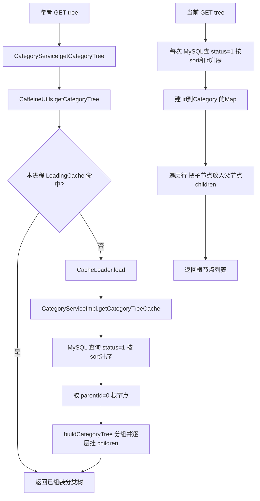
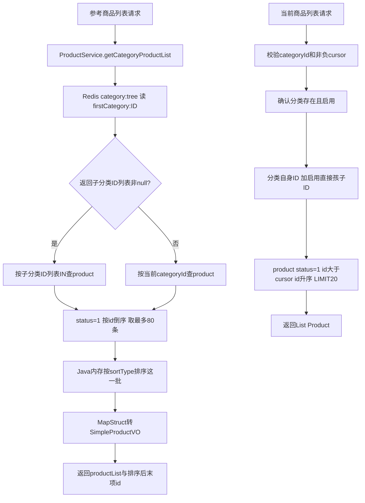
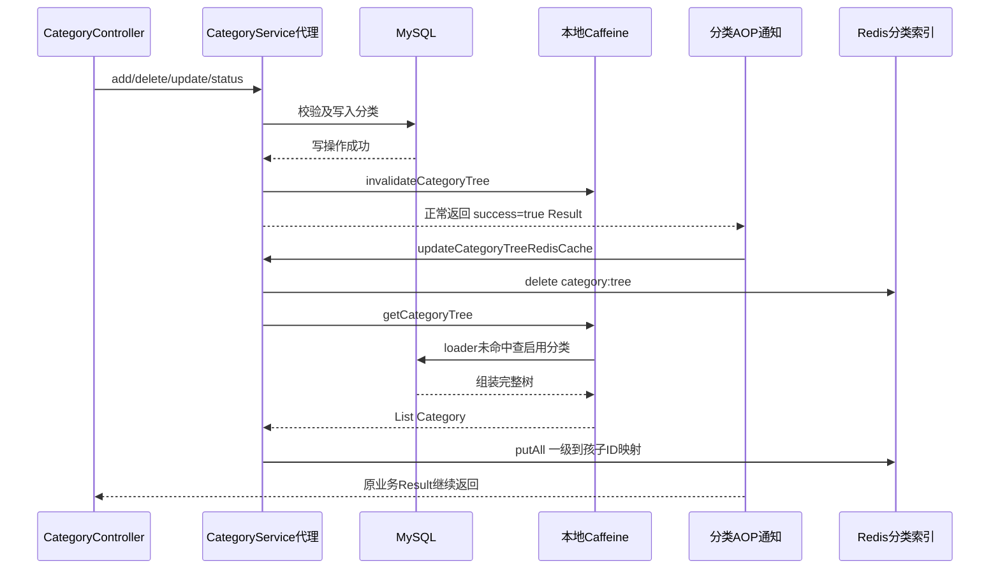
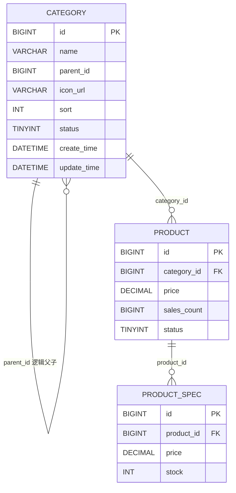

# 分类管理接口：ChestnutShopWX 与 lixiaopu 对比学习笔记

整理日期：2026-10-03。参考项目：`D:/github/project1/ChestnutShopWX`；当前项目：`D:/github/project1/lixiaopu`。依据两个工作区当前源码，未运行应用、执行测试或连接数据库。源码注释保留在 [双项目源码附录](分类管理接口对比源码附录.md)，本文解释实际行为，不把注释、建议和已经实现的功能混为一谈。

当前对应类叫 **AdminCategoryController**，用户端还有 **UserCategoryController**。参考类虽在 admin 包里，但其中 tree、product/list 两个 URL 是公共查询；包名不是访问权限规则。

<a id="navigation"></a>
## 阅读导航

- [已有能力与缺失项](#comparison)
- [接口、DTO、返回结构](#contracts)
- [查询分类树与组树过程](#tree)
- [新增、删除、修改、状态](#crud)
- [分类商品列表与游标](#products)
- [缓存、AOP 和初始化链路](#cache)
- [数据库关系与 SQL](#database)
- [方法参数、返回值及包名](#methods)
- [注解、版本与移植注意点](#annotations)
- [建议补齐顺序和验证用例](#next)

<a id="comparison"></a>
## 1. 你的项目已经有什么，还缺什么

**六个 HTTP 接口已经都有对应实现，缺少的主要是部分行为和配套机制，并非整个分类 CRUD 还没写。**

| 能力 | ChestnutShopWX 当前代码 | lixiaopu 当前代码 | 如何理解差异 |
| --- | --- | --- | --- |
| 分类树 | Caffeine 本地 LoadingCache；未命中查库组树 | 每次查库，Map 关联父子 | 当前能正确查询，缓存是可选性能能力 |
| 新增 | 校验父分类与字段、保留默认值、返回实体 | 已有父级/字段校验，返回实体，有事务 | 核心功能已具备 |
| 删除 | 有子分类/商品拒绝删除 | 同样拒绝，并额外先检查分类存在 | 核心功能已具备 |
| 更新详情 | 非空字段部分更新，允许只改 sort/icon/status | 必须提供有效 name，其他字段选择更新 | 若要对齐参考契约，需支持不带 name 的部分更新 |
| 更新状态 | 返回 `{id,status:"active"/"inactive"}` | 返回完整 Category，status 是 Integer | 响应契约不同，不能直接共用前端解析 |
| sort 校验 | Controller DTO @Min + Service 检查非负 | Service 没检查 sort<0 | 当前确实缺失该校验 |
| Controller 校验 | @Valid、路径/查询参数 @Pattern | 没有这些声明；依赖 Service 校验 | 缺统一入口校验，不代表毫无校验 |
| 名称/图标长度 | 当前分类 Service 未限制长度 | name≤100、iconUrl≤1024 | 你这部分已更贴近当前建表限制 |
| 本地缓存失效 | 四个修改方法成功后 invalidate | 没有分类缓存 | 无缓存时不需要凭空加 invalidate |
| Redis 分类索引 | 一级ID→启用直接子级ID列表 | 无此索引；直接查库取子分类 | 可选加速机制，现实现不依赖它 |
| 分类刷新 AOP | 标记注解+成功返回通知 | 无分类专用注解/切面 | 若引入缓存，才需设计更新机制 |
| 启动预热 | ApplicationRunner 重建 Redis 索引 | 无分类预热 | 现查库方案无需预热即可工作 |
| 商品排序 | default、priceAsc、priceDesc、newest；页内排序 | 仅 default；实际按 ID 升序 | 若需求包括价格/销量/最新，当前缺少 |
| 商品响应 | 非空时 productList+endProductId，VO 列表 | 原始 List<Product> | 缺显式游标和固定分页响应对象 |
| 时间字段填充 | 有 MyMetaObjectHandlerConfig | 当前未找到 MetaObjectHandler | FieldFill 注解本身不实现填充 |
| 分类测试 | 有 CRUD 边界测试及真实 AOP 代理测试 | 未找到分类专项测试 | 参考测试可学习，不能当成你项目已测过 |
| 接口文档注解 | Swagger Tag/Operation | 未使用 | 文档能力，非业务正确性前提 |

建议优先补的是：非负排序校验、更新契约、稳定分页契约及排序、必要的异常处理与测试。Caffeine、Redis、AOP 是学习重点，也可以后续加入；不要为了“文件一样多”给目前的查库方案添加无消费者的缓存。

<a id="contracts"></a>
## 2. 六个接口的参数与返回值

参考源码：[CategoryController](分类管理接口对比源码附录.md#ref-controller)；当前源码：[AdminCategoryController](分类管理接口对比源码附录.md#cur-controller)、[UserCategoryController](分类管理接口对比源码附录.md#cur-user-controller)。

两边 URL 相同；参考类上有 `@RequestMapping("/api")`，方法映射不重复写 /api；当前类没有类级前缀，方法写完整 URL。

| HTTP | 方法签名（两边对应） | 参数来源 | 成功 data |
| --- | --- | --- | --- |
| `GET /api/category/tree` | `Result getCategoryTree()` | 无 | `List<Category>` 树，空为 [] |
| `POST /api/admin/category/add` | `Result addCategory(CategoryDTO dto)` | JSON | 新建 Category |
| `DELETE /api/admin/category/{categoryId}` | `Result deleteCategory(String categoryId)` | 路径 | null |
| `PUT /api/admin/category/{id}` | `Result updateCategoryInfo(String id,CategoryDTO dto)` | 路径+JSON | 参考为稀疏更新实体；当前为加载后修改的实体 |
| `PUT /api/admin/category/{id}/status?status=0` | `Result updateCategoryStatus(String id,String status)` | 路径+查询 | 参考为 id/status Map；当前为 Category |
| `GET /api/category/product/list/{categoryId}/{beginProductId}?sortType=default` | `Result getCategoryProductList(String categoryId,String beginProductId,String sortType)` | 两个路径参数+可选查询参数 | 参考非空为 Map，空为集合；当前为 List<Product> |

所有 Controller 方法源码都写 Result 返回。参考 Result 是 `com.app.uni_app.common.result.Result<T>`，Controller 用了原始类型；当前是 `com.lixiaopu.common.result.Result`，data 类型为 Object。不要将这两个同名类互相 import。

参考商品接口调用 `ProductService.getCategoryProductList`；当前调用 `CategoryService.getCategoryProductList`。当前方法放置不同，但逻辑已经存在，不是缺了 ProductService 就缺此功能。

### 2.1 CategoryDTO 对比

| 字段 | 参考 Java 类型 | 当前 Java 类型 | 作用/约束 |
| --- | --- | --- | --- |
| name | String | String | 分类名；新增都要求非空白，当前 trim 后≤100 |
| parentId | String | Long | 0为一级；正数指向一级父分类；未传新增默认0 |
| iconUrl | String | String | 图标路径；当前限制≤1024；注释“仅一级”没有变成实际校验 |
| sort | Integer | Integer | 越小越靠前；参考要求≥0，当前遗漏该条件 |
| status | Integer | Integer | 0禁用、1启用，允许未传 |

参考新增请求：

```json
{"name":"坚果","parentId":"10","iconUrl":"/images/nuts.png","sort":2,"status":1}
```

当前项目推荐按 Long 契约发送数值：

```json
{"name":"坚果","parentId":10,"iconUrl":"/images/nuts.png","sort":2,"status":1}
```

不要把 Jackson 可能接受数字字符串的宽松转换当成接口必须支持的契约。String→Long 还要校验范围；参考 DTO 正则只能约束格式，超出 Long 仍需 Service 处理。

### 2.2 更新不是完全一样

参考允许：`{"sort":3}`、`{"status":0}`、`{"iconUrl":"/images/new.png"}`，也允许 `{"name":"新名字"}`；至少一个字段非 null。当前 validateFields 强制 name，所以前三种会返回“分类名称无效”。

两边都跳过缺省可选字段，不能仅凭 PUT 就推断为整对象覆盖。参考会新建稀疏实体，将未提供字段明确设为 null，依靠 MyBatis Plus 默认非 null 更新策略跳过；当前先 getById，再修改已加载对象，其他字段保留数据库值。

显式 JSON null 通常也被当作“不修改”，不等于把列清为 NULL；空串 iconUrl 可以写入，两边都没有实际 URL 格式校验。

### 2.3 返回结构与 HTTP 状态

成功外层示例：

```json
{"success":true,"code":200,"message":"操作成功","data":null}
```

参考状态接口的 data：

```json
{"id":"10","status":"inactive"}
```

当前状态接口的 data 是实体，如 `{"id":10,"name":"坚果","parentId":0,"status":0,...}`。Category.status 的类型是 Integer；参考 status 接口的 Map 刻意转成 CommonStatus.value 字符串。

**错误码差异值得单独看源码。** 参考 `Result.error(400,"...")` 选中 int 重载，尝试设置当前 Servlet HTTP 状态为400，同时业务 code=400；`error(Integer,String)` 只设置 body。当前 `Result.error(String)` 返回业务 code=500，不改变 HTTP 状态，所以普通 Service 校验失败通常仍是 HTTP200。

参考 ValidationExceptionHandler 处理 DTO 和方法校验失败；当前 AuthErrorHandler 已处理 MethodArgumentNotValidException，但分类 Controller 未加 @Valid，DTO 也未声明约束，不能认定分类字段已被该处理器统一校验。

### 2.4 访问权限与双启动入口

参考 ShiroConfig 对 `/api/category/**` 设置 anon；分类写接口走 `/api/admin/...`，当前配置中的 `roles[admin]` 规则被注释，最后 `/**` 仅 jwt；CategoryController 没有角色注解。就这条源码链，不能声称“在 admin 包所以已强制管理员角色”。

当前 AuthFilter 对 `/api/admin/**` 认证 ADMIN 身份并检查 admin:access，公共 `/api/category/**` 不在受保护用户路径列表。细粒度 category:add/update/delete 权限目前未在这条分类链路单独检查。

当前 AdminApplication 扫描 admin Controller，默认8082；LixiaopuApplication 扫描 user Controller，默认8081。两边公共查询映射相同但在不同进程里，现扫描配置不会把两个 Controller 同时注册到一个应用。若未来扩大到所有 Controller，一样的 URL 会产生重复映射，需要先调整。

<a id="tree"></a>
## 3. 查询分类树：把平面行变成父子结构

参考核心源码：[CategoryServiceImpl](分类管理接口对比源码附录.md#ref-service-impl)、[CaffeineConfig](分类管理接口对比源码附录.md#ref-caffeine-config)、[CaffeineUtils](分类管理接口对比源码附录.md#ref-caffeine-utils)。当前：[CategoryServiceImpl](分类管理接口对比源码附录.md#cur-service-impl)。



### 3.1 参考 getCategoryTree

签名：`public Result getCategoryTree()`。

第一步：调用 caffeineUtils.getCategoryTree。

第二步：内部 `categoryTreeCache.get("categoryTree")`；命中直接给 List<Category>，未命中由 LoadingCache 执行 loader。

第三步：Result.success(rootCategories) 返回。

这里不读取 Redis。**本地缓存放的是完整分类树，Redis 放的是一级到子级 ID 的索引，二者用途不同。** LoadingCache 的未命中自动加载机制见 [Caffeine 官方说明](https://github.com/ben-manes/caffeine/wiki/Population)。

### 3.2 参考 getCategoryTreeCache 与 buildCategoryTree

签名：`public List<Category> getCategoryTreeCache()`；`private void buildCategoryTree(List<Category> allCategories,List<Category> parentCategories)`。

第一步：lambdaQuery 查 category 的 status=1，按 sort升序取全部有效行。

第二步：stream.filter 选 parentId=0 的一级分类，得到 rootCategories。

第三步：将全部有效行 `Collectors.groupingBy(Category::getParentId)`，形成父ID→孩子列表。

第四步：对这一层每个父节点，按它的 id 从 groupMap 取直接孩子，setChildren。

第五步：把这一层所有孩子加入 nextCategoriesList，递归处理下一层；任一输入集合为空结束。

```java
Map<Long, List<Category>> groupMap = allCategories.stream()
        .collect(Collectors.groupingBy(Category::getParentId));
List<Category> nextCategoriesList = new ArrayList<>();
parentCategories.forEach(category -> {
    List<Category> childrenCategories = groupMap.getOrDefault(category.getId(), new ArrayList<>());
    category.setChildren(childrenCategories);
    nextCategoriesList.addAll(childrenCategories);
});
buildCategoryTree(allCategories, nextCategoriesList);
```

例：行 `(10,parent0)`、`(11,parent10)`、`(12,parent10)`，最终根10的 children=[11,12]。叶子也被设置为空列表。代码每层都重新分组全部行；分类规则限制两层时量小，但可先分组一次再复用。根选择假定 parentId非null，否则 equals 会空指针；孤立节点或没有有效祖先的节点不会从根树返回。

只查启用分类：禁用一级分类后，其启用子分类即使在 SQL 结果中，也没有有效根承载，所以不在返回树中。参考只按 sort 排序，相同 sort 的次序未指定；当前额外按 id 排序更稳定。

### 3.3 当前 getCategoryTree：两次遍历

第一步：查询 status=1，按 sort、id 升序。

第二步：每条行初始化 children=[]，放进 LinkedHashMap<Long,Category> byId。

第三步：再次遍历，parentId=0或null加入 roots；否则找到父对象，将自身放进父的 children。

第四步：返回 roots。

```java
Category parent = byId.get(parentId);
if (parent != null) parent.getChildren().add(category);
```

这里 Map 里的父对象和 roots 中的对象是同一个引用，因此修改 children 后返回根就能看到树。对象挂接不需要每条分类单独查数据库，也不需要递归查询；除数据库排序外，内存主要是两次线性遍历。父节点缺失则该子项不会附到树里。

### 3.4 getCategoryChildren 是额外 Service 能力

参考签名：`Result getCategoryChildren(String categoryId)`。查完整缓存树后仅在根列表中找该ID，必须恰好一个，再返回根.children；不是递归查任意深度分类。本次 CategoryController 没有暴露此方法的 HTTP 接口，不能凭接口声明虚构 `/children` 路由。当前未实现它，若前端直接用 tree 的 children，就未必需要单独补。

<a id="crud"></a>
## 4. 四个写接口逐步解析

### 4.1 新增 addCategory(CategoryDTO)

参考第一步：DTO不为null、name非空白，否则400。

第二步：parentId未传默认0；传了则 parseNonNegativeId 转正/零Long，格式或溢出失败返回400。

第三步：hasValidOptionalFields 检查 sort≥0、status∈{0,1}，允许null。

第四步：validateParentCategory(parentId,null)：0无需查父级；正数查父分类，必须存在且是一级，禁止三级。

第五步：new Category，trim name并设置parent；icon/sort/status仅实际提供时设置，保留实体默认 icon、sort=0、status=1。

第六步：save(category)，返回false给保存错误；成功后 invalidateCategoryTree，最后 Result.success(category)。数据库生成的主键可回填到实体。

第七步：Service的成功返回通知触发，重建Redis分类索引，完成后Controller才拿到结果。

当前：validateFields还检查名称与图标长度、parentId非负、status范围，但漏sort；parentId已经是Long无需String解析。applyFields保留未提供可选默认值；有@Transactional，无本地缓存和分类切面。

注意：两边都不强制父分类启用，不检查同名分类；“有图标仅一级”是注释说明，代码没禁止给二级分类传icon。状态为0的新增可以成功，但不会出现在启用树里。

### 4.2 删除 deleteCategory(String categoryId)

参考第一步：parsePositiveId，把String转换成>0 Long。

第二步：hasChildren：`parent_id=id` 的分类count>0拒绝；没有过滤status，所以禁用子分类也阻止删除。

第三步：productMapper.selectCount，`category_id=id` 任意商品存在则拒绝；没有只检查上架商品。

第四步：removeById；false返回删除错误；true清本地缓存、返回success，AOP刷新Redis索引。

当前：相同关系保护；额外先getById验证分类存在，错误更明确；事务包住检查与删除。

```java
// 当前源码
if (lambdaQuery().eq(Category::getParentId, id).count() > 0) {
    return Result.error("请先删除子分类");
}
if (productMapper.selectCount(Wrappers.lambdaQuery(Product.class)
        .eq(Product::getCategoryId, id)) > 0) {
    return Result.error("分类下仍有商品");
}
```

不是级联删除，也不自动搬迁商品。先检查后删除仍有并发窗口：另一个请求可能新增孩子；普通事务并不等于已锁住父子关系。当前product外键能阻止悬空商品，category.parent_id却没有数据库自引用外键保护，需单独设计并发规则。

### 4.3 更新详情 updateCategoryInfo(String id,CategoryDTO)

参考第一步：校验正ID；DTO至少一个字段非null。

第二步：name若提供则不得空白；parent若提供须可转非负Long；sort/status合法。

第三步：若提供parent，validateParentCategory拒绝自身作父、父不存在、父为二级。

第四步：若要移到其他父级（parent>0），且本分类有孩子，拒绝；有孩子的一级不能整体降为二级。

第五步：构造新Category，setId；每个可选字段都设成DTO值，未提供则null，包括那些原有默认值字段，防止默认值覆盖旧值。

第六步：updateById只更新非null列；false给保存错误，成功清Caffeine、返回这个稀疏实体，AOP刷新Redis。

当前第一步：校验正ID并getById，明确不存在错误。

第二步：validateFields要求name有效；parent未传沿用原记录parentId。

第三步：检查父规则与“有孩子不能降级”；applyFields在原记录对象上改name及提供字段。

第四步：updateById，返回修改后的已加载对象，有事务。

参考返回实体并不意味着所有列都重新查过：未传字段在data中可能为null，即使数据库中有值。当前返回对象信息较完整，但同样不是更新后重新select的数据库快照；时间默认更新等可能尚未反映在返回对象中。

### 4.4 更新状态 updateCategoryStatus(String id,String status)

参考第一步：正ID；status必须严格为"0"或"1"。

第二步：Integer.parseInt转数字；CommonStatus.getValueByNumber转"active"/"inactive"用于返回。

第三步：`lambdaUpdate().eq(Category::getId,categoryId).set(Category::getStatus,statusNumber).update()`，直接UPDATE，不先加载实体。

第四步：失败返回保存错误；成功组id/status Map，清本地缓存，返回后AOP刷新Redis。

当前：正ID及状态校验后getById，setStatus数字，updateById，返回Category；有事务。

两边都只更新当前分类，不递归更新子分类或商品status。禁用一级后树隐藏其子级，**但不等于下属商品已下架**。两边的商品列表仍可能通过直接访问启用子分类查到商品，具体区别见下一节。

<a id="products"></a>
## 5. 分类商品列表：最容易误学的部分

源码：[参考 ProductServiceImpl](分类管理接口对比源码附录.md#ref-product-impl)、[ProductSortTypeEnum](分类管理接口对比源码附录.md#ref-sort)、[CopyMapper](分类管理接口对比源码附录.md#ref-copy)、[SimpleProductVO](分类管理接口对比源码附录.md#ref-product-vo)。本接口没有实际调用ES查询；同一个ProductServiceImpl的其他方法用ES，不能混入这条链路。



### 5.1 参考第一步：Redis判一级/二级

```java
String hashKey = RedisKeyGenerator.categoryTreeHashKey(Long.valueOf(categoryId));
List<Long> secondCategoryIdList = RedisConnector.getHashField(
        RedisKeyGenerator.categoryTreeKey(), hashKey, new TypeReference<>() {});
```

整key=`category:tree`；field=`firstCategory:10`；value=子分类ID列表如[11,12]。TypeReference保留泛型List<Long>给Jackson转换；返回null被当作“不是一级”，不是查数据库确认它真的二级。

Redis缺失、转换失败、索引过时、禁用一级都可能导致这个判断不准确。空列表不是null：如果启用一级没有孩子，查询直接得到空商品列表。参考一级分支只查孩子ID，不包含一级自身ID；虽然实体关系允许商品挂一级，参考会漏掉这些商品。

### 5.2 第二步：两个 getProducts 重载

签名：`private List<Product> getProducts(String categoryId,String beginProductId)`；`private List<Product> getProducts(List<Long> categoryIdList,String beginProductId)`。

单ID用eq(category_id)，列表用in(category_id)；列表为空直接new ArrayList(0)。两者都查status=1。

首次beginProductId="0"：不加ID范围，`ORDER BY id DESC LIMIT 80`。后续：`id < beginProductId`，继续按ID倒序取80。80来自DataConstant.PRODUCT_SCROLL_QUERY_NUMBER。

等价SQL（说明用，实际由Wrapper生成）：

```sql
SELECT ... FROM product
WHERE category_id IN (11,12) AND status=1 AND id < ?
ORDER BY id DESC LIMIT 80;
```

### 5.3 第三步：页内排序、VO与游标

无商品直接 `Result.success(CollectionUtils.emptyCollection())`，data是[]，没有endProductId键。

有商品先ProductSortTypeEnum.getByValue，再stream.sorted调用compare：

| sortType | compare逻辑 | SQL查批次的顺序 |
| --- | --- | --- |
| default | salesCount降序 | 仍是id降序 |
| priceAsc | price升序 | 仍是id降序 |
| priceDesc | price降序 | 仍是id降序 |
| newest | updateTime降序 | 仍是id降序 |

然后 `.map(copyMapper::productToSimpleProductVO)` 去掉Product中的部分非列表字段；MapStruct编译时生成转换实现并注册Spring Bean，不是运行时反射复制。SimpleProductVO仍有id、categoryId、name、image、sellPoint、price、status、viewCount、salesCount、createTime、updateTime。

```java
String endProductId = simpleProductVOs.get(simpleProductVOs.size() - 1).getId().toString();
resultMap.put("productList", simpleProductVOs);
resultMap.put("endProductId", endProductId);
```

非空响应data形状：

```json
{"productList":[{"id":101,"categoryId":11,"name":"示例商品","price":12.90}],"endProductId":"101"}
```

示例VO只列部分字段，完整字段见附录。

### 5.4 参考游标问题：不能照搬

假设某批数据库按id降序读到[105,104,103]，价格排序后变[103,105,104]，返回endProductId=104。下一次查id<104会再次取到103，重复出现。排序仅限这一批，不是全分类商品按价格的全局排序。

即使改成批次最小ID103做游标，只能修复ID批次重复，仍不能实现全局价格排序。正确方向是数据库按请求排序，游标携带排序字段和ID作为稳定组合，比如priceAsc使用 `(price,id)` 及条件 `price>lastPrice OR (price=lastPrice AND id>lastId)`。

参考sortType非法时，有商品才调用getByValue抛IllegalArgumentException；空列表分支可能先返回成功，所以参数校验不是全路径一致。库存、销量、时间为null时compare也可能失败，不能假定VO转换修复数据。

### 5.5 当前实现的完整步骤

第一步：parsePositiveId(categoryId)、parseNonnegativeId(beginProductId)；非法返回业务错误。

第二步：只接受sortType="default"，其他排序直接拒绝，不会悄悄忽略。

第三步：getById检查分类存在且status=1。

第四步：categoryIds先加当前ID；若一级，查它启用的直接子分类加入列表。

第五步：productMapper.selectList，`category_id IN (...) AND status=ACTIVE AND id>cursor ORDER BY id ASC LIMIT20`。

第六步：返回原始List<Product>。

首次cursor=0，按id正序取最早20条；后续前端应取**当前返回批次最后的商品ID**，继续请求。ID升序与id>游标一致，现排序下比参考页内重排更可靠，但没有显式返回nextCursor/hasMore，default语义也不是参考“销量排行”。

当前一级包含自己和孩子，能返回挂在一级下的商品；参考只查孩子。当前二级查询只验证自己的status，不验证父级是否启用；参考二级分支连分类本身status也未查，仅查product.status。若业务要求禁用祖先后整个子树商品不可见，需要两边额外补规则。

<a id="cache"></a>
## 6. 缓存、AOP、启动预热：串起所有文件

对照源码：[标记注解](分类管理接口对比源码附录.md#ref-annotation) · [切面](分类管理接口对比源码附录.md#ref-aspect) · [启动Runner](分类管理接口对比源码附录.md#ref-runner) · [RedisConnector](分类管理接口对比源码附录.md#ref-redis) · [RedisConfig](分类管理接口对比源码附录.md#ref-redis-config) · [Redis键生成器](分类管理接口对比源码附录.md#ref-redis-key)。

### 6.1 缓存装的到底是什么

| 位置 | key/field | value | 读取者 |
| --- | --- | --- | --- |
| Caffeine本进程内存 | categoryTree | 完整 `List<Category>` 树 | getCategoryTree、getCategoryChildren、重建Redis方法 |
| Redis Hash | category:tree / firstCategory:10 | 该启用一级的启用直接孩子ID列表 | ProductService分类商品查询 |

不是“完整分类树先读Caffeine再读Redis最后MySQL”那种三级读取链。参考Caffeine分类Bean只配置initialCapacity(1)、maximumSize(1)，没有分类条目的定时过期或自动refresh；需要主动invalidate，否则直接SQL改库不自动反映到缓存。

### 6.2 updateCategoryTreeRedisCache()

所属参考CategoryServiceImpl，签名 `public void updateCategoryTreeRedisCache()`。

第一步：categoryTreeKey构造category:tree，delete旧key。

第二步：caffeineUtils.getCategoryTree；写方法已经invalidate，通常触发loader重查库组树。

第三步：遍历树根，对每个一级ID生成firstCategory:<id>，children.map(Category::getId)收集直接孩子ID。

第四步：HashMap.put，最后RedisConnector.opsForHash().putAll写整份索引。这里没有设置TTL。

```java
for (Category category : categoryTree) {
    String hashKey = RedisKeyGenerator.categoryTreeHashKey(category.getId());
    List<Long> ids = category.getChildren().stream()
            .map(Category::getId).collect(Collectors.toList());
    map.put(hashKey, ids);
}
RedisConnector.opsForHash().putAll(key, map);
```

空树时旧key被删，空Map不会产生一个有内容的分类Hash，参考没有购物车那样的空标记。delete和putAll不是原子替换，中间读者可能拿不到索引；缓存读取也可能因故障抛异常。此方法不会自己invalidate，所以直接调用它若Caffeine仍陈旧，Redis也会重写陈旧关系。

### 6.3 写接口成功后的真实时序



参考四个修改方法只有Service上有 `@UpdateCategoryTreeRedisCacheAnnotation`，Controller没有，所以这里没有上次购物车笔记里的两层重复通知。

注解文件指定METHOD/RUNTIME；切面 `@Aspect @Component` 注册，Pointcut的@annotation匹配标記。AfterReturning绑定 `Result<?> result`，仅result!=null且success=true才调用刷新。

**这是同步刷新。** 没有延迟队列、后台Job线程或@Async；HTTP响应需要等Redis刷新路径结束。Result.error虽然是正常返回，但通知检查后退出；方法抛异常则不执行AfterReturning。刷新异常没有被切面捕获，可能让请求以异常结束，而数据库分类已经修改；当前参考分类业务方法没有自己声明@Transactional，不能假设缓存失败会回滚此前数据库写入。

### 6.4 @Lazy为什么加在切面构造器参数

```java
public UpdateCategoryTreeRedisCacheAspect(@Lazy CategoryService categoryService) {
    this.categoryService = categoryService;
}
```

提供者 `org.springframework.context.annotation.Lazy`；延后解析注入依赖，减少切面初始化时过早取得正在代理装配的Service的耦合。它不创建异步线程，不是把分类缓存改成“懒查询”开关。

参考源码还有 `CategoryServiceImpl → CaffeineUtils → categoryTreeCache(由CaffeineConfig创建) → CategoryServiceImpl` 的初始化依赖关系；这里只展示源码可见依赖，不断言应用启动验证成功。现有专项测试替换了外部依赖，也不能证明整个缓存配置在默认容器设置下没有循环初始化问题。移植可拆出独立的树加载器，避免整个配置类直接注入整个CategoryServiceImpl。

### 6.5 ApplicationRunner预热

文件CategoryTreeRedisCacheInitRunner，`@Component implements ApplicationRunner`，方法 `void run(ApplicationArguments args)`。

第一步：Spring Boot启动、容器刷新后执行Runner。

第二步：调用categoryService.updateCategoryTreeRedisCache。

第三步：首次加载Caffeine树、写Redis索引，日志记录开始/成功。

不等于@Scheduled定时任务，也不是@PostConstruct；没有不断后台刷新。Runner里的异常没有被捕获，数据库/Redis不可用可能阻断成功启动。它依赖RedisConnector配置已初始化；后者是静态工具，由RedisConfig手工设置template与ObjectMapper引用。

### 6.6 若加到你的双进程项目，需要补完整链路

1. 加Caffeine依赖和树LoadingCache，定义独立树加载器或解开初始化依赖。
2. 增加查询/失效入口，并确定categoryTree与Redis索引的数据结构。
3. 在当前实例RedisConnector上扩展需要的Hash get/类型转换，选择自己的key前缀；不能复制参考static调用后期待现有实例包装器自动兼容。
4. 添加分类标记、切面和updateCategoryTreeRedisCache实现；只标Service写方法。
5. **修改AdminApplication扫描范围。** 当前没有aop/job包，照搬文件进去也不会自动在管理端注册；参考的全包扫描不同。
6. 若保留当前@Transactional，明确在事务成功提交后再失效/刷新缓存，例如发布业务事件并由AFTER_COMMIT监听处理；AfterReturning与事务拦截器的顺序不能靠注解位置假定。
7. 解决8081与8082各自Caffeine的失效传播。管理端只invalidate自己的内存，用户端进程仍可能读旧树。可设计消息通知、版本号校验、合理过期等；只共享Redis并不会自动清除另一个进程的Caffeine。
8. 决定商品查询使用Redis索引还是继续查库；若没有读取者，就没必要每次写操作重建一份无人使用的索引。
9. 预热不是运行时兜底。读索引缺失时要有重新加载/查库策略，不能直接把一级误当二级。

Spring AOP依靠代理，本类内部this调用绕过代理；扫描中的@Service以及来自其他Bean的注入调用是接入前提。见 [Spring代理机制](https://docs.spring.io/spring-framework/reference/6.2/core/aop/proxying.html)。

<a id="database"></a>
## 7. 数据库关系、字段与SQL

参考仓库本次未找到SQL建表文件，因此其关系依据Entity和查询推导，不宣称已核实参考库约束。当前SQL来自 [建表节选](分类管理接口对比源码附录.md#cur-schema)，也未连接实际数据库。



CATEGORY自关联线表示逻辑关系；根parent_id=0没有实际父行。当前category.parent_id未声明FOREIGN KEY，不要从图误读为数据库自引用外键。当前product.category_id有真实外键；product_spec.product_id也有真实外键。分类接口直接涉及category、product，商品规格在本条查询没有联表访问，仅用于说明商品下游关系。

| category字段 | 两边Entity类型 | 当前SQL | 注意 |
| --- | --- | --- | --- |
| id | Long | BIGINT自增PK | 返回实体是数字ID |
| name | String | VARCHAR(100) NOT NULL | 当前Service主动校验长度 |
| parentId | Long | BIGINT NOT NULL DEFAULT0 | DTO参考String，Entity仍Long |
| iconUrl | String | VARCHAR(1024) NULL 默认图 | 图标注释仅一级，代码未限制 |
| sort | Integer | INT NOT NULL DEFAULT0 | SQL未限制非负，不能代替Service校验 |
| status | Integer | TINYINT NOT NULL DEFAULT1 | SQL未声明分类status必须0/1的CHECK |
| createTime/updateTime | LocalDateTime | DATETIME及时间默认值 | FieldFill还需实际Handler等支撑 |
| children | List<Category> | 不存在该列 | @TableField(exist=false)，内存组装 |

当前 `(parent_id,sort)` 有普通索引，不是分类名称唯一索引，没有强制“只能两层”的数据库约束。两级限制由Service检查父分类是不是根实现。两边构树代码可以把脏数据中的更深结构挂接，但写接口不允许正常新建三级；“读取实现可组更深”不等于业务契约允许更深。

关键SQL动作（说明用）：

```sql
-- 当前分类树
SELECT ... FROM category WHERE status=1 ORDER BY sort ASC,id ASC;
-- 禁止删除时检查孩子，包括禁用孩子
SELECT COUNT(*) FROM category WHERE parent_id=?;
-- 检查关联商品，包括下架商品
SELECT COUNT(*) FROM product WHERE category_id=?;
-- 更新状态
UPDATE category SET status=? WHERE id=?;
-- 当前分类商品分页
SELECT ... FROM product
WHERE category_id IN (...) AND status=1 AND id>?
ORDER BY id ASC LIMIT 20;
```

CategoryMapper两边都是BaseMapper<Category>空接口，数据库CRUD由MyBatis Plus及其Service链式包装器提供，不需每个接口都写XML SQL。参考未找到CategoryMapper.xml；当前有resultMap/Base_Column_List，但没有分类树递归SQL，也没有自定义查询statement。

<a id="methods"></a>
## 8. 方法参数、返回值和提供者包

本节只列分类及分类商品链路实际用到的API；附录里大类的其他支付、ES、购物车方法不属于本学习链路。String/Long/Integer/Object来自java.lang，List/Map/HashMap/ArrayList来自java.util。

### 8.1 参考业务与辅助方法

| 类（均以com.app.uni_app开头） | 签名/返回值 |
| --- | --- |
| service.CategoryService / service.impl.CategoryServiceImpl | `Result getCategoryTree()` |
| 同上 | `Result getCategoryChildren(String categoryId)` |
| 同上 | `Result addCategory(CategoryDTO)` |
| 同上 | `Result deleteCategory(String categoryId)` |
| 同上 | `Result updateCategoryInfo(String id,CategoryDTO)` |
| 同上 | `Result updateCategoryStatus(String id,String status)` |
| 同上 | `void updateCategoryTreeRedisCache()` |
| service.impl.CategoryServiceImpl | `List<Category> getCategoryTreeCache()` |
| 同上，private | `void buildCategoryTree(List<Category>,List<Category>)` |
| 同上，private static | `Long parsePositiveId(String)`、`Long parseNonNegativeId(String)`；非法null |
| 同上，private static | `boolean hasValidOptionalFields(CategoryDTO)`、`boolean hasAnyUpdateField(CategoryDTO)` |
| 同上，private | `String validateParentCategory(Long parentId,Long categoryId)`；合法null，否则错误文案 |
| 同上，private | `boolean hasChildren(Long categoryId)` |
| service.ProductService / service.impl.ProductServiceImpl | `Result getCategoryProductList(String,String,String)` |
| service.impl.ProductServiceImpl，private | `List<Product> getProducts(String,String)` / `List<Product> getProducts(List<Long>,String)` |
| common.util.CaffeineUtils | `List<Category> getCategoryTree()` / `void invalidateCategoryTree()` |
| config.CaffeineConfig | `LoadingCache<String,List<Category>> categoryTreeCache()`，@Bean工厂方法；不是查询接口 |
| aop.aspect.business.UpdateCategoryTreeRedisCacheAspect | `void afterReturnSuccess(Result<?> result)`；私有 `void pointCut()` 是命名规则载体 |
| job.init.CategoryTreeRedisCacheInitRunner | `void run(org.springframework.boot.ApplicationArguments args)` |
| infrastructure.redis.generator.RedisKeyGenerator | `String categoryTreeKey()` / `String categoryTreeHashKey(Long firstCategoryId)` |
| infrastructure.redis.connect.RedisConnector | `static <T> T getHashField(String,String,TypeReference<T>)`；此处T=List<Long> |
| 同上 | `static Boolean delete(String)`、`static HashOperations<String,String,Object> opsForHash()` |
| common.mapstruct.CopyMapper | `SimpleProductVO productToSimpleProductVO(Product)` |
| pojo.emums.ProductSortTypeEnum | `static ProductSortTypeEnum getByValue(String)`；非法抛异常 |
| 同上 | `static int compare(Product,Product,ProductSortTypeEnum)`；Comparator比较结果 |
| pojo.emums.CommonStatus | `static String getValueByNumber(Integer)` / `Integer getNumber()` |
| infrastructure.mp.config.MyMetaObjectHandlerConfig | `void insertFill(org.apache.ibatis.reflection.MetaObject)` / `void updateFill(MetaObject)` |

参考包名源码确实是 **pojo.emums**，不是常见的enums拼法；当前是pojo.enums。笔记按原文保留，移植import需要转换。

### 8.2 当前私有方法与差异

以下都在 `com.lixiaopu.service.impl.CategoryServiceImpl`：

| 签名 | 参数作用/返回 |
| --- | --- |
| `String validateFields(com.lixiaopu.pojo.dto.CategoryDTO dto)` | 验证字段，合法null，否则文案；新增更新共享，因此更新必需name |
| `String validateParent(long parentId,Long currentId)` | 检查父节点一级、不能自身为父，合法null |
| `void applyFields(Category category,CategoryDTO dto)` | 修改对象，必设trim后的name，可选字段非null才设置 |
| `Long parsePositiveId(String value)` | >0 Long，否则null |
| `Long parseNonnegativeId(String value)` | Long.parseLong后>=0，否则null；没有正则 |

当前Long解析可接受`+1`、`01`等JDK合法数字串，参考Controller正则拒绝这些格式；业务都要求ID正，但字符串规范不完全一样。参考Service里的isNumeric允许某些不规范输入形态，Controller和Service检查不能当作完全同一算法。

当前公开方法与2节表一致；getCategoryProductList在当前CategoryService声明，参考在ProductService声明。Service继承包的版本差异见9节。

### 8.3 MyBatis Plus提供的方法

| 提供者 | 当前用法与参数类型 | 返回类型 |
| --- | --- | --- |
| `com.baomidou.mybatisplus.core.mapper.BaseMapper<T>` | `selectCount(Wrapper<T>)`、`selectList(Wrapper<T>)` | Long、List<T> |
| Service接口/实现继承契约 | `save(Category)`、`removeById(Serializable id)`、`updateById(Category)` | boolean，写操作成功判断，不是写后的完整行 |
| 同上 | `getById(Serializable id)` | Category或null |
| Service链式查询 | `lambdaQuery()` | `com.baomidou.mybatisplus.extension.conditions.query.LambdaQueryChainWrapper<Category>`，ProductService中T=Product |
| LambdaQueryChainWrapper及父契约 | `eq(SFunction<T,?>,Object)`、`in(SFunction<T,?>,Collection<?>)`、`lt/gt(SFunction<T,?>,Object)`、`orderByAsc/Desc(SFunction<T,?>...)`、`last(String)` | 返回相应链式wrapper |
| 同上 | `list()`、`count()` | List<T>、Long |
| Service链式更新 | `lambdaUpdate()` | `com.baomidou.mybatisplus.extension.conditions.update.LambdaUpdateChainWrapper<Category>` |
| 同上及父契约 | `eq(SFunction<T,?>,Object)`、`set(SFunction<T,?>,Object)`、`update()` | wrapper、wrapper、boolean |
| `com.baomidou.mybatisplus.core.toolkit.Wrappers` | `lambdaQuery(Class<T>)` | `LambdaQueryWrapper<T>`，交给Mapper的条件对象 |
| `com.baomidou.mybatisplus.core.conditions.query.LambdaQueryWrapper<T>` | `eq/in/gt/orderByAsc/last`等 | 返回query wrapper；没有自动查数据库 |

SFunction来自 `com.baomidou.mybatisplus.core.toolkit.support`；Wrapper来自 `com.baomidou.mybatisplus.core.conditions`。`Category::getParentId`等是方法引用，框架解析映射列，不是手写SQL。`last("LIMIT 20")`直接追加SQL尾部，目前用常量，不能把用户sortType直接拼进这里。

### 8.4 Caffeine、Redis、Jackson与集合

| 提供者 | 方法与参数 | 返回值/解释 |
| --- | --- | --- |
| `com.github.benmanes.caffeine.cache.Caffeine` | `newBuilder()`、`initialCapacity(int)`、`maximumSize(long)` | builder及可继续链式配置的builder |
| 同上 | `<K,V> build(CacheLoader<? super K,V>)` | LoadingCache<K,V>；这里K=String,V=List<Category> |
| `com.github.benmanes.caffeine.cache.CacheLoader<K,V>` | `V load(K key)` | 初始加载数据；参考key只接受categoryTree |
| `com.github.benmanes.caffeine.cache.LoadingCache<K,V>` | `V get(K key)` | 命中取值，未命中loader加载 |
| `com.github.benmanes.caffeine.cache.Cache<K,V>` | `void invalidate(Object key)` | 删本进程的一项缓存 |
| `org.springframework.data.redis.core.HashOperations<String,String,Object>` | `Object get(String key,Object hashKey)` / `void putAll(String,Map<? extends String,?>)` | 单field值 / 批量写field |
| `com.fasterxml.jackson.databind.ObjectMapper` | `<T> T convertValue(Object,TypeReference<T>)` | 转成保留泛型的目标；参考转换IllegalArgumentException被捕获返回null |
| `com.fasterxml.jackson.core.type.TypeReference<T>` | 匿名子类`new TypeReference<List<Long>>() {}` | 保留泛型类型信息，不是实体Builder |
| `org.apache.commons.lang3.StringUtils` | `isBlank(CharSequence)`、`isNumeric(CharSequence)`、`equals(CharSequence,CharSequence)`、`equalsAny(CharSequence,CharSequence...)` | boolean；不是当前项目MP同名StringUtils |
| `org.apache.commons.collections4.CollectionUtils` | `isEmpty(Collection<?>)`、`emptyCollection()` | boolean、空Collection<T> |
| `java.util.stream.Collectors` | `groupingBy(Function<? super T,? extends K>)` | Collector，collect后为Map<K,List<T>> |
| 同上 | `toList()` | Collector，交给stream.collect构造List |
| `java.util.stream.Stream<T>` | `filter(Predicate)`、`map(Function)`、`sorted(Comparator)` | 对应Stream；终结操作前不会完成整条处理 |
| 同上 | `collect(Collector)`、`toList()` | 集合结果；Stream.toList不可修改 |
| `java.util.Collection<E>` | `stream()`、`isEmpty()`、`size()`、`addAll(Collection<? extends E>)` | Stream<E>、boolean、int、boolean |
| `java.util.List<E>` | `get(int)`、`add(E)`、`forEach(Consumer<? super E>)` | E、boolean、void |
| `java.util.Map<K,V>` | `get(Object)`、`put(K,V)`、`getOrDefault(Object,V)` | V、旧V或null、V；默认值不自动写回Map |
| `java.lang.Long` | `valueOf(String)`、`parseLong(String)` | Long、long；溢出或格式错误抛NumberFormatException |
| `java.lang.Integer` | `parseInt(String)`、`toString(int)` | int、String |
| `java.lang.String` | `trim()`、`isBlank()`、`length()` | String、boolean、int |
| `java.util.Objects` | `isNull(Object)` | boolean |
| `java.lang.Boolean` | `Boolean.TRUE.equals(Object)` | boolean，null也安全 |

参考 `ProductSortTypeEnum.compare` 调用Long/BigDecimal/LocalDateTime.compareTo，返回int，供Comparator决定先后。没有查询额外数据库；这些字段来自先前Product行。

### 8.5 Lombok生成方法也要认出类型

两边Category getter/setter由@Data生成：getId/getParentId→Long；getName/getIconUrl→String；getSort/getStatus→Integer；getChildren→List<Category>；getCreateTime/getUpdateTime→LocalDateTime；setter返回void。

DTO getter同理，只有parentId两项目类型不同；Product.getId/getCategoryId/getSalesCount→Long，getPrice→BigDecimal，getUpdateTime→LocalDateTime。SimpleProductVO.getId→Long。Category.Fields.id/status是@FieldNameConstants生成的String常量，不是方法，也不是数据库列名转换器。

<a id="annotations"></a>
## 9. 注解、依赖与移植注意点

| 注解 | 提供包 | 分类链路作用 |
| --- | --- | --- |
| RestController、RequestMapping、Get/Post/Delete/PutMapping、RequestBody、PathVariable、RequestParam | `org.springframework.web.bind.annotation` | URL、JSON、路径与查询绑定 |
| Valid | `jakarta.validation` | 级联校验DTO；本身不代表name必须非空 |
| NotBlank、Pattern、Min、Max | `jakarta.validation.constraints` | 约束声明；参考name没@NotBlank，Service补检查 |
| Resource | `jakarta.annotation` | 参考依赖注入，通常按名称匹配再兼顾类型 |
| Autowired | `org.springframework.beans.factory.annotation` | 当前按类型注入 |
| Service、Component | `org.springframework.stereotype` | 注册业务、缓存工具、切面、Runner等Bean |
| Configuration、Bean、Lazy | `org.springframework.context.annotation` | 缓存工厂、组件配置、延后解析依赖 |
| Aspect、Pointcut、AfterReturning | `org.aspectj.lang.annotation` | 修改成功后刷新分类索引 |
| Target、Retention | `java.lang.annotation` | 自定义标记限制方法与运行时保留 |
| Transactional | `org.springframework.transaction.annotation` | 当前四个写业务方法的事务 |
| TableName、TableId、TableField | `com.baomidou.mybatisplus.annotation` | 表映射、自增ID、忽略children、填充声明 |
| Data | `lombok` | 编译生成访问器等 |
| FieldNameConstants | `lombok.experimental` | 生成Category.Fields常量；不是指定表名，原注释不准确 |
| Tag、Operation、Schema | `io.swagger.v3.oas.annotations.tags` / `io.swagger.v3.oas.annotations` / `io.swagger.v3.oas.annotations.media` | 参考API文档，不实现权限和业务校验 |
| Mapper、Mapping | `org.mapstruct` | 编译生成Product→VO转换；与MyBatis Mapper不是同一注解 |
| RestControllerAdvice、ExceptionHandler | `org.springframework.web.bind.annotation` | 统一异常响应 |
| Order | `org.springframework.core.annotation` | 参考异常Advice优先级，值小者优先；别误当分类显示sort |

直接在方法参数上声明Pattern等约束时，Spring MVC 6.1+支持方法校验，无需机械地给Controller加类级@Validated；DTO校验与方法参数校验可能分别抛MethodArgumentNotValidException和HandlerMethodValidationException。当前若补入口约束，也应补后一种统一处理。见 [Spring MVC校验文档](https://docs.spring.io/spring-framework/reference/6.2/web/webmvc/mvc-controller/ann-validation.html)。

参考Boot3.3.0、MyBatis Plus3.5.6：IService/ServiceImpl在`com.baomidou.mybatisplus.extension.service`及其impl；当前Boot3.5.16、MP3.5.17：对应在`com.baomidou.mybatisplus.spring.service`及impl。复制参考import不一定适配当前版本。当前pom已有aop/validation/redis依赖，没有Caffeine与MapStruct；若学习移植这些功能需补匹配依赖及MapStruct注解处理器，不能只复制.java。

参考有MyMetaObjectHandlerConfig严格填充LocalDateTime；当前没有。注意参考updateFill使用strictUpdateFill，非null已有字段并不保证每次强制覆盖；lambdaUpdate不传实体时自动填充也不能一概认定触发。不要把FieldFill注解理解为每种更新方式都已写好时间。

原始注释还需这样读：Category.status是Integer，旁边“使用Boolean”是旧备注；支持两级是业务校验，不是Java children列表只容纳一层；serialVersionUID只是JDK序列化兼容机制的一部分，不是所有缓存格式兼容的保证。参考RedisConfig注册JavaTimeModule，当前RedisConnector用默认JSON serializer，移植带LocalDateTime的对象缓存前要核实序列化配置。

<a id="next"></a>
## 10. 可以按什么顺序补齐

以下是建议代码和契约，不是本次修改；本次只生成笔记与源码附录。

### 10.1 先补明确缺失的字段校验

当前validateFields可增加：

```java
// 建议插入现有字段校验方法
if (dto.getSort() != null && dto.getSort() < 0) {
    return "分类排序不能小于0";
}
```

若新增/更新都继续要求name，可给当前DTO加@NotBlank/@Size(max=100)、sort加@Min(0)、status加@Min(0)@Max(1)，Controller请求体加@Valid。若要支持部分更新，则拆CreateCategoryDTO/UpdateCategoryDTO或校验分组，不能给共享name加@NotBlank后期待只改sort的请求通过。

### 10.2 明确详情更新契约

若对齐参考“至少一个待改字段”，将新增校验与更新校验拆开：新增必须name；更新仅name存在才验证，并检查至少一个字段提供。可继续沿用当前先加载旧实体的做法；不必为了像参考而强制用稀疏实体。

### 10.3 固定商品分页响应

建议统一为 `{productList:[],nextCursor:null,hasMore:false}` 这类明确结构，空页与非空页字段一致。保持现ID升序时，nextCursor取返回最后ID；若需要销量/价格/最新全局排序，则SQL排序与组合游标一起设计，不复制参考页内sorted+末项ID。

VO与MapStruct是两件事：可先定义列表VO并手工转换，明确哪些字段返回；MapStruct只是减少复制代码的工具。

### 10.4 再设计缓存及事务边界

如果分类量小、查询压力低，可以保留当前每次查库。决定加缓存后，先画清读者、写者、失效传播，再加切面和预热。尤其管理端与用户端两个进程，必须确定哪次写入如何使两个本地缓存都失效，以及刷新失败如何重试。

当前@Transactional保护数据库操作，返回Result.error不会自动触发回滚；大多数校验是在写入前做，因此尚未写库。若以后写库后遇错误还返回Result.error，需明确回滚语义，不能假定success=false就回滚。

### 10.5 验证清单

| 用例 | 预期/要核实的行为 |
| --- | --- |
| 新增一级、二级 | 默认父0，二级父必须存在且为一级 |
| 父=自身、二级作父 | 拒绝，不能产生三级/环 |
| name空白、超长；sort=-1；status=2 | 明确校验错误；当前sort=-1是待补点 |
| 删除有禁用孩子或下架商品的分类 | 仍拒绝删除 |
| 只传sort更新、空对象更新 | 依选定的部分更新契约验证；两项目目前行为不同 |
| 禁用一级、查询tree与子级商品 | 树隐藏子级；是否允许直接访问商品需制定规则 |
| 查询不存在/禁用分类 | 当前明确拒绝；参考二级分支需补分类有效性检查 |
| 商品空页、连续两页 | 空页结构一致，游标方向正确，无重复 |
| 价格/销量排序跨多页 | 验证全局排序，不只验证单页看起来有序 |
| 缓存写后查询 | 本实例及另一个进程都应最终反映变更 |
| Redis失败、缓存索引不存在 | 不应误判分类层级，失败响应与数据持久状态需一致说明 |
| 真实Spring代理调用成功/失败/异常 | 只对标记Service的成功返回刷新，不重复触发 |

参考专项测试已覆盖二级新增、拒绝三级、部分更新未传字段为null、非法状态，以及切面对成功/错误/异常/未标记方法的区别。它们并未覆盖分类商品分页、真实Redis、全应用启动、双进程失效等；本次没有运行这些测试。

## 11. 用一次分类调整把链路串起来

1. 创建根分类10和孩子11：数据库category保存两行，11.parent_id=10。
2. 参考写成功先失效本进程Caffeine；Service返回触发AOP，加载新树并重写Redis `category:tree / firstCategory:10 → [11]`。当前则直接写库，下次tree重新查库。
3. 查询树：参考返回本地树；当前即时组树；children不是数据库列。
4. 商品100挂category_id=11。参考请求分类10商品，会取Redis里的[11]再查MySQL；当前先查10与启用孩子11，再以[10,11]查MySQL。
5. 修改分类名：参考能只提交name，也能只提交sort；当前目前更新必须name。
6. 禁用10：树看不到它及其孩子，但这不自动禁用11或商品100；直接请求11商品的可见性需要另外定义。
7. 删除10：只要11仍存在，都会拒绝；删除11前也要先处理商品100，不会自动级联删商品。

对照具体语句时，可在 [源码附录](分类管理接口对比源码附录.md) 直接跳转两项目同名实现。附录保留原始import和注释，便于区分框架API、项目自己的方法与建议代码。
