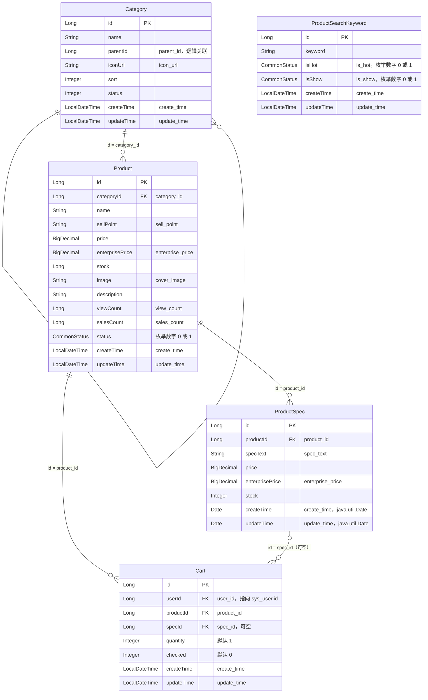
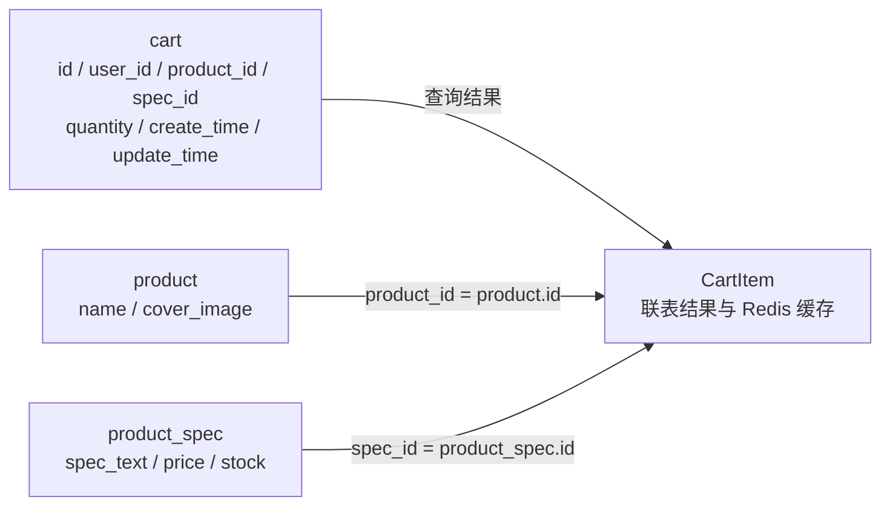

# 商品与购物车实体关系

依据当前 `src/main/java/com/lixiaopu/pojo/entity` 中的 Cart、Product、Category、CartItem、ProductSpec、ProductSearchKeyword，以及 `CartMapper.getCartList` 和 `CartServiceImpl`。Java 字段及注解决定映射；数据库脚本仅用于核对 SQL 类型、长度、精度和约束。实体未指定 String 长度、BigDecimal 精度或非空约束，不应凭 Java 类型推导这些限制。

六个类对应五张持久化表。CartItem 虽然标注 `@TableName("cart")`，实际用于联表查询结果和 Redis 缓存，没有独立的 `cart_item` 表，也没有 `cart_id` 字段。Cart 本身就是购物车条目，每行记录用户的一件商品及规格。

## 持久化表关系图

图中展示全部持久化字段，类型为 Java 实体类型。FK 表示关联字段；分类 parentId 是逻辑自关联，顶级分类以 0 表示，不是现有 SQL 的物理外键。

ProductSearchKeyword 没有 productId 或其他指向商品、分类、规格、购物车的字段，是独立的搜索关键词表。关键词用于搜索不代表外键关联，不能虚构商品与关键词的中间表。

## 关联字段

| 来源字段（Java / SQL） | 目标 | 关系与说明 |
| --- | --- | --- |
| Category.parentId / category.parent_id | Category.id / category.id | 子分类指向父分类；父分类有多个子分类，0 为根标记 |
| Product.categoryId / product.category_id | Category.id / category.id | 一个分类有多个商品 |
| ProductSpec.productId / product_spec.product_id | Product.id / product.id | 一个商品有多个规格 |
| Cart.productId / cart.product_id | Product.id / product.id | 一个商品可被多个购物车条目引用 |
| Cart.specId / cart.spec_id | ProductSpec.id / product_spec.id | 一个规格可被多个条目引用；Cart 注释允许空规格 |
| Cart.userId / cart.user_id | SysUser.id / sys_user.id | 一个用户有多个购物车条目；用户表在本图范围之外 |

单独的 product_id、spec_id 外键不会保证规格属于同一商品。当前服务补全 CartItem 时从对应商品的 specList 中匹配 specId；图中不虚构复合外键。当前服务要求有效规格，比 Cart 实体及 SQL 的可空约定更严格。

## CartItem 的全部字段及来源

| CartItem 字段 | Java 类型 | 查询来源 / 含义 |
| --- | --- | --- |
| id | String | cart.id（BIGINT 查询后转换为字符串） |
| userId | String | cart.user_id |
| productId | String | cart.product_id；逻辑指向 Product.id |
| specId | String | cart.spec_id；逻辑指向 ProductSpec.id |
| quantity | Integer | cart.quantity |
| price | BigDecimal | product_spec.price |
| stock | Integer | product_spec.stock |
| productName | String | product.name AS product_name |
| productImage | String | product.cover_image AS product_image |
| specText | String | product_spec.spec_text |
| createTime | LocalDateTime | cart.create_time |
| updateTime | LocalDateTime | cart.update_time |

CartMapper 还查询了 cart.checked，但 CartItem 没有 checked 字段，不能将其列入 CartItem。服务持久化时将 CartItem 的字符串 ID 转为 Long，构造 Cart 保存；因此不能按 CartItem 的 String ID 将 cart 或商品主键改为 VARCHAR，也不能将联表展示字段追加到 cart。

## 不落库的实体字段

| 实体 | 字段 | Java 类型 | 说明 |
| --- | --- | --- | --- |
| Category | children | List&lt;Category&gt; | `@TableField(exist = false)`；子分类树 |
| Product | isCollection | Integer | `@TableField(exist = false)`；当前用户是否收藏 |
| Product | imageUrls | List&lt;String&gt; | `@TableField(exist = false)`；商品图册 |
| Product | specList | List&lt;ProductSpec&gt; | `@TableField(exist = false)`；按 product_id 聚合规格 |

serialVersionUID 是静态序列化常量，不是表字段。

## Java 与 SQL 类型对照

以下 SQL 类型来自当前建表脚本，已检查与持久化实体兼容；不是用数据库字段倒推实体。

| 表 | Java 字段 | Java 类型 | SQL 字段与类型 |
| --- | --- | --- | --- |
| category | id, parentId | Long | id, parent_id：BIGINT |
| category | name | String | name：VARCHAR(100) |
| category | iconUrl | String | icon_url：VARCHAR(1024) |
| category | sort / status | Integer | sort：INT / status：TINYINT |
| category | createTime, updateTime | LocalDateTime | create_time, update_time：DATETIME |
| product | id, categoryId, stock, viewCount, salesCount | Long | id, category_id, stock, view_count, sales_count：BIGINT |
| product | name / sellPoint / image / description | String | name：VARCHAR(128) / sell_point：VARCHAR(255) / cover_image：VARCHAR(1024) / description：LONGTEXT |
| product | price, enterprisePrice | BigDecimal | price, enterprise_price：DECIMAL(10,2) |
| product | status | CommonStatus | status：TINYINT；按 @EnumValue number 存储 0/1 |
| product | createTime, updateTime | LocalDateTime | create_time, update_time：DATETIME |
| product_spec | id, productId | Long | id, product_id：BIGINT |
| product_spec | specText | String | spec_text：VARCHAR(255) |
| product_spec | price, enterprisePrice | BigDecimal | price, enterprise_price：DECIMAL(10,2) |
| product_spec | stock | Integer | stock：INT |
| product_spec | createTime, updateTime | java.util.Date | create_time, update_time：DATETIME（不能误标为 SQL DATE） |
| cart | id, userId, productId, specId | Long | id, user_id, product_id, spec_id：BIGINT |
| cart | quantity / checked | Integer | quantity：INT / checked：TINYINT |
| cart | createTime, updateTime | LocalDateTime | create_time, update_time：DATETIME |
| product_search_keyword | id | Long | id：BIGINT |
| product_search_keyword | keyword | String | keyword：VARCHAR(128) |
| product_search_keyword | isHot, isShow | CommonStatus | is_hot, is_show：TINYINT；按 @EnumValue number 存储 0/1 |
| product_search_keyword | createTime, updateTime | LocalDateTime | create_time, update_time：DATETIME |

Integer 可映射 TINYINT 或 INT；不应仅因为 Java 使用 Integer 就扩宽状态列。CommonStatus 的 active/inactive 是 JSON 字符串表示，数据库存其 number，而不是字符串。

## 数据库一致性修正

已修正完整建表脚本，并提供已有数据库迁移 `docs/sql/06-align-commerce-entity-defaults.sql`：

| 字段 | 修正前的建表默认值 | 实体默认值与修正后的默认值 |
| --- | --- | --- |
| cart.checked | 1 | 0 |
| category.icon_url | NULL | /static/images/default-category.png |

迁移只修改默认值，保留已有数据与列的可空规则。实体的初始化值不会自动约束已有数据，Lombok Builder 也不保证采用字段初始化值；当前购物车同步服务显式设置 checked=0。

2026-10-02 已连接本机 `localhost:3306/lixiaopu`，使用 information_schema.COLUMNS 和 SHOW CREATE TABLE 核对上述五张表的字段、类型与关联约束。实际数据库不存在 cart_item 表；除上述两处默认值外，持久化字段及类型与实体兼容。已执行迁移并查询验证：cart.checked 默认值为 0，category.icon_url 默认值为 /static/images/default-category.png，原有类型与可空规则保留。
