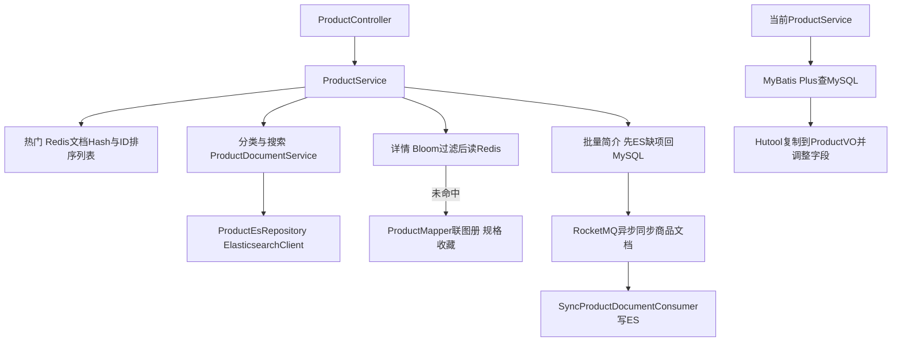
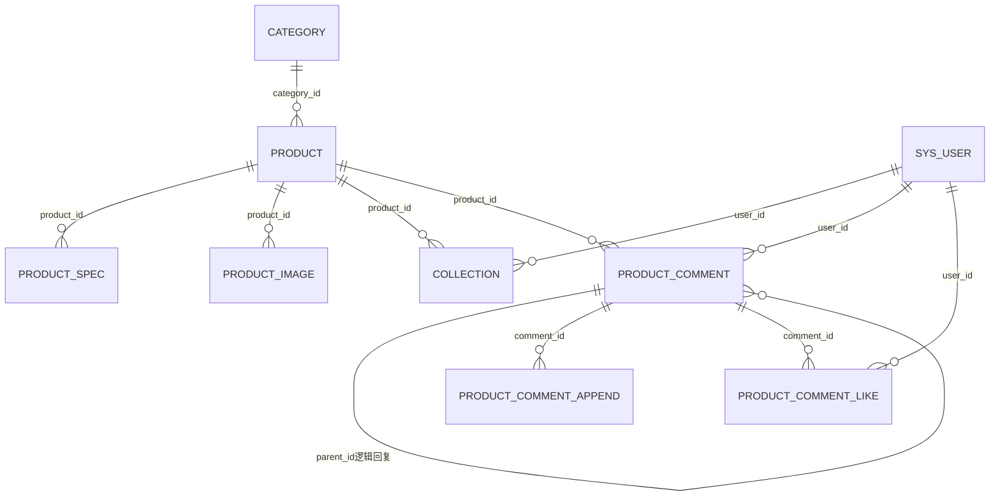

# ProductController 商品接口对比学习笔记

日期：2026-10-03。参考工作区 `D:/github/project1/ChestnutShopWX`，当前工作区 `D:/github/project1/lixiaopu`。本次仅阅读代码、编写笔记，未启动应用、调用接口或验证外部数据库/Redis/ES/MQ。**完整源码与原注释收录在本文件末尾**，可按锚点跳转；示例参数不代表数据库真实数据。

参考Controller位于admin包，但主要提供公共商品查询、用户评论和搜索词维护，没有新增/修改/删除商品的商品CRUD接口。当前admin与user包都有ProductController，两者通过不同启动类分开扫描。

导航：[对比与缺失](#compare) · [19个接口](#api) · [商品查询步骤](#queries) · [关键词与评论](#comments) · [数据表](#tables) · [方法与注解](#types) · [补齐顺序](#next) · [完整源码](#sources)。

<a id="compare"></a>
## 1. 当前能力与差异

| 能力 | 参考项目 | 当前项目 | 判断 |
| --- | --- | --- | --- |
| 热门商品 | Redis热门文档及ID排序列表；启动由ES预热 | MySQL按salesCount、id倒序查，上限100 | 已有核心功能，路由及返回VO不同 |
| 商品详情 | MySQL联图册/规格/收藏，Redis缓存，Bloom过滤 | getById后转ProductVO，检查上架 | 基础详情已具备，图册/规格/用户收藏展示缺失 |
| 分类商品 | ES组合游标；另有CategoryController的SQL查询 | POST分页查询；CategoryService另有ID游标查询 | 当前已有查询，不等价参考ES游标 |
| 搜索 | ES按名称匹配、销量/价格/更新时间排序游标 | MySQL name或description LIKE，页码分页 | 已有基础搜索，排序与游标契约不同 |
| 批量简介 | 按输入ID顺序组装，ES缺项回源MySQL并MQ补索引 | 无该HTTP接口/方法 | 确实缺少批量接口 |
| 相关商品 | 商品名关键词查ES，排除完全同名项 | 无 | 缺少 |
| 指定规格价格 | productId/specId查询规格VO | CartService内部已有商品/规格校验，但无对应商品接口 | 缺对外接口，不是完全没有规格模型 |
| 随机滚动推荐 | 随机初始ID、ES ID升序查询后打乱返回 | 无 | 可选推荐能力 |
| 热门搜索词 | Caffeine缓存、随机取5；管理员批量替换 | 有ProductSearchKeyword实体，无该Service/Controller链路 | 缺业务实现 |
| 评论/回复/追评/计数/点赞 | Controller→CommentService→MySQL/Redis/定时消费/MQ | 有相关实体，未找到评论Service/接口 | 缺完整业务链路 |
| ES/MQ/Bloom | 相关Repository、消费者、预热 | 当前未建立这些实现 | 配套架构能力，非基础商品查询必须依赖 |
| 商品管理CRUD | 这个参考Controller也没有 | 当前Controller也没有 | 不能将本次接口当作商品CRUD模板 |

当前admin Controller完整路径是 `/api/products/product/hot`，不是参考的 `/api/product/hot`；详情当前为 `/api/products/{id}`，参考为 `/api/product/detail?productId=...`。当前公共路由不含 `/api/admin`，AuthFilter不能因Java包名自动赋予管理员权限。

<a id="api"></a>
## 2. 接口契约清单

参考 [Controller源码](#src-ref-controller) 有类前缀/api，以下写完整URL。所有返回外层是参考 `com.app.uni_app.common.result.Result<T>`；具体data见表。GET中的CursorCommonEntity没有@RequestBody，按模型绑定从查询参数赋值；不要改成JSON请求体调用。

| 编号/HTTP与URL | Controller方法及参数Java类型 | 参数来源 | data |
| --- | --- | --- | --- |
| P1 GET /api/product/hot | getHotProduct(Integer limit) | query，默认10 | List<SimpleProductVO> |
| P2 GET /api/product/brief/list | getBriefProduct(String productIds) | query逗号ID，默认空串 | List<SimpleProductVO>，可能含null |
| P3 GET /api/product/detail | getProductDetail(String productId,String userId) | query productId；可选X-User-Id header | Product，含图册/规格/收藏标识 |
| P4 GET /api/product/categroy/list | getCategorySimpleProduct(CursorCommonEntity,Long categoryId,boolean isFirstCategoryId) | query/model | CursorCommonResult |
| P5 GET /api/product/search | searchProductList(CursorCommonEntity,String keyword) | query/model | CursorCommonResult |
| P6 GET /api/product/related | getProductRelated(String productName,Integer limit) | query，limit默认10 | List<SimpleProductVO> |
| P7 GET /api/product/spec/price | getProductSpecPrice(String productId,String specId) | query | ProductSpecVO或错误；特定分支直接null |
| P8 GET /api/product/scroll/query/list | getSimpleProductByScrollQuery(Long beginId,Integer querySize) | query，querySize默认80 | SimpleCursorCommonResult |
| P9 GET /api/product/user/keyword/list | getProductSearchKeywordListUser() | 无 | List<String>，最多5 |
| P10 GET /api/product/admin/keyword/list | getProductSearchKeywordListAdmin() | 无 | List<ProductSearchKeyword> |
| P11 PUT /api/product/admin/keyword/update | updateProductSearchListAdmin(List<ProductSearchKeyword>) | JSON数组 | null |
| P12 POST /api/user/product/comment/firstComment/show | getProductCommentBySortType(CursorCommonEntity,String productId) | JSON游标+query商品ID | CursorCommonResult |
| P13 POST /api/user/product/comment/secondComment/show | getSecondComment(String firstCommentId,CursorCommonEntity) | query评论ID+JSON游标 | CursorCommonResult |
| P14 GET /api/user/product/comment/appendComment/show | getAppendComment(String firstCommentId) | query | ProductAppendCommentVO |
| P15 POST /api/user/product/comment/firstComment/save | saveProductFirstComment(FirstProductCommentDTO) | JSON @Valid | null |
| P16 POST /api/user/product/comment/secondComment/save | saveProductSecondComment(SecondProductCommentDTO) | JSON @Valid | null |
| P17 POST /api/user/product/comment/firstComment/append | appendProductFirstComment(AppendProductFirstCommentDTO) | JSON @Valid @NotNull | null |
| P18 GET /api/user/product/comment/count/show | getProductCommentCount(String productId) | query | String计数，比如"12" |
| P19 PUT /api/user/product/comment/like | updateProductCommentLike(String productCommentId,Integer isLike,Integer isFirstComment) | query，三个非空约束 | null |

P4路径源码拼成 **categroy**，必须按真实路径调用。P6文档写“商品ID关联分类”，实际参数是productName且实现按名称查ES，不按分类查。

参考ShiroConfig把 `/api/product/**` 设anon，P10/P11也落在这个匹配范围；Controller没有角色注解，路径里的admin字样并不保护关键词管理。用户评论路径 `/api/user/...` 走认证规则，仍需Service检查资源归属。当前两启动类若未来同时扫描所有Controller，会因同URL产生重复映射。

### 2.1 参数对象与返回对象

CursorCommonEntity在 `com.app.uni_app.common.result`：sortType:String（@NotNull）、sortValue:String、sortId:Long、querySize:Integer（字段默认20，缺范围约束）。default/priceAsc/priceDesc/newest用于商品排序；评论使用另一套default/isGoodReview/isAppendComment，不能混用。

```text
首次搜索：GET /api/product/search?keyword=栗子&sortType=priceAsc&querySize=20
后续：保留同keyword/sortType/querySize，带上上页sortValue与sortId
```

返回CursorCommonResult含list:List<?>、isEnd:Boolean、cursorCommonEntity。SimpleCursorCommonResult含list:List<?>、isEnd:Boolean和simpleCursorCommonEntity；后者字段为sortValue:String、sortId:Long、querySize:Integer，getQuerySize()在null时返回20。

FirstProductCommentDTO：productId/productSpecId/productSpecText/orderNo/userNickname/userAvatar/content均String且@NotBlank；imageUrls:String（JSON文本，不是List）；rating:int、isAnonymous:int，没有评分/0与1范围注解。

SecondProductCommentDTO：productId、productSpecId、parentId、userNickname、userAvatar、content、replyUserId、replyUserNickname为String；isAnonymous:Integer有@NotNull；content非空且≤500，昵称≤20；parentId未声明必填，但Service要求能找到父评论。

AppendProductFirstCommentDTO：productId、orderNo、content、imageUrls均String，没有字段约束，所以Controller写@Valid不意味着这些字段已验证。

当前ProductQuery继承PageQuery：categoryId:Long、keyword:String；pageNo/pageSize:Integer默认1/10，sortBy:String、asc:Boolean。PageQuery有范围注解，但当前ProductController没有@Valid触发。当前ProductVO的coverImage:String、status:Integer；参考SimpleProductVO使用image:String、CommonStatus枚举status（JSON字符串），不宜混用字段解析。

<a id="queries"></a>
## 3. 商品查询逻辑：第一步到返回



### P1 热门商品

第一步：Controller把默认10的Integer limit给ProductService.getHotProduct。

第二步：Service检查不超过RedisCacheCountProperties.hotProductCacheSize；参考redisCache.yml为20，但未拒绝负数/null等所有边界。

第三步：ProductRedisCacheService读热门ProductDocument Hash及独立的排序ID列表；以ID→文档Map按列表顺序恢复排名，再stream.limit(limit)。

第四步：Controller用EsCopyMapper.ProductDocumentToSimpleProductVO逐条转换，Result.success。

初始化：HotProductInitRunner启动从ES按销量取设定数量，写文档Hash和ID列表；Redis实现利用Redisson bucket标记读写状态、主副本切换。这些标记不是可直接宣称互斥可靠的锁。读取失败可能返回null，排序ID和文档不同步也可能出现null，Controller转换不能自动补齐。

当前第一步限制limit在1到100；第二步MySQL只查上架，按销量降序+ID降序；第三步toVO返回列表，无缓存依赖。已能热门排序，不必仅为这一步直接接入ES/MQ。

### P2 批量简介

第一步：空白productIds直接返回[]；逗号拆分转Long列表，没有完整正ID/数量限制。

第二步：建ID→null Map，ES批量查文档并转VO回填；按输入ID顺序组织结果。

第三步：仍为null的ID批量交ProductMapper.getBriefProduct，只查上架商品；数据库回填后的Product转VO。

第四步：asyncSaveProductDocumentBySendMqMessage通知补ES，返回按原输入顺序的List。数据库也不存在的ID保留null，并非必然删掉或整体报错。

MQ：Product→ProductDocument，asyncSend；失败递归重试，总发送最多3次，最后存MqConsumerFailedMsg；消费者batchSaveProductDocument写ES。发送成功回调不等于ES已同步完成，回源仅补当前缺项，不保证所有索引已最新。

### P3 详情：公共数据与用户数据分开

第一步：productId非空；Long转换后BloomFilterUtils.contains，未包含直接错误。Bloom由启动Runner加载上架商品ID，新增上架还需持续更新，不能把未维护的过滤器当真相。

第二步：userId空白转-1；读商品详情Hash与收藏用户集合。

第三步：详情Hash为空，SQL联product_image、product_spec、collection，检查product.status=1。无商品写单字段ID空对象标记并返回错误；此分支未设置过期时间。

第四步：有商品返回本次用户的收藏状态，但写共享详情缓存时把isCollection置0，防止把一个人的状态作为公共字段缓存。

第五步：缓存命中时，缺收藏Set则查collection表，缓存用户集合；用userId membership重新填isCollection，返回Product。

注意：收藏Set缺失分支错误地给productDetailKey设置收藏TTL，而不是productCollectionKey；首次缺商品标记走StringRedisConnector、后续读走JSON RedisConnector，序列化格式也要一致。X-User-Id是客户端可伪造header，不是认证身份，不能当授权依据。

SQL联多张一对多表会产生图册×规格行组合，MyBatis collection结果映射需正确去重；展示imageUrls/specList/isCollection均非product表的独立持久化列。

当前详情只getById、检查ACTIVE、BeanUtil复制到ProductVO；image→coverImage、枚举number→Integer显式补齐。当前没有加载图册和规格到VO；但CartService的新建条目会批量查规格，属于另一条链路。

### P4 分类游标和 P5 搜索游标

P4第一步：解析sortType/排序值/ID/querySize；newest的日期转合适格式。第二步：ProductDocumentService根据isFirstCategoryId选择Redis一级子ID列表或当前categoryId；缺游标走首次查询，有sortValue及ID走后续查询。第三步：Repository向ES按排序字段和ID升序作为第二排序发送search_after。第四步：Service取末项的排序值和ID封装下一游标，转VO；少于querySize设isEnd=true，恰好一整页还需下次查询确认结束。

P5第一步：ParamCheckAspect在代理调用前检查参数空值/空白，**不递归检查DTO字段**。第二步：同样解析排序和游标，按名称keyword调用Repository。第三步：封装相同CursorCommonResult。querySize缺非负及上限约束，categoryId/isFirstCategoryId也不能由前端布尔值代替真实层级验证。

Repository的首次和后续应保持query与sort一致；search_after对应上页末项完整排序值。这个ES路径与上一份分类笔记的“SQL取一批后在内存排序”不同，不能混为一谈；当前未见PIT保证多页期间索引快照稳定。概念依据 [Elasticsearch分页说明](https://www.elastic.co/docs/reference/elasticsearch/rest-apis/paginate-search-results)。

当前分类分页第一步从DTO读pageNo/pageSize；第二步Wrapper构造category_id可选条件及status=ACTIVE；第三步白名单price/createTime/默认ID排序；第四步Page分页，记录转VO，返回PageVO(total,pages,list)。categoryId=null时查全部上架商品。未给排序时没有稳定ORDER BY。

当前搜索第一步构造status=ACTIVE；第二步keyword非空则trim后 `AND(name LIKE ... OR description LIKE ...)`；第三步Page查询返回PageVO。当前searchProducts没有使用DTO的categoryId/sortBy/asc；前端传了也不代表生效。

### P6 相关商品

第一步：productName、limit传Service；第二步ES按商品名关键词查limit+1；第三步去掉完全同名的一项，返回剩余文档并由Controller转VO。没有相同名称时可能返回limit+1条，不必然精确limit；不是相似度推荐模型，也不是同分类推荐。

### P7 规格价格

第一步：Bloom检查商品ID，未命中直接return null，不是统一Result错误。

第二步：Redis详情Hash取specList，TypeReference保留List<ProductSpec>；未命中MySQL联表并缓存。

第三步：在此商品specList中匹配specId，失败返回DATA_ERROR；匹配成功转ProductSpecVO，返回价格及其他VO字段。它返回的是对象，不只是BigDecimal。

注意：MySQL无商品时直接使用product.getSpecList可能空指针；数量/库存检查和扣减不在本接口完成。缓存分支的TTL、商品下架后的缓存失效也需统一设计。

### P8 随机滚动查询

第一步：beginId未传时取最大商品ID，按0.95比例求边界并随机选起点。

第二步：ES按ID后续范围查querySize条，转VO；空列表isEnd=true。

第三步：在打乱前记录末项ID作sortId；第四步shuffle展示顺序，返回simpleCursorCommonEntity。下一页要用返回游标，不要用打乱后最后一个展示商品ID。不是从头完整遍历所有商品，随机起点前的商品可能不出现。

<a id="comments"></a>
## 4. 搜索词与评论：每个接口的实现

### P9/P10/P11 搜索关键词

P9第一步Caffeine LoadingCache加载isShow=1且isHot=1的词；第二步对缓存List本身shuffle；第三步limit5返回String列表。这里改变共享缓存列表，多请求有并发影响，建议复制后打乱。

P10第一步lambdaQuery查全部ProductSearchKeyword行，无分页/过滤；第二步Result.success。

P11第一步事务内remove空条件Wrapper，**删除整张关键词表旧行**；第二步saveBatch请求实体数组；第三步清本地关键词缓存；第四步返回成功。不是按ID更新，也没有Controller @Valid、字段级权限白名单或saveBatch失败返回值检查。数据修改与缓存失效属于不同系统；当前双进程架构不能只清一个进程的Caffeine。

### P12 一级评论查询

第一步Bloom确认商品可能存在；第二步sortType选择default全部、isGoodReview=1、isAppendComment=1过滤；第三步解析sortValue为创建时间，未提供用当前时间；第四步查productId且parentId=0，以 `(createTime,id)` 倒序与对应小于条件分页；第五步补当前用户like和Redis中的likeCount，转换ProductFirstCommentVO，返回下一游标。

空结果封装isEnd=true但list可能null；非空分支不因“少于querySize”自动标结束，和商品游标封装不完全一样。查询没有显式评论status过滤，不能认定审核隐藏已经实现。

### P13 二级评论查询

第一步从JSON游标读时间/ID/querySize；第二步查parentId=firstCommentId，按 `(createTime,id)` 倒序分页；第三步补点赞状态/数量；第四步转换ProductSecondCommentVO并返回游标。Controller对这个body只有@NotNull，没有@Valid，所以内部约束不能按P12那样推断。只查直接回复，不递归展开整棵回复树。

### P14 查询追评

第一步按一级评论ID构造appendCommentKey读Redis；第二步未命中查product_comment_append.comment_id；第三步不存在缓存id=0空对象并TTL后返回错误，存在缓存记录；第四步转换ProductAppendCommentVO返回。缓存命中也检查空对象标记。

### P15 发表一级评论

第一步MapStruct把DTO转ProductComment；第二步BaseContext取登录用户，匿名时换默认昵称头像，设parentId=0、userId、isBuyer=1、时间；第三步save；第四步MQ通知订单状态EVALUATED，删商品评论计数缓存；第五步返回success。

注意：这里只把isBuyer写1，没有查询订单归属、完成状态或订单商品来证明已购；昵称、头像、商品规格和orderNo也大量来自请求。评论落库后MQ发送失败不等于自动回滚评论，当前该方法未声明事务。

### P16 发表回复

第一步DTO转评论，读取parentId；第二步Redis或数据库找到父评论，空对象拒绝；第三步登录者等于父评论作者则标isBuyer=1，匿名处理、设userId及时间；第四步save、删计数缓存、返回成功。作者相同不等于购买关系已验证；未验证父评论确为一级或与请求productId同一商品。

### P17 追评

第一步按orderNo在评论表one()找原评，随后取id；第二步读取该评论缓存并检查已追评；第三步构造追评并从原评填商品规格、订单、当前用户和commentId；第四步MyBatisBatchExecutor同时插追评和更新原评isAppendComment；第五步删原评缓存、MQ通知订单REVIEWED，返回success。

重点读原条件：

```java
if (!firstProductComment.getProductId().equals(Long.valueOf(dto.getProductId()))
        && firstProductComment.getUserId().equals(Long.valueOf(userId))) {
    return Result.error(MessageConstant.DATA_ERROR);
}
```

此处是讲解片段，dto代指源码形参。它只拒绝“商品不匹配且用户恰好是作者”，并没有拒绝非作者。通常应分别验证商品匹配、用户归属、订单归属；不能把这段注释“伪造过滤”理解为权限已经正确。orderNo查不到原评会空指针、多项订单可能多条评价导致one()异常；重复追评并发需数据库唯一约束与条件更新，而非单次读取标志。

### P18 评论数

第一步Bloom检查；第二步StringRedis读计数；第三步未命中数据库count(productId)并转String缓存TTL；第四步返回String。没有parentId=0条件，统计包括回复，不只是买家主评价。SQL COUNT通常返回0，不是null，源码的null空值分支不等价“零评论”。

### P19 点赞与取消

第一步当前用户+评论ID+动作编码成消息，leftPush进Redis List，**先排消息再验证目标存在**。

第二步按isFirstComment选择评论缓存key；未命中查库；第三步updateLikeCount直接+1/-1并刷新缓存；第四步更新该评论点赞用户Set，返回success。

后台ExecutorConsumeProductCommentLikeTask每30秒提交任务，从List末尾取最多500条并按user+comment合并，再trim删除这一批；batchUpdate点赞关系，updateProductCommentLikeCount聚合数量落库。当前没有原子取消息、可靠ack、事务包住删消息与落库，数据库失败可能丢动作；多实例消费者也要避免重复消费。

重复点赞未先确认Set成员再计数，可能数量重复增加或取消成负数；isLike/isFirstComment只@NotNull，缺0/1范围；“缓存+异步数据库”是设计意图，不是已验证可靠一致性。

<a id="tables"></a>
## 5. 数据库表关系与缓存数据

参考仓库未找到建表SQL，参考关系按Entity/Mapper推导；本文件附当前建表原文节选，不声明参考实际数据库约束完全相同。



ProductSearchKeyword是独立推荐词配置表，不必与product行一一对应。评论携带orderNo、productSpecId等逻辑关联，需查实际DDL核实哪些有外键；图中的评论自关联代表逻辑关系，不能假定数据库强制层级。

关键字段：product.id/category_id为BIGINT；price为DECIMAL映射BigDecimal；stock为BIGINT映射Long，product_spec.stock为INT映射Integer。product.image映射cover_image；图册行含image_url/sort；specList与imageUrls是@TableField(exist=false)组装字段，不应增加到product持久化列。

当前已有ProductImage、ProductSpec、ProductComment、ProductCommentAppend、ProductCommentLike、ProductSearchKeyword实体和表模型，**有模型不等于有业务校验、接口、缓存与消费者**。当前商品VO尚未返回specList/imageUrls，也没有评论VO。

详情/评论缓存是Hash、收藏用户及点赞者是Set、待落库点赞动作是List、关键词树是本地LoadingCache、ES是可异步更新的检索副本，数据结构不同。Redis大key/field实际拼接统一见RedisKeyGenerator源码。

<a id="types"></a>
## 6. 方法参数、返回类型及包名

参考类前缀统一 `com.app.uni_app`；当前为 `com.lixiaopu`。参数/结果DTO、Entity、VO分别在pojo.dto、pojo.entity、pojo.vo；参考枚举包源码拼作pojo.emums，当前pojo.enums。java.lang含String/Long/Integer/Boolean，java.util含List/Set/Map。

| 方法提供者 | 方法签名与返回 |
| --- | --- |
| service.ProductService / impl.ProductServiceImpl | `List<ProductDocument> getHotProduct(Integer)`；`Result<List<SimpleProductVO>> getBriefProduct(String)` |
| 同上 | `Result<?> getProductDetail(String,String)`；`Result<?> getProductSpecPrice(String,String)` |
| 同上 | `CursorCommonResult getCategorySimpleProduct(CursorCommonEntity,Long,boolean)`；`CursorCommonResult searchProductList(CursorCommonEntity,String)` |
| 同上 | `List<ProductDocument> getProductRelated(String,Integer)`；`SimpleCursorCommonResult getSimpleProductByScrollQuery(Long,Integer)` |
| 同上 | `Map<Long,Product> getProductDetailByProductIdSet(Set<Long>)`，内部复用，不是本Controller独立路由 |
| impl.ProductServiceImpl | `void asyncSaveProductDocumentBySendMqMessage(List<Product>,int retryCount)`；`Map<Long,Product> productListToMap(List<Product>)` |
| 同上 | `List<Product> getProductDetailAndSaveCacheByProductIdSet(Set<Long>)`；`CursorCommonResult getCursorCommonResult(List<ProductDocument>,Integer,ProductSortTypeEnum,String)` |
| service.ProductSearchKeywordService / impl | `Result getProductSearchKeywordListUser()`；`List<String> getHotProductSearchKeywordListUser(String)`；`Result getProductSearchKeywordListAdmin()`；`Result updateProductSearchListAdmin(List<ProductSearchKeyword>)` |
| service.ProductCommentService / impl | `Result<?> getProductCommentBySortType(CursorCommonEntity,String)`；`Result<?> getSecondComment(String,CursorCommonEntity)`；`Result<?> getAppendComment(String)` |
| 同上 | `Result<?> saveProductFirstComment(FirstProductCommentDTO)`；`Result<?> saveProductSecondComment(SecondProductCommentDTO)`；`Result<?> appendProductFirstComment(AppendProductFirstCommentDTO)` |
| 同上 | `Result<?> getProductCommentCount(String)`；`Result<?> updateProductCommentLike(String,Integer,Integer)` |
| impl.ProductCommentServiceImpl 私有辅助 | `ProductComment testIsAnonymous(ProductComment)`；`ProductComment getProductCommentIfRedisCacheNull(ProductComment,Long,String)` |
| 同上 | `<T> Result<CursorCommonResult> getCursorCommonResult(CursorCommonEntity,List<ProductComment>,Function<ProductComment,T>)` |
| 同上 | `void updateLikeCount(ProductComment,Integer)`；`void setCommentRedisCache(String,ProductComment,Long ttl)`；`void updateProductCommentUserIdSet(Long,Integer,Long)` |
| 同上 | `List<ProductComment> setProductCommentIsLike(List<ProductComment>)`；`boolean getUserIsLikeByUserCommentIdSet(Long)` |
| mapper.ProductMapper | `Product selectByProductId(String,String)`；`List<Product> getBriefProduct(List<Long>)`；`List<Product> getProductDetailByProductIdSet(Set<Long>)` |
| infrastructure.es.service.ProductDocumentService | `getProductDocumentByIdList(List<Long>)→List<ProductDocument>`；`searchLimitHotProductDocument(Integer)→List<ProductDocument>` |
| 同上 | `searchByCursorByCategoryId(Integer,ProductSortTypeEnum,String,Long,Long,Boolean)→List<ProductDocument>`，依次为数量、排序、排序游标值、ID游标、分类ID、是否一级分类 |
| 同上 | `searchByCursorByName(Integer,ProductSortTypeEnum,String,Long,String)→List<ProductDocument>`，末项为keyword；`searchLimitAfterProductId(Integer,Long)→List<ProductDocument>` |
| 同上 | `getProductDocumentByProductNameKeyword(String,Integer)→List<ProductDocument>`；`getMaxProductDocumentId()→Long`；`batchSaveProductDocument(List<ProductDocument>)→void`；Repository实际构造ES请求 |
| common.mapstruct.CopyMapper | `SimpleProductVO productToSimpleProductVO(Product)`；`ProductSpecVO productSpecToProductSpecVO(ProductSpec)`；评论DTO/VO转换见源码 |
| infrastructure.es.common.mapstruct.EsCopyMapper | `SimpleProductVO ProductDocumentToSimpleProductVO(ProductDocument)`；`ProductDocument ProductToProductDocument(Product)` |
| common.util.BloomFilterUtils | `boolean contains(Long)`；`boolean add(Long)`；`RBloomFilter<Long> getProductBloomFilter()` |
| common.context.BaseContext | `String getUserId()`；未认证抛UnauthenticatedException |
| job.schedule.ExecutorConsumeProductCommentLikeTask | `void consumeProductCommentLike()`，@Scheduled后提交线程任务 |
| aop.aspect.common.ParamCheckAspect | `void checkMethodParams(JoinPoint,ParamCheckAnnotation)`，@Before |
| 当前service.ProductService / impl | `Result getProductById(Long)`；`Result getProductsByCategoryId(ProductQuery)`；`Result searchProducts(ProductQuery)`；`Result getHotProducts(Integer)` |
| 当前impl.ProductServiceImpl | `ProductVO toVO(Product)`；`SFunction<Product,?> getSortColumn(String sortBy)`，白名单映射 |

### 6.1 常见被调用API与返回值

| 提供包/类 | 参数→返回 | 用途 |
| --- | --- | --- |
| `com.baomidou.mybatisplus.core.mapper.BaseMapper<T>` | selectById(Serializable)→T；selectList(Wrapper<T>)→List<T>；selectCount(Wrapper<T>)→Long | 通用查库 |
| IService/ServiceImpl继承契约 | save(T)、saveBatch(Collection<T>)、remove(Wrapper<T>)→boolean；getById(Serializable)→T | 写入/删除/查询 |
| `com.baomidou.mybatisplus.extension.conditions.query.LambdaQueryChainWrapper<T>` | eq/lt/in/orderBy/page条件方法；list()→List<T>；one()→T；count()→Long；page(Page<T>)→Page<T> | 链式查询；one需唯一 |
| `com.baomidou.mybatisplus.extension.plugins.pagination.Page<T>` / `core.metadata.IPage<T>` | getRecords()→List<T>；getTotal()/getPages()→long | 页码分页 |
| `com.baomidou.mybatisplus.core.toolkit.support.SFunction<T,R>` | 方法引用如Product::getPrice | 映射安全排序列 |
| `cn.hutool.core.bean.BeanUtil` | copyProperties(Object,Class<T>,String...)→T | 当前运行时Bean复制；不同名字段需手工补 |
| `org.springframework.data.redis.core.HashOperations` | entries(key)→Map；get(key,field)→Object；putAll(key,Map)→void | 详情与热门Hash |
| `org.springframework.data.redis.core.ValueOperations` | get(key)→Object；set(key,value)→void | 收藏集、排序ID列表等 |
| `org.springframework.data.redis.core.SetOperations` | add(key,Object...)→Long；remove(key,Object...)→Long；isMember(key,Object)→Boolean | 点赞者集合 |
| `org.springframework.data.redis.core.ListOperations` | leftPush(key,value)→Long；range(key,long,long)→List；trim(key,long,long)→void | 点赞缓冲动作 |
| `com.fasterxml.jackson.core.type.TypeReference<T>` / `databind.ObjectMapper` | convertValue(Object,TypeReference<T>)→T | 泛型JSON转换 |
| `org.apache.rocketmq.spring.core.RocketMQTemplate` | asyncSend(String,Object,SendCallback)→void；convertAndSend(String,Object)→void | 异步补ES、订单状态通知 |
| `org.apache.rocketmq.client.producer.SendCallback` | onSuccess(SendResult)、onException(Throwable)→void | 发送结果回调 |
| `org.apache.rocketmq.spring.core.RocketMQListener<T>` | onMessage(T)→void | 消费通知 |
| `java.util.stream.Stream<T>` | filter(Predicate)、map(Function)、sorted(Comparator)→Stream；toList()→不可修改List | 转换/筛选 |
| `java.util.Collections` | shuffle(List<?>)→void；emptyList()→List<T> | 修改列表顺序/空结果 |
| `java.util.Map` | get/put/getOrDefault、entrySet；Collectors.groupingBy后Map<K,List<T>> | 映射、分组 |
| `java.util.concurrent.ThreadLocalRandom` | nextLong(long,long)→long | 随机推荐起点 |
| `java.time.LocalDateTime` | parse(CharSequence,DateTimeFormatter)→LocalDateTime；format(DateTimeFormatter)→String | 评论组合游标 |

Lombok@Data生成getter/setter；@Accessors(chain=true)的实体setter返回当前对象，普通DTO/VO setter返回void。@Builder的build()返回实体/结果对象，不要把Builder当结果；字段初始值没有@Builder.Default时，不保证builder同样保留它。

### 6.2 注解来源与AOP执行顺序

Spring Web路由/RequestBody/RequestParam/RequestHeader来自org.springframework.web.bind.annotation；Valid及约束来自jakarta.validation；Service/Component来自org.springframework.stereotype；Transactional来自org.springframework.transaction.annotation；Scheduled来自org.springframework.scheduling.annotation；Aspect/Before来自org.aspectj.lang.annotation；Mapper/Mapping来自org.mapstruct；Swagger来自io.swagger.v3.oas.annotations。

ParamCheckAnnotation→Spring代理先执行@Before→参数合格进入searchProductList→ES查询→封装结果。它只检查方法实参，不等于Bean Validation，也不能对static枚举方法依靠Spring代理生效。评论追评及关键词批量替换有数据库事务，Redis/MQ操作不自动与其形成原子事务。

当前MP3.5.17的IService/ServiceImpl在com.baomidou.mybatisplus.spring.service及impl；参考3.5.6在extension.service及impl。当前已有aop/validation/redis依赖，但尚无本商品链路所需Caffeine/MapStruct/ES/MQ实现。复制import和文件不是完成接入。

<a id="next"></a>
## 7. 建议补齐顺序与验证

1. 固定当前商品URL和返回VO；启用分页DTO @Valid，检查null、页码、上限和排序稳定性，补search条件未应用的问题。
2. 扩展详情VO与查询：图册、规格；批量简介及规格价格先用MySQL实现，保证ID合法、规格属于商品、未上架不泄露。
3. 热门词维护改成受保护管理路由，定义DTO而非直接接收Entity；明确整表替换还是逐项更新。
4. 先实现有购买凭证/订单归属校验的评论，再做回复/追评；避免直接复制isBuyer=1及追评的错误布尔条件。
5. 点赞用幂等关系及原子更新，先保证同步数据库正确，再评估可靠缓冲消费；重复请求不应重复加数。
6. 最后按查询规模评估ES、Redis、Bloom、MQ，明确同步失败重试、缓存失效、双进程共享数据与本地缓存传播。

验证至少包括：详情图册与规格对应；查询下架商品；缺失批量ID；空页/下一页相同排序值；querySize负数/超限；未认证关键词修改；伪造X-User-Id；评价别人订单/追评别人评论；重复点赞、重复追评；数据库写成功但MQ失败；定时任务取消息后落库失败。以上为学习检查清单，本次未执行这些运行验证。

<a id="sources"></a>
## 8. 完整源码与原注释

以下原文快照覆盖直接实现和关键ES/缓存/评论后台文件。大类可能含其他接口的共用方法；阅读范围以本笔记19个接口为主。每段可展开，保留原import与注释；源码注释中的设计意图不代表已正确实现。当前表DDL只来自当前项目脚本。

### 源码索引

- [参考项目 / src/main/java/com/app/uni_app/controller/admin/ProductController.java](#src-ref-controller)
- [参考项目 / src/main/java/com/app/uni_app/service/ProductService.java](#src-ref-src-main-java-com-app-uni-app-service-productservice-java)
- [参考项目 / src/main/java/com/app/uni_app/service/impl/ProductServiceImpl.java](#src-ref-src-main-java-com-app-uni-app-service-impl-productserviceimpl-java)
- [参考项目 / src/main/java/com/app/uni_app/service/ProductSearchKeywordService.java](#src-ref-src-main-java-com-app-uni-app-service-productsearchkeywordservice-java)
- [参考项目 / src/main/java/com/app/uni_app/service/impl/ProductSearchKeywordServiceImpl.java](#src-ref-src-main-java-com-app-uni-app-service-impl-productsearchkeywordserviceimpl-java)
- [参考项目 / src/main/java/com/app/uni_app/service/ProductCommentService.java](#src-ref-src-main-java-com-app-uni-app-service-productcommentservice-java)
- [参考项目 / src/main/java/com/app/uni_app/service/impl/ProductCommentServiceImpl.java](#src-ref-src-main-java-com-app-uni-app-service-impl-productcommentserviceimpl-java)
- [参考项目 / src/main/java/com/app/uni_app/mapper/ProductMapper.java](#src-ref-src-main-java-com-app-uni-app-mapper-productmapper-java)
- [参考项目 / src/main/resources/mapper/ProductMapper.xml](#src-ref-src-main-resources-mapper-productmapper-xml)
- [参考项目 / src/main/java/com/app/uni_app/mapper/ProductSpecMapper.java](#src-ref-src-main-java-com-app-uni-app-mapper-productspecmapper-java)
- [参考项目 / src/main/java/com/app/uni_app/mapper/ProductSearchKeywordMapper.java](#src-ref-src-main-java-com-app-uni-app-mapper-productsearchkeywordmapper-java)
- [参考项目 / src/main/java/com/app/uni_app/mapper/ProductCommentMapper.java](#src-ref-src-main-java-com-app-uni-app-mapper-productcommentmapper-java)
- [参考项目 / src/main/resources/mapper/ProductCommentMapper.xml](#src-ref-src-main-resources-mapper-productcommentmapper-xml)
- [参考项目 / src/main/java/com/app/uni_app/mapper/ProductCommentLikeMapper.java](#src-ref-src-main-java-com-app-uni-app-mapper-productcommentlikemapper-java)
- [参考项目 / src/main/resources/mapper/ProductCommentLikeMapper.xml](#src-ref-src-main-resources-mapper-productcommentlikemapper-xml)
- [参考项目 / src/main/java/com/app/uni_app/mapper/ProductCommentAppendMapper.java](#src-ref-src-main-java-com-app-uni-app-mapper-productcommentappendmapper-java)
- [参考项目 / src/main/java/com/app/uni_app/infrastructure/es/document/ProductDocument.java](#src-ref-src-main-java-com-app-uni-app-infrastructure-es-document-productdocument-java)
- [参考项目 / src/main/java/com/app/uni_app/infrastructure/es/common/mapstruct/EsCopyMapper.java](#src-ref-src-main-java-com-app-uni-app-infrastructure-es-common-mapstruct-escopymapper-java)
- [参考项目 / src/main/java/com/app/uni_app/infrastructure/es/service/ProductDocumentService.java](#src-ref-src-main-java-com-app-uni-app-infrastructure-es-service-productdocumentservice-java)
- [参考项目 / src/main/java/com/app/uni_app/infrastructure/es/service/impl/ProductDocumentServiceImpl.java](#src-ref-src-main-java-com-app-uni-app-infrastructure-es-service-impl-productdocumentserviceimpl-java)
- [参考项目 / src/main/java/com/app/uni_app/infrastructure/es/repository/ProductEsRepository.java](#src-ref-src-main-java-com-app-uni-app-infrastructure-es-repository-productesrepository-java)
- [参考项目 / src/main/java/com/app/uni_app/infrastructure/es/repository/impl/ProductEsRepositoryImpl.java](#src-ref-src-main-java-com-app-uni-app-infrastructure-es-repository-impl-productesrepositoryimpl-java)
- [参考项目 / src/main/java/com/app/uni_app/pojo/entity/Product.java](#src-ref-src-main-java-com-app-uni-app-pojo-entity-product-java)
- [参考项目 / src/main/java/com/app/uni_app/pojo/entity/ProductSpec.java](#src-ref-src-main-java-com-app-uni-app-pojo-entity-productspec-java)
- [参考项目 / src/main/java/com/app/uni_app/pojo/entity/ProductCollection.java](#src-ref-src-main-java-com-app-uni-app-pojo-entity-productcollection-java)
- [参考项目 / src/main/java/com/app/uni_app/pojo/entity/ProductSearchKeyword.java](#src-ref-src-main-java-com-app-uni-app-pojo-entity-productsearchkeyword-java)
- [参考项目 / src/main/java/com/app/uni_app/pojo/entity/ProductComment.java](#src-ref-src-main-java-com-app-uni-app-pojo-entity-productcomment-java)
- [参考项目 / src/main/java/com/app/uni_app/pojo/entity/ProductCommentAppend.java](#src-ref-src-main-java-com-app-uni-app-pojo-entity-productcommentappend-java)
- [参考项目 / src/main/java/com/app/uni_app/pojo/entity/ProductCommentLike.java](#src-ref-src-main-java-com-app-uni-app-pojo-entity-productcommentlike-java)
- [参考项目 / src/main/java/com/app/uni_app/pojo/vo/SimpleProductVO.java](#src-ref-src-main-java-com-app-uni-app-pojo-vo-simpleproductvo-java)
- [参考项目 / src/main/java/com/app/uni_app/pojo/vo/ProductSpecVO.java](#src-ref-src-main-java-com-app-uni-app-pojo-vo-productspecvo-java)
- [参考项目 / src/main/java/com/app/uni_app/pojo/vo/ProductFirstCommentVO.java](#src-ref-src-main-java-com-app-uni-app-pojo-vo-productfirstcommentvo-java)
- [参考项目 / src/main/java/com/app/uni_app/pojo/vo/ProductSecondCommentVO.java](#src-ref-src-main-java-com-app-uni-app-pojo-vo-productsecondcommentvo-java)
- [参考项目 / src/main/java/com/app/uni_app/pojo/vo/ProductAppendCommentVO.java](#src-ref-src-main-java-com-app-uni-app-pojo-vo-productappendcommentvo-java)
- [参考项目 / src/main/java/com/app/uni_app/pojo/dto/FirstProductCommentDTO.java](#src-ref-src-main-java-com-app-uni-app-pojo-dto-firstproductcommentdto-java)
- [参考项目 / src/main/java/com/app/uni_app/pojo/dto/SecondProductCommentDTO.java](#src-ref-src-main-java-com-app-uni-app-pojo-dto-secondproductcommentdto-java)
- [参考项目 / src/main/java/com/app/uni_app/pojo/dto/AppendProductFirstCommentDTO.java](#src-ref-src-main-java-com-app-uni-app-pojo-dto-appendproductfirstcommentdto-java)
- [参考项目 / src/main/java/com/app/uni_app/common/result/CursorCommonEntity.java](#src-ref-src-main-java-com-app-uni-app-common-result-cursorcommonentity-java)
- [参考项目 / src/main/java/com/app/uni_app/common/result/CursorCommonResult.java](#src-ref-src-main-java-com-app-uni-app-common-result-cursorcommonresult-java)
- [参考项目 / src/main/java/com/app/uni_app/common/result/SimpleCursorCommonEntity.java](#src-ref-src-main-java-com-app-uni-app-common-result-simplecursorcommonentity-java)
- [参考项目 / src/main/java/com/app/uni_app/common/result/SimpleCursorCommonResult.java](#src-ref-src-main-java-com-app-uni-app-common-result-simplecursorcommonresult-java)
- [参考项目 / src/main/java/com/app/uni_app/pojo/emums/ProductSortTypeEnum.java](#src-ref-src-main-java-com-app-uni-app-pojo-emums-productsorttypeenum-java)
- [参考项目 / src/main/java/com/app/uni_app/pojo/emums/ProductCommentQuerySortTypeEnum.java](#src-ref-src-main-java-com-app-uni-app-pojo-emums-productcommentquerysorttypeenum-java)
- [参考项目 / src/main/java/com/app/uni_app/aop/annotation/common/ParamCheckAnnotation.java](#src-ref-src-main-java-com-app-uni-app-aop-annotation-common-paramcheckannotation-java)
- [参考项目 / src/main/java/com/app/uni_app/aop/aspect/common/ParamCheckAspect.java](#src-ref-src-main-java-com-app-uni-app-aop-aspect-common-paramcheckaspect-java)
- [参考项目 / src/main/java/com/app/uni_app/aop/annotation/emums/CheckEnum.java](#src-ref-src-main-java-com-app-uni-app-aop-annotation-emums-checkenum-java)
- [参考项目 / src/main/java/com/app/uni_app/common/util/CaffeineUtils.java](#src-ref-src-main-java-com-app-uni-app-common-util-caffeineutils-java)
- [参考项目 / src/main/java/com/app/uni_app/config/CaffeineConfig.java](#src-ref-src-main-java-com-app-uni-app-config-caffeineconfig-java)
- [参考项目 / src/main/java/com/app/uni_app/common/constant/CaffeineConstant.java](#src-ref-src-main-java-com-app-uni-app-common-constant-caffeineconstant-java)
- [参考项目 / src/main/java/com/app/uni_app/common/util/BloomFilterUtils.java](#src-ref-src-main-java-com-app-uni-app-common-util-bloomfilterutils-java)
- [参考项目 / src/main/java/com/app/uni_app/infrastructure/redis/config/RedissonConfig.java](#src-ref-src-main-java-com-app-uni-app-infrastructure-redis-config-redissonconfig-java)
- [参考项目 / src/main/java/com/app/uni_app/job/init/BloomFilterInitRunner.java](#src-ref-src-main-java-com-app-uni-app-job-init-bloomfilterinitrunner-java)
- [参考项目 / src/main/java/com/app/uni_app/job/init/HotProductInitRunner.java](#src-ref-src-main-java-com-app-uni-app-job-init-hotproductinitrunner-java)
- [参考项目 / src/main/java/com/app/uni_app/job/init/MaxProductIdRedisCacheInitRunner.java](#src-ref-src-main-java-com-app-uni-app-job-init-maxproductidrediscacheinitrunner-java)
- [参考项目 / src/main/java/com/app/uni_app/infrastructure/redis/service/ProductRedisCacheService.java](#src-ref-src-main-java-com-app-uni-app-infrastructure-redis-service-productrediscacheservice-java)
- [参考项目 / src/main/java/com/app/uni_app/infrastructure/redis/service/impl/ProductRedisCacheServiceImpl.java](#src-ref-src-main-java-com-app-uni-app-infrastructure-redis-service-impl-productrediscacheserviceimpl-java)
- [参考项目 / src/main/java/com/app/uni_app/infrastructure/redis/generator/RedisMessageGenerator.java](#src-ref-src-main-java-com-app-uni-app-infrastructure-redis-generator-redismessagegenerator-java)
- [参考项目 / src/main/java/com/app/uni_app/infrastructure/redis/generator/RedisKeyCopyGenerator.java](#src-ref-src-main-java-com-app-uni-app-infrastructure-redis-generator-rediskeycopygenerator-java)
- [参考项目 / src/main/java/com/app/uni_app/infrastructure/redis/generator/RedisKeyBucketGenerator.java](#src-ref-src-main-java-com-app-uni-app-infrastructure-redis-generator-rediskeybucketgenerator-java)
- [参考项目 / src/main/java/com/app/uni_app/infrastructure/redis/properties/RedisBucketTtlProperties.java](#src-ref-src-main-java-com-app-uni-app-infrastructure-redis-properties-redisbucketttlproperties-java)
- [参考项目 / src/main/java/com/app/uni_app/job/schedule/ExecutorConsumeProductCommentLikeTask.java](#src-ref-src-main-java-com-app-uni-app-job-schedule-executorconsumeproductcommentliketask-java)
- [参考项目 / src/main/java/com/app/uni_app/job/schedule/ExecutorSyncHotProductCacheTask.java](#src-ref-src-main-java-com-app-uni-app-job-schedule-executorsynchotproductcachetask-java)
- [参考项目 / src/main/java/com/app/uni_app/job/schedule/ExecutorUpdateMaxProductIdTask.java](#src-ref-src-main-java-com-app-uni-app-job-schedule-executorupdatemaxproductidtask-java)
- [参考项目 / src/main/java/com/app/uni_app/job/sync/product/SyncProductFromEsToRedisService.java](#src-ref-src-main-java-com-app-uni-app-job-sync-product-syncproductfromestoredisservice-java)
- [参考项目 / src/main/java/com/app/uni_app/job/sync/product/impl/SyncProductFromEsToRedisServiceImpl.java](#src-ref-src-main-java-com-app-uni-app-job-sync-product-impl-syncproductfromestoredisserviceimpl-java)
- [参考项目 / src/main/java/com/app/uni_app/infrastructure/mp/util/MyBatisBatchExecutor.java](#src-ref-src-main-java-com-app-uni-app-infrastructure-mp-util-mybatisbatchexecutor-java)
- [参考项目 / src/main/java/com/app/uni_app/infrastructure/rocketmq/consumer/product/SyncProductDocumentConsumer.java](#src-ref-src-main-java-com-app-uni-app-infrastructure-rocketmq-consumer-product-syncproductdocumentconsumer-java)
- [参考项目 / src/main/java/com/app/uni_app/infrastructure/rocketmq/constant/product/MqProductConstant.java](#src-ref-src-main-java-com-app-uni-app-infrastructure-rocketmq-constant-product-mqproductconstant-java)
- [参考项目 / src/main/java/com/app/uni_app/infrastructure/rocketmq/consumer/order/OrderStatusConsumer.java](#src-ref-src-main-java-com-app-uni-app-infrastructure-rocketmq-consumer-order-orderstatusconsumer-java)
- [参考项目 / src/main/java/com/app/uni_app/infrastructure/rocketmq/constant/order/MqOrderConstant.java](#src-ref-src-main-java-com-app-uni-app-infrastructure-rocketmq-constant-order-mqorderconstant-java)
- [参考项目 / src/main/java/com/app/uni_app/pojo/emums/OrderStatusEnum.java](#src-ref-src-main-java-com-app-uni-app-pojo-emums-orderstatusenum-java)
- [参考项目 / src/main/java/com/app/uni_app/pojo/entity/MqConsumerFailedMsg.java](#src-ref-src-main-java-com-app-uni-app-pojo-entity-mqconsumerfailedmsg-java)
- [参考项目 / src/main/java/com/app/uni_app/service/MqConsumerFailedMsgService.java](#src-ref-src-main-java-com-app-uni-app-service-mqconsumerfailedmsgservice-java)
- [参考项目 / src/main/java/com/app/uni_app/service/impl/MqConsumerFailedMsgServiceImpl.java](#src-ref-src-main-java-com-app-uni-app-service-impl-mqconsumerfailedmsgserviceimpl-java)
- [参考项目 / src/main/java/com/app/uni_app/mapper/MqConsumerFailedMsgMapper.java](#src-ref-src-main-java-com-app-uni-app-mapper-mqconsumerfailedmsgmapper-java)
- [参考项目 / src/main/java/com/app/uni_app/common/result/Result.java](#src-ref-src-main-java-com-app-uni-app-common-result-result-java)
- [参考项目 / src/main/java/com/app/uni_app/common/result/ResultCode.java](#src-ref-src-main-java-com-app-uni-app-common-result-resultcode-java)
- [参考项目 / src/main/java/com/app/uni_app/common/mapstruct/CopyMapper.java](#src-ref-src-main-java-com-app-uni-app-common-mapstruct-copymapper-java)
- [参考项目 / src/main/java/com/app/uni_app/common/context/BaseContext.java](#src-ref-src-main-java-com-app-uni-app-common-context-basecontext-java)
- [参考项目 / src/main/java/com/app/uni_app/infrastructure/redis/connect/RedisConnector.java](#src-ref-src-main-java-com-app-uni-app-infrastructure-redis-connect-redisconnector-java)
- [参考项目 / src/main/java/com/app/uni_app/infrastructure/redis/connect/StringRedisConnector.java](#src-ref-src-main-java-com-app-uni-app-infrastructure-redis-connect-stringredisconnector-java)
- [参考项目 / src/main/java/com/app/uni_app/infrastructure/redis/config/RedisConfig.java](#src-ref-src-main-java-com-app-uni-app-infrastructure-redis-config-redisconfig-java)
- [参考项目 / src/main/java/com/app/uni_app/infrastructure/redis/properties/RedisCacheTtlProperties.java](#src-ref-src-main-java-com-app-uni-app-infrastructure-redis-properties-rediscachettlproperties-java)
- [参考项目 / src/main/java/com/app/uni_app/infrastructure/redis/properties/RedisCacheCountProperties.java](#src-ref-src-main-java-com-app-uni-app-infrastructure-redis-properties-rediscachecountproperties-java)
- [参考项目 / src/main/java/com/app/uni_app/infrastructure/redis/properties/config/RedisCacheConfig.java](#src-ref-src-main-java-com-app-uni-app-infrastructure-redis-properties-config-rediscacheconfig-java)
- [参考项目 / src/main/java/com/app/uni_app/infrastructure/redis/constant/key/RedisConstant.java](#src-ref-src-main-java-com-app-uni-app-infrastructure-redis-constant-key-redisconstant-java)
- [参考项目 / src/main/java/com/app/uni_app/infrastructure/redis/generator/RedisKeyGenerator.java](#src-ref-src-main-java-com-app-uni-app-infrastructure-redis-generator-rediskeygenerator-java)
- [参考项目 / src/main/java/com/app/uni_app/common/util/DateUtils.java](#src-ref-src-main-java-com-app-uni-app-common-util-dateutils-java)
- [参考项目 / src/main/java/com/app/uni_app/pojo/emums/CommonStatus.java](#src-ref-src-main-java-com-app-uni-app-pojo-emums-commonstatus-java)
- [参考项目 / src/main/java/com/app/uni_app/common/handler/ValidationExceptionHandler.java](#src-ref-src-main-java-com-app-uni-app-common-handler-validationexceptionhandler-java)
- [参考项目 / src/main/java/com/app/uni_app/common/handler/GlobalExceptionHandler.java](#src-ref-src-main-java-com-app-uni-app-common-handler-globalexceptionhandler-java)
- [参考项目 / src/main/java/com/app/uni_app/UniAppApplication.java](#src-ref-src-main-java-com-app-uni-app-uniappapplication-java)
- [参考项目 / src/main/java/com/app/uni_app/security/config/ShiroConfig.java](#src-ref-src-main-java-com-app-uni-app-security-config-shiroconfig-java)
- [参考项目 / pom.xml](#src-ref-pom)
- [当前项目 / src/main/java/com/lixiaopu/controller/admin/ProductController.java](#src-cur-src-main-java-com-lixiaopu-controller-admin-productcontroller-java)
- [当前项目 / src/main/java/com/lixiaopu/controller/user/ProductController.java](#src-cur-src-main-java-com-lixiaopu-controller-user-productcontroller-java)
- [当前项目 / src/main/java/com/lixiaopu/service/ProductService.java](#src-cur-src-main-java-com-lixiaopu-service-productservice-java)
- [当前项目 / src/main/java/com/lixiaopu/service/impl/ProductServiceImpl.java](#src-cur-src-main-java-com-lixiaopu-service-impl-productserviceimpl-java)
- [当前项目 / src/main/java/com/lixiaopu/mapper/ProductMapper.java](#src-cur-src-main-java-com-lixiaopu-mapper-productmapper-java)
- [当前项目 / src/main/resources/mapper/ProductMapper.xml](#src-cur-src-main-resources-mapper-productmapper-xml)
- [当前项目 / src/main/java/com/lixiaopu/pojo/vo/ProductVO.java](#src-cur-src-main-java-com-lixiaopu-pojo-vo-productvo-java)
- [当前项目 / src/main/java/com/lixiaopu/pojo/query/ProductQuery.java](#src-cur-src-main-java-com-lixiaopu-pojo-query-productquery-java)
- [当前项目 / src/main/java/com/lixiaopu/pojo/query/PageQuery.java](#src-cur-src-main-java-com-lixiaopu-pojo-query-pagequery-java)
- [当前项目 / src/main/java/com/lixiaopu/pojo/vo/PageVO.java](#src-cur-src-main-java-com-lixiaopu-pojo-vo-pagevo-java)
- [当前项目 / src/main/java/com/lixiaopu/pojo/entity/ProductImage.java](#src-cur-src-main-java-com-lixiaopu-pojo-entity-productimage-java)
- [当前项目 / src/main/java/com/lixiaopu/pojo/entity/ProductCollection.java](#src-cur-src-main-java-com-lixiaopu-pojo-entity-productcollection-java)
- [当前项目 / src/main/java/com/lixiaopu/pojo/entity/ProductSearchKeyword.java](#src-cur-src-main-java-com-lixiaopu-pojo-entity-productsearchkeyword-java)
- [当前项目 / src/main/java/com/lixiaopu/pojo/entity/ProductComment.java](#src-cur-src-main-java-com-lixiaopu-pojo-entity-productcomment-java)
- [当前项目 / src/main/java/com/lixiaopu/pojo/entity/ProductCommentAppend.java](#src-cur-src-main-java-com-lixiaopu-pojo-entity-productcommentappend-java)
- [当前项目 / src/main/java/com/lixiaopu/pojo/entity/ProductCommentLike.java](#src-cur-src-main-java-com-lixiaopu-pojo-entity-productcommentlike-java)
- [当前项目 / src/main/java/com/lixiaopu/security/filter/AuthFilter.java](#src-cur-src-main-java-com-lixiaopu-security-filter-authfilter-java)
- [当前项目 / src/main/java/com/lixiaopu/security/config/ShiroAuthConfig.java](#src-cur-src-main-java-com-lixiaopu-security-config-shiroauthconfig-java)
- [当前项目 / src/main/java/com/lixiaopu/common/context/AuthContext.java](#src-cur-src-main-java-com-lixiaopu-common-context-authcontext-java)
- [当前项目 / src/main/java/com/lixiaopu/AdminApplication.java](#src-cur-src-main-java-com-lixiaopu-adminapplication-java)
- [当前项目 / src/main/java/com/lixiaopu/LixiaopuApplication.java](#src-cur-src-main-java-com-lixiaopu-lixiaopuapplication-java)
- [当前项目 / src/main/java/com/lixiaopu/infrastructure/mp/config/MybatisPlusConfig.java](#src-cur-src-main-java-com-lixiaopu-infrastructure-mp-config-mybatisplusconfig-java)
- [当前项目 / src/main/java/com/lixiaopu/common/result/Result.java](#src-cur-src-main-java-com-lixiaopu-common-result-result-java)
- [当前项目 / src/main/java/com/lixiaopu/pojo/entity/Product.java](#src-cur-src-main-java-com-lixiaopu-pojo-entity-product-java)
- [当前项目 / src/main/java/com/lixiaopu/pojo/entity/ProductSpec.java](#src-cur-src-main-java-com-lixiaopu-pojo-entity-productspec-java)
- [当前项目 / pom.xml](#src-cur-pom)

<a id="src-ref-controller"></a>
<details><summary>参考项目 / src/main/java/com/app/uni_app/controller/admin/ProductController.java（完整原文）</summary>

源文件：[src/main/java/com/app/uni_app/controller/admin/ProductController.java](D:/github/project1/ChestnutShopWX/src/main/java/com/app/uni_app/controller/admin/ProductController.java)

````java
package com.app.uni_app.controller.admin;

import com.app.uni_app.common.result.CursorCommonEntity;
import com.app.uni_app.common.result.CursorCommonResult;
import com.app.uni_app.common.result.Result;
import com.app.uni_app.common.result.SimpleCursorCommonResult;
import com.app.uni_app.infrastructure.es.common.mapstruct.EsCopyMapper;
import com.app.uni_app.infrastructure.es.document.ProductDocument;
import com.app.uni_app.pojo.dto.AppendProductFirstCommentDTO;
import com.app.uni_app.pojo.dto.FirstProductCommentDTO;
import com.app.uni_app.pojo.dto.SecondProductCommentDTO;
import com.app.uni_app.pojo.entity.ProductSearchKeyword;
import com.app.uni_app.pojo.vo.SimpleProductVO;
import com.app.uni_app.service.ProductCommentService;
import com.app.uni_app.service.ProductSearchKeywordService;
import com.app.uni_app.service.ProductService;
import io.swagger.v3.oas.annotations.Operation;
import io.swagger.v3.oas.annotations.tags.Tag;
import jakarta.validation.Valid;
import jakarta.validation.constraints.NotBlank;
import jakarta.validation.constraints.NotNull;
import lombok.RequiredArgsConstructor;
import lombok.extern.slf4j.Slf4j;
import org.springframework.web.bind.annotation.*;

import java.util.List;

@Slf4j
@RestController
@RequestMapping("/api")
@Tag(name = "商品管理")
@RequiredArgsConstructor
public class ProductController {


    private final ProductService productService;


    private final ProductSearchKeywordService productSearchKeywordService;


    private final ProductCommentService productCommentService;


    private final EsCopyMapper esCopyMapper;


    /**
     * 获取热门商品
     * @return
     */
    @GetMapping("/product/hot")
    @Operation(summary = "查询热门商品", description = "获取热门商品列表，默认最多返回10条，可通过limit参数指定数量")
    public Result<List<SimpleProductVO>> getHotProduct(@RequestParam(value = "limit", defaultValue = "10") Integer limit) {
        List<ProductDocument> hotProduct = productService.getHotProduct(limit);
        List<SimpleProductVO> simpleProductVOS = hotProduct.stream().map(esCopyMapper::ProductDocumentToSimpleProductVO).toList();
        return Result.success(simpleProductVOS);
    }

    /**
     * 获取列表商品简单介绍
     *
     * @param productIds
     * @return
     */
    @GetMapping("/product/brief/list")
    @Operation(summary = "查询商品简单信息列表", description = "根据商品ID（支持批量，逗号分隔，为空则返回空）获取商品简要信息")
    public Result<List<SimpleProductVO>> getBriefProduct(@RequestParam(value = "productIds", defaultValue = "") String productIds) {
        return productService.getBriefProduct(productIds);
    }

    /**
     * 获取商品详情
     *
     * @return
     */
    @GetMapping("/product/detail")
    @Operation(summary = "查询商品详情", description = "根据商品ID获取商品详细信息，可选传递用户ID（X-User-Id请求头）")
    public Result<?> getProductDetail(@RequestParam("productId") String productId
            , @RequestHeader(value = "X-User-Id", required = false) String userId) {
        return productService.getProductDetail(productId, userId);
    }


    @GetMapping("/product/categroy/list")
    @Operation(summary = "查询分类下的商品列表", description = "分类游标查询指定分类下的简单商品列表")
    public Result<CursorCommonResult> getCategorySimpleProduct(@Valid CursorCommonEntity cursorCommonEntity
            , Long categoryId, boolean isFirstCategoryId) {
        CursorCommonResult cursorCommonResult = productService.getCategorySimpleProduct(cursorCommonEntity, categoryId,isFirstCategoryId);
        return Result.success(cursorCommonResult);
    }


    @GetMapping("/product/search")
    @Operation(summary = "关键词搜索商品", description = "关键词游标分类搜索商品,默认排序方式为default(销量)")
    public Result<CursorCommonResult> searchProductList(@Valid CursorCommonEntity cursorCommonEntity , String keyword) {
        CursorCommonResult cursorCommonResult = productService.searchProductList(cursorCommonEntity, keyword);
        return Result.success(cursorCommonResult);
    }

    /**
     * 获取相关商品
     * @param productName 商品名
     * @param limit 查询数 默认 10
     * @return 简单商品列表
     */
    @GetMapping("/product/related")
    @Operation(summary = "查询相关商品", description = "根据商品ID关联分类，获取相关商品列表，默认最多返回10条，可通过limit参数指定数量")
    public Result<List<SimpleProductVO>> getProductRelated(@RequestParam("productName") String productName
            , @RequestParam(value = "limit", defaultValue = "10") Integer limit) {
        List<ProductDocument> productRelated = productService.getProductRelated(productName, limit);
        List<SimpleProductVO> simpleProductVOS = productRelated.stream().map(esCopyMapper::ProductDocumentToSimpleProductVO).toList();
        return Result.success(simpleProductVOS);
    }


    @GetMapping("/product/spec/price")
    @Operation(summary = "查询商品规格价格", description = "根据商品 ID和规格 ID获取对应规格的商品价格")
    public Result<?> getProductSpecPrice(@RequestParam("productId") String productId, @RequestParam("specId") String specId) {
        return productService.getProductSpecPrice(productId, specId);
    }


    @GetMapping("/product/scroll/query/list")
    @Operation(summary = "滚动查询商品列表", description = "以滚动加载方式获取商品列表")
    public Result<SimpleCursorCommonResult> getSimpleProductByScrollQuery(Long beginId , @RequestParam(defaultValue = "80") Integer querySize) {
        SimpleCursorCommonResult simpleProductByScrollQuery = productService.getSimpleProductByScrollQuery(beginId, querySize);
        return Result.success(simpleProductByScrollQuery);
    }


    /**
     * 用户获取热门搜索关键词列表
     * @return
     */
    @GetMapping("/product/user/keyword/list")
    @Operation(summary = "查询用户端热门搜索关键词", description = "获取用户端展示的热门搜索关键词列表")
    public Result<?> getProductSearchKeywordListUser() {
        return productSearchKeywordService.getProductSearchKeywordListUser();
    }

    /**
     * 管理员获取搜索关键词列表
     * @return
     */
    @GetMapping("/product/admin/keyword/list")
    @Operation(summary = "管理员查询搜索关键词列表", description = "管理端，管理员获取所有搜索关键词列表")
    public Result<?> getProductSearchKeywordListAdmin() {
        return productSearchKeywordService.getProductSearchKeywordListAdmin();
    }

    /**
     * 管理员修改搜索关键词
     * @param productSearchKeywordList
     * @return
     */
    @PutMapping("/product/admin/keyword/update")
    @Operation(summary = "管理员修改搜索关键词", description = "管理端，管理员批量更新搜索关键词列表")
    public Result<?> updateProductSearchListAdmin(@RequestBody List<ProductSearchKeyword> productSearchKeywordList) {
        return productSearchKeywordService.updateProductSearchListAdmin(productSearchKeywordList);
    }

    /**
     * 用户做分类查询商品一级评论
     * @param cursorCommonEntity
     * @param productId
     * @return
     */
    @Operation(summary = "用户分类查询商品一级评论", description = "根据商品评论种类进行查询，使用于商品详情页的滚动查询一级分类")
    @PostMapping("/user/product/comment/firstComment/show")
    public Result<?> getProductCommentBySortType(@RequestBody @Valid CursorCommonEntity cursorCommonEntity
            , @RequestParam @NotBlank String productId) {
        return productCommentService.getProductCommentBySortType(cursorCommonEntity, productId);
    }

    /**
     * 查询指定一级评论下二级评论
     * @param firstCommentId
     * @return
     */
    @Operation(summary = "查看二级评价", description = "将二级评价按照创建时间进行排序")
    @PostMapping("/user/product/comment/secondComment/show")
    public Result<?> getSecondComment(@RequestParam @NotBlank String firstCommentId
            , @RequestBody @NotNull CursorCommonEntity cursorCommonEntity) {
        return productCommentService.getSecondComment(firstCommentId, cursorCommonEntity);

    }

    /**
     *查询指定一级评论下的用户追评
     * @return
     */
    @Operation(summary = "用户查看追评", description = "用户查看指定一级评论下的追评")
    @GetMapping("/user/product/comment/appendComment/show")
    public Result<?> getAppendComment(@RequestParam @NotBlank String firstCommentId) {
        return productCommentService.getAppendComment(firstCommentId);
    }

    /**
     * 用户发表一级商品评论
     * @param firstProductCommentDTO
     * @return
     */
    @Operation(summary = "用户发表一级商品评论", description = "")
    @PostMapping("/user/product/comment/firstComment/save")
    public Result<?> saveProductFirstComment(@RequestBody @Valid FirstProductCommentDTO firstProductCommentDTO) {
        return productCommentService.saveProductFirstComment(firstProductCommentDTO);
    }

    /**
     * 用户发表二级以上商品评论
     */
    @Operation(summary = "用户发表二级以上商品评论", description = "")
    @PostMapping("/user/product/comment/secondComment/save")
    public Result<?> saveProductSecondComment(@RequestBody @Valid SecondProductCommentDTO secondProductCommentDTO) {
        return productCommentService.saveProductSecondComment(secondProductCommentDTO);
    }

    /**
     * 用户对一级评论进行追加
     * @param appendProductFirstCommentDTO
     * @return
     */

    @Operation(summary = "用户对一级评论进行追评", description = "")
    @PostMapping("/user/product/comment/firstComment/append")
    public Result<?> appendProductFirstComment(@Valid @RequestBody @NotNull AppendProductFirstCommentDTO appendProductFirstCommentDTO) {
        return productCommentService.appendProductFirstComment(appendProductFirstCommentDTO);
    }


    @Operation(summary = "统计商品下评论数")
    @GetMapping("/user/product/comment/count/show")
    public Result<?> getProductCommentCount(@RequestParam @NotBlank String productId) {
        return productCommentService.getProductCommentCount(productId);
    }


    @Operation(summary = "对商品进行点赞和取消点赞")
    @PutMapping("/user/product/comment/like")
    public Result<?> updateProductCommentLike(@RequestParam @NotBlank String productCommentId
            , @RequestParam @NotNull Integer isLike
            , @RequestParam @NotNull Integer isFirstComment) {
        return productCommentService.updateProductCommentLike(productCommentId, isLike, isFirstComment);
    }


}
````

</details>

<a id="src-ref-src-main-java-com-app-uni-app-service-productservice-java"></a>
<details><summary>参考项目 / src/main/java/com/app/uni_app/service/ProductService.java（完整原文）</summary>

源文件：[src/main/java/com/app/uni_app/service/ProductService.java](D:/github/project1/ChestnutShopWX/src/main/java/com/app/uni_app/service/ProductService.java)

````java
package com.app.uni_app.service;


import com.app.uni_app.common.result.CursorCommonEntity;
import com.app.uni_app.common.result.CursorCommonResult;
import com.app.uni_app.common.result.Result;
import com.app.uni_app.common.result.SimpleCursorCommonResult;
import com.app.uni_app.infrastructure.es.document.ProductDocument;
import com.app.uni_app.pojo.entity.Product;
import com.app.uni_app.pojo.vo.SimpleProductVO;
import com.baomidou.mybatisplus.extension.service.IService;
import jakarta.validation.Valid;
import jakarta.validation.constraints.NotBlank;
import jakarta.validation.constraints.NotNull;

import java.util.List;
import java.util.Map;
import java.util.Set;


public interface ProductService extends IService<Product> {

    List<ProductDocument> getHotProduct(Integer limit);

    Result getProductDetail(String productId, String userId);

    CursorCommonResult searchProductList(CursorCommonEntity cursorCommonEntity ,String keyword);

    List<ProductDocument> getProductRelated(String productName, Integer limit);

    Result getProductSpecPrice(String productId, String specId);

    Result<List<SimpleProductVO>> getBriefProduct(String productIds);

    Result getCategoryProductList(@NotBlank String categoryId, String beginProductId, String sortType);

    SimpleCursorCommonResult getSimpleProductByScrollQuery(Long beginId , Integer querySize);

    Map<Long, Product> getProductDetailByProductIdSet(Set<Long> productIdSet);

    CursorCommonResult getCategorySimpleProduct(@Valid @NotNull CursorCommonEntity cursorCommonEntity ,Long categoryId , boolean isFirstCategoryId);
}

````

</details>

<a id="src-ref-src-main-java-com-app-uni-app-service-impl-productserviceimpl-java"></a>
<details><summary>参考项目 / src/main/java/com/app/uni_app/service/impl/ProductServiceImpl.java（完整原文）</summary>

源文件：[src/main/java/com/app/uni_app/service/impl/ProductServiceImpl.java](D:/github/project1/ChestnutShopWX/src/main/java/com/app/uni_app/service/impl/ProductServiceImpl.java)

````java
package com.app.uni_app.service.impl;


import com.app.uni_app.aop.annotation.common.ParamCheckAnnotation;
import com.app.uni_app.common.constant.DataConstant;
import com.app.uni_app.common.constant.MessageConstant;
import com.app.uni_app.common.mapstruct.CopyMapper;
import com.app.uni_app.common.result.*;
import com.app.uni_app.common.util.BloomFilterUtils;
import com.app.uni_app.common.util.CaffeineUtils;
import com.app.uni_app.common.util.JacksonUtils;
import com.app.uni_app.common.util.SessionUtils;
import com.app.uni_app.infrastructure.es.common.mapstruct.EsCopyMapper;
import com.app.uni_app.infrastructure.es.document.ProductDocument;
import com.app.uni_app.infrastructure.es.service.ProductDocumentService;
import com.app.uni_app.infrastructure.redis.connect.RedisConnector;
import com.app.uni_app.infrastructure.redis.connect.StringRedisConnector;
import com.app.uni_app.infrastructure.redis.generator.RedisKeyGenerator;
import com.app.uni_app.infrastructure.redis.properties.RedisCacheCountProperties;
import com.app.uni_app.infrastructure.redis.properties.RedisCacheTtlProperties;
import com.app.uni_app.infrastructure.redis.service.ProductRedisCacheService;
import com.app.uni_app.infrastructure.rocketmq.constant.failed.MqFailedMessageConstant;
import com.app.uni_app.infrastructure.rocketmq.constant.product.MqProductConstant;
import com.app.uni_app.mapper.ProductMapper;
import com.app.uni_app.pojo.emums.CommonStatus;
import com.app.uni_app.pojo.emums.ProductSortTypeEnum;
import com.app.uni_app.pojo.entity.MqConsumerFailedMsg;
import com.app.uni_app.pojo.entity.Product;
import com.app.uni_app.pojo.entity.ProductCollection;
import com.app.uni_app.pojo.entity.ProductSpec;
import com.app.uni_app.pojo.vo.ProductSpecVO;
import com.app.uni_app.pojo.vo.SimpleProductVO;
import com.app.uni_app.service.CollectionService;
import com.app.uni_app.service.MqConsumerFailedMsgService;
import com.app.uni_app.service.ProductService;
import com.baomidou.mybatisplus.core.metadata.IPage;
import com.baomidou.mybatisplus.extension.plugins.pagination.Page;
import com.baomidou.mybatisplus.extension.service.impl.ServiceImpl;
import com.fasterxml.jackson.core.type.TypeReference;
import jakarta.annotation.Nonnull;
import lombok.RequiredArgsConstructor;
import lombok.extern.slf4j.Slf4j;
import org.apache.commons.collections4.CollectionUtils;
import org.apache.commons.lang3.StringUtils;
import org.apache.rocketmq.client.producer.SendCallback;
import org.apache.rocketmq.client.producer.SendResult;
import org.apache.rocketmq.spring.core.RocketMQTemplate;
import org.springframework.dao.DataAccessException;
import org.springframework.data.redis.core.RedisOperations;
import org.springframework.data.redis.core.SessionCallback;
import org.springframework.stereotype.Service;

import java.util.*;
import java.util.concurrent.ThreadLocalRandom;
import java.util.concurrent.TimeUnit;
import java.util.stream.Collectors;


@Service
@Slf4j
@RequiredArgsConstructor
public class ProductServiceImpl extends ServiceImpl<ProductMapper, Product>
        implements ProductService {

    private final ProductMapper productMapper;


    private final CollectionService collectionService;


    private final ProductDocumentService productDocumentService;


    private final ProductRedisCacheService productRedisCacheService;


    private final RedisCacheCountProperties redisCacheCountProperties;


    private final CopyMapper copyMapper;


    private final EsCopyMapper esCopyMapper;


    private final RocketMQTemplate rocketMQTemplate;


    private final SessionUtils sessionUtils;


    private final CaffeineUtils caffeineUtils;


    private final BloomFilterUtils bloomFilterUtils;


    private final MqConsumerFailedMsgService mqConsumerFailedMsgService;


    private final RedisCacheTtlProperties redisCacheTtlProperties;

    private static final String PRODUCT_LIST = "productList";
    private static final String END_PRODUCT_ID = "endProductId";


    /**
     * 获取热门商品
     * 按照销量进行排名
     * @param limit 展示数量
     * @return 返回商品实体类
     */
    @Override
    public List<ProductDocument> getHotProduct(Integer limit) {
        if (limit > redisCacheCountProperties.getHotProductCacheSize()){
            throw new RuntimeException("超出热门商品最大缓存数量");
        }
        List<ProductDocument> hotProductList = productRedisCacheService.getHotProduct();
        List<Long> hotProductIdList = productRedisCacheService.getHotProductIdList();
        List<ProductDocument> productDocumentResultList = new ArrayList<>(hotProductIdList.size());
        HashMap<Long, ProductDocument> mapping = new HashMap<>(hotProductList.size());
        for (ProductDocument productDocument : hotProductList) {
            mapping.put(productDocument.getId(),productDocument);
        }
        for (Long id : hotProductIdList) {
            ProductDocument productDocument = mapping.get(id);
            productDocumentResultList.add(productDocument);
        }
       return productDocumentResultList.stream().limit(limit).toList();
    }

    /**
     * 获取列表商品简单介绍
     * 进行 es 查询 获取数据 , 如果没有查询为 null , 在数据库进行查询 ,再进行 mq 消息通知进行数据同步
     * @param productIds 列表商品 ids: 1,2,3
     * @return 简单商品列表
     */
    @Override
    public Result<List<SimpleProductVO>> getBriefProduct(String productIds) {
        if (StringUtils.isBlank(productIds)) {
            return Result.success(new ArrayList<>(0));
        }
        List<Long> productIdList = Arrays.stream(StringUtils.split(productIds, ",")).map(Long::valueOf).toList();
        Map<Long, SimpleProductVO> resultMap = new HashMap<>(productIdList.size());
        List<SimpleProductVO> resultList = new ArrayList<>(productIdList.size());
        for (Long id : productIdList) {
            resultMap.put(id, null);
        }
        List<SimpleProductVO> simpleProductVOListByEs = productDocumentService.getProductDocumentByIdList(productIdList).stream().map(esCopyMapper::ProductDocumentToSimpleProductVO).toList();
        for (SimpleProductVO s : simpleProductVOListByEs) {
            resultMap.put(s.getId(), s);
        }
        if (productIdList.size() == simpleProductVOListByEs.size()) {
            for (Long id : productIdList) {
                SimpleProductVO simpleProductVO = resultMap.get(id);
                resultList.add(simpleProductVO);
            }
            return Result.success(resultList);
        }
        List<Long> needQueryBySQLIdList = new ArrayList<>();
        resultMap.forEach((key, value) -> {
            if (Objects.isNull(value)) {
                needQueryBySQLIdList.add(key);
            }
        });
        List<Product> list = productMapper.getBriefProduct(needQueryBySQLIdList);
        asyncSaveProductDocumentBySendMqMessage(list, 0);
        list.stream().map(copyMapper::productToSimpleProductVO)
                .forEach(simpleProductVO -> resultMap.put(simpleProductVO.getId(), simpleProductVO));
        for (int i = 0; i < productIdList.size(); i++) {
            Long id = productIdList.get(i);
            SimpleProductVO simpleProductVO = resultMap.get(id);
            resultList.add(i, simpleProductVO);
        }
        return Result.success(resultList);

    }

    /**
     * 异步通知 mq 同步商品文档到 es
     * 异常发送三次
     * @param productList 商品文档列表
     */
    void asyncSaveProductDocumentBySendMqMessage(List<Product> productList, int retryCount) {
        List<ProductDocument> productDocumentList = productList.stream()
                .map(esCopyMapper::ProductToProductDocument)
                .toList();
        String destination = MqProductConstant.TOPIC_PRODUCT + ":" + MqProductConstant.TAG_PRODUCT_DOCUMENT_SYNC;
        int maxRetry = 2;
        rocketMQTemplate.asyncSend(destination, productDocumentList, new SendCallback() {
            @Override
            public void onSuccess(SendResult sendResult) {
            }

            @Override
            public void onException(Throwable throwable) {
                if (retryCount < maxRetry) {
                    asyncSaveProductDocumentBySendMqMessage(productList, retryCount + 1);
                } else {
                    MqConsumerFailedMsg failedMsg = MqConsumerFailedMsg.builder()
                            .topic(MqProductConstant.TOPIC_PRODUCT)
                            .tag(MqProductConstant.TAG_PRODUCT_DOCUMENT_SYNC)
                            .errorMsg(MqFailedMessageConstant.MQ_FAILED_ASYNC_SEND)
                            .body("同步商品数据到es失败,失败商品: " + productList)
                            .retryCount(retryCount)
                            .build();
                    mqConsumerFailedMsgService.save(failedMsg);
                }
            }
        });
    }


    /**
     * 获取商品详情
     * @param productId 商品 id
     * @param userId 用户 id ,如果用户未登录 ,这里是 null
     * @return 商品实体类
     */
    @Override
    @SuppressWarnings("unchecked")
    public Result<?> getProductDetail(String productId, String userId) {
        if (StringUtils.isBlank(productId)) {
            return Result.error(MessageConstant.TOM_CAT_ERROR);
        }
        if (!bloomFilterUtils.contains(Long.valueOf(productId))) {
            return Result.error(MessageConstant.DATA_ERROR);
        }
        if (StringUtils.isBlank(userId)) {
            userId = DataConstant.NEGATIVE_ONE_STRING;
        }
        String productDetailKey = RedisKeyGenerator.productDetail(Long.valueOf(productId));
        String productCollectionKey = RedisKeyGenerator.productCollection(Long.valueOf(productId));
        Map<String, Object> productDetailMap = RedisConnector.opsForHash().entries(productDetailKey);
        Set<Object> userIdSet = (Set<Object>) (RedisConnector.opsForValue().get(productCollectionKey));
        if (productDetailMap.isEmpty()) {
            Product product = productMapper.selectByProductId(productId, userId);
            //空对象
            if (Objects.isNull(product)) {
                StringRedisConnector.opsForHash().putAll(productDetailKey, Map.of(Product.Fields.id, productId));
                return Result.error(MessageConstant.DATA_ERROR);
            }
            if (!StringUtils.equals(product.getIsCollection().toString(), CommonStatus.INACTIVE.getNumber().toString())) {
                product.setIsCollection(
                        CommonStatus.ACTIVE.getNumber());
            }
            Map<String, Object> productDetailResultMap = JacksonUtils.toMap(product);
            productDetailResultMap.put(Product.Fields.isCollection, CommonStatus.INACTIVE.getNumber());
            RedisConnector.opsForHash().putAll(productDetailKey, productDetailResultMap);
            StringRedisConnector.expire(productDetailKey, redisCacheTtlProperties.getProductDetailTtl(), TimeUnit.SECONDS);
            return Result.success(product);

        }
        //对空对象二次访问拦截
        if (productDetailMap.size() == 1) {
            return Result.error(MessageConstant.DATA_ERROR);

        }
        if (CollectionUtils.isEmpty(userIdSet)) {
            List<ProductCollection> productCollectionList = collectionService.lambdaQuery().eq(ProductCollection::getProductId, productId).list();
            userIdSet = productCollectionList.stream().map(ProductCollection::getUserId).collect(Collectors.toSet());
            RedisConnector.opsForValue().set(productCollectionKey, userIdSet);
            RedisConnector.expire(productDetailKey, redisCacheTtlProperties.getProductCollectionTtl(), TimeUnit.SECONDS);

        }
        Product resultProduct = JacksonUtils.fromMap(productDetailMap, Product.class);
        if (userIdSet.contains(Long.valueOf(userId))) {
            resultProduct.setIsCollection(CommonStatus.ACTIVE.getNumber());
        } else {
            resultProduct.setIsCollection(CommonStatus.INACTIVE.getNumber());

        }
        return Result.success(resultProduct);
    }


    /**
     * 根据 productIdSet 返回 productId与product映射Map集
     * 其中会更新redis缓存
     */
    @SuppressWarnings("unchecked")
    @Override
    public Map<Long, Product> getProductDetailByProductIdSet(Set<Long> productIdSet) {
        productIdSet = new HashSet<>(productIdSet);
        if (productIdSet.isEmpty()) {
            return new HashMap<>(0);
        }
        List<String> keyList = productIdSet.stream().map(RedisKeyGenerator::productDetail).toList();
        List<Object> result = RedisConnector.executePipelined(new SessionCallback<>() {
            @Override
            public <K, V> Object execute(@Nonnull RedisOperations<K, V> operations) throws DataAccessException {
                for (String key : keyList) {
                    operations.opsForHash().entries((K) key);
                }
                return null;
            }
        });
        if (result.isEmpty()) {
            List<Product> productList = getProductDetailAndSaveCacheByProductIdSet(productIdSet);
            return productListToMap(productList);
        }
        List<Product> redisProductList = result.stream().map(obj -> (Map<String, Object>) obj)
                .map(map -> JacksonUtils.fromMap(map, Product.class))
                .collect(Collectors.toList());
        Set<Long> redisProductIdSet = redisProductList.stream().map(Product::getId).collect(Collectors.toSet());
        productIdSet.removeAll(redisProductIdSet);
        if (productIdSet.isEmpty()) {
            return productListToMap(redisProductList);

        }
        List<Product> productList = getProductDetailAndSaveCacheByProductIdSet(productIdSet);
        redisProductList.addAll(productList);
        return productListToMap(redisProductList);

    }

    private Map<Long, Product> productListToMap(List<Product> productList) {
        if (Objects.isNull(productList) || productList.isEmpty()) {
            return new HashMap<>(0);

        }
        HashMap<Long, Product> resultMap = new HashMap<>(productList.size());
        for (Product product : productList) {
            resultMap.put(product.getId(), product);
        }
        return resultMap;
    }


    private List<Product> getProductDetailAndSaveCacheByProductIdSet(Set<Long> productIdSet) {
        List<Product> productList = productMapper.getProductDetailByProductIdSet(productIdSet);
        for (Product product : productList) {
            String key = RedisKeyGenerator.productDetail(product.getId());
            RedisConnector.setHashObject(key, product);
        }
        return productList;
    }


    /**
     * 游标查询指定分类下的简单商品列表, 通过 es 进行查询
     * @param cursorCommonEntity 游标参数实体
     * @return 游标返回实体
     */
    @Override
    public CursorCommonResult getCategorySimpleProduct(CursorCommonEntity cursorCommonEntity, Long categoryId, boolean isFirstCategoryId) {
        String sortType = cursorCommonEntity.getSortType();
        Long sortId = cursorCommonEntity.getSortId();
        String sortValue = cursorCommonEntity.getSortValue();
        ProductSortTypeEnum productSortTypeEnum = ProductSortTypeEnum.getByValue(sortType);
        sortValue = ProductSortTypeEnum.filterFormatSortValue(productSortTypeEnum, sortValue);
        Integer querySize = cursorCommonEntity.getQuerySize();
        List<ProductDocument> productDocuments = productDocumentService.searchByCursorByCategoryId(
                querySize, productSortTypeEnum, sortValue, sortId, categoryId, isFirstCategoryId);
        return getCursorCommonResult(productDocuments, querySize, productSortTypeEnum, sortType);

    }


    /**
     * 游标分类查询简介商品列表
     * @param cursorCommonEntity 分类游标通用实体
     * @param keyword 关键词
     * @return 分类游标通用实体
     */
    @Override
    @ParamCheckAnnotation
    public CursorCommonResult searchProductList(CursorCommonEntity cursorCommonEntity, String keyword) {
        Integer querySize = cursorCommonEntity.getQuerySize();
        String sortType = cursorCommonEntity.getSortType();
        Long sortId = cursorCommonEntity.getSortId();
        String sortValue = cursorCommonEntity.getSortValue();
        ProductSortTypeEnum productSortTypeEnum = ProductSortTypeEnum.getByValue(sortType);
        sortValue = ProductSortTypeEnum.filterFormatSortValue(productSortTypeEnum, sortValue);
        List<ProductDocument> productDocuments = productDocumentService.searchByCursorByName(querySize, productSortTypeEnum, sortValue, sortId, keyword);
        return getCursorCommonResult(productDocuments, querySize, productSortTypeEnum, sortType);

    }

    /**
     * 游标结果封装方法
     * @param productDocuments 在商品文档服务 查询出来的 原始商品文档
     * @param querySize 查询数量
     * @param productSortTypeEnum 商品排序种类枚举
     * @param sortType 排序种类字符串
     * @return 游标结果
     */
    private CursorCommonResult getCursorCommonResult(List<ProductDocument> productDocuments, Integer querySize, ProductSortTypeEnum productSortTypeEnum, String sortType) {
        boolean isEnd = false;
        if (productDocuments.isEmpty()) {
            return CursorCommonResult.builder()
                    .isEnd(true)
                    .list(Collections.emptyList())
                    .build();
        }
        if (querySize > productDocuments.size()) {
            isEnd = true;
        }
        ProductDocument productDocument = productDocuments.get(productDocuments.size() - 1);
        String sortValueByProductDocument = ProductSortTypeEnum.getSortValueByProductDocument(productSortTypeEnum, productDocument);
        CursorCommonEntity cursorCommonEntityResult = CursorCommonEntity.builder()
                .sortType(sortType)
                .querySize(querySize)
                .sortId(productDocument.getId())
                .sortValue(sortValueByProductDocument)
                .build();
        List<SimpleProductVO> simpleProductVOS = productDocuments.stream().map(esCopyMapper::ProductDocumentToSimpleProductVO).toList();
        return CursorCommonResult.builder()
                .isEnd(isEnd)
                .list(simpleProductVOS)
                .cursorCommonEntity(cursorCommonEntityResult)
                .build();
    }

    /**
     * 基于商品名字, 进行es查询
     * @param productName 商品名字
     * @param limit 查询数
     * @return 返回商品文档列表
     */
    @Override
    public List<ProductDocument> getProductRelated(String productName, Integer limit) {
        List<ProductDocument> allMatchProductDocument = productDocumentService.getProductDocumentByProductNameKeyword(productName, limit + 1);
        for (ProductDocument productDocument : allMatchProductDocument) {
            if (productDocument.getName().equals(productName)) {
                allMatchProductDocument.remove(productDocument);
                break;
            }
        }
        return allMatchProductDocument;


    }

    /**
     * 获取商品规格价格
     *
     * @param productId
     * @param specId
     * @return
     */
    @Override
    public Result<?> getProductSpecPrice(String productId, String specId) {
        if (!bloomFilterUtils.contains(Long.valueOf(productId))) {
            return null;
        }
        String key = RedisKeyGenerator.productDetail(Long.valueOf(productId));
        List<ProductSpec> productSpecList = RedisConnector
                .getHashField(key, Product.Fields.specList, new TypeReference<>() {
                });
        if (Objects.isNull(productSpecList)) {
            String userId = DataConstant.NEGATIVE_ONE_STRING;
            Product product = productMapper.selectByProductId(productId, userId);
            RedisConnector.setHashObject(key, product);
            productSpecList = product.getSpecList();

        }
        if (productSpecList.isEmpty()) {
            return Result.error(MessageConstant.DATA_ERROR);

        }
        ProductSpec resultProductSpec = null;
        for (ProductSpec productSpec : productSpecList) {
            if (StringUtils.equals(productSpec.getId().toString(), specId)) {
                resultProductSpec = productSpec;
            }
        }
        if (Objects.isNull(resultProductSpec)) {
            return Result.error(MessageConstant.DATA_ERROR);

        }
        ProductSpecVO productSpecVO = copyMapper.productSpecToProductSpecVO(resultProductSpec);
        return Result.success(productSpecVO);
    }

    /**
     * 分类页面的商品列表滚动查询
     *
     * @param categoryId
     * @param beginProductId
     * @return
     */
    @Override
    public Result getCategoryProductList(String categoryId, String beginProductId, String sortType) {
        String hashKey = RedisKeyGenerator.categoryTreeHashKey(Long.valueOf(categoryId));
        List<Long> secondCategoryIdList = RedisConnector
                .getHashField(RedisKeyGenerator.categoryTreeKey(), hashKey, new TypeReference<>() {
                });
        List<Product> productList;
        //一级分类
        if (!Objects.isNull(secondCategoryIdList)) {
            productList = getProducts(secondCategoryIdList, beginProductId);

        } else {
            //二级分类
            productList = getProducts(categoryId, beginProductId);
        }
        if (CollectionUtils.isEmpty(productList)) {
            return Result.success(CollectionUtils.emptyCollection());
        }
        ProductSortTypeEnum productSortTypeEnum = ProductSortTypeEnum.getByValue(sortType);
        List<SimpleProductVO> simpleProductVOs = productList.stream()
                .sorted((p1, p2) -> ProductSortTypeEnum.compare(p1, p2, productSortTypeEnum))
                .map(copyMapper::productToSimpleProductVO)
                .collect(Collectors.toList());
        String endProductId = simpleProductVOs.get(simpleProductVOs.size() - 1).getId().toString();
        HashMap<String, Object> resultMap = new HashMap<>(2);
        resultMap.put(PRODUCT_LIST, simpleProductVOs);
        resultMap.put(END_PRODUCT_ID, endProductId);
        return Result.success(resultMap);
    }

    private List<Product> getProducts(String categoryId, String beginProductId) {
        List<Product> productList;
        if (StringUtils.equals(beginProductId, Integer.toString(DataConstant.ZERO_INT))) {
            productList = lambdaQuery().eq(Product::getCategoryId, categoryId)
                    .eq(Product::getStatus, CommonStatus.ACTIVE.getNumber()).orderByDesc(Product::getId)
                    .last("LIMIT " + DataConstant.PRODUCT_SCROLL_QUERY_NUMBER).list();
        } else {
            productList = lambdaQuery().eq(Product::getCategoryId, categoryId)
                    .eq(Product::getStatus, CommonStatus.ACTIVE.getNumber())
                    .lt(Product::getId, beginProductId).orderByDesc(Product::getId)
                    .last("LIMIT " + DataConstant.PRODUCT_SCROLL_QUERY_NUMBER).list();
        }
        return productList;
    }

    private List<Product> getProducts(List<Long> categoryIdList, String beginProductId) {
        if (categoryIdList.isEmpty()) {
            return new ArrayList<>(0);

        }
        List<Product> productList;
        if (StringUtils.equals(beginProductId, Integer.toString(DataConstant.ZERO_INT))) {
            productList = lambdaQuery().in(Product::getCategoryId, categoryIdList)
                    .eq(Product::getStatus, CommonStatus.ACTIVE.getNumber()).orderByDesc(Product::getId)
                    .last("LIMIT " + DataConstant.PRODUCT_SCROLL_QUERY_NUMBER).list();
        } else {
            productList = lambdaQuery().in(Product::getCategoryId, categoryIdList)
                    .eq(Product::getStatus, CommonStatus.ACTIVE.getNumber())
                    .lt(Product::getId, beginProductId).orderByDesc(Product::getId)
                    .last("LIMIT " + DataConstant.PRODUCT_SCROLL_QUERY_NUMBER).list();
        }
        return productList;
    }

    /**
     * 滚动查询的商品列表
     * 判断是否是首次查询,是获取随机开始id ,然后进行es 游标查询
     * @return 游标返回实体
     */
    @Override
    public SimpleCursorCommonResult getSimpleProductByScrollQuery(Long beginId , Integer querySize) {
        if (Objects.isNull(beginId)) {
            Long maxProductId = productRedisCacheService.getMaxProductId();
            long maxBeginId = Math.round(maxProductId * DataConstant.QUERY_SECURITY_NUMBER);
            maxBeginId = Math.max(maxBeginId, 2);
            beginId = ThreadLocalRandom.current().nextLong(1, maxBeginId);
        }
            List<SimpleProductVO> resultList = productDocumentService.searchLimitAfterProductId(querySize, beginId).stream()
                    .map(esCopyMapper::ProductDocumentToSimpleProductVO)
                    .collect(Collectors.toList());
            if (resultList.isEmpty()) {
                return SimpleCursorCommonResult.builder().list(Collections.emptyList())
                        .isEnd(true)
                        .build();
            }
            Long endId = resultList.get(resultList.size() - 1).getId();
            boolean isEnd = resultList.size() < querySize;
           Collections.shuffle(resultList);
            SimpleCursorCommonEntity simpleCursorCommonEntity = SimpleCursorCommonEntity.builder()
                    .querySize(querySize)
                    .sortId(endId)
                    .build();
            return SimpleCursorCommonResult.builder()
                    .list(resultList)
                    .isEnd(isEnd)
                    .simpleCursorCommonEntity(simpleCursorCommonEntity)
                    .build();

        }
    }


````

</details>

<a id="src-ref-src-main-java-com-app-uni-app-service-productsearchkeywordservice-java"></a>
<details><summary>参考项目 / src/main/java/com/app/uni_app/service/ProductSearchKeywordService.java（完整原文）</summary>

源文件：[src/main/java/com/app/uni_app/service/ProductSearchKeywordService.java](D:/github/project1/ChestnutShopWX/src/main/java/com/app/uni_app/service/ProductSearchKeywordService.java)

````java
package com.app.uni_app.service;

import com.app.uni_app.common.result.Result;
import com.app.uni_app.pojo.entity.ProductSearchKeyword;
import com.baomidou.mybatisplus.extension.service.IService;
import jakarta.validation.constraints.NotNull;

import java.util.List;

public interface ProductSearchKeywordService extends IService<ProductSearchKeyword> {
    Result getProductSearchKeywordListUser();

    Result getProductSearchKeywordListAdmin();

    Result updateProductSearchListAdmin(@NotNull List<ProductSearchKeyword> productSearchKeywordList);
}

````

</details>

<a id="src-ref-src-main-java-com-app-uni-app-service-impl-productsearchkeywordserviceimpl-java"></a>
<details><summary>参考项目 / src/main/java/com/app/uni_app/service/impl/ProductSearchKeywordServiceImpl.java（完整原文）</summary>

源文件：[src/main/java/com/app/uni_app/service/impl/ProductSearchKeywordServiceImpl.java](D:/github/project1/ChestnutShopWX/src/main/java/com/app/uni_app/service/impl/ProductSearchKeywordServiceImpl.java)

````java
package com.app.uni_app.service.impl;

import com.app.uni_app.common.result.Result;
import com.app.uni_app.common.util.CaffeineUtils;
import com.app.uni_app.mapper.ProductSearchKeywordMapper;
import com.app.uni_app.pojo.emums.CommonStatus;
import com.app.uni_app.pojo.entity.ProductSearchKeyword;
import com.app.uni_app.service.ProductSearchKeywordService;
import com.baomidou.mybatisplus.core.conditions.query.LambdaQueryWrapper;
import com.baomidou.mybatisplus.extension.service.impl.ServiceImpl;
import jakarta.annotation.Resource;
import org.springframework.stereotype.Service;
import org.springframework.transaction.annotation.Transactional;

import java.util.Collections;
import java.util.List;
import java.util.Objects;
import java.util.stream.Collectors;

@Service
public class ProductSearchKeywordServiceImpl extends ServiceImpl<ProductSearchKeywordMapper, ProductSearchKeyword> implements ProductSearchKeywordService {
    @Resource
    private CaffeineUtils caffeineUtils;

    /**
     * 用户获取热门搜索关键词列表
     * @return
     */
    @Override
    public Result getProductSearchKeywordListUser() {
        List<String> hotProductSearchKeyword = caffeineUtils.getHotProductSearchKeyword();
        Collections.shuffle(hotProductSearchKeyword);
        List<String> resultList = hotProductSearchKeyword.stream().limit(5).toList();
        return Result.success(resultList);
    }

    public List<String> getHotProductSearchKeywordListUser(String cacheKey) {
        List<ProductSearchKeyword> list = lambdaQuery()
                .eq(ProductSearchKeyword::getIsShow, CommonStatus.ACTIVE.getNumber())
                .eq(ProductSearchKeyword::getIsHot, CommonStatus.ACTIVE.getNumber()).list();
        if (Objects.isNull(list)) {
            return Collections.emptyList();
        }
        return list.stream().map(ProductSearchKeyword::getKeyword).collect(Collectors.toList());
    }

    /**
     * 管理员获取搜索关键词列表
     * @return
     */
    @Override
    public Result getProductSearchKeywordListAdmin() {
        List<ProductSearchKeyword> resultList = lambdaQuery().list();
        return Result.success(resultList);
    }

    /**
     * 管理员修改搜索关键词
     * @param productSearchKeywordList
     * @return
     */
    @Override
    @Transactional(rollbackFor = Exception.class)
    public Result updateProductSearchListAdmin(List<ProductSearchKeyword> productSearchKeywordList) {
        remove(new LambdaQueryWrapper<>());
        saveBatch(productSearchKeywordList);
        caffeineUtils.invalidateHotProductSearchKeywordCache();
        return Result.success();
    }
}
````

</details>

<a id="src-ref-src-main-java-com-app-uni-app-service-productcommentservice-java"></a>
<details><summary>参考项目 / src/main/java/com/app/uni_app/service/ProductCommentService.java（完整原文）</summary>

源文件：[src/main/java/com/app/uni_app/service/ProductCommentService.java](D:/github/project1/ChestnutShopWX/src/main/java/com/app/uni_app/service/ProductCommentService.java)

````java
package com.app.uni_app.service;

import com.app.uni_app.common.result.CursorCommonEntity;
import com.app.uni_app.common.result.Result;
import com.app.uni_app.pojo.dto.AppendProductFirstCommentDTO;
import com.app.uni_app.pojo.dto.FirstProductCommentDTO;
import com.app.uni_app.pojo.dto.SecondProductCommentDTO;
import jakarta.validation.Valid;
import jakarta.validation.constraints.NotBlank;
import jakarta.validation.constraints.NotNull;


public interface ProductCommentService {

    Result<?> saveProductFirstComment(@Valid FirstProductCommentDTO firstProductCommentDTO);

    Result<?> saveProductSecondComment(@Valid SecondProductCommentDTO secondProductCommentDTO);

    Result<?> getProductCommentBySortType(@Valid CursorCommonEntity cursorCommonEntity, @NotBlank String productId);

    Result<?> appendProductFirstComment(@Valid @NotNull AppendProductFirstCommentDTO appendProductFirstCommentDTO);

    Result<?> getSecondComment(@NotBlank String firstCommentId , @NotNull CursorCommonEntity cursorCommonEntity);

    Result<?> getAppendComment(@NotBlank String firstCommentId);

    Result<?> getProductCommentCount(@NotBlank String productId);

    Result<?> updateProductCommentLike(@NotBlank String productCommentId, @NotNull Integer isLike ,@NotNull Integer isFirstComment);

}
````

</details>

<a id="src-ref-src-main-java-com-app-uni-app-service-impl-productcommentserviceimpl-java"></a>
<details><summary>参考项目 / src/main/java/com/app/uni_app/service/impl/ProductCommentServiceImpl.java（完整原文）</summary>

源文件：[src/main/java/com/app/uni_app/service/impl/ProductCommentServiceImpl.java](D:/github/project1/ChestnutShopWX/src/main/java/com/app/uni_app/service/impl/ProductCommentServiceImpl.java)

````java
package com.app.uni_app.service.impl;

import com.app.uni_app.common.constant.DataConstant;
import com.app.uni_app.common.constant.DatePatternConstants;
import com.app.uni_app.common.constant.MessageConstant;
import com.app.uni_app.common.context.BaseContext;
import com.app.uni_app.common.exception.EmptyObjectException;
import com.app.uni_app.common.mapstruct.CopyMapper;
import com.app.uni_app.common.result.CursorCommonEntity;
import com.app.uni_app.common.result.CursorCommonResult;
import com.app.uni_app.common.result.Result;
import com.app.uni_app.common.util.BloomFilterUtils;
import com.app.uni_app.infrastructure.mp.util.MyBatisBatchExecutor;
import com.app.uni_app.infrastructure.redis.connect.RedisConnector;
import com.app.uni_app.infrastructure.redis.connect.StringRedisConnector;
import com.app.uni_app.infrastructure.redis.generator.RedisKeyGenerator;
import com.app.uni_app.infrastructure.redis.generator.RedisMessageGenerator;
import com.app.uni_app.infrastructure.redis.properties.RedisCacheTtlProperties;
import com.app.uni_app.infrastructure.rocketmq.constant.order.MqOrderConstant;
import com.app.uni_app.infrastructure.rocketmq.consumer.order.OrderStatusConsumer;
import com.app.uni_app.mapper.ProductCommentAppendMapper;
import com.app.uni_app.mapper.ProductCommentLikeMapper;
import com.app.uni_app.mapper.ProductCommentMapper;
import com.app.uni_app.pojo.dto.AppendProductFirstCommentDTO;
import com.app.uni_app.pojo.dto.FirstProductCommentDTO;
import com.app.uni_app.pojo.dto.SecondProductCommentDTO;
import com.app.uni_app.pojo.emums.OrderStatusEnum;
import com.app.uni_app.pojo.emums.ProductCommentQuerySortTypeEnum;
import com.app.uni_app.pojo.entity.ProductComment;
import com.app.uni_app.pojo.entity.ProductCommentAppend;
import com.app.uni_app.pojo.entity.ProductCommentLike;
import com.app.uni_app.pojo.vo.ProductAppendCommentVO;
import com.app.uni_app.service.ProductCommentService;
import com.baomidou.mybatisplus.core.conditions.query.LambdaQueryWrapper;
import com.baomidou.mybatisplus.core.conditions.update.LambdaUpdateWrapper;
import com.baomidou.mybatisplus.core.toolkit.StringUtils;
import com.baomidou.mybatisplus.core.toolkit.support.SFunction;
import com.baomidou.mybatisplus.extension.conditions.query.LambdaQueryChainWrapper;
import com.baomidou.mybatisplus.extension.plugins.pagination.Page;
import com.baomidou.mybatisplus.extension.service.impl.ServiceImpl;
import lombok.RequiredArgsConstructor;
import org.apache.rocketmq.spring.core.RocketMQTemplate;
import org.apache.shiro.authz.UnauthenticatedException;
import org.springframework.stereotype.Service;
import org.springframework.transaction.annotation.Transactional;

import java.time.LocalDateTime;
import java.time.format.DateTimeParseException;
import java.util.*;
import java.util.concurrent.TimeUnit;
import java.util.function.Function;
import java.util.stream.Collectors;


@Service
@RequiredArgsConstructor
public class ProductCommentServiceImpl extends ServiceImpl<ProductCommentMapper, ProductComment> implements ProductCommentService {

    private final RocketMQTemplate rocketMQTemplate;

    private final CopyMapper copyMapper;

    private final ProductCommentAppendMapper productCommentAppendMapper;

    private final ProductCommentLikeMapper productCommentLikeMapper;

    private final RedisCacheTtlProperties redisCacheTtlProperties;

    private final MyBatisBatchExecutor myBatisBatchExecutor;

    private final BloomFilterUtils bloomFilterUtils;

    private final static ProductComment emptyProductComment = ProductComment
            .builder()
            .id(DataConstant.ZERO_LONG)
            .build();

    private final static ProductCommentAppend emptyProductCommentAppend = ProductCommentAppend
            .builder()
            .id(DataConstant.ZERO_LONG)
            .build();

    private final static String emptyProductCommentCount = "-1";

    /**
     * 添加用户一级评论
     */
    @Override
    public Result<?> saveProductFirstComment(FirstProductCommentDTO firstProductCommentDTO) {
        if (Objects.isNull(firstProductCommentDTO)) {
            return Result.error(MessageConstant.NETWORK_ERROR);
        }
        String userId = BaseContext.getUserId();
        ProductComment productComment = copyMapper.firstProductCommentDTOToProductComment(firstProductCommentDTO);
        testIsAnonymous(productComment)
                .setParentId(DataConstant.ZERO_LONG)
                .setUserId(Long.valueOf(userId))
                .setIsBuyer(1)
                .setCreateTime(LocalDateTime.now())
                .setUpdatedTime(LocalDateTime.now());
        boolean isSuccess = save(productComment);
        if (!isSuccess) {
            return Result.error(MessageConstant.TOM_CAT_ERROR);
        }
        String destination = MqOrderConstant.TOPIC_ORDER + ":" + MqOrderConstant.TAG_ORDER_STATUS;
        HashMap<String, Object> mqMessageMap = new HashMap<>(2);
        mqMessageMap.put(OrderStatusConsumer.ORDER_NO, firstProductCommentDTO.getOrderNo());
        mqMessageMap.put(OrderStatusConsumer.ORDER_STATUS_ENUM, OrderStatusEnum.EVALUATED.getValue());
        rocketMQTemplate.convertAndSend(destination, mqMessageMap);
        StringRedisConnector.delete(RedisKeyGenerator.productCommentCount(Long.valueOf(firstProductCommentDTO.getProductId())));
        return Result.success();
    }

    /**
     * 判断用户是否匿名,进行匿名处理
     * @param productComment
     * @return
     */
    private ProductComment testIsAnonymous(ProductComment productComment) {
        int isAnonymous = productComment.getIsAnonymous();
        if (isAnonymous == 1) {
            productComment.setUserNickname(DataConstant.ANONYMOUS_NICKNAME)
                    .setUserAvatar(DataConstant.DEFAULT_AVATAR);
        }
        return productComment;
    }

    /**
     * 添加用户二级以上的评论
     * @param secondProductCommentDTO
     * @return
     */
    @Override
    public Result<?> saveProductSecondComment(SecondProductCommentDTO secondProductCommentDTO) {
        if (Objects.isNull(secondProductCommentDTO)) {
            return Result.error(MessageConstant.NETWORK_ERROR);
        }
        String userId = BaseContext.getUserId();
        ProductComment productComment = copyMapper.secondProductCommentDTOToProductComment(secondProductCommentDTO);
        Long parentCommentId = productComment.getParentId();
        String firstCommentKey = RedisKeyGenerator.firstCommentKey(parentCommentId);
        if (Objects.isNull(parentCommentId)) {
            return Result.error(MessageConstant.DATA_ERROR);
        }
        ProductComment firstProductComment = RedisConnector.getHashObject(firstCommentKey, ProductComment.class);
        firstProductComment = getProductCommentIfRedisCacheNull(firstProductComment, parentCommentId, firstCommentKey);
        //空对象过滤
        if (firstProductComment.getId().equals(DataConstant.ZERO_LONG)) {
            return Result.error(MessageConstant.DATA_ERROR);
        }
        Long firstProductCommentUserId = firstProductComment.getUserId();
        //确定是买家,进行标记
        if (firstProductCommentUserId.equals(Long.valueOf(userId))) {
            productComment.setIsBuyer(1);
        }
        testIsAnonymous(productComment).setUserId(Long.valueOf(userId)).setCreateTime(LocalDateTime.now()).setUpdatedTime(LocalDateTime.now());
        boolean isSuccess = save(productComment);
        if (!isSuccess) {
            return Result.error(MessageConstant.TOM_CAT_ERROR);
        }
        StringRedisConnector.delete(RedisKeyGenerator.productCommentCount(Long.valueOf(secondProductCommentDTO.getProductId())));
        return Result.success();
    }

    /**
     * 传入 redis 查询后的一级评论结果
     * 进行判断是否为 null ,是会进行数据库查询,如果为空会缓存空对象
     * 不是 null ,放行,不做处理
     * @param firstProductComment
     * @param parentCommentId
     * @param firstCommentKey
     * @return
     */
    private ProductComment getProductCommentIfRedisCacheNull(ProductComment firstProductComment, Long parentCommentId, String firstCommentKey) {
        if (Objects.isNull(firstProductComment)) {
            firstProductComment = lambdaQuery().eq(ProductComment::getId, parentCommentId).one();
            //缓存空对象
            if (Objects.isNull(firstProductComment)) {
                RedisConnector.setHashObject(firstCommentKey, emptyProductComment);
                throw new EmptyObjectException(MessageConstant.DATA_ERROR);
            }
            RedisConnector.setHashObject(firstCommentKey, firstProductComment);
            RedisConnector.expire(firstCommentKey, redisCacheTtlProperties.getProductFirstCommentTtl(), TimeUnit.SECONDS);

        }
        return firstProductComment;
    }

    /**
     * 对一级评论追加评价
     * @param appendProductFirstCommentDTO
     * @return
     */
    @Override
    @Transactional(rollbackFor = Exception.class)
    public Result<?> appendProductFirstComment(AppendProductFirstCommentDTO appendProductFirstCommentDTO) {
        String userId = BaseContext.getUserId();
        ProductComment productComment = lambdaQuery().eq(ProductComment::getOrderNo, appendProductFirstCommentDTO.getOrderNo()).one();
        ProductCommentAppend productCommentAppend = copyMapper.appendProductFirstCommentDTOToProductCommentAppend(appendProductFirstCommentDTO);
        Long commentId = productComment.getId();
        String firstCommentKey = RedisKeyGenerator.firstCommentKey(commentId);
        ProductComment firstProductComment = RedisConnector.getHashObject(firstCommentKey, ProductComment.class);
        firstProductComment = getProductCommentIfRedisCacheNull(firstProductComment, commentId, firstCommentKey);
        //空对象过滤
        if (firstProductComment.getId().equals(DataConstant.ZERO_LONG)) {
            return Result.error(MessageConstant.DATA_ERROR);
        }
        //评论伪造过滤
        if (!firstProductComment.getProductId().equals(Long.valueOf(appendProductFirstCommentDTO.getProductId()))
                && firstProductComment.getUserId().equals(Long.valueOf(userId))) {
            return Result.error(MessageConstant.DATA_ERROR);
        }
        //已经追评过滤
        if (firstProductComment.getIsAppendComment() == 1) {
            return Result.error(MessageConstant.HAVE_APPEND);
        }
        productCommentAppend.setProductId(firstProductComment.getProductId())
                .setProductSpecId(firstProductComment.getProductSpecId())
                .setOrderNo(firstProductComment.getOrderNo())
                .setUserId(Long.valueOf(userId))
                .setCommentId(commentId);
        myBatisBatchExecutor.executeBatch(sqlSession -> {
            ProductCommentAppendMapper batchAppendMapper = sqlSession.getMapper(ProductCommentAppendMapper.class);
            ProductCommentMapper batchCommentMapper = sqlSession.getMapper(ProductCommentMapper.class);
            batchAppendMapper.insert(productCommentAppend);
            LambdaUpdateWrapper<ProductComment> updateWrapper = new LambdaUpdateWrapper<ProductComment>()
                    .eq(ProductComment::getId, commentId)
                    .set(ProductComment::getIsAppendComment, 1);
            batchCommentMapper.update(updateWrapper);
            return null;
        });
        RedisConnector.delete(firstCommentKey);
        String destination = MqOrderConstant.TOPIC_ORDER + ":" + MqOrderConstant.TAG_ORDER_STATUS;
        HashMap<String, Object> mqMessageMap = new HashMap<>(2);
        mqMessageMap.put(OrderStatusConsumer.ORDER_NO, appendProductFirstCommentDTO.getOrderNo());
        mqMessageMap.put(OrderStatusConsumer.ORDER_STATUS_ENUM, OrderStatusEnum.REVIEWED.getValue());
        rocketMQTemplate.convertAndSend(destination, mqMessageMap);
        return Result.success();
    }

    /**
     * 游标分类查询一级评论
     * @param cursorCommonEntity
     * @param productId
     * @return
     */
    @Override
    public Result<?> getProductCommentBySortType(CursorCommonEntity cursorCommonEntity, String productId) {
        if (!bloomFilterUtils.contains(Long.valueOf(productId))) {
            return Result.error(MessageConstant.DATA_ERROR);
        }

        String sortType = cursorCommonEntity.getSortType();
        String endCommentCreateTimeText = cursorCommonEntity.getSortValue();
        LocalDateTime endCommentCreateTime;
        if (StringUtils.isNotBlank(endCommentCreateTimeText)) {
            try {
                endCommentCreateTime = LocalDateTime.parse(cursorCommonEntity.getSortValue(), DatePatternConstants.NORMAL_DATETIME_FORMATTER);
            } catch (DateTimeParseException e) {
                log.error(MessageConstant.DATE_TIME_PARSE_ERROR);
                return Result.error(MessageConstant.DATE_TIME_PARSE_ERROR);
            }
        } else {
            endCommentCreateTime = LocalDateTime.now();
        }
        Long sortId = cursorCommonEntity.getSortId();
        Integer querySize = cursorCommonEntity.getQuerySize();
        ProductCommentQuerySortTypeEnum productCommentQuerySortTypeEnum = ProductCommentQuerySortTypeEnum.getByValue(sortType);
        SFunction<ProductComment, Object> function = productCommentQuerySortTypeEnum.getFunction();
        Object parameter = productCommentQuerySortTypeEnum.getParameter();

        LambdaQueryChainWrapper<ProductComment> productCommentLambdaQueryChainWrapper = lambdaQuery();
        if (!Objects.isNull(function)) {
            productCommentLambdaQueryChainWrapper = productCommentLambdaQueryChainWrapper.eq(function, parameter);
        }
        LocalDateTime finalEndCommentCreateTime = endCommentCreateTime;
        Page<ProductComment> pageResult = productCommentLambdaQueryChainWrapper
                .eq(ProductComment::getProductId, Long.valueOf(productId))
                .eq(ProductComment::getParentId, 0)
                .and(wrapper -> wrapper
                        .lt(ProductComment::getCreateTime, finalEndCommentCreateTime)
                        .or(wrapper2 -> wrapper2
                                .eq(ProductComment::getCreateTime, finalEndCommentCreateTime)
                                .lt(ProductComment::getId, sortId)
                        )
                )
                .orderByDesc(ProductComment::getCreateTime)
                .orderByDesc(ProductComment::getId)
                .page(new Page<>(1, querySize));
        List<ProductComment> productCommentList = pageResult.getRecords();
        setProductCommentIsLike(productCommentList).forEach(productComment -> {
                    String key = RedisKeyGenerator.firstCommentKey(productComment.getId());
                    if (RedisConnector.hasKey(key)) {
                        Integer likeCount = RedisConnector.getHashField(key, ProductComment.Fields.likeCount, Integer.class);
                        productComment.setLikeCount(likeCount);
                    }
                }
        );
        return getCursorCommonResult(cursorCommonEntity, productCommentList, copyMapper::productCommentToProductFirstCommentVO);
    }

    /**
     * 业务结果封装方法
     * @param cursorCommonEntity
     * @param productCommentList
     * @param copyMapperFunction
     * @return
     * @param <T>
     */

    private <T> Result<CursorCommonResult> getCursorCommonResult(CursorCommonEntity cursorCommonEntity, List<ProductComment> productCommentList, Function<ProductComment, T> copyMapperFunction) {
        if (productCommentList.isEmpty()) {
            return Result.success(CursorCommonResult.builder().isEnd(true).build());
        }
        ProductComment productComment = productCommentList.get(productCommentList.size() - 1);
        List<T> resultList = productCommentList.stream().map(copyMapperFunction).toList();
        cursorCommonEntity.setSortId(productComment.getId()).setSortValue(productComment.getCreateTime().format(DatePatternConstants.NORMAL_DATETIME_FORMATTER));
        CursorCommonResult cursorResult = CursorCommonResult.builder().cursorCommonEntity(cursorCommonEntity).list(resultList).build();
        return Result.success(cursorResult);
    }

    /**
     * 根据指定一级评论 id 查询二级评论
     * @param firstCommentId
     * @return
     */
    @Override
    public Result<?> getSecondComment(String firstCommentId, CursorCommonEntity cursorCommonEntity) {
        String endCommentCreateTimeText = cursorCommonEntity.getSortValue();
        LocalDateTime endCommentCreateTime;
        if (StringUtils.isNotBlank(endCommentCreateTimeText)) {
            try {
                endCommentCreateTime = LocalDateTime.parse(cursorCommonEntity.getSortValue(), DatePatternConstants.NORMAL_DATETIME_FORMATTER);
            } catch (DateTimeParseException e) {
                log.error(MessageConstant.DATE_TIME_PARSE_ERROR);
                return Result.error(MessageConstant.DATE_TIME_PARSE_ERROR);
            }
        } else {
            endCommentCreateTime = LocalDateTime.now();
        }
        Long endCommentId = cursorCommonEntity.getSortId();
        Integer querySize = cursorCommonEntity.getQuerySize();
        Page<ProductComment> pageResult = lambdaQuery().eq(ProductComment::getParentId, firstCommentId)
                .and(wrapper ->
                        wrapper.lt(ProductComment::getCreateTime, endCommentCreateTime)
                                .or(wrapper2 -> {
                                    wrapper2.eq(ProductComment::getCreateTime, endCommentCreateTime)
                                            .lt(ProductComment::getId, endCommentId);
                                })
                )
                .orderByDesc(ProductComment::getCreateTime)
                .orderByDesc(ProductComment::getId)
                .page(new Page<>(1, querySize));
        List<ProductComment> productCommentList = pageResult.getRecords();
        setProductCommentIsLike(productCommentList).forEach(productComment -> {
                    String key = RedisKeyGenerator.secondCommentKey(productComment.getId());
                    if (RedisConnector.hasKey(key)) {
                        Integer likeCount = RedisConnector.getHashField(key, ProductComment.Fields.likeCount, Integer.class);
                        productComment.setLikeCount(likeCount);
                    }
                }
        );
        return getCursorCommonResult(cursorCommonEntity, productCommentList, copyMapper::productCommentToProductSecondCommentVO);
    }


    /**
     * 查询一级评论下的追评
     * @param firstCommentId
     * @return
     */
    @Override
    public Result<?> getAppendComment(String firstCommentId) {
        Long aboutFirstCommentId = Long.valueOf(firstCommentId);
        String appendCommentKey = RedisKeyGenerator.appendCommentKey(aboutFirstCommentId);
        ProductCommentAppend productCommentAppend = RedisConnector.getHashObject(appendCommentKey, ProductCommentAppend.class);
        if (Objects.isNull(productCommentAppend)) {
            ProductCommentAppend productCommentAppendSelectOne = productCommentAppendMapper
                    .selectOne(new LambdaQueryWrapper<>(ProductCommentAppend.class)
                            .eq(ProductCommentAppend::getCommentId, aboutFirstCommentId)
                    );
            if (Objects.isNull(productCommentAppendSelectOne)) {
                RedisConnector.setHashObject(appendCommentKey, emptyProductCommentAppend);
                RedisConnector.expire(appendCommentKey, redisCacheTtlProperties.getProductAppendCommentTtl(), TimeUnit.SECONDS);
                return Result.error(MessageConstant.DATA_ERROR);
            }
            RedisConnector.setHashObject(appendCommentKey, productCommentAppendSelectOne);
            RedisConnector.expire(appendCommentKey, redisCacheTtlProperties.getProductAppendCommentTtl(), TimeUnit.SECONDS);
            ProductAppendCommentVO productAppendCommentVO = copyMapper.productCommentAppendToProductCommentAppendVO(productCommentAppendSelectOne);
            return Result.success(productAppendCommentVO);
        }
        //空对象过滤
        if (productCommentAppend.getId().equals(DataConstant.ZERO_LONG)) {
            return Result.error(MessageConstant.DATA_ERROR);
        }
        ProductAppendCommentVO productAppendCommentVO = copyMapper.productCommentAppendToProductCommentAppendVO(productCommentAppend);
        return Result.success(productAppendCommentVO);

    }

    /**
     * 获取商品下评论数
     */
    @Override
    public Result<?> getProductCommentCount(String productId) {
        boolean isContain = bloomFilterUtils.contains(Long.valueOf(productId));
        if (!isContain) {
            return Result.error(MessageConstant.DATA_ERROR);
        }
        Long productIdLong = Long.valueOf(productId);
        String key = RedisKeyGenerator.productCommentCount(productIdLong);
        String productCommentCount = StringRedisConnector.opsForValue().get(key);
        if (StringUtils.isBlank(productCommentCount)) {
            Long productCommentCountLong = lambdaQuery().eq(ProductComment::getProductId, productIdLong).count();
            if (Objects.isNull(productCommentCountLong)) {
                StringRedisConnector.opsForValue().set(key, emptyProductCommentCount);
                StringRedisConnector.expire(key, redisCacheTtlProperties.getProductCommentCountTtl(), TimeUnit.SECONDS);
                return Result.error(MessageConstant.DATA_ERROR);
            }
            productCommentCount = productCommentCountLong.toString();
            StringRedisConnector.opsForValue().set(key, productCommentCount);
            StringRedisConnector.expire(key, redisCacheTtlProperties.getProductCommentCountTtl(), TimeUnit.SECONDS);
            return Result.success(productCommentCount);
        }
        if (StringUtils.equals(productCommentCount, emptyProductCommentCount)) {
            return Result.error(MessageConstant.DATA_ERROR);
        }
        return Result.success(productCommentCount);

    }

    /**
     * 对商品评论进行点赞和取消点赞
     * 判断是否为一级评论,如果是,更新缓存,刷新缓存时间
     * 如果是二级评论,新建一个二级缓存,存储点赞数(在查询二级评论的时可以进行过滤)
     * 在评论下维护一个set集合用来判断当前用户是否已经点赞
     *
     */
    @Override
    public Result<?> updateProductCommentLike(String productCommentId, Integer isLike, Integer isFirstComment) {
        String userId = BaseContext.getUserId();
        String message = RedisMessageGenerator.CommentLikeMessageCreate(userId, productCommentId, isLike);
        String listKey = RedisKeyGenerator.productCommentLikeMessageList();
        RedisConnector.opsForList().leftPush(listKey, message);
        if (isFirstComment == 1) {
            String firstCommentKey = RedisKeyGenerator.firstCommentKey(Long.valueOf(productCommentId));
            ProductComment firstCommentCache = RedisConnector.getHashObject(firstCommentKey, ProductComment.class);
            if (Objects.isNull(firstCommentCache)) {
                ProductComment firstProductComment = lambdaQuery().eq(ProductComment::getId, productCommentId).one();
                if (Objects.isNull(firstProductComment)) {
                    setCommentRedisCache(firstCommentKey, emptyProductComment, redisCacheTtlProperties.getProductFirstCommentTtl());
                    return Result.error(MessageConstant.DATA_ERROR);
                }
                updateLikeCount(firstProductComment, isLike);
                setCommentRedisCache(firstCommentKey, firstProductComment, redisCacheTtlProperties.getProductFirstCommentTtl());
                updateProductCommentUserIdSet(firstProductComment.getId(), isLike, Long.valueOf(userId));
                return Result.success();
            }
            updateLikeCount(firstCommentCache, isLike);
            setCommentRedisCache(firstCommentKey, firstCommentCache, redisCacheTtlProperties.getProductFirstCommentTtl());
            updateProductCommentUserIdSet(firstCommentCache.getId(), isLike, Long.valueOf(userId));
            return Result.success();
        } else {
            String secondCommentKey = RedisKeyGenerator.secondCommentKey(Long.valueOf(productCommentId));
            ProductComment secondCommentCache = RedisConnector.getHashObject(secondCommentKey, ProductComment.class);
            if (Objects.isNull(secondCommentCache)) {
                ProductComment secondComment = lambdaQuery().eq(ProductComment::getId, productCommentId).one();
                updateLikeCount(secondComment, isLike);
                setCommentRedisCache(secondCommentKey, secondComment, redisCacheTtlProperties.getProductSecondCommentTtl());
                updateProductCommentUserIdSet(secondComment.getId(), isLike, Long.valueOf(userId));
                return Result.success();

            }
            updateLikeCount(secondCommentCache, isLike);
            setCommentRedisCache(secondCommentKey, secondCommentCache, redisCacheTtlProperties.getProductSecondCommentTtl());
            updateProductCommentUserIdSet(secondCommentCache.getId(), isLike, Long.valueOf(userId));
            return Result.success();
        }

    }

    /**
     * 传入评论,对评论修改点赞数
     *
     * @param productComment 传入评论实体(一级评论或二级评论)
     * @param isLike         是否点赞
     */
    private void updateLikeCount(ProductComment productComment, Integer isLike) {
        if (Objects.isNull(productComment) || Objects.isNull(isLike)) {
            log.error("点赞数更新异常：参数为空，位置：updateLikeCount()");
            throw new IllegalArgumentException("点赞参数不能为空");
        }
        Integer likeCount = productComment.getLikeCount();
        if (isLike == 0) {
            likeCount--;
        } else {
            likeCount++;
        }
        productComment.setLikeCount(likeCount).setUpdatedTime(LocalDateTime.now());
    }

    /**
     * 存储评论缓存到 redis
     * @param key 一级 key
     * @param productComment 评论实体(一级评论 二级评论)
     * @param ttl 过期时间
     */
    private void setCommentRedisCache(String key, ProductComment productComment, Long ttl) {
        RedisConnector.setHashObject(key, productComment);
        RedisConnector.expire(key, ttl, TimeUnit.SECONDS);
    }

    /**
     * 更新评论点赞用户 id set 缓存
     * @param commentId 评论 id
     * @param isLike 是否点赞
     * @param userId 当前操作的用户 id
     */
    private void updateProductCommentUserIdSet(Long commentId, Integer isLike, Long userId) {
        String key = RedisKeyGenerator.productCommentUserIdList(commentId);
        Boolean hasKey = RedisConnector.hasKey(key);
        if (!hasKey) {
            LambdaQueryWrapper<com.app.uni_app.pojo.entity.ProductCommentLike> lambdaQueryWrapper = new LambdaQueryWrapper<>(com.app.uni_app.pojo.entity.ProductCommentLike.class)
                    .eq(com.app.uni_app.pojo.entity.ProductCommentLike::getCommentId, commentId)
                    .eq(com.app.uni_app.pojo.entity.ProductCommentLike::getStatus, 1);
            Set<Long> commentUserIdSet = productCommentLikeMapper.selectList(lambdaQueryWrapper).stream().filter(Objects::nonNull).map(ProductCommentLike::getUserId).collect(Collectors.toSet());
            if (isLike == 1) {
                commentUserIdSet.add(userId);
            } else {
                commentUserIdSet.remove(userId);
            }
            RedisConnector.opsForSet().add(key, commentUserIdSet.toArray());
            RedisConnector.expire(key, redisCacheTtlProperties.getProductCommentUserIdSetTtl(), TimeUnit.SECONDS);
            return;
        }
        if (isLike == 1) {
            RedisConnector.opsForSet().add(key, userId);
        } else {
            RedisConnector.opsForSet().remove(key, userId);
        }
        RedisConnector.expire(key, redisCacheTtlProperties.getProductCommentUserIdSetTtl(), TimeUnit.SECONDS);
    }


    /**
     * 为评论设置 like , 更新评论下的用户set缓存
     * @param productCommentList 未赋值的评论列表
     * @return 赋值后的评论列表
     */
    private List<ProductComment> setProductCommentIsLike(List<ProductComment> productCommentList) {
        String userId;
        try {
            userId = BaseContext.getUserId();
        } catch (UnauthenticatedException e) {
            //用户未登录
            productCommentList.forEach(productComment -> productComment.setLike(false));
            return productCommentList;
        }
        if (productCommentList.isEmpty()) {
            return productCommentList;
        }
        HashMap<Long, Integer> needQueryEntityMap = new HashMap<>();
        for (int i = 0; i < productCommentList.size(); i++) {
            ProductComment productComment = productCommentList.get(i);
            String key = RedisKeyGenerator.productCommentUserIdList(productComment.getId());
            if (!RedisConnector.hasKey(key)) {
                needQueryEntityMap.put(productComment.getId(), i);
            } else {
                boolean isLike = Boolean.TRUE.equals(RedisConnector.opsForSet().isMember(key, Long.valueOf(userId)));
                productComment.setLike(isLike);
            }
        }
        if (needQueryEntityMap.isEmpty()) {
            return productCommentList;
        }
        Set<Long> needQueryEntityIdSet = needQueryEntityMap.keySet();
        LambdaQueryWrapper<ProductCommentLike> lambdaQueryWrapper = new LambdaQueryWrapper<ProductCommentLike>()
                .in(ProductCommentLike::getCommentId, needQueryEntityIdSet)
                .eq(ProductCommentLike::getStatus, 1);
        List<ProductCommentLike> allLike = productCommentLikeMapper.selectList(lambdaQueryWrapper);
        Map<Long, Set<Long>> commentUserMap = allLike.stream()
                .filter(Objects::nonNull)
                .collect(Collectors.groupingBy(
                        ProductCommentLike::getCommentId,
                        Collectors.mapping(ProductCommentLike::getUserId, Collectors.toSet())
                ));
        //消费有点赞的评论
        commentUserMap.forEach((commentId, userIdSet) -> {
            boolean isLike = userIdSet.contains(Long.valueOf(userId));
            Integer index = needQueryEntityMap.get(commentId);
            productCommentList.get(index).setLike(isLike);
            String key = RedisKeyGenerator.productCommentUserIdList(commentId);
            RedisConnector.opsForSet().add(key, userIdSet.toArray(new Long[0]));
            RedisConnector.expire(key, redisCacheTtlProperties.getProductCommentUserIdSetTtl(), TimeUnit.SECONDS);
            needQueryEntityIdSet.remove(commentId);
        });
        //消费无点赞的评论 , 缓存用户 set 存 0L
        if (!needQueryEntityMap.isEmpty()) {
            needQueryEntityMap.forEach((commentId, index) -> {
                ProductComment productComment = productCommentList.get(index);
                productComment.setLike(false);
                String key = RedisKeyGenerator.productCommentUserIdList(commentId);
                RedisConnector.opsForSet().add(key, DataConstant.ZERO_LONG);
                RedisConnector.expire(key, redisCacheTtlProperties.getProductCommentUserIdSetTtl(), TimeUnit.SECONDS);

            });
        }
        return productCommentList;

    }

    /**
     * 使用用户点过的所有评论 判断用户是否点赞,如果用户未登录,返回false
     * (该接口暂时未使用,后续有查看用户点赞评论记录时,可以使用)
     * @param commentId 评论 id
     * @return 是否点赞
     */
    private boolean getUserIsLikeByUserCommentIdSet(Long commentId) {
        String userId;
        try {
            userId = BaseContext.getUserId();
        } catch (UnauthenticatedException e) {
            //用户未登录
            return false;
        }
        String keySet = RedisKeyGenerator.userProductCommentIdList(Long.valueOf(userId));
        Boolean isHasKey = RedisConnector.hasKey(keySet);
        if (!isHasKey) {
            LambdaQueryWrapper<ProductCommentLike> lambdaQueryWrapper = new LambdaQueryWrapper<ProductCommentLike>().eq(ProductCommentLike::getUserId, userId).eq(ProductCommentLike::getStatus, 1);
            List<ProductCommentLike> productCommentLikeList = productCommentLikeMapper.selectList(lambdaQueryWrapper);
            Set<Long> commentLikeIdSet = productCommentLikeList.stream().map(ProductCommentLike::getCommentId).collect(Collectors.toSet());
            RedisConnector.opsForSet().add(keySet, commentLikeIdSet.toArray());
            RedisConnector.expire(keySet, redisCacheTtlProperties.getUserProductCommentLikeIdSetTtl(), TimeUnit.SECONDS);
            return commentLikeIdSet.contains(commentId);

        }
        return Boolean.TRUE.equals(RedisConnector.opsForSet().isMember(keySet, commentId));

    }

}
````

</details>

<a id="src-ref-src-main-java-com-app-uni-app-mapper-productmapper-java"></a>
<details><summary>参考项目 / src/main/java/com/app/uni_app/mapper/ProductMapper.java（完整原文）</summary>

源文件：[src/main/java/com/app/uni_app/mapper/ProductMapper.java](D:/github/project1/ChestnutShopWX/src/main/java/com/app/uni_app/mapper/ProductMapper.java)

````java
package com.app.uni_app.mapper;


import com.app.uni_app.pojo.entity.Product;
import com.baomidou.mybatisplus.core.mapper.BaseMapper;
import org.apache.ibatis.annotations.Mapper;
import org.apache.ibatis.annotations.Param;

import java.util.List;
import java.util.Set;

/**
 * @author 20589
 * @description 针对表【product(商品表)】的数据库操作Mapper
 * @createDate 2025-12-23 19:32:49
 * @Entity com.app.uni_app.Product
 */
@Mapper
public interface ProductMapper extends BaseMapper<Product> {

    List<Product> selectOrderByDescSalesCountLimit(Integer limit);

    Product selectByProductId(String productId, String userId);

    List<Product> getBriefProduct(@Param("productIdsList") List<Long> productIdsList);


    List<Product> getProductDetailByProductIdSet(@Param("productIdSet") Set<Long> productIdSet);
}


````

</details>

<a id="src-ref-src-main-resources-mapper-productmapper-xml"></a>
<details><summary>参考项目 / src/main/resources/mapper/ProductMapper.xml（完整原文）</summary>

源文件：[src/main/resources/mapper/ProductMapper.xml](D:/github/project1/ChestnutShopWX/src/main/resources/mapper/ProductMapper.xml)

````xml
<?xml version="1.0" encoding="UTF-8" ?>
<!DOCTYPE mapper PUBLIC "-//mybatis.org//DTD Mapper 3.0//EN"
        "http://mybatis.org/dtd/mybatis-3-mapper.dtd" >
<mapper namespace="com.app.uni_app.mapper.ProductMapper">

    <resultMap id="ProductSpecResultMap" type="com.app.uni_app.pojo.entity.ProductSpec">
        <id column="spec_id" property="id"/>
        <result column="spec_product_id" property="productId"/>
        <result column="spec_text" property="specText"/>
        <result column="spec_price" property="price"/>
        <result column="spec_enterprise_price" property="enterprisePrice"/>
        <result column="spec_stock" property="stock"/>
        <result column="spec_create_time" property="createTime"/>
        <result column="spec_update_time" property="updateTime"/>
    </resultMap>

    <resultMap id="ProductWithImageAndSpecResultMap" type="com.app.uni_app.pojo.entity.Product">
        <id column="product_id" property="id"/>
        <result column="category_id" property="categoryId"/>
        <result column="name" property="name"/>
        <result column="sell_point" property="sellPoint"/>
        <result column="product_price" property="price"/>
        <result column="enterprise_price" property="enterprisePrice"/>
        <result column="stock" property="stock"/>
        <result column="cover_image" property="image"/>
        <result column="description" property="description"/>
        <result column="view_count" property="viewCount"/>
        <result column="sales_count" property="salesCount"/>
        <result column="status" property="status"/>
        <result column="create_time" property="createTime"/>
        <result column="update_time" property="updateTime"/>
        <result column="is_Collection" property="isCollection"/>

        <collection property="imageUrls" ofType="java.lang.String">
            <result column="image_url"/>
        </collection>

        <collection property="specList" ofType="com.app.uni_app.pojo.entity.ProductSpec"
                    resultMap="ProductSpecResultMap">
        </collection>
    </resultMap>

    <resultMap id="ProductResultMap" type="com.app.uni_app.pojo.entity.Product">
        <id column="product_id" property="id"/>
        <result column="category_id" property="categoryId"/>
        <result column="name" property="name"/>
        <result column="sell_point" property="sellPoint"/>
        <result column="product_price" property="price"/>
        <result column="enterprise_price" property="enterprisePrice"/>
        <result column="stock" property="stock"/>
        <result column="cover_image" property="image"/>
        <result column="description" property="description"/>
        <result column="view_count" property="viewCount"/>
        <result column="sales_count" property="salesCount"/>
        <result column="status" property="status"/>
        <result column="create_time" property="createTime"/>
        <result column="update_time" property="updateTime"/>
    </resultMap>


    <select id="selectOrderByDescSalesCountLimit" resultMap="ProductResultMap">
        <include refid="selectSimpleAllProduct_Where_SQL"/>
        order by p.sales_count DESC
        limit  #{limit}
    </select>


    <select id="selectByProductId" resultMap="ProductWithImageAndSpecResultMap">
        SELECT p.id                AS product_id,
               p.category_id,
               p.name,
               p.sell_point,
               p.price             AS product_price,
               p.enterprise_price,
               p.stock,
               p.cover_image,
               p.description,
               p.view_count,
               p.sales_count,
               p.status,
               p.create_time,
               p.update_time,
               pi.image_url,
               pi.sort,
               ps.id               AS spec_id,
               ps.product_id       AS spec_product_id,
               ps.spec_text,
               ps.price            AS spec_price,
               ps.enterprise_price AS spec_enterprise_price,
               ps.stock            AS spec_stock,
               ps.create_time      AS spec_create_time,
               ps.update_time      AS spec_update_time,
               IFNULL(c.id, 0)     AS is_Collection
        FROM product p
                 LEFT JOIN product_image pi ON p.id = pi.product_id
                 LEFT JOIN product_spec ps ON p.id = ps.product_id
                 LEFT JOIN collection c on p.id = c.product_id and c.user_id = #{userId}
        where p.id = #{productId}
          and p.status = 1
    </select>
    <select id="getBriefProduct" resultMap="ProductResultMap">
        <include refid="selectSimpleAllProduct_Where_SQL"/>
        and p.id in
        <foreach collection="productIdsList" open="(" close=")" separator="," item="productId">
            #{productId}
        </foreach>
    </select>
    <select id="getProductDetailByProductIdSet" resultMap="ProductWithImageAndSpecResultMap">
        <include refid="selectAllProductWithImageAndSpec_Where_SQL"/>
        and p.id in
        <foreach collection="productIdSet" open="(" close=")" separator="," item="productId">
        #{productId}
        </foreach>
    </select>


    <sql id="selectSimpleAllProduct_Where_SQL">
        SELECT p.id    AS product_id,
               p.category_id,
               p.name,
               p.sell_point,
               p.price AS product_price,
               p.enterprise_price,
               p.stock,
               p.cover_image,
               p.description,
               p.view_count,
               p.sales_count,
               p.status,
               p.create_time,
               p.update_time
        FROM product p

        WHERE p.status = 1
    </sql>


    <sql id="selectAllProductWithImageAndSpec_Join_SQL">
        SELECT p.id                AS product_id,
               p.category_id,
               p.name,
               p.sell_point,
               p.price             AS product_price,
               p.enterprise_price,
               p.stock,
               p.cover_image,
               p.description,
               p.view_count,
               p.sales_count,
               p.status,
               p.create_time,
               p.update_time,
               pi.image_url,
               pi.sort,
               ps.id               AS spec_id,
               ps.product_id       AS spec_product_id,
               ps.spec_text,
               ps.price            AS spec_price,
               ps.enterprise_price AS spec_enterprise_price,
               ps.stock            AS spec_stock,
               ps.create_time      AS spec_create_time,
               ps.update_time      AS spec_update_time
        FROM product p
                 LEFT JOIN product_image pi ON p.id = pi.product_id
                 LEFT JOIN product_spec ps ON p.id = ps.product_id
    </sql>
    <sql id="selectAllProductWithImageAndSpec_Where_SQL">
        SELECT p.id                AS product_id,
               p.category_id,
               p.name,
               p.sell_point,
               p.price             AS product_price,
               p.enterprise_price,
               p.stock,
               p.cover_image,
               p.description,
               p.view_count,
               p.sales_count,
               p.status,
               p.create_time,
               p.update_time,
               pi.image_url,
               pi.sort,
               ps.id               AS spec_id,
               ps.product_id       AS spec_product_id,
               ps.spec_text,
               ps.price            AS spec_price,
               ps.enterprise_price AS spec_enterprise_price,
               ps.stock            AS spec_stock,
               ps.create_time      AS spec_create_time,
               ps.update_time      AS spec_update_time
        FROM product p
                 LEFT JOIN product_image pi ON p.id = pi.product_id
                 LEFT JOIN product_spec ps ON p.id = ps.product_id
        WHERE p.status = 1
    </sql>

</mapper>
````

</details>

<a id="src-ref-src-main-java-com-app-uni-app-mapper-productspecmapper-java"></a>
<details><summary>参考项目 / src/main/java/com/app/uni_app/mapper/ProductSpecMapper.java（完整原文）</summary>

源文件：[src/main/java/com/app/uni_app/mapper/ProductSpecMapper.java](D:/github/project1/ChestnutShopWX/src/main/java/com/app/uni_app/mapper/ProductSpecMapper.java)

````java
package com.app.uni_app.mapper;

import com.app.uni_app.pojo.entity.ProductSpec;
import com.baomidou.mybatisplus.core.mapper.BaseMapper;

/**
* @author 20589
* @description 针对表【product_spec(商品规格表)】的数据库操作Mapper
* @createDate 2025-12-29 11:00:59
* @Entity com.app.uni_app.ProductSpec
*/
public interface ProductSpecMapper extends BaseMapper<ProductSpec> {

}


````

</details>

<a id="src-ref-src-main-java-com-app-uni-app-mapper-productsearchkeywordmapper-java"></a>
<details><summary>参考项目 / src/main/java/com/app/uni_app/mapper/ProductSearchKeywordMapper.java（完整原文）</summary>

源文件：[src/main/java/com/app/uni_app/mapper/ProductSearchKeywordMapper.java](D:/github/project1/ChestnutShopWX/src/main/java/com/app/uni_app/mapper/ProductSearchKeywordMapper.java)

````java
package com.app.uni_app.mapper;

import com.app.uni_app.pojo.entity.ProductSearchKeyword;
import com.baomidou.mybatisplus.core.mapper.BaseMapper;
import org.apache.ibatis.annotations.Mapper;

@Mapper
public interface ProductSearchKeywordMapper extends BaseMapper<ProductSearchKeyword> {
}
````

</details>

<a id="src-ref-src-main-java-com-app-uni-app-mapper-productcommentmapper-java"></a>
<details><summary>参考项目 / src/main/java/com/app/uni_app/mapper/ProductCommentMapper.java（完整原文）</summary>

源文件：[src/main/java/com/app/uni_app/mapper/ProductCommentMapper.java](D:/github/project1/ChestnutShopWX/src/main/java/com/app/uni_app/mapper/ProductCommentMapper.java)

````java
package com.app.uni_app.mapper;

import com.app.uni_app.pojo.entity.ProductComment;
import com.baomidou.mybatisplus.core.mapper.BaseMapper;
import org.apache.ibatis.annotations.Mapper;
import org.apache.ibatis.annotations.Param;

import java.util.Map;

@Mapper
public interface ProductCommentMapper extends BaseMapper<ProductComment> {
    int updateProductCommentLikeCount(@Param("map") Map<Long,Integer> dataMap);
}
````

</details>

<a id="src-ref-src-main-resources-mapper-productcommentmapper-xml"></a>
<details><summary>参考项目 / src/main/resources/mapper/ProductCommentMapper.xml（完整原文）</summary>

源文件：[src/main/resources/mapper/ProductCommentMapper.xml](D:/github/project1/ChestnutShopWX/src/main/resources/mapper/ProductCommentMapper.xml)

````xml
<?xml version="1.0" encoding="UTF-8" ?>
<!DOCTYPE mapper PUBLIC "-//mybatis.org//DTD Mapper 3.0//EN"
        "http://mybatis.org/dtd/mybatis-3-mapper.dtd" >
<mapper namespace="com.app.uni_app.mapper.ProductCommentMapper">

    <update id="updateProductCommentLikeCount">
        <foreach collection="map" item="val" index="key" separator=";">
            UPDATE product_comment
            SET like_count = like_count + #{val}
            WHERE id = #{key}
        </foreach>
    </update>
</mapper>
````

</details>

<a id="src-ref-src-main-java-com-app-uni-app-mapper-productcommentlikemapper-java"></a>
<details><summary>参考项目 / src/main/java/com/app/uni_app/mapper/ProductCommentLikeMapper.java（完整原文）</summary>

源文件：[src/main/java/com/app/uni_app/mapper/ProductCommentLikeMapper.java](D:/github/project1/ChestnutShopWX/src/main/java/com/app/uni_app/mapper/ProductCommentLikeMapper.java)

````java
package com.app.uni_app.mapper;

import com.app.uni_app.pojo.entity.ProductCommentLike;
import com.baomidou.mybatisplus.core.mapper.BaseMapper;
import org.apache.ibatis.annotations.Mapper;
import org.apache.ibatis.annotations.Param;

import java.util.List;

@Mapper
public interface ProductCommentLikeMapper  extends BaseMapper<ProductCommentLike> {
    int batchUpdate (@Param("list") List<ProductCommentLike> productCommentLikeList);
}
````

</details>

<a id="src-ref-src-main-resources-mapper-productcommentlikemapper-xml"></a>
<details><summary>参考项目 / src/main/resources/mapper/ProductCommentLikeMapper.xml（完整原文）</summary>

源文件：[src/main/resources/mapper/ProductCommentLikeMapper.xml](D:/github/project1/ChestnutShopWX/src/main/resources/mapper/ProductCommentLikeMapper.xml)

````xml
<?xml version="1.0" encoding="UTF-8" ?>
<!DOCTYPE mapper PUBLIC "-//mybatis.org//DTD Mapper 3.0//EN"
        "http://mybatis.org/dtd/mybatis-3-mapper.dtd" >
<mapper namespace="com.app.uni_app.mapper.ProductCommentLikeMapper">
    <update id="batchUpdate">
        insert into product_comment_like (comment_id, user_id, status)
        values
        <foreach collection="list" item="productCommentLike" separator=",">
            (#{productCommentLike.commentId}, #{productCommentLike.userId}, #{productCommentLike.status})
        </foreach>
        ON DUPLICATE KEY UPDATE
        status = VALUES(status)
    </update>
</mapper>
````

</details>

<a id="src-ref-src-main-java-com-app-uni-app-mapper-productcommentappendmapper-java"></a>
<details><summary>参考项目 / src/main/java/com/app/uni_app/mapper/ProductCommentAppendMapper.java（完整原文）</summary>

源文件：[src/main/java/com/app/uni_app/mapper/ProductCommentAppendMapper.java](D:/github/project1/ChestnutShopWX/src/main/java/com/app/uni_app/mapper/ProductCommentAppendMapper.java)

````java
package com.app.uni_app.mapper;

import com.app.uni_app.pojo.entity.ProductCommentAppend;
import com.baomidou.mybatisplus.core.mapper.BaseMapper;
import org.apache.ibatis.annotations.Mapper;

@Mapper
public interface ProductCommentAppendMapper extends BaseMapper<ProductCommentAppend> {
}
````

</details>

<a id="src-ref-src-main-java-com-app-uni-app-infrastructure-es-document-productdocument-java"></a>
<details><summary>参考项目 / src/main/java/com/app/uni_app/infrastructure/es/document/ProductDocument.java（完整原文）</summary>

源文件：[src/main/java/com/app/uni_app/infrastructure/es/document/ProductDocument.java](D:/github/project1/ChestnutShopWX/src/main/java/com/app/uni_app/infrastructure/es/document/ProductDocument.java)

````java
package com.app.uni_app.infrastructure.es.document;

import jakarta.validation.constraints.NotNull;
import lombok.Data;
import lombok.experimental.FieldNameConstants;

import java.math.BigDecimal;
import java.time.LocalDateTime;

/**
 * 商品索引
 */
@Data
@FieldNameConstants
public class ProductDocument {

    @NotNull(message = "商品 ID 不能为空")
    private Long id;

    @NotNull(message = "分类 ID 不能为空")
    private Long categoryId;

    @NotNull(message = "商品名称不能为空")
    private String name;

    @NotNull(message = "商品封面图 URL 不能为空")
    private String image;

    @NotNull(message = "商品卖点不能为空")
    private String sellPoint;

    @NotNull(message = "价格不能为空")
    private BigDecimal price;

    @NotNull(message = "商品状态不能为空")
    private Integer status;

    /**
     * 浏览量
     */
    private Long viewCount = 0L;

    /**
     * 销量
     */
    private Long salesCount = 0L;

    /**
     * 商品创建时间
     */
    @NotNull(message = "商品创建时间不能为空")
    private LocalDateTime createTime;

    /**
     * 商品更新时间
     */
    private LocalDateTime updateTime;

}
````

</details>

<a id="src-ref-src-main-java-com-app-uni-app-infrastructure-es-common-mapstruct-escopymapper-java"></a>
<details><summary>参考项目 / src/main/java/com/app/uni_app/infrastructure/es/common/mapstruct/EsCopyMapper.java（完整原文）</summary>

源文件：[src/main/java/com/app/uni_app/infrastructure/es/common/mapstruct/EsCopyMapper.java](D:/github/project1/ChestnutShopWX/src/main/java/com/app/uni_app/infrastructure/es/common/mapstruct/EsCopyMapper.java)

````java
package com.app.uni_app.infrastructure.es.common.mapstruct;

import com.app.uni_app.infrastructure.es.document.ProductDocument;
import com.app.uni_app.pojo.emums.CommonStatus;
import com.app.uni_app.pojo.entity.Product;
import com.app.uni_app.pojo.vo.SimpleProductVO;
import org.mapstruct.Mapper;
import org.mapstruct.Mapping;
import org.mapstruct.Named;
import org.mapstruct.ReportingPolicy;

/**
 * es 数据转化类
 */
@Mapper(componentModel = "spring",
        unmappedTargetPolicy = ReportingPolicy.IGNORE, // 忽略字段不匹配警告
        unmappedSourcePolicy = ReportingPolicy.IGNORE)  // 忽略源对象多余字段)
public interface EsCopyMapper {
    @Mapping(target = "status", source = "status", qualifiedByName = "commonStatusToNumber")
    ProductDocument ProductToProductDocument(Product product);

    @Mapping(target = "status", source = "status", qualifiedByName = "numberToCommonStatusEnum")
    SimpleProductVO ProductDocumentToSimpleProductVO(ProductDocument productDocument);


    /**
     * 枚举数字转通用状态枚举
     * @param number 枚举数字
     * @return 通用状态枚举
     */
    @Named("numberToCommonStatusEnum")
    default CommonStatus numberToCommonStatus(Integer number) {
        for (CommonStatus status : CommonStatus.values()) {
            if (status.getNumber().equals(number)) {
                return status;
            }
        }
        return null;
    }

    @Named("commonStatusToNumber")
    default Integer commonStatusToNumber(CommonStatus status) {
        return status == null ? 0 : status.getNumber();
    }
}
````

</details>

<a id="src-ref-src-main-java-com-app-uni-app-infrastructure-es-service-productdocumentservice-java"></a>
<details><summary>参考项目 / src/main/java/com/app/uni_app/infrastructure/es/service/ProductDocumentService.java（完整原文）</summary>

源文件：[src/main/java/com/app/uni_app/infrastructure/es/service/ProductDocumentService.java](D:/github/project1/ChestnutShopWX/src/main/java/com/app/uni_app/infrastructure/es/service/ProductDocumentService.java)

````java
package com.app.uni_app.infrastructure.es.service;

import com.app.uni_app.infrastructure.es.document.ProductDocument;
import com.app.uni_app.pojo.emums.ProductSortTypeEnum;

import java.util.List;

public interface ProductDocumentService {

    /**
     * 通过指定 id 获取商品文档
     * @param id 商品 id
     * @return 商品文档
     */
    ProductDocument getProductDocumentById(Long id);


    /**
     * 通过指定 ids 批量获取商品文档
     * @param id 商品 id
     * @param ids 不定量 商品 id
     * @return 商品文档列表
     */
    List<ProductDocument> getProductDocumentById(Long id, Long... ids);


    /**
     * 通过 id 列表批量获取商品文档
     * @param idList id 列表
     * @return 商品文档列表
     */
    List<ProductDocument> getProductDocumentByIdList(List<Long> idList);


    /**
     * 根据商品名关键词查询
     * @param productNameKeyword 商品名关键词
     * @return 商品文档列表
     */
    List<ProductDocument> getProductDocumentByProductNameKeyword(String productNameKeyword);


    /**
     * 根据商品名关键词查询
     * @param productNameKeyword 商品名关键词
     * @param limit 查询数量
     * @return 商品文档列表
     */
    List<ProductDocument> getProductDocumentByProductNameKeyword(String productNameKeyword,Integer limit);


    /**
     * 获取最大商品文档 id
     * @return 最大商品文档 id
     */
    Long getMaxProductDocumentId();

    /**
     * 保存单个商品文档
     * @param productDocument 商品文档
     */
    void saveProductDocument(ProductDocument productDocument);

    /**
     * 批量保存商品文档列表
     * @param productDocumentList 商品文档列表
     */
    void batchSaveProductDocument(List<ProductDocument> productDocumentList);

    /**
     * 查询指定商品id之后的指定数量的商品文档
     * @param limit 查询数量
     * @param productId 商品 id
     * @return  商品文档列表
     */
    List<ProductDocument> searchLimitAfterProductId(Integer limit , Long productId);

    /**
     * 根据分类id进行查询
     * @param limit 查询数
     * @param productSortTypeEnum 商品排序枚举
     * @param productId 商品 id
     * @param categoryId 分类 id (一级或二级分类 id )
     * @param isFirstCategoryId 是否为一级分类 id
     * @return 查询文档列表
     */
    List<ProductDocument> searchByCursorByCategoryId(Integer limit, ProductSortTypeEnum productSortTypeEnum, String sortValue, Long productId, Long categoryId, Boolean isFirstCategoryId);


    /**
     * 根据商品关键词进行查询
     * @param limit 查询数
     * @param productSortTypeEnum 商品排序枚举
     * @param sortValue 游标开始值
     * @param productId 商品 id
     * @param keyword 关键词
     * @return 查询文档列表
     */
    List<ProductDocument> searchByCursorByName(Integer limit, ProductSortTypeEnum productSortTypeEnum ,String sortValue, Long productId, String keyword);


    /**
     * 查询指定数量的热门商品
     * @param limit 查询数量
     * @return 热门商品文档列表
     */
     List<ProductDocument> searchLimitHotProductDocument(Integer limit);


}
````

</details>

<a id="src-ref-src-main-java-com-app-uni-app-infrastructure-es-service-impl-productdocumentserviceimpl-java"></a>
<details><summary>参考项目 / src/main/java/com/app/uni_app/infrastructure/es/service/impl/ProductDocumentServiceImpl.java（完整原文）</summary>

源文件：[src/main/java/com/app/uni_app/infrastructure/es/service/impl/ProductDocumentServiceImpl.java](D:/github/project1/ChestnutShopWX/src/main/java/com/app/uni_app/infrastructure/es/service/impl/ProductDocumentServiceImpl.java)

````java
package com.app.uni_app.infrastructure.es.service.impl;

import com.app.uni_app.aop.annotation.common.ParamCheckAnnotation;
import com.app.uni_app.infrastructure.es.document.ProductDocument;
import com.app.uni_app.infrastructure.es.repository.ProductEsRepository;
import com.app.uni_app.infrastructure.es.service.ProductDocumentService;
import com.app.uni_app.infrastructure.redis.connect.RedisConnector;
import com.app.uni_app.infrastructure.redis.generator.RedisKeyGenerator;
import com.app.uni_app.pojo.emums.CommonSortTypeEnum;
import com.app.uni_app.pojo.emums.ProductSortTypeEnum;
import lombok.RequiredArgsConstructor;
import org.apache.commons.lang3.StringUtils;
import org.springframework.stereotype.Component;

import java.util.ArrayList;
import java.util.Collections;
import java.util.List;
import java.util.Objects;

@Component
@RequiredArgsConstructor
public class ProductDocumentServiceImpl implements ProductDocumentService {

    private final ProductEsRepository productEsRepository;

    @Override
    public ProductDocument getProductDocumentById(Long id) {
        if (Objects.isNull(id)) {
            return null;
        }
        return productEsRepository.getById(id);
    }

    @Override
    public List<ProductDocument> getProductDocumentById(Long id, Long... ids) {
        return productEsRepository.getById(id, ids);
    }

    @Override
    public List<ProductDocument> getProductDocumentByIdList(List<Long> idList) {
        if (Objects.isNull(idList) || idList.isEmpty()) {
            return Collections.emptyList();
        }
        return productEsRepository.getByIdList(idList);
    }


    @Override
    public List<ProductDocument> getProductDocumentByProductNameKeyword(String productNameKeyword) {
        if (StringUtils.isBlank(productNameKeyword)) {
            return Collections.emptyList();
        }
        return productEsRepository.searchByName(productNameKeyword);
    }

    @Override
    public List<ProductDocument> getProductDocumentByProductNameKeyword(String productNameKeyword, Integer limit) {
        if (StringUtils.isBlank(productNameKeyword) || Objects.isNull(limit)) {
            return Collections.emptyList();
        }
        return productEsRepository.searchByName(productNameKeyword, limit);

    }


    @Override
    public Long getMaxProductDocumentId() {
      return productEsRepository.getMaxId();
    }

    @Override
    public void saveProductDocument(ProductDocument productDocument) {
        productEsRepository.save(productDocument);
    }

    @Override
    public void batchSaveProductDocument(List<ProductDocument> productDocumentList) {
        productEsRepository.batchSave(productDocumentList);
    }

    @Override
    @ParamCheckAnnotation
    public List<ProductDocument> searchLimitAfterProductId(Integer limit, Long productId) {
       return productEsRepository.searchLimitAfterId(limit,productId);
    }

    @Override
    @SuppressWarnings("unchecked")
    public List<ProductDocument> searchByCursorByCategoryId(Integer limit, ProductSortTypeEnum productSortTypeEnum, String sortValue, Long productId, Long categoryId, Boolean isFirstCategoryId) {
        if (Objects.isNull(isFirstCategoryId)) {
            throw new RuntimeException("是否为一级分类id isFirstCategoryId, 传参为 null");
        }
        //一级分类查询
        if (isFirstCategoryId) {
            String key = RedisKeyGenerator.categoryTreeKey();
            String hashKey = RedisKeyGenerator.categoryTreeHashKey(categoryId);
            List<Long> secondCategoryIdList = RedisConnector.getHashField(key, hashKey, ArrayList.class);
            //首次一级分类查询
            if (Objects.isNull(sortValue) || Objects.isNull(productId)) {
                return productEsRepository.searchLimitByProductSortTypeAndCategoryIdList(productSortTypeEnum, secondCategoryIdList, limit);
            }
            //一级分类游标查询
            return productEsRepository.searchCursorByProductSortTypeAndCategoryIdList(productSortTypeEnum, secondCategoryIdList, limit, sortValue, productId);
        }
        //首次二级分类查询
        if (Objects.isNull(sortValue) || Objects.isNull(productId)) {
            return productEsRepository.searchLimitByProductSortTypeAndCategoryId(productSortTypeEnum, categoryId, limit);
        }
        //二级分类游标查询
        return productEsRepository.searchCursorByProductSortTypeAndCategoryId(productSortTypeEnum, categoryId, limit, sortValue, productId);
    }

    @Override
    public List<ProductDocument> searchByCursorByName(Integer limit, ProductSortTypeEnum productSortTypeEnum, String sortValue, Long productId, String keyword) {
        //首次游标查询
        if (Objects.isNull(sortValue) || Objects.isNull(productId)) {
            return productEsRepository.searchLimitByProductSortTypeAndProductName(productSortTypeEnum, keyword, limit);
        }
        //游标查询
        return productEsRepository.searchCursorByProductSortTypeAndProductName(productSortTypeEnum, keyword, limit, sortValue, productId);
    }

    @Override
    public List<ProductDocument> searchLimitHotProductDocument(Integer limit) {
       return productEsRepository.searchLimitOrderByField(limit,ProductDocument.Fields.salesCount, CommonSortTypeEnum.DESC);
    }
}
````

</details>

<a id="src-ref-src-main-java-com-app-uni-app-infrastructure-es-repository-productesrepository-java"></a>
<details><summary>参考项目 / src/main/java/com/app/uni_app/infrastructure/es/repository/ProductEsRepository.java（完整原文）</summary>

源文件：[src/main/java/com/app/uni_app/infrastructure/es/repository/ProductEsRepository.java](D:/github/project1/ChestnutShopWX/src/main/java/com/app/uni_app/infrastructure/es/repository/ProductEsRepository.java)

````java
package com.app.uni_app.infrastructure.es.repository;

import com.app.uni_app.infrastructure.es.document.ProductDocument;
import com.app.uni_app.pojo.emums.CommonSortTypeEnum;
import com.app.uni_app.pojo.emums.ProductSortTypeEnum;

import java.util.List;

/**
 * 商品交互类
 */
public interface ProductEsRepository {

    /**
     * 根据指定 id 获取商品文档
     * @param id 商品 id
     * @return 商品文档
     */
    ProductDocument getById(Long id);

    /**
     * 根据 id 列表获取商品文档
     * @param id 商品 id
     * @param ids 商品 id 不定数量
     * @return 商品文档列表
     */
    List<ProductDocument> getById(Long id, Long... ids);

    /**
     * 根据 id 列表获取商品文档列表
     * @param idList 商品 id 列表
     * @return 商品文档列表
     */
    List<ProductDocument> getByIdList(List<Long> idList);

    /**
     * 获取最大商品文档 id
     * @return 最大商品文档 id
     */
    Long getMaxId();


    /**
     * 保存单个商品文档
     * @param document 要保存的文档
     */
    void save(ProductDocument document);

    /**
     * 批量保存商品文档
     * @param documents 要批量保存的文档
     */
    void batchSave(List<ProductDocument> documents);

    /**
     * 根据 id 删除指定商品文档
     * @param id 商品文档 id
     */
    void deleteById(Long id);

    /**
     * 根据商品文档名进行查询
     * @param name 商品文档名
     * @return 查询商品文档列表
     */
    List<ProductDocument> searchByName(String name);

    /**
     * 根据商品文档名进行查询
     * @param name 商品文档名
     * @param limit 查询数量
     * @return 查询商品文档列表
     */
    List<ProductDocument> searchByName(String name, Integer limit);


    /**
     * 查询指定id后的指定数量的商品文档
     * @param limit
     * @param productId
     * @return
     */
    List<ProductDocument> searchLimitAfterId(Integer limit , Long productId);

    /**
     * 根据查询种类和分类 id 首次进行游标查询 (无需开始游标)
     * @param productSortTypeEnum 商品排序格式
     * @param categoryId 查询商品分类 id
     * @param limit 查询数
     * @return 商品文档列表
     */
    List<ProductDocument> searchLimitByProductSortTypeAndCategoryId(ProductSortTypeEnum productSortTypeEnum, Long categoryId, Integer limit);


    /**
     * 根据查询种类和分类 id 进行游标查询 (需要开始游标)
     * @param productSortTypeEnum 商品排序格式
     * @param categoryId 查询商品分类 id
     * @param limit 查询数
     * @param sortValue 开始游标值
     * @param productId 开始商品 id
     * @return 商品文档列表
     */
    List<ProductDocument> searchCursorByProductSortTypeAndCategoryId(ProductSortTypeEnum productSortTypeEnum, Long categoryId, Integer limit , String sortValue, Long productId);


    /**
     * 根据查询种类和分类 id 首次进行游标查询 (无需开始游标)
     * @param productSortTypeEnum 商品排序格式
     * @param categoryIdList 分类 id 集合
     * @param limit 查询数
     * @return 商品文档列表
     */
     List<ProductDocument> searchLimitByProductSortTypeAndCategoryIdList(ProductSortTypeEnum productSortTypeEnum, List<Long> categoryIdList, Integer limit);

    /**
     * 根据查询种类和分类 id 进行游标查询 (需要开始游标)
     * @param productSortTypeEnum 商品排序格式
     * @param categoryIdList 分类 id 集合
     * @param limit 查询数
     * @param sortValue 开始游标值
     * @param productId 开始商品 id
     * @return 商品文档列表
     */
    List<ProductDocument> searchCursorByProductSortTypeAndCategoryIdList(ProductSortTypeEnum productSortTypeEnum, List<Long> categoryIdList, Integer limit, String sortValue, Long productId);


    /**
     * 根据查询种类和商品名 进行首次游标查询(无需开始游标)
     * @param productSortTypeEnum 商品排序格式
     * @param keyword 商品关键词
     * @param limit 查询数
     * @return 商品文档列表
     */
    List<ProductDocument> searchLimitByProductSortTypeAndProductName(ProductSortTypeEnum productSortTypeEnum , String keyword, Integer limit);

    /**
     * 根据查询种类和商品名 进行游标查询(需要开始游标)
     * @param productSortTypeEnum 商品排序格式
     * @param keyword 商品关键词
     * @param limit 查询数
     * @param sortValue 开始游标值
     * @param productId 开始商品 id
     * @return 商品文档列表
     */
    List<ProductDocument> searchCursorByProductSortTypeAndProductName(ProductSortTypeEnum productSortTypeEnum, String keyword, Integer limit , String sortValue, Long productId);


    /**
     * 根据字段指定排序 查询指定数量商品文档
     * @param limit 查询数
     * @param fieldName 字段名
     * @param commonSortTypeEnum 排序顺序
     * @return 商品文档列表
     */
    List<ProductDocument> searchLimitOrderByField(Integer limit , String fieldName, CommonSortTypeEnum commonSortTypeEnum);

}
````

</details>

<a id="src-ref-src-main-java-com-app-uni-app-infrastructure-es-repository-impl-productesrepositoryimpl-java"></a>
<details><summary>参考项目 / src/main/java/com/app/uni_app/infrastructure/es/repository/impl/ProductEsRepositoryImpl.java（完整原文）</summary>

源文件：[src/main/java/com/app/uni_app/infrastructure/es/repository/impl/ProductEsRepositoryImpl.java](D:/github/project1/ChestnutShopWX/src/main/java/com/app/uni_app/infrastructure/es/repository/impl/ProductEsRepositoryImpl.java)

````java
package com.app.uni_app.infrastructure.es.repository.impl;

import co.elastic.clients.elasticsearch.ElasticsearchClient;
import co.elastic.clients.elasticsearch._types.FieldValue;
import co.elastic.clients.elasticsearch._types.SortOrder;
import co.elastic.clients.elasticsearch._types.query_dsl.Query;
import co.elastic.clients.elasticsearch.core.BulkRequest;
import co.elastic.clients.elasticsearch.core.GetResponse;
import co.elastic.clients.elasticsearch.core.SearchRequest;
import co.elastic.clients.elasticsearch.core.SearchResponse;
import co.elastic.clients.elasticsearch.core.search.Hit;
import com.app.uni_app.aop.annotation.common.ParamCheckAnnotation;
import com.app.uni_app.infrastructure.es.document.ProductDocument;
import com.app.uni_app.infrastructure.es.index.EsIndexEnum;
import com.app.uni_app.infrastructure.es.repository.ProductEsRepository;
import com.app.uni_app.pojo.emums.CommonSortTypeEnum;
import com.app.uni_app.pojo.emums.CommonStatus;
import com.app.uni_app.pojo.emums.ProductSortTypeEnum;
import lombok.RequiredArgsConstructor;
import org.apache.commons.lang3.StringUtils;
import org.springframework.stereotype.Component;
import org.springframework.util.CollectionUtils;

import java.io.IOException;
import java.util.*;
import java.util.stream.Collectors;

@Component
@RequiredArgsConstructor
public class ProductEsRepositoryImpl implements ProductEsRepository {

    private final ElasticsearchClient esClient;
    private static final String PRODUCT_INDEX = EsIndexEnum.PRODUCT.getIndexName();

    @Override
    public ProductDocument getById(Long id) {
        try {
            GetResponse<ProductDocument> response = esClient.get(g -> g
                            .index(PRODUCT_INDEX)
                            .id(id.toString()),
                    ProductDocument.class
            );
            return response.source();
        } catch (IOException e) {
            throw new RuntimeException("ES 查询ID{" + id + "}的商品数据,查询失败", e);
        }
    }

    @Override
    public List<ProductDocument> getById(Long id, Long... ids) {
        List<Long> idList = new ArrayList<>(Arrays.asList(ids));
        idList.add(id);
        return getByIdList(idList);
    }

    @Override
    public List<ProductDocument> getByIdList(List<Long> idList) {
        if (CollectionUtils.isEmpty(idList)) {
            return List.of();
        }

        try {
            Query query = Query.of(q -> q.ids(i -> i.values(idList.stream().map(String::valueOf).collect(Collectors.toList()))));
            SearchResponse<ProductDocument> response = esClient.search(s -> s
                            .index(PRODUCT_INDEX)
                            .query(query),
                    ProductDocument.class
            );
            return response.hits().hits().stream()
                    .map(Hit::source)
                    .collect(Collectors.toList());
        } catch (IOException e) {
            throw new RuntimeException("ES 批量根据ID查询失败", e);
        }
    }

    @Override
    public Long getMaxId() {
        try {
            var response = esClient.search(s -> s
                            .index(EsIndexEnum.PRODUCT.getIndexName())
                            .query(q -> q.matchAll(m -> m))
                            .sort(sort -> sort.field(f -> f.field(ProductDocument.Fields.id).order(SortOrder.Desc)))
                            .size(1)
                            .source(src -> src.filter(f -> f.includes(ProductDocument.Fields.id)))
                    ,ProductDocument.class);

            if (response.hits().total() != null && response.hits().total().value() == 0) {
                throw new RuntimeException("es 商品数据数量为 0 ,未初始化数据...");
            }
            ProductDocument maxIdProductDocument = response.hits().hits().get(0).source();
            if (Objects.isNull(maxIdProductDocument)){
            throw new RuntimeException("es 最大id 商品文档数据异常 ");
            }
            return maxIdProductDocument.getId();
        } catch (IOException e) {
            throw new RuntimeException("查询ES最大ID失败", e);
        }
    }

    @Override
    public void save(ProductDocument document) {
        if (document == null || document.getId() == null) {
            throw new IllegalArgumentException("商品文档或 ID不能为空");
        }
        try {
            esClient.index(i -> i
                    .index(PRODUCT_INDEX)
                    .id(document.getId().toString())
                    .document(document)
            );
        } catch (IOException e) {
            throw new RuntimeException("ES保存商品失败，ID: " + document.getId(), e);
        }
    }

    @Override
    public void batchSave(List<ProductDocument> documents) {
        if (CollectionUtils.isEmpty(documents)) {
            return;
        }

        try {
            BulkRequest.Builder bulkBuilder = new BulkRequest.Builder();
            for (ProductDocument doc : documents) {
                if (doc == null || doc.getId() == null) {
                    throw new IllegalArgumentException("商品文档 或 ID不能为空");
                }
                bulkBuilder.operations(op -> op
                        .index(idx -> idx
                                .index(PRODUCT_INDEX)
                                .id(doc.getId().toString())
                                .document(doc)
                        )
                );
            }
            esClient.bulk(bulkBuilder.build());
        } catch (IOException e) {
            throw new RuntimeException("ES 批量保存商品失败", e);
        }
    }

    @Override
    public void deleteById(Long id) {
        if (id == null) {
            throw new IllegalArgumentException("商品 ID不能为空");
        }
        try {
            esClient.delete(d -> d
                    .index(PRODUCT_INDEX)
                    .id(id.toString())
            );
        } catch (IOException e) {
            throw new RuntimeException("ES删除商品失败，ID: " + id, e);
        }
    }

    @Override
    public List<ProductDocument> searchByName(String name) {
        if (StringUtils.isBlank(name)) {
            return List.of();
        }
        try {
            Query query = Query.of(q -> q.bool(b -> b
                    .must(m -> m.match(ma -> ma.field(ProductDocument.Fields.name)
                            .query(name)))
                    .filter(f -> f.term(t -> t
                            .field(ProductDocument.Fields.status)
                            .value(1)
                    ))
            ));

            SearchResponse<ProductDocument> response = esClient.search(s -> s
                            .index(PRODUCT_INDEX)
                            .query(query),
                    ProductDocument.class
            );

            return response.hits().hits().stream()
                    .map(Hit::source)
                    .collect(Collectors.toList());
        } catch (IOException e) {
            throw new RuntimeException("ES 按名称搜索商品失败", e);
        }
    }

    @Override
    public List<ProductDocument> searchByName(String name, Integer limit) {
        if (StringUtils.isBlank(name)) {
            return List.of();
        }
        if (limit == null || limit <= 0) {
            throw new RuntimeException("es 根据名称搜索商品 , limit参数不合法: " + limit);
        }
        try {
            SearchResponse<ProductDocument> response = esClient.search(s -> s
                            .index(PRODUCT_INDEX)
                            .size(limit)
                            .query(q -> q.bool(b -> b
                                    .must(m -> m.match(ma -> ma.field(ProductDocument.Fields.name)
                                            .query(name)))
                                    .filter(f -> f.term(t -> t
                                            .field(ProductDocument.Fields.status)
                                            .value(1)
                                    ))
                            )),
                    ProductDocument.class
            );

            return response.hits().hits().stream()
                    .map(Hit::source)
                    .collect(Collectors.toList());
        } catch (IOException e) {
            throw new RuntimeException("ES 按名称搜索商品失败", e);
        }
    }


    @Override
    public List<ProductDocument> searchLimitAfterId(Integer limit, Long productId) {
        try {
            SearchResponse<ProductDocument> response = esClient.search(s -> s
                            .index(EsIndexEnum.PRODUCT.getIndexName())
                            .size(limit)
                            .trackTotalHits(t -> t.enabled(false))
                            .query(q -> q.bool(b -> b
                                    .must(m -> m.range(r -> r
                                            .number(n->n.field(ProductDocument.Fields.id)
                                                    .gt(Double.valueOf(productId))
                                            )
                                    ))
                                    .must(m -> m.term(t -> t
                                            .field(ProductDocument.Fields.status)
                                            .value(CommonStatus.ACTIVE.getNumber())
                                    ))
                            ))
                            .sort(so -> so
                                    .field(f -> f
                                            .field(ProductDocument.Fields.id)
                                            .order(SortOrder.Asc)
                                    )
                            )
                    ,
                    ProductDocument.class
            );

            return response.hits().hits().stream()
                    .map(Hit::source)
                    .collect(Collectors.toList());

        } catch (IOException e) {
            throw new RuntimeException("ES商品查询异常", e);
        }
    }

    @Override
    @ParamCheckAnnotation
    public List<ProductDocument> searchLimitByProductSortTypeAndCategoryId(ProductSortTypeEnum productSortTypeEnum, Long categoryId, Integer limit) {
        String sortField = productSortTypeEnum.getSortField();
        CommonSortTypeEnum commonSortTypeEnum = productSortTypeEnum.getCommonSortTypeEnum();
        SortOrder sortOrder = commonSortTypeEnum.isAsc() ? SortOrder.Asc : SortOrder.Desc;
        SearchRequest.Builder request = new SearchRequest.Builder();
        SearchRequest searchRequest = request.index(EsIndexEnum.PRODUCT.getIndexName())
                .sort(s -> s.field(f -> f.field(sortField).order(sortOrder)))
                .sort(s -> s.field(f -> f.field(ProductDocument.Fields.id).order(SortOrder.Asc)))
                .query(q -> q.bool(b -> b
                        .filter(f -> f.term(t -> t.field(ProductDocument.Fields.categoryId).value(categoryId)))
                        .filter(f -> f.term(t -> t.field(ProductDocument.Fields.status).value(CommonStatus.ACTIVE.getNumber())))
                ))
                .size(limit)
                .build();
        try {
            SearchResponse<ProductDocument> searchResponse = esClient.search(searchRequest, ProductDocument.class);
            return searchResponse.hits().hits().stream()
                    .map(Hit::source)
                    .collect(Collectors.toList());
        } catch (IOException e) {
            throw new RuntimeException("es 首次游标 limit 查询失败");
        }

    }

    @Override
    public List<ProductDocument> searchCursorByProductSortTypeAndCategoryId(ProductSortTypeEnum productSortTypeEnum, Long categoryId, Integer limit, String sortValue, Long productId) {
        String sortField = productSortTypeEnum.getSortField();
        CommonSortTypeEnum commonSortTypeEnum = productSortTypeEnum.getCommonSortTypeEnum();
        SortOrder sortOrder = commonSortTypeEnum.isAsc() ? SortOrder.Asc : SortOrder.Desc;
        SearchRequest.Builder request = new SearchRequest.Builder();
        SearchRequest searchRequest = request.index(EsIndexEnum.PRODUCT.getIndexName())
                .sort(s -> s.field(f -> f.field(sortField).order(sortOrder)))
                .sort(s -> s.field(f -> f.field(ProductDocument.Fields.id).order(SortOrder.Asc)))
                .query(q -> q.bool(b -> b
                        .filter(f -> f.term(t -> t.field(ProductDocument.Fields.categoryId).value(categoryId)))
                        .filter(f -> f.term(t -> t.field(ProductDocument.Fields.status).value(CommonStatus.ACTIVE.getNumber())))
                ))
                .searchAfter(Arrays.asList(
                        FieldValue.of(sortValue),
                        FieldValue.of(productId)
                ))
                .size(limit)
                .build();
        try {
            SearchResponse<ProductDocument> searchResponse = esClient.search(searchRequest, ProductDocument.class);
            return searchResponse.hits().hits().stream()
                    .map(Hit::source)
                    .collect(Collectors.toList());
        } catch (IOException e) {
            throw new RuntimeException("es 游标 limit 查询失败");
        }
    }

    @Override
    @ParamCheckAnnotation
    public List<ProductDocument> searchLimitByProductSortTypeAndCategoryIdList(
            ProductSortTypeEnum productSortTypeEnum,
            List<Long> categoryIdList,
            Integer limit
    ) {
        String sortField = productSortTypeEnum.getSortField();
        CommonSortTypeEnum commonSortTypeEnum = productSortTypeEnum.getCommonSortTypeEnum();
        SortOrder sortOrder = commonSortTypeEnum.isAsc() ? SortOrder.Asc : SortOrder.Desc;

        SearchRequest searchRequest = new SearchRequest.Builder()
                .index(EsIndexEnum.PRODUCT.getIndexName())
                .sort(s -> s.field(f -> f.field(sortField).order(sortOrder)))
                .sort(s -> s.field(f -> f.field(ProductDocument.Fields.id).order(SortOrder.Asc)))
                .query(q -> q.bool(b -> b
                        .must(m -> m.terms(t -> t
                                .field(ProductDocument.Fields.categoryId)
                                .terms(f -> f.value(
                                        categoryIdList.stream()
                                                .map(FieldValue::of)
                                                .toList()
                                ))
                        ))
                        .must(m -> m.term(t -> t
                                .field(ProductDocument.Fields.status)
                                .value(CommonStatus.ACTIVE.getNumber())
                        ))
                ))
                .size(limit)
                .build();

        try {
            SearchResponse<ProductDocument> searchResponse = esClient.search(searchRequest, ProductDocument.class);
            return searchResponse.hits().hits().stream()
                    .map(Hit::source)
                    .collect(Collectors.toList());
        } catch (IOException e) {
            throw new RuntimeException("es 首次游标 limit 查询失败");
        }
    }

    @Override
    @ParamCheckAnnotation
    public List<ProductDocument> searchCursorByProductSortTypeAndCategoryIdList(
            ProductSortTypeEnum productSortTypeEnum,
            List<Long> categoryIdList,
            Integer limit,
            String sortValue,
            Long productId
    ) {
        String sortField = productSortTypeEnum.getSortField();
        CommonSortTypeEnum commonSortTypeEnum = productSortTypeEnum.getCommonSortTypeEnum();
        SortOrder sortOrder = commonSortTypeEnum.isAsc() ? SortOrder.Asc : SortOrder.Desc;

        SearchRequest searchRequest = new SearchRequest.Builder()
                .index(EsIndexEnum.PRODUCT.getIndexName())
                .sort(s -> s.field(f -> f.field(sortField).order(sortOrder)))
                .sort(s -> s.field(f -> f.field(ProductDocument.Fields.id).order(SortOrder.Asc)))
                .query(q -> q.bool(b -> b
                        .must(m -> m.terms(t -> t
                                .field(ProductDocument.Fields.categoryId)
                                .terms(f -> f.value(
                                        categoryIdList.stream()
                                                .map(FieldValue::of)
                                                .toList()
                                ))
                        ))
                        .must(m -> m.term(t -> t
                                .field(ProductDocument.Fields.status)
                                .value(CommonStatus.ACTIVE.getNumber())
                        ))
                ))
                .searchAfter(Arrays.asList(
                        FieldValue.of(sortValue),
                        FieldValue.of(productId)
                ))
                .size(limit)
                .build();

        try {
            SearchResponse<ProductDocument> searchResponse = esClient.search(searchRequest, ProductDocument.class);
            return searchResponse.hits().hits().stream()
                    .map(Hit::source)
                    .collect(Collectors.toList());
        } catch (IOException e) {
            throw new RuntimeException("es 游标 limit 查询失败");
        }
    }


    @Override
    public List<ProductDocument> searchLimitByProductSortTypeAndProductName(ProductSortTypeEnum productSortTypeEnum, String keyword, Integer limit) {
        if (StringUtils.isBlank(keyword)) {
            return Collections.emptyList();
        }
        CommonSortTypeEnum commonSortTypeEnum = productSortTypeEnum.getCommonSortTypeEnum();
        SortOrder sortOrder = commonSortTypeEnum.isAsc() ? SortOrder.Asc : SortOrder.Desc;
        SearchRequest.Builder request = new SearchRequest.Builder();
        SearchRequest searchRequest = request.index(EsIndexEnum.PRODUCT.getIndexName())
                .sort(s -> s.field(f -> f.field(productSortTypeEnum.getSortField()).order(sortOrder)))
                .sort(s -> s.field(f -> f.field(ProductDocument.Fields.id).order(SortOrder.Asc)))
                .query(q -> q.bool(b -> b
                        .must(m -> m.match(ma -> ma
                                .field(ProductDocument.Fields.name)
                                .query(keyword)
                                .fuzziness("AUTO")
                        ))
                        .must(m -> m.term(t -> t.field(ProductDocument.Fields.status).value(CommonStatus.ACTIVE.getNumber())))
                ))
                .size(limit)
                .build();
        try {
            SearchResponse<ProductDocument> searchResponse = esClient.search(searchRequest, ProductDocument.class);
            return searchResponse.hits().hits().stream()
                    .map(Hit::source)
                    .collect(Collectors.toList());
        } catch (IOException e) {
            throw new RuntimeException("es 游标 limit 查询失败");
        }
    }
    @Override
    public List<ProductDocument> searchCursorByProductSortTypeAndProductName(ProductSortTypeEnum productSortTypeEnum, String keyword, Integer limit, String sortValue, Long productId) {
        if (StringUtils.isBlank(keyword)) {
            return Collections.emptyList();
        }
        CommonSortTypeEnum commonSortTypeEnum = productSortTypeEnum.getCommonSortTypeEnum();
        SortOrder sortOrder = commonSortTypeEnum.isAsc() ? SortOrder.Asc : SortOrder.Desc;
        SearchRequest.Builder request = new SearchRequest.Builder();
        SearchRequest searchRequest = request.index(EsIndexEnum.PRODUCT.getIndexName())
                .sort(s -> s.field(f -> f.field(productSortTypeEnum.getSortField()).order(sortOrder)))
                .sort(s -> s.field(f -> f.field(ProductDocument.Fields.id).order(SortOrder.Asc)))
                .query(q -> q.bool(b -> b
                        .must(m ->m.match(ma->ma.field(ProductDocument.Fields.name).query(keyword).fuzziness("AUTO")))
                        .must(m -> m.term(t -> t.field(ProductDocument.Fields.status).value(CommonStatus.ACTIVE.getNumber())))

                ))
                .searchAfter(Arrays.asList(
                        FieldValue.of(sortValue),
                        FieldValue.of(productId)
                ))
                .size(limit)
                .build();
        try {
            SearchResponse<ProductDocument> searchResponse = esClient.search(searchRequest, ProductDocument.class);
            return searchResponse.hits().hits().stream()
                    .map(Hit::source)
                    .collect(Collectors.toList());
        } catch (IOException e) {
            throw new RuntimeException("es 游标 limit 查询失败");
        }
    }


    @Override
    public List<ProductDocument> searchLimitOrderByField(Integer limit, String fieldName, CommonSortTypeEnum commonSortTypeEnum) {
        if (StringUtils.isBlank(fieldName) || Objects.isNull(limit) || Objects.isNull(commonSortTypeEnum)) {
            return Collections.emptyList();
        }
        try {

            SortOrder order = commonSortTypeEnum.isAsc() ? SortOrder.Asc : SortOrder.Desc;
            SearchResponse<ProductDocument> searchResponse = esClient.search(s -> s.query(q -> q.term(te -> te.field(ProductDocument.Fields.status).value(CommonStatus.ACTIVE.getNumber()
                            )))
                            .sort(so -> so.field(f -> f.field(fieldName).order(order)))
                            .size(limit)
                    , ProductDocument.class);
            return searchResponse.hits().hits().stream().map(Hit::source).collect(Collectors.toList());
        }catch (IOException e){
            throw new RuntimeException("es 字段排序查询失败 ");
        }

    }
}
````

</details>

<a id="src-ref-src-main-java-com-app-uni-app-pojo-entity-product-java"></a>
<details><summary>参考项目 / src/main/java/com/app/uni_app/pojo/entity/Product.java（完整原文）</summary>

源文件：[src/main/java/com/app/uni_app/pojo/entity/Product.java](D:/github/project1/ChestnutShopWX/src/main/java/com/app/uni_app/pojo/entity/Product.java)

````java
package com.app.uni_app.pojo.entity;

import com.app.uni_app.common.constant.DatePatternConstants;
import com.app.uni_app.pojo.emums.CommonStatus;
import com.baomidou.mybatisplus.annotation.*;
import com.fasterxml.jackson.annotation.JsonFormat;
import com.fasterxml.jackson.databind.annotation.JsonDeserialize;
import com.fasterxml.jackson.databind.annotation.JsonSerialize;
import com.fasterxml.jackson.datatype.jsr310.deser.LocalDateTimeDeserializer;
import com.fasterxml.jackson.datatype.jsr310.ser.LocalDateTimeSerializer;
import lombok.Data;
import lombok.experimental.FieldNameConstants;
import org.springframework.format.annotation.DateTimeFormat;

import java.io.Serial;
import java.io.Serializable;
import java.math.BigDecimal;
import java.time.LocalDateTime;
import java.util.List;

/**
 * 商品表实体类
 * 对应数据库表：product
 *
 * @author 自动生成
 * @date 2025-12-28
 */
@Data
@TableName(value = "product")
@FieldNameConstants
public class Product implements Serializable {

    @Serial
    private static final long serialVersionUID = 1L;

    /**
     * 商品ID（主键）
     */
    @TableId(type = IdType.AUTO) // 对应数据库自增主键
    private Long id;

    /**
     * 关联分类 ID
     */
    @TableField(value = "category_id")
    private Long categoryId;

    /**
     * 商品名称
     */
    @TableField(value = "name")
    private String name;

    /**
     * 商品卖点/简介
     */
    @TableField(value = "sell_point")
    private String sellPoint;

    /**
     * 基础价格（最低规格价格）
     */
    @TableField(value = "price")
    private BigDecimal price;

    /**
     * 企业批量价格（有值则表示启用企业价）
     */
    @TableField(value = "enterprise_price")
    private BigDecimal enterprisePrice;

    /**
     * 总库存数量（所有规格库存之和）
     */
    @TableField(value = "stock")
    private Long stock;

    /**
     * 商品封面图 URL
     */
    @TableField(value = "cover_image")
    private String image;

    /**
     * 商品详情（富文本）
     */
    @TableField(value = "description")
    private String description;

    /**
     * 浏览量
     */
    @TableField(value = "view_count")
    private Long viewCount;

    /**
     * 销量
     */
    @TableField(value = "sales_count")
    private Long salesCount;

    /**
     * 状态（0-下架，1-上架）
     */
    @TableField(value = "status")
    private CommonStatus status;

    /**
     * 是否收藏,0-否,1-是
     */
    @TableField(exist = false)
    private Integer isCollection;

    /**
     * 商品图片 URL 列表
     */
    @TableField(exist = false)
    private List<String> imageUrls;

    /**
     *商品规格列表
     */
    @TableField(exist = false)
    private List<ProductSpec> specList;

    /**
     * 创建时间
     */
    @DateTimeFormat(pattern = DatePatternConstants.DATE_TIME_FORM)
    @JsonFormat(pattern = DatePatternConstants.DATE_TIME_FORM)
    @TableField(value = "create_time", fill = FieldFill.INSERT) // 插入时自动填充
    @JsonSerialize(using = LocalDateTimeSerializer.class)
    @JsonDeserialize(using = LocalDateTimeDeserializer.class)
    private LocalDateTime createTime;

    /**
     * 更新时间
     */
    @DateTimeFormat(pattern = DatePatternConstants.DATE_TIME_FORM)
    @JsonFormat(pattern = DatePatternConstants.DATE_TIME_FORM)
    @TableField(value = "update_time", fill = FieldFill.INSERT_UPDATE) // 插入/更新时自动填充
    @JsonSerialize(using = LocalDateTimeSerializer.class)
    @JsonDeserialize(using = LocalDateTimeDeserializer.class)
    private LocalDateTime updateTime;

}
````

</details>

<a id="src-ref-src-main-java-com-app-uni-app-pojo-entity-productspec-java"></a>
<details><summary>参考项目 / src/main/java/com/app/uni_app/pojo/entity/ProductSpec.java（完整原文）</summary>

源文件：[src/main/java/com/app/uni_app/pojo/entity/ProductSpec.java](D:/github/project1/ChestnutShopWX/src/main/java/com/app/uni_app/pojo/entity/ProductSpec.java)

````java
package com.app.uni_app.pojo.entity;

import com.app.uni_app.common.constant.DatePatternConstants;
import com.baomidou.mybatisplus.annotation.*;
import com.fasterxml.jackson.annotation.JsonFormat;
import lombok.AllArgsConstructor;
import lombok.Builder;
import lombok.Data;
import lombok.NoArgsConstructor;
import org.springframework.format.annotation.DateTimeFormat;

import java.io.Serial;
import java.io.Serializable;
import java.math.BigDecimal;
import java.util.Date;

/**
 * 商品规格表
 * 对应数据表：product_spec
 *
 * @author 自动生成
 * @date 2025-12-28
 */
@Data
@TableName(value = "product_spec")
@Builder
@NoArgsConstructor
@AllArgsConstructor
public class ProductSpec implements Serializable {

    @Serial
    private static final long serialVersionUID = 1L;

    /**
     * 规格ID（主键）
     */
    @TableId(type = IdType.AUTO) // 对应数据库 auto_increment 自增主键
    private Long id;

    /**
     * 关联商品ID（外键）
     */
    @TableField(value = "product_id")
    private Long productId;

    /**
     * 规格描述（如：1.2m×0.8m/原木色）
     */
    @TableField(value = "spec_text")
    private String specText;

    /**
     * 规格单价
     */
    @TableField(value = "price")
    private BigDecimal price;

    /**
     * 企业批量价格（有值则表示启用）
     */
    @TableField(value = "enterprise_price")
    private BigDecimal enterprisePrice;

    /**
     * 规格库存
     */
    @TableField(value = "stock")
    private Integer stock;

    /**
     * 创建时间
     */
    @DateTimeFormat(pattern = DatePatternConstants.DATE_TIME_FORM)
    @JsonFormat(pattern = DatePatternConstants.DATE_TIME_FORM)
    @TableField(value = "create_time", fill = FieldFill.INSERT) // 插入时自动填充
    private Date createTime;

    /**
     * 更新时间
     */
    @DateTimeFormat(pattern = DatePatternConstants.DATE_TIME_FORM)
    @JsonFormat(pattern = DatePatternConstants.DATE_TIME_FORM)
    @TableField(value = "update_time", fill = FieldFill.INSERT_UPDATE) // 插入和更新时自动填充
    private Date updateTime;
}
````

</details>

<a id="src-ref-src-main-java-com-app-uni-app-pojo-entity-productcollection-java"></a>
<details><summary>参考项目 / src/main/java/com/app/uni_app/pojo/entity/ProductCollection.java（完整原文）</summary>

源文件：[src/main/java/com/app/uni_app/pojo/entity/ProductCollection.java](D:/github/project1/ChestnutShopWX/src/main/java/com/app/uni_app/pojo/entity/ProductCollection.java)

````java
package com.app.uni_app.pojo.entity;

import com.app.uni_app.common.constant.DatePatternConstants;
import com.baomidou.mybatisplus.annotation.*;
import com.fasterxml.jackson.annotation.JsonFormat;
import lombok.Data;
import lombok.experimental.Accessors;
import org.springframework.format.annotation.DateTimeFormat;

import java.io.Serial;
import java.io.Serializable;
import java.time.LocalDateTime;

/**
 * 商品收藏表 实体类
 * @TableName collection
 */
@Data
@TableName(value = "collection")
@Accessors(chain = true)
public class ProductCollection implements Serializable {

    @Serial
    private static final long serialVersionUID = 1L;
    /**
     * 收藏ID（主键）
     */
    @TableId(type = IdType.AUTO)
    private Long id;

    /**
     * 关联用户ID（外键）
     */
    @TableField(value = "user_id")
    private Long userId;

    /**
     * 关联商品ID（外键）
     */
    @TableField(value = "product_id")
    private Long productId;

    /**
     * 收藏时间
     */
    @TableField(value = "create_time", fill = FieldFill.INSERT)
    @DateTimeFormat(pattern = DatePatternConstants.DATE_TIME_FORM)
    @JsonFormat(pattern = DatePatternConstants.DATE_TIME_FORM)
    private LocalDateTime createTime;


}
````

</details>

<a id="src-ref-src-main-java-com-app-uni-app-pojo-entity-productsearchkeyword-java"></a>
<details><summary>参考项目 / src/main/java/com/app/uni_app/pojo/entity/ProductSearchKeyword.java（完整原文）</summary>

源文件：[src/main/java/com/app/uni_app/pojo/entity/ProductSearchKeyword.java](D:/github/project1/ChestnutShopWX/src/main/java/com/app/uni_app/pojo/entity/ProductSearchKeyword.java)

````java
package com.app.uni_app.pojo.entity;

import com.app.uni_app.common.constant.DatePatternConstants;
import com.app.uni_app.pojo.emums.CommonStatus;
import com.baomidou.mybatisplus.annotation.*;
import com.fasterxml.jackson.annotation.JsonFormat;
import lombok.Data;
import org.springframework.format.annotation.DateTimeFormat;

import java.io.Serial;
import java.io.Serializable;
import java.time.LocalDateTime;

/**
 * 商品搜索关键词表 实体类
 * 对应表：product_search_keyword
 */
@Data
@TableName("product_search_keyword")
public class ProductSearchKeyword implements Serializable {

    @Serial
    private static final long serialVersionUID = 1L;

    /**
     * 主键 ID
     */
    @TableId(type = IdType.AUTO)
    private Long id;

    /**
     * 搜索关键词，如：短袖T恤、无线耳机
     */
    @TableField("keyword")
    private String keyword;

    /**
     * 是否为热门推荐 0-否 1-是
     */
    @TableField("is_hot")
    private CommonStatus isHot;

    /**
     * 是否展示 0-隐藏 1-展示（违规词可隐藏）
     */
    @TableField("is_show")
    private CommonStatus isShow;

    /**
     * 首次搜索时间【仅创建时赋值，永不修改】
     */
    @TableField(value = "create_time", fill = FieldFill.INSERT)
    @DateTimeFormat(pattern = DatePatternConstants.DATE_TIME_FORM)
    @JsonFormat(pattern = DatePatternConstants.DATE_TIME_FORM)
    private LocalDateTime createTime;

    /**
     * 更新时间【创建+更新时自动赋值】
     */
    @TableField(value = "update_time", fill = FieldFill.INSERT_UPDATE)
    @DateTimeFormat(pattern = DatePatternConstants.DATE_TIME_FORM)
    @JsonFormat(pattern = DatePatternConstants.DATE_TIME_FORM)
    private LocalDateTime updateTime;
}
````

</details>

<a id="src-ref-src-main-java-com-app-uni-app-pojo-entity-productcomment-java"></a>
<details><summary>参考项目 / src/main/java/com/app/uni_app/pojo/entity/ProductComment.java（完整原文）</summary>

源文件：[src/main/java/com/app/uni_app/pojo/entity/ProductComment.java](D:/github/project1/ChestnutShopWX/src/main/java/com/app/uni_app/pojo/entity/ProductComment.java)

````java
package com.app.uni_app.pojo.entity;

import com.baomidou.mybatisplus.annotation.*;
import com.fasterxml.jackson.annotation.JsonFormat;
import lombok.AllArgsConstructor;
import lombok.Builder;
import lombok.Data;
import lombok.NoArgsConstructor;
import lombok.experimental.Accessors;
import lombok.experimental.FieldNameConstants;
import org.springframework.format.annotation.DateTimeFormat;

import java.time.LocalDateTime;

/**
 * 商品评论实体类
 * 对应表：product_comment
 */
@Data
@TableName(value = "product_comment")
@Accessors(chain = true)
@FieldNameConstants
@Builder
@AllArgsConstructor
@NoArgsConstructor
public class ProductComment {

    /**
     * 评论唯一ID（主键）
     */
    @TableId(type = IdType.AUTO)
    private Long id;

    /**
     * 商品ID，关联商品表
     */
    @TableField("product_id")
    private Long productId;

    /**
     * 商品规格 id
     */
    @TableField("product_spec_id")
    private Long productSpecId;

    /**
     * 商品规格简介文本
     */
    @TableField("product_spec_text")
    private String productSpecText;

    /**
     * 订单ID，关联订单表
     */
    @TableField("order_no")
    private String orderNo;


    /**
     * 评论人用户 ID
     */
    @TableField("user_id")
    private Long userId;

    /**
     * 用户昵称
     */
    @TableField("user_nickname")
    private String userNickname;

    /**
     * 用户头像
     */
    @TableField("user_avatar")
    private String userAvatar;

    /**
     * 父评论ID：0=一级评论（直接评商品），>0=二级回复（对应本表的评论ID）
     */
    @TableField("parent_id")
    private Long parentId = 0L;

    /**
     * 被回复人用户ID，二级回复专用，前端展示「回复@XXX」
     */
    @TableField("reply_user_id")
    private Long replyUserId;

    /**
     * 是否为买家
     */
    @TableField("is_buyer")
    private int isBuyer = 0;


    /**
     * 是否追评
     */
    @TableField("is_append_comment")
    private int isAppendComment = 0;


    /**
     * 是否匿名评论
     */
    @TableField("is_anonymous")
    private int isAnonymous = 0;

    /**
     * 是否为好评
     * 评分大于等于四星
     */
    @TableField("is_good_review")
    private int isGoodReview ;


    /**
     * 回复用户昵称
     */
    @TableField("reply_user_nickname")
    private String replyUserNickname;

    /**
     * 商品评分：1-5星（仅一级评论必填，二级回复默认0）
     */
    @TableField("rating")
    private Byte rating = 0;

    /**
     * 评论/回复内容
     */
    @TableField("content")
    private String content;

    /**
     * 评论图片，JSON数组格式存储，例：["url1","url2"]
     */
    @TableField("image_urls")
    private String imageUrls;

    /**
     * 点赞总数，冗余字段，从Redis同步过来，用于排序展示
     */
    @TableField("like_count")
    private Integer likeCount = 0;

    /**
     * 用户是否点赞
     */
    @TableField(exist = false)
    private boolean like = false;

    /**
     * 审核状态：0=待审核，1=已通过，2=已驳回
     */
    @TableField("status")
    private Byte status = 0;

    /**
     * 创建时间
     */
    @TableField(value = "create_time", fill = FieldFill.INSERT)
    @JsonFormat(pattern = "yyyy-MM-dd HH:mm:ss", timezone = "GMT+8")
    @DateTimeFormat(pattern = "yyyy-MM-dd HH:mm:ss")
    private LocalDateTime createTime;

    /**
     * 更新时间
     */
    @TableField(value = "update_time", fill = FieldFill.INSERT_UPDATE)
    @JsonFormat(pattern = "yyyy-MM-dd HH:mm:ss", timezone = "GMT+8")
    @DateTimeFormat(pattern = "yyyy-MM-dd HH:mm:ss")
    private LocalDateTime updatedTime;

    public int getIsGoodReview() {
        if (this.rating == null) {
            return 0;
        }
        return this.rating >= 4 ? 1 : 0;
    }

}
````

</details>

<a id="src-ref-src-main-java-com-app-uni-app-pojo-entity-productcommentappend-java"></a>
<details><summary>参考项目 / src/main/java/com/app/uni_app/pojo/entity/ProductCommentAppend.java（完整原文）</summary>

源文件：[src/main/java/com/app/uni_app/pojo/entity/ProductCommentAppend.java](D:/github/project1/ChestnutShopWX/src/main/java/com/app/uni_app/pojo/entity/ProductCommentAppend.java)

````java
package com.app.uni_app.pojo.entity;

import com.baomidou.mybatisplus.annotation.*;
import lombok.AllArgsConstructor;
import lombok.Builder;
import lombok.Data;
import lombok.NoArgsConstructor;
import lombok.experimental.Accessors;

import java.time.LocalDateTime;

/**
 * 商品追评表（关联原评论）
 *
 * @author 自定义作者名
 * @date 2026-03-11
 */
@Data
@TableName(value = "product_comment_append")
@Accessors(chain = true)
@Builder
@AllArgsConstructor
@NoArgsConstructor
public class ProductCommentAppend {

    /**
     * 追评唯一ID（主键）
     */
    @TableId(value = "id", type = IdType.AUTO)
    private Long id;

    /**
     * 关联原评论ID（对应product_comment.id）
     */
    @TableField(value = "comment_id")
    private Long commentId;

    /**
     * 商品ID（冗余，关联商品表）
     */
    @TableField(value = "product_id")
    private Long productId;

    /**
     * 商品规格ID（冗余）
     */
    @TableField(value = "product_spec_id")
    private Long productSpecId;

    /**
     * 订单单号（冗余，关联订单表）
     */
    @TableField(value = "order_no")
    private String orderNo;

    /**
     * 追评人用户 ID
     */
    @TableField(value = "user_id")
    private Long userId;

    /**
     * 追评内容
     */
    @TableField(value = "content")
    private String content;

    /**
     * 追评图片，JSON数组格式：["url1","url2"]
     */
    @TableField(value = "image_urls")
    private String imageUrls;

    /**
     * 审核状态：0=待审核，1=已通过，2=已驳回（同主评论表）
     */
    @TableField(value = "status")
    private Integer status = 0;

    /**
     * 追评创建时间
     */
    @TableField(value = "create_time",fill = FieldFill.INSERT)
    private LocalDateTime createTime;


}
````

</details>

<a id="src-ref-src-main-java-com-app-uni-app-pojo-entity-productcommentlike-java"></a>
<details><summary>参考项目 / src/main/java/com/app/uni_app/pojo/entity/ProductCommentLike.java（完整原文）</summary>

源文件：[src/main/java/com/app/uni_app/pojo/entity/ProductCommentLike.java](D:/github/project1/ChestnutShopWX/src/main/java/com/app/uni_app/pojo/entity/ProductCommentLike.java)

````java
package com.app.uni_app.pojo.entity;

import com.baomidou.mybatisplus.annotation.*;
import lombok.AllArgsConstructor;
import lombok.Builder;
import lombok.Data;
import lombok.NoArgsConstructor;

import java.time.LocalDateTime;

@Data
@TableName("product_comment_like")
@Builder
@AllArgsConstructor
@NoArgsConstructor
public class ProductCommentLike {

    @TableId(type = IdType.AUTO)
    private Long id;

    @TableField("comment_id")
    private Long commentId;

    @TableField("user_id")
    private Long userId;

    @TableField("status")
    private Integer status;

    @TableField(value = "create_time", fill = FieldFill.INSERT)
    private LocalDateTime createTime;

    @TableField(value = "update_time", fill = FieldFill.INSERT_UPDATE)
    private LocalDateTime updateTime;
}
````

</details>

<a id="src-ref-src-main-java-com-app-uni-app-pojo-vo-simpleproductvo-java"></a>
<details><summary>参考项目 / src/main/java/com/app/uni_app/pojo/vo/SimpleProductVO.java（完整原文）</summary>

源文件：[src/main/java/com/app/uni_app/pojo/vo/SimpleProductVO.java](D:/github/project1/ChestnutShopWX/src/main/java/com/app/uni_app/pojo/vo/SimpleProductVO.java)

````java
package com.app.uni_app.pojo.vo;

import com.app.uni_app.common.constant.DatePatternConstants;
import com.app.uni_app.pojo.emums.CommonStatus;
import com.fasterxml.jackson.annotation.JsonFormat;
import lombok.AllArgsConstructor;
import lombok.Builder;
import lombok.Data;
import lombok.NoArgsConstructor;
import org.springframework.format.annotation.DateTimeFormat;

import java.math.BigDecimal;
import java.time.LocalDateTime;

@Data
@Builder
@AllArgsConstructor
@NoArgsConstructor
public class SimpleProductVO  {

    /**
     * 商品 id
     */
    private Long id;

    /**
     * 关联分类 ID
     */
    private Long categoryId;

    /**
     * 商品名称
     */
    private String name;

    /**
     * 商品封面图 URL
     */
    private String image;

    /**
     * 商品卖点/简介
     */
    private String sellPoint;

    /**
     * 基础价格（最低规格价格）
     */
    private BigDecimal price;

    /**
     * 状态（0-下架，1-上架）
     */
    private CommonStatus status;

    /**
     * 浏览量
     */
    private Long viewCount;

    /**
     * 销量
     */
    private Long salesCount;

    @DateTimeFormat(pattern = DatePatternConstants.DATE_TIME_FORM)
    @JsonFormat(pattern = DatePatternConstants.DATE_TIME_FORM)
    private LocalDateTime createTime;

    @DateTimeFormat(pattern = DatePatternConstants.DATE_TIME_FORM)
    @JsonFormat(pattern = DatePatternConstants.DATE_TIME_FORM)
    private LocalDateTime updateTime;
}
````

</details>

<a id="src-ref-src-main-java-com-app-uni-app-pojo-vo-productspecvo-java"></a>
<details><summary>参考项目 / src/main/java/com/app/uni_app/pojo/vo/ProductSpecVO.java（完整原文）</summary>

源文件：[src/main/java/com/app/uni_app/pojo/vo/ProductSpecVO.java](D:/github/project1/ChestnutShopWX/src/main/java/com/app/uni_app/pojo/vo/ProductSpecVO.java)

````java
package com.app.uni_app.pojo.vo;

import lombok.Data;

import java.math.BigDecimal;
@Data
public class ProductSpecVO {
    /**
     * 商品规格价格
     */
    private BigDecimal price;
    /**
     * 商品 ID
     */
    private Long productId;
    /**
     * 库存数量
     */
    private Integer stock;
}
````

</details>

<a id="src-ref-src-main-java-com-app-uni-app-pojo-vo-productfirstcommentvo-java"></a>
<details><summary>参考项目 / src/main/java/com/app/uni_app/pojo/vo/ProductFirstCommentVO.java（完整原文）</summary>

源文件：[src/main/java/com/app/uni_app/pojo/vo/ProductFirstCommentVO.java](D:/github/project1/ChestnutShopWX/src/main/java/com/app/uni_app/pojo/vo/ProductFirstCommentVO.java)

````java
package com.app.uni_app.pojo.vo;

import com.app.uni_app.common.util.BusinessTimeFormatUtils;
import io.swagger.v3.oas.annotations.media.Schema;
import lombok.Data;

import java.time.LocalDateTime;

@Data
@Schema(description = "商品首评 VO")
public class ProductFirstCommentVO {
    @Schema(description = "评论 id")
    private Long id;

    @Schema(description = "产品 id")
    private String productId;

    @Schema(description = "产品规格 id")
    private String productSpecId;

    @Schema(description = "产品规格简介")
    private String productSpecText;

    @Schema(description = "用户 id")
    private String userId;

    @Schema(description = "用户昵称")
    private String userNickname;

    @Schema(description = "用户头像")
    private String userAvatar;

    @Schema(description = "是否为买家(0/1)")
    private Integer isBuyer;

    @Schema(description = "是否追加评论(0/1)")
    private Integer isAppendComment;

    @Schema(description = "是否匿名(0/1)")
    private Integer isAnonymous;

    @Schema(description = "是否好评(0/1)")
    private Integer isGoodReview;

    @Schema(description = "评分(1-5)")
    private String rating;

    @Schema(description = "回复内容")
    private String content;

    @Schema(description = "评论图片")
    private String imageUrls;

    @Schema(description = "点赞总数")
    private String likeCount;

    @Schema(description = "当前用户是否点赞")
    private boolean like;

    private LocalDateTime createTime;

    @Schema(description = "创建时间的业务文本,前端直接展示")
    private String createTimeBusinessText;


    public String getCreateTimeBusinessText() {
        return BusinessTimeFormatUtils.formatTimeDiffWithNow(createTime);
    }
}
````

</details>

<a id="src-ref-src-main-java-com-app-uni-app-pojo-vo-productsecondcommentvo-java"></a>
<details><summary>参考项目 / src/main/java/com/app/uni_app/pojo/vo/ProductSecondCommentVO.java（完整原文）</summary>

源文件：[src/main/java/com/app/uni_app/pojo/vo/ProductSecondCommentVO.java](D:/github/project1/ChestnutShopWX/src/main/java/com/app/uni_app/pojo/vo/ProductSecondCommentVO.java)

````java
package com.app.uni_app.pojo.vo;

import com.app.uni_app.common.util.BusinessTimeFormatUtils;
import io.swagger.v3.oas.annotations.media.Schema;
import lombok.Data;

import java.time.LocalDateTime;

@Data
@Schema(name = "ProductSecondCommentVO", description = "二级评论 VO")
public class ProductSecondCommentVO {
    @Schema(description = "评论 id")
    private Long id;

    @Schema(description = "产品 id")
    private String productId;

    @Schema(description = "用户 id")
    private String userId;

    @Schema(description = "用户昵称")
    private String userNickname;

    @Schema(description = "用户头像")
    private String userAvatar;

    @Schema(description = "是否为买家(0/1)", allowableValues = {"0", "1"})
    private Integer isBuyer;

    @Schema(description = "是否匿名(0/1)", allowableValues = {"0", "1"})
    private Integer isAnonymous;

    @Schema(description = "回复内容")
    private String content;

    @Schema(description = "评论图片")
    private String imageUrls;

    @Schema(description = "点赞总数")
    private String likeCount;

    @Schema(description = "当前用户是否点赞")
    private boolean like;

    @Schema(description = "被回复的用户 id")
    private String replyUserId;

    @Schema(description = "被回复的用户昵称")
    private String replyUserNickname;

    private LocalDateTime createTime;

    @Schema(description = "创建时间的业务文本,前端直接展示")
    private String createTimeBusinessText;


    public String getCreateTimeBusinessText() {
        return BusinessTimeFormatUtils.formatTimeDiffWithNow(createTime);
    }
}
````

</details>

<a id="src-ref-src-main-java-com-app-uni-app-pojo-vo-productappendcommentvo-java"></a>
<details><summary>参考项目 / src/main/java/com/app/uni_app/pojo/vo/ProductAppendCommentVO.java（完整原文）</summary>

源文件：[src/main/java/com/app/uni_app/pojo/vo/ProductAppendCommentVO.java](D:/github/project1/ChestnutShopWX/src/main/java/com/app/uni_app/pojo/vo/ProductAppendCommentVO.java)

````java
package com.app.uni_app.pojo.vo;

import com.app.uni_app.common.util.BusinessTimeFormatUtils;
import io.swagger.v3.oas.annotations.media.Schema;
import lombok.Data;

import java.time.LocalDateTime;

@Data
@Schema(description = "追评 VO")
public class ProductAppendCommentVO {

    @Schema(description = "追评 id")
    private String id;

    @Schema(description = "用户 id")
    private String userId;

    @Schema(description = "回复内容")
    private String content;

    @Schema(description = "图片格式")
    private String imageUrls;

    private LocalDateTime createTime;

    @Schema(description = "时间说明,前端直接展示")
    private String createTimeBusinessText;

    public String getCreateTimeBusinessText() {
        return BusinessTimeFormatUtils.formatTimeDiffWithNow(createTime);
    }

}
````

</details>

<a id="src-ref-src-main-java-com-app-uni-app-pojo-dto-firstproductcommentdto-java"></a>
<details><summary>参考项目 / src/main/java/com/app/uni_app/pojo/dto/FirstProductCommentDTO.java（完整原文）</summary>

源文件：[src/main/java/com/app/uni_app/pojo/dto/FirstProductCommentDTO.java](D:/github/project1/ChestnutShopWX/src/main/java/com/app/uni_app/pojo/dto/FirstProductCommentDTO.java)

````java
package com.app.uni_app.pojo.dto;

import io.swagger.v3.oas.annotations.media.Schema;
import jakarta.validation.constraints.NotBlank;
import lombok.Data;

/**
 * 商品一级评论提交 DTO
 */
@Data
@Schema(name = "FirstProductCommentDTO", description = "商品一级评论提交参数")
public class FirstProductCommentDTO {

    @Schema(description = "商品 ID", requiredMode = Schema.RequiredMode.REQUIRED, example = "10001")
    @NotBlank(message = "商品 ID不能为空")
    private String productId;

    @Schema(description = "商品规格 ID", requiredMode = Schema.RequiredMode.REQUIRED, example = "20001")
    @NotBlank(message = "商品规格 ID不能为空")
    private String productSpecId;

    @Schema(description = "商品规格文本", requiredMode = Schema.RequiredMode.REQUIRED, example = "颜色：黑色 | 尺寸：XL")
    @NotBlank(message = "商品规格文本不能为空")
    private String productSpecText;

    @Schema(description = "订单单号", requiredMode = Schema.RequiredMode.REQUIRED)
    @NotBlank(message = "订单单号不能为空")
    private String orderNo;

    @Schema(description = "用户昵称", requiredMode = Schema.RequiredMode.REQUIRED, example = "张三123")
    @NotBlank(message = "用户昵称不能为空")
    private String userNickname;

    @Schema(description = "用户头像 URL", requiredMode = Schema.RequiredMode.REQUIRED, example = "https://example.com/avatar.jpg")
    @NotBlank(message = "用户头像不能为空")
    private String userAvatar;

    @Schema(description = "评论内容", requiredMode = Schema.RequiredMode.REQUIRED, example = "这款商品质量很好，值得购买！")
    @NotBlank(message = "评论内容不能为空")
    private String content;

    @Schema(description = "评论图片URL集合（JSON数组格式）", requiredMode = Schema.RequiredMode.REQUIRED, example = "[\"https://example.com/img1.jpg\",\"https://example.com/img2.jpg\"]")
    private String imageUrls;

    @Schema(description = "商品评分:1-5星",requiredMode = Schema.RequiredMode.REQUIRED)
    private int rating;

    @Schema(description = "是否匿名评论（0=否，1=是）", requiredMode = Schema.RequiredMode.NOT_REQUIRED, example = "0", defaultValue = "0")
    private int isAnonymous = 0;
}
````

</details>

<a id="src-ref-src-main-java-com-app-uni-app-pojo-dto-secondproductcommentdto-java"></a>
<details><summary>参考项目 / src/main/java/com/app/uni_app/pojo/dto/SecondProductCommentDTO.java（完整原文）</summary>

源文件：[src/main/java/com/app/uni_app/pojo/dto/SecondProductCommentDTO.java](D:/github/project1/ChestnutShopWX/src/main/java/com/app/uni_app/pojo/dto/SecondProductCommentDTO.java)

````java
package com.app.uni_app.pojo.dto;

import com.fasterxml.jackson.annotation.JsonIgnoreProperties;
import io.swagger.v3.oas.annotations.media.Schema;
import jakarta.validation.constraints.NotBlank;
import jakarta.validation.constraints.NotNull;
import jakarta.validation.constraints.Size;
import lombok.Data;

/**
 * 商品评论DTO（包含一级评论/回复评论）
 *
 * @author 开发者
 * @date 2026-03-10
 */
@Data
@JsonIgnoreProperties(ignoreUnknown = true) // 忽略未识别的字段，防止字段拼写错误导致请求失败
@Schema(description = "商品二级以上评论请求 DTO")
public class SecondProductCommentDTO {

    /**
     * 商品ID（核心字段，必传）
     */
    @Schema(description = "商品 ID", requiredMode = Schema.RequiredMode.REQUIRED, example = "10001")
    @NotBlank(message = "商品 ID不能为空")
    private String productId;

    /**
     * 商品规格 ID
     */
    @Schema(description = "商品规格 ID", example = "20001")
    private String productSpecId;


    /**
     * 父评论ID（一级评论传0或null，回复评论传对应父评论ID）
     */
    @Schema(description = "父评论ID（一级评论传0）", example = "0")
    private String parentId;

    /**
     * 评论用户昵称
     */
    @Schema(description = "评论用户昵称", example = "张三")
    @Size(max = 20, message = "用户昵称长度不能超过20个字符")
    private String userNickname;

    /**
     * 评论用户头像
     */
    @Schema(description = "评论用户头像 URL", example = "https://example.com/avatar.png")
    private String userAvatar;

    /**
     * 评论内容（必传）
     */
    @Schema(description = "评论内容", requiredMode = Schema.RequiredMode.REQUIRED, example = "这款商品质量很好！")
    @NotBlank(message = "评论内容不能为空")
    @Size(max = 500, message = "评论内容长度不能超过500个字符")
    private String content;

    /**
     * 被回复用户ID（仅回复评论时必填）
     */
    @Schema(description = "被回复用户ID（回复评论时必填）")
    private String replyUserId;

    /**
     * 被回复用户昵称（仅回复评论时必填）
     */
    @Schema(description = "被回复用户昵称", example = "李四")
    private String replyUserNickname;

    /**
     * 是否匿名评论（0-否，1-是）
     */
    @Schema(description = "是否匿名评论（0-否，1-是）", requiredMode = Schema.RequiredMode.REQUIRED, example = "0")
    @NotNull(message = "是否匿名评论不能为空")
    private Integer isAnonymous;
}
````

</details>

<a id="src-ref-src-main-java-com-app-uni-app-pojo-dto-appendproductfirstcommentdto-java"></a>
<details><summary>参考项目 / src/main/java/com/app/uni_app/pojo/dto/AppendProductFirstCommentDTO.java（完整原文）</summary>

源文件：[src/main/java/com/app/uni_app/pojo/dto/AppendProductFirstCommentDTO.java](D:/github/project1/ChestnutShopWX/src/main/java/com/app/uni_app/pojo/dto/AppendProductFirstCommentDTO.java)

````java
package com.app.uni_app.pojo.dto;

import io.swagger.v3.oas.annotations.media.Schema;
import lombok.Data;

@Data
@Schema(description = "追评请求参数")
public class AppendProductFirstCommentDTO {

    @Schema(description = "评论关联商品 ID")
    private String productId;

    @Schema(description = "订单单号")
    private String orderNo;

    @Schema(description = "追评内容")
    private String content;

    @Schema(description = "追评图片")
    private String imageUrls;
}
````

</details>

<a id="src-ref-src-main-java-com-app-uni-app-common-result-cursorcommonentity-java"></a>
<details><summary>参考项目 / src/main/java/com/app/uni_app/common/result/CursorCommonEntity.java（完整原文）</summary>

源文件：[src/main/java/com/app/uni_app/common/result/CursorCommonEntity.java](D:/github/project1/ChestnutShopWX/src/main/java/com/app/uni_app/common/result/CursorCommonEntity.java)

````java
package com.app.uni_app.common.result;

import io.swagger.v3.oas.annotations.media.Schema;
import jakarta.validation.constraints.NotNull;
import lombok.AllArgsConstructor;
import lombok.Builder;
import lombok.Data;
import lombok.NoArgsConstructor;
import lombok.experimental.Accessors;

@Data
@Schema(description = "通用游标查询封装类")
@Accessors(chain = true)
@AllArgsConstructor
@NoArgsConstructor
@Builder
public class CursorCommonEntity {

    @Schema(description = "查询种类")
    @NotNull
    private String sortType;

    @Schema(description = "末尾查询值")
    private String sortValue ;

    @Schema(description = "末尾查询 id")
    private Long sortId;

    @Schema(description = "查询数量")
    private Integer querySize = 20;
}
````

</details>

<a id="src-ref-src-main-java-com-app-uni-app-common-result-cursorcommonresult-java"></a>
<details><summary>参考项目 / src/main/java/com/app/uni_app/common/result/CursorCommonResult.java（完整原文）</summary>

源文件：[src/main/java/com/app/uni_app/common/result/CursorCommonResult.java](D:/github/project1/ChestnutShopWX/src/main/java/com/app/uni_app/common/result/CursorCommonResult.java)

````java
package com.app.uni_app.common.result;

import io.swagger.v3.oas.annotations.media.Schema;
import lombok.AllArgsConstructor;
import lombok.Builder;
import lombok.Data;
import lombok.NoArgsConstructor;

import java.util.List;

/**
 * 游标查询通用返回类
 */
@Data
@Schema(description = "游标查询通用返回类")
@Builder
@AllArgsConstructor
@NoArgsConstructor
public class CursorCommonResult {
    @Schema(description = "通用游标返回实体")
    private CursorCommonEntity cursorCommonEntity;

    @Schema(description = "查询结果列表")
    private List<?> list;

    @Schema(description = "是否查完")
    private Boolean isEnd = false;
}
````

</details>

<a id="src-ref-src-main-java-com-app-uni-app-common-result-simplecursorcommonentity-java"></a>
<details><summary>参考项目 / src/main/java/com/app/uni_app/common/result/SimpleCursorCommonEntity.java（完整原文）</summary>

源文件：[src/main/java/com/app/uni_app/common/result/SimpleCursorCommonEntity.java](D:/github/project1/ChestnutShopWX/src/main/java/com/app/uni_app/common/result/SimpleCursorCommonEntity.java)

````java
package com.app.uni_app.common.result;

import io.swagger.v3.oas.annotations.media.Schema;
import lombok.AllArgsConstructor;
import lombok.Builder;
import lombok.Data;
import lombok.NoArgsConstructor;
import lombok.experimental.Accessors;

@Data
@Schema(description = "简单通用游标查询封装类")
@Accessors(chain = true)
@AllArgsConstructor
@NoArgsConstructor
@Builder
public class SimpleCursorCommonEntity {

    @Schema(description = "末尾查询值")
    private String sortValue;

    @Schema(description = "末尾查询 id")
    private Long sortId;

    @Schema(description = "查询数量 , 默认查询数量 : 20")
    private Integer querySize;


    public Integer getQuerySize() {
        return querySize == null ? 20 : querySize;
    }
}
````

</details>

<a id="src-ref-src-main-java-com-app-uni-app-common-result-simplecursorcommonresult-java"></a>
<details><summary>参考项目 / src/main/java/com/app/uni_app/common/result/SimpleCursorCommonResult.java（完整原文）</summary>

源文件：[src/main/java/com/app/uni_app/common/result/SimpleCursorCommonResult.java](D:/github/project1/ChestnutShopWX/src/main/java/com/app/uni_app/common/result/SimpleCursorCommonResult.java)

````java
package com.app.uni_app.common.result;

import io.swagger.v3.oas.annotations.media.Schema;
import lombok.AllArgsConstructor;
import lombok.Builder;
import lombok.Data;
import lombok.NoArgsConstructor;

import java.util.List;

/**
 * 游标查询通用返回类
 */
@Data
@Schema(description = "简单游标查询通用返回类")
@Builder
@AllArgsConstructor
@NoArgsConstructor
public class SimpleCursorCommonResult {

    @Schema(description = "通用游标返回实体")
    private SimpleCursorCommonEntity simpleCursorCommonEntity;

    @Schema(description = "查询结果列表")
    private List<?> list;

    @Schema(description = "是否查完")
    private Boolean isEnd = false;
}
````

</details>

<a id="src-ref-src-main-java-com-app-uni-app-pojo-emums-productsorttypeenum-java"></a>
<details><summary>参考项目 / src/main/java/com/app/uni_app/pojo/emums/ProductSortTypeEnum.java（完整原文）</summary>

源文件：[src/main/java/com/app/uni_app/pojo/emums/ProductSortTypeEnum.java](D:/github/project1/ChestnutShopWX/src/main/java/com/app/uni_app/pojo/emums/ProductSortTypeEnum.java)

````java
package com.app.uni_app.pojo.emums;

import com.app.uni_app.aop.annotation.common.ParamCheckAnnotation;
import com.app.uni_app.common.util.DateUtils;
import com.app.uni_app.infrastructure.es.document.ProductDocument;
import com.app.uni_app.pojo.entity.Product;
import lombok.AllArgsConstructor;
import lombok.Getter;
import org.apache.commons.lang3.StringUtils;

import java.time.LocalDateTime;

@Getter
@AllArgsConstructor
public enum ProductSortTypeEnum {


    // default(默认), priceAsc(价格升序), priceDesc(价格降序), newest(最新上架)
    DEFAULT("default", "sales_count DESC", ProductDocument.Fields.salesCount, CommonSortTypeEnum.DESC, "默认按照销量排行"),
    PRICE_ASC("priceAsc", "price ASC", ProductDocument.Fields.price, CommonSortTypeEnum.ASC, "价格升序"),
    PRICE_DESC("priceDesc", "price DESC", ProductDocument.Fields.price, CommonSortTypeEnum.DESC, "价格降序"),
    NEWEST("newest", "update_time DESC", ProductDocument.Fields.updateTime, CommonSortTypeEnum.DESC, "最新上架");
    /**
     * 前端传的 String
     */
    private final String value;
    /**
     * 拼接的 sql 字段
     */
    private final String dbValue;

    /**
     * 商品文档排序字段
     */
    private final String sortField;

    /**
     * 排序方式
     */
    private final CommonSortTypeEnum commonSortTypeEnum;


    /**
     * 文字描述
     */
    private final String desc;


    /**
     * static 根据 value 返回枚举
     * @param value 前端传参字段
     * @return 枚举
     */
    public static ProductSortTypeEnum getByValue(String value) {
        for (ProductSortTypeEnum productSortTypeEnum : values()) {
            if (productSortTypeEnum.value.equals(value)) {
                return productSortTypeEnum;
            }
        }
        throw new IllegalArgumentException("无效的ProductSortType.value:" + value);
    }

    public static int compare(Product p1, Product p2, ProductSortTypeEnum productSortTypeEnum) {
        switch (productSortTypeEnum) {
            case DEFAULT -> {
                return p2.getSalesCount().compareTo(p1.getSalesCount());
            }
            case PRICE_ASC -> {
                return p1.getPrice().compareTo(p2.getPrice());
            }
            case PRICE_DESC -> {
                return p2.getPrice().compareTo(p1.getPrice());
            }
            case NEWEST -> {
                return p2.getUpdateTime().compareTo(p1.getUpdateTime());
            }
        }
        throw new IllegalArgumentException("无效的ProductSortType: " + productSortTypeEnum);
    }

    /**
     * 根据枚举格式化 游标排序值
     * @param productSortTypeEnum 枚举
     * @param sortValue 游标排序值
     * @return 格式化 游标排序值
     */
    public static String filterFormatSortValue(ProductSortTypeEnum productSortTypeEnum , String sortValue){
        if (StringUtils.isBlank(sortValue)){
            return sortValue;
        }
        if (productSortTypeEnum==ProductSortTypeEnum.NEWEST){
            LocalDateTime localDateTime = DateUtils.parseToLocalDateTime(sortValue);
            sortValue=localDateTime.toString();
        }
        return sortValue;
    }

    @ParamCheckAnnotation
    public static String getSortValueByProductDocument(ProductSortTypeEnum productSortTypeEnum , ProductDocument productDocument){
        switch (productSortTypeEnum){
            case DEFAULT -> {return productDocument.getSalesCount().toString();}
            case PRICE_ASC,PRICE_DESC -> {return productDocument.getPrice().toString();}
            case NEWEST -> {return DateUtils.formatLocalDateTime(productDocument.getUpdateTime());}
        }
        throw new RuntimeException("非法 productSortTypeEnum 参数");

    }


}
````

</details>

<a id="src-ref-src-main-java-com-app-uni-app-pojo-emums-productcommentquerysorttypeenum-java"></a>
<details><summary>参考项目 / src/main/java/com/app/uni_app/pojo/emums/ProductCommentQuerySortTypeEnum.java（完整原文）</summary>

源文件：[src/main/java/com/app/uni_app/pojo/emums/ProductCommentQuerySortTypeEnum.java](D:/github/project1/ChestnutShopWX/src/main/java/com/app/uni_app/pojo/emums/ProductCommentQuerySortTypeEnum.java)

````java
package com.app.uni_app.pojo.emums;


import com.app.uni_app.pojo.entity.ProductComment;
import com.baomidou.mybatisplus.core.toolkit.support.SFunction;
import com.fasterxml.jackson.annotation.JsonCreator;
import com.fasterxml.jackson.annotation.JsonValue;
import lombok.Getter;
import org.apache.commons.lang3.StringUtils;

/**
 * 商品评论排序类型枚举
 */
@Getter
public enum ProductCommentQuerySortTypeEnum {

    DEFAULT("default", null, null,"默认(全部)"),

    IS_GOOD_REVIEW("isGoodReview", ProductComment::getIsGoodReview,1, "是否好评"),

    IS_APPEND_COMMENT("isAppendComment", ProductComment::getIsAppendComment, 1,"是否追评");

    /**
     * 前端展示/传输值
     */
    @JsonValue
    private final String value;

    /**
     * 数据库存储编码
     */
    private final SFunction<ProductComment,Object> function;

    /**
     * 函数参数
     */
    private final Object parameter;

    /**
     * 中文描述
     */
    private final String desc;

    ProductCommentQuerySortTypeEnum(String value,SFunction<ProductComment,Object> function,Object parameter, String desc) {
        this.value = value;
        this.function = function;
        this.parameter = parameter;
        this.desc = desc;
    }

    /**
     * 根据 value 获取枚举
     */
    @JsonCreator
    public static ProductCommentQuerySortTypeEnum getByValue(String value) {
        if (StringUtils.isBlank(value)) {
            throw new IllegalArgumentException("ProductQuerySortTypeEnum.value 为 null");
        }
        for (ProductCommentQuerySortTypeEnum sortType : ProductCommentQuerySortTypeEnum.values()) {
            if (StringUtils.equals(value, sortType.value)) {
                return sortType;
            }
        }
        throw new IllegalArgumentException("无效的ProductQuerySortTypeEnum.value:" + value);
    }
}
````

</details>

<a id="src-ref-src-main-java-com-app-uni-app-aop-annotation-common-paramcheckannotation-java"></a>
<details><summary>参考项目 / src/main/java/com/app/uni_app/aop/annotation/common/ParamCheckAnnotation.java（完整原文）</summary>

源文件：[src/main/java/com/app/uni_app/aop/annotation/common/ParamCheckAnnotation.java](D:/github/project1/ChestnutShopWX/src/main/java/com/app/uni_app/aop/annotation/common/ParamCheckAnnotation.java)

````java
package com.app.uni_app.aop.annotation.common;

import com.app.uni_app.aop.annotation.emums.CheckEnum;

import java.lang.annotation.*;

/**
 * 方法参数非空校验注解
 */
@Target(ElementType.METHOD)
@Retention(RetentionPolicy.RUNTIME)
@Documented
public @interface ParamCheckAnnotation {

    /**
     * 校验模式，默认校验字符串非空（含空格）
     */
    CheckEnum mode() default CheckEnum.NOT_BLANK;
}
````

</details>

<a id="src-ref-src-main-java-com-app-uni-app-aop-aspect-common-paramcheckaspect-java"></a>
<details><summary>参考项目 / src/main/java/com/app/uni_app/aop/aspect/common/ParamCheckAspect.java（完整原文）</summary>

源文件：[src/main/java/com/app/uni_app/aop/aspect/common/ParamCheckAspect.java](D:/github/project1/ChestnutShopWX/src/main/java/com/app/uni_app/aop/aspect/common/ParamCheckAspect.java)

````java
package com.app.uni_app.aop.aspect.common;

import com.app.uni_app.aop.annotation.common.ParamCheckAnnotation;
import com.app.uni_app.aop.annotation.emums.CheckEnum;
import org.aspectj.lang.JoinPoint;
import org.aspectj.lang.annotation.Aspect;
import org.aspectj.lang.annotation.Before;
import org.slf4j.Logger;
import org.slf4j.LoggerFactory;
import org.springframework.stereotype.Component;
import org.springframework.util.StringUtils;

import java.time.LocalDateTime;
import java.time.format.DateTimeFormatter;
import java.util.ArrayList;
import java.util.List;

/**
 * 参数校验AOP切面：自动拦截带@ParamCheck的方法，校验参数
 */
@Aspect
@Component
public class ParamCheckAspect {

    private static final Logger log = LoggerFactory.getLogger(ParamCheckAspect.class);
    private static final DateTimeFormatter FORMATTER = DateTimeFormatter.ofPattern("yyyy-MM-dd HH:mm:ss.SSS");


    @Before("@annotation(paramCheckAnnotation)")
    public void checkMethodParams(JoinPoint joinPoint, ParamCheckAnnotation paramCheckAnnotation) {
        // 1. 获取基础信息
        String executeTime = LocalDateTime.now().format(FORMATTER);
        String methodName = joinPoint.getSignature().getDeclaringTypeName() + "." + joinPoint.getSignature().getName();
        Object[] args = joinPoint.getArgs(); // 参数值

        String[] paramNames = new String[args.length];
        for (int i = 0; i < args.length; i++) {
            paramNames[i] = "param" + (i + 1);
        }

        // 2. 执行参数校验
        List<String> invalidFields = validateParams(args, paramNames, paramCheckAnnotation.mode());

        // 3. 存在非法参数：打印日志 + 抛NPE
        if (!invalidFields.isEmpty()) {
            handleError(executeTime, methodName, invalidFields);
        }
    }

    /**
     * 核心校验逻辑
     */
    private List<String> validateParams(Object[] args, String[] paramNames, CheckEnum mode) {
        List<String> invalidFields = new ArrayList<>();

        if (args == null || args.length == 0) {
            return invalidFields;
        }

        for (int i = 0; i < args.length; i++) {
            Object arg = args[i];
            String paramName = paramNames[i];

            // 模式1：仅校验null（所有类型通用）
            if (mode == CheckEnum.NOT_NULL) {
                if (arg == null) {
                    invalidFields.add(paramName);
                }
                continue;
            }

            // 模式2：校验非空（字符串特殊处理）
            if (mode == CheckEnum.NOT_BLANK) {
                if (arg == null) {
                    invalidFields.add(paramName);
                } else if (arg instanceof String && !StringUtils.hasText((String) arg)) {
                    invalidFields.add(paramName);
                }
            }
        }
        return invalidFields;
    }

    /**
     * 统一处理错误：打印日志 + 抛出空指针异常
     */
    private void handleError(String executeTime, String methodName, List<String> invalidFields) {
        NullPointerException exception = new NullPointerException("传入非法参数");

        // 打印规范日志
        log.error("""
                        ==============================================
                        【参数校验失败】
                        执行时间：{}
                        执行方法：{}
                        非法参数字段：{}
                        异常堆栈：
                        """,
                executeTime, methodName, invalidFields, exception);

        // 手动抛出异常
        throw exception;
    }
}
````

</details>

<a id="src-ref-src-main-java-com-app-uni-app-aop-annotation-emums-checkenum-java"></a>
<details><summary>参考项目 / src/main/java/com/app/uni_app/aop/annotation/emums/CheckEnum.java（完整原文）</summary>

源文件：[src/main/java/com/app/uni_app/aop/annotation/emums/CheckEnum.java](D:/github/project1/ChestnutShopWX/src/main/java/com/app/uni_app/aop/annotation/emums/CheckEnum.java)

````java
package com.app.uni_app.aop.annotation.emums;

public enum CheckEnum {
    NOT_NULL,
    NOT_BLANK
}
````

</details>

<a id="src-ref-src-main-java-com-app-uni-app-common-util-caffeineutils-java"></a>
<details><summary>参考项目 / src/main/java/com/app/uni_app/common/util/CaffeineUtils.java（完整原文）</summary>

源文件：[src/main/java/com/app/uni_app/common/util/CaffeineUtils.java](D:/github/project1/ChestnutShopWX/src/main/java/com/app/uni_app/common/util/CaffeineUtils.java)

````java
package com.app.uni_app.common.util;

import com.app.uni_app.common.constant.CaffeineConstant;
import com.app.uni_app.mapper.ProductMapper;
import com.app.uni_app.pojo.entity.Category;
import com.github.benmanes.caffeine.cache.Cache;
import com.github.benmanes.caffeine.cache.LoadingCache;
import jakarta.annotation.Resource;
import org.springframework.stereotype.Component;

import java.util.List;
import java.util.Map;

@Component
public  class CaffeineUtils {

    @Resource
    private LoadingCache<String, List<String>> hotProductSearchKeywordCache;

    @Resource
    private LoadingCache<String, List<Category>> categoryTreeCache;

    @Resource(name = "MaxAndMinProductIdInDataCache")
    private Cache<String, Map<String,Long>> maxAndMinProductIdInDataCache;

    @Resource
    private ProductMapper productMapper;

    /**
     * 查询热门搜索关键词
     */
    public  List<String> getHotProductSearchKeyword() {
        return hotProductSearchKeywordCache.get(CaffeineConstant.CACHE_KEY_HOT_PRODUCT_SEARCH_KEYWORD);
    }

    /**
     * 清除热门搜索关键词
     */
    public void invalidateHotProductSearchKeywordCache() {
        hotProductSearchKeywordCache.invalidate(CaffeineConstant.CACHE_KEY_HOT_PRODUCT_SEARCH_KEYWORD);
    }

    /**
     * 查询分类树
     */
    public List<Category> getCategoryTree() {
        return categoryTreeCache.get(CaffeineConstant.CACHE_KEY_CATEGORY_TREE);
    }

    /**
     * 删除分类树
     */
    public void invalidateCategoryTree() {
        categoryTreeCache.invalidate(CaffeineConstant.CACHE_KEY_CATEGORY_TREE);
    }


}
````

</details>

<a id="src-ref-src-main-java-com-app-uni-app-config-caffeineconfig-java"></a>
<details><summary>参考项目 / src/main/java/com/app/uni_app/config/CaffeineConfig.java（完整原文）</summary>

源文件：[src/main/java/com/app/uni_app/config/CaffeineConfig.java](D:/github/project1/ChestnutShopWX/src/main/java/com/app/uni_app/config/CaffeineConfig.java)

````java
package com.app.uni_app.config;

import com.app.uni_app.common.constant.CaffeineConstant;
import com.app.uni_app.service.impl.CategoryServiceImpl;
import com.app.uni_app.service.impl.ProductSearchKeywordServiceImpl;
import com.github.benmanes.caffeine.cache.Cache;
import com.github.benmanes.caffeine.cache.CacheLoader;
import com.github.benmanes.caffeine.cache.Caffeine;
import com.github.benmanes.caffeine.cache.LoadingCache;
import jakarta.annotation.Resource;
import org.apache.commons.lang3.StringUtils;
import org.checkerframework.checker.nullness.qual.Nullable;
import org.springframework.context.annotation.Bean;
import org.springframework.context.annotation.Configuration;

import java.util.List;
import java.util.Map;

@Configuration
public class CaffeineConfig {

    @Resource
    private ProductSearchKeywordServiceImpl productSearchKeywordServiceImpl;

    @Resource
    private CategoryServiceImpl categoryServiceImpl;

    /**
     * 商品搜索关键词缓存
     */
    @Bean
    public LoadingCache<String, List<String>> hotProductSearchKeywordCache() {
        return Caffeine.newBuilder()
                .initialCapacity(1)
                .maximumSize(1)
                // .expireAfterWrite(12, TimeUnit.HOURS)
                .build(new CacheLoader<>() {
                           @Override
                           public @Nullable List<String> load(String key) throws IllegalArgumentException {
                               if (StringUtils.equals(key, CaffeineConstant.CACHE_KEY_HOT_PRODUCT_SEARCH_KEYWORD)) {
                                   return productSearchKeywordServiceImpl.getHotProductSearchKeywordListUser(key);
                               }
                               throw new IllegalArgumentException(CaffeineConstant.CACHE_KEY_NOT_VALID_ERROR);
                           }
                       }
                );
    }

    /**
     *分类树(一级分类,二级分类)缓存
     */
    @Bean
    public LoadingCache<String, List<com.app.uni_app.pojo.entity.Category>> categoryTreeCache() {
        return Caffeine.newBuilder()
                .initialCapacity(1)
                .maximumSize(1)
                .build(new CacheLoader<>() {
                    @Override
                    public @Nullable List<com.app.uni_app.pojo.entity.Category> load(String key) throws IllegalArgumentException {
                        if (StringUtils.equals(key, CaffeineConstant.CACHE_KEY_CATEGORY_TREE)) {
                            return categoryServiceImpl.getCategoryTreeCache();
                        }
                        throw new IllegalArgumentException(CaffeineConstant.CACHE_KEY_NOT_VALID_ERROR);
                    }
                });
    }

    /**
     * 数据库商品最大 id
     */
    @Bean
    public Cache<String, Map<String,Long>> MaxAndMinProductIdInDataCache() {
        return Caffeine.newBuilder()
                .initialCapacity(1)
                .maximumSize(1)
                .build();

    }
}
````

</details>

<a id="src-ref-src-main-java-com-app-uni-app-common-constant-caffeineconstant-java"></a>
<details><summary>参考项目 / src/main/java/com/app/uni_app/common/constant/CaffeineConstant.java（完整原文）</summary>

源文件：[src/main/java/com/app/uni_app/common/constant/CaffeineConstant.java](D:/github/project1/ChestnutShopWX/src/main/java/com/app/uni_app/common/constant/CaffeineConstant.java)

````java
package com.app.uni_app.common.constant;

public class CaffeineConstant {
    public static final String CACHE_KEY_HOT_PRODUCT_SEARCH_KEYWORD = "hotProductSearchKeyword";
    public static final String CACHE_KEY_CATEGORY_TREE = "categoryTree";
    public static final  String CACHE_KEY_MAX_AND_MIN_PRODUCT_ID_MAP="maxAndMinProductIdMap";
    public static final  String MAP_KEY_MAX_PRODUCT_ID_IN_DATA="maxProductIdInData";
    public static final  String MAP_KEY_MIN_PRODUCT_ID_IN_DATA="minProductIdInData";
    public static final String CACHE_KEY_NOT_VALID_ERROR = "异常信息: 请求的cacheKey未定义,校验失败... ";
}
````

</details>

<a id="src-ref-src-main-java-com-app-uni-app-common-util-bloomfilterutils-java"></a>
<details><summary>参考项目 / src/main/java/com/app/uni_app/common/util/BloomFilterUtils.java（完整原文）</summary>

源文件：[src/main/java/com/app/uni_app/common/util/BloomFilterUtils.java](D:/github/project1/ChestnutShopWX/src/main/java/com/app/uni_app/common/util/BloomFilterUtils.java)

````java
package com.app.uni_app.common.util;

import jakarta.annotation.Resource;
import org.redisson.api.RBloomFilter;
import org.redisson.api.RedissonClient;
import org.springframework.stereotype.Component;

@Component
public class BloomFilterUtils {

    @Resource
    private RedissonClient redissonClient;

    /**
     * 商品ID布隆过滤器 Key
     */
    private static final String PRODUCT_BLOOM_FILTER = "product:bloom:filter";

    /**
     * 获取或初始化布隆过滤器
     * 预期元素数量: 10000 (根据实际业务量调整)
     * 误判率: 0.01 (1%)
     */
    public RBloomFilter<Long> getProductBloomFilter() {
        RBloomFilter<Long> bloomFilter = redissonClient.getBloomFilter(PRODUCT_BLOOM_FILTER);
        // 如果不存在则初始化
        // expectedInsertions: 预期插入数量
        // falseProbability: 误判率
        bloomFilter.tryInit(10000L, 0.01);
        return bloomFilter;
    }

    /**
     * 判断 ID 是否可能存在
     * @param id 商品 ID
     * @return true 可能存在, false 一定不存在
     */
    public boolean contains(Long id) {
        return getProductBloomFilter().contains(id);
    }

    /**
     * 添加 ID 到布隆过滤器
     * @param id 商品 ID
     * @return true 添加成功, false 已存在
     */
    public boolean add(Long id) {
        return getProductBloomFilter().add(id);
    }
}
````

</details>

<a id="src-ref-src-main-java-com-app-uni-app-infrastructure-redis-config-redissonconfig-java"></a>
<details><summary>参考项目 / src/main/java/com/app/uni_app/infrastructure/redis/config/RedissonConfig.java（完整原文）</summary>

源文件：[src/main/java/com/app/uni_app/infrastructure/redis/config/RedissonConfig.java](D:/github/project1/ChestnutShopWX/src/main/java/com/app/uni_app/infrastructure/redis/config/RedissonConfig.java)

````java
package com.app.uni_app.infrastructure.redis.config;

import org.redisson.Redisson;
import org.redisson.api.RedissonClient;
import org.redisson.config.Config;
import org.springframework.beans.factory.annotation.Value;
import org.springframework.context.annotation.Bean;
import org.springframework.context.annotation.Configuration;

@Configuration
public class RedissonConfig {

    @Value("${spring.data.redis.host:localhost}")
    private String host;

    @Value("${spring.data.redis.port:6379}")
    private String port;

    @Value("${spring.data.redis.password:}")
    private String password;

    @Value("${spring.data.redis.database:0}")
    private int database;

    @Bean
    public RedissonClient redissonClient() {
        Config config = new Config();
        String address = "redis://" + host + ":" + port;
        
        config.useSingleServer()
              .setAddress(address)
              .setDatabase(database);
        
        if (password != null && !password.isEmpty()) {
            config.useSingleServer().setPassword(password);
        }

        return Redisson.create(config);
    }
}
````

</details>

<a id="src-ref-src-main-java-com-app-uni-app-job-init-bloomfilterinitrunner-java"></a>
<details><summary>参考项目 / src/main/java/com/app/uni_app/job/init/BloomFilterInitRunner.java（完整原文）</summary>

源文件：[src/main/java/com/app/uni_app/job/init/BloomFilterInitRunner.java](D:/github/project1/ChestnutShopWX/src/main/java/com/app/uni_app/job/init/BloomFilterInitRunner.java)

````java
package com.app.uni_app.job.init;

import com.app.uni_app.common.util.BloomFilterUtils;
import com.app.uni_app.pojo.emums.CommonStatus;
import com.app.uni_app.pojo.entity.Product;
import com.app.uni_app.service.ProductService;
import com.baomidou.mybatisplus.core.conditions.query.LambdaQueryWrapper;
import jakarta.annotation.Resource;
import lombok.extern.slf4j.Slf4j;
import org.springframework.boot.ApplicationArguments;
import org.springframework.boot.ApplicationRunner;
import org.springframework.stereotype.Component;

import java.util.List;

@Component
@Slf4j
public class BloomFilterInitRunner implements ApplicationRunner {

    @Resource
    private BloomFilterUtils bloomFilterUtils;

    @Resource
    private ProductService productService;


    @Override
    public void run(ApplicationArguments args) {
        log.info("初始化 布隆过滤器 ...");
        initBloomFilter();
        log.info("初始化 布隆过滤器 成功...");


    }


    private void initBloomFilter() {
        try {
            // 查询所有状态为启用的商品ID
            // 使用 listObjs 只查询 ID 字段，提高性能
            List<Object> productIds = productService.listObjs(
                    new LambdaQueryWrapper<Product>()
                            .select(Product::getId)
                            .eq(Product::getStatus, CommonStatus.ACTIVE)
            );

            if (productIds != null && !productIds.isEmpty()) {
                for (Object id : productIds) {
                    if (id instanceof Long) {
                        bloomFilterUtils.add((Long) id);
                    }
                }
                log.info("布隆过滤器初始化完成，共加载 {} 个商品ID", productIds.size());
            } else {
                log.info("暂无商品数据，跳过布隆过滤器初始化");
            }
        } catch (Exception e) {
            log.error("布隆过滤器初始化失败", e);
        }
    }

}
````

</details>

<a id="src-ref-src-main-java-com-app-uni-app-job-init-hotproductinitrunner-java"></a>
<details><summary>参考项目 / src/main/java/com/app/uni_app/job/init/HotProductInitRunner.java（完整原文）</summary>

源文件：[src/main/java/com/app/uni_app/job/init/HotProductInitRunner.java](D:/github/project1/ChestnutShopWX/src/main/java/com/app/uni_app/job/init/HotProductInitRunner.java)

````java
package com.app.uni_app.job.init;

import com.app.uni_app.infrastructure.es.document.ProductDocument;
import com.app.uni_app.infrastructure.es.service.ProductDocumentService;
import com.app.uni_app.infrastructure.redis.connect.RedisConnector;
import com.app.uni_app.infrastructure.redis.constant.bucket.BucketConstant;
import com.app.uni_app.infrastructure.redis.generator.RedisKeyBucketGenerator;
import com.app.uni_app.infrastructure.redis.generator.RedisKeyGenerator;
import com.app.uni_app.infrastructure.redis.properties.RedisCacheCountProperties;
import lombok.RequiredArgsConstructor;
import lombok.extern.slf4j.Slf4j;
import org.redisson.api.RBucket;
import org.redisson.api.RedissonClient;
import org.springframework.boot.ApplicationArguments;
import org.springframework.boot.ApplicationRunner;
import org.springframework.dao.DataAccessException;
import org.springframework.data.redis.core.RedisOperations;
import org.springframework.data.redis.core.SessionCallback;
import org.springframework.lang.Nullable;
import org.springframework.stereotype.Component;

import java.util.ArrayList;
import java.util.List;
import java.util.Objects;


/**
 * 初始化热门商品缓存
 */
@Component
@Slf4j
@RequiredArgsConstructor
public class HotProductInitRunner implements ApplicationRunner {

    private final ProductDocumentService productDocumentService;

    private final RedisCacheCountProperties redisCacheCountProperties;

    private final RedissonClient redissonClient;


    //从 es 初始化热门商品缓存到 redis
    @Override
    @SuppressWarnings("unchecked")
    public void run(ApplicationArguments args) throws Exception {
        log.info("初始化热门商品缓存... 初始化数量{}", redisCacheCountProperties.getHotProductCacheSize());
        List<ProductDocument> productDocuments = productDocumentService.searchLimitHotProductDocument(redisCacheCountProperties.getHotProductCacheSize());
        ArrayList<Long> hotProductIdList = new ArrayList<>(productDocuments.size());
        productDocuments.forEach(doc -> hotProductIdList.add(doc.getId()));
        RedisConnector.executePipelined(new SessionCallback<>() {
            @Override
            public <K, V> Object execute(@Nullable RedisOperations<K, V> operations) throws DataAccessException {
                if (Objects.isNull(operations)){
                    log.error("热门商品缓存初始化失败...");
                    return null;
                }
                String key = RedisKeyGenerator.hotProductKey();
                for (ProductDocument productDocument : productDocuments) {
                    String hashKey = RedisKeyGenerator.hotProductHashKey(productDocument.getId());
                    operations.opsForHash().put((K) key, hashKey, productDocument);
                }
                String hotProductIdListKey = RedisKeyGenerator.hotProductIdList();
                operations.opsForValue().set((K) hotProductIdListKey, (V) hotProductIdList);
                return null;
            }
        });
        log.info("初始化热门商品 redis缓存完成...");
        log.info("初始化热门商品idList redis缓存完成...");
        log.info("开始初始化热门商品 bucket...");
        RBucket<BucketConstant.BucketSign> hotProductBucket = redissonClient.getBucket(RedisKeyBucketGenerator.generate(RedisKeyGenerator.hotProductKey()));
        RBucket<BucketConstant.BucketSign> hotIdListProductBucket = redissonClient.getBucket(RedisKeyBucketGenerator.generate(RedisKeyGenerator.hotProductIdList()));
        hotProductBucket.set(new BucketConstant.BucketSign(BucketConstant.BucketThreadType.READ_THREAD,null));
        hotIdListProductBucket.set(new BucketConstant.BucketSign(BucketConstant.BucketThreadType.READ_THREAD,null));
        log.info("初始化热门商品 bucket完成...");

    }
}
````

</details>

<a id="src-ref-src-main-java-com-app-uni-app-job-init-maxproductidrediscacheinitrunner-java"></a>
<details><summary>参考项目 / src/main/java/com/app/uni_app/job/init/MaxProductIdRedisCacheInitRunner.java（完整原文）</summary>

源文件：[src/main/java/com/app/uni_app/job/init/MaxProductIdRedisCacheInitRunner.java](D:/github/project1/ChestnutShopWX/src/main/java/com/app/uni_app/job/init/MaxProductIdRedisCacheInitRunner.java)

````java
package com.app.uni_app.job.init;

import com.app.uni_app.job.sync.product.SyncProductFromEsToRedisService;
import lombok.RequiredArgsConstructor;
import lombok.extern.slf4j.Slf4j;
import org.springframework.boot.ApplicationArguments;
import org.springframework.boot.ApplicationRunner;
import org.springframework.stereotype.Component;

@Slf4j
@Component
@RequiredArgsConstructor
public class MaxProductIdRedisCacheInitRunner implements ApplicationRunner {

    private final SyncProductFromEsToRedisService syncProductFromEsToRedisService;

    private static final String INIT_CACHE_BEGIN = "开始初始化商品加载范围区间...";
    private static final String INIT_CACHE_END = "初始化商品加载范围区间完成...";

    @Override
    public void run(ApplicationArguments args) {
        log.info(INIT_CACHE_BEGIN);
        syncProductFromEsToRedisService.syncMaxProductIdCache();
        log.info(INIT_CACHE_END);
    }
}
````

</details>

<a id="src-ref-src-main-java-com-app-uni-app-infrastructure-redis-service-productrediscacheservice-java"></a>
<details><summary>参考项目 / src/main/java/com/app/uni_app/infrastructure/redis/service/ProductRedisCacheService.java（完整原文）</summary>

源文件：[src/main/java/com/app/uni_app/infrastructure/redis/service/ProductRedisCacheService.java](D:/github/project1/ChestnutShopWX/src/main/java/com/app/uni_app/infrastructure/redis/service/ProductRedisCacheService.java)

````java
package com.app.uni_app.infrastructure.redis.service;

import com.app.uni_app.infrastructure.es.document.ProductDocument;

import java.util.List;

public interface ProductRedisCacheService {

    /**
     * 获取热门商品
     * @return 商品文档列表
     */
    List<ProductDocument> getHotProduct();


    /**
     * 获取热门商品 id 列表
     * @return 热门商品 id 列表
     */
    List<Long> getHotProductIdList();

    /**
     * 获取指定热门商品
     * @param productId 商品id
     * @return 商品文档
     */
    ProductDocument getHotProduct(Long productId);


    /**
     * 获取es最大商品id
     * @return 最大商品id
     */
    Long getMaxProductId();


    /**
     * 初始化最大商品id es -> redis
     */
    void initMaxProductId();
 }
````

</details>

<a id="src-ref-src-main-java-com-app-uni-app-infrastructure-redis-service-impl-productrediscacheserviceimpl-java"></a>
<details><summary>参考项目 / src/main/java/com/app/uni_app/infrastructure/redis/service/impl/ProductRedisCacheServiceImpl.java（完整原文）</summary>

源文件：[src/main/java/com/app/uni_app/infrastructure/redis/service/impl/ProductRedisCacheServiceImpl.java](D:/github/project1/ChestnutShopWX/src/main/java/com/app/uni_app/infrastructure/redis/service/impl/ProductRedisCacheServiceImpl.java)

````java
package com.app.uni_app.infrastructure.redis.service.impl;

import com.app.uni_app.infrastructure.es.document.ProductDocument;
import com.app.uni_app.infrastructure.es.service.ProductDocumentService;
import com.app.uni_app.infrastructure.redis.connect.RedisConnector;
import com.app.uni_app.infrastructure.redis.constant.bucket.BucketConstant;
import com.app.uni_app.infrastructure.redis.generator.RedisKeyBucketGenerator;
import com.app.uni_app.infrastructure.redis.generator.RedisKeyCopyGenerator;
import com.app.uni_app.infrastructure.redis.generator.RedisKeyGenerator;
import com.app.uni_app.infrastructure.redis.properties.RedisBucketTtlProperties;
import com.app.uni_app.infrastructure.redis.service.ProductRedisCacheService;
import jakarta.annotation.Resource;
import lombok.RequiredArgsConstructor;
import lombok.extern.slf4j.Slf4j;
import org.redisson.api.RBucket;
import org.redisson.api.RedissonClient;
import org.springframework.scheduling.concurrent.ThreadPoolTaskExecutor;
import org.springframework.stereotype.Component;

import java.time.Duration;
import java.util.List;
import java.util.Objects;
import java.util.UUID;
import java.util.stream.Collectors;

@Component
@RequiredArgsConstructor
@Slf4j
public class ProductRedisCacheServiceImpl implements ProductRedisCacheService {

    private final RedissonClient redissonClient;

    private final RedisBucketTtlProperties redisBucketTtlProperties;

    private final ProductDocumentService productDocumentService;

    @Resource(name = "executorSchedulerCommon")
    private ThreadPoolTaskExecutor threadPoolExecutor;


    /**
     * 查询热门商品列表（双缓存 + 读写标记控制）
     */
    @Override
    public List<ProductDocument> getHotProduct() {
        String key = RedisKeyGenerator.hotProductKey();
        RBucket<BucketConstant.BucketSign> bucket = redissonClient.getBucket(RedisKeyBucketGenerator.generate(key));

        if (!bucket.isExists() || BucketConstant.BucketThreadType.READ_THREAD.equals(bucket.get().bucketThreadType())) {
            BucketConstant.BucketSign bucketSign = new BucketConstant.BucketSign(
                    BucketConstant.BucketThreadType.READ_THREAD,
                    UUID.randomUUID().toString()
            );
            try {
                bucket.set(bucketSign, Duration.ofSeconds(redisBucketTtlProperties.getHotProductReadBucketTtl()));
                return RedisConnector.opsForHash()
                        .entries(key)
                        .values()
                        .stream()
                        .map(o -> (ProductDocument) o)
                        .collect(Collectors.toList());
            } catch (Exception e) {
                log.error("查询redis热门商品主数据失败", e);
            } finally {
                if (bucket.isExists() && bucketSign.equals(bucket.get())) {
                    bucket.delete();
                }
            }
        } else {
            String copyKey = RedisKeyCopyGenerator.copyKey(key);
            RBucket<BucketConstant.BucketSign> bucketCopy = redissonClient.getBucket(RedisKeyBucketGenerator.generate(copyKey));
            BucketConstant.BucketSign bucketSign = new BucketConstant.BucketSign(
                    BucketConstant.BucketThreadType.READ_THREAD,
                    UUID.randomUUID().toString()
            );
            try {
                bucketCopy.set(bucketSign, Duration.ofSeconds(redisBucketTtlProperties.getHotProductReadBucketTtl()));
                return RedisConnector.opsForHash()
                        .entries(copyKey)
                        .values()
                        .stream()
                        .map(o -> (ProductDocument) o)
                        .collect(Collectors.toList());
            } catch (Exception e) {
                log.error("查询redis热门商品副本数据失败", e);
            } finally {
                if (bucketCopy.isExists() && bucketSign.equals(bucketCopy.get())) {
                    bucketCopy.delete();
                }
            }
        }
        return null;
    }

    /**
     * 查询热门商品ID列表
     */
    @Override
    @SuppressWarnings("unchecked")
    public List<Long> getHotProductIdList() {
        String key = RedisKeyGenerator.hotProductIdList();
        RBucket<BucketConstant.BucketSign> bucket = redissonClient.getBucket(RedisKeyBucketGenerator.generate(key));

        if (!bucket.isExists() || BucketConstant.BucketThreadType.READ_THREAD.equals(bucket.get().bucketThreadType())) {
            BucketConstant.BucketSign bucketSign = new BucketConstant.BucketSign(
                    BucketConstant.BucketThreadType.READ_THREAD,
                    UUID.randomUUID().toString()
            );
            try {
                bucket.set(bucketSign, Duration.ofSeconds(redisBucketTtlProperties.getHotProductReadBucketTtl()));
                 return  (List<Long>) RedisConnector.opsForValue().get(key);
            } catch (Exception e) {
                log.error("查询redis热门商品ID列表失败", e);
            } finally {
                if (bucket.isExists() && bucketSign.equals(bucket.get())) {
                    bucket.delete();
                }
            }
        } else {
            String copyKey = RedisKeyCopyGenerator.copyKey(key);
            RBucket<BucketConstant.BucketSign> bucketCopy = redissonClient.getBucket(RedisKeyBucketGenerator.generate(copyKey));
            BucketConstant.BucketSign bucketSign = new BucketConstant.BucketSign(
                    BucketConstant.BucketThreadType.READ_THREAD,
                    UUID.randomUUID().toString()
            );
            try {
                bucketCopy.set(bucketSign, Duration.ofSeconds(redisBucketTtlProperties.getHotProductReadBucketTtl()));
                return  (List<Long>) RedisConnector.opsForValue().get(copyKey);
            } catch (Exception e) {
                log.error("查询redis热门商品ID副本列表失败", e);
            } finally {
                if (bucketCopy.isExists() && bucketSign.equals(bucketCopy.get())) {
                    bucketCopy.delete();
                }
            }
        }
        return null;
    }

    /**
     * 查询单个热门商品
     */
    @Override
    public ProductDocument getHotProduct(Long productId) {
        String key = RedisKeyGenerator.hotProductKey();
        RBucket<BucketConstant.BucketSign> bucket = redissonClient.getBucket(RedisKeyBucketGenerator.generate(key));

        if (!bucket.isExists() || BucketConstant.BucketThreadType.READ_THREAD.equals(bucket.get().bucketThreadType())) {
            BucketConstant.BucketSign bucketSign = new BucketConstant.BucketSign(
                    BucketConstant.BucketThreadType.READ_THREAD,
                    UUID.randomUUID().toString()
            );
            try {
                bucket.set(bucketSign, Duration.ofSeconds(redisBucketTtlProperties.getHotProductReadBucketTtl()));
                String hashKey = RedisKeyGenerator.hotProductHashKey(productId);
                return (ProductDocument) RedisConnector.opsForHash().get(key, hashKey);
            } catch (Exception e) {
                log.error("查询redis单个热门商品失败", e);
            } finally {
                if (bucket.isExists() && bucketSign.equals(bucket.get())) {
                    bucket.delete();
                }
            }
        } else {
            String copyKey = RedisKeyCopyGenerator.copyKey(key);
            RBucket<BucketConstant.BucketSign> bucketCopy = redissonClient.getBucket(RedisKeyBucketGenerator.generate(copyKey));
            BucketConstant.BucketSign bucketSign = new BucketConstant.BucketSign(
                    BucketConstant.BucketThreadType.READ_THREAD,
                    UUID.randomUUID().toString()
            );
            try {
                bucketCopy.set(bucketSign, Duration.ofSeconds(redisBucketTtlProperties.getHotProductReadBucketTtl()));
                String hashCopyKey = RedisKeyCopyGenerator.copyKey(RedisKeyGenerator.hotProductHashKey(productId));
                return (ProductDocument) RedisConnector.opsForHash().get(copyKey, hashCopyKey);
            } catch (Exception e) {
                log.error("查询redis单个热门商品副本失败", e);
            } finally {
                if (bucketCopy.isExists() && bucketSign.equals(bucketCopy.get())) {
                    bucketCopy.delete();
                }
            }
        }
        return null;
    }


    @Override
    public Long getMaxProductId() {
        String maxProductIdKey = RedisKeyGenerator.maxProductId();
        Object maxProductIdObject = RedisConnector.opsForValue().get(maxProductIdKey);
        if (Objects.isNull(maxProductIdObject)) {
            threadPoolExecutor.execute(this::initMaxProductId);
            return productDocumentService.getMaxProductDocumentId();
        }
        return Long.valueOf(maxProductIdObject.toString());
    }

    @Override
    public void initMaxProductId() {
        Long maxProductDocumentId = productDocumentService.getMaxProductDocumentId();
        String key = RedisKeyGenerator.maxProductId();
        RedisConnector.opsForValue().set(key,maxProductDocumentId);
    }
}
````

</details>

<a id="src-ref-src-main-java-com-app-uni-app-infrastructure-redis-generator-redismessagegenerator-java"></a>
<details><summary>参考项目 / src/main/java/com/app/uni_app/infrastructure/redis/generator/RedisMessageGenerator.java（完整原文）</summary>

源文件：[src/main/java/com/app/uni_app/infrastructure/redis/generator/RedisMessageGenerator.java](D:/github/project1/ChestnutShopWX/src/main/java/com/app/uni_app/infrastructure/redis/generator/RedisMessageGenerator.java)

````java
package com.app.uni_app.infrastructure.redis.generator;

import java.util.HashMap;
import java.util.List;
import java.util.Map;
import java.util.Objects;

public class RedisMessageGenerator {
    /**
     * redis list message
     */
    public static String CommentLikeMessageCreate(String userId, String commentId, Integer isLike) {
        return userId + ":" + commentId + ":" + isLike;
    }

    public record CommentLikeMessageKey(String userId, String commentId) {
    }

    /**
     * 用于解析 commentLike message
     * @param messageList 信息列表
     * @return 结果 map
     */
    public static Map<CommentLikeMessageKey, Integer> CommentLikeMessageParse(List<String> messageList) {
        if (Objects.isNull(messageList) || messageList.isEmpty()) {
            return new HashMap<>(0);
        }

        HashMap<CommentLikeMessageKey, Integer> resultMap = new HashMap<>(500);
        messageList.forEach(message -> {
            String[] split = message.split(":");
            if (split.length != 3) {
                return;
            }
            String userId = split[0];
            String commentId = split[1];
            String isLike = split[2];
            resultMap.put(new CommentLikeMessageKey(userId, commentId), Integer.valueOf(isLike));
        });
        return resultMap;
    }
}

````

</details>

<a id="src-ref-src-main-java-com-app-uni-app-infrastructure-redis-generator-rediskeycopygenerator-java"></a>
<details><summary>参考项目 / src/main/java/com/app/uni_app/infrastructure/redis/generator/RedisKeyCopyGenerator.java（完整原文）</summary>

源文件：[src/main/java/com/app/uni_app/infrastructure/redis/generator/RedisKeyCopyGenerator.java](D:/github/project1/ChestnutShopWX/src/main/java/com/app/uni_app/infrastructure/redis/generator/RedisKeyCopyGenerator.java)

````java
package com.app.uni_app.infrastructure.redis.generator;


/**
 * redis 缓存副本 key 生成器
 */
public class RedisKeyCopyGenerator {

    public static final String PREFIX_COPY = "copy:";


    public static String copyKey(String key) {
        return PREFIX_COPY + key;
    }
}
````

</details>

<a id="src-ref-src-main-java-com-app-uni-app-infrastructure-redis-generator-rediskeybucketgenerator-java"></a>
<details><summary>参考项目 / src/main/java/com/app/uni_app/infrastructure/redis/generator/RedisKeyBucketGenerator.java（完整原文）</summary>

源文件：[src/main/java/com/app/uni_app/infrastructure/redis/generator/RedisKeyBucketGenerator.java](D:/github/project1/ChestnutShopWX/src/main/java/com/app/uni_app/infrastructure/redis/generator/RedisKeyBucketGenerator.java)

````java
package com.app.uni_app.infrastructure.redis.generator;

public class RedisKeyBucketGenerator {

    private static final String BUCKET_PREFIX = "bucket:";

    public static String generate(String key) {
        return BUCKET_PREFIX + key;
    }
}
````

</details>

<a id="src-ref-src-main-java-com-app-uni-app-infrastructure-redis-properties-redisbucketttlproperties-java"></a>
<details><summary>参考项目 / src/main/java/com/app/uni_app/infrastructure/redis/properties/RedisBucketTtlProperties.java（完整原文）</summary>

源文件：[src/main/java/com/app/uni_app/infrastructure/redis/properties/RedisBucketTtlProperties.java](D:/github/project1/ChestnutShopWX/src/main/java/com/app/uni_app/infrastructure/redis/properties/RedisBucketTtlProperties.java)

````java
package com.app.uni_app.infrastructure.redis.properties;

import lombok.Data;
import org.springframework.boot.context.properties.ConfigurationProperties;
import org.springframework.stereotype.Component;

@Component
@ConfigurationProperties(prefix = "redis.bucket.ttl")
@Data
public class RedisBucketTtlProperties {

    private long hotProductReadBucketTtl;

    private long hotProductWriteBucketTtl;
}
````

</details>

<a id="src-ref-src-main-java-com-app-uni-app-job-schedule-executorconsumeproductcommentliketask-java"></a>
<details><summary>参考项目 / src/main/java/com/app/uni_app/job/schedule/ExecutorConsumeProductCommentLikeTask.java（完整原文）</summary>

源文件：[src/main/java/com/app/uni_app/job/schedule/ExecutorConsumeProductCommentLikeTask.java](D:/github/project1/ChestnutShopWX/src/main/java/com/app/uni_app/job/schedule/ExecutorConsumeProductCommentLikeTask.java)

````java
package com.app.uni_app.job.schedule;


import com.app.uni_app.infrastructure.redis.connect.RedisConnector;
import com.app.uni_app.infrastructure.redis.generator.RedisKeyGenerator;
import com.app.uni_app.infrastructure.redis.generator.RedisMessageGenerator;
import com.app.uni_app.job.constant.common.JobCommonConstant;
import com.app.uni_app.job.constant.schedule.JobScheduleConstant;
import com.app.uni_app.mapper.ProductCommentLikeMapper;
import com.app.uni_app.mapper.ProductCommentMapper;
import com.app.uni_app.pojo.entity.ProductCommentLike;
import lombok.RequiredArgsConstructor;
import lombok.extern.slf4j.Slf4j;
import org.springframework.scheduling.annotation.Scheduled;
import org.springframework.scheduling.concurrent.ThreadPoolTaskExecutor;
import org.springframework.stereotype.Component;

import java.util.List;
import java.util.Map;
import java.util.Objects;
import java.util.stream.Collectors;

@Slf4j
@Component
@RequiredArgsConstructor
public class ExecutorConsumeProductCommentLikeTask {

    private static final String BUSINESS = "消费商品评论点赞信息";

    private final ProductCommentLikeMapper productCommentLikeMapper;

    private final ProductCommentMapper productCommentMapper;

    private final ThreadPoolTaskExecutor executorSchedulerCommon;


    @Scheduled(cron = "0/30 * * * * ?")
    public void consumeProductCommentLike() {
        executorSchedulerCommon.execute(() -> {
                        log.info(JobScheduleConstant.PREFIX_SCHEDULED_EXECUTOR_TASK + BUSINESS
                                + JobCommonConstant.THREAD_NAME + "{}"
                                + JobCommonConstant.THREAD_ID + "{}"
                                , Thread.currentThread().getName()
                                , Thread.currentThread().getId());
                        String key = RedisKeyGenerator.productCommentLikeMessageList();
                        List<Object> messageList = RedisConnector.opsForList().range(key, -500, -1);
                        if (Objects.isNull(messageList) || messageList.isEmpty()) {
                            return;
                        }
                        List<String> stringMessageList = messageList.stream().map(object -> (String) object).toList();
                        Map<RedisMessageGenerator.CommentLikeMessageKey, Integer> doMap = RedisMessageGenerator.CommentLikeMessageParse(stringMessageList);
                        RedisConnector.opsForList().trim(key, 0, -501);
                        if (doMap.isEmpty()) {
                            return;
                        }
                        List<ProductCommentLike> productCommentLikeList = doMap.entrySet().stream().map(entrySet -> {
                            RedisMessageGenerator.CommentLikeMessageKey commentLikeMessageKey = entrySet.getKey();
                            return ProductCommentLike.builder().commentId(Long.valueOf(commentLikeMessageKey.commentId()))
                                    .userId(Long.valueOf(commentLikeMessageKey.userId()))
                                    .status(entrySet.getValue()).build();
                        }).toList();
                        productCommentLikeMapper.batchUpdate(productCommentLikeList);
                        Map<Long, Integer> dataMap = doMap.entrySet().stream().collect(Collectors.groupingBy(
                                entry -> Long.valueOf(entry.getKey().commentId()),
                                Collectors.summingInt(entry -> entry.getValue() == 0 ? -1 : 1)
                        ));
                        if (dataMap.isEmpty()){
                            return;
                        }
                        productCommentMapper.updateProductCommentLikeCount(dataMap);
        });
}
}
````

</details>

<a id="src-ref-src-main-java-com-app-uni-app-job-schedule-executorsynchotproductcachetask-java"></a>
<details><summary>参考项目 / src/main/java/com/app/uni_app/job/schedule/ExecutorSyncHotProductCacheTask.java（完整原文）</summary>

源文件：[src/main/java/com/app/uni_app/job/schedule/ExecutorSyncHotProductCacheTask.java](D:/github/project1/ChestnutShopWX/src/main/java/com/app/uni_app/job/schedule/ExecutorSyncHotProductCacheTask.java)

````java
package com.app.uni_app.job.schedule;


import com.app.uni_app.job.constant.common.JobCommonConstant;
import com.app.uni_app.job.constant.schedule.JobScheduleConstant;
import com.app.uni_app.job.sync.product.impl.SyncProductFromEsToRedisServiceImpl;
import lombok.RequiredArgsConstructor;
import lombok.extern.slf4j.Slf4j;
import org.springframework.scheduling.annotation.Scheduled;
import org.springframework.scheduling.concurrent.ThreadPoolTaskExecutor;
import org.springframework.stereotype.Component;

@Slf4j
@Component
@RequiredArgsConstructor
public class ExecutorSyncHotProductCacheTask {

    private final SyncProductFromEsToRedisServiceImpl syncProductFromEsToRedisServiceImpl;

    private final ThreadPoolTaskExecutor executorSchedulerCommon;

    private static final String BUSINESS = "同步热门商品数据定时任务执行";

    @Scheduled(cron = "0 0 0/12 * * ?")
    public void syncHotProductRedisCache() {
        executorSchedulerCommon.execute(()->{
            log.info(JobScheduleConstant.PREFIX_SCHEDULED_EXECUTOR_TASK
                            + BUSINESS
                            + JobCommonConstant.THREAD_NAME + "{}"
                            + JobCommonConstant.THREAD_ID + "{}"
                    , Thread.currentThread().getName()
                    , Thread.currentThread().getId());
            syncProductFromEsToRedisServiceImpl.syncHotProductCache();
        });
    }
}
````

</details>

<a id="src-ref-src-main-java-com-app-uni-app-job-schedule-executorupdatemaxproductidtask-java"></a>
<details><summary>参考项目 / src/main/java/com/app/uni_app/job/schedule/ExecutorUpdateMaxProductIdTask.java（完整原文）</summary>

源文件：[src/main/java/com/app/uni_app/job/schedule/ExecutorUpdateMaxProductIdTask.java](D:/github/project1/ChestnutShopWX/src/main/java/com/app/uni_app/job/schedule/ExecutorUpdateMaxProductIdTask.java)

````java
package com.app.uni_app.job.schedule;

import com.app.uni_app.job.constant.common.JobCommonConstant;
import com.app.uni_app.job.constant.schedule.JobScheduleConstant;
import com.app.uni_app.job.sync.product.SyncProductFromEsToRedisService;
import lombok.RequiredArgsConstructor;
import lombok.extern.slf4j.Slf4j;
import org.springframework.scheduling.annotation.Scheduled;
import org.springframework.scheduling.concurrent.ThreadPoolTaskExecutor;
import org.springframework.stereotype.Component;

@Component
@Slf4j
@RequiredArgsConstructor
public class ExecutorUpdateMaxProductIdTask {


    private final ThreadPoolTaskExecutor executorSchedulerCommon;

    private final SyncProductFromEsToRedisService syncProductFromEsToRedisService;

    private static final String BUSINESS = "定时更新数据库最大商品id";


    /**
     * 定时更新数据库最大商品 ID
     */
    @Scheduled(cron = "0 0 0/1 * * ?")
    public void scheduledUpdateMaxProductIdInDataCache() {
        executorSchedulerCommon.execute(() -> {
            log.info(JobScheduleConstant.PREFIX_SCHEDULED_EXECUTOR_TASK + BUSINESS
                    + JobCommonConstant.THREAD_NAME +"{}"
                    +JobCommonConstant.THREAD_ID +"{}"
                    ,Thread.currentThread().getName()
                    ,Thread.currentThread().getId());
            syncProductFromEsToRedisService.syncMaxProductIdCache();
        });
    }
}
````

</details>

<a id="src-ref-src-main-java-com-app-uni-app-job-sync-product-syncproductfromestoredisservice-java"></a>
<details><summary>参考项目 / src/main/java/com/app/uni_app/job/sync/product/SyncProductFromEsToRedisService.java（完整原文）</summary>

源文件：[src/main/java/com/app/uni_app/job/sync/product/SyncProductFromEsToRedisService.java](D:/github/project1/ChestnutShopWX/src/main/java/com/app/uni_app/job/sync/product/SyncProductFromEsToRedisService.java)

````java
package com.app.uni_app.job.sync.product;

public interface SyncProductFromEsToRedisService {
    /**
     * 同步热门商品缓存
     */
    void syncHotProductCache();

    /**
     * 同步商品最大id缓存
     */
    void syncMaxProductIdCache();
}
````

</details>

<a id="src-ref-src-main-java-com-app-uni-app-job-sync-product-impl-syncproductfromestoredisserviceimpl-java"></a>
<details><summary>参考项目 / src/main/java/com/app/uni_app/job/sync/product/impl/SyncProductFromEsToRedisServiceImpl.java（完整原文）</summary>

源文件：[src/main/java/com/app/uni_app/job/sync/product/impl/SyncProductFromEsToRedisServiceImpl.java](D:/github/project1/ChestnutShopWX/src/main/java/com/app/uni_app/job/sync/product/impl/SyncProductFromEsToRedisServiceImpl.java)

````java
package com.app.uni_app.job.sync.product.impl;

import com.app.uni_app.infrastructure.es.document.ProductDocument;
import com.app.uni_app.infrastructure.es.service.ProductDocumentService;
import com.app.uni_app.infrastructure.redis.connect.RedisConnector;
import com.app.uni_app.infrastructure.redis.constant.bucket.BucketConstant;
import com.app.uni_app.infrastructure.redis.generator.RedisKeyBucketGenerator;
import com.app.uni_app.infrastructure.redis.generator.RedisKeyCopyGenerator;
import com.app.uni_app.infrastructure.redis.generator.RedisKeyGenerator;
import com.app.uni_app.infrastructure.redis.properties.RedisBucketTtlProperties;
import com.app.uni_app.infrastructure.redis.properties.RedisCacheCountProperties;
import com.app.uni_app.infrastructure.redis.service.ProductRedisCacheService;
import com.app.uni_app.job.sync.product.SyncProductFromEsToRedisService;
import lombok.RequiredArgsConstructor;
import lombok.extern.slf4j.Slf4j;
import org.redisson.api.RBucket;
import org.redisson.api.RedissonClient;
import org.springframework.dao.DataAccessException;
import org.springframework.data.redis.core.RedisOperations;
import org.springframework.data.redis.core.SessionCallback;
import org.springframework.lang.Nullable;
import org.springframework.stereotype.Component;

import java.time.Duration;
import java.util.ArrayList;
import java.util.List;
import java.util.Objects;
import java.util.UUID;

@Component
@RequiredArgsConstructor
@Slf4j
public class SyncProductFromEsToRedisServiceImpl implements SyncProductFromEsToRedisService {

    private final ProductDocumentService productDocumentService;

    private final RedisCacheCountProperties redisCacheCountProperties;

    private final RedissonClient redissonClient;

    private final RedisBucketTtlProperties redisBucketTtlProperties;

    private final ProductRedisCacheService productRedisCacheService;

    private static final String errorMessage = "es 查询热门数据异常 ... es -> redis 数据同步失败 ... , ";
    private static final String successMessage = "es -> redis 热门商品数据同步成功...";

    // 自旋最大等待时间（5秒）
    private static final long MAX_WAIT_MILLIS = 5000;

    /**
     * es->redis 同步热门商品数据
     * 关于热门商品缓存更新策略
     * 更新线程先创建缓存副本 ,然后对缓存加锁, 读线程查到更新锁,去查副本, 然后更新线程更新完缓存, 释放锁,不删除副本
     */
    public void syncHotProductCache() {
        List<ProductDocument> productDocuments = productDocumentService.searchLimitHotProductDocument(redisCacheCountProperties.getHotProductCacheSize());
        if (productDocuments.isEmpty()) {
            log.error(errorMessage + "es 查询热门商品文档为空 ");
            return;
        }
        // 先更新副本
        updateHotProductCache(productDocuments, true);
        // 再更新主缓存
        updateHotProductCache(productDocuments, false);
        log.info(successMessage);
    }

    /**
     * 更新热门商品缓存
     * @param productDocuments 热门商品文档
     * @param isUpdateCopyCache 本次方法调用是更新缓存副本,还是更新缓存
     */
    @SuppressWarnings({"unchecked", "BusyWait"})
    private void updateHotProductCache(List<ProductDocument> productDocuments, boolean isUpdateCopyCache) {
        String key = isUpdateCopyCache
                ? RedisKeyCopyGenerator.copyKey(RedisKeyGenerator.hotProductKey())
                : RedisKeyGenerator.hotProductKey();

        String hotProductIdListKey = isUpdateCopyCache
                ? RedisKeyCopyGenerator.copyKey(RedisKeyGenerator.hotProductIdList())
                : RedisKeyGenerator.hotProductIdList();

        List<Long> hotProductIds = new ArrayList<>(productDocuments.size());
        productDocuments.forEach(doc -> hotProductIds.add(doc.getId()));

        if (isUpdateCopyCache) {
            RBucket<BucketConstant.BucketSign> flagBucket = redissonClient.getBucket(RedisKeyBucketGenerator.generate(key));
            BucketConstant.BucketSign bucketSign = new BucketConstant.BucketSign(
                    BucketConstant.BucketThreadType.WRITE_THREAD,
                    UUID.randomUUID().toString()
            );

            // 等待标记位消失 + 最大等待超时保护
            long startWait = System.currentTimeMillis();
            while (flagBucket.isExists()) {
                try {
                    Thread.sleep(50);
                    // 超时保护，防止死循环
                    if (System.currentTimeMillis() - startWait > MAX_WAIT_MILLIS) {
                        log.error("等待副本缓存标记位超时，放弃更新");
                        return;
                    }
                } catch (InterruptedException e) {
                    Thread.currentThread().interrupt();
                    log.error("等待副本缓存标记位被中断", e);
                    return;
                }
            }
            flagBucket.set(bucketSign, Duration.ofSeconds(redisBucketTtlProperties.getHotProductWriteBucketTtl()));
            try {
                RedisConnector.executePipelined(new SessionCallback<>() {
                    @Override
                    public <K, V> Object execute(@Nullable RedisOperations<K, V> operations) throws DataAccessException {
                        if (operations == null) {
                            log.error(errorMessage + "创建热门商品缓存副本失败，Redis连接为空");
                            return null;
                        }
                        operations.delete((K) key);
                        operations.delete((K) hotProductIdListKey);
                        operations.opsForValue().set((K) hotProductIdListKey, (V) hotProductIds);
                        for (ProductDocument doc : productDocuments) {
                            String copyHashKey = RedisKeyCopyGenerator.copyKey(RedisKeyGenerator.hotProductHashKey(doc.getId()));
                            operations.opsForHash().put((K) key, copyHashKey, doc);
                        }
                        return null;
                    }
                });
                log.info("热门商品缓存副本更新成功");
            } catch (Exception e) {
                log.error(errorMessage + "更新热门商品缓存副本异常", e);
            } finally {
                // 归属校验删除
                if (flagBucket.isExists() && bucketSign.equals(flagBucket.get())) {
                    flagBucket.delete();
                }
            }
            return;
        }

        RBucket<BucketConstant.BucketSign> flag = redissonClient.getBucket(RedisKeyBucketGenerator.generate(key));
        BucketConstant.BucketSign bucketSign = new BucketConstant.BucketSign(
                BucketConstant.BucketThreadType.WRITE_THREAD,
                UUID.randomUUID().toString()
        );

        // 等待 + 超时保护
        long startWait = System.currentTimeMillis();
        while (flag.isExists()) {
            try {
                Thread.sleep(50);
                if (System.currentTimeMillis() - startWait > MAX_WAIT_MILLIS) {
                    log.error("等待主缓存标记位超时，放弃更新");
                    return;
                }
            } catch (InterruptedException e) {
                Thread.currentThread().interrupt();
                log.error("等待主缓存标记位被中断", e);
                return;
            }
        }

        // 设置标记 + 自动过期
        flag.set(bucketSign, Duration.ofSeconds(redisBucketTtlProperties.getHotProductWriteBucketTtl()));

        try {
            RedisConnector.executePipelined(new SessionCallback<>() {
                @Override
                public <K, V> Object execute(@Nullable RedisOperations<K, V> operations) throws DataAccessException {
                    if (Objects.isNull(operations)) {
                        log.error(errorMessage + "更新热门商品缓存失败..., Redis 连接为空");
                        return null;
                    }
                    operations.delete((K) key);
                    operations.delete((K) hotProductIdListKey);
                    operations.opsForValue().set((K) hotProductIdListKey, (V) hotProductIds);
                    for (ProductDocument doc : productDocuments) {
                        String hashKey = RedisKeyGenerator.hotProductHashKey(doc.getId());
                        operations.opsForHash().put((K) key, hashKey, doc);
                    }
                    return null;
                }
            });
            log.info("热门商品主缓存更新成功");
        } catch (Exception e) {
            log.error(errorMessage + "更新热门商品主缓存异常", e);
        } finally {
            if (flag.isExists() && bucketSign.equals(flag.get())) {
                flag.delete();
            }
        }
    }


    /**
     * 从es同步最大商品id到redis缓存
     */
    @Override
    public void syncMaxProductIdCache() {
     productRedisCacheService.initMaxProductId();
    }
}
````

</details>

<a id="src-ref-src-main-java-com-app-uni-app-infrastructure-mp-util-mybatisbatchexecutor-java"></a>
<details><summary>参考项目 / src/main/java/com/app/uni_app/infrastructure/mp/util/MyBatisBatchExecutor.java（完整原文）</summary>

源文件：[src/main/java/com/app/uni_app/infrastructure/mp/util/MyBatisBatchExecutor.java](D:/github/project1/ChestnutShopWX/src/main/java/com/app/uni_app/infrastructure/mp/util/MyBatisBatchExecutor.java)

````java
package com.app.uni_app.infrastructure.mp.util;

import org.apache.ibatis.session.ExecutorType;
import org.apache.ibatis.session.SqlSession;
import org.mybatis.spring.SqlSessionTemplate;
import org.springframework.stereotype.Component;
import org.springframework.transaction.annotation.Transactional;

import java.util.function.Function;

/**
 * 通用MyBatis 批量执行工具
 */

@Component
public class MyBatisBatchExecutor {

    private final SqlSessionTemplate sqlSessionTemplate;

    public MyBatisBatchExecutor(SqlSessionTemplate sqlSessionTemplate) {
        this.sqlSessionTemplate = sqlSessionTemplate;
    }

    /**
     * 批量执行SQL操作（封装BATCH模式）
     * @param action 要执行的批量操作（Function接口，替代匿名内部类）
     * @param <T> 返回值类型
     * @return 执行结果
     */
    @Transactional(rollbackFor = Exception.class)
    public <T> T executeBatch(Function<SqlSession, T> action) {
        // 1. 开启BATCH模式SqlSession（不自动提交）
        try (SqlSession batchSession = sqlSessionTemplate.getSqlSessionFactory()
                .openSession(ExecutorType.BATCH, false)) {
            // 2. 执行批量操作
            T result = action.apply(batchSession);
            // 3. 批量提交
            batchSession.commit();
            return result;
        } catch (Exception e) {
            throw new RuntimeException("批量执行失败", e);
        }
    }
}
````

</details>

<a id="src-ref-src-main-java-com-app-uni-app-infrastructure-rocketmq-consumer-product-syncproductdocumentconsumer-java"></a>
<details><summary>参考项目 / src/main/java/com/app/uni_app/infrastructure/rocketmq/consumer/product/SyncProductDocumentConsumer.java（完整原文）</summary>

源文件：[src/main/java/com/app/uni_app/infrastructure/rocketmq/consumer/product/SyncProductDocumentConsumer.java](D:/github/project1/ChestnutShopWX/src/main/java/com/app/uni_app/infrastructure/rocketmq/consumer/product/SyncProductDocumentConsumer.java)

````java
package com.app.uni_app.infrastructure.rocketmq.consumer.product;

import com.app.uni_app.infrastructure.es.document.ProductDocument;
import com.app.uni_app.infrastructure.es.service.ProductDocumentService;
import com.app.uni_app.infrastructure.rocketmq.constant.product.MqProductConstant;
import lombok.RequiredArgsConstructor;
import org.apache.rocketmq.spring.annotation.RocketMQMessageListener;
import org.apache.rocketmq.spring.core.RocketMQListener;
import org.springframework.stereotype.Component;

import java.util.List;
import java.util.Objects;

@Component
@RocketMQMessageListener(topic = MqProductConstant.TOPIC_PRODUCT
,selectorExpression = MqProductConstant.TAG_PRODUCT_DOCUMENT_SYNC
,consumerGroup = MqProductConstant.CONSUMER_GROUP_PRODUCT_DOCUMENT_SYNC
,maxReconsumeTimes = 3)
@RequiredArgsConstructor
public class SyncProductDocumentConsumer implements RocketMQListener<List<ProductDocument>> {

    private final ProductDocumentService productDocumentService;

    @Override
    public void onMessage(List<ProductDocument> productDocumentList) {
        if (Objects.isNull(productDocumentList) || productDocumentList.isEmpty()){
            return;
        }
        productDocumentService.batchSaveProductDocument(productDocumentList);
    }
}
````

</details>

<a id="src-ref-src-main-java-com-app-uni-app-infrastructure-rocketmq-constant-product-mqproductconstant-java"></a>
<details><summary>参考项目 / src/main/java/com/app/uni_app/infrastructure/rocketmq/constant/product/MqProductConstant.java（完整原文）</summary>

源文件：[src/main/java/com/app/uni_app/infrastructure/rocketmq/constant/product/MqProductConstant.java](D:/github/project1/ChestnutShopWX/src/main/java/com/app/uni_app/infrastructure/rocketmq/constant/product/MqProductConstant.java)

````java
package com.app.uni_app.infrastructure.rocketmq.constant.product;

public class MqProductConstant {

    //=========Topic =========
    public static final String TOPIC_PRODUCT = "product-topic";


    //=========Tags================
    public static final String TAG_PRODUCT_DOCUMENT_SYNC = "product-document-sync-tag";


    //==========Consumer  Group=================
    public static final String CONSUMER_GROUP_PRODUCT_DOCUMENT_SYNC = "product-document-sync-consumer-group";
}
````

</details>

<a id="src-ref-src-main-java-com-app-uni-app-infrastructure-rocketmq-consumer-order-orderstatusconsumer-java"></a>
<details><summary>参考项目 / src/main/java/com/app/uni_app/infrastructure/rocketmq/consumer/order/OrderStatusConsumer.java（完整原文）</summary>

源文件：[src/main/java/com/app/uni_app/infrastructure/rocketmq/consumer/order/OrderStatusConsumer.java](D:/github/project1/ChestnutShopWX/src/main/java/com/app/uni_app/infrastructure/rocketmq/consumer/order/OrderStatusConsumer.java)

````java
package com.app.uni_app.infrastructure.rocketmq.consumer.order;

import com.app.uni_app.infrastructure.rocketmq.constant.order.MqOrderConstant;
import com.app.uni_app.pojo.emums.OrderStatusEnum;
import com.app.uni_app.service.OrderService;
import jakarta.annotation.Resource;
import org.apache.rocketmq.spring.annotation.RocketMQMessageListener;
import org.apache.rocketmq.spring.core.RocketMQListener;
import org.springframework.stereotype.Component;

import java.util.Map;
import java.util.Objects;


/**
 * 接受更改订单状态的通知
 * map<订单号,新订单状态枚举>
 */
@Component
@RocketMQMessageListener(
        topic = MqOrderConstant.TOPIC_ORDER
        , selectorExpression = MqOrderConstant.TAG_ORDER_STATUS
        , consumerGroup = MqOrderConstant.CONSUMER_GROUP_ORDER_UPDATE_STATUS
)
public class OrderStatusConsumer implements RocketMQListener<Map<String, Object>> {
    @Resource
    private OrderService orderService;

    public static final String ORDER_ID = "orderId";
    public static final String ORDER_NO = "orderNo";
    public static final String ORDER_STATUS_ENUM = "orderStatusEnum";

    @Override
    public void onMessage(Map<String, Object> map) {
        Object orderId = map.get(ORDER_ID);
        Object orderNo = map.get(ORDER_NO);
        Long orderIdLong = Objects.isNull(orderId) ? null : Long.valueOf(orderId.toString());
        String orderNoStr= Objects.isNull(orderNo) ? null : orderNo.toString();
        OrderStatusEnum orderStatusEnum = OrderStatusEnum.getByValue(map.get(ORDER_STATUS_ENUM).toString());
        orderService.updateOrderStatus(orderIdLong, orderNoStr, orderStatusEnum);
    }
}
````

</details>

<a id="src-ref-src-main-java-com-app-uni-app-infrastructure-rocketmq-constant-order-mqorderconstant-java"></a>
<details><summary>参考项目 / src/main/java/com/app/uni_app/infrastructure/rocketmq/constant/order/MqOrderConstant.java（完整原文）</summary>

源文件：[src/main/java/com/app/uni_app/infrastructure/rocketmq/constant/order/MqOrderConstant.java](D:/github/project1/ChestnutShopWX/src/main/java/com/app/uni_app/infrastructure/rocketmq/constant/order/MqOrderConstant.java)

````java
package com.app.uni_app.infrastructure.rocketmq.constant.order;

public class MqOrderConstant {

    //=========Topic =========
    public static final String TOPIC_ORDER = "order-topic";


    //=========Tags================
    public static final String TAG_ORDER_STATUS = "orderStatus";
    /**
     * 已评价
     */
    public static final String TAG_ORDER_EVALUATED = "orderEvaluated";
    /**
     * 已追评
     */
    public static final String TAG_ORDER_REVIEWED = "orderReviewed";


    //==========Consumer  Group=================
    public static final String CONSUMER_GROUP_ORDER_UPDATE_STATUS = "order-status-consumer-group";
}
````

</details>

<a id="src-ref-src-main-java-com-app-uni-app-pojo-emums-orderstatusenum-java"></a>
<details><summary>参考项目 / src/main/java/com/app/uni_app/pojo/emums/OrderStatusEnum.java（完整原文）</summary>

源文件：[src/main/java/com/app/uni_app/pojo/emums/OrderStatusEnum.java](D:/github/project1/ChestnutShopWX/src/main/java/com/app/uni_app/pojo/emums/OrderStatusEnum.java)

````java
package com.app.uni_app.pojo.emums;

import com.baomidou.mybatisplus.annotation.EnumValue;
import com.fasterxml.jackson.annotation.JsonCreator;
import com.fasterxml.jackson.annotation.JsonValue;
import lombok.Getter;
import org.apache.commons.lang3.StringUtils;

/**
 * 订单状态枚举
 */
@Getter
public enum OrderStatusEnum {
    /**
     * 待支付
     */
    PENDING_PAYMENT("pendingPayment", 1, "待支付", 2),
    /**
     * 待确认
     */
    PENDING_CONFIRM("pendingConfirm", 2, "待确认", 1),
    /**
     * 待发货
     */
    PENDING_SHIPMENT("pendingShipment", 3, "待发货", 3),
    /**
     * 待收货
     */
    PENDING_RECEIPT("pendingReceipt", 4, "待收货", 4),
    /**
     * 已完成
     */
    COMPLETED("completed", 5, "已完成", 5),
    /**
     * 已取消
     */
    CANCELLED("cancelled", 6, "已取消", 1),
    /**
     * 售后
     */
    AFTER_SALE("afterSale", 7, "售后", 5),

    /**
     * 已评价
     */
    EVALUATED("evaluated", 8, "已评价", 1),

    /**
     * 已追评
     */
    REVIEWED("reviewed", 9, "已追评", 1);

    @JsonValue
    private final String value;

    /**
     * 数据库存储编码（对应枚举名）
     */
    @EnumValue
    private final int code;

    /**
     * 中文描述
     */
    private final String desc;

    /**
     * 商品归属页面,与 OrderPageEnum 建立联系
     */
    private final int pageCode;


    OrderStatusEnum(String value, int code, String desc, int pageCode) {
        this.value = value;
        this.code = code;
        this.desc = desc;
        this.pageCode = pageCode;
    }

    @JsonCreator
    public static OrderStatusEnum getByValue(String value) {
        for (OrderStatusEnum orderStatusEnum : OrderStatusEnum.values()) {
            if (StringUtils.equals(orderStatusEnum.value, value)) {
                return orderStatusEnum;
            }
        }
        throw new IllegalArgumentException("无效的OrderStatusEnum.value:" + value);
    }


}
````

</details>

<a id="src-ref-src-main-java-com-app-uni-app-pojo-entity-mqconsumerfailedmsg-java"></a>
<details><summary>参考项目 / src/main/java/com/app/uni_app/pojo/entity/MqConsumerFailedMsg.java（完整原文）</summary>

源文件：[src/main/java/com/app/uni_app/pojo/entity/MqConsumerFailedMsg.java](D:/github/project1/ChestnutShopWX/src/main/java/com/app/uni_app/pojo/entity/MqConsumerFailedMsg.java)

````java
package com.app.uni_app.pojo.entity;

import com.baomidou.mybatisplus.annotation.*;
import lombok.AllArgsConstructor;
import lombok.Builder;
import lombok.Data;
import lombok.NoArgsConstructor;

import java.time.LocalDateTime;

/**
 * MQ消费失败消息表 实体类
 *
 */
@Data
@TableName("mq_consumer_failed_msg")
@Builder
@AllArgsConstructor
@NoArgsConstructor
public class MqConsumerFailedMsg {

    /**
     * 主键ID
     */
    @TableId(type = IdType.AUTO)
    private Long id;

    /**
     * RocketMQ消息ID
     */
    @TableField("msg_id")
    private String msgId;

    /**
     * 业务ID（商品ID/订单ID）
     */
    @TableField("biz_id")
    private String bizId;

    /**
     * 主题
     */
    @TableField("topic")
    private String topic;

    /**
     * 标签
     */
    @TableField("tag")
    private String tag;

    /**
     * 消息体JSON
     */
    @TableField("body")
    private String body;

    /**
     * 已重试次数
     */
    @TableField("retry_count")
    private Integer retryCount;

    /**
     * 异常信息
     */
    @TableField("error_msg")
    private String errorMsg;

    /**
     * 状态 0-待处理 1-已处理 2-无需处理
     */
    @TableField("status")
    private Integer status;

    /**
     * 创建时间
     */
    @TableField(value = "create_time", fill = FieldFill.INSERT)
    private LocalDateTime createTime;

    /**
     * 更新时间
     */
    @TableField(value = "update_time", fill = FieldFill.INSERT_UPDATE)
    private LocalDateTime updateTime;

}
````

</details>

<a id="src-ref-src-main-java-com-app-uni-app-service-mqconsumerfailedmsgservice-java"></a>
<details><summary>参考项目 / src/main/java/com/app/uni_app/service/MqConsumerFailedMsgService.java（完整原文）</summary>

源文件：[src/main/java/com/app/uni_app/service/MqConsumerFailedMsgService.java](D:/github/project1/ChestnutShopWX/src/main/java/com/app/uni_app/service/MqConsumerFailedMsgService.java)

````java
package com.app.uni_app.service;

import com.app.uni_app.pojo.entity.MqConsumerFailedMsg;
import com.baomidou.mybatisplus.extension.service.IService;

public interface MqConsumerFailedMsgService extends IService<MqConsumerFailedMsg> {
}
````

</details>

<a id="src-ref-src-main-java-com-app-uni-app-service-impl-mqconsumerfailedmsgserviceimpl-java"></a>
<details><summary>参考项目 / src/main/java/com/app/uni_app/service/impl/MqConsumerFailedMsgServiceImpl.java（完整原文）</summary>

源文件：[src/main/java/com/app/uni_app/service/impl/MqConsumerFailedMsgServiceImpl.java](D:/github/project1/ChestnutShopWX/src/main/java/com/app/uni_app/service/impl/MqConsumerFailedMsgServiceImpl.java)

````java
package com.app.uni_app.service.impl;

import com.app.uni_app.mapper.MqConsumerFailedMsgMapper;
import com.app.uni_app.pojo.entity.MqConsumerFailedMsg;
import com.app.uni_app.service.MqConsumerFailedMsgService;
import com.baomidou.mybatisplus.extension.service.impl.ServiceImpl;
import org.springframework.stereotype.Service;

@Service
public class MqConsumerFailedMsgServiceImpl extends ServiceImpl<MqConsumerFailedMsgMapper, MqConsumerFailedMsg> implements MqConsumerFailedMsgService {
}
````

</details>

<a id="src-ref-src-main-java-com-app-uni-app-mapper-mqconsumerfailedmsgmapper-java"></a>
<details><summary>参考项目 / src/main/java/com/app/uni_app/mapper/MqConsumerFailedMsgMapper.java（完整原文）</summary>

源文件：[src/main/java/com/app/uni_app/mapper/MqConsumerFailedMsgMapper.java](D:/github/project1/ChestnutShopWX/src/main/java/com/app/uni_app/mapper/MqConsumerFailedMsgMapper.java)

````java
package com.app.uni_app.mapper;

import com.app.uni_app.pojo.entity.MqConsumerFailedMsg;
import com.baomidou.mybatisplus.core.mapper.BaseMapper;
import org.apache.ibatis.annotations.Mapper;


@Mapper
public interface MqConsumerFailedMsgMapper extends BaseMapper<MqConsumerFailedMsg> {
}
````

</details>

<a id="src-ref-src-main-java-com-app-uni-app-common-result-result-java"></a>
<details><summary>参考项目 / src/main/java/com/app/uni_app/common/result/Result.java（完整原文）</summary>

源文件：[src/main/java/com/app/uni_app/common/result/Result.java](D:/github/project1/ChestnutShopWX/src/main/java/com/app/uni_app/common/result/Result.java)

````java
package com.app.uni_app.common.result;

import io.swagger.v3.oas.annotations.media.Schema;
import jakarta.servlet.http.HttpServletResponse;
import lombok.Data;
import org.springframework.web.context.request.RequestContextHolder;
import org.springframework.web.context.request.ServletRequestAttributes;

import java.io.Serial;
import java.io.Serializable;
import java.util.Objects;

/**
 * 统一结果封装类
 * @param <T>
 */
@Data
@Schema(description = "统一响应结果封装")
public class Result<T> implements Serializable {
    @Serial
    private static final long serialVersionUID = 1L;

    @Schema(description = "请求是否成功（true=成功，false=失败）", example = "true")
    private Boolean success;

    @Schema(description = "状态码", example = "200")
    private Integer code;

    @Schema(description = "错误信息（失败时返回，成功时为null）", example = "操作成功")
    private String message;

    @Schema(description = "响应数据（成功时返回具体数据，失败时为null）")//错误信息
    private T data; //数据


    public static <T> Result<T> success() {
        Result<T> result = new Result<T>();
        result.success = true;
        result.code = ResultCode.SUCCESS.getCode();
        result.message = ResultCode.SUCCESS.getMessage();
        return result;
    }

    public static <T> Result<T> success(T object) {
        Result<T> result = new Result<T>();
        result.data = object;
        result.success = true;
        result.code = ResultCode.SUCCESS.getCode();
        result.message = ResultCode.SUCCESS.getMessage();
        return result;
    }

    public static <T> Result<T> error(String message) {
        Result result = new Result();
        result.message = message;
        result.code = ResultCode.ERROR.getCode();
        result.success = false;
        return result;
    }

    public static <T> Result<T> error(ResultCode resultCode) {
        Result result = new Result();
        result.success = false;
        result.code = resultCode.getCode();
        result.message = resultCode.getMessage();
        return result;
    }

    public static <T> Result<T> error(Integer code, String message) {
        Result result = new Result();
        result.success = false;
        result.code = code;
        result.message = message;
        return result;
    }

    public static <T> Result<T> error(int httpStatusCode, String message) {
        ServletRequestAttributes attributes = (ServletRequestAttributes) RequestContextHolder.getRequestAttributes();
        HttpServletResponse response = null;
        if (Objects.nonNull(attributes)) {
            response = attributes.getResponse();
        }

        if (Objects.nonNull(response)) {
            response.setStatus(httpStatusCode);
        }

        return error((Integer) httpStatusCode, message);
    }

    public static <T> Result<T> error(int httpStatusCode, Integer code, String message) {
        ServletRequestAttributes attributes = (ServletRequestAttributes) RequestContextHolder.getRequestAttributes();
        HttpServletResponse response = null;
        if (Objects.nonNull(attributes)) {
            response = attributes.getResponse();
        }

        if (Objects.nonNull(response)) {
            response.setStatus(httpStatusCode);
        }

        return error(code, message);
    }
   

}
````

</details>

<a id="src-ref-src-main-java-com-app-uni-app-common-result-resultcode-java"></a>
<details><summary>参考项目 / src/main/java/com/app/uni_app/common/result/ResultCode.java（完整原文）</summary>

源文件：[src/main/java/com/app/uni_app/common/result/ResultCode.java](D:/github/project1/ChestnutShopWX/src/main/java/com/app/uni_app/common/result/ResultCode.java)

````java
package com.app.uni_app.common.result;

import lombok.Getter;

/**
 * 业务状态码枚举
 */
@Getter
public enum ResultCode {

    SUCCESS(200, "操作成功"),
    ERROR(500, "系统异常"),
    UNAUTHORIZED(401, "未授权"),
    FORBIDDEN(403, "禁止访问"),
    VALIDATE_FAILED(404, "参数检验失败"),
    LOGIN_ERROR(20001, "用户名或密码错误"),
    USER_NOT_EXIST(20002, "用户不存在"),
    USER_EXIST(20003, "用户已存在"),

    NO_TOKEN(10001,"无 token"),
    ACCESS_TOKEN_EXPIRED(10002,"认证 token 过期"), //自动调用刷新接口
    REFRESH_TOKEN_EXPIRED(10003,"刷新 token 过期"),
    AUTHENTICATION_SIGNATURE_ERROR(10004,"认证签名错误/篡改");


    private final Integer code;
    private final String message;

    ResultCode(Integer code, String message) {
        this.code = code;
        this.message = message;
    }
}
````

</details>

<a id="src-ref-src-main-java-com-app-uni-app-common-mapstruct-copymapper-java"></a>
<details><summary>参考项目 / src/main/java/com/app/uni_app/common/mapstruct/CopyMapper.java（完整原文）</summary>

源文件：[src/main/java/com/app/uni_app/common/mapstruct/CopyMapper.java](D:/github/project1/ChestnutShopWX/src/main/java/com/app/uni_app/common/mapstruct/CopyMapper.java)

````java
package com.app.uni_app.common.mapstruct;

import com.app.uni_app.common.result.UserInfo;
import com.app.uni_app.pojo.dto.*;
import com.app.uni_app.pojo.entity.*;
import com.app.uni_app.pojo.vo.*;
import org.mapstruct.Mapper;
import org.mapstruct.Mapping;
import org.mapstruct.ReportingPolicy;

@Mapper(componentModel = "spring",
        unmappedTargetPolicy = ReportingPolicy.IGNORE, // 忽略字段不匹配警告
        unmappedSourcePolicy = ReportingPolicy.IGNORE)  // 忽略源对象多余字段)
public interface CopyMapper {

    UserInfo sysUserToUserInfo(SysUser sysUser);

    Banner bannerDTOToBanner(BannerDTO bannerDTO);

    CartItem cartProductDTOToCartItem(CartProductDTO cartProductDTO);

    Category categoryDTOToCategory(CategoryDTO categoryDTO);

    Notice noticeDTOToNotice(NoticeDTO noticeDTO);

    ProductSpecVO productSpecToProductSpecVO(ProductSpec productSpec);

    UserDetailVO sysUserToUserDetailVO(SysUser sysUser);

    Address addressDTOToAddress(AddressDTO addressDTO);

    @Mapping(source = "id", target = "id")
    SimpleProductVO productToSimpleProductVO(Product product);

    Order orderDTOToOrder(OrderDTO orderDTO);

    OrderItem orderItemDTOToOrderItem(OrderItemDTO orderItemDTO);

    OrderWithItemVO orderToOrderWithItemVO(Order order);

    OrderAddressVO addressToOrderAddressVO(Address address);

    OrderItemVO orderItemToOrderItemVO(OrderItem orderItem);

    @Mapping(source = "id", target = "orderId")
    OrderWithTrackingVO orderToOrderWithTrackingVO(Order order);

    OrderTrackingVO orderTrackingToOrderTrackingVO(OrderTracking orderTracking);

    FactoryInfoVO factoryInfoToFactoryInfoVO(FactoryInfo factoryInfo);

    ProductComment firstProductCommentDTOToProductComment(FirstProductCommentDTO firstProductCommentDTO);

    ProductComment secondProductCommentDTOToProductComment(SecondProductCommentDTO secondProductCommentDTO);

    ProductCommentAppend appendProductFirstCommentDTOToProductCommentAppend(AppendProductFirstCommentDTO appendProductFirstCommentDTO);

    ProductFirstCommentVO productCommentToProductFirstCommentVO(ProductComment productComment);

    ProductSecondCommentVO productCommentToProductSecondCommentVO(ProductComment productComment);

    ProductAppendCommentVO productCommentAppendToProductCommentAppendVO(ProductCommentAppend productCommentAppend);

    Coupon couponCreateDTOToCoupon(CouponCreateDTO couponCreateDTO);
}
````

</details>

<a id="src-ref-src-main-java-com-app-uni-app-common-context-basecontext-java"></a>
<details><summary>参考项目 / src/main/java/com/app/uni_app/common/context/BaseContext.java（完整原文）</summary>

源文件：[src/main/java/com/app/uni_app/common/context/BaseContext.java](D:/github/project1/ChestnutShopWX/src/main/java/com/app/uni_app/common/context/BaseContext.java)

````java
package com.app.uni_app.common.context;

import org.apache.shiro.authz.UnauthenticatedException;
import com.app.uni_app.common.result.UserInfo;
import org.apache.commons.lang3.StringUtils;

import java.util.Objects;

public class BaseContext {
    public static ThreadLocal<UserInfo> threadLocal = new ThreadLocal<>();

    public static void setUserInfo(UserInfo userInfo) {
        threadLocal.set(userInfo);
    }

    public static UserInfo getUserInfo() {
        return threadLocal.get();
    }

    public static void removeUserInfo() {
        threadLocal.remove();
    }

    public static String getUserId() {
        UserInfo userInfo = threadLocal.get();
        if (Objects.isNull(userInfo)) {
            throw new UnauthenticatedException();
        }
        String userId = userInfo.getId();
        if (StringUtils.isBlank(userId)) {
            throw new UnauthenticatedException();
        }
        return userId;
    }
}
````

</details>

<a id="src-ref-src-main-java-com-app-uni-app-infrastructure-redis-connect-redisconnector-java"></a>
<details><summary>参考项目 / src/main/java/com/app/uni_app/infrastructure/redis/connect/RedisConnector.java（完整原文）</summary>

源文件：[src/main/java/com/app/uni_app/infrastructure/redis/connect/RedisConnector.java](D:/github/project1/ChestnutShopWX/src/main/java/com/app/uni_app/infrastructure/redis/connect/RedisConnector.java)

````java
package com.app.uni_app.infrastructure.redis.connect;

import com.fasterxml.jackson.core.type.TypeReference;
import com.fasterxml.jackson.databind.ObjectMapper;
import lombok.Setter;
import org.springframework.data.redis.core.*;
import org.springframework.util.Assert;

import java.util.List;
import java.util.Map;

/**
 * Redis 连接工具类
 */
public class RedisConnector {

    // 由配置类注入
    @Setter
    private static RedisTemplate<String, Object> redisTemplate;
    
    // 保留 ObjectMapper 引用，以便在需要时进行复杂类型转换
    private static ObjectMapper objectMapper;

    /**
     * 初始化 HashMapper (实际仅初始化 ObjectMapper)
     */
    public static void initHashMapper(ObjectMapper objectMapper) {
        Assert.notNull(objectMapper, "ObjectMapper must not be null");
        RedisConnector.objectMapper = objectMapper;
    }
    
    // ===================== 对象 <-> Hash 转换操作 =====================

    /**
     * 将对象直接存为 Hash
     */
    public static void setHashObject(String key, Object object) {
        if (object == null || objectMapper == null) {
            return;
        }
        // 使用 ObjectMapper 转 Map，确保与 JSON 序列化行为一致
        Map<String, Object> map = objectMapper.convertValue(object, new TypeReference<>() {});
        redisTemplate.opsForHash().putAll(key, map);
    }

    /**
     * 将 Hash 直接转为对象
     */
    public static <T> T getHashObject(String key, Class<T> clazz) {
        if (objectMapper == null) return null;
        Map<Object, Object> rawMap = redisTemplate.opsForHash().entries(key);
        if (rawMap.isEmpty()) {
            return null;
        }
        // 直接使用 ObjectMapper 将 Map 转回对象
        return objectMapper.convertValue(rawMap, clazz);
    }

    /**
     * 获取 Hash 中的单个字段并自动转换类型
     */
    public static <T> T getHashField(String key, String field, Class<T> targetClass) {
        Object value = redisTemplate.opsForHash().get(key, field);
        if (value == null) return null;
        
        // 尝试直接转换
        try {
            return objectMapper.convertValue(value, targetClass);
        } catch (IllegalArgumentException e) {
            return null;
        }
    }

    /**
     * 获取 Hash 中的单个字段并自动转换类型 (支持 TypeReference, 用于复杂泛型如 List<ProductSpec>)
     */
    public static <T> T getHashField(String key, String field, TypeReference<T> typeReference) {
        Object value = redisTemplate.opsForHash().get(key, field);
        if (value == null) return null;

        try {
            return objectMapper.convertValue(value, typeReference);
        } catch (IllegalArgumentException e) {
            return null;
        }
    }


    // ===================== Set 安全操作 =====================

    /**
     * 安全封装 Redis Set 的 add 方法
     * 当 key 为空 / values 为null / values 数组长度为0时，直接跳过，不执行操作、不报错
     * @param key Redis key
     * @param values 要添加的元素（可变参数）
     */
    public static void safeAddToSet(String key, Object... values) {
        // 核心校验：空key / 空参数 直接返回，不执行Redis操作
        if (key == null || key.isBlank() || values == null || values.length == 0) {
            return;
        }
        // 校验通过，执行原生add方法
        opsForSet().add(key, values);
    }

    /**
     * 通用的管道执行方法，允许自定义多条命令打包
     */
    public static List<Object> executePipelined(SessionCallback<?> sessionCallback) {
        return redisTemplate.executePipelined(sessionCallback);
    }

    // ===================== 静态获取各种操作 =====================

    public static ValueOperations<String, Object> opsForValue() {
        return redisTemplate.opsForValue();
    }

    public static HashOperations<String, String, Object> opsForHash() {
        return redisTemplate.opsForHash();
    }

    public static ListOperations<String, Object> opsForList() {
        return redisTemplate.opsForList();
    }

    public static SetOperations<String, Object> opsForSet() {
        return redisTemplate.opsForSet();
    }

    public static ZSetOperations<String, Object> opsForZSet() {
        return redisTemplate.opsForZSet();
    }

    // ===================== 通用方法 =====================

    public static Boolean delete(String key) {
        return redisTemplate.delete(key);
    }

    public static Boolean hasKey(String key) {
        return redisTemplate.hasKey(key);
    }

    public static Boolean expire(String key, long timeout, java.util.concurrent.TimeUnit unit) {
        return redisTemplate.expire(key, timeout, unit);
    }

}
````

</details>

<a id="src-ref-src-main-java-com-app-uni-app-infrastructure-redis-connect-stringredisconnector-java"></a>
<details><summary>参考项目 / src/main/java/com/app/uni_app/infrastructure/redis/connect/StringRedisConnector.java（完整原文）</summary>

源文件：[src/main/java/com/app/uni_app/infrastructure/redis/connect/StringRedisConnector.java](D:/github/project1/ChestnutShopWX/src/main/java/com/app/uni_app/infrastructure/redis/connect/StringRedisConnector.java)

````java
package com.app.uni_app.infrastructure.redis.connect;


import lombok.Setter;
import org.springframework.data.redis.core.*;

public class StringRedisConnector {

    // 由配置类注入 StringRedisTemplate（处理纯字符串）
    @Setter
    private static StringRedisTemplate stringRedisTemplate;

    // ===================== 纯字符串场景 - 各种数据结构操作 =====================
    public static ValueOperations<String, String> opsForValue() {
        return stringRedisTemplate.opsForValue();
    }

    public static HashOperations<String, String, String> opsForHash() {
        return stringRedisTemplate.opsForHash();
    }

    public static ListOperations<String, String> opsForList() {
        return stringRedisTemplate.opsForList();
    }

    public static SetOperations<String, String> opsForSet() {
        return stringRedisTemplate.opsForSet();
    }

    public static ZSetOperations<String, String> opsForZSet() {
        return stringRedisTemplate.opsForZSet();
    }

    // ===================== 通用方法 =====================
    public static Boolean delete(String key) {
        return stringRedisTemplate.delete(key);
    }

    public static Boolean hasKey(String key) {
        return stringRedisTemplate.hasKey(key);
    }

    public static Boolean expire(String key, long timeout, java.util.concurrent.TimeUnit unit) {
        return stringRedisTemplate.expire(key, timeout, unit);
    }
}
````

</details>

<a id="src-ref-src-main-java-com-app-uni-app-infrastructure-redis-config-redisconfig-java"></a>
<details><summary>参考项目 / src/main/java/com/app/uni_app/infrastructure/redis/config/RedisConfig.java（完整原文）</summary>

源文件：[src/main/java/com/app/uni_app/infrastructure/redis/config/RedisConfig.java](D:/github/project1/ChestnutShopWX/src/main/java/com/app/uni_app/infrastructure/redis/config/RedisConfig.java)

````java
package com.app.uni_app.infrastructure.redis.config;

import com.app.uni_app.infrastructure.redis.connect.RedisConnector;
import com.app.uni_app.infrastructure.redis.connect.StringRedisConnector;
import com.fasterxml.jackson.annotation.JsonTypeInfo;
import com.fasterxml.jackson.databind.DeserializationFeature;
import com.fasterxml.jackson.databind.ObjectMapper;
import com.fasterxml.jackson.databind.jsontype.BasicPolymorphicTypeValidator;
import com.fasterxml.jackson.datatype.jsr310.JavaTimeModule;
import org.springframework.context.annotation.Bean;
import org.springframework.context.annotation.Configuration;
import org.springframework.data.redis.connection.RedisConnectionFactory;
import org.springframework.data.redis.core.RedisTemplate;
import org.springframework.data.redis.core.StringRedisTemplate;
import org.springframework.data.redis.serializer.GenericJackson2JsonRedisSerializer;
import org.springframework.data.redis.serializer.StringRedisSerializer;

import java.text.SimpleDateFormat;
import java.util.Collection;
import java.util.Map;
import java.util.TimeZone;

/**
 * Redis 配置类
 * <p>
 * 企业级最佳实践：
 * 1. 使用 GenericJackson2JsonRedisSerializer 作为 Value 序列化器。
 * 2. 启用 activateDefaultTyping 并配合 BasicPolymorphicTypeValidator (白名单) 防止反序列化漏洞。
 * 3. 使用 Mixin 优化集合类型序列化，避免 Wrapper Array 结构，减少 JSON 体积并提高可读性。
 * 4. 统一 ObjectMapper 配置（日期格式、时区、容错性）。
 */
@Configuration
public class RedisConfig {

    /**
     * 定义一个 Mixin，强制禁用类型信息。
     * 用于 Collection 和 Map，避免序列化为 ["java.util.ArrayList", [...]] 这种 Wrapper Array。
     */
    @JsonTypeInfo(use = JsonTypeInfo.Id.NONE)
    abstract class NoTypeInfoMixin {}

    @Bean
    public RedisTemplate<String, Object> redisTemplate(RedisConnectionFactory factory) {
        RedisTemplate<String, Object> template = new RedisTemplate<>();
        template.setConnectionFactory(factory);

        // 1. 构建企业级 ObjectMapper
        ObjectMapper objectMapper = new ObjectMapper();
        
        // 1.1 基础配置：容错性与格式化
        // 忽略未知的 JSON 字段，防止新增字段导致旧代码反序列化失败
        objectMapper.configure(DeserializationFeature.FAIL_ON_UNKNOWN_PROPERTIES, false);
        // 允许空字符串转为 null 对象
        objectMapper.configure(DeserializationFeature.ACCEPT_EMPTY_STRING_AS_NULL_OBJECT, true);
        
        // 1.2 日期时间配置
        objectMapper.registerModule(new JavaTimeModule()); // 支持 Java 8 时间 (LocalDateTime)
        // 禁用将日期序列化为时间戳，改为 ISO-8601 字符串 (或者自定义格式)
        objectMapper.disable(com.fasterxml.jackson.databind.SerializationFeature.WRITE_DATES_AS_TIMESTAMPS);
        // 统一日期格式 yyyy-MM-dd HH:mm:ss
        objectMapper.setDateFormat(new SimpleDateFormat("yyyy-MM-dd HH:mm:ss"));
        objectMapper.setTimeZone(TimeZone.getTimeZone("GMT+8"));

        // 1.3 安全与多态配置 (核心)
        // 构建白名单校验器，防止 RCE 漏洞，仅允许必要的类进行多态反序列化
        BasicPolymorphicTypeValidator ptv = BasicPolymorphicTypeValidator.builder()
                .allowIfBaseType(Object.class) // 允许基础类型
                .allowIfBaseType("java.util")  // 允许常见集合
                .allowIfBaseType("java.time")  // 允许时间类型
                .allowIfBaseType("com.app")    // 关键：允许本项目包下的类
                .build();

        // 激活 DefaultTyping，记录类型信息 (@class)
        // 使用 NON_FINAL 策略，适用于绝大多数场景
        objectMapper.activateDefaultTyping(
                ptv,
                ObjectMapper.DefaultTyping.NON_FINAL,
                JsonTypeInfo.As.PROPERTY
        );

        // 【关键修复】创建副本给 RedisConnector 使用，并禁用 DefaultTyping
        // 这样 RedisConnector.convertValue(pojo, Map.class) 才能真正把 POJO 转成 Map，
        // 而不是尝试反序列化回 POJO 本身导致 "Not a subtype of Map" 错误。
        ObjectMapper connectorMapper = objectMapper.copy();
        connectorMapper.deactivateDefaultTyping();
        RedisConnector.initHashMapper(connectorMapper);

        // 1.4 集合类型优化 (Mixin) - 已移除
        // 为了遵循最标准的 Jackson 行为，不再强制禁用集合的类型信息。
        // 虽然这意味着 List 可能会被序列化为 ["java.util.ArrayList", [...]]，
        // 但这是开启 DefaultTyping 后的标准行为，保证了反序列化时的绝对类型安全。
        // objectMapper.addMixIn(Collection.class, NoTypeInfoMixin.class);
        // objectMapper.addMixIn(Map.class, NoTypeInfoMixin.class);

        // 2. 创建序列化器
        // Key 使用 String 序列化
        StringRedisSerializer stringSerializer = new StringRedisSerializer();
        // Value 使用配置好的 JSON 序列化器
        GenericJackson2JsonRedisSerializer jsonSerializer = new GenericJackson2JsonRedisSerializer(objectMapper);

        // 3. 设置序列化规则
        template.setKeySerializer(stringSerializer);
        template.setHashKeySerializer(stringSerializer);
        template.setValueSerializer(jsonSerializer);
        template.setHashValueSerializer(jsonSerializer);

        template.afterPropertiesSet();

        // 注入到工具类，方便静态调用
        RedisConnector.setRedisTemplate(template);
        return template;
    }

    @Bean
    public StringRedisTemplate stringRedisTemplate(RedisConnectionFactory factory) {
        StringRedisTemplate template = new StringRedisTemplate();
        template.setConnectionFactory(factory);
        StringRedisConnector.setStringRedisTemplate(template);
        return template;
    }
}
````

</details>

<a id="src-ref-src-main-java-com-app-uni-app-infrastructure-redis-properties-rediscachettlproperties-java"></a>
<details><summary>参考项目 / src/main/java/com/app/uni_app/infrastructure/redis/properties/RedisCacheTtlProperties.java（完整原文）</summary>

源文件：[src/main/java/com/app/uni_app/infrastructure/redis/properties/RedisCacheTtlProperties.java](D:/github/project1/ChestnutShopWX/src/main/java/com/app/uni_app/infrastructure/redis/properties/RedisCacheTtlProperties.java)

````java
package com.app.uni_app.infrastructure.redis.properties;


import lombok.Data;
import org.springframework.boot.context.properties.ConfigurationProperties;
import org.springframework.stereotype.Component;

@Component
@ConfigurationProperties(prefix = "redis.cache.ttl")
@Data
public class RedisCacheTtlProperties {

    private long productDetailTtl;

    private long productCollectionTtl;

    private long cartTtl;

    private long orderTtl;

    private long productFirstCommentTtl;

    private long productSecondCommentTtl;

    private long productAppendCommentTtl;

    private long productCommentCountTtl;

    private long productCommentUserIdSetTtl;

    private long userProductCommentLikeIdSetTtl;


}
````

</details>

<a id="src-ref-src-main-java-com-app-uni-app-infrastructure-redis-properties-rediscachecountproperties-java"></a>
<details><summary>参考项目 / src/main/java/com/app/uni_app/infrastructure/redis/properties/RedisCacheCountProperties.java（完整原文）</summary>

源文件：[src/main/java/com/app/uni_app/infrastructure/redis/properties/RedisCacheCountProperties.java](D:/github/project1/ChestnutShopWX/src/main/java/com/app/uni_app/infrastructure/redis/properties/RedisCacheCountProperties.java)

````java
package com.app.uni_app.infrastructure.redis.properties;

import lombok.Data;
import org.springframework.boot.context.properties.ConfigurationProperties;
import org.springframework.stereotype.Component;

@Component
@ConfigurationProperties(prefix = "redis.cache.count")
@Data
public class RedisCacheCountProperties {

    private int hotProductCacheSize;
}
````

</details>

<a id="src-ref-src-main-java-com-app-uni-app-infrastructure-redis-properties-config-rediscacheconfig-java"></a>
<details><summary>参考项目 / src/main/java/com/app/uni_app/infrastructure/redis/properties/config/RedisCacheConfig.java（完整原文）</summary>

源文件：[src/main/java/com/app/uni_app/infrastructure/redis/properties/config/RedisCacheConfig.java](D:/github/project1/ChestnutShopWX/src/main/java/com/app/uni_app/infrastructure/redis/properties/config/RedisCacheConfig.java)

````java
package com.app.uni_app.infrastructure.redis.properties.config;


import com.app.uni_app.infrastructure.redis.config.YamlPropertySourceFactory;
import org.springframework.context.annotation.Configuration;
import org.springframework.context.annotation.PropertySource;

@Configuration
@PropertySource(value = "classpath:redisCache.yml" , encoding = "UTF-8", factory = YamlPropertySourceFactory.class)
public class RedisCacheConfig {
}
````

</details>

<a id="src-ref-src-main-java-com-app-uni-app-infrastructure-redis-constant-key-redisconstant-java"></a>
<details><summary>参考项目 / src/main/java/com/app/uni_app/infrastructure/redis/constant/key/RedisConstant.java（完整原文）</summary>

源文件：[src/main/java/com/app/uni_app/infrastructure/redis/constant/key/RedisConstant.java](D:/github/project1/ChestnutShopWX/src/main/java/com/app/uni_app/infrastructure/redis/constant/key/RedisConstant.java)

````java
package com.app.uni_app.infrastructure.redis.constant.key;

/**
 * 规范:一级key: PREFIX_... = "...:"
 *     二级key: ... ="...:"
 *     ......
 *     变量key拼接在 RedisKeyGenerator
 */
public class RedisConstant {
    public static final String PREFIX_LOGIN = "login:";
    public static final String PREFIX_BANNER = "banner:";
    public static final String PREFIX_PRODUCT = "product:";
    public static final String PREFIX_CART = "cart:";
    public static final String PREFIX_CATEGORY= "category:";
    public static final String PREFIX_ORDER = "order:";
    public static final String PREFIX_COUPON = "coupon:";
    public static final String USER = "user:";
    public static final String ORDER_NO = "orderNo:";
    public static final String REFRESH = "refresh:";
    public static final String TOKEN = "token:";
    public static final String ID = "id:";
    public static final String TREE ="tree";
    public static final String FIRST_CATEGORY = "firstCategory:";
    public static final String DETAIL = "detail:";
    public static final String COLLECTION = "collection:";
    public static final String USER_ID_LIST = "userIdList";
    public static final String PRODUCT = "product:";
    public static final String COMMENT_LIKE_MESSAGE_LIST = "commentLikeMessageList";
    public static final String PRODUCT_SPEC = "productSpec:";
    public static final String HOT = "hot";
    public static final String ID_LIST="idList";
    public static final String ALL = "all";
    public static final String COMMENT = "comment:";
    public static final String FIRST_COMMENT="firstComment:";
    public static final String SECOND_COMMENT = "secondComment:";
    public static final String APPEND_COMMENT="appendComment:";
    public static final String COMMENT_COUNT = "commentCount:";
    public static final String USE_STATUS = "useStatus:";
    public static final String MAX_PRODUCT_ID = "maxProductId";

    public static final String COUPON_FIXED_TIME_UN_BEGIN = "couponFixedTimeUnBegin";
    public static final String COUPON_FIXED_TIME_IN_PROGRESS = "couponFixedTimeInProgress";

    public static final String AFTER_RECEIVE_TIME_UN_BEGIN = "afterReceiveTimeUnBegin";
    public static final String AFTER_RECEIVE_TIME_IN_PROGRESS = "afterReceiveTimeInProgress";

}

````

</details>

<a id="src-ref-src-main-java-com-app-uni-app-infrastructure-redis-generator-rediskeygenerator-java"></a>
<details><summary>参考项目 / src/main/java/com/app/uni_app/infrastructure/redis/generator/RedisKeyGenerator.java（完整原文）</summary>

源文件：[src/main/java/com/app/uni_app/infrastructure/redis/generator/RedisKeyGenerator.java](D:/github/project1/ChestnutShopWX/src/main/java/com/app/uni_app/infrastructure/redis/generator/RedisKeyGenerator.java)

````java
package com.app.uni_app.infrastructure.redis.generator;

import com.app.uni_app.infrastructure.redis.constant.key.RedisConstant;
import com.app.uni_app.pojo.emums.CouponUseStatusEnum;

/**
 * Redis key 拼接器
 */
public class RedisKeyGenerator {

    /**
     * 用户登录信息
     * login:user: + userId
     * @param userId
     * @return
     */
    public static String loginUser(long userId) {
        return RedisConstant.PREFIX_LOGIN + RedisConstant.USER + userId;
    }


    /**
     *刷新 Token
     * login:refresh:token + UUID
     * @return
     */
    public static String loginRefreshToken(String UUID) {
        return RedisConstant.PREFIX_LOGIN + RedisConstant.REFRESH + RedisConstant.TOKEN + UUID;
    }


    /**
     * banner 轮播图
     * banner:all
     * @return
     */
    public static String banner() {
        return RedisConstant.PREFIX_BANNER + RedisConstant.ALL;

    }

    /**
     * hotProduct RedisKey
     * product:hot
     * @return
     */
    public static String hotProductKey() {
        return RedisConstant.PREFIX_PRODUCT + RedisConstant.HOT;
    }

    /**
     * hotProduct HashKey
     * id: + hotProductId
     * @param hotProductId
     * @return
     */
    public static String hotProductHashKey(Long hotProductId) {
        return RedisConstant.ID + hotProductId;
    }

    /**
     * hotProductIdList
     * product: + hot: + idList
     * @return
     */
    public static String hotProductIdList() {
        return RedisConstant.PREFIX_PRODUCT + RedisConstant.HOT + ":" + RedisConstant.ID_LIST;
    }

    /**
     * productDetail
     * product: + detail: + productId
     * @param productId
     * @return
     */
    public static String productDetail(Long productId) {
        return RedisConstant.PREFIX_PRODUCT + RedisConstant.DETAIL + productId;
    }

    /**
     * productCollection
     * product: + collection: + productId
     * @param productId
     * @return
     */
    public static String productCollection(Long productId) {
        return RedisConstant.PREFIX_PRODUCT + RedisConstant.COLLECTION + productId;

    }


    /**
     * es最大商品id缓存
     * product: + maxProductId
     * @return value key
     */
    public static String maxProductId(){
        return RedisConstant.PREFIX_PRODUCT + RedisConstant.MAX_PRODUCT_ID;
    }

    /**
     * cartKey 用户购物车
     * cart: + user: + userId
     * @param userId
     * @return
     */
    public static String cartKey(Long userId) {
        return RedisConstant.PREFIX_CART + RedisConstant.USER + userId;
    }

    /**
     * cartHashKey
     * product: + productId + "," + productSpec + specId
     * @return
     */
    public static String cartHashKey(String productId, String specId) {
        return RedisConstant.PRODUCT + productId + "," + RedisConstant.PRODUCT_SPEC + specId;

    }

    /**
     * categoryTreeKey
     * category: + tree
     * @return
     */
    public static String categoryTreeKey() {
        return RedisConstant.PREFIX_CATEGORY + RedisConstant.TREE;
    }

    /**
     * categoryTreeHashKey
     * firstCategory: + firstCategoryId;
     * @param firstCategoryId
     * @return
     */
    public static String categoryTreeHashKey(Long firstCategoryId) {
        return RedisConstant.FIRST_CATEGORY + firstCategoryId;
    }


    /**
     * orderKey
     * order: + detail: + orderNo: + orderNo
     * @param orderNo
     * @return
     */
    public static String orderKey(String orderNo) {
        return RedisConstant.PREFIX_ORDER + RedisConstant.DETAIL + RedisConstant.ORDER_NO + orderNo;
    }

    /**
     * firstCommentKey
     * product: + firstComment: + firstCommentId
     * @param firstCommentId
     * @return
     */
    public static String firstCommentKey(Long firstCommentId) {
        return RedisConstant.PREFIX_PRODUCT + RedisConstant.FIRST_COMMENT + firstCommentId;
    }

    /**
     * appendCommentKey
     * product: + appendComment: + firstComment: + firstCommentId
     * @param firstCommentId
     * @return
     */
    public static String appendCommentKey(Long firstCommentId) {
        return RedisConstant.PREFIX_PRODUCT + RedisConstant.APPEND_COMMENT + RedisConstant.FIRST_COMMENT + firstCommentId;
    }


    /**
     * secondCommentKey
     * product: + secondComment: + secondCommentId
     * @param secondCommentId
     * @return
     */
    public static String secondCommentKey(Long secondCommentId) {
        return RedisConstant.PREFIX_PRODUCT + RedisConstant.SECOND_COMMENT + secondCommentId;
    }

    /**
     * product: + productId + : +commentCount:
     * @param productId
     * @return
     */
    public static String productCommentCount(Long productId) {
        return RedisConstant.PREFIX_PRODUCT + productId + ":" + RedisConstant.COMMENT_COUNT;
    }

    /**
     * productCommentLikeList
     * product: + commentLikeMessageList
     */
    public static String productCommentLikeMessageList() {
        return RedisConstant.PREFIX_PRODUCT + RedisConstant.COMMENT_LIKE_MESSAGE_LIST;
    }

    /**
     * productCommentUserIdList
     * product: + comment: + commentId + : + user: +idList
     * @param commentId
     * @return
     */
    public static String productCommentUserIdList(Long commentId) {
        return RedisConstant.PREFIX_PRODUCT + RedisConstant.COMMENT + commentId + ":" + RedisConstant.USER + RedisConstant.ID_LIST;
    }

    /**
     * userProductCommentIdList
     * product: + user: + user: + idList
     */
    public static String userProductCommentIdList(Long userId) {
        return RedisConstant.PREFIX_PRODUCT + RedisConstant.COMMENT + RedisConstant.USER + userId + RedisConstant.ID_LIST;
    }


    /**
     * couponFixedTimeUnBeginZSet
     * coupon: + couponFixedTimeUnBegin
     */
    public static String couponFixedTimeUnBeginZSet() {
        return RedisConstant.PREFIX_COUPON + RedisConstant.COUPON_FIXED_TIME_UN_BEGIN;
    }


    /**
     * couponFixedTimeInProgressZSet
     * coupon: + couponFixedTimeInProgress
     */
    public static String couponFixedTimeInProgressZSet() {
        return RedisConstant.PREFIX_COUPON + RedisConstant.COUPON_FIXED_TIME_IN_PROGRESS;
    }


    /**
     * couponUseStatus
     * coupon: + couponId + : + couponUseStatus: + key + idList
     * @param couponId
     * @param couponUseStatusEnum
     * @return
     */
    public static String couponUseStatusIdSet(Long couponId, CouponUseStatusEnum couponUseStatusEnum) {
        return RedisConstant.PREFIX_COUPON + couponId + ":" + RedisConstant.USE_STATUS + couponUseStatusEnum.getKey() + RedisConstant.ID_LIST;
    }


    /**
     * couponDetail
     * coupon: + couponId + : + detail:
     * @param couponId
     * @return
     */
    public static String couponDetail(Long couponId) {
        return RedisConstant.PREFIX_COUPON + couponId + ":" + RedisConstant.DETAIL;
    }

    /**
     * couponAfterReceiveTimeUnBeginZSet
     * coupon:  + couponAfterReceiveTimeUnBegin
     * @return
     */
    public static String couponAfterReceiveTimeUnBeginZSet() {
        return RedisConstant.PREFIX_COUPON  + ":" + RedisConstant.AFTER_RECEIVE_TIME_UN_BEGIN;
    }


    /**
     * couponAfterReceiveTimeInProgressZSet
     * coupon: + couponAfterReceiveTimeInProgress
     * @return
     */
    public static String couponAfterReceiveTimeInProgressZSet() {
        return RedisConstant.PREFIX_COUPON + RedisConstant.AFTER_RECEIVE_TIME_IN_PROGRESS;
    }


}
````

</details>

<a id="src-ref-src-main-java-com-app-uni-app-common-util-dateutils-java"></a>
<details><summary>参考项目 / src/main/java/com/app/uni_app/common/util/DateUtils.java（完整原文）</summary>

源文件：[src/main/java/com/app/uni_app/common/util/DateUtils.java](D:/github/project1/ChestnutShopWX/src/main/java/com/app/uni_app/common/util/DateUtils.java)

````java
package com.app.uni_app.common.util;

import com.app.uni_app.common.constant.DatePatternConstants;

import java.time.*;
import java.time.format.DateTimeFormatter;
import java.time.format.DateTimeParseException;
import java.time.temporal.ChronoUnit;

/**
 * 企业级时间转换工具类
 */
public class DateUtils {
    // ==================== 格式化（时间对象 → 字符串）====================
    /**
     * LocalDateTime 转 标准日期时间字符串（yyyy-MM-dd HH:mm:ss）
     */
    public static String formatLocalDateTime(LocalDateTime localDateTime) {
        if (localDateTime == null) {
            return null; // 或返回空串，根据业务约定
        }
        return localDateTime.format(DatePatternConstants.NORMAL_DATETIME_FORMATTER);
    }

    /**
     * LocalDate 转 标准日期字符串（yyyy-MM-dd）
     */
    public static String formatLocalDate(LocalDate localDate) {
        if (localDate == null) {
            return null;
        }
        return localDate.format(DatePatternConstants.NORMAL_DATE_FORMATTER);
    }

    /**
     * 带时区时间（ZonedDateTime）转 标准字符串（含时区信息，如：2024-01-22 10:00:00 +08:00）
     */
    public static String formatZonedDateTime(ZonedDateTime zonedDateTime) {
        if (zonedDateTime == null) {
            return null;
        }
        // 自定义带时区的格式
        DateTimeFormatter formatter = DateTimeFormatter.ofPattern("yyyy-MM-dd HH:mm:ss XXX");
        return zonedDateTime.format(formatter);
    }

    // ==================== 解析（字符串 → 时间对象）====================
    /**
     * 标准日期时间字符串（yyyy-MM-dd HH:mm:ss）转 LocalDateTime
     * 企业规范：必须捕获解析异常，避免非法字符串导致崩溃
     */
    public static LocalDateTime parseToLocalDateTime(String dateTimeStr) {
        if (dateTimeStr == null || dateTimeStr.trim().isEmpty()) {
            return null;
        }
        try {
            return LocalDateTime.parse(dateTimeStr.trim(), DatePatternConstants.NORMAL_DATETIME_FORMATTER);
        } catch (DateTimeParseException e) {
            // 企业规范：日志记录异常（便于排查），返回null或默认值
            System.err.println("解析日期时间失败，输入字符串：" + dateTimeStr + "，异常信息：" + e.getMessage());
            return null;
        }
    }

    /**
     * 标准日期字符串（yyyy-MM-dd）转 LocalDate
     */
    public static LocalDate parseToLocalDate(String dateStr) {
        if (dateStr == null || dateStr.trim().isEmpty()) {
            return null;
        }
        try {
            return LocalDate.parse(dateStr.trim(), DatePatternConstants.NORMAL_DATE_FORMATTER);
        } catch (DateTimeParseException e) {
            System.err.println("解析日期失败，输入字符串：" + dateStr + "，异常信息：" + e.getMessage());
            return null;
        }
    }

    // ==================== 时间戳 与 时间对象互转 ====================
    /**
     * 毫秒时间戳 → LocalDateTime（系统时区：Asia/Shanghai）
     */
    public static LocalDateTime timestampToLocalDateTime(long timestampMs) {
        return Instant.ofEpochMilli(timestampMs)
                .atZone(DatePatternConstants.SYSTEM_ZONE_ID)
                .toLocalDateTime();
    }

    /**
     * LocalDateTime → 毫秒时间戳（系统时区）
     */
    public static long localDateTimeToTimestamp(LocalDateTime localDateTime) {
        if (localDateTime == null) {
            return 0L;
        }
        return localDateTime.atZone(DatePatternConstants.SYSTEM_ZONE_ID)
                .toInstant()
                .toEpochMilli();
    }

    // ==================== 时区转换（跨系统交互必备）====================
    /**
     * LocalDateTime + 系统时区 → ZonedDateTime（如：转为UTC时间）
     */
    public static ZonedDateTime localDateTimeToZonedDateTime(LocalDateTime localDateTime, ZoneId targetZone) {
        if (localDateTime == null || targetZone == null) {
            return null;
        }
        // 先绑定系统时区，再转换到目标时区
        return localDateTime.atZone(DatePatternConstants.SYSTEM_ZONE_ID)
                .withZoneSameInstant(targetZone);
    }

    // ==================== 日期计算（企业业务常用）====================
    /**
     * 计算两个LocalDateTime的时间差（单位：指定时间单位，如天、小时）
     */
    public static long calculateTimeDiff(LocalDateTime start, LocalDateTime end, ChronoUnit unit) {
        if (start == null || end == null || unit == null) {
            return 0L;
        }
        // 确保end >= start，避免负数（根据业务调整）
        if (end.isBefore(start)) {
            LocalDateTime temp = start;
            start = end;
            end = temp;
        }
        return ChronoUnit.MILLIS.between(start, end) / unit.getDuration().toMillis();
    }
}
````

</details>

<a id="src-ref-src-main-java-com-app-uni-app-pojo-emums-commonstatus-java"></a>
<details><summary>参考项目 / src/main/java/com/app/uni_app/pojo/emums/CommonStatus.java（完整原文）</summary>

源文件：[src/main/java/com/app/uni_app/pojo/emums/CommonStatus.java](D:/github/project1/ChestnutShopWX/src/main/java/com/app/uni_app/pojo/emums/CommonStatus.java)

````java
package com.app.uni_app.pojo.emums;

import com.baomidou.mybatisplus.annotation.EnumValue;
import com.fasterxml.jackson.annotation.JsonCreator;
import com.fasterxml.jackson.annotation.JsonValue;
import lombok.Getter;

@Getter
public enum CommonStatus {
    ACTIVE("active",1,"启用"),
    INACTIVE("inactive",0,"禁用");
    @JsonValue
    private final String value;
    @EnumValue
    private final Integer number;

    private final String desc;


    CommonStatus(String value, Integer number, String desc) {
        this.value = value;
        this.number = number;
        this.desc = desc;
    }

    /**
     * 根据传递 number返回 value
     * @param number
     * @return
     */
    public static String getValueByNumber(Integer number){
        for (CommonStatus commonStatus : values()) {
            if (commonStatus.number==number){
                return commonStatus.value;
            }
        }
        throw new IllegalArgumentException("无效的CommonStatus.number:" + number);
    }


    /**
     * static 根据 value 返回枚举
     *
     * @param value
     * @return
     */
    public static CommonStatus getByValue(String value) {
        for (CommonStatus commonStatus : values()) {
            if (commonStatus.value.equals(value)) {
                return commonStatus;
            }
        }
        throw new IllegalArgumentException("无效的CommonStatus.value:" + value);
    }


    /**
     * 前端传字符串,自动转换为枚举
     *
     * @param value
     * @return
     */
    @JsonCreator
    public static CommonStatus fromValue(String value) {
        return getByValue(value);
    }


}
````

</details>

<a id="src-ref-src-main-java-com-app-uni-app-common-handler-validationexceptionhandler-java"></a>
<details><summary>参考项目 / src/main/java/com/app/uni_app/common/handler/ValidationExceptionHandler.java（完整原文）</summary>

源文件：[src/main/java/com/app/uni_app/common/handler/ValidationExceptionHandler.java](D:/github/project1/ChestnutShopWX/src/main/java/com/app/uni_app/common/handler/ValidationExceptionHandler.java)

````java
package com.app.uni_app.common.handler;


import com.app.uni_app.common.result.Result;
import jakarta.validation.ConstraintViolation;
import jakarta.validation.ConstraintViolationException;
import lombok.extern.slf4j.Slf4j;
import org.springframework.core.annotation.Order;
import org.springframework.validation.BindException;
import org.springframework.validation.FieldError;
import org.springframework.web.bind.MethodArgumentNotValidException;
import org.springframework.web.bind.annotation.ExceptionHandler;
import org.springframework.web.bind.annotation.RestControllerAdvice;
import org.springframework.web.method.annotation.HandlerMethodValidationException;

import java.util.Arrays;
import java.util.Objects;
import java.util.stream.Collectors;

/**
 * 全局参数校验异常处理器
 */
@Slf4j
@RestControllerAdvice
@Order(2)
public class ValidationExceptionHandler {

    /**
     * 处理@RequestBody + @Validated 校验失败异常（JSON请求体）
     */
    @ExceptionHandler(MethodArgumentNotValidException.class)
    public Result handleMethodArgumentNotValidException(MethodArgumentNotValidException e) {
        // 取第一个校验失败的字段提示语（用户友好）
        FieldError fieldError = e.getBindingResult().getFieldError();
        String message = fieldError != null ? fieldError.getDefaultMessage() : "参数格式错误";
        log.warn("请求体参数校验失败：{}", message, e);
        return Result.error(400, message);
    }

    /**
     * 处理@RequestParam/@PathVariable + @Validated 校验失败异常（Query/Path参数）
     */
    @ExceptionHandler(ConstraintViolationException.class)
    public Result handleConstraintViolationException(ConstraintViolationException e) {
        // 拼接所有校验失败提示（多参数场景）
        String message = e.getConstraintViolations().stream()
                .map(ConstraintViolation::getMessage)
                .collect(Collectors.joining("；"));
        log.warn("路径/查询参数校验失败：{}", message, e);
        return Result.error(400, message);
    }

    /**
     * 处理DTO绑定失败异常（如类型不匹配）
     */
    @ExceptionHandler(BindException.class)
    public Result handleBindException(BindException e) {
        String message = Objects.requireNonNull(e.getBindingResult().getFieldError()).getDefaultMessage();
        log.warn("参数绑定失败：{}", message, e);
        return Result.error(400, message);
    }

    /**
     * 校验 notBlank...
     * @param e
     * @return
     */
    @ExceptionHandler(HandlerMethodValidationException.class)
    public Result handleMethodValidationException(HandlerMethodValidationException e) {
        String message = Arrays.toString(e.getDetailMessageArguments());
        String warnMessage = "输入参数不合法: " + message;
        log.warn(warnMessage);
        return Result.error(400, warnMessage);
    }
}
````

</details>

<a id="src-ref-src-main-java-com-app-uni-app-common-handler-globalexceptionhandler-java"></a>
<details><summary>参考项目 / src/main/java/com/app/uni_app/common/handler/GlobalExceptionHandler.java（完整原文）</summary>

源文件：[src/main/java/com/app/uni_app/common/handler/GlobalExceptionHandler.java](D:/github/project1/ChestnutShopWX/src/main/java/com/app/uni_app/common/handler/GlobalExceptionHandler.java)

````java
package com.app.uni_app.common.handler;


import com.app.uni_app.common.constant.MessageConstant;
import com.app.uni_app.common.exception.EmptyObjectException;
import com.app.uni_app.common.exception.PayException;
import com.app.uni_app.common.result.Result;
import jakarta.servlet.http.HttpServletRequest;
import lombok.extern.slf4j.Slf4j;
import org.springframework.core.annotation.Order;
import org.springframework.dao.DuplicateKeyException;
import org.springframework.web.bind.MethodArgumentNotValidException;
import org.springframework.web.bind.annotation.ExceptionHandler;
import org.springframework.web.bind.annotation.RestControllerAdvice;
import org.springframework.web.servlet.resource.NoResourceFoundException;

import java.sql.SQLException;
import java.sql.SQLIntegrityConstraintViolationException;
import java.util.Objects;

/**
 * 全局异常处理器，处理项目中抛出的业务异常
 */
@Order(3)
@RestControllerAdvice
@Slf4j
public class GlobalExceptionHandler {
    //TODO 业务异常处理...


    @ExceptionHandler(PayException.class)
    public Result handlePayException() {
        return Result.error(MessageConstant.NETWORK_ERROR);
    }


    @ExceptionHandler(NoResourceFoundException.class)
    public void handleNoResourceFoundException(HttpServletRequest request, NoResourceFoundException e) {
        // 判断是否是 favicon.ico 请求，是则不打印日志
        if ("/favicon.ico".equals(request.getRequestURI())) {
            return;
        }
        // 其他资源找不到的异常，正常打印日志
        log.error("globalExceptionHandler拦截到:{};异常信息:{}", e.getClass(), e.getMessage(), e);
    }

    /**
     * "用户名已存在"
     *
     * @param ex
     * @return
     */
    @ExceptionHandler({DuplicateKeyException.class, SQLIntegrityConstraintViolationException.class})
    public Result DKExceptionHandler(Exception ex) {
        //Duplicate entry 'zhangsan' for key 'employee.idx_username'
        String message = ex.getMessage();
        if (message.contains("Duplicate entry")) {
            return Result.error(MessageConstant.USER_NAME_EXISTS);
        }
        log.error("DK ExceptionHandler拦截到:{};异常信息:{}", ex.getClass(), ex.getMessage());
        return Result.error(MessageConstant.TOM_CAT_ERROR);
    }

    /**
     * BCrypt 用户登录账户校验异常
     *
     * @param ex
     * @return
     */
    @ExceptionHandler({IllegalArgumentException.class})
    public Result IAEExceptionHandler(Exception ex) {
        String message = ex.getMessage();
        if (message.contains("Invalid salt version")) {
            return Result.error(MessageConstant.LOGIN_ERROR);
        }
        log.error("IAE ExceptionHandler拦截到:{};异常信息:{}", ex.getClass(), ex.getMessage());
        return Result.error(MessageConstant.TOM_CAT_ERROR);
    }

    /**
     * 捕获所有数据库保存数据相关异常
     *
     * @param ex
     * @return
     */
    @ExceptionHandler({SQLException.class})
    public Result<?> SQLExceptionHandler(Exception ex) {
        log.error(" SQL ExceptionHandler拦截到:{};异常信息:{}", ex.getClass(), ex.getMessage());
        return Result.error(MessageConstant.SQL_MESSAGE_SAVE_ERROR);
    }

    @ExceptionHandler({EmptyObjectException.class})
    public Result<?> EmptyObjectExceptionHandler(Exception ex) {
        log.error("EmptyObject ExceptionHandler拦截到:{};异常信息:{}", ex.getClass(), ex.getMessage());
        return Result.error(MessageConstant.DATA_ERROR);
    }


    /**
     * 处理参数校验异常
     */
    @ExceptionHandler(MethodArgumentNotValidException.class)
    public Result<?> handleValidException(MethodArgumentNotValidException e) {
        // 获取第一个校验失败的提示信息
        String errorMsg = Objects.requireNonNull(e.getBindingResult().getFieldError()).getDefaultMessage();
        return Result.error(errorMsg);
    }

    /**
     * 全局异常拦截
     * "服务器异常"
     *
     * @param e
     * @return
     */
    @ExceptionHandler
    public Result globalExceptionHandler(Exception e) {
        log.error("完整异常栈:", e);
        log.error("globalExceptionHandler拦截到:{};异常信息:{}", e.getClass(), e.getMessage());
        return Result.error(MessageConstant.TOM_CAT_ERROR+" ,异常信息: "+e.getMessage());
    }
}
````

</details>

<a id="src-ref-src-main-java-com-app-uni-app-uniappapplication-java"></a>
<details><summary>参考项目 / src/main/java/com/app/uni_app/UniAppApplication.java（完整原文）</summary>

源文件：[src/main/java/com/app/uni_app/UniAppApplication.java](D:/github/project1/ChestnutShopWX/src/main/java/com/app/uni_app/UniAppApplication.java)

````java
package com.app.uni_app;

import org.mybatis.spring.annotation.MapperScan;
import org.springframework.boot.SpringApplication;
import org.springframework.boot.autoconfigure.SpringBootApplication;
import org.springframework.context.annotation.EnableAspectJAutoProxy;
import org.springframework.scheduling.annotation.EnableAsync;
import org.springframework.scheduling.annotation.EnableScheduling;
import org.springframework.transaction.annotation.EnableTransactionManagement;

@SpringBootApplication
@EnableTransactionManagement
@MapperScan("com.app.uni_app.mapper")
@EnableAspectJAutoProxy(exposeProxy = true)
@EnableScheduling
@EnableAsync
public class UniAppApplication {

    public static void main(String[] args) {
        SpringApplication.run(UniAppApplication.class, args);
    }

}
````

</details>

<a id="src-ref-src-main-java-com-app-uni-app-security-config-shiroconfig-java"></a>
<details><summary>参考项目 / src/main/java/com/app/uni_app/security/config/ShiroConfig.java（完整原文）</summary>

源文件：[src/main/java/com/app/uni_app/security/config/ShiroConfig.java](D:/github/project1/ChestnutShopWX/src/main/java/com/app/uni_app/security/config/ShiroConfig.java)

````java
package com.app.uni_app.security.config;

import com.app.uni_app.properties.JwtProperties;
import com.app.uni_app.security.filter.JwtFilter;
import com.app.uni_app.security.filter.OptionalJwtFilter;
import com.app.uni_app.security.realm.CustomRealm;
import com.fasterxml.jackson.databind.ObjectMapper;
import com.github.benmanes.caffeine.cache.Caffeine;
import jakarta.servlet.Filter;
import org.apache.shiro.mgt.DefaultSessionStorageEvaluator;
import org.apache.shiro.mgt.DefaultSubjectDAO;
import org.apache.shiro.mgt.SecurityManager;
import org.apache.shiro.spring.security.interceptor.AuthorizationAttributeSourceAdvisor;
import org.apache.shiro.spring.web.ShiroFilterFactoryBean;
import org.apache.shiro.web.mgt.DefaultWebSecurityManager;
import org.apache.shiro.web.session.mgt.DefaultWebSessionManager;
import org.checkerframework.checker.nullness.qual.NonNull;
import org.springframework.aop.framework.autoproxy.DefaultAdvisorAutoProxyCreator;
import org.springframework.beans.factory.annotation.Qualifier;
import org.springframework.boot.web.servlet.FilterRegistrationBean;
import org.springframework.context.annotation.Bean;
import org.springframework.context.annotation.Configuration;
import org.springframework.context.annotation.DependsOn;
import org.springframework.context.annotation.Lazy;
import org.springframework.web.servlet.HandlerExceptionResolver;

import java.text.SimpleDateFormat;
import java.util.LinkedHashMap;
import java.util.Map;

@Configuration
public class ShiroConfig {

    // 1. 自定义Realm（认证+授权核心）
    @Bean
    public CustomRealm customRealm() {
        return new CustomRealm();
    }

    // 2. 彻底禁用Session（前后端分离必需）
    @Bean
    public DefaultWebSessionManager sessionManager() {
        DefaultWebSessionManager sessionManager = new DefaultWebSessionManager();
        sessionManager.setSessionIdCookieEnabled(false); // 关闭Session Cookie
        sessionManager.setSessionIdUrlRewritingEnabled(false); // 关闭 URL 重写
        sessionManager.setGlobalSessionTimeout(-1); // 禁用 Session 超时
        return sessionManager;
    }

    // 3. Shiro核心管理器（禁用Session存储）
    @Bean
    public SecurityManager securityManager(CustomRealm customRealm, DefaultWebSessionManager sessionManager) {
        DefaultWebSecurityManager securityManager = new DefaultWebSecurityManager();
        securityManager.setRealm(customRealm);
        securityManager.setSessionManager(sessionManager);

        // 强制禁用Session存储（避免依赖Session导致认证混乱）
        DefaultSubjectDAO subjectDAO = new DefaultSubjectDAO();
        DefaultSessionStorageEvaluator sessionStorageEvaluator = new DefaultSessionStorageEvaluator();
        sessionStorageEvaluator.setSessionStorageEnabled(false);
        subjectDAO.setSessionStorageEvaluator(sessionStorageEvaluator);
        securityManager.setSubjectDAO(subjectDAO);

        return securityManager;
    }

    // 4. 统一返回格式的ObjectMapper
    @Bean
    public ObjectMapper objectMapper() {
        ObjectMapper objectMapper = new ObjectMapper();
        objectMapper.setDateFormat(new SimpleDateFormat("yyyy-MM-dd HH:mm:ss"));
        objectMapper.setSerializationInclusion(com.fasterxml.jackson.annotation.JsonInclude.Include.NON_NULL);
        objectMapper.registerModule(new com.fasterxml.jackson.datatype.jsr310.JavaTimeModule());
        objectMapper.disable(com.fasterxml.jackson.databind.SerializationFeature.WRITE_DATES_AS_TIMESTAMPS);
        return objectMapper;
    }

    // 5. 自定义JwtFilter
    @Bean
    public JwtFilter jwtFilter(JwtProperties jwtProperties, @Lazy HandlerExceptionResolver handlerExceptionResolver) {
        JwtFilter jwtFilter = new JwtFilter();
        configureJwtFilter(jwtFilter, jwtProperties, handlerExceptionResolver);
        return jwtFilter;
    }

    // 5.1 自定义可选JwtFilter
    @Bean
    public OptionalJwtFilter optionalJwtFilter(JwtProperties jwtProperties, @Lazy HandlerExceptionResolver handlerExceptionResolver) {
        OptionalJwtFilter optionalJwtFilter = new OptionalJwtFilter();
        configureJwtFilter(optionalJwtFilter, jwtProperties, handlerExceptionResolver);
        return optionalJwtFilter;
    }

    private void configureJwtFilter(JwtFilter filter, JwtProperties jwtProperties, HandlerExceptionResolver handlerExceptionResolver) {
        filter.setJwtProperties(jwtProperties);
        filter.setHandlerExceptionResolver(handlerExceptionResolver);
        filter.setTokenWhitelistCache(Caffeine.newBuilder()
                .expireAfterWrite(java.time.Duration.ofMinutes(10))
                .maximumSize(1000)
                .build());
    }

    /**
     * 禁用 Spring Boot 自动注册 JwtFilter 为全局过滤器
     * 避免 UnavailableSecurityManagerException
     */
    @Bean
    public FilterRegistrationBean<JwtFilter> registration(@Qualifier("jwtFilter") JwtFilter filter) {
        FilterRegistrationBean<JwtFilter> registration = new FilterRegistrationBean<>(filter);
        registration.setEnabled(false);
        return registration;
    }

    @Bean
    public FilterRegistrationBean<OptionalJwtFilter> optionalRegistration(@Qualifier("optionalJwtFilter") OptionalJwtFilter filter) {
        FilterRegistrationBean<OptionalJwtFilter> registration = new FilterRegistrationBean<>(filter);
        registration.setEnabled(false);
        return registration;
    }

    // 6. 核心：Shiro过滤器工厂（无任何javax依赖）
    @Bean
    public ShiroFilterFactoryBean shiroFilterFactoryBean(SecurityManager securityManager,
                                                         @Qualifier("jwtFilter") JwtFilter jwtFilter,
                                                         @Qualifier("optionalJwtFilter") OptionalJwtFilter optionalJwtFilter) {
        ShiroFilterFactoryBean factoryBean = new ShiroFilterFactoryBean();
        factoryBean.setSecurityManager(securityManager);

        // 注册JwtFilter（Jakarta的Filter，Shiro 1.12完全兼容）
        Map<String, Filter> filters = new LinkedHashMap<>();
        filters.put("jwt", jwtFilter);
        filters.put("optionalJwt", optionalJwtFilter);
        factoryBean.setFilters(filters);

        // 拦截规则（顺序：自上而下，公开接口在前）
        Map<String, String> filterChainDefinitionMap = getStringStringMap();

        factoryBean.setFilterChainDefinitionMap(filterChainDefinitionMap);
        return factoryBean;
    }

    private static @NonNull Map<String, String> getStringStringMap() {
        Map<String, String> filterChainDefinitionMap = new LinkedHashMap<>();
        // 公开接口（无需认证）
        filterChainDefinitionMap.put("/api/user/login/**", "anon");
        filterChainDefinitionMap.put("/api/user/refresh/**", "anon");
        filterChainDefinitionMap.put("/api/user/create/account", "anon");
        filterChainDefinitionMap.put("/api/user/forget/password", "anon");
        filterChainDefinitionMap.put("/api/user/change/password", "anon");
        filterChainDefinitionMap.put("/api/user/product/comment/**/show", "optionalJwt");
        filterChainDefinitionMap.put("/api/banner/list", "anon");
        filterChainDefinitionMap.put("/api/product/**", "anon");

        filterChainDefinitionMap.put("/api/category/**", "anon");
        filterChainDefinitionMap.put("/api/notice/**", "anon");
        filterChainDefinitionMap.put("/api/upload/image", "anon");
        filterChainDefinitionMap.put("/api/about/us/introduce", "anon");


        filterChainDefinitionMap.put("/swagger-ui/**", "anon");
        filterChainDefinitionMap.put("/v3/api-docs/**", "anon");
        filterChainDefinitionMap.put("/swagger-ui.html", "anon");


        // 静态资源
        filterChainDefinitionMap.put("/css/**", "anon");
        filterChainDefinitionMap.put("/js/**", "anon");
        filterChainDefinitionMap.put("/images/**", "anon");
        // 角色校验接口（需认证+对应角色）
        //   filterChainDefinitionMap.put("/api/admin/**", "jwt,roles[admin]");
        //   filterChainDefinitionMap.put("/api/user/**", "jwt,roles[user]");
        // 其他所有接口必须认证
        filterChainDefinitionMap.put("/**", "jwt");
        return filterChainDefinitionMap;
    }

    // 7. 启用Shiro注解支持（@RequiresRoles等）
    @Bean
    public AuthorizationAttributeSourceAdvisor authorizationAttributeSourceAdvisor(SecurityManager securityManager) {
        AuthorizationAttributeSourceAdvisor advisor = new AuthorizationAttributeSourceAdvisor();
        advisor.setSecurityManager(securityManager);
        return advisor;
    }

    // 8. AOP自动代理（确保注解生效）
    @Bean
    @DependsOn("lifecycleBeanPostProcessor")
    public DefaultAdvisorAutoProxyCreator defaultAdvisorAutoProxyCreator() {
        DefaultAdvisorAutoProxyCreator creator = new DefaultAdvisorAutoProxyCreator();
        creator.setProxyTargetClass(true); // 强制 cglib代理
        return creator;
    }

    // 9. Shiro生命周期处理器
    @Bean
    public static org.apache.shiro.spring.LifecycleBeanPostProcessor lifecycleBeanPostProcessor() {
        return new org.apache.shiro.spring.LifecycleBeanPostProcessor();
    }
}
````

</details>

<a id="src-ref-pom"></a>
<details><summary>参考项目 / pom.xml（完整原文）</summary>

源文件：[pom.xml](D:/github/project1/ChestnutShopWX/pom.xml)

````xml
<?xml version="1.0" encoding="UTF-8"?>
<project xmlns="http://maven.apache.org/POM/4.0.0"
         xmlns:xsi="http://www.w3.org/2001/XMLSchema-instance"
         xsi:schemaLocation="http://maven.apache.org/POM/4.0.0 https://maven.apache.org/xsd/maven-4.0.0.xsd">
    <modelVersion>4.0.0</modelVersion>

    <parent>
        <groupId>org.springframework.boot</groupId>
        <artifactId>spring-boot-starter-parent</artifactId>
        <version>3.3.0</version>
        <relativePath/>
    </parent>

    <groupId>com.app</groupId>
    <artifactId>uni_app</artifactId>
    <version>0.0.1-SNAPSHOT</version>
    <packaging>jar</packaging>
    <name>uni_app</name>
    <description>小程序后端单模块项目</description>

    <properties>
        <java.version>17</java.version>
        <project.build.sourceEncoding>UTF-8</project.build.sourceEncoding>
        <project.reporting.outputEncoding>UTF-8</project.reporting.outputEncoding>
        <mybatis-plus.version>3.5.6</mybatis-plus.version>
        <mybatis-spring.version>3.0.3</mybatis-spring.version>
        <mybatis.version>3.5.16</mybatis.version>
        <lombok.version>1.18.32</lombok.version>
        <mapstruct.version>1.5.5.Final</mapstruct.version>
        <lombok-mapstruct-binding.version>0.2.0</lombok-mapstruct-binding.version>
        <shiro.version>2.0.6</shiro.version>
    </properties>

    <dependencies>
        <!-- Spring Web核心 -->
        <dependency>
            <groupId>org.springframework.boot</groupId>
            <artifactId>spring-boot-starter-web</artifactId>
        </dependency>

        <!-- Spring Boot 3.x AOP  starter（自带 AspectJ 支持，无需额外依赖） -->
        <dependency>
            <groupId>org.springframework.boot</groupId>
            <artifactId>spring-boot-starter-aop</artifactId>
        </dependency>

        <!-- JSR380 标准校验框架 -->
        <dependency>
            <groupId>org.springframework.boot</groupId>
            <artifactId>spring-boot-starter-validation</artifactId>
        </dependency>

        <!-- 核心：MyBatis-Plus（精准排除冲突依赖，配置正确✅） -->
        <dependency>
            <groupId>com.baomidou</groupId>
            <artifactId>mybatis-plus-boot-starter</artifactId>
            <version>${mybatis-plus.version}</version>
            <exclusions>
                <exclusion>
                    <groupId>org.mybatis</groupId>
                    <artifactId>mybatis</artifactId>
                </exclusion>
                <exclusion>
                    <groupId>org.mybatis</groupId>
                    <artifactId>mybatis-spring</artifactId>
                </exclusion>
            </exclusions>
        </dependency>

        <!-- 强制引入适配Spring 6的核心依赖 -->
        <dependency>
            <groupId>org.mybatis</groupId>
            <artifactId>mybatis</artifactId>
            <version>${mybatis.version}</version>
        </dependency>
        <dependency>
            <groupId>org.mybatis</groupId>
            <artifactId>mybatis-spring</artifactId>
            <version>${mybatis-spring.version}</version>
        </dependency>

        <!-- 数据库相关 -->
        <dependency>
            <groupId>org.springframework.boot</groupId>
            <artifactId>spring-boot-starter-jdbc</artifactId>
        </dependency>
        <dependency>
            <groupId>com.mysql</groupId>
            <artifactId>mysql-connector-j</artifactId>
            <scope>runtime</scope>
        </dependency>

        <!-- Redisson 依赖 -->
        <dependency>
            <groupId>org.redisson</groupId>
            <artifactId>redisson-spring-boot-starter</artifactId>
            <version>3.31.0</version>
        </dependency>

        <!-- Redis 依赖 -->
        <dependency>
            <groupId>org.springframework.boot</groupId>
            <artifactId>spring-boot-starter-data-redis</artifactId>
        </dependency>

        <!-- 显式引入 Jackson（GenericJackson2JsonRedisSerializer 依赖） -->
        <dependency>
            <groupId>com.fasterxml.jackson.core</groupId>
            <artifactId>jackson-databind</artifactId>
        </dependency>

        <!-- 序列化 Java8 时间类型（LocalDateTime 等） -->
        <dependency>
            <groupId>com.fasterxml.jackson.datatype</groupId>
            <artifactId>jackson-datatype-jsr310</artifactId>
        </dependency>


        <!-- Lombok 核心依赖  -->
        <dependency>
            <groupId>org.projectlombok</groupId>
            <artifactId>lombok</artifactId>
            <version>${lombok.version}</version>
            <optional>true</optional>
        </dependency>

        <!-- 测试依赖 -->
        <dependency>
            <groupId>org.springframework.boot</groupId>
            <artifactId>spring-boot-starter-test</artifactId>
            <scope>test</scope>
        </dependency>

        <!-- JWT（适配Java 17的版本） -->
        <dependency>
            <groupId>io.jsonwebtoken</groupId>
            <artifactId>jjwt-api</artifactId>
            <version>0.12.3</version>
        </dependency>
        <dependency>
            <groupId>io.jsonwebtoken</groupId>
            <artifactId>jjwt-impl</artifactId>
            <version>0.12.3</version>
            <scope>runtime</scope>
        </dependency>
        <dependency>
            <groupId>io.jsonwebtoken</groupId>
            <artifactId>jjwt-jackson</artifactId>
            <version>0.12.3</version>
            <scope>runtime</scope>
        </dependency>

        <!-- Shiro Spring Boot 3 (Jakarta) 核心配置 -->
        <dependency>
            <groupId>org.apache.shiro</groupId>
            <artifactId>shiro-spring-boot-web-starter</artifactId>
            <version>${shiro.version}</version>
            <classifier>jakarta</classifier>
            <exclusions>
                <exclusion>
                    <groupId>org.apache.shiro</groupId>
                    <artifactId>*</artifactId>
                </exclusion>
            </exclusions>
        </dependency>

        <!-- 显式引入所有 Shiro 模块的 jakarta 版本 -->
        <dependency>
            <groupId>org.apache.shiro</groupId>
            <artifactId>shiro-core</artifactId>
            <version>${shiro.version}</version>
            <classifier>jakarta</classifier>
        </dependency>
        <dependency>
            <groupId>org.apache.shiro</groupId>
            <artifactId>shiro-web</artifactId>
            <version>${shiro.version}</version>
            <classifier>jakarta</classifier>
        </dependency>
        <dependency>
            <groupId>org.apache.shiro</groupId>
            <artifactId>shiro-spring</artifactId>
            <version>${shiro.version}</version>
            <classifier>jakarta</classifier>
        </dependency>
        <dependency>
            <groupId>org.apache.shiro</groupId>
            <artifactId>shiro-lang</artifactId>
            <version>${shiro.version}</version>
        </dependency>

        <!-- 强制引入 Jakarta Servlet API -->
        <dependency>
            <groupId>jakarta.servlet</groupId>
            <artifactId>jakarta.servlet-api</artifactId>
            <version>6.0.0</version>
            <scope>provided</scope>
        </dependency>

        <dependency>
            <groupId>org.springdoc</groupId>
            <artifactId>springdoc-openapi-starter-webmvc-ui</artifactId>
            <version>2.3.0</version>
        </dependency>

        <!-- Apache 工具类  -->
        <dependency>
            <groupId>org.apache.commons</groupId>
            <artifactId>commons-lang3</artifactId>
            <version>3.14.0</version>
        </dependency>
        <dependency>
            <groupId>org.apache.commons</groupId>
            <artifactId>commons-collections4</artifactId>
            <version>4.4</version>
        </dependency>
        <dependency>
            <groupId>commons-io</groupId>
            <artifactId>commons-io</artifactId>
            <version>2.15.1</version>
        </dependency>
        <dependency>
            <groupId>commons-codec</groupId>
            <artifactId>commons-codec</artifactId>
            <version>1.16.0</version>
        </dependency>

        <!-- 密码加密  -->
        <dependency>
            <groupId>org.mindrot</groupId>
            <artifactId>jbcrypt</artifactId>
            <version>0.4</version>
        </dependency>

        <!-- mapstruct bean copy -->
        <dependency>
            <groupId>org.mapstruct</groupId>
            <artifactId>mapstruct</artifactId>
            <version>${mapstruct.version}</version>
        </dependency>
        <!-- Caffeine 服务器缓存-->
        <dependency>
            <groupId>com.github.ben-manes.caffeine</groupId>
            <artifactId>caffeine</artifactId>
        </dependency>
        <dependency>
            <groupId>org.springframework.boot</groupId>
            <artifactId>spring-boot-starter-cache</artifactId>
        </dependency>

        <!-- Netty 核心依赖 -->
        <dependency>
            <groupId>io.netty</groupId>
            <artifactId>netty-all</artifactId>
            <version>4.1.101.Final</version>
        </dependency>
        <!-- rocketmq 适配 SpringBoot3.x -->
        <dependency>
            <groupId>org.apache.rocketmq</groupId>
            <artifactId>rocketmq-spring-boot-starter</artifactId>
            <version>2.3.0</version>
        </dependency>
        <!-- 阿里云 OSS -->
        <dependency>
            <groupId>com.aliyun.oss</groupId>
            <artifactId>aliyun-sdk-oss</artifactId>
            <version>3.17.4</version>
        </dependency>

        <!-- 微信支付 SDK -->
        <dependency>
            <groupId>com.github.wechatpay-apiv3</groupId>
            <artifactId>wechatpay-java</artifactId>
            <version>0.2.14</version>
        </dependency>
        <!-- es 搜素引擎-->
        <dependency>
            <groupId>org.elasticsearch.client</groupId>
            <artifactId>elasticsearch-rest-client</artifactId>
            <version>9.3.0</version>
        </dependency>
        <dependency>
            <groupId>co.elastic.clients</groupId>
            <artifactId>elasticsearch-java</artifactId>
            <version>9.3.0</version>
        </dependency>

        <!-- 原生解析 YAML 配置文件 -->
        <dependency>
            <groupId>org.yaml</groupId>
            <artifactId>snakeyaml</artifactId>
            <version>2.2</version>
        </dependency>

    </dependencies>

    <build>
        <plugins>
            <!-- JDK 编译插件  -->
            <plugin>
                <groupId>org.apache.maven.plugins</groupId>
                <artifactId>maven-compiler-plugin</artifactId>
                <version>3.13.0</version>
                <configuration>
                    <source>17</source>
                    <target>17</target>
                    <encoding>UTF-8</encoding>
                    <annotationProcessorPaths>
                        <path>
                            <groupId>org.projectlombok</groupId>
                            <artifactId>lombok</artifactId>
                            <version>${lombok.version}</version>
                        </path>
                        <path>
                            <groupId>org.mapstruct</groupId>
                            <artifactId>mapstruct-processor</artifactId>
                            <version>${mapstruct.version}</version>
                        </path>
                        <path>
                            <groupId>org.projectlombok</groupId>
                            <artifactId>lombok-mapstruct-binding</artifactId>
                            <version>${lombok-mapstruct-binding.version}</version>
                        </path>
                    </annotationProcessorPaths>
                </configuration>
            </plugin>

            <plugin>
                <groupId>org.springframework.boot</groupId>
                <artifactId>spring-boot-maven-plugin</artifactId>
                <configuration>
                    <mainClass>com.app.uni_app.UniAppApplication</mainClass>
                    <excludes>
                        <exclude>
                            <groupId>org.projectlombok</groupId>
                            <artifactId>lombok</artifactId>
                        </exclude>
                    </excludes>
                </configuration>
                <executions>
                    <execution>
                        <goals>
                            <goal>repackage</goal>
                        </goals>
                    </execution>
                </executions>
            </plugin>
        </plugins>
    </build>
</project>
````

</details>

<a id="src-cur-src-main-java-com-lixiaopu-controller-admin-productcontroller-java"></a>
<details><summary>当前项目 / src/main/java/com/lixiaopu/controller/admin/ProductController.java（完整原文）</summary>

源文件：[src/main/java/com/lixiaopu/controller/admin/ProductController.java](D:/github/project1/lixiaopu/src/main/java/com/lixiaopu/controller/admin/ProductController.java)

````java
package com.lixiaopu.controller.admin;

import com.lixiaopu.common.result.Result;
import com.lixiaopu.pojo.query.ProductQuery;
import com.lixiaopu.service.ProductService;
import org.springframework.beans.factory.annotation.Autowired;
import org.springframework.web.bind.annotation.GetMapping;
import org.springframework.web.bind.annotation.PathVariable;
import org.springframework.web.bind.annotation.PostMapping;
import org.springframework.web.bind.annotation.RequestBody;
import org.springframework.web.bind.annotation.RequestMapping;
import org.springframework.web.bind.annotation.RequestParam;
import org.springframework.web.bind.annotation.RestController;

@RestController
@RequestMapping("/api/products")
public class ProductController {
    @Autowired
    private  ProductService productService;

    @GetMapping("/{id}")
    public Result getProductById(@PathVariable Long id) {
        return productService.getProductById(id);
    }

    @PostMapping("/by-category")
    public Result getProductsByCategoryId(@RequestBody ProductQuery productQuery) {
        return productService.getProductsByCategoryId(productQuery);
    }

    @PostMapping("/search")
    public Result searchProducts(@RequestBody ProductQuery productQuery) {
        return productService.searchProducts(productQuery);
    }

    @GetMapping("/product/hot")
    public Result getHotProduct(@RequestParam(value = "limit", defaultValue = "10") Integer limit) {
        return productService.getHotProducts(limit);
    }
}
````

</details>

<a id="src-cur-src-main-java-com-lixiaopu-controller-user-productcontroller-java"></a>
<details><summary>当前项目 / src/main/java/com/lixiaopu/controller/user/ProductController.java（完整原文）</summary>

源文件：[src/main/java/com/lixiaopu/controller/user/ProductController.java](D:/github/project1/lixiaopu/src/main/java/com/lixiaopu/controller/user/ProductController.java)

````java
package com.lixiaopu.controller.user;


import com.lixiaopu.common.result.Result;
import com.lixiaopu.pojo.query.ProductQuery;
import com.lixiaopu.service.ProductService;
import org.springframework.beans.factory.annotation.Autowired;
import org.springframework.web.bind.annotation.*;

@RestController
@RequestMapping("/api/products")
public class ProductController {

    @Autowired
    private ProductService productService;


    // 根据商品id获取商品详情
    @GetMapping("/{id}")
    public Result getProductById(@PathVariable Long id) {

        return  productService.getProductById(id);
    }

    // 获取商品分类下的商品列表
    @PostMapping("/by-category")//分页，多条件查询用Post
    public Result getProductsByCategoryId(@RequestBody ProductQuery productQuery) {
        return productService.getProductsByCategoryId(productQuery);
    }

    // 按照商品关键字搜索商品
    @PostMapping("/search")
    public Result searchProducts(@RequestBody ProductQuery productQuery) {
        return productService.searchProducts(productQuery);
    }


    /**
     * 获取热门商品
     */
    @GetMapping("/product/hot")
    public Result getHotProduct(@RequestParam(value = "limit", defaultValue = "10") Integer limit) {
        return productService.getHotProducts(limit);
    }
}
````

</details>

<a id="src-cur-src-main-java-com-lixiaopu-service-productservice-java"></a>
<details><summary>当前项目 / src/main/java/com/lixiaopu/service/ProductService.java（完整原文）</summary>

源文件：[src/main/java/com/lixiaopu/service/ProductService.java](D:/github/project1/lixiaopu/src/main/java/com/lixiaopu/service/ProductService.java)

````java
package com.lixiaopu.service;

import com.lixiaopu.common.result.Result;
import com.lixiaopu.pojo.entity.Product;
import com.baomidou.mybatisplus.spring.service.IService;
import com.lixiaopu.pojo.query.ProductQuery;

/**
* @author Mlpnk
* @description 针对表【product(商品，学习版每个商品只有一种规格)】的数据库操作Service
* @createDate 2026-09-22 11:17:08
*/
public interface ProductService extends IService<Product> {

    //根据商品id查看商品详情
    Result getProductById(Long id);

    //根据分类id查看某个分类下所有的商品，分页展示
    Result getProductsByCategoryId(ProductQuery productQuery);

    Result searchProducts(ProductQuery productQuery);

    Result getHotProducts(Integer limit);
}
````

</details>

<a id="src-cur-src-main-java-com-lixiaopu-service-impl-productserviceimpl-java"></a>
<details><summary>当前项目 / src/main/java/com/lixiaopu/service/impl/ProductServiceImpl.java（完整原文）</summary>

源文件：[src/main/java/com/lixiaopu/service/impl/ProductServiceImpl.java](D:/github/project1/lixiaopu/src/main/java/com/lixiaopu/service/impl/ProductServiceImpl.java)

````java
package com.lixiaopu.service.impl;

import cn.hutool.core.bean.BeanUtil;
import com.baomidou.mybatisplus.core.conditions.query.LambdaQueryWrapper;
import com.baomidou.mybatisplus.core.metadata.IPage;
import com.baomidou.mybatisplus.core.toolkit.support.SFunction;
import com.baomidou.mybatisplus.extension.plugins.pagination.Page;
import com.baomidou.mybatisplus.spring.service.impl.ServiceImpl;
import com.lixiaopu.common.result.Result;
import com.lixiaopu.pojo.entity.Product;
import com.lixiaopu.mapper.ProductMapper;
import com.lixiaopu.pojo.enums.CommonStatus;
import com.lixiaopu.pojo.query.ProductQuery;
import com.lixiaopu.pojo.vo.PageVO;
import com.lixiaopu.pojo.vo.ProductVO;
import com.lixiaopu.service.ProductService;
import org.springframework.stereotype.Service;

import java.util.List;

/**
* @author Mlpnk
* @description 针对表【product(商品，学习版每个商品只有一种规格)】的数据库操作Service实现
* @createDate 2026-09-22 11:17:08
*/
@Service
public class ProductServiceImpl extends ServiceImpl<ProductMapper, Product>
    implements ProductService{

    @Override
    public Result getProductById(Long id) {

        Product product = getById(id);
        if (product == null || product.getStatus()!=CommonStatus.ACTIVE) return Result.error("商品不存在");
        return Result.success(toVO(product));
    }

    @Override
    public Result getProductsByCategoryId(ProductQuery productQuery) {
        long pageNo = productQuery.getPageNo();
        long pageSize = productQuery.getPageSize();

        //构建查询对象
        LambdaQueryWrapper<Product> wrapper = new LambdaQueryWrapper<>();
        wrapper.eq(productQuery.getCategoryId() != null, Product::getCategoryId, productQuery.getCategoryId())
                .eq(Product::getStatus, CommonStatus.ACTIVE);
        //排序
        String sortBy = productQuery.getSortBy();
        Boolean asc = productQuery.getAsc();
        if(sortBy!=null && !sortBy.isBlank()){
            if(Boolean.TRUE.equals(asc)){
                wrapper.orderByAsc(getSortColumn(sortBy));
            }else {
                wrapper.orderByDesc(getSortColumn(sortBy));
            }
        }
        //初始化分页参数,创建分页对象
        Page<Product> pageParam = new Page<>(pageNo,pageSize);
        IPage<Product> page = page(pageParam,wrapper);
        //将查询结果转换为ProductVO对象
        List<ProductVO> productVOList = page.getRecords().stream().map(this::toVO).toList();
        //封装自定义分页对象返回给前端
        PageVO<ProductVO> pageVO = new PageVO<>();
        //设置分页参数
        pageVO.setTotal(page.getTotal());
        pageVO.setPages(page.getPages());
        pageVO.setList(productVOList);
        return Result.success(pageVO);

    }

    @Override
    public Result searchProducts(ProductQuery productQuery) {
        LambdaQueryWrapper<Product> wrapper = new LambdaQueryWrapper<Product>()
                .eq(Product::getStatus, CommonStatus.ACTIVE);
        String keyword = productQuery.getKeyword();
        if (keyword != null && !keyword.isBlank()) {
            wrapper.and(w -> w.like(Product::getName, keyword.trim())
                    .or().like(Product::getDescription, keyword.trim()));
        }
        IPage<Product> page=page(new Page<>(productQuery.getPageNo(),productQuery.getPageSize()), wrapper);
        PageVO<ProductVO> result=new PageVO<>();
        result.setTotal(page.getTotal());result.setPages(page.getPages());
        result.setList(page.getRecords().stream().map(this::toVO).toList());
        return Result.success(result);
    }

    @Override
    public Result getHotProducts(Integer limit) {
        int pageSize = limit == null ? 10 : Math.max(1, Math.min(limit, 100));
        List<Product> products = lambdaQuery()
                .eq(Product::getStatus, CommonStatus.ACTIVE)
                .orderByDesc(Product::getSalesCount)
                .orderByDesc(Product::getId)
                .last("LIMIT " + pageSize)
                .list();
        return Result.success(products.stream().map(this::toVO).toList());
    }

    private ProductVO toVO(Product product) {
        ProductVO vo = BeanUtil.copyProperties(product, ProductVO.class);
        vo.setCoverImage(product.getImage());
        vo.setStatus(product.getStatus() == null ? null : product.getStatus().getNumber());
        return vo;
    }

    /**
     * 排序字段白名单映射
     */
    private SFunction<Product, ?> getSortColumn(String sortBy) {
        return switch (sortBy) {
            case "price" -> Product::getPrice;
            case "createTime" -> Product::getCreateTime;
            default -> Product::getId;
        };
    }
}


````

</details>

<a id="src-cur-src-main-java-com-lixiaopu-mapper-productmapper-java"></a>
<details><summary>当前项目 / src/main/java/com/lixiaopu/mapper/ProductMapper.java（完整原文）</summary>

源文件：[src/main/java/com/lixiaopu/mapper/ProductMapper.java](D:/github/project1/lixiaopu/src/main/java/com/lixiaopu/mapper/ProductMapper.java)

````java
package com.lixiaopu.mapper;

import com.lixiaopu.pojo.entity.Product;
import com.baomidou.mybatisplus.core.mapper.BaseMapper;

/**
* @author Mlpnk
* @description 针对表【product(栗小铺 product)】的数据库操作Mapper
* @createDate 2026-09-23 17:08:37
* @Entity com.lixiaopu.pojo.entity.Product
*/
public interface ProductMapper extends BaseMapper<Product> {

}


````

</details>

<a id="src-cur-src-main-resources-mapper-productmapper-xml"></a>
<details><summary>当前项目 / src/main/resources/mapper/ProductMapper.xml（完整原文）</summary>

源文件：[src/main/resources/mapper/ProductMapper.xml](D:/github/project1/lixiaopu/src/main/resources/mapper/ProductMapper.xml)

````xml
<?xml version="1.0" encoding="UTF-8"?>
<!DOCTYPE mapper
        PUBLIC "-//mybatis.org//DTD Mapper 3.0//EN"
        "http://mybatis.org/dtd/mybatis-3-mapper.dtd">
<mapper namespace="com.lixiaopu.mapper.ProductMapper">

    <resultMap id="BaseResultMap" type="com.lixiaopu.pojo.entity.Product">
            <id property="id" column="id" />
            <result property="categoryId" column="category_id" />
            <result property="name" column="name" />
            <result property="sellPoint" column="sell_point" />
            <result property="price" column="price" />
            <result property="enterprisePrice" column="enterprise_price" />
            <result property="stock" column="stock" />
            <result property="coverImage" column="cover_image" />
            <result property="description" column="description" />
            <result property="viewCount" column="view_count" />
            <result property="salesCount" column="sales_count" />
            <result property="status" column="status" />
            <result property="createTime" column="create_time" />
            <result property="updateTime" column="update_time" />
    </resultMap>

    <sql id="Base_Column_List">
        id,category_id,name,sell_point,price,enterprise_price,
        stock,cover_image,description,view_count,sales_count,
        status,create_time,update_time
    </sql>
</mapper>
````

</details>

<a id="src-cur-src-main-java-com-lixiaopu-pojo-vo-productvo-java"></a>
<details><summary>当前项目 / src/main/java/com/lixiaopu/pojo/vo/ProductVO.java（完整原文）</summary>

源文件：[src/main/java/com/lixiaopu/pojo/vo/ProductVO.java](D:/github/project1/lixiaopu/src/main/java/com/lixiaopu/pojo/vo/ProductVO.java)

````java
package com.lixiaopu.pojo.vo;

import java.math.BigDecimal;
import lombok.Data;

@Data
public class ProductVO {
    private Long id;
    private Long categoryId;
    private String name;
    private String description;
    private String coverImage;
    private BigDecimal price;
    private Long stock;
    private Integer status;
}
````

</details>

<a id="src-cur-src-main-java-com-lixiaopu-pojo-query-productquery-java"></a>
<details><summary>当前项目 / src/main/java/com/lixiaopu/pojo/query/ProductQuery.java（完整原文）</summary>

源文件：[src/main/java/com/lixiaopu/pojo/query/ProductQuery.java](D:/github/project1/lixiaopu/src/main/java/com/lixiaopu/pojo/query/ProductQuery.java)

````java
package com.lixiaopu.pojo.query;

import lombok.Getter;
import lombok.Setter;

@Getter
@Setter
public class ProductQuery extends PageQuery {
    private Long categoryId;
    private String keyword;
}
````

</details>

<a id="src-cur-src-main-java-com-lixiaopu-pojo-query-pagequery-java"></a>
<details><summary>当前项目 / src/main/java/com/lixiaopu/pojo/query/PageQuery.java（完整原文）</summary>

源文件：[src/main/java/com/lixiaopu/pojo/query/PageQuery.java](D:/github/project1/lixiaopu/src/main/java/com/lixiaopu/pojo/query/PageQuery.java)

````java
package com.lixiaopu.pojo.query;

import jakarta.validation.constraints.Max;
import jakarta.validation.constraints.Min;
import lombok.Data;

@Data
public class PageQuery {
    @Min(value = 1, message = "页码必须大于0")
    private Integer pageNo = 1;

    @Min(value = 1, message = "每页条数必须大于0")
    @Max(value = 100, message = "每页条数不能超过100")
    private Integer pageSize = 10;

    private String sortBy;
    private Boolean asc;
}
````

</details>

<a id="src-cur-src-main-java-com-lixiaopu-pojo-vo-pagevo-java"></a>
<details><summary>当前项目 / src/main/java/com/lixiaopu/pojo/vo/PageVO.java（完整原文）</summary>

源文件：[src/main/java/com/lixiaopu/pojo/vo/PageVO.java](D:/github/project1/lixiaopu/src/main/java/com/lixiaopu/pojo/vo/PageVO.java)

````java
package com.lixiaopu.pojo.vo;

import java.util.List;
import lombok.AllArgsConstructor;
import lombok.Data;
import lombok.NoArgsConstructor;

@Data
@AllArgsConstructor
@NoArgsConstructor
public class PageVO<T> {
    private Long total;
    private Long pages;
    private List<T> list;
}
````

</details>

<a id="src-cur-src-main-java-com-lixiaopu-pojo-entity-productimage-java"></a>
<details><summary>当前项目 / src/main/java/com/lixiaopu/pojo/entity/ProductImage.java（完整原文）</summary>

源文件：[src/main/java/com/lixiaopu/pojo/entity/ProductImage.java](D:/github/project1/lixiaopu/src/main/java/com/lixiaopu/pojo/entity/ProductImage.java)

````java
package com.lixiaopu.pojo.entity;

import com.baomidou.mybatisplus.annotation.IdType;
import com.baomidou.mybatisplus.annotation.TableId;
import com.baomidou.mybatisplus.annotation.TableName;
import java.time.LocalDateTime;
import lombok.Data;

/** 对应 product_image；业务逻辑按模块逐步实现。 */
@Data
@TableName("product_image")
public class ProductImage {
    @TableId(type = IdType.AUTO)
    private Long id;
    private Long productId;
    private String imageUrl;
    private Integer sort;
    private LocalDateTime createTime;
}

````

</details>

<a id="src-cur-src-main-java-com-lixiaopu-pojo-entity-productcollection-java"></a>
<details><summary>当前项目 / src/main/java/com/lixiaopu/pojo/entity/ProductCollection.java（完整原文）</summary>

源文件：[src/main/java/com/lixiaopu/pojo/entity/ProductCollection.java](D:/github/project1/lixiaopu/src/main/java/com/lixiaopu/pojo/entity/ProductCollection.java)

````java
package com.lixiaopu.pojo.entity;

import com.baomidou.mybatisplus.annotation.IdType;
import com.baomidou.mybatisplus.annotation.TableId;
import com.baomidou.mybatisplus.annotation.TableName;
import java.time.LocalDateTime;
import lombok.Data;

/** 对应 collection；业务逻辑按模块逐步实现。 */
@Data
@TableName("collection")
public class ProductCollection {
    @TableId(type = IdType.AUTO)
    private Long id;
    private Long userId;
    private Long productId;
    private LocalDateTime createTime;
}

````

</details>

<a id="src-cur-src-main-java-com-lixiaopu-pojo-entity-productsearchkeyword-java"></a>
<details><summary>当前项目 / src/main/java/com/lixiaopu/pojo/entity/ProductSearchKeyword.java（完整原文）</summary>

源文件：[src/main/java/com/lixiaopu/pojo/entity/ProductSearchKeyword.java](D:/github/project1/lixiaopu/src/main/java/com/lixiaopu/pojo/entity/ProductSearchKeyword.java)

````java
package com.lixiaopu.pojo.entity;

import com.baomidou.mybatisplus.annotation.*;

import java.io.Serial;
import java.io.Serializable;
import java.time.LocalDateTime;

import com.fasterxml.jackson.annotation.JsonFormat;
import com.lixiaopu.common.constant.DatePatternConstants;
import com.lixiaopu.pojo.enums.CommonStatus;
import lombok.Data;
import org.springframework.format.annotation.DateTimeFormat;

/** 对应 product_search_keyword；业务逻辑按模块逐步实现。 */
@Data
@TableName("product_search_keyword")
public class ProductSearchKeyword implements Serializable {

    @Serial
    private static final long serialVersionUID = 1L;

    /**
     * 主键 ID
     */
    @TableId(type = IdType.AUTO)
    private Long id;

    /**
     * 搜索关键词，如：短袖T恤、无线耳机
     */
    @TableField("keyword")
    private String keyword;

    /**
     * 是否为热门推荐 0-否 1-是
     */
    @TableField("is_hot")
    private CommonStatus isHot;

    /**
     * 是否展示 0-隐藏 1-展示（违规词可隐藏）
     */
    @TableField("is_show")
    private CommonStatus isShow;

    /**
     * 首次搜索时间【仅创建时赋值，永不修改】
     */
    @TableField(value = "create_time", fill = FieldFill.INSERT)
    @DateTimeFormat(pattern = DatePatternConstants.DATE_TIME_FORM)
    @JsonFormat(pattern = DatePatternConstants.DATE_TIME_FORM)
    private LocalDateTime createTime;

    /**
     * 更新时间【创建+更新时自动赋值】
     */
    @TableField(value = "update_time", fill = FieldFill.INSERT_UPDATE)
    @DateTimeFormat(pattern = DatePatternConstants.DATE_TIME_FORM)
    @JsonFormat(pattern = DatePatternConstants.DATE_TIME_FORM)
    private LocalDateTime updateTime;
}

````

</details>

<a id="src-cur-src-main-java-com-lixiaopu-pojo-entity-productcomment-java"></a>
<details><summary>当前项目 / src/main/java/com/lixiaopu/pojo/entity/ProductComment.java（完整原文）</summary>

源文件：[src/main/java/com/lixiaopu/pojo/entity/ProductComment.java](D:/github/project1/lixiaopu/src/main/java/com/lixiaopu/pojo/entity/ProductComment.java)

````java
package com.lixiaopu.pojo.entity;

import com.baomidou.mybatisplus.annotation.IdType;
import com.baomidou.mybatisplus.annotation.TableId;
import com.baomidou.mybatisplus.annotation.TableName;
import java.time.LocalDateTime;
import lombok.Data;

/** 对应 product_comment；业务逻辑按模块逐步实现。 */
@Data
@TableName("product_comment")
public class ProductComment {
    @TableId(type = IdType.AUTO)
    private Long id;
    private Long productId;
    private Long productSpecId;
    private String productSpecText;
    private String orderNo;
    private Long userId;
    private String userNickname;
    private String userAvatar;
    private Long parentId;
    private Long replyUserId;
    private Integer isBuyer;
    private Integer isAppendComment;
    private Integer isAnonymous;
    private Integer isGoodReview;
    private String replyUserNickname;
    private Integer rating;
    private String content;
    private String imageUrls;
    private Integer likeCount;
    private Integer status;
    private LocalDateTime createTime;
    private LocalDateTime updatedTime;
}

````

</details>

<a id="src-cur-src-main-java-com-lixiaopu-pojo-entity-productcommentappend-java"></a>
<details><summary>当前项目 / src/main/java/com/lixiaopu/pojo/entity/ProductCommentAppend.java（完整原文）</summary>

源文件：[src/main/java/com/lixiaopu/pojo/entity/ProductCommentAppend.java](D:/github/project1/lixiaopu/src/main/java/com/lixiaopu/pojo/entity/ProductCommentAppend.java)

````java
package com.lixiaopu.pojo.entity;

import com.baomidou.mybatisplus.annotation.IdType;
import com.baomidou.mybatisplus.annotation.TableId;
import com.baomidou.mybatisplus.annotation.TableName;
import java.time.LocalDateTime;
import lombok.Data;

/** 对应 product_comment_append；业务逻辑按模块逐步实现。 */
@Data
@TableName("product_comment_append")
public class ProductCommentAppend {
    @TableId(type = IdType.AUTO)
    private Long id;
    private Long commentId;
    private Long productId;
    private Long productSpecId;
    private String orderNo;
    private Long userId;
    private String content;
    private String imageUrls;
    private Integer status;
    private LocalDateTime createTime;
}

````

</details>

<a id="src-cur-src-main-java-com-lixiaopu-pojo-entity-productcommentlike-java"></a>
<details><summary>当前项目 / src/main/java/com/lixiaopu/pojo/entity/ProductCommentLike.java（完整原文）</summary>

源文件：[src/main/java/com/lixiaopu/pojo/entity/ProductCommentLike.java](D:/github/project1/lixiaopu/src/main/java/com/lixiaopu/pojo/entity/ProductCommentLike.java)

````java
package com.lixiaopu.pojo.entity;

import com.baomidou.mybatisplus.annotation.IdType;
import com.baomidou.mybatisplus.annotation.TableId;
import com.baomidou.mybatisplus.annotation.TableName;
import java.time.LocalDateTime;
import lombok.Data;

/** 对应 product_comment_like；业务逻辑按模块逐步实现。 */
@Data
@TableName("product_comment_like")
public class ProductCommentLike {
    @TableId(type = IdType.AUTO)
    private Long id;
    private Long commentId;
    private Long userId;
    private Integer status;
    private LocalDateTime createTime;
    private LocalDateTime updateTime;
}

````

</details>

<a id="src-cur-src-main-java-com-lixiaopu-security-filter-authfilter-java"></a>
<details><summary>当前项目 / src/main/java/com/lixiaopu/security/filter/AuthFilter.java（完整原文）</summary>

源文件：[src/main/java/com/lixiaopu/security/filter/AuthFilter.java](D:/github/project1/lixiaopu/src/main/java/com/lixiaopu/security/filter/AuthFilter.java)

````java
package com.lixiaopu.security.filter;

import com.lixiaopu.common.exception.AuthException;
import com.lixiaopu.security.token.JwtAuthenticationToken;

import com.lixiaopu.common.context.AuthContext;
import com.lixiaopu.security.token.TokenService;

import com.fasterxml.jackson.databind.ObjectMapper;
import com.lixiaopu.common.context.CurrentHolder;
import com.lixiaopu.common.result.Result;
import com.lixiaopu.common.result.ResultCode;
import com.lixiaopu.common.result.UserInfo;
import com.lixiaopu.mapper.SysUserMapper;
import jakarta.servlet.FilterChain;
import jakarta.servlet.ServletException;
import jakarta.servlet.http.HttpServletRequest;
import jakarta.servlet.http.HttpServletResponse;
import org.apache.shiro.authc.AuthenticationException;
import org.apache.shiro.mgt.DefaultSecurityManager;
import org.apache.shiro.subject.Subject;
import org.springframework.beans.factory.annotation.Autowired;
import org.springframework.stereotype.Component;
import org.springframework.web.filter.OncePerRequestFilter;
import java.io.IOException;

@Component
public class AuthFilter extends OncePerRequestFilter {
    @Autowired
    private  DefaultSecurityManager securityManager;
    @Autowired
    private  SysUserMapper userMapper;
    @Autowired
    private  ObjectMapper jsonMapper;

    @Override
    protected void doFilterInternal(HttpServletRequest request,HttpServletResponse response,FilterChain chain)
        throws ServletException,IOException {
        String path=request.getRequestURI();
        boolean admin=path.startsWith("/api/admin/");
        boolean protectedBuyer=path.startsWith("/api/user/") || path.equals("/api/cart") || path.startsWith("/api/cart/")
            || path.equals("/api/addresses") || path.startsWith("/api/addresses/")
            || path.equals("/api/address") || path.startsWith("/api/address/")
            || path.equals("/api/upload/image")
            || path.equals("/api/auth/logout") || path.equals("/api/auth/change-password");
        boolean publicAdmin=path.equals("/api/admin/auth/login") || path.equals("/api/admin/auth/refresh") || path.equals("/api/admin/auth/sms")
            || path.equals("/api/admin/auth/reset/verify") || path.equals("/api/admin/auth/reset/password");
        if ((!admin && !protectedBuyer) || (admin && publicAdmin)) { chain.doFilter(request,response);return; }
        try {
            String header=request.getHeader("Authorization");
            if (header==null || !header.startsWith("Bearer "))
                throw new AuthException(ResultCode.NO_TOKEN);

            Subject subject=new Subject.Builder(securityManager).buildSubject();

            subject.login(new JwtAuthenticationToken(header.substring(7),admin?"ADMIN":"BUYER"));
            TokenService.Principal principal=(TokenService.Principal)subject.getPrincipal();
            String required=admin?"admin:access":"buyer:access";
            if (!subject.isPermitted(required)) throw new AuthException(ResultCode.FORBIDDEN);
            if (path.equals("/api/admin/users/administrators") && !subject.hasRole("SYS_ADMIN"))
                throw new AuthException(ResultCode.FORBIDDEN);
            if (path.equals("/api/admin/users/administrators") && !subject.isPermitted("admin:create"))
                throw new AuthException(ResultCode.FORBIDDEN);
            if (path.matches("/api/admin/users/[0-9]+/disable") && !subject.isPermitted("user:disable"))
                throw new AuthException(ResultCode.FORBIDDEN);
            AuthContext.set(principal);
            var user=userMapper.selectById(principal.getUid());

            CurrentHolder.setCurrentUser(UserInfo.builder()
                    .id(user.getId())
                    .nickname(user.getNickname())
                    .avatar(user.getAvatar())
                    .phone(user.getPhone())
                    .openid(user.getOpenid())
                    .build());
            chain.doFilter(request,response);
        } catch (AuthException ex) {
            error(response,ex.getCode(),ex.getMessage());
        } catch (AuthenticationException ex) {
            error(response,ResultCode.UNAUTHORIZED,ResultCode.UNAUTHORIZED.getMessage());
        } finally {
            CurrentHolder.remove();AuthContext.clear();
        }
    }
    private void error(HttpServletResponse response,ResultCode code,String message) throws IOException {
        response.setStatus(code==ResultCode.FORBIDDEN?403:401);
        response.setContentType("application/json;charset=UTF-8");
        jsonMapper.writeValue(response.getWriter(),Result.error(code,message));
    }
}
````

</details>

<a id="src-cur-src-main-java-com-lixiaopu-security-config-shiroauthconfig-java"></a>
<details><summary>当前项目 / src/main/java/com/lixiaopu/security/config/ShiroAuthConfig.java（完整原文）</summary>

源文件：[src/main/java/com/lixiaopu/security/config/ShiroAuthConfig.java](D:/github/project1/lixiaopu/src/main/java/com/lixiaopu/security/config/ShiroAuthConfig.java)

````java
package com.lixiaopu.security.config;

import com.lixiaopu.security.realm.AuthRealm;

import org.apache.shiro.mgt.DefaultSecurityManager;
import org.apache.shiro.mgt.DefaultSubjectDAO;
import org.apache.shiro.mgt.DefaultSessionStorageEvaluator;
import org.springframework.context.annotation.Bean;
import org.springframework.context.annotation.Configuration;

@Configuration
public class ShiroAuthConfig {
    @Bean public AuthRealm authRealm() {
        return new AuthRealm();
    }
    @Bean public DefaultSecurityManager securityManager(AuthRealm realm) {
        DefaultSecurityManager manager=new DefaultSecurityManager(realm);
        manager.setRememberMeManager(null);
        DefaultSessionStorageEvaluator evaluator=new DefaultSessionStorageEvaluator();
        evaluator.setSessionStorageEnabled(false);
        DefaultSubjectDAO subjectDAO=new DefaultSubjectDAO();
        subjectDAO.setSessionStorageEvaluator(evaluator);
        manager.setSubjectDAO(subjectDAO);
        return manager;
    }
}
````

</details>

<a id="src-cur-src-main-java-com-lixiaopu-common-context-authcontext-java"></a>
<details><summary>当前项目 / src/main/java/com/lixiaopu/common/context/AuthContext.java（完整原文）</summary>

源文件：[src/main/java/com/lixiaopu/common/context/AuthContext.java](D:/github/project1/lixiaopu/src/main/java/com/lixiaopu/common/context/AuthContext.java)

````java
package com.lixiaopu.common.context;

import com.lixiaopu.security.token.TokenService;

import com.lixiaopu.common.exception.AuthException;

public final class AuthContext {
    private static final ThreadLocal<TokenService.Principal> CURRENT=new ThreadLocal<>();
    private AuthContext() {}
    public static void set(TokenService.Principal principal) { CURRENT.set(principal); }
    public static TokenService.Principal get() {
        TokenService.Principal principal=CURRENT.get();
        if (principal==null) throw new AuthException(com.lixiaopu.common.result.ResultCode.UNAUTHORIZED);
        return principal;
    }
    public static void clear() { CURRENT.remove(); }
}
````

</details>

<a id="src-cur-src-main-java-com-lixiaopu-adminapplication-java"></a>
<details><summary>当前项目 / src/main/java/com/lixiaopu/AdminApplication.java（完整原文）</summary>

源文件：[src/main/java/com/lixiaopu/AdminApplication.java](D:/github/project1/lixiaopu/src/main/java/com/lixiaopu/AdminApplication.java)

````java
package com.lixiaopu;

import org.mybatis.spring.annotation.MapperScan;
import org.springframework.boot.SpringApplication;
import org.springframework.boot.autoconfigure.SpringBootApplication;
import java.util.Map;

@SpringBootApplication(scanBasePackages = {
        "com.lixiaopu.common", "com.lixiaopu.infrastructure", "com.lixiaopu.properties",
        "com.lixiaopu.security", "com.lixiaopu.controller.admin", "com.lixiaopu.application",
        "com.lixiaopu.service"
})
@MapperScan("com.lixiaopu.mapper")
public class AdminApplication {
    public static void main(String[] args) {
        SpringApplication application = new SpringApplication(AdminApplication.class);
        application.setAdditionalProfiles("admin");
        application.setDefaultProperties(Map.of(
                "server.port", "8082",
                "spring.web.resources.static-locations", "classpath:/admin-static/"));
        application.run(args);
    }
}
````

</details>

<a id="src-cur-src-main-java-com-lixiaopu-lixiaopuapplication-java"></a>
<details><summary>当前项目 / src/main/java/com/lixiaopu/LixiaopuApplication.java（完整原文）</summary>

源文件：[src/main/java/com/lixiaopu/LixiaopuApplication.java](D:/github/project1/lixiaopu/src/main/java/com/lixiaopu/LixiaopuApplication.java)

````java
package com.lixiaopu;

import org.mybatis.spring.annotation.MapperScan;
import org.springframework.boot.SpringApplication;
import org.springframework.boot.autoconfigure.SpringBootApplication;
import java.util.Map;

/** 栗小铺启动入口。在 IDEA 中运行 main 方法即可启动。 */
@SpringBootApplication(scanBasePackages = {
        "com.lixiaopu.common", "com.lixiaopu.infrastructure", "com.lixiaopu.properties",
        "com.lixiaopu.security", "com.lixiaopu.controller.user", "com.lixiaopu.controller.tool",
        "com.lixiaopu.service", "com.lixiaopu.aop", "com.lixiaopu.job"
})
@MapperScan("com.lixiaopu.mapper")
public class LixiaopuApplication {
    public static void main(String[] args) {
        SpringApplication application = new SpringApplication(LixiaopuApplication.class);
        application.setAdditionalProfiles("user");
        application.setDefaultProperties(Map.of(
                "server.port", "8081",
                "spring.web.resources.static-locations", "classpath:/static/"));
        application.run(args);
    }
}
````

</details>

<a id="src-cur-src-main-java-com-lixiaopu-infrastructure-mp-config-mybatisplusconfig-java"></a>
<details><summary>当前项目 / src/main/java/com/lixiaopu/infrastructure/mp/config/MybatisPlusConfig.java（完整原文）</summary>

源文件：[src/main/java/com/lixiaopu/infrastructure/mp/config/MybatisPlusConfig.java](D:/github/project1/lixiaopu/src/main/java/com/lixiaopu/infrastructure/mp/config/MybatisPlusConfig.java)

````java
package com.lixiaopu.infrastructure.mp.config;

import com.baomidou.mybatisplus.annotation.DbType;
import com.baomidou.mybatisplus.extension.plugins.MybatisPlusInterceptor;
import com.baomidou.mybatisplus.extension.plugins.inner.PaginationInnerInterceptor;
import org.springframework.context.annotation.Bean;
import org.springframework.context.annotation.Configuration;

@Configuration
public class MybatisPlusConfig {
    @Bean//第三方类，不能修改源码
    public MybatisPlusInterceptor mybatisPlusInterceptor(){
        // 初始化核心插件
        MybatisPlusInterceptor interceptor = new MybatisPlusInterceptor();
        // 添加分页插件,拦截 SQL 语句的执行,实现扩展功能
        PaginationInnerInterceptor pageInterceptor = new PaginationInnerInterceptor(DbType.MYSQL);
        interceptor.addInnerInterceptor(pageInterceptor);
        return interceptor;
    }
}
````

</details>

<a id="src-cur-src-main-java-com-lixiaopu-common-result-result-java"></a>
<details><summary>当前项目 / src/main/java/com/lixiaopu/common/result/Result.java（完整原文）</summary>

源文件：[src/main/java/com/lixiaopu/common/result/Result.java](D:/github/project1/lixiaopu/src/main/java/com/lixiaopu/common/result/Result.java)

````java
package com.lixiaopu.common.result;

import lombok.Data;

@Data
public class Result {
    private Boolean success;      // 是否成功
    private Integer code;         // 状态码
    private String message;       // 描述信息
    private Object data;          // 数据，把T改成Object

    private Result() {}

    //链式setter
    public Result code(Integer code) {
        this.code = code;
        return this;
    }

    public Result message(String message) {
        this.message = message;
        return this;
    }

    public Result data(Object data) {
        this.data = data;
        return this;
    }

    public Result success(Boolean success) {
        this.success = success;
        return this;
    }

    public static Result success() {
        return build(ResultCode.SUCCESS, true, null);
    }

    public static Result success(Object data) {
        return build(ResultCode.SUCCESS, true, data);
    }

    //1.默认错误--系统异常
    public static Result error() {
        return build(ResultCode.ERROR, false, null);
    }

    //2.只传message，错误码不变，只想改提示信息
    public static Result error(String message) {
        return build(ResultCode.ERROR, false, message, null);
    }

    //3.指定不同的业务状态码
    public static Result error(ResultCode resultCode) {
        return build(resultCode, false, null);
    }

    //4.指定不同的业务状态码和提示信息
    public static Result error(ResultCode resultCode, String message) {
        return build(resultCode, false, message, null);
    }

    private static Result build(ResultCode rc, boolean success, Object data) {
        Result result = new Result();
        result.success = success;
        result.code = rc.getCode();
        result.message = rc.getMessage();
        result.data = data;
        return result;
    }

    private static Result build(ResultCode rc, boolean success, String customMessage, Object data) {
        Result result = new Result();
        result.success = success;
        result.code = rc.getCode();
        result.message = customMessage != null ? customMessage : rc.getMessage();
        result.data = data;
        return result;
    }
}
````

</details>

<a id="src-cur-src-main-java-com-lixiaopu-pojo-entity-product-java"></a>
<details><summary>当前项目 / src/main/java/com/lixiaopu/pojo/entity/Product.java（完整原文）</summary>

源文件：[src/main/java/com/lixiaopu/pojo/entity/Product.java](D:/github/project1/lixiaopu/src/main/java/com/lixiaopu/pojo/entity/Product.java)

````java
package com.lixiaopu.pojo.entity;

import com.baomidou.mybatisplus.annotation.*;
import com.fasterxml.jackson.annotation.JsonFormat;
import com.fasterxml.jackson.databind.annotation.JsonDeserialize;
import com.fasterxml.jackson.databind.annotation.JsonSerialize;
import com.fasterxml.jackson.datatype.jsr310.deser.LocalDateTimeDeserializer;
import com.fasterxml.jackson.datatype.jsr310.ser.LocalDateTimeSerializer;
import com.lixiaopu.common.constant.DatePatternConstants;
import com.lixiaopu.pojo.enums.CommonStatus;
import lombok.Data;
import lombok.experimental.FieldNameConstants;
import org.springframework.format.annotation.DateTimeFormat;

import java.io.Serial;
import java.io.Serializable;
import java.math.BigDecimal;
import java.time.LocalDateTime;
import java.util.List;

/**
 * 栗小铺 product
 * @TableName product
 */
@Data
@TableName(value = "product")
@FieldNameConstants
public class Product implements Serializable {

    @Serial
    private static final long serialVersionUID = 1L;

    /**
     * 商品ID（主键）
     */
    @TableId(type = IdType.AUTO) // 对应数据库自增主键
    private Long id;

    /**
     * 关联分类 ID
     */
    @TableField(value = "category_id")
    private Long categoryId;

    /**
     * 商品名称
     */
    @TableField(value = "name")
    private String name;

    /**
     * 商品卖点/简介
     */
    @TableField(value = "sell_point")
    private String sellPoint;

    /**
     * 基础价格（最低规格价格）
     */
    @TableField(value = "price")
    private BigDecimal price;

    /**
     * 企业批量价格（有值则表示启用企业价）
     */
    @TableField(value = "enterprise_price")
    private BigDecimal enterprisePrice;

    /**
     * 总库存数量（所有规格库存之和）
     */
    @TableField(value = "stock")
    private Long stock;

    /**
     * 商品封面图 URL
     */
    @TableField(value = "cover_image")
    private String image;

    /**
     * 商品详情（富文本）
     */
    @TableField(value = "description")
    private String description;

    /**
     * 浏览量
     */
    @TableField(value = "view_count")
    private Long viewCount;

    /**
     * 销量
     */
    @TableField(value = "sales_count")
    private Long salesCount;

    /**
     * 状态（0-下架，1-上架）
     */
    @TableField(value = "status")
    private CommonStatus status;

    /**
     * 是否收藏,0-否,1-是
     */
    @TableField(exist = false)
    private Integer isCollection;

    /**
     * 商品图片 URL 列表
     */
    @TableField(exist = false)
    private List<String> imageUrls;

    /**
     *商品规格列表
     */
    @TableField(exist = false)
    private List<ProductSpec> specList;

    /**
     * 创建时间
     */
    @DateTimeFormat(pattern = DatePatternConstants.DATE_TIME_FORM)
    @JsonFormat(pattern = DatePatternConstants.DATE_TIME_FORM)
    @TableField(value = "create_time", fill = FieldFill.INSERT) // 插入时自动填充
    @JsonSerialize(using = LocalDateTimeSerializer.class)
    @JsonDeserialize(using = LocalDateTimeDeserializer.class)
    private LocalDateTime createTime;

    /**
     * 更新时间
     */
    @DateTimeFormat(pattern = DatePatternConstants.DATE_TIME_FORM)
    @JsonFormat(pattern = DatePatternConstants.DATE_TIME_FORM)
    @TableField(value = "update_time", fill = FieldFill.INSERT_UPDATE) // 插入/更新时自动填充
    @JsonSerialize(using = LocalDateTimeSerializer.class)
    @JsonDeserialize(using = LocalDateTimeDeserializer.class)
    private LocalDateTime updateTime;


}
````

</details>

<a id="src-cur-src-main-java-com-lixiaopu-pojo-entity-productspec-java"></a>
<details><summary>当前项目 / src/main/java/com/lixiaopu/pojo/entity/ProductSpec.java（完整原文）</summary>

源文件：[src/main/java/com/lixiaopu/pojo/entity/ProductSpec.java](D:/github/project1/lixiaopu/src/main/java/com/lixiaopu/pojo/entity/ProductSpec.java)

````java
package com.lixiaopu.pojo.entity;

import com.baomidou.mybatisplus.annotation.*;

import java.io.Serial;
import java.io.Serializable;
import java.math.BigDecimal;
import java.time.LocalDateTime;
import java.util.Date;

import com.fasterxml.jackson.annotation.JsonFormat;
import com.lixiaopu.common.constant.DatePatternConstants;
import lombok.Data;
import org.springframework.format.annotation.DateTimeFormat;

/** 对应 product_spec；业务逻辑按模块逐步实现。 */
@Data
@TableName("product_spec")
public class  ProductSpec implements Serializable {

    @Serial
    private static final long serialVersionUID = 1L;

    /**
     * 规格ID（主键）
     */
    @TableId(type = IdType.AUTO) // 对应数据库 auto_increment 自增主键
    private Long id;

    /**
     * 关联商品ID（外键）
     */
    @TableField(value = "product_id")
    private Long productId;

    /**
     * 规格描述（如：1.2m×0.8m/原木色）
     */
    @TableField(value = "spec_text")
    private String specText;

    /**
     * 规格单价
     */
    @TableField(value = "price")
    private BigDecimal price;

    /**
     * 企业批量价格（有值则表示启用）
     */
    @TableField(value = "enterprise_price")
    private BigDecimal enterprisePrice;

    /**
     * 规格库存
     */
    @TableField(value = "stock")
    private Integer stock;

    /**
     * 创建时间
     */
    @DateTimeFormat(pattern = DatePatternConstants.DATE_TIME_FORM)
    @JsonFormat(pattern = DatePatternConstants.DATE_TIME_FORM)
    @TableField(value = "create_time", fill = FieldFill.INSERT) // 插入时自动填充
    private Date createTime;

    /**
     * 更新时间
     */
    @DateTimeFormat(pattern = DatePatternConstants.DATE_TIME_FORM)
    @JsonFormat(pattern = DatePatternConstants.DATE_TIME_FORM)
    @TableField(value = "update_time", fill = FieldFill.INSERT_UPDATE) // 插入和更新时自动填充
    private Date updateTime;
}

````

</details>

<a id="src-cur-pom"></a>
<details><summary>当前项目 / pom.xml（完整原文）</summary>

源文件：[pom.xml](D:/github/project1/lixiaopu/pom.xml)

````xml
<?xml version="1.0" encoding="UTF-8"?>
<project xmlns="http://maven.apache.org/POM/4.0.0"
         xmlns:xsi="http://www.w3.org/2001/XMLSchema-instance"
         xsi:schemaLocation="http://maven.apache.org/POM/4.0.0 https://maven.apache.org/xsd/maven-4.0.0.xsd">
  <modelVersion>4.0.0</modelVersion>

  <parent>
    <groupId>org.springframework.boot</groupId>
    <artifactId>spring-boot-starter-parent</artifactId>
    <version>3.5.16</version>
    <relativePath/>
  </parent>

  <groupId>com.lixiaopu</groupId>
  <artifactId>lixiaopu</artifactId>
  <version>0.0.1-SNAPSHOT</version>
  <name>lixiaopu</name>
  <description>Buyer and admin applications in one Maven module</description>

  <properties>
    <java.version>17</java.version>
    <mybatis-plus.version>3.5.17</mybatis-plus.version>
    <hutool.version>5.8.47</hutool.version>
  </properties>

  <dependencies>
    <dependency>
      <groupId>org.springframework.boot</groupId>
      <artifactId>spring-boot-starter-web</artifactId>
    </dependency>
    <dependency>
      <groupId>org.springframework.boot</groupId>
      <artifactId>spring-boot-starter-jdbc</artifactId>
    </dependency>
    <dependency>
      <groupId>org.springframework.boot</groupId>
      <artifactId>spring-boot-starter-data-redis</artifactId>
    </dependency>
    <dependency>
      <groupId>org.springframework.boot</groupId>
      <artifactId>spring-boot-starter-validation</artifactId>
    </dependency>
    <dependency>
      <groupId>org.springframework.boot</groupId>
      <artifactId>spring-boot-starter-aop</artifactId>
    </dependency>
    <dependency>
      <groupId>com.baomidou</groupId>
      <artifactId>mybatis-plus-spring-boot3-starter</artifactId>
      <version>${mybatis-plus.version}</version>
    </dependency>
    <dependency>
      <groupId>com.baomidou</groupId>
      <artifactId>mybatis-plus-jsqlparser</artifactId>
      <version>${mybatis-plus.version}</version>
    </dependency>
    <dependency>
      <groupId>com.mysql</groupId>
      <artifactId>mysql-connector-j</artifactId>
      <scope>runtime</scope>
    </dependency>
    <dependency>
      <groupId>org.redisson</groupId>
      <artifactId>redisson-spring-boot-starter</artifactId>
      <version>3.31.0</version>
    </dependency>
    <dependency>
      <groupId>cn.hutool</groupId>
      <artifactId>hutool-all</artifactId>
      <version>${hutool.version}</version>
    </dependency>
    <dependency>
      <groupId>org.mindrot</groupId>
      <artifactId>jbcrypt</artifactId>
      <version>0.4</version>
    </dependency>
    <dependency>
      <groupId>org.apache.shiro</groupId>
      <artifactId>shiro-core</artifactId>
      <version>3.0.1</version>
    </dependency>
    <dependency>
      <groupId>org.projectlombok</groupId>
      <artifactId>lombok</artifactId>
      <optional>true</optional>
    </dependency>
    <dependency>
      <groupId>com.aliyun.oss</groupId>
      <artifactId>aliyun-sdk-oss</artifactId>
      <version>3.17.4</version>
    </dependency>
    <dependency>
      <groupId>com.fasterxml.jackson.datatype</groupId>
      <artifactId>jackson-datatype-jsr310</artifactId>
    </dependency>
    <dependency>
      <groupId>org.springframework.boot</groupId>
      <artifactId>spring-boot-starter-test</artifactId>
      <scope>test</scope>
    </dependency>
  </dependencies>

  <build>
    <plugins>
      <plugin>
        <groupId>org.springframework.boot</groupId>
        <artifactId>spring-boot-maven-plugin</artifactId>
        <configuration>
          <mainClass>com.lixiaopu.LixiaopuApplication</mainClass>
        </configuration>
        <executions>
          <execution>
            <id>repackage-admin</id>
            <goals><goal>repackage</goal></goals>
            <configuration>
              <classifier>admin</classifier>
              <mainClass>com.lixiaopu.AdminApplication</mainClass>
            </configuration>
          </execution>
        </executions>
      </plugin>
    </plugins>
  </build>
</project>
````

</details>

### 当前项目数据库建表原文

以下逐表摘自 `src/main/resources/db/01-full-schema.sql`，保留字段、索引与外键原文；参考项目未发现配套SQL脚本，其关系依据Entity与Mapper分析，不能据此认定参考库具有相同外键。

#### sys_user

````sql
CREATE TABLE IF NOT EXISTS `sys_user` (
  id BIGINT PRIMARY KEY AUTO_INCREMENT,
  username VARCHAR(64) NULL,
  password VARCHAR(100) NULL,
  nickname VARCHAR(64) NOT NULL DEFAULT '',
  avatar VARCHAR(1024) NULL,
  openid VARCHAR(128) NULL,
  phone VARCHAR(20) NULL,
  user_type TINYINT NOT NULL DEFAULT 3,
  is_enable TINYINT NOT NULL DEFAULT 1,
  auth_version BIGINT NOT NULL DEFAULT 0,
  first_login_time DATETIME NULL,
  last_login_time DATETIME NULL,
  create_time DATETIME NOT NULL DEFAULT CURRENT_TIMESTAMP,
  update_time DATETIME NOT NULL DEFAULT CURRENT_TIMESTAMP ON UPDATE CURRENT_TIMESTAMP,
  UNIQUE KEY uk_sys_user_username(username),
  UNIQUE KEY uk_sys_user_openid(openid),
  UNIQUE KEY uk_sys_user_phone(phone),
  CONSTRAINT ck_sys_user_enable CHECK(is_enable IN(0,1))
) ENGINE=InnoDB DEFAULT CHARSET=utf8mb4 COMMENT='栗小铺 sys_user';
````

#### category

````sql
CREATE TABLE IF NOT EXISTS `category` (
  id BIGINT PRIMARY KEY AUTO_INCREMENT,
  name VARCHAR(100) NOT NULL,
  parent_id BIGINT NOT NULL DEFAULT 0,
  icon_url VARCHAR(1024) NULL DEFAULT '/static/images/default-category.png',
  sort INT NOT NULL DEFAULT 0,
  status TINYINT NOT NULL DEFAULT 1,
  create_time DATETIME NOT NULL DEFAULT CURRENT_TIMESTAMP,
  update_time DATETIME NOT NULL DEFAULT CURRENT_TIMESTAMP ON UPDATE CURRENT_TIMESTAMP,
  KEY idx_category_parent_sort(parent_id,sort)
) ENGINE=InnoDB DEFAULT CHARSET=utf8mb4 COMMENT='栗小铺 category';
````

#### product

````sql
CREATE TABLE IF NOT EXISTS `product` (
  id BIGINT PRIMARY KEY AUTO_INCREMENT,
  category_id BIGINT NOT NULL,
  name VARCHAR(128) NOT NULL,
  sell_point VARCHAR(255) NULL,
  price DECIMAL(10,2) NOT NULL,
  enterprise_price DECIMAL(10,2) NULL,
  stock BIGINT NOT NULL DEFAULT 0,
  cover_image VARCHAR(1024) NULL,
  description LONGTEXT NULL,
  view_count BIGINT NOT NULL DEFAULT 0,
  sales_count BIGINT NOT NULL DEFAULT 0,
  status TINYINT NOT NULL DEFAULT 0,
  create_time DATETIME NOT NULL DEFAULT CURRENT_TIMESTAMP,
  update_time DATETIME NOT NULL DEFAULT CURRENT_TIMESTAMP ON UPDATE CURRENT_TIMESTAMP,
  KEY idx_product_category_status(category_id,status),
  KEY idx_product_name(name),
  FOREIGN KEY(category_id) REFERENCES category(id),
  CHECK(price>=0 AND stock>=0)
) ENGINE=InnoDB DEFAULT CHARSET=utf8mb4 COMMENT='栗小铺 product';
````

#### product_image

````sql
CREATE TABLE IF NOT EXISTS `product_image` (
  id BIGINT PRIMARY KEY AUTO_INCREMENT,
  product_id BIGINT NOT NULL,
  image_url VARCHAR(1024) NOT NULL,
  sort INT NOT NULL DEFAULT 0,
  create_time DATETIME NOT NULL DEFAULT CURRENT_TIMESTAMP,
  KEY idx_product_image_product_sort(product_id,sort),
  FOREIGN KEY(product_id) REFERENCES product(id)
) ENGINE=InnoDB DEFAULT CHARSET=utf8mb4 COMMENT='商品图册';
````

#### product_spec

````sql
CREATE TABLE IF NOT EXISTS `product_spec` (
  id BIGINT PRIMARY KEY AUTO_INCREMENT,
  product_id BIGINT NOT NULL,
  spec_text VARCHAR(255) NOT NULL,
  price DECIMAL(10,2) NOT NULL,
  enterprise_price DECIMAL(10,2) NULL,
  stock INT NOT NULL DEFAULT 0,
  create_time DATETIME NOT NULL DEFAULT CURRENT_TIMESTAMP,
  update_time DATETIME NOT NULL DEFAULT CURRENT_TIMESTAMP ON UPDATE CURRENT_TIMESTAMP,
  KEY idx_spec_product(product_id),
  FOREIGN KEY(product_id) REFERENCES product(id),
  CHECK(price>=0 AND stock>=0)
) ENGINE=InnoDB DEFAULT CHARSET=utf8mb4 COMMENT='栗小铺 product_spec';
````

#### collection

````sql
CREATE TABLE IF NOT EXISTS `collection` (
  id BIGINT PRIMARY KEY AUTO_INCREMENT,
  user_id BIGINT NOT NULL,
  product_id BIGINT NOT NULL,
  create_time DATETIME NOT NULL DEFAULT CURRENT_TIMESTAMP,
  UNIQUE KEY uk_collection_user_product(user_id,product_id),
  FOREIGN KEY(user_id) REFERENCES sys_user(id),
  FOREIGN KEY(product_id) REFERENCES product(id)
) ENGINE=InnoDB DEFAULT CHARSET=utf8mb4 COMMENT='栗小铺 collection';
````

#### product_search_keyword

````sql
CREATE TABLE IF NOT EXISTS `product_search_keyword` (
  id BIGINT PRIMARY KEY AUTO_INCREMENT,
  keyword VARCHAR(128) NOT NULL,
  is_hot TINYINT NOT NULL DEFAULT 0,
  is_show TINYINT NOT NULL DEFAULT 1,
  create_time DATETIME NOT NULL DEFAULT CURRENT_TIMESTAMP,
  update_time DATETIME NOT NULL DEFAULT CURRENT_TIMESTAMP ON UPDATE CURRENT_TIMESTAMP,
  UNIQUE KEY uk_search_keyword(keyword)
) ENGINE=InnoDB DEFAULT CHARSET=utf8mb4 COMMENT='栗小铺 product_search_keyword';
````

#### product_comment

````sql
CREATE TABLE IF NOT EXISTS `product_comment` (
  id BIGINT PRIMARY KEY AUTO_INCREMENT,
  product_id BIGINT NOT NULL,
  product_spec_id BIGINT NULL,
  product_spec_text VARCHAR(255) NULL,
  order_no VARCHAR(64) NULL,
  user_id BIGINT NOT NULL,
  user_nickname VARCHAR(64) NULL,
  user_avatar VARCHAR(1024) NULL,
  parent_id BIGINT NOT NULL DEFAULT 0,
  reply_user_id BIGINT NULL,
  is_buyer TINYINT NOT NULL DEFAULT 1,
  is_append_comment TINYINT NOT NULL DEFAULT 0,
  is_anonymous TINYINT NOT NULL DEFAULT 0,
  is_good_review TINYINT NOT NULL DEFAULT 1,
  reply_user_nickname VARCHAR(64) NULL,
  rating TINYINT NOT NULL DEFAULT 5,
  content TEXT NOT NULL,
  image_urls JSON NULL,
  like_count INT NOT NULL DEFAULT 0,
  status TINYINT NOT NULL DEFAULT 1,
  create_time DATETIME NOT NULL DEFAULT CURRENT_TIMESTAMP,
  updated_time DATETIME NOT NULL DEFAULT CURRENT_TIMESTAMP ON UPDATE CURRENT_TIMESTAMP,
  KEY idx_comment_product_time(product_id,create_time),
  KEY idx_comment_user(user_id),
  FOREIGN KEY(product_id) REFERENCES product(id),
  FOREIGN KEY(user_id) REFERENCES sys_user(id)
) ENGINE=InnoDB DEFAULT CHARSET=utf8mb4 COMMENT='栗小铺 product_comment';
````

#### product_comment_append

````sql
CREATE TABLE IF NOT EXISTS `product_comment_append` (
  id BIGINT PRIMARY KEY AUTO_INCREMENT,
  comment_id BIGINT NOT NULL,
  product_id BIGINT NOT NULL,
  product_spec_id BIGINT NULL,
  order_no VARCHAR(64) NULL,
  user_id BIGINT NOT NULL,
  content TEXT NOT NULL,
  image_urls JSON NULL,
  status TINYINT NOT NULL DEFAULT 1,
  create_time DATETIME NOT NULL DEFAULT CURRENT_TIMESTAMP,
  KEY idx_append_comment(comment_id),
  FOREIGN KEY(comment_id) REFERENCES product_comment(id),
  FOREIGN KEY(user_id) REFERENCES sys_user(id)
) ENGINE=InnoDB DEFAULT CHARSET=utf8mb4 COMMENT='栗小铺 product_comment_append';
````

#### product_comment_like

````sql
CREATE TABLE IF NOT EXISTS `product_comment_like` (
  id BIGINT PRIMARY KEY AUTO_INCREMENT,
  comment_id BIGINT NOT NULL,
  user_id BIGINT NOT NULL,
  status TINYINT NOT NULL DEFAULT 1,
  create_time DATETIME NOT NULL DEFAULT CURRENT_TIMESTAMP,
  update_time DATETIME NOT NULL DEFAULT CURRENT_TIMESTAMP ON UPDATE CURRENT_TIMESTAMP,
  UNIQUE KEY uk_comment_like(comment_id,user_id),
  FOREIGN KEY(comment_id) REFERENCES product_comment(id),
  FOREIGN KEY(user_id) REFERENCES sys_user(id)
) ENGINE=InnoDB DEFAULT CHARSET=utf8mb4 COMMENT='栗小铺 product_comment_like';
````

### 补充：状态编码与后台任务注册

<details><summary>D:/github/project1/lixiaopu/src/main/java/com/lixiaopu/pojo/enums/CommonStatus.java（完整原文）</summary>

````java
package com.lixiaopu.pojo.enums;

import com.baomidou.mybatisplus.annotation.EnumValue;
import com.fasterxml.jackson.annotation.JsonCreator;
import com.fasterxml.jackson.annotation.JsonValue;
import lombok.Getter;

@Getter
public enum CommonStatus {
    ACTIVE("active",1,"启用"),
    INACTIVE("inactive",0,"禁用");
    @JsonValue
    private final String value;
    @EnumValue
    private final Integer number;

    private final String desc;


    CommonStatus(String value, Integer number, String desc) {
        this.value = value;
        this.number = number;
        this.desc = desc;
    }

    /**
     * 根据传递 number返回 value
     * @param number
     * @return
     */
    public static String getValueByNumber(Integer number){
        for (CommonStatus commonStatus : values()) {
            if (commonStatus.number==number){
                return commonStatus.value;
            }
        }
        throw new IllegalArgumentException("无效的CommonStatus.number:" + number);
    }


    /**
     * static 根据 value 返回枚举
     *
     * @param value
     * @return
     */
    public static CommonStatus getByValue(String value) {
        for (CommonStatus commonStatus : values()) {
            if (commonStatus.value.equals(value)) {
                return commonStatus;
            }
        }
        throw new IllegalArgumentException("无效的CommonStatus.value:" + value);
    }


    /**
     * 前端传字符串,自动转换为枚举
     *
     * @param value
     * @return
     */
    @JsonCreator
    public static CommonStatus fromValue(String value) {
        return getByValue(value);
    }


}
````

</details>
<details><summary>D:/github/project1/lixiaopu/src/main/java/com/lixiaopu/common/result/ResultCode.java（完整原文）</summary>

````java
package com.lixiaopu.common.result;

import lombok.Getter;

/**
 * 业务状态码枚举
 */
@Getter
public enum ResultCode {

    SUCCESS(200, "操作成功"),
    ERROR(500, "系统异常"),
    UNAUTHORIZED(401, "未授权"),
    FORBIDDEN(403, "禁止访问"),
    VALIDATE_FAILED(404, "参数检验失败"),
    LOGIN_ERROR(20001, "用户名或密码错误"),
    USER_NOT_EXIST(20002, "用户不存在"),
    USER_EXIST(20003, "用户已存在"),

    NO_TOKEN(10001,"无 token"),
    ACCESS_TOKEN_EXPIRED(10002,"认证 token 过期"), //自动调用刷新接口
    REFRESH_TOKEN_EXPIRED(10003,"刷新 token 过期"),
    AUTHENTICATION_SIGNATURE_ERROR(10004,"认证签名错误/篡改");


    private final Integer code;
    private final String message;

    ResultCode(Integer code, String message) {
        this.code = code;
        this.message = message;
    }
}
````

</details>
<details><summary>D:/github/project1/ChestnutShopWX/src/main/java/com/app/uni_app/infrastructure/thread/ThreadPoolConfig/ExecutorSchedulerConfig.java（完整原文）</summary>

````java
package com.app.uni_app.infrastructure.thread.ThreadPoolConfig;

import com.app.uni_app.infrastructure.thread.ThreadPoolConstant.ThreadPoolConstant;
import org.springframework.context.annotation.Bean;
import org.springframework.context.annotation.Configuration;
import org.springframework.scheduling.concurrent.ThreadPoolTaskExecutor;

import java.util.concurrent.ThreadPoolExecutor;

@Configuration
public class ExecutorSchedulerConfig {
    private static final String THREAD_NAME="Async-";

    /**
     * 配置 ThreadPoolTaskExecutor 线程池
     */
    @Bean(name = "executorSchedulerCommon") // 给线程池命名，便于指定使用
    public ThreadPoolTaskExecutor executorSchedulerCommon() {
        ThreadPoolTaskExecutor executor = new ThreadPoolTaskExecutor();

        executor.setCorePoolSize(10);          // 核心线程数
        executor.setMaxPoolSize(20);          // 最大线程数
        executor.setQueueCapacity(50);        // 任务队列容量
        executor.setKeepAliveSeconds(60);     // 空闲线程存活时间
        executor.setThreadNamePrefix(ThreadPoolConstant.PREFIX_BUSINESS_THREAD +THREAD_NAME); // 线程名前缀
        executor.setRejectedExecutionHandler(new ThreadPoolExecutor.CallerRunsPolicy()); // 拒绝策略(让提交线程执行)
        executor.setWaitForTasksToCompleteOnShutdown(true); // 关闭时等待任务完成
        executor.setAwaitTerminationSeconds(120); // 最大等待时间

        // 初始化线程池
        executor.initialize();
        return executor;
    }
}
````

</details>
<details><summary>D:/github/project1/ChestnutShopWX/src/main/java/com/app/uni_app/job/constant/common/JobCommonConstant.java（完整原文）</summary>

````java
package com.app.uni_app.job.constant.common;

public class JobCommonConstant {

    public static final String THREAD_NAME = " | 线程名: ";
    public static final String THREAD_ID = " | 线程ID: ";
}
````

</details>
<details><summary>D:/github/project1/ChestnutShopWX/src/main/java/com/app/uni_app/job/constant/schedule/JobScheduleConstant.java（完整原文）</summary>

````java
package com.app.uni_app.job.constant.schedule;

public class JobScheduleConstant {

    public static final String PREFIX_SCHEDULED_EXECUTOR_TASK = "定时任务执行：";
}
````

</details>
<details><summary>D:/github/project1/ChestnutShopWX/src/main/java/com/app/uni_app/infrastructure/redis/constant/bucket/BucketConstant.java（完整原文）</summary>

````java
package com.app.uni_app.infrastructure.redis.constant.bucket;

public class BucketConstant {

  public record BucketSign(BucketThreadType bucketThreadType, String UUID) {}

    public enum BucketThreadType{
        READ_THREAD ,
       WRITE_THREAD ;
    }


}
````

</details>
