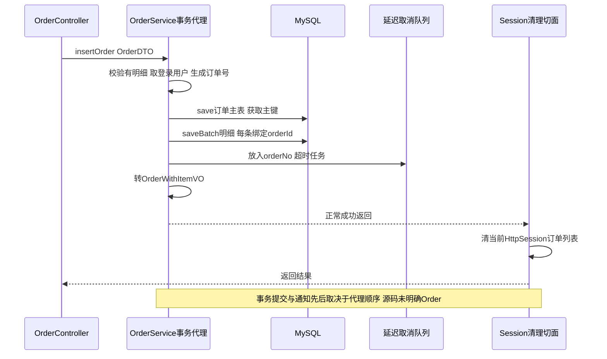
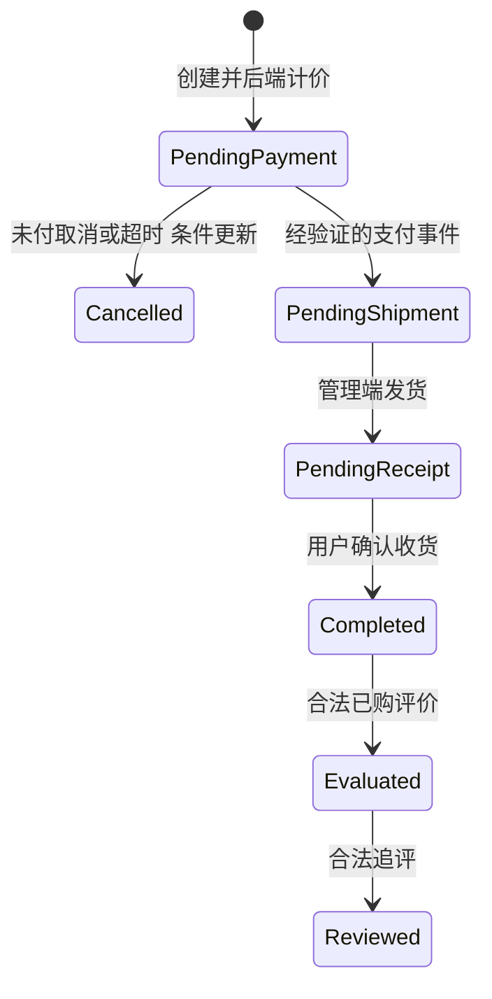
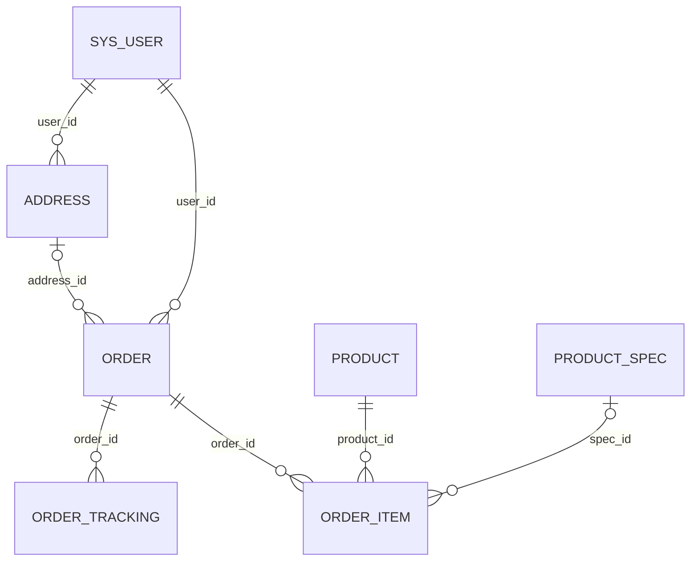

# OrderController 订单接口对比学习笔记

日期：2026-10-03。参考项目 `D:/github/project1/ChestnutShopWX`，当前项目 `D:/github/project1/lixiaopu`。依据当前文件内容，未运行应用、测试、调用支付服务或连接数据库。完整源码与原注释附在本文件末尾，学习解析和源码在同一文件。

**参考类虽在admin包，路径是/api/order，实际大量操作当前登录用户的订单。当前项目未找到OrderController，OrderServiceImpl仍为空通用继承壳，不能把实体及表的存在当成订单业务已经完成。**

导航：[缺失对比](#compare) · [12个接口契约](#api) · [创建与查询](#create) · [状态修改](#mutations) · [运费物流滚动搜索](#others) · [AOP延迟任务](#async) · [数据库](#tables) · [方法类型](#types) · [实现顺序](#next) · [源码](#sources)。

<a id="compare"></a>
## 1. 你的订单模块目前到哪一步

| 层/能力 | 参考实现 | 当前项目 | 还需补什么 |
| --- | --- | --- | --- |
| Controller | 12个/api/order接口 | 未找到订单Controller | 用户订单/管理订单各自契约与路由 |
| DTO/VO | OrderDTO、OrderItemDTO、订单明细/地址/物流VO | 有Order、OrderItem、OrderTracking等Entity | 独立输入DTO与展示VO |
| Service | 创建、列表、详情、取消、支付状态、收货、逻辑删除、运费物流搜索 | OrderService extends IService；实现无自定义业务 | 状态机、金额/库存/归属等业务实现 |
| Mapper | 联订单明细/地址/物流及搜索SQL | BaseMapper空接口，XML仅基础resultMap/sql片段 | 列表/详情聚合查询 |
| 用户归属 | 列表和部分修改带userId，但多处遗漏 | 尚未建订单链路 | 每个读写都应检查资源归属 |
| 订单状态 | OrderStatusEnum+页面枚举 | Entity.status是Integer，无对应状态枚举 | 明确数据库编码及合法迁移 |
| 编号与金额 | 自制雪花截断编号；价格大量从请求复制 | 尚无编号/计价链路 | 可靠唯一单号、后端规格定价 |
| 支付/超时 | 前端可调用状态接口、延迟取消，有明显缺陷 | 未找到支付实现 | 验证支付事件、幂等更新、可靠超时关闭 |
| 缓存与事件 | Redis详情、HttpSession列表、清理切面、MQ改订单状态 | 无订单配套缓存/任务/消费者 | 基础事务业务完成后再引入 |

当前OrderService注释说shop_order，真实@TableName是order；注释说收货信息独立保存，当前Order只有addressId、没有收货地址快照。表、实体与历史注释需要分开看。

参考也没有完整管理员发货/退款/审核链路，因此不能把这些作为“当前还少了参考Controller中的接口”；这些属于未来管理端需求。

<a id="api"></a>
## 2. 参数与返回值

参考所有Controller方法返回 `com.app.uni_app.common.result.Result`（类支持泛型但这里用了原始类型）。用户ID大多来自BaseContext.getUserId():String；订单号是String业务标识，order.id是Long数据库主键，二者不能混用。

| HTTP完整URL | Controller/Service方法与Java参数 | 输入来源 | 成功data |
| --- | --- | --- | --- |
| POST /api/order/create | insertOrder(OrderDTO) | JSON，只有body@NotNull | OrderWithItemVO |
| GET /api/order/list | getOrderList(Integer pageNum,Integer pageSize,String status) | query默认1/10/pendingPayment | PageResult：list,total,pageNum,pageSize |
| GET /api/order/page/list | getOrderListByPage(String pageName) | query@NotBlank | List<OrderWithItemVO>；全空时null |
| GET /api/order/detail | getOrderDesc(String orderNo) | query@NotBlank | OrderWithItemVO |
| PUT /api/order/cancel | cancelOrder(String orderNo,String cancelReason) | query；reason可选 | Map：orderNo,status=cancelled |
| PUT /api/order/pay/success | paySuccessOrder(String orderNo) | query@NotBlank | Map：orderNo,status=pendingShipment |
| PUT /api/order/confirmReceipt | confirmOrderReceipt(String orderNo) | query@NotBlank | Map：orderNo,status=completed,receiveTime |
| DELETE /api/order/delete | deleteOrder(String orderNo) | query@NotBlank | String orderNo |
| GET /api/order/freight | getOrderFreight(String productIds,String addressId) | query逗号ID与地址ID | Map：freight(Double)、productIds(String[]) |
| GET /api/order/logistics | getOrderLogistics(String orderNo) | query@NotBlank | OrderWithTrackingVO |
| GET /api/order/scroll/query/list | getOrderByScrollQuery(ScrollQueryDTO) | **GET JSON请求体**，body@NotNull | 非空ScrollQueryResult；空分支误返回Builder |
| GET /api/order/search | searchOrderByCondition(String searchCondition) | query@NotBlank | List<OrderWithItemVO>；空时null |

参考ShiroConfig的兜底jwt保护/api/order，但认证不等于某用户可读取/修改所有订单；当前AuthFilter没有覆盖/api/order或/api/orders。因此未来加这一路由时，也必须接上当前认证保护，不能只新增Controller。

### 2.1 下单DTO与响应VO

OrderDTO（pojo.dto）：addressId:String、remark:String、freight:String、totalAmount:String、orderItems:List<OrderItemDTO>。OrderItemDTO：productId:String、specId:String、quantity:Integer、price:String、productName/String、productImage/String、specText/String。

```json
{
  "addressId":"1","remark":"尽快送达","freight":"5.00","totalAmount":"30.80",
  "orderItems":[{"productId":"100","specId":"201","quantity":2,"price":"12.90","productName":"示例商品","productImage":"/images/sample.png","specText":"200g"}]
}
```

这是参考接口接收形状示例，不是推荐信任前端金额的下单设计。DTO没有字段级校验，也没有Controller @Valid校验整个订单及明细；@NotNull只保证body对象非null。

OrderWithItemVO把userId/addressId/金额转成String，status/payType为枚举，JSON由@JsonValue输出字符串；orderItems:List<OrderItemVO>、address:OrderAddressVO。OrderWithTrackingVO含orderId:String、logisticsCompany:String、logisticsNo:String、orderTrackings:List<OrderTrackingVO>。

ScrollQueryDTO只有beginId:Long，可为空表示首次。ScrollQueryResult.endId是primitive long，不能承载null；空页分支若beginId为空还会自动拆箱空指针。

<a id="create"></a>
## 3. 创建订单与查询链路

### 3.1 insertOrder：事务内主表+明细



第一步：读orderItems，null/empty返回DATA_ERROR。

第二步：CopyMapper.orderDTOToOrder把String金额/ID转换成实体；BaseContext取登录用户，SnowflakeIdGenerator生成orderNo，设置userId。

第三步：save(order)写主表、回填id；代码没有检查返回boolean。

第四步：把每条OrderItemDTO转OrderItem，peek设置orderId，绑定到order.orderItems；orderItemService.saveBatch，没有检查返回boolean。

第五步：加入超时未付队列；第六步：MapStruct转VO返回。返回时address对象没有在此方法查询填充，不能假定创建响应已有收件人信息。

数据库异常在@Transactional(rollbackFor=Exception.class)中回滚主表和明细；Redis延迟队列不属于同一事务，入队在提交前发生，入队成功而数据库回滚会留下孤立任务。

**缺失的下单校验：** 未查地址属于谁；未查商品/规格可售与库存；未按数据库规格价重算金额；未扣库存/预占库存；未建立请求幂等；商品名图片等快照来自前端。参考金额getter只是totalAmount-freight、price×quantity，运算本身不证明金额可信。

### 3.2 编号生成的注释与真实代码

```java
String snowflakePart = StringUtils.rightPad(String.valueOf(nextId()), 12, "0")
        .substring(0, 12);
return datePart + snowflakePart;
```

datePart为yyMMdd。注释写“后12位”，实际截取的是**前12位**；截断会丢掉ID低位差异，可能让连续ID得到相同订单号，不能宣称仍保证唯一。原雪花nextId有synchronized、时间/机器/序列位，但截断后的单号已不保留该性质。默认机器/数据中心ID都为1，分布式部署也需配置互异ID。

当前DDL有order_no唯一约束，碰撞会报错，不等于生成器设计正确。不要照搬截断；建议保留可靠完整唯一标识，并以数据库唯一约束作为最终保护。

### 3.3 getOrderList：页码分页

第一步：当前用户ID；status字符串通过OrderStatusEnum.getByValue转换成code。

第二步：Mapper.getOrderList(Page,userId,code)联order_item；SQL过滤is_deleted=0、user_id、status，按order.update_time倒序及明细create_time倒序。

第三步：订单行转OrderWithItemVO，PageResult(total,pageNum,pageSize,list)返回。默认status只取待支付，不是所有状态。

注意：一对多联表结果映射会按订单主ID折叠对象，但分页插件通常作用于联表SQL行；订单有多个明细时页大小/count及明细完整性要实际验证，较稳的做法先分页主订单ID再批量查明细。Controller没有分页上下界约束。

### 3.4 getOrderListByPage：HttpSession复用

第一步：pageName→OrderPageEnum；第二步SessionUtils.getUserAllOrder，session属性不存在才调用orderMapper::getUserAllOrder(userId)查询所有未删订单及明细；第三步allPage全部返回，其余按status.pageCode过滤；第四步转VO。

pageKey：allPage、pendingPayPage、packagingPage、pendingReceiptPage、pendingEvalPage。**pageCode不是订单数据库status code**。例如COMPLETED与AFTER_SALE都归评价页码5，已评价/已追评归all页码1；不要仅凭页面名猜状态。

Session属性以固定键保存，没有把userId纳入缓存键；同session切换账号或后台改变订单时需失效，当前切面只清当前请求session，不自动清所有会话。empty直接Result.success()返回data=null。

### 3.5 getOrderDesc：Redis详情+空对象

第一步：orderNo→RedisKeyGenerator.orderKey，getHashObject还原Order。

第二步：缓存无数据查Mapper.getOrderDesc，联order_item及INNER JOIN address；数据库无结果转id=0的emptyOrder并缓存TTL。

第三步：equals(emptyOrder)则ORDER_NOT_FOUND；否则转OrderWithItemVO。

**当前参考详情SQL只按orderNo，未按userId/未删标记过滤**，缓存key也不分用户；须先验证当前登录者有权访问，再返回缓存。INNER JOIN address导致地址缺失时订单详情也查不到；联当前address行意味着地址修改会影响详情，不是收货信息历史快照。

<a id="mutations"></a>
## 4. 订单状态接口：逐个看条件

### 4.1 cancelOrder

第一步：cancelOrder调用本类cancelOrderCommon；第二步按orderNo UPDATE status=CANCELLED、cancelTime、cancelReason；第三步boolean失败返回保存错误，成功返回orderNo/status Map；第四步两个缓存切面清理。

没有userId、旧status约束，没有付款后退款与库存释放逻辑。只凭orderNo可改任意状态，不等于完整取消业务。内部this调用cancelOrderCommon不重新经过AOP代理。

### 4.2 paySuccessOrder

第一步：先delayedQueue.remove(orderNo)撤销尚未到期取消任务。

第二步：调用updateOrderPayIsSuccess，按orderNo写PENDING_SHIPMENT、WECHAT_PAY、payTime；第三步失败while重试最多5次，仍失败new PayException；第四步成功返回Map并触发缓存清理。

Controller注释“修改为待收货”不准确，实际是**待发货pendingShipment**。接口没有验支付平台签名、查询实际支付、核对金额/商户/单号，也没有userId与旧status条件；不能让客户端调用一次就作为支付真实成功证据。当前5次循环只是快速重试，不是可靠消息确认。

PayException构造器主动提交异步修复，但它由new创建，不是Spring管理Bean，里面@Resource线程池/Service字段不会自动注入，构造中就可能NPE。注释“保证一定成功”没有实现保证；该异步代码写的是PENDING_CONFIRM而不是PENDING_SHIPMENT，语义也不同。

提前撤队后更新失败，订单可能失去超时任务。任务已经转阻塞队列时remove延迟队列也撤不掉，应依靠数据库旧状态条件避免支付和取消竞争。

### 4.3 confirmOrderReceipt

第一步：BaseContext当前userId；第二步UPDATE同时按userId及orderNo设置COMPLETED与receiveTime；第三步返回Map(orderNo,status,receiveTime)，缓存清理。

归属条件比前两者完整，但没有要求旧status=PENDING_RECEIPT，因此待付订单也可能被直接完成。应让UPDATE旧状态条件和目标状态一起形成可验证迁移。

### 4.4 deleteOrder

第一步：按orderNo设置is_deleted=1；第二步失败DELETE_ERROR，成功返回单号；第三步清缓存。不物理删主表/明细，不级联库存。

没有userId和允许删除的状态过滤。详情与物流SQL又未排除is_deleted=1，所以“列表不可见”不代表所有读取都不可见。Service手工set标记，与MyBatis Plus @TableLogic自动逻辑删除不是同一回事。

### 4.5 状态表与建议状态链

参考编码：1待付、2待确认、3待发货、4待收货、5完成、6取消、7售后、8已评价、9已追评。@EnumValue编码用于数据库，@JsonValue字符串用于JSON。当前Order.status是Integer，建表默认0，若直接移植参考“默认1待付”而保留0，就会产生含义不一致，需要明确映射/迁移。



图是建议业务状态链，不表示参考已经校验每条边；参考现有UPDATE普遍缺旧状态条件。支付/取消、重复回调、发货/收货都要设计幂等和并发竞争规则。

<a id="others"></a>
## 5. 运费、物流、滚动与搜索

### 5.1 getOrderFreight

第一步：逗号拆productIds；第二步getById查地址，null错误；第三步每个商品ID计数×随机3到8范围数，BigDecimal保留两位再doubleValue；第四步返回freight与productIds数组。

源码TODO尚未调用快递鸟API，这是随机演示运费，不是按地区/重量/物流模板计价；未查商品是否存在、地址是否属于用户、购买数量；重复ID也影响计数。真正下单必须后台计价，不能信任前端传freight。

### 5.2 getOrderLogistics

第一步Mapper按orderNo联order_tracking；第二步没订单返回错误；第三步转OrderWithTrackingVO。物流轨迹按create_time倒序，是数据库现存轨迹，不是这次调用物流公司实时API。无userId/未删过滤，仍需补归属检查。

### 5.3 getOrderByScrollQuery

第一步GET请求体绑定ScrollQueryDTO；浏览器fetch通常不能发送GET body，建议改query参数GET或JSON POST。

第二步当前用户、is_deleted=0，首次无beginId；后续id<beginId。排序却按createTime倒序，没有ID作为明确次序，游标条件和排序不完全一致。

第三步LIMIT引用的是COMMON_SCROLL_QUERY_NUMBER=80，不是注释“40”的ORDER_SCROLL_QUERY_NUMBER；第四步非空取末项ID并build结果。

空分支原文：

```java
return Result.success(ScrollQueryResult.builder().list(list).endId(beginId));
```

遗漏`.build()`，返回了Builder；beginId为null时endId(long)还会拆箱异常。这不是可用的标准空页结果。非空查询是通用lambdaQuery，未联明细/地址，返回List<Order>原实体，和分页列表的OrderWithItemVO不同。

### 5.4 searchOrderByCondition

第一步BaseContext取userId；第二步RegexConstants按订单号、物流号格式识别，否则当productName；第三步Mapper动态SQL带userId和is_deleted=0，订单号/物流号精确匹配或明细product_name LIKE；第四步转OrderWithItemVO，空data=null。

没有分页/数量上限。商品名过滤发生在联明细行上，结果订单内可能只包含命中的明细，而非订单全部明细；若需求返回整单，应先匹配订单ID再查整单。格式猜测可能把某些商品名当单号，建议显式searchType。

<a id="async"></a>
## 6. AOP、超时取消与MQ完整链路

### 6.1 两个切面分别做什么

RemoveOrderSessionAnnotation→AfterReturning，绑定Result<?>，success=true才SessionUtils.removeUserAllOrder；注解在创建/取消/支付/收货/删除及updateOrderStatus上。

RemoveOrderDetailRedisCacheAnnotation→**Around**，调用ProceedingJoinPoint.proceed后把结果转Result；成功时取第一个String参数orderNo，delete详情key，再返回原结果。虽方法名afterReturnSuccess，通知类型不是AfterReturning。

顺序：代理进入→业务方法→成功结果→两个清理通知→返回Controller；两个切面没有明确@Order，不能断言谁一定先清。insertOrder还含事务Advice，亦不能假定AfterReturning一定发生在数据库提交之后。

updateOrderStatus返回Boolean，却标了Session清理注解；该通知绑定Result<?>，不适配Boolean，所以不能指望这个内部状态更新清除session。它自己删除Redis详情，但orderId不空、orderNo可空时会拼出空单号key，未先回查真实单号。

后台MQ处理没有HTTP session，不能把当前请求session清理方式照搬到消费者；需面向用户/版本的失效机制。通知成功后清缓存失败也可能改变请求结果，不与MySQL形成原子事务。

### 6.2 CancelUnpaidOrderDelayJob逐步解析

第一步@PostConstruct初始化RBlockingQueue<String>与RDelayedQueue<String>。

第二步下单调用setUnpaidOrderNoToDelayQueue：remove旧任务、offer orderNo，延迟取orderTtl；参考redisCache.yml为3600秒，即1小时。

第三步每次下单都调用startConsumer，提交一个无限while消费者；不是只在启动时开一个消费者。

第四步到期Redisson搬到阻塞队列，take拿单号；ApplicationContext.getBean拿OrderServiceImpl，调用cancelOrderCommon，删Redis订单缓存；异常只记日志，未可靠重入队。

**确定的注入缺陷：** threadPool字段只有@Qualifier，没有@Autowired/@Resource/构造器注入，因此Qualifier不会独自注入它；startConsumer可能NPE。Qualifier用于限定已发生的注入，不是注入触发器。参见 [Spring限定符说明](https://docs.spring.io/spring-framework/reference/core/beans/annotation-config/autowired-qualifiers.html)。

若修好注入，仍要修每单启动长期消费者：线程池最终被无限任务占满，CallerRunsPolicy饱和后甚至可能让接口线程执行无限消费循环。失败后递归startConsumer也不等于重试当前订单，当前take的单号已经取走。

取消SQL未限制pendingPayment，到期与支付并发时可能把已付订单取消；先读后写还不够，应该条件更新旧状态。队列移除只撤未到期任务，任务已取出仍需状态保护。

### 6.3 评论MQ改订单状态

商品一级评价/追评发送orderNo与evaluated/reviewed字符串；OrderStatusConsumer.onMessage解析枚举，调用updateOrderStatus(Long orderId,String orderNo,OrderStatusEnum)。方法优先用orderId，否则orderNo，更新status并删详情Redis，返回Boolean。

消费者未检查Boolean失败结果，也没校验状态来源/旧状态；支付、评论、订单状态彼此关联，但并不因MQ异步就自动保证一致。消费重复时应幂等，状态不能倒退。

### 6.4 一次请求“触发两次切面”是否多余

先区分三个情况：一个Around在proceed前后各打印一次，是**一个通知执行一次产生两条日志**；Session清理与Redis详情清理，是**两个不同切面处理两个缓存**；同一种注解同时标在Controller和Service，则两个代理方法都可能被匹配，导致**同一种工作执行两遍**。参考订单的两种清理职责有区别，本身不算重复；但相同缓存失效工作通常放在Service业务入口一次即可，使HTTP以外的调用也能经过业务切面。

Service并非所有AOP的唯一位置。请求耗时/HTTP审计可以放Controller或过滤器；资源校验、业务事件和业务缓存失效更适合业务入口。这里Session属于HTTP上下文，后台MQ不能照搬。`this.xxx()`不经过代理；private方法和CGLIB代理的final方法也不能作为拦截入口。参见[Spring代理说明](https://docs.spring.io/spring-framework/reference/core/aop/proxying.html)。

### 6.5 在当前项目完整加入一个AOP：可对照的最小示例

下面是**学习示例，未写入业务源码**：用你现有商品详情Service验证注解→代理→业务→返回链路，再把同样的注册方式用于未来订单Service。它只记录方法名和耗时，不承担订单缓存清理，避免把尚未实现的订单方法当成现有代码。

第一步：当前pom.xml已有`org.springframework.boot:spring-boot-starter-aop`，无需重复加依赖。第二步：在`src/main/java/com/lixiaopu/aop/annotation/TraceBusiness.java`建立运行时方法注解：

```java
package com.lixiaopu.aop.annotation;

import java.lang.annotation.ElementType;
import java.lang.annotation.Retention;
import java.lang.annotation.RetentionPolicy;
import java.lang.annotation.Target;

@Target(ElementType.METHOD)
@Retention(RetentionPolicy.RUNTIME)
public @interface TraceBusiness {}
```

第三步：在`src/main/java/com/lixiaopu/aop/aspect/TraceBusinessAspect.java`建立并注册切面。`trace(ProceedingJoinPoint):Object throws Throwable`是通知入口；必须调用proceed才能执行业务，并返回原结果。

```java
package com.lixiaopu.aop.aspect;

import org.aspectj.lang.ProceedingJoinPoint;
import org.aspectj.lang.annotation.Around;
import org.aspectj.lang.annotation.Aspect;
import org.slf4j.Logger;
import org.slf4j.LoggerFactory;
import org.springframework.core.annotation.Order;
import org.springframework.stereotype.Component;

@Aspect
@Component
@Order(100)
public class TraceBusinessAspect {
    private static final Logger log = LoggerFactory.getLogger(TraceBusinessAspect.class);

    @Around("@annotation(com.lixiaopu.aop.annotation.TraceBusiness)")
    public Object trace(ProceedingJoinPoint point) throws Throwable {
        long start = System.nanoTime();
        String method = point.getSignature().toShortString();
        log.info("进入业务：{}", method);
        try {
            return point.proceed(); // 保留返回值、异常和原业务调用次数
        } finally {
            log.info("结束业务：{}，耗时{}ms", method,
                    (System.nanoTime() - start) / 1_000_000.0);
        }
    }
}
```

第四步：确保启动类扫描切面。当前`LixiaopuApplication`已扫描`com.lixiaopu.aop`；`AdminApplication`的scanBasePackages则需要增加这个包。仅创建Aspect文件而未被扫描，不会生效。Boot的AOP自动配置正常启用时不需要重复加EnableAspectJAutoProxy。

第五步：在当前`com.lixiaopu.service.impl.ProductServiceImpl#getProductById(Long):Result`方法上添加`@TraceBusiness`并导入注解，方法体保留。Controller注入ProductService，调用`getProductById(id)`，不要new实现类，不要同时给Controller同一链路加相同注解。

```text
GET /api/products/{id}
 → ProductController.getProductById(Long)
 → ProductService代理
 → trace进入日志
 → proceed → ProductServiceImpl.getProductById(Long) → Mapper → Result
 → trace的finally结束日志
 → Controller返回Result
```

第六步：验证一次请求有一组进入/结束日志；业务返回Result.error仍属于正常返回，finally日志不是“请求成功”的证明；业务抛异常时finally仍执行，异常继续交给现有异常处理器。示例没有实际加入项目或运行验证。

多个Around切面使用不同Order值时，数字较小的优先进入、较晚退出，例如100进入→200进入→业务→200退出→100退出；相同优先级不能依赖固定次序。这里的100只是示例，不能据此推断参考代码两种缓存通知或事务提交顺序。需要提交后失效时，应使用事务提交回调/提交后事件，而非仅在方法返回后删除缓存。参见[Spring通知与优先级说明](https://docs.spring.io/spring-framework/reference/core/aop/ataspectj/advice.html)。

<a id="tables"></a>
## 7. 表关系与映射



当前建表SQL明确上述外键：order.address_id允许null；order_item保存名称、规格文本、图片、单价、数量、小计的下单快照，所以后续商品变更不应该改旧订单明细。参考却直接从前端复制这些快照，需补可信数据库来源。

order.order_no唯一；order.user_id、address_id是BIGINT；金额DECIMAL映射BigDecimal；quantity INT映射Integer；日期DATETIME。当前Entity用java.util.Date，参考用java.time.LocalDateTime且支持JSON格式。Order对象的address/orderItems/orderTrackings是参考@TableField(exist=false)聚合属性，当前Entity没有这些属性，不能仅复制XML映射就期待正确组装。

参考Order@TableName带反引号引用order，当前写@TableName("order")未引用；order是SQL关键字，未来启用自动SQL时要核实表名转义，不能凭实体存在推断能正常查询。

当前DDL status默认0，参考枚举1开始；当前isEvaluate/isDeleted为Integer，参考is_evaluate/is_deleted为CommonStatus；既要匹配列名，也要统一JSON/数据库语义。当前XMLBaseResultMap没有联表查询statement，只是列与属性对应。

参考OrderMapper.xml：association装单个Address，collection装List<OrderItem>/List<OrderTracking>；订单主ID别名order_id，明细id用原id，避免ID混淆。SQL里的明细order_id选择被注释，应核对映射结果是否回填明细关联ID；地址表user_id未独立别名，AddressResultMap可能读订单user_id，若原本地址归属不一致会掩盖问题。

当前脚本有完整订单表，但未找到参考仓库建表SQL；本文件DDL是当前脚本节选，不声称已检查两库真实结构。

<a id="types"></a>
## 8. 方法参数、返回类型与提供包

参考项目类型前缀com.app.uni_app，当前com.lixiaopu；OrderDTO/OrderItemDTO/ScrollQueryDTO在pojo.dto；Order/OrderItem/OrderTracking/Address在pojo.entity；订单VO在pojo.vo；Result/PageResult/ScrollQueryResult在common.result；枚举参考包pojo.emums。

| 提供者 | 参数→返回类型 |
| --- | --- |
| service.OrderService / impl.OrderServiceImpl | insertOrder(OrderDTO)→Result |
| 同上 | getOrderList(Integer,Integer,String)→Result；getOrderListByPage(String)→Result |
| 同上 | getOrderDesc(String)→Result；cancelOrder(String,String)→Result；paySuccessOrder(String)→Result；confirmOrderReceipt(String)→Result；deleteOrder(String)→Result |
| 同上 | getOrderFreight(String,String)→Result；getOrderLogistics(String)→Result；getOrderByScrollQuery(ScrollQueryDTO)→Result；searchOrderByCondition(String)→Result |
| 同上 | updateOrderStatus(Long,String,OrderStatusEnum)→Boolean，内部业务方法，不是Controller独立路由 |
| impl.OrderServiceImpl | cancelOrderCommon(String,String)→boolean；private updateOrderPayIsSuccess(Map<String,Object>,String,int)→Map<String,Object> |
| mapper.OrderMapper | getOrderList(Page<Object>,String,int)→IPage<Order>；getUserAllOrder(String)→List<Order> |
| 同上 | getOrderDesc(String)→Order；getOrderLogistics(String)→Order；searchOrderByCondition(String,String,String,String)→List<Order> |
| common.mapstruct.CopyMapper | orderDTOToOrder(OrderDTO)→Order；orderItemDTOToOrderItem(OrderItemDTO)→OrderItem；orderToOrderWithItemVO(Order)→OrderWithItemVO；orderToOrderWithTrackingVO(Order)→OrderWithTrackingVO |
| common.util.SessionUtils | getUserAllOrder(Function<String,List<Order>>,String)→List<Order>；setUserAllOrder(List<Order>)→void；removeUserAllOrder()→void |
| common.context.BaseContext | getUserId()→String；未认证抛异常 |
| common.generator.SnowflakeIdGenerator | generateOrderNo()/nextIdStr()→String；synchronized nextId()→long；getCurrentTimestamp()/waitNextMillis(long)→long |
| common.util.DateUtils | formatLocalDateTime(LocalDateTime)→String |
| common.constant.RegexConstants | isOrderNo(String)/isLogisticsNo(String)→boolean |
| pojo.emums.OrderStatusEnum | getByValue(String)→OrderStatusEnum；getCode()/getPageCode()→int；getValue()→String |
| pojo.emums.OrderPageEnum | getByPageKey(String)→OrderPageEnum；getPageCode()→int |
| job.delay.CancelUnpaidOrderDelayJob | init()/startConsumer()→void；setUnpaidOrderNoToDelayQueue(String)/setPaidOrderNoToCancelDelayQueue(String)→void |
| aop.aspect.business.RemoveOrderDetailRedisCacheAspect | afterReturnSuccess(ProceedingJoinPoint)→Object，throws Throwable |
| aop.aspect.business.RemoveOrderSessionAspect | afterReturnSuccess(Result<?>)→void |
| infrastructure.rocketmq.consumer.order.OrderStatusConsumer | onMessage(Map<String,Object>)→void |
| common.exception.PayException | 构造器PayException(String)无返回类型；solvePaySuccessButConfirmFail(String)→void |

### 8.1 框架与JDK方法

| 提供包/类 | 签名中的主要参数→返回 | 作用 |
| --- | --- | --- |
| MyBatis Plus IService/ServiceImpl | save(Order)、saveBatch(Collection<OrderItem>)、updateById(Order)→boolean | 数据库写操作 |
| `com.baomidou.mybatisplus.extension.conditions.update.LambdaUpdateChainWrapper<T>` | eq(SFunction,Object)、set(SFunction,Object)→wrapper；update()→boolean | 修改条件、赋值、执行 |
| `com.baomidou.mybatisplus.extension.conditions.query.LambdaQueryChainWrapper<T>` | eq/lt/orderByDesc/last→wrapper；list()→List<T> | 订单滚动查询 |
| `com.baomidou.mybatisplus.extension.plugins.pagination.Page<T>` / `core.metadata.IPage<T>` | Page(long,long)构造器；getRecords()→List<T>、getTotal()→long | 页码分页结果 |
| `jakarta.servlet.http.HttpSession` | getAttribute(String)→Object；setAttribute(String,Object)/removeAttribute(String)→void | 当前会话列表缓存 |
| `java.util.function.Function<T,R>` | apply(T)→R | Mapper方法引用延迟查库 |
| `org.aspectj.lang.ProceedingJoinPoint` | proceed()→Object throws Throwable；getArgs()→Object[] | Around放行业务并读参数 |
| `org.springframework.context.ApplicationContext` | getBean(String,Class<T>)→T | 延迟消费者取Service代理 |
| `org.redisson.api.RedissonClient` | getBlockingQueue(String)→RBlockingQueue<String>；getDelayedQueue(RQueue<String>)→RDelayedQueue<String> | 队列初始化 |
| `org.redisson.api.RDelayedQueue<String>` | offer(String,long,TimeUnit)→void；remove(Object)→boolean | 延迟任务/撤销 |
| `org.redisson.api.RBlockingQueue<String>` | take()→String，throws InterruptedException | 阻塞取到期单号 |
| `java.util.concurrent.Executor` | execute(Runnable)→void | 提交消费者/异步修复 |
| `java.lang.Thread` | currentThread()→Thread；isInterrupted()→boolean；interrupt()→void | 消费循环退出 |
| `java.math.BigDecimal` | subtract(BigDecimal)/multiply(BigDecimal)/setScale(int,RoundingMode)→BigDecimal；doubleValue()→double | 金额运算与展示 |
| `io.netty.util.internal.ThreadLocalRandom` | nextDouble(double,double)→double | 参考随机运费，使用的是Netty内部类 |
| `java.util.stream.Stream<T>` | map(Function)/peek(Consumer)→Stream；toList()→List<T> | 转明细并绑定orderId |
| `java.lang.Long` | valueOf(String)→Long；parseLong(String)→long | 编号/ID转换，格式溢出抛异常 |
| `com.baomidou.mybatisplus.core.handlers.MetaObjectHandler` | insertFill/updateFill(MetaObject)→void | 参考LocalDateTime自动填充支持 |

Order.getTotalGoodsAmount()显式返回totalAmount.subtract(freight)，不是简单字段getter；OrderItem.getSubtotal()显式返回price×quantity或null，setter被Lombok禁用。MapStruct生成代码会读这些getter；输入金额null可能让映射/保存异常。当前OrderItem.subtotal只是普通字段，不会自动按价格数量计算。

### 8.2 注解与迁移

路由、RequestBody、RequestParam来自org.springframework.web.bind.annotation；NotNull/NotBlank来自jakarta.validation.constraints，但没有@Valid时不级联检验订单字段；Resource来自jakarta.annotation；Qualifier来自org.springframework.beans.factory.annotation且不独立注入；Transactional来自org.springframework.transaction.annotation；PostConstruct来自jakarta.annotation；Aspect/Around/AfterReturning来自org.aspectj.lang.annotation；Accessors、FieldNameConstants来自lombok.experimental；EnumValue来自com.baomidou.mybatisplus.annotation。

当前MP3.5.17使用com.baomidou.mybatisplus.spring.service，参考3.5.6使用extension.service；当前Date与参考LocalDateTime需一致处理。当前AdminApplication不扫描aop/job，若未来移植这些Bean须调整目标启动类扫描，并明确订单接口究竟放用户端还是管理端，不照搬文件夹命名。

<a id="next"></a>
## 9. 推荐实现顺序与验证用例

1. 先定用户订单和管理订单边界、路由、认证、状态编码；补DTO/VO，金额及资源ID不直接接收可写Entity。
2. 先实现可信下单：验证地址归属，查规格价与库存，重算明细小计/总价/运费，可靠单号，事务主表+明细+库存，幂等键。
3. 列表/详情/物流的每次读取都按当前用户或明确管理权限验证；先分页主表再组明细，地址使用下单快照。
4. 取消/确认收货/删除按userId+orderNo+允许旧状态条件更新；支付仅接收验证过的支付结果，并幂等。
5. 超时关闭启动一次消费者，可靠重试及旧状态条件；支付与取消竞争由数据库状态机收敛。
6. 基础链路测通过后再加Redis缓存、事件通知和后台任务；事务提交后失效缓存，避免仅依赖当前HttpSession清理。

测试应覆盖：前端篡改价格；别人地址/订单；库存不足、重复下单；一订单多明细跨页；不存在/已删订单；单号并发唯一性；支付重复回调与超时并发；未付直接收货；逻辑删除可见性；运费确定性；空滚动页与同时间多订单；任务消费失败；缓存清理失败；MQ状态通知重复/乱序。清单是建议，本次未执行，也未修改业务代码。

<a id="sources"></a>
## 10. 完整源码与原注释

下方收录直接Controller/Service/Mapper、相关DTO/VO/Entity、订单切面/任务/消费者、当前已有壳与表SQL。保留原文，便于理解“注释说什么”和“代码做什么”的差异；生成器及参考异步缺陷需先修再移植。

### 源码索引

- [参考项目 / src/main/java/com/app/uni_app/controller/admin/OrderController.java](#src-ref-src-main-java-com-app-uni-app-controller-admin-ordercontroller-java)
- [参考项目 / src/main/java/com/app/uni_app/service/OrderService.java](#src-ref-src-main-java-com-app-uni-app-service-orderservice-java)
- [参考项目 / src/main/java/com/app/uni_app/service/impl/OrderServiceImpl.java](#src-ref-src-main-java-com-app-uni-app-service-impl-orderserviceimpl-java)
- [参考项目 / src/main/java/com/app/uni_app/service/OrderItemService.java](#src-ref-src-main-java-com-app-uni-app-service-orderitemservice-java)
- [参考项目 / src/main/java/com/app/uni_app/service/impl/OrderItemServiceImpl.java](#src-ref-src-main-java-com-app-uni-app-service-impl-orderitemserviceimpl-java)
- [参考项目 / src/main/java/com/app/uni_app/mapper/OrderMapper.java](#src-ref-src-main-java-com-app-uni-app-mapper-ordermapper-java)
- [参考项目 / src/main/resources/mapper/OrderMapper.xml](#src-ref-src-main-resources-mapper-ordermapper-xml)
- [参考项目 / src/main/java/com/app/uni_app/mapper/OrderItemMapper.java](#src-ref-src-main-java-com-app-uni-app-mapper-orderitemmapper-java)
- [参考项目 / src/main/java/com/app/uni_app/service/AddressService.java](#src-ref-src-main-java-com-app-uni-app-service-addressservice-java)
- [参考项目 / src/main/java/com/app/uni_app/service/impl/AddressServiceImpl.java](#src-ref-src-main-java-com-app-uni-app-service-impl-addressserviceimpl-java)
- [参考项目 / src/main/java/com/app/uni_app/mapper/AddressMapper.java](#src-ref-src-main-java-com-app-uni-app-mapper-addressmapper-java)
- [参考项目 / src/main/java/com/app/uni_app/pojo/entity/Order.java](#src-ref-src-main-java-com-app-uni-app-pojo-entity-order-java)
- [参考项目 / src/main/java/com/app/uni_app/pojo/entity/OrderItem.java](#src-ref-src-main-java-com-app-uni-app-pojo-entity-orderitem-java)
- [参考项目 / src/main/java/com/app/uni_app/pojo/entity/OrderTracking.java](#src-ref-src-main-java-com-app-uni-app-pojo-entity-ordertracking-java)
- [参考项目 / src/main/java/com/app/uni_app/pojo/entity/Address.java](#src-ref-src-main-java-com-app-uni-app-pojo-entity-address-java)
- [参考项目 / src/main/java/com/app/uni_app/pojo/dto/OrderDTO.java](#src-ref-src-main-java-com-app-uni-app-pojo-dto-orderdto-java)
- [参考项目 / src/main/java/com/app/uni_app/pojo/dto/OrderItemDTO.java](#src-ref-src-main-java-com-app-uni-app-pojo-dto-orderitemdto-java)
- [参考项目 / src/main/java/com/app/uni_app/pojo/dto/ScrollQueryDTO.java](#src-ref-src-main-java-com-app-uni-app-pojo-dto-scrollquerydto-java)
- [参考项目 / src/main/java/com/app/uni_app/pojo/vo/OrderWithItemVO.java](#src-ref-src-main-java-com-app-uni-app-pojo-vo-orderwithitemvo-java)
- [参考项目 / src/main/java/com/app/uni_app/pojo/vo/OrderWithTrackingVO.java](#src-ref-src-main-java-com-app-uni-app-pojo-vo-orderwithtrackingvo-java)
- [参考项目 / src/main/java/com/app/uni_app/pojo/vo/OrderItemVO.java](#src-ref-src-main-java-com-app-uni-app-pojo-vo-orderitemvo-java)
- [参考项目 / src/main/java/com/app/uni_app/pojo/vo/OrderTrackingVO.java](#src-ref-src-main-java-com-app-uni-app-pojo-vo-ordertrackingvo-java)
- [参考项目 / src/main/java/com/app/uni_app/pojo/vo/OrderAddressVO.java](#src-ref-src-main-java-com-app-uni-app-pojo-vo-orderaddressvo-java)
- [参考项目 / src/main/java/com/app/uni_app/pojo/emums/OrderStatusEnum.java](#src-ref-src-main-java-com-app-uni-app-pojo-emums-orderstatusenum-java)
- [参考项目 / src/main/java/com/app/uni_app/pojo/emums/OrderPageEnum.java](#src-ref-src-main-java-com-app-uni-app-pojo-emums-orderpageenum-java)
- [参考项目 / src/main/java/com/app/uni_app/pojo/emums/PayTypeEnum.java](#src-ref-src-main-java-com-app-uni-app-pojo-emums-paytypeenum-java)
- [参考项目 / src/main/java/com/app/uni_app/pojo/emums/OrderTrackingStatusEnum.java](#src-ref-src-main-java-com-app-uni-app-pojo-emums-ordertrackingstatusenum-java)
- [参考项目 / src/main/java/com/app/uni_app/common/result/PageResult.java](#src-ref-src-main-java-com-app-uni-app-common-result-pageresult-java)
- [参考项目 / src/main/java/com/app/uni_app/common/result/ScrollQueryResult.java](#src-ref-src-main-java-com-app-uni-app-common-result-scrollqueryresult-java)
- [参考项目 / src/main/java/com/app/uni_app/common/util/SessionUtils.java](#src-ref-src-main-java-com-app-uni-app-common-util-sessionutils-java)
- [参考项目 / src/main/java/com/app/uni_app/common/constant/SessionConstant.java](#src-ref-src-main-java-com-app-uni-app-common-constant-sessionconstant-java)
- [参考项目 / src/main/java/com/app/uni_app/common/generator/SnowflakeIdGenerator.java](#src-ref-src-main-java-com-app-uni-app-common-generator-snowflakeidgenerator-java)
- [参考项目 / src/main/java/com/app/uni_app/common/constant/RegexConstants.java](#src-ref-src-main-java-com-app-uni-app-common-constant-regexconstants-java)
- [参考项目 / src/main/java/com/app/uni_app/aop/annotation/business/RemoveOrderSessionAnnotation.java](#src-ref-src-main-java-com-app-uni-app-aop-annotation-business-removeordersessionannotation-java)
- [参考项目 / src/main/java/com/app/uni_app/aop/annotation/business/RemoveOrderDetailRedisCacheAnnotation.java](#src-ref-src-main-java-com-app-uni-app-aop-annotation-business-removeorderdetailrediscacheannotation-java)
- [参考项目 / src/main/java/com/app/uni_app/aop/aspect/business/RemoveOrderSessionAspect.java](#src-ref-src-main-java-com-app-uni-app-aop-aspect-business-removeordersessionaspect-java)
- [参考项目 / src/main/java/com/app/uni_app/aop/aspect/business/RemoveOrderDetailRedisCacheAspect.java](#src-ref-src-main-java-com-app-uni-app-aop-aspect-business-removeorderdetailrediscacheaspect-java)
- [参考项目 / src/main/java/com/app/uni_app/job/delay/CancelUnpaidOrderDelayJob.java](#src-ref-src-main-java-com-app-uni-app-job-delay-cancelunpaidorderdelayjob-java)
- [参考项目 / src/main/java/com/app/uni_app/infrastructure/thread/ThreadPoolConfig/CancelUnpaidOrderThreadPoolConfig.java](#src-ref-src-main-java-com-app-uni-app-infrastructure-thread-threadpoolconfig-cancelunpaidorderthreadpoolconfig-java)
- [参考项目 / src/main/java/com/app/uni_app/common/exception/PayException.java](#src-ref-src-main-java-com-app-uni-app-common-exception-payexception-java)
- [参考项目 / src/main/java/com/app/uni_app/infrastructure/thread/ThreadPoolConfig/PayExceptionThreadPoolConfig.java](#src-ref-src-main-java-com-app-uni-app-infrastructure-thread-threadpoolconfig-payexceptionthreadpoolconfig-java)
- [参考项目 / src/main/java/com/app/uni_app/infrastructure/thread/ThreadPoolConstant/ThreadPoolConstant.java](#src-ref-src-main-java-com-app-uni-app-infrastructure-thread-threadpoolconstant-threadpoolconstant-java)
- [参考项目 / src/main/java/com/app/uni_app/infrastructure/rocketmq/consumer/order/OrderStatusConsumer.java](#src-ref-src-main-java-com-app-uni-app-infrastructure-rocketmq-consumer-order-orderstatusconsumer-java)
- [参考项目 / src/main/java/com/app/uni_app/infrastructure/rocketmq/constant/order/MqOrderConstant.java](#src-ref-src-main-java-com-app-uni-app-infrastructure-rocketmq-constant-order-mqorderconstant-java)
- [参考项目 / src/main/java/com/app/uni_app/common/result/Result.java](#src-ref-src-main-java-com-app-uni-app-common-result-result-java)
- [参考项目 / src/main/java/com/app/uni_app/common/result/ResultCode.java](#src-ref-src-main-java-com-app-uni-app-common-result-resultcode-java)
- [参考项目 / src/main/java/com/app/uni_app/common/mapstruct/CopyMapper.java](#src-ref-src-main-java-com-app-uni-app-common-mapstruct-copymapper-java)
- [参考项目 / src/main/java/com/app/uni_app/common/context/BaseContext.java](#src-ref-src-main-java-com-app-uni-app-common-context-basecontext-java)
- [参考项目 / src/main/java/com/app/uni_app/infrastructure/redis/connect/RedisConnector.java](#src-ref-src-main-java-com-app-uni-app-infrastructure-redis-connect-redisconnector-java)
- [参考项目 / src/main/java/com/app/uni_app/infrastructure/redis/connect/StringRedisConnector.java](#src-ref-src-main-java-com-app-uni-app-infrastructure-redis-connect-stringredisconnector-java)
- [参考项目 / src/main/java/com/app/uni_app/infrastructure/redis/config/RedisConfig.java](#src-ref-src-main-java-com-app-uni-app-infrastructure-redis-config-redisconfig-java)
- [参考项目 / src/main/java/com/app/uni_app/infrastructure/redis/properties/RedisCacheTtlProperties.java](#src-ref-src-main-java-com-app-uni-app-infrastructure-redis-properties-rediscachettlproperties-java)
- [参考项目 / src/main/java/com/app/uni_app/infrastructure/redis/properties/RedisCacheCountProperties.java](#src-ref-src-main-java-com-app-uni-app-infrastructure-redis-properties-rediscachecountproperties-java)
- [参考项目 / src/main/java/com/app/uni_app/infrastructure/redis/properties/config/RedisCacheConfig.java](#src-ref-src-main-java-com-app-uni-app-infrastructure-redis-properties-config-rediscacheconfig-java)
- [参考项目 / src/main/java/com/app/uni_app/infrastructure/redis/constant/key/RedisConstant.java](#src-ref-src-main-java-com-app-uni-app-infrastructure-redis-constant-key-redisconstant-java)
- [参考项目 / src/main/java/com/app/uni_app/infrastructure/redis/generator/RedisKeyGenerator.java](#src-ref-src-main-java-com-app-uni-app-infrastructure-redis-generator-rediskeygenerator-java)
- [参考项目 / src/main/java/com/app/uni_app/common/util/DateUtils.java](#src-ref-src-main-java-com-app-uni-app-common-util-dateutils-java)
- [参考项目 / src/main/java/com/app/uni_app/pojo/emums/CommonStatus.java](#src-ref-src-main-java-com-app-uni-app-pojo-emums-commonstatus-java)
- [参考项目 / src/main/java/com/app/uni_app/common/handler/ValidationExceptionHandler.java](#src-ref-src-main-java-com-app-uni-app-common-handler-validationexceptionhandler-java)
- [参考项目 / src/main/java/com/app/uni_app/common/handler/GlobalExceptionHandler.java](#src-ref-src-main-java-com-app-uni-app-common-handler-globalexceptionhandler-java)
- [参考项目 / src/main/java/com/app/uni_app/UniAppApplication.java](#src-ref-src-main-java-com-app-uni-app-uniappapplication-java)
- [参考项目 / src/main/java/com/app/uni_app/security/config/ShiroConfig.java](#src-ref-src-main-java-com-app-uni-app-security-config-shiroconfig-java)
- [参考项目 / pom.xml](#src-ref-pom)
- [当前项目 / src/main/java/com/lixiaopu/service/OrderService.java](#src-cur-src-main-java-com-lixiaopu-service-orderservice-java)
- [当前项目 / src/main/java/com/lixiaopu/service/impl/OrderServiceImpl.java](#src-cur-src-main-java-com-lixiaopu-service-impl-orderserviceimpl-java)
- [当前项目 / src/main/java/com/lixiaopu/service/OrderItemService.java](#src-cur-src-main-java-com-lixiaopu-service-orderitemservice-java)
- [当前项目 / src/main/java/com/lixiaopu/service/impl/OrderItemServiceImpl.java](#src-cur-src-main-java-com-lixiaopu-service-impl-orderitemserviceimpl-java)
- [当前项目 / src/main/java/com/lixiaopu/mapper/OrderMapper.java](#src-cur-src-main-java-com-lixiaopu-mapper-ordermapper-java)
- [当前项目 / src/main/resources/mapper/OrderMapper.xml](#src-cur-src-main-resources-mapper-ordermapper-xml)
- [当前项目 / src/main/java/com/lixiaopu/mapper/OrderItemMapper.java](#src-cur-src-main-java-com-lixiaopu-mapper-orderitemmapper-java)
- [当前项目 / src/main/resources/mapper/OrderItemMapper.xml](#src-cur-src-main-resources-mapper-orderitemmapper-xml)
- [当前项目 / src/main/java/com/lixiaopu/pojo/entity/Order.java](#src-cur-src-main-java-com-lixiaopu-pojo-entity-order-java)
- [当前项目 / src/main/java/com/lixiaopu/pojo/entity/OrderItem.java](#src-cur-src-main-java-com-lixiaopu-pojo-entity-orderitem-java)
- [当前项目 / src/main/java/com/lixiaopu/pojo/entity/OrderTracking.java](#src-cur-src-main-java-com-lixiaopu-pojo-entity-ordertracking-java)
- [当前项目 / src/main/java/com/lixiaopu/pojo/entity/Address.java](#src-cur-src-main-java-com-lixiaopu-pojo-entity-address-java)
- [当前项目 / src/main/java/com/lixiaopu/security/filter/AuthFilter.java](#src-cur-src-main-java-com-lixiaopu-security-filter-authfilter-java)
- [当前项目 / src/main/java/com/lixiaopu/security/config/ShiroAuthConfig.java](#src-cur-src-main-java-com-lixiaopu-security-config-shiroauthconfig-java)
- [当前项目 / src/main/java/com/lixiaopu/common/context/AuthContext.java](#src-cur-src-main-java-com-lixiaopu-common-context-authcontext-java)
- [当前项目 / src/main/java/com/lixiaopu/AdminApplication.java](#src-cur-src-main-java-com-lixiaopu-adminapplication-java)
- [当前项目 / src/main/java/com/lixiaopu/LixiaopuApplication.java](#src-cur-src-main-java-com-lixiaopu-lixiaopuapplication-java)
- [当前项目 / src/main/java/com/lixiaopu/infrastructure/mp/config/MybatisPlusConfig.java](#src-cur-src-main-java-com-lixiaopu-infrastructure-mp-config-mybatisplusconfig-java)
- [当前项目 / src/main/java/com/lixiaopu/common/result/Result.java](#src-cur-src-main-java-com-lixiaopu-common-result-result-java)
- [当前项目 / src/main/java/com/lixiaopu/pojo/entity/Product.java](#src-cur-src-main-java-com-lixiaopu-pojo-entity-product-java)
- [当前项目 / src/main/java/com/lixiaopu/pojo/entity/ProductSpec.java](#src-cur-src-main-java-com-lixiaopu-pojo-entity-productspec-java)
- [当前项目 / pom.xml](#src-cur-pom)

<a id="src-ref-src-main-java-com-app-uni-app-controller-admin-ordercontroller-java"></a>
<details><summary>参考项目 / src/main/java/com/app/uni_app/controller/admin/OrderController.java（完整原文）</summary>

源文件：[src/main/java/com/app/uni_app/controller/admin/OrderController.java](D:/github/project1/ChestnutShopWX/src/main/java/com/app/uni_app/controller/admin/OrderController.java)

````java
package com.app.uni_app.controller.admin;

import com.app.uni_app.common.result.Result;
import com.app.uni_app.pojo.dto.OrderDTO;
import com.app.uni_app.pojo.dto.ScrollQueryDTO;
import com.app.uni_app.service.OrderService;
import io.swagger.v3.oas.annotations.Operation;
import io.swagger.v3.oas.annotations.tags.Tag;
import jakarta.annotation.Resource;
import jakarta.validation.constraints.NotBlank;
import jakarta.validation.constraints.NotNull;
import org.springframework.web.bind.annotation.*;

@RestController
@RequestMapping("/api/order")
@Tag(name = "订单管理")
public class OrderController {

    @Resource
    private OrderService orderService;

    /**
     * 创建订单
     * @param orderDTO
     * @return
     */
    @PostMapping("/create")
    @Operation(summary = "创建订单", description = "提交订单信息，生成新订单")
    public Result insertOrder(@RequestBody @NotNull OrderDTO orderDTO) {
        return orderService.insertOrder(orderDTO);
    }

    /**
     * 获取订单列表
     * @param pageNum
     * @param pageSize
     * @param status
     * @return
     */
    @GetMapping("/list")
    @Operation(summary = "查询订单列表", description = "分页获取订单列表，默认页码1、每页10条，默认状态为待付款（pendingPayment）")
    public Result getOrderList(@RequestParam(defaultValue = "1") Integer pageNum
            , @RequestParam(defaultValue = "10") Integer pageSize
            , @RequestParam(defaultValue = "pendingPayment") String status) {
        return orderService.getOrderList(pageNum, pageSize, status);
    }

    /**
     * 查询指定页面订单列表
     * @param pageName
     * @return
     */
    @GetMapping("/page/list")
    @Operation(summary = "查询指定页面订单列表 ", description = "传入指定页面名,查询出订单列表")
    public Result getOrderListByPage(@RequestParam @NotBlank String pageName) {
        return orderService.getOrderListByPage(pageName);
    }


    /**
     * 查看订单详情
     * @param orderNo
     * @return
     */
    @GetMapping("/detail")
    @Operation(summary = "查询订单详情", description = "根据订单编号获取订单详细信息")
    public Result getOrderDesc(@RequestParam @NotBlank String orderNo) {
        return orderService.getOrderDesc(orderNo);
    }


    /**
     * 取消订单
     * @param orderNo
     * @return
     */
    @PutMapping("/cancel")
    @Operation(summary = "取消订单", description = "根据订单编号取消订单，可选填取消原因")
    public Result cancelOrder(@RequestParam @NotBlank String orderNo, String cancelReason) {
        return orderService.cancelOrder(orderNo, cancelReason);
    }

    /**
     * 支付成功订单
     * @param orderNo
     * @return
     */
    @PutMapping("/pay/success")
    @Operation(summary = "支付成功订单" , description = "根据订单编号将订单状态修改为待收货")
    public Result paySuccessOrder(@RequestParam @NotBlank String orderNo){
        return orderService.paySuccessOrder(orderNo);
    }

    /**
     * 确认收货
     * @param orderNo
     * @return
     */
    @PutMapping("/confirmReceipt")
    @Operation(summary = "确认收货", description = "根据订单编号确认订单收货")
    public Result confirmOrderReceipt(@RequestParam @NotBlank String orderNo) {
        return orderService.confirmOrderReceipt(orderNo);
    }

    /**
     * 删除订单
     * @param orderNo
     * @return
     */
    @DeleteMapping("/delete")
    @Operation(summary = "删除订单" , description = "逻辑删除订单")
    public Result deleteOrder(@RequestParam @NotBlank String orderNo){
        return orderService.deleteOrder(orderNo);
    }

    /**
     * 计算运费
     * @param productIds
     * @param addressId
     * @return
     */
    @GetMapping("/freight")
    @Operation(summary = "计算订单运费", description = "根据商品ID（支持批量，逗号分隔）和收货地址ID计算订单运费")
    public Result getOrderFreight(@RequestParam @NotBlank String productIds, @RequestParam @NotBlank String addressId) {
        return orderService.getOrderFreight(productIds, addressId);
    }

    /**
     * 获取物流信息
     * @param orderNo
     * @return
     */
    @GetMapping("/logistics")
    @Operation(summary = "查询物流信息", description = "根据订单编号获取订单对应的物流跟踪信息")
    public Result getOrderLogistics(@RequestParam @NotBlank String orderNo) {
        return orderService.getOrderLogistics(orderNo);
    }

    /**
     * 滚动分页查询订单(全部页面)
     * @param scrollQueryDTO
     * @return
     */
    @GetMapping("/scroll/query/list")
    @Operation(summary = "滚动查询订单列表", description = "滚动查询用户所有订单,一次四十条数据")
    public Result getOrderByScrollQuery(@RequestBody @NotNull ScrollQueryDTO scrollQueryDTO) {
        return orderService.getOrderByScrollQuery(scrollQueryDTO);
    }

    /**
     * 条件搜索订单,前端传字符串,后端判断类型
     * @param searchCondition
     * @return
     */
    @GetMapping("/search")
    @Operation(summary = "条件搜索订单", description = "商品名/订单号/快递单号  进行条件搜索")
    public Result searchOrderByCondition(@RequestParam @NotBlank String searchCondition) {
        return orderService.searchOrderByCondition(searchCondition);
    }

}
````

</details>

<a id="src-ref-src-main-java-com-app-uni-app-service-orderservice-java"></a>
<details><summary>参考项目 / src/main/java/com/app/uni_app/service/OrderService.java（完整原文）</summary>

源文件：[src/main/java/com/app/uni_app/service/OrderService.java](D:/github/project1/ChestnutShopWX/src/main/java/com/app/uni_app/service/OrderService.java)

````java
package com.app.uni_app.service;

import com.app.uni_app.common.result.Result;
import com.app.uni_app.pojo.dto.OrderDTO;
import com.app.uni_app.pojo.dto.ScrollQueryDTO;
import com.app.uni_app.pojo.emums.OrderStatusEnum;
import com.app.uni_app.pojo.entity.Order;
import com.baomidou.mybatisplus.extension.service.IService;
import jakarta.validation.constraints.NotBlank;
import jakarta.validation.constraints.NotNull;

public interface OrderService extends IService<Order> {

    Result insertOrder(@NotNull  OrderDTO orderDTO);

    Result getOrderList(Integer pageNum, Integer pageSize, String status);

    Result getOrderDesc(@NotNull String orderNo);

    Result cancelOrder(@NotBlank String orderNo,String cancelReason);

    Result confirmOrderReceipt(@NotBlank String orderNo);

    Result deleteOrder(@NotBlank String orderNo);

    Result getOrderFreight(@NotBlank String productIds, @NotBlank String addressId);

    Result getOrderLogistics(@NotBlank String orderNo);

    Result getOrderByScrollQuery(ScrollQueryDTO scrollQueryDTO);

    Result searchOrderByCondition(@NotBlank String SearchCondition);

    Result getOrderListByPage(@NotBlank String pageName);

    Result paySuccessOrder(@NotBlank String orderNo);

    Boolean updateOrderStatus(Long orderId, String orderNo, @NotNull OrderStatusEnum orderStatusEnum);
}
````

</details>

<a id="src-ref-src-main-java-com-app-uni-app-service-impl-orderserviceimpl-java"></a>
<details><summary>参考项目 / src/main/java/com/app/uni_app/service/impl/OrderServiceImpl.java（完整原文）</summary>

源文件：[src/main/java/com/app/uni_app/service/impl/OrderServiceImpl.java](D:/github/project1/ChestnutShopWX/src/main/java/com/app/uni_app/service/impl/OrderServiceImpl.java)

````java
package com.app.uni_app.service.impl;

import com.app.uni_app.aop.annotation.business.RemoveOrderDetailRedisCacheAnnotation;
import com.app.uni_app.aop.annotation.business.RemoveOrderSessionAnnotation;
import com.app.uni_app.common.constant.DataConstant;
import com.app.uni_app.common.constant.MessageConstant;
import com.app.uni_app.common.constant.RegexConstants;
import com.app.uni_app.common.context.BaseContext;
import com.app.uni_app.common.exception.PayException;
import com.app.uni_app.common.generator.SnowflakeIdGenerator;
import com.app.uni_app.common.mapstruct.CopyMapper;
import com.app.uni_app.common.result.PageResult;
import com.app.uni_app.common.result.Result;
import com.app.uni_app.common.result.ScrollQueryResult;
import com.app.uni_app.common.util.DateUtils;
import com.app.uni_app.common.util.SessionUtils;
import com.app.uni_app.infrastructure.redis.connect.RedisConnector;
import com.app.uni_app.infrastructure.redis.generator.RedisKeyGenerator;
import com.app.uni_app.infrastructure.redis.properties.RedisCacheTtlProperties;
import com.app.uni_app.job.delay.CancelUnpaidOrderDelayJob;
import com.app.uni_app.mapper.OrderMapper;
import com.app.uni_app.pojo.dto.OrderDTO;
import com.app.uni_app.pojo.dto.OrderItemDTO;
import com.app.uni_app.pojo.dto.ScrollQueryDTO;
import com.app.uni_app.pojo.emums.CommonStatus;
import com.app.uni_app.pojo.emums.OrderPageEnum;
import com.app.uni_app.pojo.emums.OrderStatusEnum;
import com.app.uni_app.pojo.emums.PayTypeEnum;
import com.app.uni_app.pojo.entity.Address;
import com.app.uni_app.pojo.entity.Order;
import com.app.uni_app.pojo.entity.OrderItem;
import com.app.uni_app.pojo.vo.OrderWithItemVO;
import com.app.uni_app.pojo.vo.OrderWithTrackingVO;
import com.app.uni_app.service.AddressService;
import com.app.uni_app.service.OrderItemService;
import com.app.uni_app.service.OrderService;
import com.baomidou.mybatisplus.core.metadata.IPage;
import com.baomidou.mybatisplus.extension.plugins.pagination.Page;
import com.baomidou.mybatisplus.extension.service.impl.ServiceImpl;
import io.netty.util.internal.ThreadLocalRandom;
import jakarta.annotation.Resource;
import org.apache.commons.lang3.StringUtils;
import org.springframework.stereotype.Service;
import org.springframework.transaction.annotation.Transactional;

import java.math.BigDecimal;
import java.math.RoundingMode;
import java.time.LocalDateTime;
import java.util.HashMap;
import java.util.List;
import java.util.Map;
import java.util.Objects;
import java.util.concurrent.TimeUnit;

@Service
public class OrderServiceImpl extends ServiceImpl<OrderMapper, Order> implements OrderService {

    @Resource
    private CopyMapper copyMapper;

    @Resource
    private SnowflakeIdGenerator snowflakeIdGenerator;

    @Resource
    private RedisCacheTtlProperties redisCacheTtlProperties;

    @Resource
    private OrderMapper orderMapper;

    @Resource
    private OrderItemService orderItemService;

    @Resource
    private AddressService addressService;

    @Resource
    private CancelUnpaidOrderDelayJob cancelUnpaidOrderDelayJob;

    @Resource
    private SessionUtils sessionUtils;

    private static final Order emptyOrder = Order.builder().id(DataConstant.ZERO_LONG).build();
    private static final String PRODUCT_IDS = "productIds";
    private static final String IS_SUCCESS = "isSuccess";
    private static final String TRY_NUM = "tryNum";


    /**
     * 创建订单
     */
    @Override
    @Transactional(rollbackFor = Exception.class)
    @RemoveOrderSessionAnnotation
    public Result insertOrder(OrderDTO orderDTO) {
        List<OrderItemDTO> orderItems = orderDTO.getOrderItems();
        if (Objects.isNull(orderItems) || orderItems.isEmpty()) {
            return Result.error(MessageConstant.DATA_ERROR);
        }
        Order order = copyMapper.orderDTOToOrder(orderDTO);
        String userId = BaseContext.getUserId();
        String orderNo = snowflakeIdGenerator.generateOrderNo();
        order.setUserId(Long.valueOf(userId)).setOrderNo(orderNo);
        save(order);
        List<OrderItem> orderItemList = orderItems.stream()
                .map(orderItemDTO -> copyMapper.orderItemDTOToOrderItem(orderItemDTO))
                .peek(orderItem -> orderItem.setOrderId(order.getId())).toList();
        order.setOrderItems(orderItemList);
        orderItemService.saveBatch(orderItemList);

        cancelUnpaidOrderDelayJob.setUnpaidOrderNoToDelayQueue(orderNo);

        OrderWithItemVO orderWithItemVO = copyMapper.orderToOrderWithItemVO(order);
        return Result.success(orderWithItemVO);
    }

    /**
     * 获取订单列表(分页)
     */
    @Override
    public Result getOrderList(Integer pageNum, Integer pageSize, String status) {
        String userId = BaseContext.getUserId();
        int code = OrderStatusEnum.getByValue(status).getCode();
        IPage<Order> orderIPage = orderMapper.getOrderList(new Page<>(pageNum, pageSize), userId, code);
        List<OrderWithItemVO> orderWithItemVOS = orderIPage.getRecords().stream()
                .map(order -> copyMapper.orderToOrderWithItemVO(order)).toList();
        return Result.success(PageResult.builder().list(orderWithItemVOS).total(orderIPage.getTotal())
                .pageNum(pageNum).pageSize(pageSize).build());
    }

    /**
     * 查询指定页面订单列表
     * 查询后存入session,进行复用,一致性基于自定义注解
     * @param pageName
     * @return
     */
    @Override
    public Result getOrderListByPage(String pageName) {
        String userId = BaseContext.getUserId();
        OrderPageEnum orderPageEnum = OrderPageEnum.getByPageKey(pageName);
        List<Order> userAllOrder = sessionUtils.getUserAllOrder(orderMapper::getUserAllOrder, userId);
        if (userAllOrder.isEmpty()) {
            return Result.success();
        }
        if (orderPageEnum.equals(OrderPageEnum.ALL)) {
            List<OrderWithItemVO> orderWithItemVOs = userAllOrder.stream().map(order -> copyMapper.orderToOrderWithItemVO(order)).toList();
            return Result.success(orderWithItemVOs);
        }
        List<Order> list = userAllOrder.stream().filter(order -> order.getStatus().getPageCode() == orderPageEnum.getPageCode())
                .toList();
        List<OrderWithItemVO> orderWithItemVOs = list.stream().map(order -> copyMapper.orderToOrderWithItemVO(order)).toList();
        return Result.success(orderWithItemVOs);
    }


    /**
     * 查看订单详情
     * @param orderNo
     * @return
     */
    @Override
    public Result getOrderDesc(String orderNo) {
        String key = RedisKeyGenerator.orderKey(orderNo);
        Order order = RedisConnector.getHashObject(key, Order.class);
        if (Objects.isNull(order)) {
            order = orderMapper.getOrderDesc(orderNo);
            order = Objects.isNull(order) ? emptyOrder : order;
            RedisConnector.setHashObject(key, order);
            RedisConnector.expire(key, redisCacheTtlProperties.getOrderTtl(), TimeUnit.SECONDS);
        }
        if (order.equals(emptyOrder)) {
            return Result.error(MessageConstant.ORDER_NOT_FOUND);
        }
        OrderWithItemVO orderWithItemVO = copyMapper.orderToOrderWithItemVO(order);
        return Result.success(orderWithItemVO);
    }

    /**
     * 取消订单
     * @param orderNo
     * @return
     */
    @Override
    @RemoveOrderSessionAnnotation
    @RemoveOrderDetailRedisCacheAnnotation
    public Result cancelOrder(String orderNo, String cancelReason) {
        boolean isSuccess = cancelOrderCommon(orderNo, cancelReason);
        if (!isSuccess) {
            return Result.error(MessageConstant.SQL_MESSAGE_SAVE_ERROR);
        }
        HashMap<String, String> map = new HashMap<>(2);
        map.put(Order.Fields.orderNo, orderNo);
        map.put(Order.Fields.status, OrderStatusEnum.CANCELLED.getValue());
        return Result.success(map);
    }

    public boolean cancelOrderCommon(String orderNo, String cancelReason) {
        String now = DateUtils.formatLocalDateTime(LocalDateTime.now());
        return lambdaUpdate().eq(Order::getOrderNo, orderNo)
                .set(Order::getStatus, OrderStatusEnum.CANCELLED.getCode()).set(Order::getCancelTime, now)
                .set(Order::getCancelReason, cancelReason).update();
    }


    /**
     * 支付成功订单,如果五次失败,使用线程池异步进行更新(保证一定更新成功)(目前测试,只支持微信支付)
     * @param orderNo
     * @return
     */
    @Override
    @RemoveOrderSessionAnnotation
    @RemoveOrderDetailRedisCacheAnnotation
    public Result paySuccessOrder(String orderNo) {

        cancelUnpaidOrderDelayJob.setPaidOrderNoToCancelDelayQueue(orderNo);

        int tryNum = 0;
        Map<String, Object> map = new HashMap<>(2);
        updateOrderPayIsSuccess(map, orderNo, tryNum);
        boolean isSuccess = (boolean) map.get(IS_SUCCESS);
        tryNum = (int) map.get(TRY_NUM);
        while (!isSuccess) {
            Map<String, Object> nextMap = updateOrderPayIsSuccess(map, orderNo, tryNum);
            tryNum = (int) nextMap.get(TRY_NUM);
            isSuccess = (boolean) nextMap.get(IS_SUCCESS);

        }
        Map<String, Object> resultMap = new HashMap<>(2);
        resultMap.put(Order.Fields.orderNo, orderNo);
        resultMap.put(Order.Fields.status, OrderStatusEnum.PENDING_SHIPMENT.getValue());
        return Result.success(resultMap);
    }


    private Map<String, Object> updateOrderPayIsSuccess(Map<String, Object> map, String orderNo, int tryNum) {
        if (tryNum == 5) {
            throw new PayException(orderNo);

        }
        boolean isSuccess = lambdaUpdate().eq(Order::getOrderNo, orderNo)
                .set(Order::getStatus, OrderStatusEnum.PENDING_SHIPMENT)
                .set(Order::getPayType, PayTypeEnum.WECHAT_PAY)
                .set(Order::getPayTime, LocalDateTime.now())
                .update();
        tryNum++;
        map.put(IS_SUCCESS, isSuccess);
        map.put(TRY_NUM, tryNum);
        return map;
    }


    /**
     * 确定收货
     * @param orderNo
     * @return
     */
    @Override
    @RemoveOrderSessionAnnotation
    @RemoveOrderDetailRedisCacheAnnotation
    public Result confirmOrderReceipt(String orderNo) {
        String userId = BaseContext.getUserId();
        String now = DateUtils.formatLocalDateTime(LocalDateTime.now());
        boolean isSuccess = lambdaUpdate().eq(Order::getUserId, userId).eq(Order::getOrderNo, orderNo)
                .set(Order::getStatus, OrderStatusEnum.COMPLETED.getCode()).set(Order::getReceiveTime, now).update();
        if (!isSuccess) {
            return Result.error(MessageConstant.SQL_MESSAGE_SAVE_ERROR);
        }
        HashMap<String, Object> map = new HashMap<>(3);
        map.put(Order.Fields.orderNo, orderNo);
        map.put(Order.Fields.status, OrderStatusEnum.COMPLETED.getValue());
        map.put(Order.Fields.receiveTime, now);
        return Result.success(map);
    }


    /**
     * 删除订单
     * @param orderNo
     * @return
     */
    @Override
    @RemoveOrderSessionAnnotation
    @RemoveOrderDetailRedisCacheAnnotation
    public Result deleteOrder(String orderNo) {
        boolean isSuccess = lambdaUpdate().set(Order::getIs_deleted, CommonStatus.ACTIVE.getNumber()).eq(Order::getOrderNo, orderNo).update();
        if (!isSuccess) {
            return Result.error(MessageConstant.DELETE_ERROR);
        }
        return Result.success(orderNo);
    }

    /**
     * 计算运费
     * @param productIds
     * @param addressId
     * @return
     */
    @Override
    public Result getOrderFreight(String productIds, String addressId) {
        String[] productIdsArray = StringUtils.split(productIds, ",");
        Address address = addressService.getById(addressId);
        if (Objects.isNull(address)) {
            return Result.error(MessageConstant.DATA_ERROR);
        }
        /*
          TODO 计算运费相关逻辑 快递鸟API
         */
        BigDecimal originalFreight = BigDecimal.valueOf(productIdsArray.length * ThreadLocalRandom.current().nextDouble(3, 8));
        double freight = originalFreight.setScale(2, RoundingMode.HALF_UP).doubleValue();
        HashMap<String, Object> map = new HashMap<>(2);
        map.put(Order.Fields.freight, freight);
        map.put(PRODUCT_IDS, productIdsArray);
        return Result.success(map);
    }

    /**
     * 获取物流信息
     * @param orderNo
     * @return
     */
    @Override
    public Result getOrderLogistics(String orderNo) {
        Order order = orderMapper.getOrderLogistics(orderNo);
        if (Objects.isNull(order)) {
            return Result.error(MessageConstant.ORDER_NOT_FOUND);
        }
        OrderWithTrackingVO orderWithTrackingVO = copyMapper.orderToOrderWithTrackingVO(order);
        return Result.success(orderWithTrackingVO);
    }

    /**
     * 滚动游标查询订单
     * @return
     */
    @Override
    public Result getOrderByScrollQuery(ScrollQueryDTO scrollQueryDTO) {
        String userId = BaseContext.getUserId();
        List<Order> list;
        Long beginId = scrollQueryDTO.getBeginId();
        if (Objects.isNull(beginId)) {
            list = lambdaQuery().eq(Order::getUserId, userId).orderByDesc(Order::getCreateTime)
                    .eq(Order::getIs_deleted, CommonStatus.INACTIVE.getNumber())
                    .last("LIMIT " + DataConstant.COMMON_SCROLL_QUERY_NUMBER)
                    .list();
        } else {
            list = lambdaQuery().eq(Order::getUserId, userId).orderByDesc(Order::getCreateTime).lt(Order::getId, beginId)
                    .eq(Order::getIs_deleted, CommonStatus.INACTIVE.getNumber())
                    .last("LIMIT " + DataConstant.COMMON_SCROLL_QUERY_NUMBER)
                    .list();
        }
        if (list.isEmpty()) {
            return Result.success(ScrollQueryResult.builder().list(list).endId(beginId));
        }
        Long endId = list.get(list.size() - 1).getId();
        return Result.success(ScrollQueryResult.builder().list(list).endId(endId).build());

    }

    /**
     * 条件搜索订单
     * @param searchCondition
     * @return
     */
    @Override
    public Result searchOrderByCondition(String searchCondition) {
        String userId = BaseContext.getUserId();
        String orderNo = null;
        String logisticsNo = null;
        String productName = null;
        if (RegexConstants.isOrderNo(searchCondition)) {
            orderNo = searchCondition;
        } else if (RegexConstants.isLogisticsNo(searchCondition)) {
            logisticsNo = searchCondition;
        } else {
            productName = searchCondition;

        }
        List<Order> orderList = orderMapper.searchOrderByCondition(orderNo, logisticsNo, productName, userId);
        if (orderList.isEmpty()) {
            return Result.success();

        }
        List<OrderWithItemVO> orderWithItemVOs = orderList.stream().map(order -> copyMapper.orderToOrderWithItemVO(order)).toList();
        return Result.success(orderWithItemVOs);
    }

    /**
     * 根据订单ID 或 订单号来修改订单状态
     * 可以其中以个参数传null
     * @param orderId          订单 ID
     * @param orderNo         订单号
     * @param orderStatusEnum 订单修改后的状态
     * @return
     */
    @Override
    @RemoveOrderSessionAnnotation
    public Boolean updateOrderStatus(Long orderId , String orderNo, OrderStatusEnum orderStatusEnum) {
        if ( Objects.isNull(orderStatusEnum)) {
            return false;
        }
       if (Objects.isNull(orderId) && Objects.isNull(orderNo)){
           return false;
       }
       boolean isSuccess;
        if (Objects.isNull(orderId)) {
            isSuccess = lambdaUpdate().eq(Order::getOrderNo, orderNo)
                .set(Order::getStatus, orderStatusEnum.getCode()).update();
        } else {
            isSuccess = lambdaUpdate().eq(Order::getId, orderId)
                .set(Order::getStatus, orderStatusEnum.getCode()).update();
        }
        if (isSuccess) {
            RedisConnector.delete(RedisKeyGenerator.orderKey(orderNo));
        }
        return isSuccess;
    }
}
````

</details>

<a id="src-ref-src-main-java-com-app-uni-app-service-orderitemservice-java"></a>
<details><summary>参考项目 / src/main/java/com/app/uni_app/service/OrderItemService.java（完整原文）</summary>

源文件：[src/main/java/com/app/uni_app/service/OrderItemService.java](D:/github/project1/ChestnutShopWX/src/main/java/com/app/uni_app/service/OrderItemService.java)

````java
package com.app.uni_app.service;

import com.app.uni_app.pojo.entity.OrderItem;
import com.baomidou.mybatisplus.extension.service.IService;

public interface OrderItemService extends IService<OrderItem> {
}
````

</details>

<a id="src-ref-src-main-java-com-app-uni-app-service-impl-orderitemserviceimpl-java"></a>
<details><summary>参考项目 / src/main/java/com/app/uni_app/service/impl/OrderItemServiceImpl.java（完整原文）</summary>

源文件：[src/main/java/com/app/uni_app/service/impl/OrderItemServiceImpl.java](D:/github/project1/ChestnutShopWX/src/main/java/com/app/uni_app/service/impl/OrderItemServiceImpl.java)

````java
package com.app.uni_app.service.impl;

import com.app.uni_app.mapper.OrderItemMapper;
import com.app.uni_app.pojo.entity.OrderItem;
import com.app.uni_app.service.OrderItemService;
import com.baomidou.mybatisplus.extension.service.impl.ServiceImpl;
import org.springframework.stereotype.Service;

@Service
public class OrderItemServiceImpl extends ServiceImpl<OrderItemMapper, OrderItem> implements OrderItemService {

}
````

</details>

<a id="src-ref-src-main-java-com-app-uni-app-mapper-ordermapper-java"></a>
<details><summary>参考项目 / src/main/java/com/app/uni_app/mapper/OrderMapper.java（完整原文）</summary>

源文件：[src/main/java/com/app/uni_app/mapper/OrderMapper.java](D:/github/project1/ChestnutShopWX/src/main/java/com/app/uni_app/mapper/OrderMapper.java)

````java
package com.app.uni_app.mapper;

import com.app.uni_app.pojo.entity.Order;
import com.baomidou.mybatisplus.core.mapper.BaseMapper;
import com.baomidou.mybatisplus.core.metadata.IPage;
import com.baomidou.mybatisplus.extension.plugins.pagination.Page;
import org.apache.ibatis.annotations.Mapper;

import java.util.List;

@Mapper
public interface OrderMapper extends BaseMapper<Order> {

    IPage<Order> getOrderList(Page<Object> objectPage, String userId, int status);

    List<Order> getUserAllOrder(String userId);

    Order getOrderDesc(String orderNo);

    Order getOrderLogistics(String orderNo);

    List<Order> searchOrderByCondition(String orderNo, String logisticsNo, String productName, String userId);


}


````

</details>

<a id="src-ref-src-main-resources-mapper-ordermapper-xml"></a>
<details><summary>参考项目 / src/main/resources/mapper/OrderMapper.xml（完整原文）</summary>

源文件：[src/main/resources/mapper/OrderMapper.xml](D:/github/project1/ChestnutShopWX/src/main/resources/mapper/OrderMapper.xml)

````xml
<?xml version="1.0" encoding="UTF-8" ?>
<!DOCTYPE mapper PUBLIC "-//mybatis.org//DTD Mapper 3.0//EN"
        "http://mybatis.org/dtd/mybatis-3-mapper.dtd" >
<mapper namespace="com.app.uni_app.mapper.OrderMapper">
    <resultMap id="OrderWithItemResultMap" type="com.app.uni_app.pojo.entity.Order">
        <id column="order_id" property="id" jdbcType="BIGINT"/>
        <result column="order_no" property="orderNo" jdbcType="VARCHAR"/>
        <result column="user_id" property="userId" jdbcType="BIGINT"/>
        <result column="address_id" property="addressId" jdbcType="BIGINT"/>
        <result column="total_goods_amount" property="totalGoodsAmount" jdbcType="DECIMAL"/>
        <result column="freight" property="freight" jdbcType="DECIMAL"/>
        <result column="total_amount" property="totalAmount" jdbcType="DECIMAL"/>
        <result column="status" property="status" jdbcType="INTEGER"
                javaType="com.app.uni_app.pojo.emums.OrderStatusEnum"/>
        <result column="pay_type" property="payType" jdbcType="INTEGER"
                javaType="com.app.uni_app.pojo.emums.PayTypeEnum"/>
        <result column="pay_time" property="payTime" jdbcType="TIMESTAMP"/>
        <result column="deliver_time" property="deliverTime" jdbcType="TIMESTAMP"/>
        <result column="receive_time" property="receiveTime" jdbcType="TIMESTAMP"/>
        <result column="cancel_time" property="cancelTime" jdbcType="TIMESTAMP"/>
        <result column="cancel_reason" property="cancelReason" jdbcType="VARCHAR"/>
        <result column="remark" property="remark" jdbcType="VARCHAR"/>
        <result column="logistics_company" property="logisticsCompany" jdbcType="VARCHAR"/>
        <result column="logistics_no" property="logisticsNo" jdbcType="VARCHAR"/>
        <result column="order_create_time" property="createTime" jdbcType="TIMESTAMP"/>
        <result column="order_update_time" property="updateTime" jdbcType="TIMESTAMP"/>
        <association property="address" javaType="com.app.uni_app.pojo.entity.Address" resultMap="AddressResultMap"/>
        <collection property="orderItems" javaType="java.util.List"
                    ofType="com.app.uni_app.pojo.entity.OrderItem"
                    resultMap="OrderItemResultMap"/>
    </resultMap>

    <resultMap id="OrderWithTrackingResultMap" type="com.app.uni_app.pojo.entity.Order">
        <id column="order_id" property="id" jdbcType="BIGINT"/>
        <result column="order_no" property="orderNo"/>
        <result column="logistics_company" property="logisticsCompany"/>
        <result column="logistics_no" property="logisticsNo"/>
        <collection property="orderTrackings" javaType="List"
                    resultMap="OrderTrackingResultMap"
                    ofType="com.app.uni_app.pojo.entity.OrderTracking"
                    fetchType="eager"/>
    </resultMap>
    <resultMap id="OrderItemResultMap" type="com.app.uni_app.pojo.entity.OrderItem">
        <id column="id" property="id" jdbcType="BIGINT"/>
        <result column="order_id" property="orderId" jdbcType="BIGINT"/>
        <result column="product_id" property="productId" jdbcType="BIGINT"/>
        <result column="spec_id" property="specId" jdbcType="BIGINT"/>
        <result column="product_name" property="productName" jdbcType="VARCHAR"/>
        <result column="spec_text" property="specText" jdbcType="VARCHAR"/>
        <result column="product_image" property="productImage" jdbcType="VARCHAR"/>
        <result column="price" property="price" jdbcType="DECIMAL"/>
        <result column="quantity" property="quantity" jdbcType="INTEGER"/>
        <result column="subtotal" property="subtotal" jdbcType="DECIMAL"/>
        <result column="create_time" property="createTime" jdbcType="TIMESTAMP"/>
    </resultMap>


    <resultMap id="OrderTrackingResultMap" type="com.app.uni_app.pojo.entity.OrderTracking">
        <id column="id" property="id"/>
        <result column="logistics_no" property="logisticsNo"/>
        <result column="order_id" property="orderId"/>
        <result column="logistics_status" property="logisticsStatus"/>
        <result column="location" property="location"/>
        <result column="description" property="description"/>
        <result column="create_time" property="createTime"/>
    </resultMap>

    <resultMap id="AddressResultMap" type="com.app.uni_app.pojo.entity.Address">
        <id column="address_id" property="id"/>
        <result column="user_id" property="userId"/>
        <result column="receiver" property="receiver"/>
        <result column="phone" property="phone"/>
        <result column="province" property="province"/>
        <result column="city" property="city"/>
        <result column="district" property="district"/>
        <result column="detail_address" property="detailAddress"/>
        <result column="is_default" property="isDefault"/>
        <result column="address_create_time" property="createTime"/>
        <result column="address_update_time" property="updateTime"/>
    </resultMap>


    <select id="getOrderList" resultMap="OrderWithItemResultMap">
        <include refid="selectOrderWithOrderItem_JOIN_SQL"/>
        where o.is_deleted = 0
        and o.status=#{status}
        and o.user_id=#{userId}
        order by o.update_time DESC,
        oi.create_time DESC
    </select>

    <select id="getUserAllOrder" resultMap="OrderWithItemResultMap">
        <include refid="selectOrderWithOrderItem_JOIN_SQL"/>
        where o.is_deleted = 0
        and o.user_id=#{userId}
        order by o.update_time DESC,
        oi.create_time DESC
    </select>

    <select id="getOrderDesc" resultMap="OrderWithItemResultMap">
        <include refid="selectOrderWithOrderItemAndAddress_JOIN_SQL"/>
        where o.order_no=#{orderNo}
    </select>
    <select id="getOrderLogistics" resultMap="OrderWithTrackingResultMap">
        <include refid="selectOrderWithOrderTracking_JOIN_SQL"/>
        where o.order_no = #{orderNo}
        order by ot.create_time DESC
    </select>
    <select id="searchOrderByCondition" resultMap="OrderWithItemResultMap">
        <include refid="selectOrderWithOrderItem_JOIN_SQL"/>
        <where>
            o.is_deleted = 0
            and o.user_id=#{userId}
            <if test="orderNo != null and orderNo != ''">
                and o.order_no=#{orderNo}
            </if>
            <if test="logisticsNo != null and logisticsNo != ''">
                and o.logistics_no=#{logisticsNo}
            </if>
            <if test="productName != null and productName != ''">
                and oi.product_name like CONCAT('%',#{productName},'%')
            </if>
        </where>

    </select>


    <sql id="selectOrderWithOrderItem_JOIN_SQL">
        SELECT o.id          as order_id,
               o.order_no,
               o.user_id,
               o.address_id,
               o.total_goods_amount,
               o.freight,
               o.total_amount,
               o.status,
               o.pay_type,
               o.pay_time,
               o.deliver_time,
               o.receive_time,
               o.cancel_time,
               o.cancel_reason,
               o.remark,
               o.logistics_company,
               o.logistics_no,
               o.create_time as order_create_time,
               o.update_time as order_update_time,
               oi.id,
#              oi.order_id,
               oi.product_id,
               oi.spec_id,
               oi.product_name,
               oi.spec_text,
               oi.product_image,
               oi.price,
               oi.quantity,
               oi.subtotal,
               oi.create_time
        FROM `order` o
                 LEFT JOIN order_item oi ON o.id = oi.order_id
    </sql>
    <sql id="selectOrderWithOrderTracking_JOIN_SQL">
        select o.id          as order_id,
               o.order_no,
               o.user_id,
               o.address_id,
               o.total_goods_amount,
               o.freight,
               o.total_amount,
               o.status,
               o.pay_type,
               o.pay_time,
               o.deliver_time,
               o.receive_time,
               o.cancel_time,
               o.cancel_reason,
               o.remark,
               o.logistics_company,
               o.logistics_no,
               o.create_time as order_create_time,
               o.update_time as order_update_time,
               ot.id,
#              ot.order_id,
               ot.logistics_status,
               ot.location,
               ot.description,
               ot.create_time
        from `order` o
                 LEFT JOIN order_tracking ot ON o.id = ot.order_id
    </sql>

    <sql id="selectOrderWithOrderItemAndAddress_JOIN_SQL">
        SELECT o.id          as order_id,
               o.order_no,
               o.user_id,
               o.address_id,
               o.total_goods_amount,
               o.freight,
               o.total_amount,
               o.status,
               o.pay_type,
               o.pay_time,
               o.deliver_time,
               o.receive_time,
               o.cancel_time,
               o.cancel_reason,
               o.remark,
               o.logistics_company,
               o.logistics_no,
               o.create_time as order_create_time,
               o.update_time as order_update_time,
               oi.id,
#              oi.order_id,
               oi.product_id,
               oi.spec_id,
               oi.product_name,
               oi.spec_text,
               oi.product_image,
               oi.price,
               oi.quantity,
               oi.subtotal,
               oi.create_time,
#              a.id          as address_id,
               a.receiver,
               a.phone,
               a.province,
               a.city,
               a.district,
               a.detail_address,
               a.detail_address,
               a.is_default,
               a.create_time as address_create_time,
               a.update_time as address_update_time
        FROM `order` o
                 LEFT JOIN order_item oi ON o.id = oi.order_id
                 INNER JOIN address a ON o.address_id = a.id
    </sql>

</mapper>
````

</details>

<a id="src-ref-src-main-java-com-app-uni-app-mapper-orderitemmapper-java"></a>
<details><summary>参考项目 / src/main/java/com/app/uni_app/mapper/OrderItemMapper.java（完整原文）</summary>

源文件：[src/main/java/com/app/uni_app/mapper/OrderItemMapper.java](D:/github/project1/ChestnutShopWX/src/main/java/com/app/uni_app/mapper/OrderItemMapper.java)

````java
package com.app.uni_app.mapper;

import com.app.uni_app.pojo.entity.OrderItem;
import com.baomidou.mybatisplus.core.mapper.BaseMapper;
import org.apache.ibatis.annotations.Mapper;

@Mapper
public interface OrderItemMapper extends BaseMapper<OrderItem> {
}
````

</details>

<a id="src-ref-src-main-java-com-app-uni-app-service-addressservice-java"></a>
<details><summary>参考项目 / src/main/java/com/app/uni_app/service/AddressService.java（完整原文）</summary>

源文件：[src/main/java/com/app/uni_app/service/AddressService.java](D:/github/project1/ChestnutShopWX/src/main/java/com/app/uni_app/service/AddressService.java)

````java
package com.app.uni_app.service;

import com.app.uni_app.common.result.Result;
import com.app.uni_app.pojo.dto.AddressDTO;
import com.app.uni_app.pojo.entity.Address;
import com.baomidou.mybatisplus.extension.service.IService;
import jakarta.validation.Valid;

public interface AddressService extends IService<Address> {
    Result getAddressList();

    Result updateAddress(@Valid AddressDTO addressDTO);

    Result insertAddress(@Valid AddressDTO addressDTO);

    Result deleteAddress(String id);
}
````

</details>

<a id="src-ref-src-main-java-com-app-uni-app-service-impl-addressserviceimpl-java"></a>
<details><summary>参考项目 / src/main/java/com/app/uni_app/service/impl/AddressServiceImpl.java（完整原文）</summary>

源文件：[src/main/java/com/app/uni_app/service/impl/AddressServiceImpl.java](D:/github/project1/ChestnutShopWX/src/main/java/com/app/uni_app/service/impl/AddressServiceImpl.java)

````java
package com.app.uni_app.service.impl;

import com.app.uni_app.common.constant.MessageConstant;
import com.app.uni_app.common.context.BaseContext;
import com.app.uni_app.common.mapstruct.CopyMapper;
import com.app.uni_app.common.result.Result;
import com.app.uni_app.mapper.AddressMapper;
import com.app.uni_app.pojo.dto.AddressDTO;
import com.app.uni_app.pojo.emums.CommonDefault;
import com.app.uni_app.pojo.entity.Address;
import com.app.uni_app.service.AddressService;
import com.baomidou.mybatisplus.extension.service.impl.ServiceImpl;
import jakarta.annotation.Resource;
import org.apache.commons.collections4.CollectionUtils;
import org.springframework.aop.framework.AopContext;
import org.springframework.stereotype.Service;
import org.springframework.transaction.annotation.Transactional;

import java.util.HashMap;
import java.util.List;

@Service
public class AddressServiceImpl extends ServiceImpl<AddressMapper, Address> implements AddressService {

    @Resource
    private CopyMapper copyMapper;


    private static final String ADDRESS_ID = "addressId";
    private static final String DELETED = "deleted";

    /**
     * 获取地址列表
     *
     * @return
     */
    @Override
    public Result getAddressList() {
        String userId = BaseContext.getUserId();
        List<Address> list = lambdaQuery().eq(Address::getUserId, userId).list();
        return Result.success(list);
    }

    /**
     * 新增地址列表
     *
     * @param addressDTO
     * @return
     */
    @Override
    @Transactional(rollbackFor = Exception.class)
    public Result insertAddress(AddressDTO addressDTO) {
        String userId = BaseContext.getUserId();
        Address address = copyMapper.addressDTOToAddress(addressDTO);
        address.setUserId(Long.valueOf(userId));
        AddressServiceImpl addressService = (AddressServiceImpl) AopContext.currentProxy();
        addressService.makeOnlyHaveOneDefault(addressDTO, userId);
        boolean isSuccess = save(address);
        if (!isSuccess) {
            return Result.error(MessageConstant.SQL_MESSAGE_SAVE_ERROR);
        }
        return Result.success(address);
    }

    /**
     * 保证只有一个默认地址
     * @param addressDTO
     * @param userId
     */
    @Transactional(rollbackFor = Exception.class)
    void makeOnlyHaveOneDefault(AddressDTO addressDTO, String userId) {
        boolean isHaveDefaultInList = false;
        long haveDefaultId = -1;
        if (addressDTO.getIsDefault().getIsDefault()) {
            List<Address> addressList = lambdaQuery().eq(Address::getUserId, userId).list();
            if (CollectionUtils.isNotEmpty(addressList)) {
                for (Address addressInTheList : addressList) {
                    if (addressInTheList.getIsDefault().getIsDefault()) {
                        isHaveDefaultInList = true;
                        haveDefaultId = addressInTheList.getId();
                    }
                }

            }
        }
        if (isHaveDefaultInList) {
            lambdaUpdate().eq(Address::getUserId, userId).eq(Address::getId, haveDefaultId)
                    .set(Address::getIsDefault, CommonDefault.NO_DEFAULT.getNumber()).update();
        }
    }

    /**
     * 修改地址
     *
     * @param addressDTO
     * @return
     */
    @Transactional(rollbackFor = Exception.class)
    @Override
    public Result updateAddress(AddressDTO addressDTO) {
        String userId = BaseContext.getUserId();
        Address address = copyMapper.addressDTOToAddress(addressDTO);
        AddressServiceImpl addressService = (AddressServiceImpl) AopContext.currentProxy();
        addressService.makeOnlyHaveOneDefault(addressDTO, userId);
        address.setUserId(Long.valueOf(userId));
        boolean isSuccess = updateById(address);
        if (!isSuccess) {
            return Result.error(MessageConstant.SQL_MESSAGE_SAVE_ERROR);
        }
        return Result.success(address);
    }

    /**
     * 删除地址
     *
     * @param id
     * @return
     */
    @Override
    public Result deleteAddress(String id) {
        boolean isSuccess = removeById(id);
        if (!isSuccess) {
            return Result.error(MessageConstant.DATA_ERROR);
        }
        HashMap<String, Object> map = new HashMap<>(2);
        map.put(ADDRESS_ID, id);
        map.put(DELETED, true);
        return Result.success(map);
    }
}
````

</details>

<a id="src-ref-src-main-java-com-app-uni-app-mapper-addressmapper-java"></a>
<details><summary>参考项目 / src/main/java/com/app/uni_app/mapper/AddressMapper.java（完整原文）</summary>

源文件：[src/main/java/com/app/uni_app/mapper/AddressMapper.java](D:/github/project1/ChestnutShopWX/src/main/java/com/app/uni_app/mapper/AddressMapper.java)

````java
package com.app.uni_app.mapper;

import com.app.uni_app.pojo.entity.Address;
import com.baomidou.mybatisplus.core.mapper.BaseMapper;
import org.apache.ibatis.annotations.Mapper;

@Mapper
public interface AddressMapper extends BaseMapper<Address> {
}
````

</details>

<a id="src-ref-src-main-java-com-app-uni-app-pojo-entity-order-java"></a>
<details><summary>参考项目 / src/main/java/com/app/uni_app/pojo/entity/Order.java（完整原文）</summary>

源文件：[src/main/java/com/app/uni_app/pojo/entity/Order.java](D:/github/project1/ChestnutShopWX/src/main/java/com/app/uni_app/pojo/entity/Order.java)

````java
package com.app.uni_app.pojo.entity;

import com.app.uni_app.common.constant.DatePatternConstants;
import com.app.uni_app.pojo.emums.CommonStatus;
import com.app.uni_app.pojo.emums.OrderStatusEnum;
import com.app.uni_app.pojo.emums.PayTypeEnum;
import com.baomidou.mybatisplus.annotation.*;
import com.fasterxml.jackson.annotation.JsonFormat;
import lombok.AllArgsConstructor;
import lombok.Builder;
import lombok.Data;
import lombok.NoArgsConstructor;
import lombok.experimental.Accessors;
import lombok.experimental.FieldNameConstants;
import org.springframework.format.annotation.DateTimeFormat;

import java.io.Serial;
import java.io.Serializable;
import java.math.BigDecimal;
import java.time.LocalDateTime;
import java.util.List;

/**
 * 订单表实体（MyBatis-Plus）
 */
@Data
@TableName("`order`")
@Accessors(chain = true)
@FieldNameConstants
@Builder
@NoArgsConstructor
@AllArgsConstructor
public class Order implements Serializable {

    @Serial
    private static final long serialVersionUID = 1L;
    /**
     * 订单ID（主键，自增）
     */
    @TableId(type = IdType.AUTO)
    private Long id;

    /**
     * 订单编号（唯一，格式：年月日+随机数）
     */
    @TableField
    private String orderNo;

    /**
     * 关联用户ID（外键）
     */
    private Long userId;

    /**
     * 关联地址ID（外键）
     */
    private Long addressId;

    /**
     * 商品总价
     */
    private BigDecimal totalGoodsAmount;

    /**
     * 运费（默认0.00）
     */
    private BigDecimal freight = BigDecimal.ZERO;

    /**
     * 实付款金额（商品总价+运费）
     */
    private BigDecimal totalAmount;

    /**
     * 订单状态（默认待支付）
     */
    private OrderStatusEnum status = OrderStatusEnum.PENDING_PAYMENT;

    /**
     * 支付方式（未支付/微信支付/支付宝）
     */
    private PayTypeEnum payType;

    /**
     * 支付时间（可为空）
     */
    @DateTimeFormat(pattern = DatePatternConstants.DATE_TIME_FORM)
    @JsonFormat(pattern = DatePatternConstants.DATE_TIME_FORM)
    private LocalDateTime payTime;

    /**
     * 发货时间（可为空）
     */
    @DateTimeFormat(pattern = DatePatternConstants.DATE_TIME_FORM)
    @JsonFormat(pattern = DatePatternConstants.DATE_TIME_FORM)
    private LocalDateTime deliverTime;

    /**
     * 确认收货时间（可为空）
     */
    @DateTimeFormat(pattern = DatePatternConstants.DATE_TIME_FORM)
    @JsonFormat(pattern = DatePatternConstants.DATE_TIME_FORM)
    private LocalDateTime receiveTime;

    /**
     * 取消时间（可为空）
     */
    @DateTimeFormat(pattern = DatePatternConstants.DATE_TIME_FORM)
    @JsonFormat(pattern = DatePatternConstants.DATE_TIME_FORM)
    private LocalDateTime cancelTime;

    /**
     * 订单取消原因（仅已取消状态有效，可为空）
     */
    private String cancelReason;

    /**
     * 订单备注（用户填写，可为空）
     */
    private String remark;

    /**
     * 是否评价
     */
    private CommonStatus is_evaluate;

    /**
     * 是否删除
     */
    private CommonStatus is_deleted;

    /**
     * 地址相关(收件人,地址...)
     */
    @TableField(exist = false)
    private Address address;

    /**
     * 快递公司（可为空）
     */
    private String logisticsCompany;

    /**
     * 物流单号（可为空）
     */
    private String logisticsNo;

    /**
     * 创建时间（默认当前时间）
     */
    @TableField(fill = FieldFill.INSERT)
    @DateTimeFormat(pattern = DatePatternConstants.DATE_TIME_FORM)
    @JsonFormat(pattern = DatePatternConstants.DATE_TIME_FORM)
    private LocalDateTime createTime;

    /**
     * 更新时间（默认当前时间，更新时自动刷新）
     */
    @TableField(fill = FieldFill.INSERT_UPDATE)
    @DateTimeFormat(pattern = DatePatternConstants.DATE_TIME_FORM)
    @JsonFormat(pattern = DatePatternConstants.DATE_TIME_FORM)
    private LocalDateTime updateTime;


    @TableField(exist = false)
    private List<OrderItem> orderItems;

    @TableField(exist = false)
    private List<OrderTracking> orderTrackings;

    public BigDecimal getTotalGoodsAmount() {
        return this.totalAmount.subtract(this.freight);
    }
}
````

</details>

<a id="src-ref-src-main-java-com-app-uni-app-pojo-entity-orderitem-java"></a>
<details><summary>参考项目 / src/main/java/com/app/uni_app/pojo/entity/OrderItem.java（完整原文）</summary>

源文件：[src/main/java/com/app/uni_app/pojo/entity/OrderItem.java](D:/github/project1/ChestnutShopWX/src/main/java/com/app/uni_app/pojo/entity/OrderItem.java)

````java
package com.app.uni_app.pojo.entity;

import com.app.uni_app.common.constant.DatePatternConstants;
import com.baomidou.mybatisplus.annotation.*;
import com.fasterxml.jackson.annotation.JsonFormat;
import lombok.AccessLevel;
import lombok.Data;
import lombok.Getter;
import lombok.Setter;
import lombok.experimental.Accessors;
import org.springframework.format.annotation.DateTimeFormat;

import java.math.BigDecimal;
import java.time.LocalDateTime;
import java.util.Objects;

/**
 * 订单明细表实体（MyBatis-Plus）
 */
@Data
@TableName("order_item")
@Accessors(chain = true)
public class OrderItem {

    /**
     * 明细ID（主键，自增）
     */
    @TableId(type = IdType.AUTO)
    private Long id;

    /**
     * 关联订单ID（外键，非空）
     */
    private Long orderId;

    /**
     * 关联商品ID（外键，非空）
     */
    private Long productId;

    /**
     * 关联规格ID（外键，可空）
     */
    private Long specId;

    /**
     * 商品名称（下单时快照，非空）
     */
    private String productName;

    /**
     * 规格描述（下单时快照，可空）
     */
    private String specText;

    /**
     * 商品图片（下单时快照，可空）
     */
    private String productImage;

    /**
     * 购买单价（下单时价格，非空）
     */
    private BigDecimal price;

    /**
     * 购买数量（非空）
     */
    private Integer quantity;

    /**
     * 小计金额（单价×数量，非空）
     */
    @Getter(AccessLevel.NONE)
    @Setter(AccessLevel.NONE)
    private BigDecimal subtotal;

    /**
     * 创建时间（默认当前时间，非空）
     */
    @TableField(fill = FieldFill.INSERT)
    @DateTimeFormat(pattern = DatePatternConstants.DATE_TIME_FORM)
    @JsonFormat(pattern = DatePatternConstants.DATE_TIME_FORM)
    private LocalDateTime createTime;

    public BigDecimal getSubtotal() {
        if (Objects.nonNull(this.price)&&Objects.nonNull(this.quantity)){
            return price.multiply(BigDecimal.valueOf(quantity));
        }
        return null;
    }
}
````

</details>

<a id="src-ref-src-main-java-com-app-uni-app-pojo-entity-ordertracking-java"></a>
<details><summary>参考项目 / src/main/java/com/app/uni_app/pojo/entity/OrderTracking.java（完整原文）</summary>

源文件：[src/main/java/com/app/uni_app/pojo/entity/OrderTracking.java](D:/github/project1/ChestnutShopWX/src/main/java/com/app/uni_app/pojo/entity/OrderTracking.java)

````java
package com.app.uni_app.pojo.entity;

import com.app.uni_app.common.constant.DatePatternConstants;
import com.app.uni_app.pojo.emums.OrderTrackingStatusEnum;
import com.baomidou.mybatisplus.annotation.*;
import com.fasterxml.jackson.annotation.JsonFormat;
import lombok.Data;
import org.springframework.format.annotation.DateTimeFormat;

import java.time.LocalDateTime;

/**
 * 订单物流跟踪表 实体类
 * 对应表：order_tracking
 */
@Data
@TableName("order_tracking")
public class OrderTracking {

    /**
     * 物流跟踪 id(主键)
     */
    @TableId(type = IdType.AUTO)
    private Long id;

    /**
     * 物流单号
     */
    private String logisticsNo;

    /**
     * 关联订单 id
     */
    private String orderId;


    /**
     * 物流状态(1-揽收, 2-运输, 3-派送, 4-签收)
     */
    private OrderTrackingStatusEnum logisticsStatus;

    /**
     * 所在地点
     */
    private String location;

    /**
     * 描述信息
     */
    private String description;


    /**
     * 创建时间(跟踪时间)
     */
    @TableField(value = "create_time", fill = FieldFill.INSERT)
    @DateTimeFormat(pattern = DatePatternConstants.DATE_TIME_FORM)
    @JsonFormat(pattern = DatePatternConstants.DATE_TIME_FORM)
    private LocalDateTime createTime;


}
````

</details>

<a id="src-ref-src-main-java-com-app-uni-app-pojo-entity-address-java"></a>
<details><summary>参考项目 / src/main/java/com/app/uni_app/pojo/entity/Address.java（完整原文）</summary>

源文件：[src/main/java/com/app/uni_app/pojo/entity/Address.java](D:/github/project1/ChestnutShopWX/src/main/java/com/app/uni_app/pojo/entity/Address.java)

````java
package com.app.uni_app.pojo.entity;

import com.app.uni_app.common.constant.DatePatternConstants;
import com.app.uni_app.pojo.emums.CommonDefault;
import com.baomidou.mybatisplus.annotation.*;
import com.fasterxml.jackson.annotation.JsonFormat;
import lombok.Data;
import org.springframework.format.annotation.DateTimeFormat;

import java.time.LocalDateTime;

/**
 * 收货地址表
 *
 */
@Data
@TableName("address")
public class Address {

    /**
     * 地址ID（主键）
     */
    @TableId(type = IdType.AUTO)
    private Long id;

    /**
     * 关联用户 ID
     */
    private Long userId;

    /**
     * 收件人姓名
     */
    private String receiver;

    /**
     * 收件人手机号
     */
    private String phone;

    /**
     * 省份
     */
    private String province;

    /**
     * 城市
     */
    private String city;

    /**
     * 区县
     */
    private String district;

    /**
     * 详细地址（街道/门牌号）
     */
    private String detailAddress;

    /**
     * 是否默认地址（0-否，1-是）
     */
    private CommonDefault isDefault;

    /**
     * 创建时间
     */
    @DateTimeFormat(pattern = DatePatternConstants.DATE_TIME_FORM)
    @JsonFormat(pattern = DatePatternConstants.DATE_TIME_FORM)
    @TableField(fill = FieldFill.INSERT)
    private LocalDateTime createTime;

    /**
     * 更新时间
     */
    @DateTimeFormat(pattern = DatePatternConstants.DATE_TIME_FORM)
    @JsonFormat(pattern = DatePatternConstants.DATE_TIME_FORM)
    @TableField(fill = FieldFill.INSERT_UPDATE)
    private LocalDateTime updateTime;
}
````

</details>

<a id="src-ref-src-main-java-com-app-uni-app-pojo-dto-orderdto-java"></a>
<details><summary>参考项目 / src/main/java/com/app/uni_app/pojo/dto/OrderDTO.java（完整原文）</summary>

源文件：[src/main/java/com/app/uni_app/pojo/dto/OrderDTO.java](D:/github/project1/ChestnutShopWX/src/main/java/com/app/uni_app/pojo/dto/OrderDTO.java)

````java
package com.app.uni_app.pojo.dto;

import lombok.Data;

import java.util.List;

@Data
public class OrderDTO {
    private String addressId;
    private String remark;
    private String freight;
    private String totalAmount;
    private List<OrderItemDTO> orderItems;
}
````

</details>

<a id="src-ref-src-main-java-com-app-uni-app-pojo-dto-orderitemdto-java"></a>
<details><summary>参考项目 / src/main/java/com/app/uni_app/pojo/dto/OrderItemDTO.java（完整原文）</summary>

源文件：[src/main/java/com/app/uni_app/pojo/dto/OrderItemDTO.java](D:/github/project1/ChestnutShopWX/src/main/java/com/app/uni_app/pojo/dto/OrderItemDTO.java)

````java
package com.app.uni_app.pojo.dto;

import lombok.Data;

@Data
public class OrderItemDTO {
    private String productId;
    private String specId;
    private Integer quantity;
    private String price;
    private String productName;
    private String productImage;
    private String specText;

}
````

</details>

<a id="src-ref-src-main-java-com-app-uni-app-pojo-dto-scrollquerydto-java"></a>
<details><summary>参考项目 / src/main/java/com/app/uni_app/pojo/dto/ScrollQueryDTO.java（完整原文）</summary>

源文件：[src/main/java/com/app/uni_app/pojo/dto/ScrollQueryDTO.java](D:/github/project1/ChestnutShopWX/src/main/java/com/app/uni_app/pojo/dto/ScrollQueryDTO.java)

````java
package com.app.uni_app.pojo.dto;

import io.swagger.v3.oas.annotations.media.Schema;
import lombok.Data;

@Data
public class ScrollQueryDTO {
    @Schema( name = "游标分页开始商品 ID")
    private Long beginId;
}
````

</details>

<a id="src-ref-src-main-java-com-app-uni-app-pojo-vo-orderwithitemvo-java"></a>
<details><summary>参考项目 / src/main/java/com/app/uni_app/pojo/vo/OrderWithItemVO.java（完整原文）</summary>

源文件：[src/main/java/com/app/uni_app/pojo/vo/OrderWithItemVO.java](D:/github/project1/ChestnutShopWX/src/main/java/com/app/uni_app/pojo/vo/OrderWithItemVO.java)

````java
package com.app.uni_app.pojo.vo;

import com.app.uni_app.common.constant.DatePatternConstants;
import com.app.uni_app.pojo.emums.OrderStatusEnum;
import com.app.uni_app.pojo.emums.PayTypeEnum;
import com.fasterxml.jackson.annotation.JsonFormat;
import lombok.Data;

import java.time.LocalDateTime;
import java.util.List;

@Data
public class OrderWithItemVO {
    private String orderNo;
    private String userId;
    private String addressId;
    private String totalGoodsAmount;
    private String totalAmount;
    private String freight;
    private String remark;
    private OrderStatusEnum status;
    private PayTypeEnum payType;
    @JsonFormat(pattern = DatePatternConstants.DATE_TIME_FORM)
    private LocalDateTime payTime;
    @JsonFormat(pattern = DatePatternConstants.DATE_TIME_FORM)
    private LocalDateTime createTime;
    @JsonFormat(pattern = DatePatternConstants.DATE_TIME_FORM)
    private LocalDateTime updateTime;
    private List<OrderItemVO> orderItems;
    private OrderAddressVO address;
}
````

</details>

<a id="src-ref-src-main-java-com-app-uni-app-pojo-vo-orderwithtrackingvo-java"></a>
<details><summary>参考项目 / src/main/java/com/app/uni_app/pojo/vo/OrderWithTrackingVO.java（完整原文）</summary>

源文件：[src/main/java/com/app/uni_app/pojo/vo/OrderWithTrackingVO.java](D:/github/project1/ChestnutShopWX/src/main/java/com/app/uni_app/pojo/vo/OrderWithTrackingVO.java)

````java
package com.app.uni_app.pojo.vo;

import io.swagger.v3.oas.annotations.media.Schema;
import lombok.Data;

import java.util.List;
@Data
public class OrderWithTrackingVO {

    @Schema(name = "订单 ID")
    private String orderId;

    @Schema(name = "物流公司")
    private String logisticsCompany;

    @Schema(name = "物流单号")
    private String logisticsNo;

    @Schema(name = "物流跟踪")
    private List<OrderTrackingVO> orderTrackings;
}
````

</details>

<a id="src-ref-src-main-java-com-app-uni-app-pojo-vo-orderitemvo-java"></a>
<details><summary>参考项目 / src/main/java/com/app/uni_app/pojo/vo/OrderItemVO.java（完整原文）</summary>

源文件：[src/main/java/com/app/uni_app/pojo/vo/OrderItemVO.java](D:/github/project1/ChestnutShopWX/src/main/java/com/app/uni_app/pojo/vo/OrderItemVO.java)

````java
package com.app.uni_app.pojo.vo;

import lombok.Data;

@Data
public class OrderItemVO {
    private String productId;
    private String specId;
    private Integer quantity;
    private String price;
    private String productName;
    private String productImage;
    private String specText;
}
````

</details>

<a id="src-ref-src-main-java-com-app-uni-app-pojo-vo-ordertrackingvo-java"></a>
<details><summary>参考项目 / src/main/java/com/app/uni_app/pojo/vo/OrderTrackingVO.java（完整原文）</summary>

源文件：[src/main/java/com/app/uni_app/pojo/vo/OrderTrackingVO.java](D:/github/project1/ChestnutShopWX/src/main/java/com/app/uni_app/pojo/vo/OrderTrackingVO.java)

````java
package com.app.uni_app.pojo.vo;

import com.app.uni_app.common.constant.DatePatternConstants;
import com.app.uni_app.pojo.emums.OrderTrackingStatusEnum;
import com.fasterxml.jackson.annotation.JsonFormat;
import io.swagger.v3.oas.annotations.media.Schema;
import lombok.Data;
import org.springframework.format.annotation.DateTimeFormat;

import java.time.LocalDateTime;

@Data
public class OrderTrackingVO {

    @Schema(name = "物流状态")
    private OrderTrackingStatusEnum logisticsStatus;

    @Schema(name = "所在地点")
    private String location;

    @Schema(name = "描述")
    private String description;


    @DateTimeFormat(pattern = DatePatternConstants.DATE_TIME_FORM)
    @JsonFormat(pattern = DatePatternConstants.DATE_TIME_FORM)
    @Schema(name = "创建时间(跟踪时间)")
    private LocalDateTime createTime;
}
````

</details>

<a id="src-ref-src-main-java-com-app-uni-app-pojo-vo-orderaddressvo-java"></a>
<details><summary>参考项目 / src/main/java/com/app/uni_app/pojo/vo/OrderAddressVO.java（完整原文）</summary>

源文件：[src/main/java/com/app/uni_app/pojo/vo/OrderAddressVO.java](D:/github/project1/ChestnutShopWX/src/main/java/com/app/uni_app/pojo/vo/OrderAddressVO.java)

````java
package com.app.uni_app.pojo.vo;

import io.swagger.v3.oas.annotations.media.Schema;
import lombok.Data;

@Data
public class OrderAddressVO {

    /**
     * 收件人姓名
     */
    @Schema(name = "收件人姓名")
    private String receiver;

    /**
     * 收件人手机号
     */
    @Schema(name = "收件人手机号")
    private String phone;

    /**
     * 省份
     */
    @Schema(name = "省份")
    private String province;

    /**
     * 城市
     */
    @Schema(name = "城市")
    private String city;

    /**
     * 区县
     */
    @Schema(name = "区县")
    private String district;

    /**
     * 详细地址（街道/门牌号）
     */
    @Schema(name = "详细地址")
    private String detailAddress;

}
````

</details>

<a id="src-ref-src-main-java-com-app-uni-app-pojo-emums-orderstatusenum-java"></a>
<details><summary>参考项目 / src/main/java/com/app/uni_app/pojo/emums/OrderStatusEnum.java（完整原文）</summary>

源文件：[src/main/java/com/app/uni_app/pojo/emums/OrderStatusEnum.java](D:/github/project1/ChestnutShopWX/src/main/java/com/app/uni_app/pojo/emums/OrderStatusEnum.java)

````java
package com.app.uni_app.pojo.emums;

import com.baomidou.mybatisplus.annotation.EnumValue;
import com.fasterxml.jackson.annotation.JsonCreator;
import com.fasterxml.jackson.annotation.JsonValue;
import lombok.Getter;
import org.apache.commons.lang3.StringUtils;

/**
 * 订单状态枚举
 */
@Getter
public enum OrderStatusEnum {
    /**
     * 待支付
     */
    PENDING_PAYMENT("pendingPayment", 1, "待支付", 2),
    /**
     * 待确认
     */
    PENDING_CONFIRM("pendingConfirm", 2, "待确认", 1),
    /**
     * 待发货
     */
    PENDING_SHIPMENT("pendingShipment", 3, "待发货", 3),
    /**
     * 待收货
     */
    PENDING_RECEIPT("pendingReceipt", 4, "待收货", 4),
    /**
     * 已完成
     */
    COMPLETED("completed", 5, "已完成", 5),
    /**
     * 已取消
     */
    CANCELLED("cancelled", 6, "已取消", 1),
    /**
     * 售后
     */
    AFTER_SALE("afterSale", 7, "售后", 5),

    /**
     * 已评价
     */
    EVALUATED("evaluated", 8, "已评价", 1),

    /**
     * 已追评
     */
    REVIEWED("reviewed", 9, "已追评", 1);

    @JsonValue
    private final String value;

    /**
     * 数据库存储编码（对应枚举名）
     */
    @EnumValue
    private final int code;

    /**
     * 中文描述
     */
    private final String desc;

    /**
     * 商品归属页面,与 OrderPageEnum 建立联系
     */
    private final int pageCode;


    OrderStatusEnum(String value, int code, String desc, int pageCode) {
        this.value = value;
        this.code = code;
        this.desc = desc;
        this.pageCode = pageCode;
    }

    @JsonCreator
    public static OrderStatusEnum getByValue(String value) {
        for (OrderStatusEnum orderStatusEnum : OrderStatusEnum.values()) {
            if (StringUtils.equals(orderStatusEnum.value, value)) {
                return orderStatusEnum;
            }
        }
        throw new IllegalArgumentException("无效的OrderStatusEnum.value:" + value);
    }


}
````

</details>

<a id="src-ref-src-main-java-com-app-uni-app-pojo-emums-orderpageenum-java"></a>
<details><summary>参考项目 / src/main/java/com/app/uni_app/pojo/emums/OrderPageEnum.java（完整原文）</summary>

源文件：[src/main/java/com/app/uni_app/pojo/emums/OrderPageEnum.java](D:/github/project1/ChestnutShopWX/src/main/java/com/app/uni_app/pojo/emums/OrderPageEnum.java)

````java
package com.app.uni_app.pojo.emums;

import com.baomidou.mybatisplus.annotation.EnumValue;
import com.fasterxml.jackson.annotation.JsonCreator;
import com.fasterxml.jackson.annotation.JsonValue;
import lombok.Getter;
import org.apache.commons.lang3.StringUtils;

/**
 * 订单页面枚举
 */
@Getter
public enum OrderPageEnum {
    /**
     * 全部订单页面
     */
    ALL("allPage", 1, "全部"),
    /**
     * 待付款订单页面
     */
    PENDING_PAYMENT("pendingPayPage", 2, "待付款"),
    /**
     * 打包中订单页面
     */
    PACKAGING("packagingPage", 3, "打包中"),
    /**
     * 待收货订单页面
     */
    PENDING_RECEIPT("pendingReceiptPage", 4, "待收货"),
    /**
     * 待评价订单页面
     */
    PENDING_EVALUATION("pendingEvalPage", 5, "评价");

    /**
     * 页面标识（
     */
    @JsonValue
    private final String pageKey;

    /**
     * 页面编码
     */
    @EnumValue
    private final int pageCode;

    /**
     * 页面显示名称
     */
    private final String pageName;

    OrderPageEnum(String pageKey, int pageCode, String pageName) {
        this.pageKey = pageKey;
        this.pageCode = pageCode;
        this.pageName = pageName;
    }

    /**
     * 按页面标识解析枚举
     */
    @JsonCreator
    public static OrderPageEnum getByPageKey(String pageKey) {
        for (OrderPageEnum pageEnum : OrderPageEnum.values()) {
            if (StringUtils.equals(pageEnum.pageKey, pageKey)) {
                return pageEnum;
            }
        }
        throw new IllegalArgumentException("无效的OrderPageEnum.pageKey:" + pageKey);
    }

    /**
     * 按页面编码解析枚举
     */
    public static OrderPageEnum getByPageCode(int pageCode) {
        for (OrderPageEnum pageEnum : OrderPageEnum.values()) {
            if (pageEnum.pageCode == pageCode) {
                return pageEnum;
            }
        }
        throw new IllegalArgumentException("无效的OrderPageEnum.pageCode:" + pageCode);
    }
}


````

</details>

<a id="src-ref-src-main-java-com-app-uni-app-pojo-emums-paytypeenum-java"></a>
<details><summary>参考项目 / src/main/java/com/app/uni_app/pojo/emums/PayTypeEnum.java（完整原文）</summary>

源文件：[src/main/java/com/app/uni_app/pojo/emums/PayTypeEnum.java](D:/github/project1/ChestnutShopWX/src/main/java/com/app/uni_app/pojo/emums/PayTypeEnum.java)

````java
package com.app.uni_app.pojo.emums;

import com.baomidou.mybatisplus.annotation.EnumValue;
import com.fasterxml.jackson.annotation.JsonCreator;
import com.fasterxml.jackson.annotation.JsonValue;
import lombok.Getter;
import org.apache.commons.lang3.StringUtils;

/**
 * 支付方式枚举
 */
@Getter
public enum PayTypeEnum {
    /**
     * 未支付
     */
    UNPAID("unpaid",0,"未支付"),
    /**
     * 微信支付
     */
    WECHAT_PAY("wechatPay", 1, "微信支付"),
    /**
     * 支付宝
     */
    ALI_PAY("aliPay", 2, "支付宝支付");


    @JsonValue
    private final String value;
    /**
     * 数据库存储编码（对应枚举名）
     */
    @EnumValue
    private final int code;

    /**
     * 中文描述
     */
    private final String desc;

    PayTypeEnum(String value, int code, String desc) {
        this.value = value;
        this.code = code;
        this.desc = desc;
    }

    @JsonCreator
    public PayTypeEnum getByValue(String value) {
        for (PayTypeEnum payTypeEnum : PayTypeEnum.values()) {
            if (StringUtils.equals(value, payTypeEnum.value)) {
                return payTypeEnum;
            }
        }
        throw new IllegalArgumentException("无效的PayTypeEnum.value:" + value);

    }
}
````

</details>

<a id="src-ref-src-main-java-com-app-uni-app-pojo-emums-ordertrackingstatusenum-java"></a>
<details><summary>参考项目 / src/main/java/com/app/uni_app/pojo/emums/OrderTrackingStatusEnum.java（完整原文）</summary>

源文件：[src/main/java/com/app/uni_app/pojo/emums/OrderTrackingStatusEnum.java](D:/github/project1/ChestnutShopWX/src/main/java/com/app/uni_app/pojo/emums/OrderTrackingStatusEnum.java)

````java
package com.app.uni_app.pojo.emums;

import com.baomidou.mybatisplus.annotation.EnumValue;
import com.fasterxml.jackson.annotation.JsonCreator;
import com.fasterxml.jackson.annotation.JsonValue;
import lombok.Getter;
import org.apache.commons.lang3.StringUtils;

/**
 * 物流状态枚举
 */
@Getter
public enum OrderTrackingStatusEnum  {

    /**
     * 揽收
     */
    COLLECTED("collected", 1, "揽收"),
    /**
     * 运输
     */
    IN_TRANSIT("inTransit", 2, "运输"),
    /**
     * 派送
     */
    DELIVERING("delivering", 3, "派送"),
    /**
     * 签收
     */
    SIGNED("signed", 4, "签收");


    @JsonValue
    private final String value;

    /**
     * 数据库存储编码
     */
    @EnumValue
    private final int code;

    /**
     * 中文描述
     */
    private final String desc;

    OrderTrackingStatusEnum(String value, int code, String desc) {
        this.value = value;
        this.code = code;
        this.desc = desc;
    }

    @JsonCreator
    public static OrderTrackingStatusEnum getByValue(String value) {
        for (OrderTrackingStatusEnum statusEnum : OrderTrackingStatusEnum.values()) {
            if (StringUtils.equals(statusEnum.value, value)) {
                return statusEnum;
            }
        }
        throw new IllegalArgumentException("无效的OrderTrackingStatusEnum.value:" + value);
    }

    public static OrderTrackingStatusEnum fromCode(int code) {
        for (OrderTrackingStatusEnum statusEnum : values()) {
            if (statusEnum.code == code) {
                return statusEnum;
            }
        }
        throw new IllegalArgumentException("无效的OrderTrackingStatusEnum.code:" + code);
    }
}
````

</details>

<a id="src-ref-src-main-java-com-app-uni-app-common-result-pageresult-java"></a>
<details><summary>参考项目 / src/main/java/com/app/uni_app/common/result/PageResult.java（完整原文）</summary>

源文件：[src/main/java/com/app/uni_app/common/result/PageResult.java](D:/github/project1/ChestnutShopWX/src/main/java/com/app/uni_app/common/result/PageResult.java)

````java
package com.app.uni_app.common.result;


import io.swagger.v3.oas.annotations.media.Schema;
import lombok.AllArgsConstructor;
import lombok.Builder;
import lombok.Data;
import lombok.NoArgsConstructor;

import java.util.List;

/**
 * 分页结果封装类
 */
@Builder
@Data
@AllArgsConstructor
@NoArgsConstructor
public class PageResult {
    @Schema(name = "分页封装列表")
    List<?> list;

    @Schema(name = "封装总数量")
    Long total;

    @Schema(name = "当前页码,默认值:1")
    Integer pageNum = 1;

    @Schema(name = "每页数量,默认值:10")
    Integer pageSize = 10;

    /**
     * 自动计算,无需传入
     */
    @Schema(name = "总页数")
    Long totalPages;


    public Long getTotalPages() {
        // 1. 边界值判断：总记录数为null或0，直接返回0
        if (total == null || total <= 0) {
            return 0L;
        }
        // 2. 边界值判断：每页数量为null或<=0，默认按1条/页计算（避免除0异常）
        if (pageSize == null || pageSize <= 0) {
            pageSize = 1;
        }
        // 3. 核心计算：总页数 = (总记录数 + 每页数量 - 1) / 每页数量 （向上取整公式）
        return (total + pageSize - 1) / pageSize;
    }


}
````

</details>

<a id="src-ref-src-main-java-com-app-uni-app-common-result-scrollqueryresult-java"></a>
<details><summary>参考项目 / src/main/java/com/app/uni_app/common/result/ScrollQueryResult.java（完整原文）</summary>

源文件：[src/main/java/com/app/uni_app/common/result/ScrollQueryResult.java](D:/github/project1/ChestnutShopWX/src/main/java/com/app/uni_app/common/result/ScrollQueryResult.java)

````java
package com.app.uni_app.common.result;

import io.swagger.v3.oas.annotations.media.Schema;
import lombok.Builder;
import lombok.Data;

import java.util.List;
@Data
@Builder
public class ScrollQueryResult {
    @Schema(name = "游标分页结束商品 ID")
    private long  endId;
    @Schema(name = "查询列表")
    List<?> list;
}
````

</details>

<a id="src-ref-src-main-java-com-app-uni-app-common-util-sessionutils-java"></a>
<details><summary>参考项目 / src/main/java/com/app/uni_app/common/util/SessionUtils.java（完整原文）</summary>

源文件：[src/main/java/com/app/uni_app/common/util/SessionUtils.java](D:/github/project1/ChestnutShopWX/src/main/java/com/app/uni_app/common/util/SessionUtils.java)

````java
package com.app.uni_app.common.util;

import com.app.uni_app.common.constant.SessionConstant;
import com.app.uni_app.pojo.entity.Order;
import jakarta.annotation.Resource;
import jakarta.servlet.http.HttpSession;
import org.springframework.stereotype.Component;

import java.util.List;
import java.util.Objects;
import java.util.function.Function;


@Component
public class SessionUtils {

    @Resource
    private HttpSession session;

    //订单模块

    /**
     *获取当前用户所有 order
     */
    @SuppressWarnings("unchecked")
    public  List<Order> getUserAllOrder( Function<String, List<Order>> function,String userId) {
        Object attribute = session.getAttribute(SessionConstant.USER_ALL_ORDER);
        if (Objects.isNull(attribute)) {
            List<Order> orderList = function.apply(userId);
            session.setAttribute(SessionConstant.USER_ALL_ORDER, orderList);
            return orderList;
        }
        return (List<Order>) attribute;
    }

    /**
     * 存储当前用户所有 order
     */
    public void setUserAllOrder(List<Order> orderList) {
        session.setAttribute(SessionConstant.USER_ALL_ORDER, orderList);
    }

    /**
     * 删除当前用户所有 order
     */
    public void removeUserAllOrder() {
        session.removeAttribute(SessionConstant.USER_ALL_ORDER);
    }
}
````

</details>

<a id="src-ref-src-main-java-com-app-uni-app-common-constant-sessionconstant-java"></a>
<details><summary>参考项目 / src/main/java/com/app/uni_app/common/constant/SessionConstant.java（完整原文）</summary>

源文件：[src/main/java/com/app/uni_app/common/constant/SessionConstant.java](D:/github/project1/ChestnutShopWX/src/main/java/com/app/uni_app/common/constant/SessionConstant.java)

````java
package com.app.uni_app.common.constant;

public class SessionConstant {
    //用户订单
    public static final String USER_ALL_ORDER = "userAllOrder";


}
````

</details>

<a id="src-ref-src-main-java-com-app-uni-app-common-generator-snowflakeidgenerator-java"></a>
<details><summary>参考项目 / src/main/java/com/app/uni_app/common/generator/SnowflakeIdGenerator.java（完整原文）</summary>

源文件：[src/main/java/com/app/uni_app/common/generator/SnowflakeIdGenerator.java](D:/github/project1/ChestnutShopWX/src/main/java/com/app/uni_app/common/generator/SnowflakeIdGenerator.java)

````java
package com.app.uni_app.common.generator;

import org.apache.commons.lang3.StringUtils;
import org.springframework.stereotype.Component;
import org.springframework.util.Assert;

import java.time.LocalDateTime;
import java.time.ZoneOffset;
import java.time.format.DateTimeFormatter;
import java.util.concurrent.atomic.AtomicLong;

/**
 * 雪花算法工具类（基于Spring+Apache Commons实现）
 *
 */
@Component
public class SnowflakeIdGenerator {

    /**
     * 订单前缀
     */
    private static final String ORDER_NO_PREFIX = "yyMMdd";


    /**
     * 起始时间戳（自定义，建议设置为项目上线时间，减少ID长度）
     * 2026-01-01 00:00:00 的毫秒级时间戳
     */
    private static final long START_TIMESTAMP = 1777824000000L;

    /**
     * 机器ID位数（5位，支持0-31）
     */
    private static final long WORKER_ID_BITS = 5L;

    /**
     * 数据中心ID位数（5位，支持0-31）
     */
    private static final long DATACENTER_ID_BITS = 5L;

    /**
     * 序列号位数（12位，支持每毫秒生成4096个ID）
     */
    private static final long SEQUENCE_BITS = 12L;

    /**
     * 机器ID最大值（31）
     */
    private static final long MAX_WORKER_ID = ~(-1L << WORKER_ID_BITS);

    /**
     * 数据中心ID最大值（31）
     */
    private static final long MAX_DATACENTER_ID = ~(-1L << DATACENTER_ID_BITS);

    /**
     * 序列号最大值（4095）
     */
    private static final long MAX_SEQUENCE = ~(-1L << SEQUENCE_BITS);

    /**
     * 机器ID左移位数（12位）
     */
    private static final long WORKER_ID_SHIFT = SEQUENCE_BITS;

    /**
     * 数据中心ID左移位数（17位）
     */
    private static final long DATACENTER_ID_SHIFT = SEQUENCE_BITS + WORKER_ID_BITS;

    /**
     * 时间戳左移位数（22位）
     */
    private static final long TIMESTAMP_SHIFT = SEQUENCE_BITS + WORKER_ID_BITS + DATACENTER_ID_BITS;

    /**
     * 数据中心ID（自定义，根据部署环境配置）
     */
    private final long datacenterId;

    /**
     * 机器ID（自定义，根据部署机器配置）
     */
    private final long workerId;

    /**
     * 序列号（原子类保证并发安全）
     */
    private final AtomicLong sequence = new AtomicLong(0L);

    /**
     * 上一次生成 ID的时间戳
     */
    private long lastTimestamp = -1L;

    /**
     * 构造方法（默认配置：数据中心ID=1，机器ID=1，小集群可直接用）
     * 分布式部署时建议通过配置文件注入workerId和datacenterId
     */
    public SnowflakeIdGenerator() {
        this(1L, 1L);
    }

    /**
     * 自定义机器 ID和数据中心 ID
     */
    public SnowflakeIdGenerator(long workerId, long datacenterId) {
        // 校验参数合法性（Spring的Assert工具）
        Assert.isTrue(workerId >= 0 && workerId <= MAX_WORKER_ID, "Worker ID超出范围(0-31)");
        Assert.isTrue(datacenterId >= 0 && datacenterId <= MAX_DATACENTER_ID, "Datacenter ID超出范围(0-31)");
        this.workerId = workerId;
        this.datacenterId = datacenterId;
    }

    /**
     * 生成下一个雪花ID（Long类型）
     */
    public synchronized long nextId() {
        long currentTimestamp = getCurrentTimestamp();

        // 处理时钟回拨问题
        if (currentTimestamp < lastTimestamp) {
            throw new RuntimeException(String.format("系统时钟回拨！拒绝生成ID，当前时间：%d，上一次时间：%d", currentTimestamp, lastTimestamp));
        }

        // 同一毫秒内，序列号自增
        if (currentTimestamp == lastTimestamp) {
            sequence.set((sequence.get() + 1) & MAX_SEQUENCE);
            // 同一毫秒内序列号耗尽，等待下一毫秒
            if (sequence.get() == 0) {
                currentTimestamp = waitNextMillis(lastTimestamp);
            }
        } else {
            // 不同毫秒，序列号重置为0
            sequence.set(0L);
        }

        lastTimestamp = currentTimestamp;

        // 拼接雪花ID：时间戳 + 数据中心ID + 机器ID + 序列号
        return ((currentTimestamp - START_TIMESTAMP) << TIMESTAMP_SHIFT)
                | (datacenterId << DATACENTER_ID_SHIFT)
                | (workerId << WORKER_ID_SHIFT)
                | sequence.get();
    }

    /**
     * 生成雪花 ID的字符串形式
     */
    public String nextIdStr() {
        return String.valueOf(nextId());
    }

    /**
     * 生成订单编号（格式：年月日 + 雪花ID后12位）
     * 适配你的需求：年月日+随机数（雪花ID替代随机数，保证唯一）
     */
    public String generateOrderNo() {
        // Spring原生DateTimeFormatter（线程安全，替代SimpleDateFormat）
        DateTimeFormatter dateFormatter = DateTimeFormatter.ofPattern(ORDER_NO_PREFIX);
        String datePart = LocalDateTime.now().format(dateFormatter);

        // 生成雪花ID并截取后12位（缩短长度，仍保证唯一）
        String snowflakePart = StringUtils.rightPad(String.valueOf(nextId()), 12, "0").substring(0, 12);

        // 拼接订单编号
        return datePart+snowflakePart;
    }

    /**
     * 获取当前毫秒级时间戳（Spring原生工具）
     */
    private long getCurrentTimestamp() {
        return LocalDateTime.now().toInstant(ZoneOffset.of("+8")).toEpochMilli();
    }

    /**
     * 等待下一毫秒，直到获取新的时间戳
     */
    private long waitNextMillis(long lastTimestamp) {
        long timestamp = getCurrentTimestamp();
        while (timestamp <= lastTimestamp) {
            timestamp = getCurrentTimestamp();
        }
        return timestamp;
    }
}
````

</details>

<a id="src-ref-src-main-java-com-app-uni-app-common-constant-regexconstants-java"></a>
<details><summary>参考项目 / src/main/java/com/app/uni_app/common/constant/RegexConstants.java（完整原文）</summary>

源文件：[src/main/java/com/app/uni_app/common/constant/RegexConstants.java](D:/github/project1/ChestnutShopWX/src/main/java/com/app/uni_app/common/constant/RegexConstants.java)

````java
package com.app.uni_app.common.constant;

import org.apache.commons.lang3.StringUtils;
import java.util.regex.Pattern;

/**
 * 通用正则常量工具类
 * 设计原则：
 * 1. 常量类型：优先 public static final Pattern（编译后对象，高性能），配套 REGEX_XXX 字符串常量（复用场景）
 * 2. 命名规范：PATTERN_XXX（Pattern对象）、REGEX_XXX（字符串），前缀统一，后缀明确业务场景
 * 3. 场景覆盖：基础格式、业务核心（手机号/身份证/邮箱）、网络格式（IP/URL）、安全校验（密码）
 * 4. 安全校验：提供空值安全的静态方法（避免NPE），兼容 null/空串/空白符
 * 5. 性能优化：Pattern 静态编译（类加载时仅编译一次），高频调用无性能损耗
 * 6. 兼容性：JDK 17+，依赖 Commons Lang3（空值处理），可替换为 Spring StringUtils
 */
public final class RegexConstants {

    // ========================== 基础格式正则 ==========================
    /** 纯数字（字符串常量） */
    public static final String REGEX_DIGIT = "^\\d+$";
    /** 纯数字（Pattern对象，推荐使用） */
    public static final Pattern PATTERN_DIGIT = Pattern.compile(REGEX_DIGIT);

    /** 纯字母（大小写不限） */
    public static final String REGEX_LETTER = "^[a-zA-Z]+$";
    public static final Pattern PATTERN_LETTER = Pattern.compile(REGEX_LETTER);

    /** 字母+数字（不含特殊字符） */
    public static final String REGEX_LETTER_DIGIT = "^[a-zA-Z0-9]+$";
    public static final Pattern PATTERN_LETTER_DIGIT = Pattern.compile(REGEX_LETTER_DIGIT);

    /** 字母+数字+下划线（标识符规范） */
    public static final String REGEX_LETTER_DIGIT_UNDERLINE = "^[a-zA-Z0-9_]+$";
    public static final Pattern PATTERN_LETTER_DIGIT_UNDERLINE = Pattern.compile(REGEX_LETTER_DIGIT_UNDERLINE);

    /** 中文（仅Unicode中文，不含标点） */
    public static final String REGEX_CHINESE = "^[\\u4e00-\\u9fa5]+$";
    public static final Pattern PATTERN_CHINESE = Pattern.compile(REGEX_CHINESE);

    /** 中文+字母+数字（不含特殊字符） */
    public static final String REGEX_CHINESE_LETTER_DIGIT = "^[\\u4e00-\\u9fa5a-zA-Z0-9]+$";
    public static final Pattern PATTERN_CHINESE_LETTER_DIGIT = Pattern.compile(REGEX_CHINESE_LETTER_DIGIT);

    /** 空白符（空格、制表符、换行符等，纯空白串） */
    public static final String REGEX_WHITESPACE = "^\\s*$";
    public static final Pattern PATTERN_WHITESPACE = Pattern.compile(REGEX_WHITESPACE);

    // ========================== 业务核心正则 ==========================
    /** 手机号（中国大陆，13/14/15/16/17/18/19号段） */
    public static final String REGEX_PHONE = "^1[3-9]\\d{9}$";
    public static final Pattern PATTERN_PHONE = Pattern.compile(REGEX_PHONE);

    /** 固定电话（中国大陆，支持区号+号码，如010-12345678、02187654321） */
    public static final String REGEX_FIXED_PHONE = "^0\\d{2,3}-?\\d{7,8}$";
    public static final Pattern PATTERN_FIXED_PHONE = Pattern.compile(REGEX_FIXED_PHONE);

    /** 邮箱（标准格式，支持多级域名、下划线/中划线，如xxx_123@xxx.co.cn） */
    public static final String REGEX_EMAIL = "^[a-zA-Z0-9_-]+(\\.[a-zA-Z0-9_-]+)*@[a-zA-Z0-9_-]+(\\.[a-zA-Z0-9_-]+)+$";
    public static final Pattern PATTERN_EMAIL = Pattern.compile(REGEX_EMAIL);

    /** 身份证号（18位，支持最后一位X/x，严格日期校验） */
    public static final String REGEX_ID_CARD_18 = "^[1-9]\\d{5}(19|20)\\d{2}((0[1-9])|(1[0-2]))(([0-2][1-9])|10|20|30|31)\\d{3}[0-9Xx]$";
    public static final Pattern PATTERN_ID_CARD_18 = Pattern.compile(REGEX_ID_CARD_18);

    /** 身份证号（15位，旧版，仅数字） */
    public static final String REGEX_ID_CARD_15 = "^[1-9]\\d{5}\\d{2}((0[1-9])|(1[0-2]))(([0-2][1-9])|10|20|30|31)\\d{3}$";
    public static final Pattern PATTERN_ID_CARD_15 = Pattern.compile(REGEX_ID_CARD_15);

    /** 银行卡号（16-19位数字，主流银行通用） */
    public static final String REGEX_BANK_CARD = "^[1-9]\\d{15,18}$";
    public static final Pattern PATTERN_BANK_CARD = Pattern.compile(REGEX_BANK_CARD);

    /** 邮政编码（中国大陆，6位数字） */
    public static final String REGEX_POSTAL_CODE = "^[1-9]\\d{5}$";
    public static final Pattern PATTERN_POSTAL_CODE = Pattern.compile(REGEX_POSTAL_CODE);

    // ========================== 网络相关正则 ==========================
    /** IPV4地址（标准格式，如192.168.1.1、255.255.255.0，严格区间校验） */
    public static final String REGEX_IPV4 = "^((25[0-5]|2[0-4]\\d|[01]?\\d\\d?)\\.){3}(25[0-5]|2[0-4]\\d|[01]?\\d\\d?)$";
    public static final Pattern PATTERN_IPV4 = Pattern.compile(REGEX_IPV4);

    /** URL（支持http/https/ftp，如 https: //www.baidu.com/path?a=1&b=2） */
    public static final String REGEX_URL = "^(http|https|ftp)://([\\w-]+\\.)+[\\w-]+(/[\\w-./?%&=]*)?$";
    public static final Pattern PATTERN_URL = Pattern.compile(REGEX_URL);

    /** 域名（不含协议，如www.baidu.com、blog.csdn.net） */
    public static final String REGEX_DOMAIN = "^([\\w-]+\\.)+[\\w-]+$";
    public static final Pattern PATTERN_DOMAIN = Pattern.compile(REGEX_DOMAIN);

    // ========================== 安全校验正则 ==========================
    /** 密码（强密码：8-20位，包含大小写字母、数字、特殊字符至少三种） */
    public static final String REGEX_STRONG_PASSWORD = "^(?![a-zA-Z]+$)(?![A-Z0-9]+$)(?![A-Z\\W_]+$)(?![a-z0-9]+$)(?![a-z\\W_]+$)(?![0-9\\W_]+$)[a-zA-Z0-9\\W_]{8,20}$";
    public static final Pattern PATTERN_STRONG_PASSWORD = Pattern.compile(REGEX_STRONG_PASSWORD);

    /** 密码（中强度：6-18位，字母+数字） */
    public static final String REGEX_MEDIUM_PASSWORD = "^[a-zA-Z0-9]{6,18}$";
    public static final Pattern PATTERN_MEDIUM_PASSWORD = Pattern.compile(REGEX_MEDIUM_PASSWORD);

    //=========================== 业务实用============================
    /**
     * 物流单号正则
     */
    public static final String REGEX_LOGISTICS_NO="^[A-Za-z0-9]{10,20}$";
    public static final Pattern PATTERN_LOGISTICS_NO=Pattern.compile(REGEX_LOGISTICS_NO);


    /**
     * 订单单号正则
     */
    public static final String REGEX_ORDER_NO="^\\d{6}-\\d{11}$";
    public static final Pattern PATTERN_ORDER_NO=Pattern.compile(REGEX_ORDER_NO);


    // ========================== 禁止实例化（工具类规范） ==========================
    private RegexConstants() {
        throw new AssertionError("工具类禁止实例化");
    }

    // ========================== 静态校验方法（空值安全） ==========================
    /**
     * 校验字符串是否符合指定正则（空值安全）
     * @param str 待校验字符串（可null/空串/空白符）
     * @param pattern 正则 Pattern对象
     * @return true：非空且符合正则；false：空值或不符合
     */
    public static boolean matches(String str, Pattern pattern) {
        if (pattern == null) {
            throw new IllegalArgumentException("正则 Pattern不可为null");
        }
        // 空值判断：isNotBlank 排除 null/空串/纯空白符（根据业务可改为 isNotEmpty）
        return StringUtils.isNotBlank(str) && pattern.matcher(str).matches();
    }

    // -------------------------- 业务便捷校验方法（无需传入Pattern） --------------------------
    /** 校验手机号 */
    public static boolean isPhone(String phone) {
        return matches(phone, PATTERN_PHONE);
    }

    /** 校验邮箱 */
    public static boolean isEmail(String email) {
        return matches(email, PATTERN_EMAIL);
    }

    /** 校验18位身份证号 */
    public static boolean isIdCard18(String idCard) {
        return matches(idCard, PATTERN_ID_CARD_18);
    }

    /** 校验强密码 */
    public static boolean isStrongPassword(String password) {
        return matches(password, PATTERN_STRONG_PASSWORD);
    }

    /** 校验IPV4地址 */
    public static boolean isIpv4(String ip) {
        return matches(ip, PATTERN_IPV4);
    }

    /** 校验物流单号 */
    public static boolean isLogisticsNo(String logisticsNo) {
        return matches(logisticsNo, PATTERN_LOGISTICS_NO);
    }

    /** 校验订单单号 */
    public static boolean isOrderNo(String orderNo) {
        return matches(orderNo, PATTERN_ORDER_NO);
    }


}
````

</details>

<a id="src-ref-src-main-java-com-app-uni-app-aop-annotation-business-removeordersessionannotation-java"></a>
<details><summary>参考项目 / src/main/java/com/app/uni_app/aop/annotation/business/RemoveOrderSessionAnnotation.java（完整原文）</summary>

源文件：[src/main/java/com/app/uni_app/aop/annotation/business/RemoveOrderSessionAnnotation.java](D:/github/project1/ChestnutShopWX/src/main/java/com/app/uni_app/aop/annotation/business/RemoveOrderSessionAnnotation.java)

````java
package com.app.uni_app.aop.annotation.business;


import java.lang.annotation.*;


@Target(ElementType.METHOD)
@Retention(RetentionPolicy.RUNTIME)
//生成 Javadoc 时包含该注解
@Documented
public @interface RemoveOrderSessionAnnotation {

}
````

</details>

<a id="src-ref-src-main-java-com-app-uni-app-aop-annotation-business-removeorderdetailrediscacheannotation-java"></a>
<details><summary>参考项目 / src/main/java/com/app/uni_app/aop/annotation/business/RemoveOrderDetailRedisCacheAnnotation.java（完整原文）</summary>

源文件：[src/main/java/com/app/uni_app/aop/annotation/business/RemoveOrderDetailRedisCacheAnnotation.java](D:/github/project1/ChestnutShopWX/src/main/java/com/app/uni_app/aop/annotation/business/RemoveOrderDetailRedisCacheAnnotation.java)

````java
package com.app.uni_app.aop.annotation.business;


import java.lang.annotation.ElementType;
import java.lang.annotation.Retention;
import java.lang.annotation.RetentionPolicy;
import java.lang.annotation.Target;

@Target(ElementType.METHOD)
@Retention(RetentionPolicy.RUNTIME)
public @interface RemoveOrderDetailRedisCacheAnnotation {
}
````

</details>

<a id="src-ref-src-main-java-com-app-uni-app-aop-aspect-business-removeordersessionaspect-java"></a>
<details><summary>参考项目 / src/main/java/com/app/uni_app/aop/aspect/business/RemoveOrderSessionAspect.java（完整原文）</summary>

源文件：[src/main/java/com/app/uni_app/aop/aspect/business/RemoveOrderSessionAspect.java](D:/github/project1/ChestnutShopWX/src/main/java/com/app/uni_app/aop/aspect/business/RemoveOrderSessionAspect.java)

````java
package com.app.uni_app.aop.aspect.business;


import com.app.uni_app.common.result.Result;
import com.app.uni_app.common.util.SessionUtils;
import jakarta.annotation.Resource;
import org.aspectj.lang.annotation.AfterReturning;
import org.aspectj.lang.annotation.Aspect;
import org.aspectj.lang.annotation.Pointcut;
import org.springframework.stereotype.Component;

import java.util.Objects;

@Aspect
@Component
public class RemoveOrderSessionAspect {

    @Resource
    private SessionUtils sessionUtils;

    @Pointcut(value = "@annotation(com.app.uni_app.aop.annotation.business.RemoveOrderSessionAnnotation)")
    public void pointcut() {
    }

    @AfterReturning(pointcut = "pointcut()", returning = "result")
    public void afterReturnSuccess(Result<?> result) {
        if (Objects.isNull(result)) {
            return;
        }
        Boolean success = result.getSuccess();
        if (!success) {
            return;
        }
        sessionUtils.removeUserAllOrder();
    }
}
````

</details>

<a id="src-ref-src-main-java-com-app-uni-app-aop-aspect-business-removeorderdetailrediscacheaspect-java"></a>
<details><summary>参考项目 / src/main/java/com/app/uni_app/aop/aspect/business/RemoveOrderDetailRedisCacheAspect.java（完整原文）</summary>

源文件：[src/main/java/com/app/uni_app/aop/aspect/business/RemoveOrderDetailRedisCacheAspect.java](D:/github/project1/ChestnutShopWX/src/main/java/com/app/uni_app/aop/aspect/business/RemoveOrderDetailRedisCacheAspect.java)

````java
package com.app.uni_app.aop.aspect.business;


import com.app.uni_app.common.result.Result;
import com.app.uni_app.infrastructure.redis.connect.RedisConnector;
import com.app.uni_app.infrastructure.redis.generator.RedisKeyGenerator;
import org.aspectj.lang.ProceedingJoinPoint;
import org.aspectj.lang.annotation.Around;
import org.aspectj.lang.annotation.Aspect;
import org.aspectj.lang.annotation.Pointcut;
import org.springframework.stereotype.Component;

import java.util.Objects;

@Aspect
@Component
public class RemoveOrderDetailRedisCacheAspect {
    @Pointcut("@annotation(com.app.uni_app.aop.annotation.business.RemoveOrderDetailRedisCacheAnnotation)")
    public void pointCut() {
    }

    @Around("pointCut()")
    @SuppressWarnings("unchecked")
    public Object afterReturnSuccess(ProceedingJoinPoint joinPoint) throws Throwable {
        Object resultObject = joinPoint.proceed();
        if (Objects.isNull(resultObject)) {
            throw new Throwable();
        }
        Result<Object> result = (Result<Object>) resultObject;
        Boolean isSuccess = result.getSuccess();
        if (!isSuccess) {
            return result;
        }
        Object[] args = joinPoint.getArgs();
        if (args.length==0){
            return result;
        }
        Object arg = args[0];
        if (!(arg instanceof String)){
            return result;
        }
        String key = RedisKeyGenerator.orderKey((String) arg);
        RedisConnector.delete(key);
        return result;
    }
}
````

</details>

<a id="src-ref-src-main-java-com-app-uni-app-job-delay-cancelunpaidorderdelayjob-java"></a>
<details><summary>参考项目 / src/main/java/com/app/uni_app/job/delay/CancelUnpaidOrderDelayJob.java（完整原文）</summary>

源文件：[src/main/java/com/app/uni_app/job/delay/CancelUnpaidOrderDelayJob.java](D:/github/project1/ChestnutShopWX/src/main/java/com/app/uni_app/job/delay/CancelUnpaidOrderDelayJob.java)

````java
package com.app.uni_app.job.delay;

import com.app.uni_app.infrastructure.redis.connect.RedisConnector;
import com.app.uni_app.infrastructure.redis.generator.RedisKeyGenerator;
import com.app.uni_app.infrastructure.redis.properties.RedisCacheTtlProperties;
import com.app.uni_app.service.impl.OrderServiceImpl;
import jakarta.annotation.PostConstruct;
import jakarta.annotation.Resource;
import lombok.extern.slf4j.Slf4j;
import org.redisson.api.RBlockingQueue;
import org.redisson.api.RDelayedQueue;
import org.redisson.api.RedissonClient;
import org.springframework.beans.factory.annotation.Qualifier;
import org.springframework.context.ApplicationContext;
import org.springframework.stereotype.Component;

import java.util.concurrent.Executor;
import java.util.concurrent.TimeUnit;

@Slf4j
@Component
public class CancelUnpaidOrderDelayJob {

    @Resource
    private RedissonClient redissonClient;

    @Resource
    private RedisCacheTtlProperties redisCacheTtlProperties;

    @Qualifier("cancelUnpaidOrderExecutor")
    private Executor threadPool;

    @Resource
    private ApplicationContext applicationContext;


    private RBlockingQueue<String> blockingQueue;
    private RDelayedQueue<String> delayedQueue;

    private static final String BLOCKING_QUEUE_NAME = "cancelUnpaidOrderBlockingQueue";
    private static final String ORDER_CANCEL_REASON = "订单超时未支付，自动取消";


    @PostConstruct
    private void init() {
        RBlockingQueue<String> blockingQueue = redissonClient.getBlockingQueue(BLOCKING_QUEUE_NAME);
        RDelayedQueue<String> delayedQueue = redissonClient.getDelayedQueue(blockingQueue);
        this.blockingQueue = blockingQueue;
        this.delayedQueue = delayedQueue;

    }

    public void setUnpaidOrderNoToDelayQueue(String orderNO) {
        log.info("order:{},添加延迟任务成功", orderNO);
        delayedQueue.remove(orderNO);

        long orderTtl = redisCacheTtlProperties.getOrderTtl();
        delayedQueue.offer(orderNO, orderTtl, TimeUnit.SECONDS);

        startConsumer();
    }

    public void setPaidOrderNoToCancelDelayQueue(String orderNo) {
        delayedQueue.remove(orderNo);
    }


    private void startConsumer() {
        threadPool.execute(() -> {
            while (!Thread.currentThread().isInterrupted()) {
                try {
                    String orderNo = blockingQueue.take();
                    boolean isSuccess = applicationContext.getBean("orderServiceImpl", OrderServiceImpl.class).cancelOrderCommon(orderNo, ORDER_CANCEL_REASON);
                    RedisConnector.delete(RedisKeyGenerator.orderKey(orderNo));
                    if (!isSuccess) {
                        startConsumer();
                    }
                } catch (InterruptedException e) {
                    log.warn("处理订单支付超时消费者线程被中断，停止运行");
                    Thread.currentThread().interrupt();
                    break;
                } catch (Exception e) {
                    log.error("处理订单支付超时任务时发生异常: ", e);
                }


            }
        });

    }
}
````

</details>

<a id="src-ref-src-main-java-com-app-uni-app-infrastructure-thread-threadpoolconfig-cancelunpaidorderthreadpoolconfig-java"></a>
<details><summary>参考项目 / src/main/java/com/app/uni_app/infrastructure/thread/ThreadPoolConfig/CancelUnpaidOrderThreadPoolConfig.java（完整原文）</summary>

源文件：[src/main/java/com/app/uni_app/infrastructure/thread/ThreadPoolConfig/CancelUnpaidOrderThreadPoolConfig.java](D:/github/project1/ChestnutShopWX/src/main/java/com/app/uni_app/infrastructure/thread/ThreadPoolConfig/CancelUnpaidOrderThreadPoolConfig.java)

````java
package com.app.uni_app.infrastructure.thread.ThreadPoolConfig;

import com.app.uni_app.infrastructure.thread.ThreadPoolConstant.ThreadPoolConstant;
import org.springframework.context.annotation.Bean;
import org.springframework.context.annotation.Configuration;
import org.springframework.scheduling.concurrent.ThreadPoolTaskExecutor;

import java.util.concurrent.ThreadPoolExecutor;

@Configuration
public class CancelUnpaidOrderThreadPoolConfig {

    private static final String THREAD_POOL_NAME ="cancelUnpaidOrder";

    @Bean(name = "cancelUnpaidOrderExecutor")
    public ThreadPoolTaskExecutor cancelUnpaidOrderThreadPoolConfig() {
        ThreadPoolTaskExecutor executor = new ThreadPoolTaskExecutor();

        executor.setCorePoolSize(5);          // 核心线程数
        executor.setMaxPoolSize(10);          // 最大线程数
        executor.setQueueCapacity(50);        // 任务队列容量
        executor.setKeepAliveSeconds(60);     // 空闲线程存活时间
        executor.setThreadNamePrefix(ThreadPoolConstant.PREFIX_BUSINESS_THREAD+THREAD_POOL_NAME); // 线程名前缀
        executor.setRejectedExecutionHandler(new ThreadPoolExecutor.CallerRunsPolicy()); // 拒绝策略(让提交线程执行)
        executor.setWaitForTasksToCompleteOnShutdown(true); // 关闭时等待任务完成
        executor.setAwaitTerminationSeconds(120); // 最大等待时间

        // 初始化线程池
        executor.initialize();
        return executor;
    }

}
````

</details>

<a id="src-ref-src-main-java-com-app-uni-app-common-exception-payexception-java"></a>
<details><summary>参考项目 / src/main/java/com/app/uni_app/common/exception/PayException.java（完整原文）</summary>

源文件：[src/main/java/com/app/uni_app/common/exception/PayException.java](D:/github/project1/ChestnutShopWX/src/main/java/com/app/uni_app/common/exception/PayException.java)

````java
package com.app.uni_app.common.exception;


import com.app.uni_app.infrastructure.thread.ThreadPoolConstant.ThreadPoolConstant;
import com.app.uni_app.pojo.emums.OrderStatusEnum;
import com.app.uni_app.pojo.entity.Order;
import com.app.uni_app.service.OrderService;
import jakarta.annotation.Resource;
import lombok.extern.slf4j.Slf4j;
import org.springframework.beans.factory.annotation.Qualifier;

import java.time.LocalDateTime;
import java.util.concurrent.Executor;

@Slf4j
public class PayException extends RuntimeException {

    @Resource
    @Qualifier("solvePayExceptionThreadPool")
    private Executor solvePayExceptionThreadPool;

    @Resource
    private OrderService orderService;
    private static final String ORDER_NO = "订单: ";
    private static final String TASK_NAME = " | 处理订单支付成功,数据库确认失败";

    /**
     * 处理 支付成功,但程序确认失败的订单号
     */
    public PayException(String orderNo) {
        super();
        solvePaySuccessButConfirmFail(orderNo);
    }

    public void solvePaySuccessButConfirmFail(String orderNo) {
        solvePayExceptionThreadPool.execute(() -> {
            log.error(ORDER_NO + "{}" +
                            TASK_NAME + ThreadPoolConstant.PREFIX_TASK + "{}"
                            + ThreadPoolConstant.THREAD_NAME + "{}"
                            + ThreadPoolConstant.THREAD_ID + "{}"
                    , orderNo
                    , LocalDateTime.now()
                    , Thread.currentThread().getName()
                    , Thread.currentThread().getId());
            boolean isSuccess = orderService.lambdaUpdate().eq(Order::getOrderNo, orderNo)
                    .set(Order::getStatus, OrderStatusEnum.PENDING_CONFIRM)
                    .update();
            if (!isSuccess) {
                solvePaySuccessButConfirmFail(orderNo);

            }
        });
    }
}
````

</details>

<a id="src-ref-src-main-java-com-app-uni-app-infrastructure-thread-threadpoolconfig-payexceptionthreadpoolconfig-java"></a>
<details><summary>参考项目 / src/main/java/com/app/uni_app/infrastructure/thread/ThreadPoolConfig/PayExceptionThreadPoolConfig.java（完整原文）</summary>

源文件：[src/main/java/com/app/uni_app/infrastructure/thread/ThreadPoolConfig/PayExceptionThreadPoolConfig.java](D:/github/project1/ChestnutShopWX/src/main/java/com/app/uni_app/infrastructure/thread/ThreadPoolConfig/PayExceptionThreadPoolConfig.java)

````java
package com.app.uni_app.infrastructure.thread.ThreadPoolConfig;

import com.app.uni_app.infrastructure.thread.ThreadPoolConstant.ThreadPoolConstant;
import org.springframework.context.annotation.Bean;
import org.springframework.context.annotation.Configuration;
import org.springframework.scheduling.concurrent.ThreadPoolTaskExecutor;

import java.util.concurrent.Executor;
import java.util.concurrent.ThreadPoolExecutor;

@Configuration
public class PayExceptionThreadPoolConfig {
    /**
     * 核心线程数：线程池常驻的最小线程数，即使空闲也不会被回收（除非设置了allowCoreThreadTimeOut）
     * 推荐值：CPU密集型任务（核心线程数 = CPU核心数 + 1）；IO密集型任务（核心线程数 = CPU核心数 * 2）
     */
    private static final int CORE_POOL_SIZE = 4;

    /**
     * 最大线程数：线程池能容纳的最大线程数，当任务队列满了之后，会创建新线程执行任务
     */
    private static final int MAX_POOL_SIZE = 16;

    /**
     * 队列容量：用于存放等待执行任务的队列容量
     */
    private static final int QUEUE_CAPACITY = 100;

    /**
     * 空闲线程存活时间：非核心线程空闲超过该时间会被回收（单位：秒）
     */
    private static final int KEEP_ALIVE_SECONDS = 60;

    private static final String THREAD_NAME = "Solve-Pay-";

    /**
     * 线程池Bean名称（可通过@Qualifier("businessThreadPool")指定注入）
     * @return 线程池执行器
     */
    @Bean(name = "solvePayExceptionThreadPool")
    public Executor solvePayExceptionThreadPool() {
        // Spring提供的ThreadPoolTaskExecutor，封装了原生ThreadPoolExecutor，更易用
        ThreadPoolTaskExecutor executor = new ThreadPoolTaskExecutor();
        // 设置核心线程数
        executor.setCorePoolSize(CORE_POOL_SIZE);
        // 设置最大线程数
        executor.setMaxPoolSize(MAX_POOL_SIZE);
        // 设置队列容量
        executor.setQueueCapacity(QUEUE_CAPACITY);
        // 设置空闲线程存活时间
        executor.setKeepAliveSeconds(KEEP_ALIVE_SECONDS);
        // 设置线程名称前缀
        executor.setThreadNamePrefix(ThreadPoolConstant.PREFIX_BUSINESS_THREAD+THREAD_NAME);
        // 设置任务拒绝策略：当线程池和队列都满了，如何处理新任务
        // ThreadPoolExecutor.CallerRunsPolicy：由提交任务的线程自己执行（避免任务丢失，企业开发常用）
        executor.setRejectedExecutionHandler(new ThreadPoolExecutor.CallerRunsPolicy());
        // 初始化线程池
        executor.initialize();
        return executor;
    }
}
````

</details>

<a id="src-ref-src-main-java-com-app-uni-app-infrastructure-thread-threadpoolconstant-threadpoolconstant-java"></a>
<details><summary>参考项目 / src/main/java/com/app/uni_app/infrastructure/thread/ThreadPoolConstant/ThreadPoolConstant.java（完整原文）</summary>

源文件：[src/main/java/com/app/uni_app/infrastructure/thread/ThreadPoolConstant/ThreadPoolConstant.java](D:/github/project1/ChestnutShopWX/src/main/java/com/app/uni_app/infrastructure/thread/ThreadPoolConstant/ThreadPoolConstant.java)

````java
package com.app.uni_app.infrastructure.thread.ThreadPoolConstant;

public class ThreadPoolConstant {
    public static final String PREFIX_TASK = "任务执行：";
    public static final String THREAD_NAME = " | 线程名: ";
    public static final String THREAD_ID = " | 线程ID: ";
    public static final String PREFIX_BUSINESS_THREAD = "Business-Thread-";
}
````

</details>

<a id="src-ref-src-main-java-com-app-uni-app-infrastructure-rocketmq-consumer-order-orderstatusconsumer-java"></a>
<details><summary>参考项目 / src/main/java/com/app/uni_app/infrastructure/rocketmq/consumer/order/OrderStatusConsumer.java（完整原文）</summary>

源文件：[src/main/java/com/app/uni_app/infrastructure/rocketmq/consumer/order/OrderStatusConsumer.java](D:/github/project1/ChestnutShopWX/src/main/java/com/app/uni_app/infrastructure/rocketmq/consumer/order/OrderStatusConsumer.java)

````java
package com.app.uni_app.infrastructure.rocketmq.consumer.order;

import com.app.uni_app.infrastructure.rocketmq.constant.order.MqOrderConstant;
import com.app.uni_app.pojo.emums.OrderStatusEnum;
import com.app.uni_app.service.OrderService;
import jakarta.annotation.Resource;
import org.apache.rocketmq.spring.annotation.RocketMQMessageListener;
import org.apache.rocketmq.spring.core.RocketMQListener;
import org.springframework.stereotype.Component;

import java.util.Map;
import java.util.Objects;


/**
 * 接受更改订单状态的通知
 * map<订单号,新订单状态枚举>
 */
@Component
@RocketMQMessageListener(
        topic = MqOrderConstant.TOPIC_ORDER
        , selectorExpression = MqOrderConstant.TAG_ORDER_STATUS
        , consumerGroup = MqOrderConstant.CONSUMER_GROUP_ORDER_UPDATE_STATUS
)
public class OrderStatusConsumer implements RocketMQListener<Map<String, Object>> {
    @Resource
    private OrderService orderService;

    public static final String ORDER_ID = "orderId";
    public static final String ORDER_NO = "orderNo";
    public static final String ORDER_STATUS_ENUM = "orderStatusEnum";

    @Override
    public void onMessage(Map<String, Object> map) {
        Object orderId = map.get(ORDER_ID);
        Object orderNo = map.get(ORDER_NO);
        Long orderIdLong = Objects.isNull(orderId) ? null : Long.valueOf(orderId.toString());
        String orderNoStr= Objects.isNull(orderNo) ? null : orderNo.toString();
        OrderStatusEnum orderStatusEnum = OrderStatusEnum.getByValue(map.get(ORDER_STATUS_ENUM).toString());
        orderService.updateOrderStatus(orderIdLong, orderNoStr, orderStatusEnum);
    }
}
````

</details>

<a id="src-ref-src-main-java-com-app-uni-app-infrastructure-rocketmq-constant-order-mqorderconstant-java"></a>
<details><summary>参考项目 / src/main/java/com/app/uni_app/infrastructure/rocketmq/constant/order/MqOrderConstant.java（完整原文）</summary>

源文件：[src/main/java/com/app/uni_app/infrastructure/rocketmq/constant/order/MqOrderConstant.java](D:/github/project1/ChestnutShopWX/src/main/java/com/app/uni_app/infrastructure/rocketmq/constant/order/MqOrderConstant.java)

````java
package com.app.uni_app.infrastructure.rocketmq.constant.order;

public class MqOrderConstant {

    //=========Topic =========
    public static final String TOPIC_ORDER = "order-topic";


    //=========Tags================
    public static final String TAG_ORDER_STATUS = "orderStatus";
    /**
     * 已评价
     */
    public static final String TAG_ORDER_EVALUATED = "orderEvaluated";
    /**
     * 已追评
     */
    public static final String TAG_ORDER_REVIEWED = "orderReviewed";


    //==========Consumer  Group=================
    public static final String CONSUMER_GROUP_ORDER_UPDATE_STATUS = "order-status-consumer-group";
}
````

</details>

<a id="src-ref-src-main-java-com-app-uni-app-common-result-result-java"></a>
<details><summary>参考项目 / src/main/java/com/app/uni_app/common/result/Result.java（完整原文）</summary>

源文件：[src/main/java/com/app/uni_app/common/result/Result.java](D:/github/project1/ChestnutShopWX/src/main/java/com/app/uni_app/common/result/Result.java)

````java
package com.app.uni_app.common.result;

import io.swagger.v3.oas.annotations.media.Schema;
import jakarta.servlet.http.HttpServletResponse;
import lombok.Data;
import org.springframework.web.context.request.RequestContextHolder;
import org.springframework.web.context.request.ServletRequestAttributes;

import java.io.Serial;
import java.io.Serializable;
import java.util.Objects;

/**
 * 统一结果封装类
 * @param <T>
 */
@Data
@Schema(description = "统一响应结果封装")
public class Result<T> implements Serializable {
    @Serial
    private static final long serialVersionUID = 1L;

    @Schema(description = "请求是否成功（true=成功，false=失败）", example = "true")
    private Boolean success;

    @Schema(description = "状态码", example = "200")
    private Integer code;

    @Schema(description = "错误信息（失败时返回，成功时为null）", example = "操作成功")
    private String message;

    @Schema(description = "响应数据（成功时返回具体数据，失败时为null）")//错误信息
    private T data; //数据


    public static <T> Result<T> success() {
        Result<T> result = new Result<T>();
        result.success = true;
        result.code = ResultCode.SUCCESS.getCode();
        result.message = ResultCode.SUCCESS.getMessage();
        return result;
    }

    public static <T> Result<T> success(T object) {
        Result<T> result = new Result<T>();
        result.data = object;
        result.success = true;
        result.code = ResultCode.SUCCESS.getCode();
        result.message = ResultCode.SUCCESS.getMessage();
        return result;
    }

    public static <T> Result<T> error(String message) {
        Result result = new Result();
        result.message = message;
        result.code = ResultCode.ERROR.getCode();
        result.success = false;
        return result;
    }

    public static <T> Result<T> error(ResultCode resultCode) {
        Result result = new Result();
        result.success = false;
        result.code = resultCode.getCode();
        result.message = resultCode.getMessage();
        return result;
    }

    public static <T> Result<T> error(Integer code, String message) {
        Result result = new Result();
        result.success = false;
        result.code = code;
        result.message = message;
        return result;
    }

    public static <T> Result<T> error(int httpStatusCode, String message) {
        ServletRequestAttributes attributes = (ServletRequestAttributes) RequestContextHolder.getRequestAttributes();
        HttpServletResponse response = null;
        if (Objects.nonNull(attributes)) {
            response = attributes.getResponse();
        }

        if (Objects.nonNull(response)) {
            response.setStatus(httpStatusCode);
        }

        return error((Integer) httpStatusCode, message);
    }

    public static <T> Result<T> error(int httpStatusCode, Integer code, String message) {
        ServletRequestAttributes attributes = (ServletRequestAttributes) RequestContextHolder.getRequestAttributes();
        HttpServletResponse response = null;
        if (Objects.nonNull(attributes)) {
            response = attributes.getResponse();
        }

        if (Objects.nonNull(response)) {
            response.setStatus(httpStatusCode);
        }

        return error(code, message);
    }
   

}
````

</details>

<a id="src-ref-src-main-java-com-app-uni-app-common-result-resultcode-java"></a>
<details><summary>参考项目 / src/main/java/com/app/uni_app/common/result/ResultCode.java（完整原文）</summary>

源文件：[src/main/java/com/app/uni_app/common/result/ResultCode.java](D:/github/project1/ChestnutShopWX/src/main/java/com/app/uni_app/common/result/ResultCode.java)

````java
package com.app.uni_app.common.result;

import lombok.Getter;

/**
 * 业务状态码枚举
 */
@Getter
public enum ResultCode {

    SUCCESS(200, "操作成功"),
    ERROR(500, "系统异常"),
    UNAUTHORIZED(401, "未授权"),
    FORBIDDEN(403, "禁止访问"),
    VALIDATE_FAILED(404, "参数检验失败"),
    LOGIN_ERROR(20001, "用户名或密码错误"),
    USER_NOT_EXIST(20002, "用户不存在"),
    USER_EXIST(20003, "用户已存在"),

    NO_TOKEN(10001,"无 token"),
    ACCESS_TOKEN_EXPIRED(10002,"认证 token 过期"), //自动调用刷新接口
    REFRESH_TOKEN_EXPIRED(10003,"刷新 token 过期"),
    AUTHENTICATION_SIGNATURE_ERROR(10004,"认证签名错误/篡改");


    private final Integer code;
    private final String message;

    ResultCode(Integer code, String message) {
        this.code = code;
        this.message = message;
    }
}
````

</details>

<a id="src-ref-src-main-java-com-app-uni-app-common-mapstruct-copymapper-java"></a>
<details><summary>参考项目 / src/main/java/com/app/uni_app/common/mapstruct/CopyMapper.java（完整原文）</summary>

源文件：[src/main/java/com/app/uni_app/common/mapstruct/CopyMapper.java](D:/github/project1/ChestnutShopWX/src/main/java/com/app/uni_app/common/mapstruct/CopyMapper.java)

````java
package com.app.uni_app.common.mapstruct;

import com.app.uni_app.common.result.UserInfo;
import com.app.uni_app.pojo.dto.*;
import com.app.uni_app.pojo.entity.*;
import com.app.uni_app.pojo.vo.*;
import org.mapstruct.Mapper;
import org.mapstruct.Mapping;
import org.mapstruct.ReportingPolicy;

@Mapper(componentModel = "spring",
        unmappedTargetPolicy = ReportingPolicy.IGNORE, // 忽略字段不匹配警告
        unmappedSourcePolicy = ReportingPolicy.IGNORE)  // 忽略源对象多余字段)
public interface CopyMapper {

    UserInfo sysUserToUserInfo(SysUser sysUser);

    Banner bannerDTOToBanner(BannerDTO bannerDTO);

    CartItem cartProductDTOToCartItem(CartProductDTO cartProductDTO);

    Category categoryDTOToCategory(CategoryDTO categoryDTO);

    Notice noticeDTOToNotice(NoticeDTO noticeDTO);

    ProductSpecVO productSpecToProductSpecVO(ProductSpec productSpec);

    UserDetailVO sysUserToUserDetailVO(SysUser sysUser);

    Address addressDTOToAddress(AddressDTO addressDTO);

    @Mapping(source = "id", target = "id")
    SimpleProductVO productToSimpleProductVO(Product product);

    Order orderDTOToOrder(OrderDTO orderDTO);

    OrderItem orderItemDTOToOrderItem(OrderItemDTO orderItemDTO);

    OrderWithItemVO orderToOrderWithItemVO(Order order);

    OrderAddressVO addressToOrderAddressVO(Address address);

    OrderItemVO orderItemToOrderItemVO(OrderItem orderItem);

    @Mapping(source = "id", target = "orderId")
    OrderWithTrackingVO orderToOrderWithTrackingVO(Order order);

    OrderTrackingVO orderTrackingToOrderTrackingVO(OrderTracking orderTracking);

    FactoryInfoVO factoryInfoToFactoryInfoVO(FactoryInfo factoryInfo);

    ProductComment firstProductCommentDTOToProductComment(FirstProductCommentDTO firstProductCommentDTO);

    ProductComment secondProductCommentDTOToProductComment(SecondProductCommentDTO secondProductCommentDTO);

    ProductCommentAppend appendProductFirstCommentDTOToProductCommentAppend(AppendProductFirstCommentDTO appendProductFirstCommentDTO);

    ProductFirstCommentVO productCommentToProductFirstCommentVO(ProductComment productComment);

    ProductSecondCommentVO productCommentToProductSecondCommentVO(ProductComment productComment);

    ProductAppendCommentVO productCommentAppendToProductCommentAppendVO(ProductCommentAppend productCommentAppend);

    Coupon couponCreateDTOToCoupon(CouponCreateDTO couponCreateDTO);
}
````

</details>

<a id="src-ref-src-main-java-com-app-uni-app-common-context-basecontext-java"></a>
<details><summary>参考项目 / src/main/java/com/app/uni_app/common/context/BaseContext.java（完整原文）</summary>

源文件：[src/main/java/com/app/uni_app/common/context/BaseContext.java](D:/github/project1/ChestnutShopWX/src/main/java/com/app/uni_app/common/context/BaseContext.java)

````java
package com.app.uni_app.common.context;

import org.apache.shiro.authz.UnauthenticatedException;
import com.app.uni_app.common.result.UserInfo;
import org.apache.commons.lang3.StringUtils;

import java.util.Objects;

public class BaseContext {
    public static ThreadLocal<UserInfo> threadLocal = new ThreadLocal<>();

    public static void setUserInfo(UserInfo userInfo) {
        threadLocal.set(userInfo);
    }

    public static UserInfo getUserInfo() {
        return threadLocal.get();
    }

    public static void removeUserInfo() {
        threadLocal.remove();
    }

    public static String getUserId() {
        UserInfo userInfo = threadLocal.get();
        if (Objects.isNull(userInfo)) {
            throw new UnauthenticatedException();
        }
        String userId = userInfo.getId();
        if (StringUtils.isBlank(userId)) {
            throw new UnauthenticatedException();
        }
        return userId;
    }
}
````

</details>

<a id="src-ref-src-main-java-com-app-uni-app-infrastructure-redis-connect-redisconnector-java"></a>
<details><summary>参考项目 / src/main/java/com/app/uni_app/infrastructure/redis/connect/RedisConnector.java（完整原文）</summary>

源文件：[src/main/java/com/app/uni_app/infrastructure/redis/connect/RedisConnector.java](D:/github/project1/ChestnutShopWX/src/main/java/com/app/uni_app/infrastructure/redis/connect/RedisConnector.java)

````java
package com.app.uni_app.infrastructure.redis.connect;

import com.fasterxml.jackson.core.type.TypeReference;
import com.fasterxml.jackson.databind.ObjectMapper;
import lombok.Setter;
import org.springframework.data.redis.core.*;
import org.springframework.util.Assert;

import java.util.List;
import java.util.Map;

/**
 * Redis 连接工具类
 */
public class RedisConnector {

    // 由配置类注入
    @Setter
    private static RedisTemplate<String, Object> redisTemplate;
    
    // 保留 ObjectMapper 引用，以便在需要时进行复杂类型转换
    private static ObjectMapper objectMapper;

    /**
     * 初始化 HashMapper (实际仅初始化 ObjectMapper)
     */
    public static void initHashMapper(ObjectMapper objectMapper) {
        Assert.notNull(objectMapper, "ObjectMapper must not be null");
        RedisConnector.objectMapper = objectMapper;
    }
    
    // ===================== 对象 <-> Hash 转换操作 =====================

    /**
     * 将对象直接存为 Hash
     */
    public static void setHashObject(String key, Object object) {
        if (object == null || objectMapper == null) {
            return;
        }
        // 使用 ObjectMapper 转 Map，确保与 JSON 序列化行为一致
        Map<String, Object> map = objectMapper.convertValue(object, new TypeReference<>() {});
        redisTemplate.opsForHash().putAll(key, map);
    }

    /**
     * 将 Hash 直接转为对象
     */
    public static <T> T getHashObject(String key, Class<T> clazz) {
        if (objectMapper == null) return null;
        Map<Object, Object> rawMap = redisTemplate.opsForHash().entries(key);
        if (rawMap.isEmpty()) {
            return null;
        }
        // 直接使用 ObjectMapper 将 Map 转回对象
        return objectMapper.convertValue(rawMap, clazz);
    }

    /**
     * 获取 Hash 中的单个字段并自动转换类型
     */
    public static <T> T getHashField(String key, String field, Class<T> targetClass) {
        Object value = redisTemplate.opsForHash().get(key, field);
        if (value == null) return null;
        
        // 尝试直接转换
        try {
            return objectMapper.convertValue(value, targetClass);
        } catch (IllegalArgumentException e) {
            return null;
        }
    }

    /**
     * 获取 Hash 中的单个字段并自动转换类型 (支持 TypeReference, 用于复杂泛型如 List<ProductSpec>)
     */
    public static <T> T getHashField(String key, String field, TypeReference<T> typeReference) {
        Object value = redisTemplate.opsForHash().get(key, field);
        if (value == null) return null;

        try {
            return objectMapper.convertValue(value, typeReference);
        } catch (IllegalArgumentException e) {
            return null;
        }
    }


    // ===================== Set 安全操作 =====================

    /**
     * 安全封装 Redis Set 的 add 方法
     * 当 key 为空 / values 为null / values 数组长度为0时，直接跳过，不执行操作、不报错
     * @param key Redis key
     * @param values 要添加的元素（可变参数）
     */
    public static void safeAddToSet(String key, Object... values) {
        // 核心校验：空key / 空参数 直接返回，不执行Redis操作
        if (key == null || key.isBlank() || values == null || values.length == 0) {
            return;
        }
        // 校验通过，执行原生add方法
        opsForSet().add(key, values);
    }

    /**
     * 通用的管道执行方法，允许自定义多条命令打包
     */
    public static List<Object> executePipelined(SessionCallback<?> sessionCallback) {
        return redisTemplate.executePipelined(sessionCallback);
    }

    // ===================== 静态获取各种操作 =====================

    public static ValueOperations<String, Object> opsForValue() {
        return redisTemplate.opsForValue();
    }

    public static HashOperations<String, String, Object> opsForHash() {
        return redisTemplate.opsForHash();
    }

    public static ListOperations<String, Object> opsForList() {
        return redisTemplate.opsForList();
    }

    public static SetOperations<String, Object> opsForSet() {
        return redisTemplate.opsForSet();
    }

    public static ZSetOperations<String, Object> opsForZSet() {
        return redisTemplate.opsForZSet();
    }

    // ===================== 通用方法 =====================

    public static Boolean delete(String key) {
        return redisTemplate.delete(key);
    }

    public static Boolean hasKey(String key) {
        return redisTemplate.hasKey(key);
    }

    public static Boolean expire(String key, long timeout, java.util.concurrent.TimeUnit unit) {
        return redisTemplate.expire(key, timeout, unit);
    }

}
````

</details>

<a id="src-ref-src-main-java-com-app-uni-app-infrastructure-redis-connect-stringredisconnector-java"></a>
<details><summary>参考项目 / src/main/java/com/app/uni_app/infrastructure/redis/connect/StringRedisConnector.java（完整原文）</summary>

源文件：[src/main/java/com/app/uni_app/infrastructure/redis/connect/StringRedisConnector.java](D:/github/project1/ChestnutShopWX/src/main/java/com/app/uni_app/infrastructure/redis/connect/StringRedisConnector.java)

````java
package com.app.uni_app.infrastructure.redis.connect;


import lombok.Setter;
import org.springframework.data.redis.core.*;

public class StringRedisConnector {

    // 由配置类注入 StringRedisTemplate（处理纯字符串）
    @Setter
    private static StringRedisTemplate stringRedisTemplate;

    // ===================== 纯字符串场景 - 各种数据结构操作 =====================
    public static ValueOperations<String, String> opsForValue() {
        return stringRedisTemplate.opsForValue();
    }

    public static HashOperations<String, String, String> opsForHash() {
        return stringRedisTemplate.opsForHash();
    }

    public static ListOperations<String, String> opsForList() {
        return stringRedisTemplate.opsForList();
    }

    public static SetOperations<String, String> opsForSet() {
        return stringRedisTemplate.opsForSet();
    }

    public static ZSetOperations<String, String> opsForZSet() {
        return stringRedisTemplate.opsForZSet();
    }

    // ===================== 通用方法 =====================
    public static Boolean delete(String key) {
        return stringRedisTemplate.delete(key);
    }

    public static Boolean hasKey(String key) {
        return stringRedisTemplate.hasKey(key);
    }

    public static Boolean expire(String key, long timeout, java.util.concurrent.TimeUnit unit) {
        return stringRedisTemplate.expire(key, timeout, unit);
    }
}
````

</details>

<a id="src-ref-src-main-java-com-app-uni-app-infrastructure-redis-config-redisconfig-java"></a>
<details><summary>参考项目 / src/main/java/com/app/uni_app/infrastructure/redis/config/RedisConfig.java（完整原文）</summary>

源文件：[src/main/java/com/app/uni_app/infrastructure/redis/config/RedisConfig.java](D:/github/project1/ChestnutShopWX/src/main/java/com/app/uni_app/infrastructure/redis/config/RedisConfig.java)

````java
package com.app.uni_app.infrastructure.redis.config;

import com.app.uni_app.infrastructure.redis.connect.RedisConnector;
import com.app.uni_app.infrastructure.redis.connect.StringRedisConnector;
import com.fasterxml.jackson.annotation.JsonTypeInfo;
import com.fasterxml.jackson.databind.DeserializationFeature;
import com.fasterxml.jackson.databind.ObjectMapper;
import com.fasterxml.jackson.databind.jsontype.BasicPolymorphicTypeValidator;
import com.fasterxml.jackson.datatype.jsr310.JavaTimeModule;
import org.springframework.context.annotation.Bean;
import org.springframework.context.annotation.Configuration;
import org.springframework.data.redis.connection.RedisConnectionFactory;
import org.springframework.data.redis.core.RedisTemplate;
import org.springframework.data.redis.core.StringRedisTemplate;
import org.springframework.data.redis.serializer.GenericJackson2JsonRedisSerializer;
import org.springframework.data.redis.serializer.StringRedisSerializer;

import java.text.SimpleDateFormat;
import java.util.Collection;
import java.util.Map;
import java.util.TimeZone;

/**
 * Redis 配置类
 * <p>
 * 企业级最佳实践：
 * 1. 使用 GenericJackson2JsonRedisSerializer 作为 Value 序列化器。
 * 2. 启用 activateDefaultTyping 并配合 BasicPolymorphicTypeValidator (白名单) 防止反序列化漏洞。
 * 3. 使用 Mixin 优化集合类型序列化，避免 Wrapper Array 结构，减少 JSON 体积并提高可读性。
 * 4. 统一 ObjectMapper 配置（日期格式、时区、容错性）。
 */
@Configuration
public class RedisConfig {

    /**
     * 定义一个 Mixin，强制禁用类型信息。
     * 用于 Collection 和 Map，避免序列化为 ["java.util.ArrayList", [...]] 这种 Wrapper Array。
     */
    @JsonTypeInfo(use = JsonTypeInfo.Id.NONE)
    abstract class NoTypeInfoMixin {}

    @Bean
    public RedisTemplate<String, Object> redisTemplate(RedisConnectionFactory factory) {
        RedisTemplate<String, Object> template = new RedisTemplate<>();
        template.setConnectionFactory(factory);

        // 1. 构建企业级 ObjectMapper
        ObjectMapper objectMapper = new ObjectMapper();
        
        // 1.1 基础配置：容错性与格式化
        // 忽略未知的 JSON 字段，防止新增字段导致旧代码反序列化失败
        objectMapper.configure(DeserializationFeature.FAIL_ON_UNKNOWN_PROPERTIES, false);
        // 允许空字符串转为 null 对象
        objectMapper.configure(DeserializationFeature.ACCEPT_EMPTY_STRING_AS_NULL_OBJECT, true);
        
        // 1.2 日期时间配置
        objectMapper.registerModule(new JavaTimeModule()); // 支持 Java 8 时间 (LocalDateTime)
        // 禁用将日期序列化为时间戳，改为 ISO-8601 字符串 (或者自定义格式)
        objectMapper.disable(com.fasterxml.jackson.databind.SerializationFeature.WRITE_DATES_AS_TIMESTAMPS);
        // 统一日期格式 yyyy-MM-dd HH:mm:ss
        objectMapper.setDateFormat(new SimpleDateFormat("yyyy-MM-dd HH:mm:ss"));
        objectMapper.setTimeZone(TimeZone.getTimeZone("GMT+8"));

        // 1.3 安全与多态配置 (核心)
        // 构建白名单校验器，防止 RCE 漏洞，仅允许必要的类进行多态反序列化
        BasicPolymorphicTypeValidator ptv = BasicPolymorphicTypeValidator.builder()
                .allowIfBaseType(Object.class) // 允许基础类型
                .allowIfBaseType("java.util")  // 允许常见集合
                .allowIfBaseType("java.time")  // 允许时间类型
                .allowIfBaseType("com.app")    // 关键：允许本项目包下的类
                .build();

        // 激活 DefaultTyping，记录类型信息 (@class)
        // 使用 NON_FINAL 策略，适用于绝大多数场景
        objectMapper.activateDefaultTyping(
                ptv,
                ObjectMapper.DefaultTyping.NON_FINAL,
                JsonTypeInfo.As.PROPERTY
        );

        // 【关键修复】创建副本给 RedisConnector 使用，并禁用 DefaultTyping
        // 这样 RedisConnector.convertValue(pojo, Map.class) 才能真正把 POJO 转成 Map，
        // 而不是尝试反序列化回 POJO 本身导致 "Not a subtype of Map" 错误。
        ObjectMapper connectorMapper = objectMapper.copy();
        connectorMapper.deactivateDefaultTyping();
        RedisConnector.initHashMapper(connectorMapper);

        // 1.4 集合类型优化 (Mixin) - 已移除
        // 为了遵循最标准的 Jackson 行为，不再强制禁用集合的类型信息。
        // 虽然这意味着 List 可能会被序列化为 ["java.util.ArrayList", [...]]，
        // 但这是开启 DefaultTyping 后的标准行为，保证了反序列化时的绝对类型安全。
        // objectMapper.addMixIn(Collection.class, NoTypeInfoMixin.class);
        // objectMapper.addMixIn(Map.class, NoTypeInfoMixin.class);

        // 2. 创建序列化器
        // Key 使用 String 序列化
        StringRedisSerializer stringSerializer = new StringRedisSerializer();
        // Value 使用配置好的 JSON 序列化器
        GenericJackson2JsonRedisSerializer jsonSerializer = new GenericJackson2JsonRedisSerializer(objectMapper);

        // 3. 设置序列化规则
        template.setKeySerializer(stringSerializer);
        template.setHashKeySerializer(stringSerializer);
        template.setValueSerializer(jsonSerializer);
        template.setHashValueSerializer(jsonSerializer);

        template.afterPropertiesSet();

        // 注入到工具类，方便静态调用
        RedisConnector.setRedisTemplate(template);
        return template;
    }

    @Bean
    public StringRedisTemplate stringRedisTemplate(RedisConnectionFactory factory) {
        StringRedisTemplate template = new StringRedisTemplate();
        template.setConnectionFactory(factory);
        StringRedisConnector.setStringRedisTemplate(template);
        return template;
    }
}
````

</details>

<a id="src-ref-src-main-java-com-app-uni-app-infrastructure-redis-properties-rediscachettlproperties-java"></a>
<details><summary>参考项目 / src/main/java/com/app/uni_app/infrastructure/redis/properties/RedisCacheTtlProperties.java（完整原文）</summary>

源文件：[src/main/java/com/app/uni_app/infrastructure/redis/properties/RedisCacheTtlProperties.java](D:/github/project1/ChestnutShopWX/src/main/java/com/app/uni_app/infrastructure/redis/properties/RedisCacheTtlProperties.java)

````java
package com.app.uni_app.infrastructure.redis.properties;


import lombok.Data;
import org.springframework.boot.context.properties.ConfigurationProperties;
import org.springframework.stereotype.Component;

@Component
@ConfigurationProperties(prefix = "redis.cache.ttl")
@Data
public class RedisCacheTtlProperties {

    private long productDetailTtl;

    private long productCollectionTtl;

    private long cartTtl;

    private long orderTtl;

    private long productFirstCommentTtl;

    private long productSecondCommentTtl;

    private long productAppendCommentTtl;

    private long productCommentCountTtl;

    private long productCommentUserIdSetTtl;

    private long userProductCommentLikeIdSetTtl;


}
````

</details>

<a id="src-ref-src-main-java-com-app-uni-app-infrastructure-redis-properties-rediscachecountproperties-java"></a>
<details><summary>参考项目 / src/main/java/com/app/uni_app/infrastructure/redis/properties/RedisCacheCountProperties.java（完整原文）</summary>

源文件：[src/main/java/com/app/uni_app/infrastructure/redis/properties/RedisCacheCountProperties.java](D:/github/project1/ChestnutShopWX/src/main/java/com/app/uni_app/infrastructure/redis/properties/RedisCacheCountProperties.java)

````java
package com.app.uni_app.infrastructure.redis.properties;

import lombok.Data;
import org.springframework.boot.context.properties.ConfigurationProperties;
import org.springframework.stereotype.Component;

@Component
@ConfigurationProperties(prefix = "redis.cache.count")
@Data
public class RedisCacheCountProperties {

    private int hotProductCacheSize;
}
````

</details>

<a id="src-ref-src-main-java-com-app-uni-app-infrastructure-redis-properties-config-rediscacheconfig-java"></a>
<details><summary>参考项目 / src/main/java/com/app/uni_app/infrastructure/redis/properties/config/RedisCacheConfig.java（完整原文）</summary>

源文件：[src/main/java/com/app/uni_app/infrastructure/redis/properties/config/RedisCacheConfig.java](D:/github/project1/ChestnutShopWX/src/main/java/com/app/uni_app/infrastructure/redis/properties/config/RedisCacheConfig.java)

````java
package com.app.uni_app.infrastructure.redis.properties.config;


import com.app.uni_app.infrastructure.redis.config.YamlPropertySourceFactory;
import org.springframework.context.annotation.Configuration;
import org.springframework.context.annotation.PropertySource;

@Configuration
@PropertySource(value = "classpath:redisCache.yml" , encoding = "UTF-8", factory = YamlPropertySourceFactory.class)
public class RedisCacheConfig {
}
````

</details>

<a id="src-ref-src-main-java-com-app-uni-app-infrastructure-redis-constant-key-redisconstant-java"></a>
<details><summary>参考项目 / src/main/java/com/app/uni_app/infrastructure/redis/constant/key/RedisConstant.java（完整原文）</summary>

源文件：[src/main/java/com/app/uni_app/infrastructure/redis/constant/key/RedisConstant.java](D:/github/project1/ChestnutShopWX/src/main/java/com/app/uni_app/infrastructure/redis/constant/key/RedisConstant.java)

````java
package com.app.uni_app.infrastructure.redis.constant.key;

/**
 * 规范:一级key: PREFIX_... = "...:"
 *     二级key: ... ="...:"
 *     ......
 *     变量key拼接在 RedisKeyGenerator
 */
public class RedisConstant {
    public static final String PREFIX_LOGIN = "login:";
    public static final String PREFIX_BANNER = "banner:";
    public static final String PREFIX_PRODUCT = "product:";
    public static final String PREFIX_CART = "cart:";
    public static final String PREFIX_CATEGORY= "category:";
    public static final String PREFIX_ORDER = "order:";
    public static final String PREFIX_COUPON = "coupon:";
    public static final String USER = "user:";
    public static final String ORDER_NO = "orderNo:";
    public static final String REFRESH = "refresh:";
    public static final String TOKEN = "token:";
    public static final String ID = "id:";
    public static final String TREE ="tree";
    public static final String FIRST_CATEGORY = "firstCategory:";
    public static final String DETAIL = "detail:";
    public static final String COLLECTION = "collection:";
    public static final String USER_ID_LIST = "userIdList";
    public static final String PRODUCT = "product:";
    public static final String COMMENT_LIKE_MESSAGE_LIST = "commentLikeMessageList";
    public static final String PRODUCT_SPEC = "productSpec:";
    public static final String HOT = "hot";
    public static final String ID_LIST="idList";
    public static final String ALL = "all";
    public static final String COMMENT = "comment:";
    public static final String FIRST_COMMENT="firstComment:";
    public static final String SECOND_COMMENT = "secondComment:";
    public static final String APPEND_COMMENT="appendComment:";
    public static final String COMMENT_COUNT = "commentCount:";
    public static final String USE_STATUS = "useStatus:";
    public static final String MAX_PRODUCT_ID = "maxProductId";

    public static final String COUPON_FIXED_TIME_UN_BEGIN = "couponFixedTimeUnBegin";
    public static final String COUPON_FIXED_TIME_IN_PROGRESS = "couponFixedTimeInProgress";

    public static final String AFTER_RECEIVE_TIME_UN_BEGIN = "afterReceiveTimeUnBegin";
    public static final String AFTER_RECEIVE_TIME_IN_PROGRESS = "afterReceiveTimeInProgress";

}

````

</details>

<a id="src-ref-src-main-java-com-app-uni-app-infrastructure-redis-generator-rediskeygenerator-java"></a>
<details><summary>参考项目 / src/main/java/com/app/uni_app/infrastructure/redis/generator/RedisKeyGenerator.java（完整原文）</summary>

源文件：[src/main/java/com/app/uni_app/infrastructure/redis/generator/RedisKeyGenerator.java](D:/github/project1/ChestnutShopWX/src/main/java/com/app/uni_app/infrastructure/redis/generator/RedisKeyGenerator.java)

````java
package com.app.uni_app.infrastructure.redis.generator;

import com.app.uni_app.infrastructure.redis.constant.key.RedisConstant;
import com.app.uni_app.pojo.emums.CouponUseStatusEnum;

/**
 * Redis key 拼接器
 */
public class RedisKeyGenerator {

    /**
     * 用户登录信息
     * login:user: + userId
     * @param userId
     * @return
     */
    public static String loginUser(long userId) {
        return RedisConstant.PREFIX_LOGIN + RedisConstant.USER + userId;
    }


    /**
     *刷新 Token
     * login:refresh:token + UUID
     * @return
     */
    public static String loginRefreshToken(String UUID) {
        return RedisConstant.PREFIX_LOGIN + RedisConstant.REFRESH + RedisConstant.TOKEN + UUID;
    }


    /**
     * banner 轮播图
     * banner:all
     * @return
     */
    public static String banner() {
        return RedisConstant.PREFIX_BANNER + RedisConstant.ALL;

    }

    /**
     * hotProduct RedisKey
     * product:hot
     * @return
     */
    public static String hotProductKey() {
        return RedisConstant.PREFIX_PRODUCT + RedisConstant.HOT;
    }

    /**
     * hotProduct HashKey
     * id: + hotProductId
     * @param hotProductId
     * @return
     */
    public static String hotProductHashKey(Long hotProductId) {
        return RedisConstant.ID + hotProductId;
    }

    /**
     * hotProductIdList
     * product: + hot: + idList
     * @return
     */
    public static String hotProductIdList() {
        return RedisConstant.PREFIX_PRODUCT + RedisConstant.HOT + ":" + RedisConstant.ID_LIST;
    }

    /**
     * productDetail
     * product: + detail: + productId
     * @param productId
     * @return
     */
    public static String productDetail(Long productId) {
        return RedisConstant.PREFIX_PRODUCT + RedisConstant.DETAIL + productId;
    }

    /**
     * productCollection
     * product: + collection: + productId
     * @param productId
     * @return
     */
    public static String productCollection(Long productId) {
        return RedisConstant.PREFIX_PRODUCT + RedisConstant.COLLECTION + productId;

    }


    /**
     * es最大商品id缓存
     * product: + maxProductId
     * @return value key
     */
    public static String maxProductId(){
        return RedisConstant.PREFIX_PRODUCT + RedisConstant.MAX_PRODUCT_ID;
    }

    /**
     * cartKey 用户购物车
     * cart: + user: + userId
     * @param userId
     * @return
     */
    public static String cartKey(Long userId) {
        return RedisConstant.PREFIX_CART + RedisConstant.USER + userId;
    }

    /**
     * cartHashKey
     * product: + productId + "," + productSpec + specId
     * @return
     */
    public static String cartHashKey(String productId, String specId) {
        return RedisConstant.PRODUCT + productId + "," + RedisConstant.PRODUCT_SPEC + specId;

    }

    /**
     * categoryTreeKey
     * category: + tree
     * @return
     */
    public static String categoryTreeKey() {
        return RedisConstant.PREFIX_CATEGORY + RedisConstant.TREE;
    }

    /**
     * categoryTreeHashKey
     * firstCategory: + firstCategoryId;
     * @param firstCategoryId
     * @return
     */
    public static String categoryTreeHashKey(Long firstCategoryId) {
        return RedisConstant.FIRST_CATEGORY + firstCategoryId;
    }


    /**
     * orderKey
     * order: + detail: + orderNo: + orderNo
     * @param orderNo
     * @return
     */
    public static String orderKey(String orderNo) {
        return RedisConstant.PREFIX_ORDER + RedisConstant.DETAIL + RedisConstant.ORDER_NO + orderNo;
    }

    /**
     * firstCommentKey
     * product: + firstComment: + firstCommentId
     * @param firstCommentId
     * @return
     */
    public static String firstCommentKey(Long firstCommentId) {
        return RedisConstant.PREFIX_PRODUCT + RedisConstant.FIRST_COMMENT + firstCommentId;
    }

    /**
     * appendCommentKey
     * product: + appendComment: + firstComment: + firstCommentId
     * @param firstCommentId
     * @return
     */
    public static String appendCommentKey(Long firstCommentId) {
        return RedisConstant.PREFIX_PRODUCT + RedisConstant.APPEND_COMMENT + RedisConstant.FIRST_COMMENT + firstCommentId;
    }


    /**
     * secondCommentKey
     * product: + secondComment: + secondCommentId
     * @param secondCommentId
     * @return
     */
    public static String secondCommentKey(Long secondCommentId) {
        return RedisConstant.PREFIX_PRODUCT + RedisConstant.SECOND_COMMENT + secondCommentId;
    }

    /**
     * product: + productId + : +commentCount:
     * @param productId
     * @return
     */
    public static String productCommentCount(Long productId) {
        return RedisConstant.PREFIX_PRODUCT + productId + ":" + RedisConstant.COMMENT_COUNT;
    }

    /**
     * productCommentLikeList
     * product: + commentLikeMessageList
     */
    public static String productCommentLikeMessageList() {
        return RedisConstant.PREFIX_PRODUCT + RedisConstant.COMMENT_LIKE_MESSAGE_LIST;
    }

    /**
     * productCommentUserIdList
     * product: + comment: + commentId + : + user: +idList
     * @param commentId
     * @return
     */
    public static String productCommentUserIdList(Long commentId) {
        return RedisConstant.PREFIX_PRODUCT + RedisConstant.COMMENT + commentId + ":" + RedisConstant.USER + RedisConstant.ID_LIST;
    }

    /**
     * userProductCommentIdList
     * product: + user: + user: + idList
     */
    public static String userProductCommentIdList(Long userId) {
        return RedisConstant.PREFIX_PRODUCT + RedisConstant.COMMENT + RedisConstant.USER + userId + RedisConstant.ID_LIST;
    }


    /**
     * couponFixedTimeUnBeginZSet
     * coupon: + couponFixedTimeUnBegin
     */
    public static String couponFixedTimeUnBeginZSet() {
        return RedisConstant.PREFIX_COUPON + RedisConstant.COUPON_FIXED_TIME_UN_BEGIN;
    }


    /**
     * couponFixedTimeInProgressZSet
     * coupon: + couponFixedTimeInProgress
     */
    public static String couponFixedTimeInProgressZSet() {
        return RedisConstant.PREFIX_COUPON + RedisConstant.COUPON_FIXED_TIME_IN_PROGRESS;
    }


    /**
     * couponUseStatus
     * coupon: + couponId + : + couponUseStatus: + key + idList
     * @param couponId
     * @param couponUseStatusEnum
     * @return
     */
    public static String couponUseStatusIdSet(Long couponId, CouponUseStatusEnum couponUseStatusEnum) {
        return RedisConstant.PREFIX_COUPON + couponId + ":" + RedisConstant.USE_STATUS + couponUseStatusEnum.getKey() + RedisConstant.ID_LIST;
    }


    /**
     * couponDetail
     * coupon: + couponId + : + detail:
     * @param couponId
     * @return
     */
    public static String couponDetail(Long couponId) {
        return RedisConstant.PREFIX_COUPON + couponId + ":" + RedisConstant.DETAIL;
    }

    /**
     * couponAfterReceiveTimeUnBeginZSet
     * coupon:  + couponAfterReceiveTimeUnBegin
     * @return
     */
    public static String couponAfterReceiveTimeUnBeginZSet() {
        return RedisConstant.PREFIX_COUPON  + ":" + RedisConstant.AFTER_RECEIVE_TIME_UN_BEGIN;
    }


    /**
     * couponAfterReceiveTimeInProgressZSet
     * coupon: + couponAfterReceiveTimeInProgress
     * @return
     */
    public static String couponAfterReceiveTimeInProgressZSet() {
        return RedisConstant.PREFIX_COUPON + RedisConstant.AFTER_RECEIVE_TIME_IN_PROGRESS;
    }


}
````

</details>

<a id="src-ref-src-main-java-com-app-uni-app-common-util-dateutils-java"></a>
<details><summary>参考项目 / src/main/java/com/app/uni_app/common/util/DateUtils.java（完整原文）</summary>

源文件：[src/main/java/com/app/uni_app/common/util/DateUtils.java](D:/github/project1/ChestnutShopWX/src/main/java/com/app/uni_app/common/util/DateUtils.java)

````java
package com.app.uni_app.common.util;

import com.app.uni_app.common.constant.DatePatternConstants;

import java.time.*;
import java.time.format.DateTimeFormatter;
import java.time.format.DateTimeParseException;
import java.time.temporal.ChronoUnit;

/**
 * 企业级时间转换工具类
 */
public class DateUtils {
    // ==================== 格式化（时间对象 → 字符串）====================
    /**
     * LocalDateTime 转 标准日期时间字符串（yyyy-MM-dd HH:mm:ss）
     */
    public static String formatLocalDateTime(LocalDateTime localDateTime) {
        if (localDateTime == null) {
            return null; // 或返回空串，根据业务约定
        }
        return localDateTime.format(DatePatternConstants.NORMAL_DATETIME_FORMATTER);
    }

    /**
     * LocalDate 转 标准日期字符串（yyyy-MM-dd）
     */
    public static String formatLocalDate(LocalDate localDate) {
        if (localDate == null) {
            return null;
        }
        return localDate.format(DatePatternConstants.NORMAL_DATE_FORMATTER);
    }

    /**
     * 带时区时间（ZonedDateTime）转 标准字符串（含时区信息，如：2024-01-22 10:00:00 +08:00）
     */
    public static String formatZonedDateTime(ZonedDateTime zonedDateTime) {
        if (zonedDateTime == null) {
            return null;
        }
        // 自定义带时区的格式
        DateTimeFormatter formatter = DateTimeFormatter.ofPattern("yyyy-MM-dd HH:mm:ss XXX");
        return zonedDateTime.format(formatter);
    }

    // ==================== 解析（字符串 → 时间对象）====================
    /**
     * 标准日期时间字符串（yyyy-MM-dd HH:mm:ss）转 LocalDateTime
     * 企业规范：必须捕获解析异常，避免非法字符串导致崩溃
     */
    public static LocalDateTime parseToLocalDateTime(String dateTimeStr) {
        if (dateTimeStr == null || dateTimeStr.trim().isEmpty()) {
            return null;
        }
        try {
            return LocalDateTime.parse(dateTimeStr.trim(), DatePatternConstants.NORMAL_DATETIME_FORMATTER);
        } catch (DateTimeParseException e) {
            // 企业规范：日志记录异常（便于排查），返回null或默认值
            System.err.println("解析日期时间失败，输入字符串：" + dateTimeStr + "，异常信息：" + e.getMessage());
            return null;
        }
    }

    /**
     * 标准日期字符串（yyyy-MM-dd）转 LocalDate
     */
    public static LocalDate parseToLocalDate(String dateStr) {
        if (dateStr == null || dateStr.trim().isEmpty()) {
            return null;
        }
        try {
            return LocalDate.parse(dateStr.trim(), DatePatternConstants.NORMAL_DATE_FORMATTER);
        } catch (DateTimeParseException e) {
            System.err.println("解析日期失败，输入字符串：" + dateStr + "，异常信息：" + e.getMessage());
            return null;
        }
    }

    // ==================== 时间戳 与 时间对象互转 ====================
    /**
     * 毫秒时间戳 → LocalDateTime（系统时区：Asia/Shanghai）
     */
    public static LocalDateTime timestampToLocalDateTime(long timestampMs) {
        return Instant.ofEpochMilli(timestampMs)
                .atZone(DatePatternConstants.SYSTEM_ZONE_ID)
                .toLocalDateTime();
    }

    /**
     * LocalDateTime → 毫秒时间戳（系统时区）
     */
    public static long localDateTimeToTimestamp(LocalDateTime localDateTime) {
        if (localDateTime == null) {
            return 0L;
        }
        return localDateTime.atZone(DatePatternConstants.SYSTEM_ZONE_ID)
                .toInstant()
                .toEpochMilli();
    }

    // ==================== 时区转换（跨系统交互必备）====================
    /**
     * LocalDateTime + 系统时区 → ZonedDateTime（如：转为UTC时间）
     */
    public static ZonedDateTime localDateTimeToZonedDateTime(LocalDateTime localDateTime, ZoneId targetZone) {
        if (localDateTime == null || targetZone == null) {
            return null;
        }
        // 先绑定系统时区，再转换到目标时区
        return localDateTime.atZone(DatePatternConstants.SYSTEM_ZONE_ID)
                .withZoneSameInstant(targetZone);
    }

    // ==================== 日期计算（企业业务常用）====================
    /**
     * 计算两个LocalDateTime的时间差（单位：指定时间单位，如天、小时）
     */
    public static long calculateTimeDiff(LocalDateTime start, LocalDateTime end, ChronoUnit unit) {
        if (start == null || end == null || unit == null) {
            return 0L;
        }
        // 确保end >= start，避免负数（根据业务调整）
        if (end.isBefore(start)) {
            LocalDateTime temp = start;
            start = end;
            end = temp;
        }
        return ChronoUnit.MILLIS.between(start, end) / unit.getDuration().toMillis();
    }
}
````

</details>

<a id="src-ref-src-main-java-com-app-uni-app-pojo-emums-commonstatus-java"></a>
<details><summary>参考项目 / src/main/java/com/app/uni_app/pojo/emums/CommonStatus.java（完整原文）</summary>

源文件：[src/main/java/com/app/uni_app/pojo/emums/CommonStatus.java](D:/github/project1/ChestnutShopWX/src/main/java/com/app/uni_app/pojo/emums/CommonStatus.java)

````java
package com.app.uni_app.pojo.emums;

import com.baomidou.mybatisplus.annotation.EnumValue;
import com.fasterxml.jackson.annotation.JsonCreator;
import com.fasterxml.jackson.annotation.JsonValue;
import lombok.Getter;

@Getter
public enum CommonStatus {
    ACTIVE("active",1,"启用"),
    INACTIVE("inactive",0,"禁用");
    @JsonValue
    private final String value;
    @EnumValue
    private final Integer number;

    private final String desc;


    CommonStatus(String value, Integer number, String desc) {
        this.value = value;
        this.number = number;
        this.desc = desc;
    }

    /**
     * 根据传递 number返回 value
     * @param number
     * @return
     */
    public static String getValueByNumber(Integer number){
        for (CommonStatus commonStatus : values()) {
            if (commonStatus.number==number){
                return commonStatus.value;
            }
        }
        throw new IllegalArgumentException("无效的CommonStatus.number:" + number);
    }


    /**
     * static 根据 value 返回枚举
     *
     * @param value
     * @return
     */
    public static CommonStatus getByValue(String value) {
        for (CommonStatus commonStatus : values()) {
            if (commonStatus.value.equals(value)) {
                return commonStatus;
            }
        }
        throw new IllegalArgumentException("无效的CommonStatus.value:" + value);
    }


    /**
     * 前端传字符串,自动转换为枚举
     *
     * @param value
     * @return
     */
    @JsonCreator
    public static CommonStatus fromValue(String value) {
        return getByValue(value);
    }


}
````

</details>

<a id="src-ref-src-main-java-com-app-uni-app-common-handler-validationexceptionhandler-java"></a>
<details><summary>参考项目 / src/main/java/com/app/uni_app/common/handler/ValidationExceptionHandler.java（完整原文）</summary>

源文件：[src/main/java/com/app/uni_app/common/handler/ValidationExceptionHandler.java](D:/github/project1/ChestnutShopWX/src/main/java/com/app/uni_app/common/handler/ValidationExceptionHandler.java)

````java
package com.app.uni_app.common.handler;


import com.app.uni_app.common.result.Result;
import jakarta.validation.ConstraintViolation;
import jakarta.validation.ConstraintViolationException;
import lombok.extern.slf4j.Slf4j;
import org.springframework.core.annotation.Order;
import org.springframework.validation.BindException;
import org.springframework.validation.FieldError;
import org.springframework.web.bind.MethodArgumentNotValidException;
import org.springframework.web.bind.annotation.ExceptionHandler;
import org.springframework.web.bind.annotation.RestControllerAdvice;
import org.springframework.web.method.annotation.HandlerMethodValidationException;

import java.util.Arrays;
import java.util.Objects;
import java.util.stream.Collectors;

/**
 * 全局参数校验异常处理器
 */
@Slf4j
@RestControllerAdvice
@Order(2)
public class ValidationExceptionHandler {

    /**
     * 处理@RequestBody + @Validated 校验失败异常（JSON请求体）
     */
    @ExceptionHandler(MethodArgumentNotValidException.class)
    public Result handleMethodArgumentNotValidException(MethodArgumentNotValidException e) {
        // 取第一个校验失败的字段提示语（用户友好）
        FieldError fieldError = e.getBindingResult().getFieldError();
        String message = fieldError != null ? fieldError.getDefaultMessage() : "参数格式错误";
        log.warn("请求体参数校验失败：{}", message, e);
        return Result.error(400, message);
    }

    /**
     * 处理@RequestParam/@PathVariable + @Validated 校验失败异常（Query/Path参数）
     */
    @ExceptionHandler(ConstraintViolationException.class)
    public Result handleConstraintViolationException(ConstraintViolationException e) {
        // 拼接所有校验失败提示（多参数场景）
        String message = e.getConstraintViolations().stream()
                .map(ConstraintViolation::getMessage)
                .collect(Collectors.joining("；"));
        log.warn("路径/查询参数校验失败：{}", message, e);
        return Result.error(400, message);
    }

    /**
     * 处理DTO绑定失败异常（如类型不匹配）
     */
    @ExceptionHandler(BindException.class)
    public Result handleBindException(BindException e) {
        String message = Objects.requireNonNull(e.getBindingResult().getFieldError()).getDefaultMessage();
        log.warn("参数绑定失败：{}", message, e);
        return Result.error(400, message);
    }

    /**
     * 校验 notBlank...
     * @param e
     * @return
     */
    @ExceptionHandler(HandlerMethodValidationException.class)
    public Result handleMethodValidationException(HandlerMethodValidationException e) {
        String message = Arrays.toString(e.getDetailMessageArguments());
        String warnMessage = "输入参数不合法: " + message;
        log.warn(warnMessage);
        return Result.error(400, warnMessage);
    }
}
````

</details>

<a id="src-ref-src-main-java-com-app-uni-app-common-handler-globalexceptionhandler-java"></a>
<details><summary>参考项目 / src/main/java/com/app/uni_app/common/handler/GlobalExceptionHandler.java（完整原文）</summary>

源文件：[src/main/java/com/app/uni_app/common/handler/GlobalExceptionHandler.java](D:/github/project1/ChestnutShopWX/src/main/java/com/app/uni_app/common/handler/GlobalExceptionHandler.java)

````java
package com.app.uni_app.common.handler;


import com.app.uni_app.common.constant.MessageConstant;
import com.app.uni_app.common.exception.EmptyObjectException;
import com.app.uni_app.common.exception.PayException;
import com.app.uni_app.common.result.Result;
import jakarta.servlet.http.HttpServletRequest;
import lombok.extern.slf4j.Slf4j;
import org.springframework.core.annotation.Order;
import org.springframework.dao.DuplicateKeyException;
import org.springframework.web.bind.MethodArgumentNotValidException;
import org.springframework.web.bind.annotation.ExceptionHandler;
import org.springframework.web.bind.annotation.RestControllerAdvice;
import org.springframework.web.servlet.resource.NoResourceFoundException;

import java.sql.SQLException;
import java.sql.SQLIntegrityConstraintViolationException;
import java.util.Objects;

/**
 * 全局异常处理器，处理项目中抛出的业务异常
 */
@Order(3)
@RestControllerAdvice
@Slf4j
public class GlobalExceptionHandler {
    //TODO 业务异常处理...


    @ExceptionHandler(PayException.class)
    public Result handlePayException() {
        return Result.error(MessageConstant.NETWORK_ERROR);
    }


    @ExceptionHandler(NoResourceFoundException.class)
    public void handleNoResourceFoundException(HttpServletRequest request, NoResourceFoundException e) {
        // 判断是否是 favicon.ico 请求，是则不打印日志
        if ("/favicon.ico".equals(request.getRequestURI())) {
            return;
        }
        // 其他资源找不到的异常，正常打印日志
        log.error("globalExceptionHandler拦截到:{};异常信息:{}", e.getClass(), e.getMessage(), e);
    }

    /**
     * "用户名已存在"
     *
     * @param ex
     * @return
     */
    @ExceptionHandler({DuplicateKeyException.class, SQLIntegrityConstraintViolationException.class})
    public Result DKExceptionHandler(Exception ex) {
        //Duplicate entry 'zhangsan' for key 'employee.idx_username'
        String message = ex.getMessage();
        if (message.contains("Duplicate entry")) {
            return Result.error(MessageConstant.USER_NAME_EXISTS);
        }
        log.error("DK ExceptionHandler拦截到:{};异常信息:{}", ex.getClass(), ex.getMessage());
        return Result.error(MessageConstant.TOM_CAT_ERROR);
    }

    /**
     * BCrypt 用户登录账户校验异常
     *
     * @param ex
     * @return
     */
    @ExceptionHandler({IllegalArgumentException.class})
    public Result IAEExceptionHandler(Exception ex) {
        String message = ex.getMessage();
        if (message.contains("Invalid salt version")) {
            return Result.error(MessageConstant.LOGIN_ERROR);
        }
        log.error("IAE ExceptionHandler拦截到:{};异常信息:{}", ex.getClass(), ex.getMessage());
        return Result.error(MessageConstant.TOM_CAT_ERROR);
    }

    /**
     * 捕获所有数据库保存数据相关异常
     *
     * @param ex
     * @return
     */
    @ExceptionHandler({SQLException.class})
    public Result<?> SQLExceptionHandler(Exception ex) {
        log.error(" SQL ExceptionHandler拦截到:{};异常信息:{}", ex.getClass(), ex.getMessage());
        return Result.error(MessageConstant.SQL_MESSAGE_SAVE_ERROR);
    }

    @ExceptionHandler({EmptyObjectException.class})
    public Result<?> EmptyObjectExceptionHandler(Exception ex) {
        log.error("EmptyObject ExceptionHandler拦截到:{};异常信息:{}", ex.getClass(), ex.getMessage());
        return Result.error(MessageConstant.DATA_ERROR);
    }


    /**
     * 处理参数校验异常
     */
    @ExceptionHandler(MethodArgumentNotValidException.class)
    public Result<?> handleValidException(MethodArgumentNotValidException e) {
        // 获取第一个校验失败的提示信息
        String errorMsg = Objects.requireNonNull(e.getBindingResult().getFieldError()).getDefaultMessage();
        return Result.error(errorMsg);
    }

    /**
     * 全局异常拦截
     * "服务器异常"
     *
     * @param e
     * @return
     */
    @ExceptionHandler
    public Result globalExceptionHandler(Exception e) {
        log.error("完整异常栈:", e);
        log.error("globalExceptionHandler拦截到:{};异常信息:{}", e.getClass(), e.getMessage());
        return Result.error(MessageConstant.TOM_CAT_ERROR+" ,异常信息: "+e.getMessage());
    }
}
````

</details>

<a id="src-ref-src-main-java-com-app-uni-app-uniappapplication-java"></a>
<details><summary>参考项目 / src/main/java/com/app/uni_app/UniAppApplication.java（完整原文）</summary>

源文件：[src/main/java/com/app/uni_app/UniAppApplication.java](D:/github/project1/ChestnutShopWX/src/main/java/com/app/uni_app/UniAppApplication.java)

````java
package com.app.uni_app;

import org.mybatis.spring.annotation.MapperScan;
import org.springframework.boot.SpringApplication;
import org.springframework.boot.autoconfigure.SpringBootApplication;
import org.springframework.context.annotation.EnableAspectJAutoProxy;
import org.springframework.scheduling.annotation.EnableAsync;
import org.springframework.scheduling.annotation.EnableScheduling;
import org.springframework.transaction.annotation.EnableTransactionManagement;

@SpringBootApplication
@EnableTransactionManagement
@MapperScan("com.app.uni_app.mapper")
@EnableAspectJAutoProxy(exposeProxy = true)
@EnableScheduling
@EnableAsync
public class UniAppApplication {

    public static void main(String[] args) {
        SpringApplication.run(UniAppApplication.class, args);
    }

}
````

</details>

<a id="src-ref-src-main-java-com-app-uni-app-security-config-shiroconfig-java"></a>
<details><summary>参考项目 / src/main/java/com/app/uni_app/security/config/ShiroConfig.java（完整原文）</summary>

源文件：[src/main/java/com/app/uni_app/security/config/ShiroConfig.java](D:/github/project1/ChestnutShopWX/src/main/java/com/app/uni_app/security/config/ShiroConfig.java)

````java
package com.app.uni_app.security.config;

import com.app.uni_app.properties.JwtProperties;
import com.app.uni_app.security.filter.JwtFilter;
import com.app.uni_app.security.filter.OptionalJwtFilter;
import com.app.uni_app.security.realm.CustomRealm;
import com.fasterxml.jackson.databind.ObjectMapper;
import com.github.benmanes.caffeine.cache.Caffeine;
import jakarta.servlet.Filter;
import org.apache.shiro.mgt.DefaultSessionStorageEvaluator;
import org.apache.shiro.mgt.DefaultSubjectDAO;
import org.apache.shiro.mgt.SecurityManager;
import org.apache.shiro.spring.security.interceptor.AuthorizationAttributeSourceAdvisor;
import org.apache.shiro.spring.web.ShiroFilterFactoryBean;
import org.apache.shiro.web.mgt.DefaultWebSecurityManager;
import org.apache.shiro.web.session.mgt.DefaultWebSessionManager;
import org.checkerframework.checker.nullness.qual.NonNull;
import org.springframework.aop.framework.autoproxy.DefaultAdvisorAutoProxyCreator;
import org.springframework.beans.factory.annotation.Qualifier;
import org.springframework.boot.web.servlet.FilterRegistrationBean;
import org.springframework.context.annotation.Bean;
import org.springframework.context.annotation.Configuration;
import org.springframework.context.annotation.DependsOn;
import org.springframework.context.annotation.Lazy;
import org.springframework.web.servlet.HandlerExceptionResolver;

import java.text.SimpleDateFormat;
import java.util.LinkedHashMap;
import java.util.Map;

@Configuration
public class ShiroConfig {

    // 1. 自定义Realm（认证+授权核心）
    @Bean
    public CustomRealm customRealm() {
        return new CustomRealm();
    }

    // 2. 彻底禁用Session（前后端分离必需）
    @Bean
    public DefaultWebSessionManager sessionManager() {
        DefaultWebSessionManager sessionManager = new DefaultWebSessionManager();
        sessionManager.setSessionIdCookieEnabled(false); // 关闭Session Cookie
        sessionManager.setSessionIdUrlRewritingEnabled(false); // 关闭 URL 重写
        sessionManager.setGlobalSessionTimeout(-1); // 禁用 Session 超时
        return sessionManager;
    }

    // 3. Shiro核心管理器（禁用Session存储）
    @Bean
    public SecurityManager securityManager(CustomRealm customRealm, DefaultWebSessionManager sessionManager) {
        DefaultWebSecurityManager securityManager = new DefaultWebSecurityManager();
        securityManager.setRealm(customRealm);
        securityManager.setSessionManager(sessionManager);

        // 强制禁用Session存储（避免依赖Session导致认证混乱）
        DefaultSubjectDAO subjectDAO = new DefaultSubjectDAO();
        DefaultSessionStorageEvaluator sessionStorageEvaluator = new DefaultSessionStorageEvaluator();
        sessionStorageEvaluator.setSessionStorageEnabled(false);
        subjectDAO.setSessionStorageEvaluator(sessionStorageEvaluator);
        securityManager.setSubjectDAO(subjectDAO);

        return securityManager;
    }

    // 4. 统一返回格式的ObjectMapper
    @Bean
    public ObjectMapper objectMapper() {
        ObjectMapper objectMapper = new ObjectMapper();
        objectMapper.setDateFormat(new SimpleDateFormat("yyyy-MM-dd HH:mm:ss"));
        objectMapper.setSerializationInclusion(com.fasterxml.jackson.annotation.JsonInclude.Include.NON_NULL);
        objectMapper.registerModule(new com.fasterxml.jackson.datatype.jsr310.JavaTimeModule());
        objectMapper.disable(com.fasterxml.jackson.databind.SerializationFeature.WRITE_DATES_AS_TIMESTAMPS);
        return objectMapper;
    }

    // 5. 自定义JwtFilter
    @Bean
    public JwtFilter jwtFilter(JwtProperties jwtProperties, @Lazy HandlerExceptionResolver handlerExceptionResolver) {
        JwtFilter jwtFilter = new JwtFilter();
        configureJwtFilter(jwtFilter, jwtProperties, handlerExceptionResolver);
        return jwtFilter;
    }

    // 5.1 自定义可选JwtFilter
    @Bean
    public OptionalJwtFilter optionalJwtFilter(JwtProperties jwtProperties, @Lazy HandlerExceptionResolver handlerExceptionResolver) {
        OptionalJwtFilter optionalJwtFilter = new OptionalJwtFilter();
        configureJwtFilter(optionalJwtFilter, jwtProperties, handlerExceptionResolver);
        return optionalJwtFilter;
    }

    private void configureJwtFilter(JwtFilter filter, JwtProperties jwtProperties, HandlerExceptionResolver handlerExceptionResolver) {
        filter.setJwtProperties(jwtProperties);
        filter.setHandlerExceptionResolver(handlerExceptionResolver);
        filter.setTokenWhitelistCache(Caffeine.newBuilder()
                .expireAfterWrite(java.time.Duration.ofMinutes(10))
                .maximumSize(1000)
                .build());
    }

    /**
     * 禁用 Spring Boot 自动注册 JwtFilter 为全局过滤器
     * 避免 UnavailableSecurityManagerException
     */
    @Bean
    public FilterRegistrationBean<JwtFilter> registration(@Qualifier("jwtFilter") JwtFilter filter) {
        FilterRegistrationBean<JwtFilter> registration = new FilterRegistrationBean<>(filter);
        registration.setEnabled(false);
        return registration;
    }

    @Bean
    public FilterRegistrationBean<OptionalJwtFilter> optionalRegistration(@Qualifier("optionalJwtFilter") OptionalJwtFilter filter) {
        FilterRegistrationBean<OptionalJwtFilter> registration = new FilterRegistrationBean<>(filter);
        registration.setEnabled(false);
        return registration;
    }

    // 6. 核心：Shiro过滤器工厂（无任何javax依赖）
    @Bean
    public ShiroFilterFactoryBean shiroFilterFactoryBean(SecurityManager securityManager,
                                                         @Qualifier("jwtFilter") JwtFilter jwtFilter,
                                                         @Qualifier("optionalJwtFilter") OptionalJwtFilter optionalJwtFilter) {
        ShiroFilterFactoryBean factoryBean = new ShiroFilterFactoryBean();
        factoryBean.setSecurityManager(securityManager);

        // 注册JwtFilter（Jakarta的Filter，Shiro 1.12完全兼容）
        Map<String, Filter> filters = new LinkedHashMap<>();
        filters.put("jwt", jwtFilter);
        filters.put("optionalJwt", optionalJwtFilter);
        factoryBean.setFilters(filters);

        // 拦截规则（顺序：自上而下，公开接口在前）
        Map<String, String> filterChainDefinitionMap = getStringStringMap();

        factoryBean.setFilterChainDefinitionMap(filterChainDefinitionMap);
        return factoryBean;
    }

    private static @NonNull Map<String, String> getStringStringMap() {
        Map<String, String> filterChainDefinitionMap = new LinkedHashMap<>();
        // 公开接口（无需认证）
        filterChainDefinitionMap.put("/api/user/login/**", "anon");
        filterChainDefinitionMap.put("/api/user/refresh/**", "anon");
        filterChainDefinitionMap.put("/api/user/create/account", "anon");
        filterChainDefinitionMap.put("/api/user/forget/password", "anon");
        filterChainDefinitionMap.put("/api/user/change/password", "anon");
        filterChainDefinitionMap.put("/api/user/product/comment/**/show", "optionalJwt");
        filterChainDefinitionMap.put("/api/banner/list", "anon");
        filterChainDefinitionMap.put("/api/product/**", "anon");

        filterChainDefinitionMap.put("/api/category/**", "anon");
        filterChainDefinitionMap.put("/api/notice/**", "anon");
        filterChainDefinitionMap.put("/api/upload/image", "anon");
        filterChainDefinitionMap.put("/api/about/us/introduce", "anon");


        filterChainDefinitionMap.put("/swagger-ui/**", "anon");
        filterChainDefinitionMap.put("/v3/api-docs/**", "anon");
        filterChainDefinitionMap.put("/swagger-ui.html", "anon");


        // 静态资源
        filterChainDefinitionMap.put("/css/**", "anon");
        filterChainDefinitionMap.put("/js/**", "anon");
        filterChainDefinitionMap.put("/images/**", "anon");
        // 角色校验接口（需认证+对应角色）
        //   filterChainDefinitionMap.put("/api/admin/**", "jwt,roles[admin]");
        //   filterChainDefinitionMap.put("/api/user/**", "jwt,roles[user]");
        // 其他所有接口必须认证
        filterChainDefinitionMap.put("/**", "jwt");
        return filterChainDefinitionMap;
    }

    // 7. 启用Shiro注解支持（@RequiresRoles等）
    @Bean
    public AuthorizationAttributeSourceAdvisor authorizationAttributeSourceAdvisor(SecurityManager securityManager) {
        AuthorizationAttributeSourceAdvisor advisor = new AuthorizationAttributeSourceAdvisor();
        advisor.setSecurityManager(securityManager);
        return advisor;
    }

    // 8. AOP自动代理（确保注解生效）
    @Bean
    @DependsOn("lifecycleBeanPostProcessor")
    public DefaultAdvisorAutoProxyCreator defaultAdvisorAutoProxyCreator() {
        DefaultAdvisorAutoProxyCreator creator = new DefaultAdvisorAutoProxyCreator();
        creator.setProxyTargetClass(true); // 强制 cglib代理
        return creator;
    }

    // 9. Shiro生命周期处理器
    @Bean
    public static org.apache.shiro.spring.LifecycleBeanPostProcessor lifecycleBeanPostProcessor() {
        return new org.apache.shiro.spring.LifecycleBeanPostProcessor();
    }
}
````

</details>

<a id="src-ref-pom"></a>
<details><summary>参考项目 / pom.xml（完整原文）</summary>

源文件：[pom.xml](D:/github/project1/ChestnutShopWX/pom.xml)

````xml
<?xml version="1.0" encoding="UTF-8"?>
<project xmlns="http://maven.apache.org/POM/4.0.0"
         xmlns:xsi="http://www.w3.org/2001/XMLSchema-instance"
         xsi:schemaLocation="http://maven.apache.org/POM/4.0.0 https://maven.apache.org/xsd/maven-4.0.0.xsd">
    <modelVersion>4.0.0</modelVersion>

    <parent>
        <groupId>org.springframework.boot</groupId>
        <artifactId>spring-boot-starter-parent</artifactId>
        <version>3.3.0</version>
        <relativePath/>
    </parent>

    <groupId>com.app</groupId>
    <artifactId>uni_app</artifactId>
    <version>0.0.1-SNAPSHOT</version>
    <packaging>jar</packaging>
    <name>uni_app</name>
    <description>小程序后端单模块项目</description>

    <properties>
        <java.version>17</java.version>
        <project.build.sourceEncoding>UTF-8</project.build.sourceEncoding>
        <project.reporting.outputEncoding>UTF-8</project.reporting.outputEncoding>
        <mybatis-plus.version>3.5.6</mybatis-plus.version>
        <mybatis-spring.version>3.0.3</mybatis-spring.version>
        <mybatis.version>3.5.16</mybatis.version>
        <lombok.version>1.18.32</lombok.version>
        <mapstruct.version>1.5.5.Final</mapstruct.version>
        <lombok-mapstruct-binding.version>0.2.0</lombok-mapstruct-binding.version>
        <shiro.version>2.0.6</shiro.version>
    </properties>

    <dependencies>
        <!-- Spring Web核心 -->
        <dependency>
            <groupId>org.springframework.boot</groupId>
            <artifactId>spring-boot-starter-web</artifactId>
        </dependency>

        <!-- Spring Boot 3.x AOP  starter（自带 AspectJ 支持，无需额外依赖） -->
        <dependency>
            <groupId>org.springframework.boot</groupId>
            <artifactId>spring-boot-starter-aop</artifactId>
        </dependency>

        <!-- JSR380 标准校验框架 -->
        <dependency>
            <groupId>org.springframework.boot</groupId>
            <artifactId>spring-boot-starter-validation</artifactId>
        </dependency>

        <!-- 核心：MyBatis-Plus（精准排除冲突依赖，配置正确✅） -->
        <dependency>
            <groupId>com.baomidou</groupId>
            <artifactId>mybatis-plus-boot-starter</artifactId>
            <version>${mybatis-plus.version}</version>
            <exclusions>
                <exclusion>
                    <groupId>org.mybatis</groupId>
                    <artifactId>mybatis</artifactId>
                </exclusion>
                <exclusion>
                    <groupId>org.mybatis</groupId>
                    <artifactId>mybatis-spring</artifactId>
                </exclusion>
            </exclusions>
        </dependency>

        <!-- 强制引入适配Spring 6的核心依赖 -->
        <dependency>
            <groupId>org.mybatis</groupId>
            <artifactId>mybatis</artifactId>
            <version>${mybatis.version}</version>
        </dependency>
        <dependency>
            <groupId>org.mybatis</groupId>
            <artifactId>mybatis-spring</artifactId>
            <version>${mybatis-spring.version}</version>
        </dependency>

        <!-- 数据库相关 -->
        <dependency>
            <groupId>org.springframework.boot</groupId>
            <artifactId>spring-boot-starter-jdbc</artifactId>
        </dependency>
        <dependency>
            <groupId>com.mysql</groupId>
            <artifactId>mysql-connector-j</artifactId>
            <scope>runtime</scope>
        </dependency>

        <!-- Redisson 依赖 -->
        <dependency>
            <groupId>org.redisson</groupId>
            <artifactId>redisson-spring-boot-starter</artifactId>
            <version>3.31.0</version>
        </dependency>

        <!-- Redis 依赖 -->
        <dependency>
            <groupId>org.springframework.boot</groupId>
            <artifactId>spring-boot-starter-data-redis</artifactId>
        </dependency>

        <!-- 显式引入 Jackson（GenericJackson2JsonRedisSerializer 依赖） -->
        <dependency>
            <groupId>com.fasterxml.jackson.core</groupId>
            <artifactId>jackson-databind</artifactId>
        </dependency>

        <!-- 序列化 Java8 时间类型（LocalDateTime 等） -->
        <dependency>
            <groupId>com.fasterxml.jackson.datatype</groupId>
            <artifactId>jackson-datatype-jsr310</artifactId>
        </dependency>


        <!-- Lombok 核心依赖  -->
        <dependency>
            <groupId>org.projectlombok</groupId>
            <artifactId>lombok</artifactId>
            <version>${lombok.version}</version>
            <optional>true</optional>
        </dependency>

        <!-- 测试依赖 -->
        <dependency>
            <groupId>org.springframework.boot</groupId>
            <artifactId>spring-boot-starter-test</artifactId>
            <scope>test</scope>
        </dependency>

        <!-- JWT（适配Java 17的版本） -->
        <dependency>
            <groupId>io.jsonwebtoken</groupId>
            <artifactId>jjwt-api</artifactId>
            <version>0.12.3</version>
        </dependency>
        <dependency>
            <groupId>io.jsonwebtoken</groupId>
            <artifactId>jjwt-impl</artifactId>
            <version>0.12.3</version>
            <scope>runtime</scope>
        </dependency>
        <dependency>
            <groupId>io.jsonwebtoken</groupId>
            <artifactId>jjwt-jackson</artifactId>
            <version>0.12.3</version>
            <scope>runtime</scope>
        </dependency>

        <!-- Shiro Spring Boot 3 (Jakarta) 核心配置 -->
        <dependency>
            <groupId>org.apache.shiro</groupId>
            <artifactId>shiro-spring-boot-web-starter</artifactId>
            <version>${shiro.version}</version>
            <classifier>jakarta</classifier>
            <exclusions>
                <exclusion>
                    <groupId>org.apache.shiro</groupId>
                    <artifactId>*</artifactId>
                </exclusion>
            </exclusions>
        </dependency>

        <!-- 显式引入所有 Shiro 模块的 jakarta 版本 -->
        <dependency>
            <groupId>org.apache.shiro</groupId>
            <artifactId>shiro-core</artifactId>
            <version>${shiro.version}</version>
            <classifier>jakarta</classifier>
        </dependency>
        <dependency>
            <groupId>org.apache.shiro</groupId>
            <artifactId>shiro-web</artifactId>
            <version>${shiro.version}</version>
            <classifier>jakarta</classifier>
        </dependency>
        <dependency>
            <groupId>org.apache.shiro</groupId>
            <artifactId>shiro-spring</artifactId>
            <version>${shiro.version}</version>
            <classifier>jakarta</classifier>
        </dependency>
        <dependency>
            <groupId>org.apache.shiro</groupId>
            <artifactId>shiro-lang</artifactId>
            <version>${shiro.version}</version>
        </dependency>

        <!-- 强制引入 Jakarta Servlet API -->
        <dependency>
            <groupId>jakarta.servlet</groupId>
            <artifactId>jakarta.servlet-api</artifactId>
            <version>6.0.0</version>
            <scope>provided</scope>
        </dependency>

        <dependency>
            <groupId>org.springdoc</groupId>
            <artifactId>springdoc-openapi-starter-webmvc-ui</artifactId>
            <version>2.3.0</version>
        </dependency>

        <!-- Apache 工具类  -->
        <dependency>
            <groupId>org.apache.commons</groupId>
            <artifactId>commons-lang3</artifactId>
            <version>3.14.0</version>
        </dependency>
        <dependency>
            <groupId>org.apache.commons</groupId>
            <artifactId>commons-collections4</artifactId>
            <version>4.4</version>
        </dependency>
        <dependency>
            <groupId>commons-io</groupId>
            <artifactId>commons-io</artifactId>
            <version>2.15.1</version>
        </dependency>
        <dependency>
            <groupId>commons-codec</groupId>
            <artifactId>commons-codec</artifactId>
            <version>1.16.0</version>
        </dependency>

        <!-- 密码加密  -->
        <dependency>
            <groupId>org.mindrot</groupId>
            <artifactId>jbcrypt</artifactId>
            <version>0.4</version>
        </dependency>

        <!-- mapstruct bean copy -->
        <dependency>
            <groupId>org.mapstruct</groupId>
            <artifactId>mapstruct</artifactId>
            <version>${mapstruct.version}</version>
        </dependency>
        <!-- Caffeine 服务器缓存-->
        <dependency>
            <groupId>com.github.ben-manes.caffeine</groupId>
            <artifactId>caffeine</artifactId>
        </dependency>
        <dependency>
            <groupId>org.springframework.boot</groupId>
            <artifactId>spring-boot-starter-cache</artifactId>
        </dependency>

        <!-- Netty 核心依赖 -->
        <dependency>
            <groupId>io.netty</groupId>
            <artifactId>netty-all</artifactId>
            <version>4.1.101.Final</version>
        </dependency>
        <!-- rocketmq 适配 SpringBoot3.x -->
        <dependency>
            <groupId>org.apache.rocketmq</groupId>
            <artifactId>rocketmq-spring-boot-starter</artifactId>
            <version>2.3.0</version>
        </dependency>
        <!-- 阿里云 OSS -->
        <dependency>
            <groupId>com.aliyun.oss</groupId>
            <artifactId>aliyun-sdk-oss</artifactId>
            <version>3.17.4</version>
        </dependency>

        <!-- 微信支付 SDK -->
        <dependency>
            <groupId>com.github.wechatpay-apiv3</groupId>
            <artifactId>wechatpay-java</artifactId>
            <version>0.2.14</version>
        </dependency>
        <!-- es 搜素引擎-->
        <dependency>
            <groupId>org.elasticsearch.client</groupId>
            <artifactId>elasticsearch-rest-client</artifactId>
            <version>9.3.0</version>
        </dependency>
        <dependency>
            <groupId>co.elastic.clients</groupId>
            <artifactId>elasticsearch-java</artifactId>
            <version>9.3.0</version>
        </dependency>

        <!-- 原生解析 YAML 配置文件 -->
        <dependency>
            <groupId>org.yaml</groupId>
            <artifactId>snakeyaml</artifactId>
            <version>2.2</version>
        </dependency>

    </dependencies>

    <build>
        <plugins>
            <!-- JDK 编译插件  -->
            <plugin>
                <groupId>org.apache.maven.plugins</groupId>
                <artifactId>maven-compiler-plugin</artifactId>
                <version>3.13.0</version>
                <configuration>
                    <source>17</source>
                    <target>17</target>
                    <encoding>UTF-8</encoding>
                    <annotationProcessorPaths>
                        <path>
                            <groupId>org.projectlombok</groupId>
                            <artifactId>lombok</artifactId>
                            <version>${lombok.version}</version>
                        </path>
                        <path>
                            <groupId>org.mapstruct</groupId>
                            <artifactId>mapstruct-processor</artifactId>
                            <version>${mapstruct.version}</version>
                        </path>
                        <path>
                            <groupId>org.projectlombok</groupId>
                            <artifactId>lombok-mapstruct-binding</artifactId>
                            <version>${lombok-mapstruct-binding.version}</version>
                        </path>
                    </annotationProcessorPaths>
                </configuration>
            </plugin>

            <plugin>
                <groupId>org.springframework.boot</groupId>
                <artifactId>spring-boot-maven-plugin</artifactId>
                <configuration>
                    <mainClass>com.app.uni_app.UniAppApplication</mainClass>
                    <excludes>
                        <exclude>
                            <groupId>org.projectlombok</groupId>
                            <artifactId>lombok</artifactId>
                        </exclude>
                    </excludes>
                </configuration>
                <executions>
                    <execution>
                        <goals>
                            <goal>repackage</goal>
                        </goals>
                    </execution>
                </executions>
            </plugin>
        </plugins>
    </build>
</project>
````

</details>

<a id="src-cur-src-main-java-com-lixiaopu-service-orderservice-java"></a>
<details><summary>当前项目 / src/main/java/com/lixiaopu/service/OrderService.java（完整原文）</summary>

源文件：[src/main/java/com/lixiaopu/service/OrderService.java](D:/github/project1/lixiaopu/src/main/java/com/lixiaopu/service/OrderService.java)

````java
package com.lixiaopu.service;

import com.lixiaopu.pojo.entity.Order;
import com.baomidou.mybatisplus.spring.service.IService;

/**
* @author Mlpnk
* @description 针对表【shop_order(订单，收货信息独立保存，不依赖当前地址)】的数据库操作Service
* @createDate 2026-09-22 11:17:13
*/
public interface OrderService extends IService<Order> {

}
````

</details>

<a id="src-cur-src-main-java-com-lixiaopu-service-impl-orderserviceimpl-java"></a>
<details><summary>当前项目 / src/main/java/com/lixiaopu/service/impl/OrderServiceImpl.java（完整原文）</summary>

源文件：[src/main/java/com/lixiaopu/service/impl/OrderServiceImpl.java](D:/github/project1/lixiaopu/src/main/java/com/lixiaopu/service/impl/OrderServiceImpl.java)

````java
package com.lixiaopu.service.impl;

import com.baomidou.mybatisplus.spring.service.impl.ServiceImpl;
import com.lixiaopu.mapper.OrderMapper;
import com.lixiaopu.pojo.entity.Order;
import com.lixiaopu.service.OrderService;
import org.springframework.stereotype.Service;

/**
* @author Mlpnk
* @description 针对表【shop_order(订单，收货信息独立保存，不依赖当前地址)】的数据库操作Service实现
* @createDate 2026-09-22 11:17:13
*/
@Service
public class OrderServiceImpl extends ServiceImpl<OrderMapper, Order>
    implements OrderService {

}


````

</details>

<a id="src-cur-src-main-java-com-lixiaopu-service-orderitemservice-java"></a>
<details><summary>当前项目 / src/main/java/com/lixiaopu/service/OrderItemService.java（完整原文）</summary>

源文件：[src/main/java/com/lixiaopu/service/OrderItemService.java](D:/github/project1/lixiaopu/src/main/java/com/lixiaopu/service/OrderItemService.java)

````java
package com.lixiaopu.service;

import com.lixiaopu.pojo.entity.OrderItem;
import com.baomidou.mybatisplus.spring.service.IService;

/**
* @author Mlpnk
* @description 针对表【order_item(订单明细)】的数据库操作Service
* @createDate 2026-09-22 11:17:01
*/
public interface OrderItemService extends IService<OrderItem> {

}
````

</details>

<a id="src-cur-src-main-java-com-lixiaopu-service-impl-orderitemserviceimpl-java"></a>
<details><summary>当前项目 / src/main/java/com/lixiaopu/service/impl/OrderItemServiceImpl.java（完整原文）</summary>

源文件：[src/main/java/com/lixiaopu/service/impl/OrderItemServiceImpl.java](D:/github/project1/lixiaopu/src/main/java/com/lixiaopu/service/impl/OrderItemServiceImpl.java)

````java
package com.lixiaopu.service.impl;

import com.baomidou.mybatisplus.spring.service.impl.ServiceImpl;
import com.lixiaopu.mapper.OrderItemMapper;
import com.lixiaopu.pojo.entity.OrderItem;
import com.lixiaopu.service.OrderItemService;
import org.springframework.stereotype.Service;

/**
* @author Mlpnk
* @description 针对表【order_item(订单明细)】的数据库操作Service实现
* @createDate 2026-09-22 11:17:01
*/
@Service
public class OrderItemServiceImpl extends ServiceImpl<OrderItemMapper, OrderItem>
    implements OrderItemService{

}


````

</details>

<a id="src-cur-src-main-java-com-lixiaopu-mapper-ordermapper-java"></a>
<details><summary>当前项目 / src/main/java/com/lixiaopu/mapper/OrderMapper.java（完整原文）</summary>

源文件：[src/main/java/com/lixiaopu/mapper/OrderMapper.java](D:/github/project1/lixiaopu/src/main/java/com/lixiaopu/mapper/OrderMapper.java)

````java
package com.lixiaopu.mapper;

import com.lixiaopu.pojo.entity.Order;
import com.baomidou.mybatisplus.core.mapper.BaseMapper;

/**
* @author Mlpnk
* @description 针对表【order(栗小铺 order)】的数据库操作Mapper
* @createDate 2026-09-23 17:02:22
* @Entity com.lixiaopu.pojo.entity.Order
*/
public interface OrderMapper extends BaseMapper<Order> {

}


````

</details>

<a id="src-cur-src-main-resources-mapper-ordermapper-xml"></a>
<details><summary>当前项目 / src/main/resources/mapper/OrderMapper.xml（完整原文）</summary>

源文件：[src/main/resources/mapper/OrderMapper.xml](D:/github/project1/lixiaopu/src/main/resources/mapper/OrderMapper.xml)

````xml
<?xml version="1.0" encoding="UTF-8"?>
<!DOCTYPE mapper
        PUBLIC "-//mybatis.org//DTD Mapper 3.0//EN"
        "http://mybatis.org/dtd/mybatis-3-mapper.dtd">
<mapper namespace="com.lixiaopu.mapper.OrderMapper">

    <resultMap id="BaseResultMap" type="com.lixiaopu.pojo.entity.Order">
            <id property="id" column="id" />
            <result property="orderNo" column="order_no" />
            <result property="userId" column="user_id" />
            <result property="addressId" column="address_id" />
            <result property="totalGoodsAmount" column="total_goods_amount" />
            <result property="freight" column="freight" />
            <result property="totalAmount" column="total_amount" />
            <result property="status" column="status" />
            <result property="payType" column="pay_type" />
            <result property="payTime" column="pay_time" />
            <result property="deliverTime" column="deliver_time" />
            <result property="receiveTime" column="receive_time" />
            <result property="cancelTime" column="cancel_time" />
            <result property="cancelReason" column="cancel_reason" />
            <result property="remark" column="remark" />
            <result property="isEvaluate" column="is_evaluate" />
            <result property="isDeleted" column="is_deleted" />
            <result property="logisticsCompany" column="logistics_company" />
            <result property="logisticsNo" column="logistics_no" />
            <result property="createTime" column="create_time" />
            <result property="updateTime" column="update_time" />
    </resultMap>

    <sql id="Base_Column_List">
        id,order_no,user_id,address_id,total_goods_amount,freight,
        total_amount,status,pay_type,pay_time,deliver_time,
        receive_time,cancel_time,cancel_reason,remark,is_evaluate,
        is_deleted,logistics_company,logistics_no,create_time,update_time
    </sql>
</mapper>
````

</details>

<a id="src-cur-src-main-java-com-lixiaopu-mapper-orderitemmapper-java"></a>
<details><summary>当前项目 / src/main/java/com/lixiaopu/mapper/OrderItemMapper.java（完整原文）</summary>

源文件：[src/main/java/com/lixiaopu/mapper/OrderItemMapper.java](D:/github/project1/lixiaopu/src/main/java/com/lixiaopu/mapper/OrderItemMapper.java)

````java
package com.lixiaopu.mapper;

import com.lixiaopu.pojo.entity.OrderItem;
import com.baomidou.mybatisplus.core.mapper.BaseMapper;

/**
* @author Mlpnk
* @description 针对表【order_item(栗小铺 order_item)】的数据库操作Mapper
* @createDate 2026-09-23 17:07:38
* @Entity com.lixiaopu.pojo.entity.OrderItem
*/
public interface OrderItemMapper extends BaseMapper<OrderItem> {

}


````

</details>

<a id="src-cur-src-main-resources-mapper-orderitemmapper-xml"></a>
<details><summary>当前项目 / src/main/resources/mapper/OrderItemMapper.xml（完整原文）</summary>

源文件：[src/main/resources/mapper/OrderItemMapper.xml](D:/github/project1/lixiaopu/src/main/resources/mapper/OrderItemMapper.xml)

````xml
<?xml version="1.0" encoding="UTF-8"?>
<!DOCTYPE mapper
        PUBLIC "-//mybatis.org//DTD Mapper 3.0//EN"
        "http://mybatis.org/dtd/mybatis-3-mapper.dtd">
<mapper namespace="com.lixiaopu.mapper.OrderItemMapper">

    <resultMap id="BaseResultMap" type="com.lixiaopu.pojo.entity.OrderItem">
            <id property="id" column="id" />
            <result property="orderId" column="order_id" />
            <result property="productId" column="product_id" />
            <result property="specId" column="spec_id" />
            <result property="productName" column="product_name" />
            <result property="specText" column="spec_text" />
            <result property="productImage" column="product_image" />
            <result property="price" column="price" />
            <result property="quantity" column="quantity" />
            <result property="subtotal" column="subtotal" />
            <result property="createTime" column="create_time" />
    </resultMap>

    <sql id="Base_Column_List">
        id,order_id,product_id,spec_id,product_name,spec_text,
        product_image,price,quantity,subtotal,create_time
    </sql>
</mapper>
````

</details>

<a id="src-cur-src-main-java-com-lixiaopu-pojo-entity-order-java"></a>
<details><summary>当前项目 / src/main/java/com/lixiaopu/pojo/entity/Order.java（完整原文）</summary>

源文件：[src/main/java/com/lixiaopu/pojo/entity/Order.java](D:/github/project1/lixiaopu/src/main/java/com/lixiaopu/pojo/entity/Order.java)

````java
package com.lixiaopu.pojo.entity;

import com.baomidou.mybatisplus.annotation.IdType;
import com.baomidou.mybatisplus.annotation.TableField;
import com.baomidou.mybatisplus.annotation.TableId;
import com.baomidou.mybatisplus.annotation.TableName;
import java.math.BigDecimal;
import java.util.Date;
import lombok.Data;

/**
 * 栗小铺 order
 * @TableName order
 */
@TableName(value ="order")
@Data
public class Order {
    /**
     * 
     */
    @TableId(type = IdType.AUTO)
    private Long id;

    /**
     * 
     */
    private String orderNo;

    /**
     * 
     */
    private Long userId;

    /**
     * 
     */
    private Long addressId;

    /**
     * 
     */
    private BigDecimal totalGoodsAmount;

    /**
     * 
     */
    private BigDecimal freight;

    /**
     * 
     */
    private BigDecimal totalAmount;

    /**
     * 
     */
    private Integer status;

    /**
     * 
     */
    private Integer payType;

    /**
     * 
     */
    private Date payTime;

    /**
     * 
     */
    private Date deliverTime;

    /**
     * 
     */
    private Date receiveTime;

    /**
     * 
     */
    private Date cancelTime;

    /**
     * 
     */
    private String cancelReason;

    /**
     * 
     */
    private String remark;

    /**
     * 
     */
    private Integer isEvaluate;

    /**
     * 
     */
    private Integer isDeleted;

    /**
     * 
     */
    private String logisticsCompany;

    /**
     * 
     */
    private String logisticsNo;

    /**
     * 
     */
    private Date createTime;

    /**
     * 
     */
    private Date updateTime;
}
````

</details>

<a id="src-cur-src-main-java-com-lixiaopu-pojo-entity-orderitem-java"></a>
<details><summary>当前项目 / src/main/java/com/lixiaopu/pojo/entity/OrderItem.java（完整原文）</summary>

源文件：[src/main/java/com/lixiaopu/pojo/entity/OrderItem.java](D:/github/project1/lixiaopu/src/main/java/com/lixiaopu/pojo/entity/OrderItem.java)

````java
package com.lixiaopu.pojo.entity;

import com.baomidou.mybatisplus.annotation.IdType;
import com.baomidou.mybatisplus.annotation.TableField;
import com.baomidou.mybatisplus.annotation.TableId;
import com.baomidou.mybatisplus.annotation.TableName;
import java.math.BigDecimal;
import java.util.Date;
import lombok.Data;

/**
 * 栗小铺 order_item
 * @TableName order_item
 */
@TableName(value ="order_item")
@Data
public class OrderItem {
    /**
     * 
     */
    @TableId(type = IdType.AUTO)
    private Long id;

    /**
     * 
     */
    private Long orderId;

    /**
     * 
     */
    private Long productId;

    /**
     * 
     */
    private Long specId;

    /**
     * 
     */
    private String productName;

    /**
     * 
     */
    private String specText;

    /**
     * 
     */
    private String productImage;

    /**
     * 
     */
    private BigDecimal price;

    /**
     * 
     */
    private Integer quantity;

    /**
     * 
     */
    private BigDecimal subtotal;

    /**
     * 
     */
    private Date createTime;
}
````

</details>

<a id="src-cur-src-main-java-com-lixiaopu-pojo-entity-ordertracking-java"></a>
<details><summary>当前项目 / src/main/java/com/lixiaopu/pojo/entity/OrderTracking.java（完整原文）</summary>

源文件：[src/main/java/com/lixiaopu/pojo/entity/OrderTracking.java](D:/github/project1/lixiaopu/src/main/java/com/lixiaopu/pojo/entity/OrderTracking.java)

````java
package com.lixiaopu.pojo.entity;

import com.baomidou.mybatisplus.annotation.IdType;
import com.baomidou.mybatisplus.annotation.TableId;
import com.baomidou.mybatisplus.annotation.TableName;
import java.time.LocalDateTime;
import lombok.Data;

/** 对应 order_tracking；业务逻辑按模块逐步实现。 */
@Data
@TableName("order_tracking")
public class OrderTracking {
    @TableId(type = IdType.AUTO)
    private Long id;
    private String logisticsNo;
    private Long orderId;
    private Integer logisticsStatus;
    private String location;
    private String description;
    private LocalDateTime createTime;
}

````

</details>

<a id="src-cur-src-main-java-com-lixiaopu-pojo-entity-address-java"></a>
<details><summary>当前项目 / src/main/java/com/lixiaopu/pojo/entity/Address.java（完整原文）</summary>

源文件：[src/main/java/com/lixiaopu/pojo/entity/Address.java](D:/github/project1/lixiaopu/src/main/java/com/lixiaopu/pojo/entity/Address.java)

````java
package com.lixiaopu.pojo.entity;

import com.baomidou.mybatisplus.annotation.*;

import java.time.LocalDateTime;
import java.util.Date;

import com.fasterxml.jackson.annotation.JsonFormat;
import com.lixiaopu.common.constant.DatePatternConstants;
import com.lixiaopu.pojo.enums.CommonDefault;
import lombok.Data;
import org.springframework.format.annotation.DateTimeFormat;

/**
 * 栗小铺 address
 * @TableName address
 */
@Data
@TableName("address")
public class Address {

    /**
     * 地址ID（主键）
     */
    @TableId(type = IdType.AUTO)
    private Long id;

    /**
     * 关联用户 ID
     */
    private Long userId;

    /**
     * 收件人姓名
     */
    private String receiver;

    /**
     * 收件人手机号
     */
    private String phone;

    /**
     * 省份
     */
    private String province;

    /**
     * 城市
     */
    private String city;

    /**
     * 区县
     */
    private String district;

    /**
     * 详细地址（街道/门牌号）
     */
    private String detailAddress;

    /**
     * 是否默认地址（0-否，1-是）
     */
    private CommonDefault isDefault;

    /**
     * 创建时间
     */
    @DateTimeFormat(pattern = DatePatternConstants.DATE_TIME_FORM)
    @JsonFormat(pattern = DatePatternConstants.DATE_TIME_FORM)
    @TableField(fill = FieldFill.INSERT)
    private LocalDateTime createTime;

    /**
     * 更新时间
     */
    @DateTimeFormat(pattern = DatePatternConstants.DATE_TIME_FORM)
    @JsonFormat(pattern = DatePatternConstants.DATE_TIME_FORM)
    @TableField(fill = FieldFill.INSERT_UPDATE)
    private LocalDateTime updateTime;
}
````

</details>

<a id="src-cur-src-main-java-com-lixiaopu-security-filter-authfilter-java"></a>
<details><summary>当前项目 / src/main/java/com/lixiaopu/security/filter/AuthFilter.java（完整原文）</summary>

源文件：[src/main/java/com/lixiaopu/security/filter/AuthFilter.java](D:/github/project1/lixiaopu/src/main/java/com/lixiaopu/security/filter/AuthFilter.java)

````java
package com.lixiaopu.security.filter;

import com.lixiaopu.common.exception.AuthException;
import com.lixiaopu.security.token.JwtAuthenticationToken;

import com.lixiaopu.common.context.AuthContext;
import com.lixiaopu.security.token.TokenService;

import com.fasterxml.jackson.databind.ObjectMapper;
import com.lixiaopu.common.context.CurrentHolder;
import com.lixiaopu.common.result.Result;
import com.lixiaopu.common.result.ResultCode;
import com.lixiaopu.common.result.UserInfo;
import com.lixiaopu.mapper.SysUserMapper;
import jakarta.servlet.FilterChain;
import jakarta.servlet.ServletException;
import jakarta.servlet.http.HttpServletRequest;
import jakarta.servlet.http.HttpServletResponse;
import org.apache.shiro.authc.AuthenticationException;
import org.apache.shiro.mgt.DefaultSecurityManager;
import org.apache.shiro.subject.Subject;
import org.springframework.beans.factory.annotation.Autowired;
import org.springframework.stereotype.Component;
import org.springframework.web.filter.OncePerRequestFilter;
import java.io.IOException;

@Component
public class AuthFilter extends OncePerRequestFilter {
    @Autowired
    private  DefaultSecurityManager securityManager;
    @Autowired
    private  SysUserMapper userMapper;
    @Autowired
    private  ObjectMapper jsonMapper;

    @Override
    protected void doFilterInternal(HttpServletRequest request,HttpServletResponse response,FilterChain chain)
        throws ServletException,IOException {
        String path=request.getRequestURI();
        boolean admin=path.startsWith("/api/admin/");
        boolean protectedBuyer=path.startsWith("/api/user/") || path.equals("/api/cart") || path.startsWith("/api/cart/")
            || path.equals("/api/addresses") || path.startsWith("/api/addresses/")
            || path.equals("/api/address") || path.startsWith("/api/address/")
            || path.equals("/api/upload/image")
            || path.equals("/api/auth/logout") || path.equals("/api/auth/change-password");
        boolean publicAdmin=path.equals("/api/admin/auth/login") || path.equals("/api/admin/auth/refresh") || path.equals("/api/admin/auth/sms")
            || path.equals("/api/admin/auth/reset/verify") || path.equals("/api/admin/auth/reset/password");
        if ((!admin && !protectedBuyer) || (admin && publicAdmin)) { chain.doFilter(request,response);return; }
        try {
            String header=request.getHeader("Authorization");
            if (header==null || !header.startsWith("Bearer "))
                throw new AuthException(ResultCode.NO_TOKEN);

            Subject subject=new Subject.Builder(securityManager).buildSubject();

            subject.login(new JwtAuthenticationToken(header.substring(7),admin?"ADMIN":"BUYER"));
            TokenService.Principal principal=(TokenService.Principal)subject.getPrincipal();
            String required=admin?"admin:access":"buyer:access";
            if (!subject.isPermitted(required)) throw new AuthException(ResultCode.FORBIDDEN);
            if (path.equals("/api/admin/users/administrators") && !subject.hasRole("SYS_ADMIN"))
                throw new AuthException(ResultCode.FORBIDDEN);
            if (path.equals("/api/admin/users/administrators") && !subject.isPermitted("admin:create"))
                throw new AuthException(ResultCode.FORBIDDEN);
            if (path.matches("/api/admin/users/[0-9]+/disable") && !subject.isPermitted("user:disable"))
                throw new AuthException(ResultCode.FORBIDDEN);
            AuthContext.set(principal);
            var user=userMapper.selectById(principal.getUid());

            CurrentHolder.setCurrentUser(UserInfo.builder()
                    .id(user.getId())
                    .nickname(user.getNickname())
                    .avatar(user.getAvatar())
                    .phone(user.getPhone())
                    .openid(user.getOpenid())
                    .build());
            chain.doFilter(request,response);
        } catch (AuthException ex) {
            error(response,ex.getCode(),ex.getMessage());
        } catch (AuthenticationException ex) {
            error(response,ResultCode.UNAUTHORIZED,ResultCode.UNAUTHORIZED.getMessage());
        } finally {
            CurrentHolder.remove();AuthContext.clear();
        }
    }
    private void error(HttpServletResponse response,ResultCode code,String message) throws IOException {
        response.setStatus(code==ResultCode.FORBIDDEN?403:401);
        response.setContentType("application/json;charset=UTF-8");
        jsonMapper.writeValue(response.getWriter(),Result.error(code,message));
    }
}
````

</details>

<a id="src-cur-src-main-java-com-lixiaopu-security-config-shiroauthconfig-java"></a>
<details><summary>当前项目 / src/main/java/com/lixiaopu/security/config/ShiroAuthConfig.java（完整原文）</summary>

源文件：[src/main/java/com/lixiaopu/security/config/ShiroAuthConfig.java](D:/github/project1/lixiaopu/src/main/java/com/lixiaopu/security/config/ShiroAuthConfig.java)

````java
package com.lixiaopu.security.config;

import com.lixiaopu.security.realm.AuthRealm;

import org.apache.shiro.mgt.DefaultSecurityManager;
import org.apache.shiro.mgt.DefaultSubjectDAO;
import org.apache.shiro.mgt.DefaultSessionStorageEvaluator;
import org.springframework.context.annotation.Bean;
import org.springframework.context.annotation.Configuration;

@Configuration
public class ShiroAuthConfig {
    @Bean public AuthRealm authRealm() {
        return new AuthRealm();
    }
    @Bean public DefaultSecurityManager securityManager(AuthRealm realm) {
        DefaultSecurityManager manager=new DefaultSecurityManager(realm);
        manager.setRememberMeManager(null);
        DefaultSessionStorageEvaluator evaluator=new DefaultSessionStorageEvaluator();
        evaluator.setSessionStorageEnabled(false);
        DefaultSubjectDAO subjectDAO=new DefaultSubjectDAO();
        subjectDAO.setSessionStorageEvaluator(evaluator);
        manager.setSubjectDAO(subjectDAO);
        return manager;
    }
}
````

</details>

<a id="src-cur-src-main-java-com-lixiaopu-common-context-authcontext-java"></a>
<details><summary>当前项目 / src/main/java/com/lixiaopu/common/context/AuthContext.java（完整原文）</summary>

源文件：[src/main/java/com/lixiaopu/common/context/AuthContext.java](D:/github/project1/lixiaopu/src/main/java/com/lixiaopu/common/context/AuthContext.java)

````java
package com.lixiaopu.common.context;

import com.lixiaopu.security.token.TokenService;

import com.lixiaopu.common.exception.AuthException;

public final class AuthContext {
    private static final ThreadLocal<TokenService.Principal> CURRENT=new ThreadLocal<>();
    private AuthContext() {}
    public static void set(TokenService.Principal principal) { CURRENT.set(principal); }
    public static TokenService.Principal get() {
        TokenService.Principal principal=CURRENT.get();
        if (principal==null) throw new AuthException(com.lixiaopu.common.result.ResultCode.UNAUTHORIZED);
        return principal;
    }
    public static void clear() { CURRENT.remove(); }
}
````

</details>

<a id="src-cur-src-main-java-com-lixiaopu-adminapplication-java"></a>
<details><summary>当前项目 / src/main/java/com/lixiaopu/AdminApplication.java（完整原文）</summary>

源文件：[src/main/java/com/lixiaopu/AdminApplication.java](D:/github/project1/lixiaopu/src/main/java/com/lixiaopu/AdminApplication.java)

````java
package com.lixiaopu;

import org.mybatis.spring.annotation.MapperScan;
import org.springframework.boot.SpringApplication;
import org.springframework.boot.autoconfigure.SpringBootApplication;
import java.util.Map;

@SpringBootApplication(scanBasePackages = {
        "com.lixiaopu.common", "com.lixiaopu.infrastructure", "com.lixiaopu.properties",
        "com.lixiaopu.security", "com.lixiaopu.controller.admin", "com.lixiaopu.application",
        "com.lixiaopu.service"
})
@MapperScan("com.lixiaopu.mapper")
public class AdminApplication {
    public static void main(String[] args) {
        SpringApplication application = new SpringApplication(AdminApplication.class);
        application.setAdditionalProfiles("admin");
        application.setDefaultProperties(Map.of(
                "server.port", "8082",
                "spring.web.resources.static-locations", "classpath:/admin-static/"));
        application.run(args);
    }
}
````

</details>

<a id="src-cur-src-main-java-com-lixiaopu-lixiaopuapplication-java"></a>
<details><summary>当前项目 / src/main/java/com/lixiaopu/LixiaopuApplication.java（完整原文）</summary>

源文件：[src/main/java/com/lixiaopu/LixiaopuApplication.java](D:/github/project1/lixiaopu/src/main/java/com/lixiaopu/LixiaopuApplication.java)

````java
package com.lixiaopu;

import org.mybatis.spring.annotation.MapperScan;
import org.springframework.boot.SpringApplication;
import org.springframework.boot.autoconfigure.SpringBootApplication;
import java.util.Map;

/** 栗小铺启动入口。在 IDEA 中运行 main 方法即可启动。 */
@SpringBootApplication(scanBasePackages = {
        "com.lixiaopu.common", "com.lixiaopu.infrastructure", "com.lixiaopu.properties",
        "com.lixiaopu.security", "com.lixiaopu.controller.user", "com.lixiaopu.controller.tool",
        "com.lixiaopu.service", "com.lixiaopu.aop", "com.lixiaopu.job"
})
@MapperScan("com.lixiaopu.mapper")
public class LixiaopuApplication {
    public static void main(String[] args) {
        SpringApplication application = new SpringApplication(LixiaopuApplication.class);
        application.setAdditionalProfiles("user");
        application.setDefaultProperties(Map.of(
                "server.port", "8081",
                "spring.web.resources.static-locations", "classpath:/static/"));
        application.run(args);
    }
}
````

</details>

<a id="src-cur-src-main-java-com-lixiaopu-infrastructure-mp-config-mybatisplusconfig-java"></a>
<details><summary>当前项目 / src/main/java/com/lixiaopu/infrastructure/mp/config/MybatisPlusConfig.java（完整原文）</summary>

源文件：[src/main/java/com/lixiaopu/infrastructure/mp/config/MybatisPlusConfig.java](D:/github/project1/lixiaopu/src/main/java/com/lixiaopu/infrastructure/mp/config/MybatisPlusConfig.java)

````java
package com.lixiaopu.infrastructure.mp.config;

import com.baomidou.mybatisplus.annotation.DbType;
import com.baomidou.mybatisplus.extension.plugins.MybatisPlusInterceptor;
import com.baomidou.mybatisplus.extension.plugins.inner.PaginationInnerInterceptor;
import org.springframework.context.annotation.Bean;
import org.springframework.context.annotation.Configuration;

@Configuration
public class MybatisPlusConfig {
    @Bean//第三方类，不能修改源码
    public MybatisPlusInterceptor mybatisPlusInterceptor(){
        // 初始化核心插件
        MybatisPlusInterceptor interceptor = new MybatisPlusInterceptor();
        // 添加分页插件,拦截 SQL 语句的执行,实现扩展功能
        PaginationInnerInterceptor pageInterceptor = new PaginationInnerInterceptor(DbType.MYSQL);
        interceptor.addInnerInterceptor(pageInterceptor);
        return interceptor;
    }
}
````

</details>

<a id="src-cur-src-main-java-com-lixiaopu-common-result-result-java"></a>
<details><summary>当前项目 / src/main/java/com/lixiaopu/common/result/Result.java（完整原文）</summary>

源文件：[src/main/java/com/lixiaopu/common/result/Result.java](D:/github/project1/lixiaopu/src/main/java/com/lixiaopu/common/result/Result.java)

````java
package com.lixiaopu.common.result;

import lombok.Data;

@Data
public class Result {
    private Boolean success;      // 是否成功
    private Integer code;         // 状态码
    private String message;       // 描述信息
    private Object data;          // 数据，把T改成Object

    private Result() {}

    //链式setter
    public Result code(Integer code) {
        this.code = code;
        return this;
    }

    public Result message(String message) {
        this.message = message;
        return this;
    }

    public Result data(Object data) {
        this.data = data;
        return this;
    }

    public Result success(Boolean success) {
        this.success = success;
        return this;
    }

    public static Result success() {
        return build(ResultCode.SUCCESS, true, null);
    }

    public static Result success(Object data) {
        return build(ResultCode.SUCCESS, true, data);
    }

    //1.默认错误--系统异常
    public static Result error() {
        return build(ResultCode.ERROR, false, null);
    }

    //2.只传message，错误码不变，只想改提示信息
    public static Result error(String message) {
        return build(ResultCode.ERROR, false, message, null);
    }

    //3.指定不同的业务状态码
    public static Result error(ResultCode resultCode) {
        return build(resultCode, false, null);
    }

    //4.指定不同的业务状态码和提示信息
    public static Result error(ResultCode resultCode, String message) {
        return build(resultCode, false, message, null);
    }

    private static Result build(ResultCode rc, boolean success, Object data) {
        Result result = new Result();
        result.success = success;
        result.code = rc.getCode();
        result.message = rc.getMessage();
        result.data = data;
        return result;
    }

    private static Result build(ResultCode rc, boolean success, String customMessage, Object data) {
        Result result = new Result();
        result.success = success;
        result.code = rc.getCode();
        result.message = customMessage != null ? customMessage : rc.getMessage();
        result.data = data;
        return result;
    }
}
````

</details>

<a id="src-cur-src-main-java-com-lixiaopu-pojo-entity-product-java"></a>
<details><summary>当前项目 / src/main/java/com/lixiaopu/pojo/entity/Product.java（完整原文）</summary>

源文件：[src/main/java/com/lixiaopu/pojo/entity/Product.java](D:/github/project1/lixiaopu/src/main/java/com/lixiaopu/pojo/entity/Product.java)

````java
package com.lixiaopu.pojo.entity;

import com.baomidou.mybatisplus.annotation.*;
import com.fasterxml.jackson.annotation.JsonFormat;
import com.fasterxml.jackson.databind.annotation.JsonDeserialize;
import com.fasterxml.jackson.databind.annotation.JsonSerialize;
import com.fasterxml.jackson.datatype.jsr310.deser.LocalDateTimeDeserializer;
import com.fasterxml.jackson.datatype.jsr310.ser.LocalDateTimeSerializer;
import com.lixiaopu.common.constant.DatePatternConstants;
import com.lixiaopu.pojo.enums.CommonStatus;
import lombok.Data;
import lombok.experimental.FieldNameConstants;
import org.springframework.format.annotation.DateTimeFormat;

import java.io.Serial;
import java.io.Serializable;
import java.math.BigDecimal;
import java.time.LocalDateTime;
import java.util.List;

/**
 * 栗小铺 product
 * @TableName product
 */
@Data
@TableName(value = "product")
@FieldNameConstants
public class Product implements Serializable {

    @Serial
    private static final long serialVersionUID = 1L;

    /**
     * 商品ID（主键）
     */
    @TableId(type = IdType.AUTO) // 对应数据库自增主键
    private Long id;

    /**
     * 关联分类 ID
     */
    @TableField(value = "category_id")
    private Long categoryId;

    /**
     * 商品名称
     */
    @TableField(value = "name")
    private String name;

    /**
     * 商品卖点/简介
     */
    @TableField(value = "sell_point")
    private String sellPoint;

    /**
     * 基础价格（最低规格价格）
     */
    @TableField(value = "price")
    private BigDecimal price;

    /**
     * 企业批量价格（有值则表示启用企业价）
     */
    @TableField(value = "enterprise_price")
    private BigDecimal enterprisePrice;

    /**
     * 总库存数量（所有规格库存之和）
     */
    @TableField(value = "stock")
    private Long stock;

    /**
     * 商品封面图 URL
     */
    @TableField(value = "cover_image")
    private String image;

    /**
     * 商品详情（富文本）
     */
    @TableField(value = "description")
    private String description;

    /**
     * 浏览量
     */
    @TableField(value = "view_count")
    private Long viewCount;

    /**
     * 销量
     */
    @TableField(value = "sales_count")
    private Long salesCount;

    /**
     * 状态（0-下架，1-上架）
     */
    @TableField(value = "status")
    private CommonStatus status;

    /**
     * 是否收藏,0-否,1-是
     */
    @TableField(exist = false)
    private Integer isCollection;

    /**
     * 商品图片 URL 列表
     */
    @TableField(exist = false)
    private List<String> imageUrls;

    /**
     *商品规格列表
     */
    @TableField(exist = false)
    private List<ProductSpec> specList;

    /**
     * 创建时间
     */
    @DateTimeFormat(pattern = DatePatternConstants.DATE_TIME_FORM)
    @JsonFormat(pattern = DatePatternConstants.DATE_TIME_FORM)
    @TableField(value = "create_time", fill = FieldFill.INSERT) // 插入时自动填充
    @JsonSerialize(using = LocalDateTimeSerializer.class)
    @JsonDeserialize(using = LocalDateTimeDeserializer.class)
    private LocalDateTime createTime;

    /**
     * 更新时间
     */
    @DateTimeFormat(pattern = DatePatternConstants.DATE_TIME_FORM)
    @JsonFormat(pattern = DatePatternConstants.DATE_TIME_FORM)
    @TableField(value = "update_time", fill = FieldFill.INSERT_UPDATE) // 插入/更新时自动填充
    @JsonSerialize(using = LocalDateTimeSerializer.class)
    @JsonDeserialize(using = LocalDateTimeDeserializer.class)
    private LocalDateTime updateTime;


}
````

</details>

<a id="src-cur-src-main-java-com-lixiaopu-pojo-entity-productspec-java"></a>
<details><summary>当前项目 / src/main/java/com/lixiaopu/pojo/entity/ProductSpec.java（完整原文）</summary>

源文件：[src/main/java/com/lixiaopu/pojo/entity/ProductSpec.java](D:/github/project1/lixiaopu/src/main/java/com/lixiaopu/pojo/entity/ProductSpec.java)

````java
package com.lixiaopu.pojo.entity;

import com.baomidou.mybatisplus.annotation.*;

import java.io.Serial;
import java.io.Serializable;
import java.math.BigDecimal;
import java.time.LocalDateTime;
import java.util.Date;

import com.fasterxml.jackson.annotation.JsonFormat;
import com.lixiaopu.common.constant.DatePatternConstants;
import lombok.Data;
import org.springframework.format.annotation.DateTimeFormat;

/** 对应 product_spec；业务逻辑按模块逐步实现。 */
@Data
@TableName("product_spec")
public class  ProductSpec implements Serializable {

    @Serial
    private static final long serialVersionUID = 1L;

    /**
     * 规格ID（主键）
     */
    @TableId(type = IdType.AUTO) // 对应数据库 auto_increment 自增主键
    private Long id;

    /**
     * 关联商品ID（外键）
     */
    @TableField(value = "product_id")
    private Long productId;

    /**
     * 规格描述（如：1.2m×0.8m/原木色）
     */
    @TableField(value = "spec_text")
    private String specText;

    /**
     * 规格单价
     */
    @TableField(value = "price")
    private BigDecimal price;

    /**
     * 企业批量价格（有值则表示启用）
     */
    @TableField(value = "enterprise_price")
    private BigDecimal enterprisePrice;

    /**
     * 规格库存
     */
    @TableField(value = "stock")
    private Integer stock;

    /**
     * 创建时间
     */
    @DateTimeFormat(pattern = DatePatternConstants.DATE_TIME_FORM)
    @JsonFormat(pattern = DatePatternConstants.DATE_TIME_FORM)
    @TableField(value = "create_time", fill = FieldFill.INSERT) // 插入时自动填充
    private Date createTime;

    /**
     * 更新时间
     */
    @DateTimeFormat(pattern = DatePatternConstants.DATE_TIME_FORM)
    @JsonFormat(pattern = DatePatternConstants.DATE_TIME_FORM)
    @TableField(value = "update_time", fill = FieldFill.INSERT_UPDATE) // 插入和更新时自动填充
    private Date updateTime;
}

````

</details>

<a id="src-cur-pom"></a>
<details><summary>当前项目 / pom.xml（完整原文）</summary>

源文件：[pom.xml](D:/github/project1/lixiaopu/pom.xml)

````xml
<?xml version="1.0" encoding="UTF-8"?>
<project xmlns="http://maven.apache.org/POM/4.0.0"
         xmlns:xsi="http://www.w3.org/2001/XMLSchema-instance"
         xsi:schemaLocation="http://maven.apache.org/POM/4.0.0 https://maven.apache.org/xsd/maven-4.0.0.xsd">
  <modelVersion>4.0.0</modelVersion>

  <parent>
    <groupId>org.springframework.boot</groupId>
    <artifactId>spring-boot-starter-parent</artifactId>
    <version>3.5.16</version>
    <relativePath/>
  </parent>

  <groupId>com.lixiaopu</groupId>
  <artifactId>lixiaopu</artifactId>
  <version>0.0.1-SNAPSHOT</version>
  <name>lixiaopu</name>
  <description>Buyer and admin applications in one Maven module</description>

  <properties>
    <java.version>17</java.version>
    <mybatis-plus.version>3.5.17</mybatis-plus.version>
    <hutool.version>5.8.47</hutool.version>
  </properties>

  <dependencies>
    <dependency>
      <groupId>org.springframework.boot</groupId>
      <artifactId>spring-boot-starter-web</artifactId>
    </dependency>
    <dependency>
      <groupId>org.springframework.boot</groupId>
      <artifactId>spring-boot-starter-jdbc</artifactId>
    </dependency>
    <dependency>
      <groupId>org.springframework.boot</groupId>
      <artifactId>spring-boot-starter-data-redis</artifactId>
    </dependency>
    <dependency>
      <groupId>org.springframework.boot</groupId>
      <artifactId>spring-boot-starter-validation</artifactId>
    </dependency>
    <dependency>
      <groupId>org.springframework.boot</groupId>
      <artifactId>spring-boot-starter-aop</artifactId>
    </dependency>
    <dependency>
      <groupId>com.baomidou</groupId>
      <artifactId>mybatis-plus-spring-boot3-starter</artifactId>
      <version>${mybatis-plus.version}</version>
    </dependency>
    <dependency>
      <groupId>com.baomidou</groupId>
      <artifactId>mybatis-plus-jsqlparser</artifactId>
      <version>${mybatis-plus.version}</version>
    </dependency>
    <dependency>
      <groupId>com.mysql</groupId>
      <artifactId>mysql-connector-j</artifactId>
      <scope>runtime</scope>
    </dependency>
    <dependency>
      <groupId>org.redisson</groupId>
      <artifactId>redisson-spring-boot-starter</artifactId>
      <version>3.31.0</version>
    </dependency>
    <dependency>
      <groupId>cn.hutool</groupId>
      <artifactId>hutool-all</artifactId>
      <version>${hutool.version}</version>
    </dependency>
    <dependency>
      <groupId>org.mindrot</groupId>
      <artifactId>jbcrypt</artifactId>
      <version>0.4</version>
    </dependency>
    <dependency>
      <groupId>org.apache.shiro</groupId>
      <artifactId>shiro-core</artifactId>
      <version>3.0.1</version>
    </dependency>
    <dependency>
      <groupId>org.projectlombok</groupId>
      <artifactId>lombok</artifactId>
      <optional>true</optional>
    </dependency>
    <dependency>
      <groupId>com.aliyun.oss</groupId>
      <artifactId>aliyun-sdk-oss</artifactId>
      <version>3.17.4</version>
    </dependency>
    <dependency>
      <groupId>com.fasterxml.jackson.datatype</groupId>
      <artifactId>jackson-datatype-jsr310</artifactId>
    </dependency>
    <dependency>
      <groupId>org.springframework.boot</groupId>
      <artifactId>spring-boot-starter-test</artifactId>
      <scope>test</scope>
    </dependency>
  </dependencies>

  <build>
    <plugins>
      <plugin>
        <groupId>org.springframework.boot</groupId>
        <artifactId>spring-boot-maven-plugin</artifactId>
        <configuration>
          <mainClass>com.lixiaopu.LixiaopuApplication</mainClass>
        </configuration>
        <executions>
          <execution>
            <id>repackage-admin</id>
            <goals><goal>repackage</goal></goals>
            <configuration>
              <classifier>admin</classifier>
              <mainClass>com.lixiaopu.AdminApplication</mainClass>
            </configuration>
          </execution>
        </executions>
      </plugin>
    </plugins>
  </build>
</project>
````

</details>

### 当前项目数据库建表原文

以下逐表摘自 `src/main/resources/db/01-full-schema.sql`，保留字段、索引与外键原文；参考项目未发现配套SQL脚本，其关系依据Entity与Mapper分析，不能据此认定参考库具有相同外键。

#### sys_user

````sql
CREATE TABLE IF NOT EXISTS `sys_user` (
  id BIGINT PRIMARY KEY AUTO_INCREMENT,
  username VARCHAR(64) NULL,
  password VARCHAR(100) NULL,
  nickname VARCHAR(64) NOT NULL DEFAULT '',
  avatar VARCHAR(1024) NULL,
  openid VARCHAR(128) NULL,
  phone VARCHAR(20) NULL,
  user_type TINYINT NOT NULL DEFAULT 3,
  is_enable TINYINT NOT NULL DEFAULT 1,
  auth_version BIGINT NOT NULL DEFAULT 0,
  first_login_time DATETIME NULL,
  last_login_time DATETIME NULL,
  create_time DATETIME NOT NULL DEFAULT CURRENT_TIMESTAMP,
  update_time DATETIME NOT NULL DEFAULT CURRENT_TIMESTAMP ON UPDATE CURRENT_TIMESTAMP,
  UNIQUE KEY uk_sys_user_username(username),
  UNIQUE KEY uk_sys_user_openid(openid),
  UNIQUE KEY uk_sys_user_phone(phone),
  CONSTRAINT ck_sys_user_enable CHECK(is_enable IN(0,1))
) ENGINE=InnoDB DEFAULT CHARSET=utf8mb4 COMMENT='栗小铺 sys_user';
````

#### address

````sql
CREATE TABLE IF NOT EXISTS `address` (
  id BIGINT PRIMARY KEY AUTO_INCREMENT,
  user_id BIGINT NOT NULL,
  receiver VARCHAR(64) NOT NULL,
  phone VARCHAR(20) NOT NULL,
  province VARCHAR(64) NOT NULL,
  city VARCHAR(64) NOT NULL,
  district VARCHAR(64) NOT NULL,
  detail_address VARCHAR(255) NOT NULL,
  is_default TINYINT NOT NULL DEFAULT 0,
  create_time DATETIME NOT NULL DEFAULT CURRENT_TIMESTAMP,
  update_time DATETIME NOT NULL DEFAULT CURRENT_TIMESTAMP ON UPDATE CURRENT_TIMESTAMP,
  KEY idx_address_user(user_id),
  FOREIGN KEY(user_id) REFERENCES sys_user(id)
) ENGINE=InnoDB DEFAULT CHARSET=utf8mb4 COMMENT='栗小铺 address';
````

#### order

````sql
CREATE TABLE IF NOT EXISTS `order` (
  id BIGINT PRIMARY KEY AUTO_INCREMENT,
  order_no VARCHAR(64) NOT NULL,
  user_id BIGINT NOT NULL,
  address_id BIGINT NULL,
  total_goods_amount DECIMAL(12,2) NOT NULL,
  freight DECIMAL(12,2) NOT NULL DEFAULT 0,
  total_amount DECIMAL(12,2) NOT NULL,
  status TINYINT NOT NULL DEFAULT 0,
  pay_type TINYINT NULL,
  pay_time DATETIME NULL,
  deliver_time DATETIME NULL,
  receive_time DATETIME NULL,
  cancel_time DATETIME NULL,
  cancel_reason VARCHAR(255) NULL,
  remark VARCHAR(255) NULL,
  is_evaluate TINYINT NOT NULL DEFAULT 0,
  is_deleted TINYINT NOT NULL DEFAULT 0,
  logistics_company VARCHAR(128) NULL,
  logistics_no VARCHAR(128) NULL,
  create_time DATETIME NOT NULL DEFAULT CURRENT_TIMESTAMP,
  update_time DATETIME NOT NULL DEFAULT CURRENT_TIMESTAMP ON UPDATE CURRENT_TIMESTAMP,
  UNIQUE KEY uk_order_no(order_no),
  KEY idx_order_user_time(user_id,create_time),
  KEY idx_order_status(status),
  FOREIGN KEY(user_id) REFERENCES sys_user(id),
  FOREIGN KEY(address_id) REFERENCES address(id),
  CHECK(total_goods_amount>=0 AND freight>=0 AND total_amount>=0)
) ENGINE=InnoDB DEFAULT CHARSET=utf8mb4 COMMENT='栗小铺 order';
````

#### order_item

````sql
CREATE TABLE IF NOT EXISTS `order_item` (
  id BIGINT PRIMARY KEY AUTO_INCREMENT,
  order_id BIGINT NOT NULL,
  product_id BIGINT NOT NULL,
  spec_id BIGINT NULL,
  product_name VARCHAR(128) NOT NULL,
  spec_text VARCHAR(255) NULL,
  product_image VARCHAR(1024) NULL,
  price DECIMAL(10,2) NOT NULL,
  quantity INT NOT NULL,
  subtotal DECIMAL(12,2) NOT NULL,
  create_time DATETIME NOT NULL DEFAULT CURRENT_TIMESTAMP,
  KEY idx_order_item_order(order_id),
  FOREIGN KEY(order_id) REFERENCES `order`(id),
  FOREIGN KEY(product_id) REFERENCES product(id),
  FOREIGN KEY(spec_id) REFERENCES product_spec(id),
  CHECK(price>=0 AND quantity>0)
) ENGINE=InnoDB DEFAULT CHARSET=utf8mb4 COMMENT='栗小铺 order_item';
````

#### order_tracking

````sql
CREATE TABLE IF NOT EXISTS `order_tracking` (
  id BIGINT PRIMARY KEY AUTO_INCREMENT,
  logistics_no VARCHAR(128) NULL,
  order_id BIGINT NOT NULL,
  logistics_status TINYINT NULL,
  location VARCHAR(255) NULL,
  description VARCHAR(500) NULL,
  create_time DATETIME NOT NULL DEFAULT CURRENT_TIMESTAMP,
  KEY idx_tracking_order(order_id),
  FOREIGN KEY(order_id) REFERENCES `order`(id)
) ENGINE=InnoDB DEFAULT CHARSET=utf8mb4 COMMENT='栗小铺 order_tracking';
````

#### product

````sql
CREATE TABLE IF NOT EXISTS `product` (
  id BIGINT PRIMARY KEY AUTO_INCREMENT,
  category_id BIGINT NOT NULL,
  name VARCHAR(128) NOT NULL,
  sell_point VARCHAR(255) NULL,
  price DECIMAL(10,2) NOT NULL,
  enterprise_price DECIMAL(10,2) NULL,
  stock BIGINT NOT NULL DEFAULT 0,
  cover_image VARCHAR(1024) NULL,
  description LONGTEXT NULL,
  view_count BIGINT NOT NULL DEFAULT 0,
  sales_count BIGINT NOT NULL DEFAULT 0,
  status TINYINT NOT NULL DEFAULT 0,
  create_time DATETIME NOT NULL DEFAULT CURRENT_TIMESTAMP,
  update_time DATETIME NOT NULL DEFAULT CURRENT_TIMESTAMP ON UPDATE CURRENT_TIMESTAMP,
  KEY idx_product_category_status(category_id,status),
  KEY idx_product_name(name),
  FOREIGN KEY(category_id) REFERENCES category(id),
  CHECK(price>=0 AND stock>=0)
) ENGINE=InnoDB DEFAULT CHARSET=utf8mb4 COMMENT='栗小铺 product';
````

#### product_spec

````sql
CREATE TABLE IF NOT EXISTS `product_spec` (
  id BIGINT PRIMARY KEY AUTO_INCREMENT,
  product_id BIGINT NOT NULL,
  spec_text VARCHAR(255) NOT NULL,
  price DECIMAL(10,2) NOT NULL,
  enterprise_price DECIMAL(10,2) NULL,
  stock INT NOT NULL DEFAULT 0,
  create_time DATETIME NOT NULL DEFAULT CURRENT_TIMESTAMP,
  update_time DATETIME NOT NULL DEFAULT CURRENT_TIMESTAMP ON UPDATE CURRENT_TIMESTAMP,
  KEY idx_spec_product(product_id),
  FOREIGN KEY(product_id) REFERENCES product(id),
  CHECK(price>=0 AND stock>=0)
) ENGINE=InnoDB DEFAULT CHARSET=utf8mb4 COMMENT='栗小铺 product_spec';
````

### 补充：状态编码与后台任务注册

<details><summary>D:/github/project1/lixiaopu/src/main/java/com/lixiaopu/pojo/enums/CommonStatus.java（完整原文）</summary>

````java
package com.lixiaopu.pojo.enums;

import com.baomidou.mybatisplus.annotation.EnumValue;
import com.fasterxml.jackson.annotation.JsonCreator;
import com.fasterxml.jackson.annotation.JsonValue;
import lombok.Getter;

@Getter
public enum CommonStatus {
    ACTIVE("active",1,"启用"),
    INACTIVE("inactive",0,"禁用");
    @JsonValue
    private final String value;
    @EnumValue
    private final Integer number;

    private final String desc;


    CommonStatus(String value, Integer number, String desc) {
        this.value = value;
        this.number = number;
        this.desc = desc;
    }

    /**
     * 根据传递 number返回 value
     * @param number
     * @return
     */
    public static String getValueByNumber(Integer number){
        for (CommonStatus commonStatus : values()) {
            if (commonStatus.number==number){
                return commonStatus.value;
            }
        }
        throw new IllegalArgumentException("无效的CommonStatus.number:" + number);
    }


    /**
     * static 根据 value 返回枚举
     *
     * @param value
     * @return
     */
    public static CommonStatus getByValue(String value) {
        for (CommonStatus commonStatus : values()) {
            if (commonStatus.value.equals(value)) {
                return commonStatus;
            }
        }
        throw new IllegalArgumentException("无效的CommonStatus.value:" + value);
    }


    /**
     * 前端传字符串,自动转换为枚举
     *
     * @param value
     * @return
     */
    @JsonCreator
    public static CommonStatus fromValue(String value) {
        return getByValue(value);
    }


}
````

</details>
<details><summary>D:/github/project1/lixiaopu/src/main/java/com/lixiaopu/common/result/ResultCode.java（完整原文）</summary>

````java
package com.lixiaopu.common.result;

import lombok.Getter;

/**
 * 业务状态码枚举
 */
@Getter
public enum ResultCode {

    SUCCESS(200, "操作成功"),
    ERROR(500, "系统异常"),
    UNAUTHORIZED(401, "未授权"),
    FORBIDDEN(403, "禁止访问"),
    VALIDATE_FAILED(404, "参数检验失败"),
    LOGIN_ERROR(20001, "用户名或密码错误"),
    USER_NOT_EXIST(20002, "用户不存在"),
    USER_EXIST(20003, "用户已存在"),

    NO_TOKEN(10001,"无 token"),
    ACCESS_TOKEN_EXPIRED(10002,"认证 token 过期"), //自动调用刷新接口
    REFRESH_TOKEN_EXPIRED(10003,"刷新 token 过期"),
    AUTHENTICATION_SIGNATURE_ERROR(10004,"认证签名错误/篡改");


    private final Integer code;
    private final String message;

    ResultCode(Integer code, String message) {
        this.code = code;
        this.message = message;
    }
}
````

</details>
