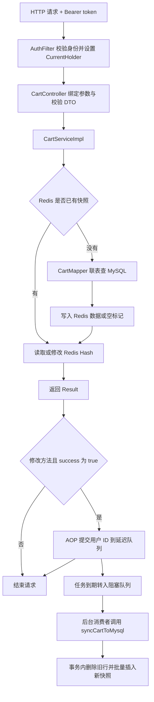
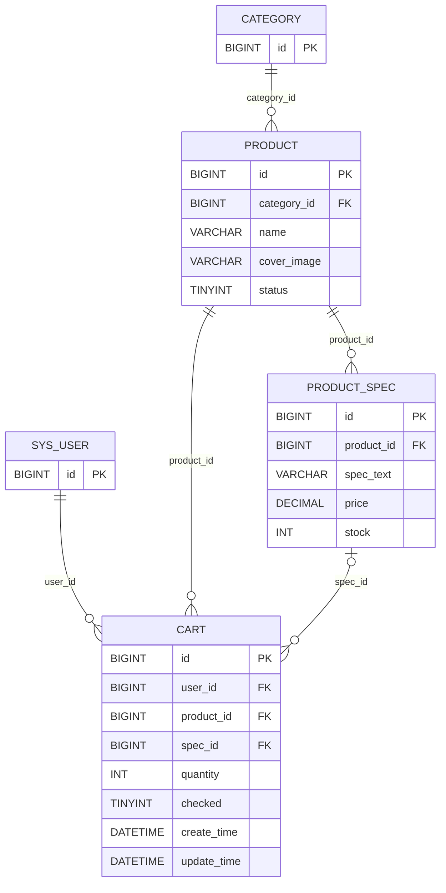
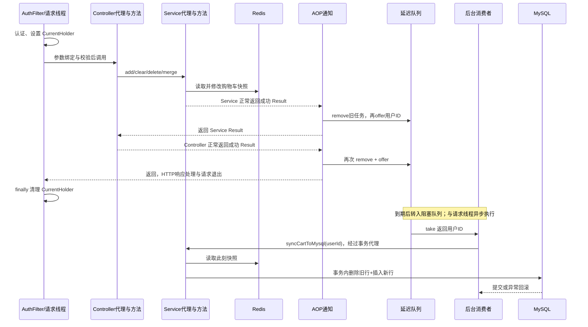

# 购物车接口与 AOP 学习笔记

整理日期：2026-10-03。依据当前单模块项目的 `src/main` 源码及源码注释；表结构依据 `src/main/resources/db/01-full-schema.sql`。这是代码阅读笔记，未连接数据库验证运行结果。示例 ID 是讲解用数据，实际请求需要库里存在的商品、规格和有效登录 token。

**阅读顺序：接口 → DTO → Service 公共方法 → 每个接口实现 → Mapper/表 → AOP → 延迟任务 → 事务同步。**

配套的 [完整源码附录](购物车接口与AOP源码附录.md) 保留原始 import、代码和注释；本文中的源码片段用于讲解。本文明确区分“当前实现”和“建议写法”，不会把建议说成已经实现。

快速导航：[接口契约](#2-接口契约传什么返回什么) · [公共方法](#4-公共方法先理解再看接口) · [五个接口](#5-五个接口逐步拆解) · [数据库](#6-mappersql-与数据库关系) · [AOP](#7-aop注解切点通知与执行顺序) · [延迟任务](#8-延迟队列线程与防抖) · [接入步骤](#9-在本项目完整加上一个-aop-实现) · [方法类型速查](#11-被调用的方法参数返回类型提供者)。

## 1. 先把整条链路串起来

购物车的主要读写位置是 Redis；MySQL 的 `cart` 表保存延迟同步的备份快照。查询时先读 Redis，没有缓存才联表查 MySQL 并预热 Redis。四个修改接口成功后，切面提交用户 ID，后台线程等任务到期再把当时的 Redis 快照全量同步到 MySQL。



图中 AOP 提交仍在请求线程完成；延迟到期后的数据库同步在后台线程执行。**`@AfterReturning` 在 Java 方法正常返回时执行，不等于 HTTP 响应已经发给前端。**

### 1.1 文件导航与职责

以下路径相对于项目根目录；完整代码集中在附录。

| 文件/包 | 职责 |
| --- | --- |
| `controller.user.CartController` | 五个 HTTP 接口，参数绑定，调用 Service |
| `pojo.dto.CartProductDTO / CartDTO` | 单项加购参数、整份购物车参数 |
| `service.CartService` | 业务方法契约，继承 `IService<Cart>` |
| `service.impl.CartServiceImpl` | Redis 读写、商品校验、快照入库 |
| `mapper.CartMapper / ProductMapper / ProductSpecMapper` | MyBatis 持久层代理 |
| `resources/mapper/CartMapper.xml` | Cart 映射片段；当前联表查询实际写在 Mapper 的 `@Select` 上 |
| `pojo.entity.Cart / CartItem / Product / ProductSpec` | 入库实体、缓存/展示对象、商品、规格 |
| `infrastructure.redis.connect.RedisConnector` | 包装 RedisTemplate，配置 Hash JSON 序列化 |
| `infrastructure.redis.generator.RedisKeyGenerator` | 构造 Redis 大 key 和 Hash field |
| `infrastructure.redis.properties.RedisCacheTtlProperties` | 缓存 TTL，默认购物车 7200 秒 |
| `aop.annotation.SaveCartRedisCacheToMysqlAnnotation` | 标记需要提交同步任务的方法 |
| `aop.aspect.SaveCartRedisCacheToMysqlAspect` | 正常返回后检查 Result，提交任务；失败时尝试立即同步 |
| `job.delay.SaveCartRedisCacheDelayJob` | 初始化队列，防抖提交，启动阻塞消费者 |
| `infrastructure.thread.config.CartSyncExecutorConfig` | 单线程后台执行器，关闭时中断线程 |
| `common.context.CurrentHolder / common.result.UserInfo` | 当前请求线程的用户信息 |
| `security.filter.AuthFilter` | 认证入口，设置并最终清理 ThreadLocal |
| `security.handler.AuthErrorHandler` | DTO 校验异常等的响应处理 |
| `common.result.Result / ResultCode` | 统一响应及业务码 |
| `common.constant.MessageConstant / pojo.enums.CommonStatus` | 错误文案，商品状态及同步时的 checked 值 |
| `LixiaopuApplication / pom.xml` | 包扫描及 AOP、Redis、MyBatis 等依赖 |

## 2. 接口契约：传什么、返回什么

所有接口需要 `Authorization: Bearer <accessToken>`，访问用户端时校验 `buyer:access` 权限。用户 ID 从登录上下文读取，前端不用传，不能靠请求指定操作别人的购物车。

| HTTP 接口 | Controller / Service 方法 | 参数类型与来源 | 成功时 `Result.data` |
| --- | --- | --- | --- |
| `GET /api/cart/list` | `getCartList()` | 无业务参数 | `List<CartItem>`，空车为 `[]` |
| `POST /api/cart/add` | `addProductToCart(CartProductDTO)` | JSON 请求体 | `null` |
| `DELETE /api/cart/clear` | `clearCart()` | 无业务参数 | `Map<String,Object>`：deletedIds、successCount |
| `DELETE /api/cart/products` | `deleteCartProduct(String,String)` | 查询参数 productIds、specIds | 同上 |
| `PUT /api/cart/update` | `mergeCart(CartDTO)` | JSON 请求体 | 非空列表时为输入的 `List<CartProductDTO>`；空列表时为 `null` |

五个 Controller 方法和对应 Service 方法的 Java 返回类型都是 `com.lixiaopu.common.result.Result`，不是泛型 `Result<T>`；内部 data 的运行时类型如上表。

### 2.1 单项请求 CartProductDTO

```json
{"productId":"100","specId":"201","quantity":2}
```

| 字段 | Java 类型 | 校验 | 作用 |
| --- | --- | --- | --- |
| productId | `java.lang.String` | `@NotBlank`、正整数正则 | 商品 ID，Service 再确认能转成 Long |
| specId | `java.lang.String` | 同上 | 规格 ID，必须属于当前商品 |
| quantity | `java.lang.Integer` | `@NotNull @Min(1)` | 加购增量；在 update 接口中代表最终数量 |

ID 正则 `[1-9][0-9]*` 不接受 0、负数、空格、前导零；正则不能限制 Long 上界，因此 Service 的 `positiveId` 还会处理 Long 溢出。

### 2.2 整份请求 CartDTO

```json
{
  "cartItems": [
    {"productId":"100","specId":"201","quantity":3},
    {"productId":"101","specId":"203","quantity":1}
  ]
}
```

`CartDTO.cartItems` 类型为 `java.util.List<CartProductDTO>`，有 `@NotNull`，但允许空列表。`@JsonAlias("items")` 允许用 `items` 作为输入别名。`List<@Valid CartProductDTO>` 级联校验每个非空元素；单独的 `@Valid` 不禁止 null 元素，因此 Service 还用 `validCartProduct(null)` 拒绝 null。

### 2.3 响应示例与错误差别

```json
{"success":true,"code":200,"message":"操作成功","data":null}
```

删除示例：

```json
{"success":true,"code":200,"message":"操作成功","data":{"deletedIds":["100","101"],"successCount":2}}
```

列表返回的单项包含 `productId、specId、quantity、price、stock、productName、productImage、specText`，以及可能为 null 的 `id、userId、createTime、updateTime`；完整字段见附录 CartItem。新建缓存条目没有设置数据库 ID 和时间，不能假设这些字段总有值。

| 场景 | 实际处理 |
| --- | --- |
| DTO 字段校验不通过 | `AuthErrorHandler.invalid()` 返回 HTTP 400；body 的业务 code 为 404，message 为“参数检验失败” |
| Service 参数检查不通过 | `Result.error(INPUT_DATA_ERROR)`，success=false、code=500、data=null、message=“输入数据不合法” |
| 商品/规格无效 | message=“数据异常,请重试” |
| 删除项不存在 | message=“删除的购物车不存在” |
| Result.error 正常返回 | AOP 的 AfterReturning 仍会执行，但看到 success=false 后退出 |
| 方法直接抛出异常 | 不执行该方法的 AfterReturning；当前 Advice 没有通用异常处理器保证统一 Result 格式 |

`Result.code` 是 JSON 业务字段，不自动决定 HTTP 状态；Controller 普通返回 Result 的业务错误通常仍是 HTTP 200。缺查询参数、JSON 解析失败等发生在进入 Controller 方法之前，不能一概当作上述 Service 错误。

## 3. Redis 结构与三个关键对象

```text
用户 1001 的整车 key：lxp:cart:1001
Redis 类型：Hash

field       value（Java 侧）
100:201     CartItem(productId="100", specId="201", quantity=3, ...)
100:202     CartItem(productId="100", specId="202", quantity=1, ...)

空车时：
0:0         ""
```

`cartKey` 是整个用户购物车的 Redis key；`cartHashKey` 是 Hash 内一项的 field。**同一用户 + 同一商品 + 同一规格** 才是同一个条目；同商品不同规格分开存。TTL 设在整个 Hash key 上，不是每个 field 单独过期。

| 类 | 所属包 | 数据用途 |
| --- | --- | --- |
| CartProductDTO | `com.lixiaopu.pojo.dto` | 只收 productId、specId、quantity，不信任前端传来的价格 |
| CartItem | `com.lixiaopu.pojo.entity` | Redis/联表展示对象；ID 用 String，金额用 BigDecimal；当前没有 `@TableName`、没有 checked 字段 |
| Cart | `com.lixiaopu.pojo.entity` | `@TableName("cart")` 的数据库实体；ID 用 Long，有 checked，没有名称、图片、价格字段 |

`RedisConnector` 把 key/hashKey 配为 `StringRedisSerializer`，hashValue 配为 `GenericJackson2JsonRedisSerializer`。Java 对象会编码成 JSON 字节存储，再反序列化成对象；不是直接把内存对象放进 Redis，也不是当前使用 JDK 序列化。

### 3.1 为什么空购物车不能只删除 key

假设 MySQL 里还有旧条目，用户清空 Redis 后尚未同步：如果只删 Redis key，下一次 list 就会认为缓存未命中，从 MySQL 重新加载旧条目。写 `0:0 → ""` 让系统区分“可信空快照”和“没有可信缓存”。

`writeEmptyCart` 先删整车 key，再写空标记和 TTL。读取时过滤空标记后得到 `[]`；同步时过滤后得到空列表，仍然删除 MySQL 旧条目。Redis 连空标记都没有时，sync 方法直接返回，不清空数据库。

## 4. 公共方法：先理解再看接口

以下方法均定义在 `com.lixiaopu.service.impl.CartServiceImpl`。私有方法是内部普通调用，没有独立的 HTTP 接口，也不会因本类内部调用而经过 Spring AOP 代理。

| 完整签名 | 参数含义 | 返回含义 |
| --- | --- | --- |
| `private Map<String,Object> loadCartMap(Long userId, String cartKey)` | 登录用户 ID、整车 Redis key | field → CartItem，或仅含空标记的 Map |
| `private void writeEmptyCart(String cartKey)` | 整车 Redis key | 无返回；删除旧 Hash 并写空标记 |
| `private static Long positiveId(String value)` | ID 字符串 | 合法正 Long，否则 null |
| `private static boolean validCartProduct(CartProductDTO item)` | 请求条目 | 非 null、两个 ID 合法、数量>0 才为 true |
| `private Map<Long,Product> getProductDetailByProductIdSet(Set<Long> productIds)` | 去重商品 ID 集合 | 商品 ID → 商品对象，其 specList 已填充 |
| `private CartItem replenishCartItem(Map<Long,Product> productDetailMap, CartItem cartItem)` | 商品映射、待补全条目 | 原条目补全后返回；匹配失败返回 null |

类型来自 `java.util.Map/Set/List`、`java.lang.Long/String/Object`；Product、CartItem 来自 `com.lixiaopu.pojo.entity`。

### 4.1 loadCartMap：Redis 优先、MySQL 兜底

本章方法原文：[CartServiceImpl 完整源码](购物车接口与AOP源码附录.md#source-3)。

第一步：`opsForHash().entries(cartKey)` 得到所有 field/value。

第二步：Map 非空直接返回，包括只有空标记的情况。

第三步：Map 为空才调用 `cartMapper.getCartList(userId)`；这是“缓存不存在”的兜底，不是 Redis 连接异常时的自动降级。Redis 抛异常时本方法没有 catch 转去数据库。

第四步：数据库也为空就写空标记，返回 `Map.of(EMPTY_CART_HASH_KEY, "")`。

第五步：数据库有条目，按商品 ID + 规格 ID 建立 HashMap，`putAll` 写入 Redis，设置 TTL，返回内存里的 loaded Map。这个方法不是写完后再查一遍 Redis。

源码关键部分：

```java
Map<String, Object> cartMap = redisConnector.opsForHash().entries(cartKey);
if (!cartMap.isEmpty()) {
    return cartMap;
}
List<CartItem> storedItems = cartMapper.getCartList(userId);
if (CollectionUtils.isEmpty(storedItems)) {
    writeEmptyCart(cartKey);
    return Map.of(EMPTY_CART_HASH_KEY, "");
}
```

### 4.2 getProductDetailByProductIdSet：两次批量查库

第一步：空 Set 返回 `Map.of()`。

第二步：查询 product，条件 `id IN (...) AND status = ACTIVE`。`CommonStatus.ACTIVE` 的 `@EnumValue number` 为 1，数据库状态按数字映射。

第三步：查这些 ID 对应的 product_spec；不是每个商品发一次 SQL。

第四步：按 `ProductSpec.productId` 分组，把同商品的规格放在一个 List 中。

第五步：遍历有效商品，填 `Product.specList`，组成 `Map<Long,Product>`。specList 是 `@TableField(exist=false)` 的组装字段，不是 product 表的一列。

```java
specsByProduct.computeIfAbsent(spec.getProductId(), ignored -> new ArrayList<>()).add(spec);
product.setSpecList(specsByProduct.getOrDefault(product.getId(), List.of()));
details.put(product.getId(), product);
```

`computeIfAbsent`：存在商品 ID 就取原 List；不存在才创建 List 并放进 Map。`ignored` 是 lambda 形参名，代表这里不使用传入的 key。`getOrDefault` 找不到时返回空 List，不自动把默认值写入 Map。

### 4.3 replenishCartItem：价格必须来自数据库

第一步：Map/条目为 null，返回 null。

第二步：从 cartItem.productId 转 Long 查 Product；商品不存在或没有规格，返回 null。

第三步：遍历这个商品自己的 specList，用 specId 找规格。这一步保证规格属于商品，而不是只确认规格 ID 存在。

第四步：填规格价格、库存、规格文字，以及商品名称、主图，返回同一个 CartItem。

```java
cartItem.setPrice(productSpec.getPrice())
        .setStock(productSpec.getStock())
        .setProductName(product.getName())
        .setProductImage(product.getImage())
        .setSpecText(productSpec.getSpecText());
return cartItem;
```

注意：这里只填 stock，没有检查 `quantity <= stock`，没有扣库存，也没有预占库存。

## 5. 五个接口逐步拆解

对照源码：[CartController](购物车接口与AOP源码附录.md#source-1) · [CartService 接口](购物车接口与AOP源码附录.md#source-2) · [CartServiceImpl 实现](购物车接口与AOP源码附录.md#source-3) · [单项 DTO](购物车接口与AOP源码附录.md#source-4) · [整车 DTO](购物车接口与AOP源码附录.md#source-5)。

### 5.1 GET list：查列表

签名：Controller 与 Service 都是 `public Result getCartList()`。

第一步：`CurrentHolder.getCurrentUser().getId()` 取用户 ID。

第二步：构造 `lxp:cart:<userId>`。

第三步：调用 loadCartMap，命中直接读缓存，否则回源。

第四步：entrySet 流过滤 `0:0`，将 value 转为 CartItem，收集 List。

第五步：`Result.success(cartItemList)` 返回。

```java
List<CartItem> cartItemList = cartMap.entrySet().stream()
        .filter(entry -> !EMPTY_CART_HASH_KEY.equals(entry.getKey()))
        .map(entry -> (CartItem) entry.getValue())
        .toList();
return Result.success(cartItemList);
```

注意：没有同步注解；list 不提交延迟任务。缓存命中时不刷新 TTL，不重新校验商品上架状态，也不刷新价格和库存。Hash/Map 没有给出稳定业务排序，不能把返回次序当作加购顺序。强转要求缓存值确实还原为 CartItem。

### 5.2 POST add：同规格累加数量

签名：`public Result addProductToCart(CartProductDTO cartProductDTO)`。

第一步：HTTP 层 `@RequestBody @Valid` 校验；Service 再 `validCartProduct` 检查，防止直接调用 Service 绕过入口校验。

第二步：取用户，取 productId/specId/quantity，构造整车 key 和条目 field。

第三步：loadCartMap 确保已加载当前购物车。

第四步：若已有该 field，取 CartItem，执行 `Math.addExact(旧数量, 增量)`；溢出则返回输入错误。

第五步：若没有，builder 创建只含 ID、数量的 CartItem；查询商品与规格，补全展示信息；失败返回 DATA_ERROR。

第六步：删除空标记，`put` 写入条目，刷新 TTL，返回 `Result.success()`。

第七步：Service 正常成功返回后执行切面；当前 Controller 也有同注解，所以 Controller 正常返回时再执行一次。

例：已有 100:201 数量 3，本次传 quantity=2，最终数量 5。同商品规格 202 是另一个 field。

注意：已有条目分支不重新查数据库，因此商品下架、价格变化、库存变化不会在这个分支重新核验。`Math.addExact` 防整数溢出，不解决并发读改写丢更新；两个请求都读 3、都加 1、各写 4，可能只增加 1。

### 5.3 DELETE clear：清空并返回删除统计

签名：`public Result clearCart()`。

第一步：取用户 ID、key，loadCartMap。

第二步：过滤空标记，收集所有 CartItem.productId 为 `List<String>`。

第三步：writeEmptyCart 写可信空快照。

第四步：构造 Map，deletedIds=商品 ID 列表，successCount=列表 size。

第五步：成功返回，切面安排延迟同步；同步时删除该用户的 MySQL 旧行。

注意：同商品两个规格会返回两个相同 productId，successCount 数的是条目数，不是去重商品数。清空本来就是空车也成功，deletedIds=[]、successCount=0。“冗余接口(暂定)”是源码里的设计备注，目前实际可调用。

### 5.4 DELETE products：按位置配对批量删除

签名：`public Result deleteCartProduct(String productIds, String specIds)`。

请求示例：`DELETE /api/cart/products?productIds=100,101&specIds=201,203`。

第一步：检查两参数非空白。

第二步：`split(",", -1)` 拆开，Arrays.asList 转 List。`-1` 保留末尾空元素，因此 `100,` 不会悄悄变成合法单项。

第三步：检查两个列表长度相同；按下标配成 `(100,201)`、`(101,203)`，不是笛卡尔积。

第四步：检查每个 ID 可转正 Long，组合 field 放 HashSet；重复同一 pair 直接报输入错误，而非静默忽略。

第五步：loadCartMap；`cartMap.keySet().containsAll(hashKeys)` 检查所有目标都存在。任何一项不存在，本次都不删除。

第六步：`opsForHash().delete(cartKey, hashKeys.toArray())` 一次发出 Hash 字段删除。

第七步：再读 Redis 判断是否为空；为空写空标记，否则刷新 TTL。

第八步：返回 deletedIds=输入商品列表、successCount=去重 pair 数量。

注意：不自动 trim，`"100, 101"` 的第二个 ID 不合法。同商品不同规格是合法多项；返回商品 ID 会重复。代码没有使用 Redis delete 的实际删除数量，返回的是检查后计划删除数，并发时统计可能与实际删除数不同。

### 5.5 PUT update：验证整份快照后覆盖

签名：`public Result mergeCart(CartDTO cartDTO)`。

第一步：检查 DTO 和 cartItems 非 null，取用户和整车 key。

第二步：空列表则 writeEmptyCart，返回 data=null 的成功结果。

第三步：逐条检查参数，按商品+规格判重，并收集商品 Set。

第四步：批量查询商品/规格信息。

第五步：在本地内存里构建 replacement Map，逐项补全；任一商品或规格无效，直接失败，尚未删除旧 Redis。

第六步：全部业务校验完成后，删除旧 key，putAll 写整份 replacement，刷新 TTL。

第七步：`Result.success(carts)` 返回输入 DTO 列表，而非补全后的 CartItem 列表。需要名称价格等可再调 list。

注意：名字是 mergeCart，但**当前行为是整份覆盖**。旧车有 A、B，传入只有 A，新车只剩 A；数量是最终数量，不和旧数量相加。Controller 注释说“更新到数据库”，真实过程是先写 Redis 再延迟落 MySQL。

所有校验先于覆盖，不代表 Redis 写入原子化；delete、putAll、expire 是独立调用，网络故障或并发可能在中间发生，当前没有 Lua/Redis 事务/版本检查。

## 6. Mapper、SQL 与数据库关系

对照源码：[CartMapper](购物车接口与AOP源码附录.md#source-10) · [Cart 实体](购物车接口与AOP源码附录.md#source-6) · [CartItem 对象](购物车接口与AOP源码附录.md#source-7) · [建表 SQL](购物车接口与AOP源码附录.md#source-schema)。

### 6.1 四张核心表与分类关联



每个 cart 行就是一个购物车条目，没有额外的“购物车主表 + cart_item 明细表”。CartItem 是 Java 数据对象，不是独立数据库表。CartService 顶部生成注释提到 cart_item 是旧注释，实际继承的是 `IService<Cart>`。

| 关系/约束 | 当前建表 SQL |
| --- | --- |
| cart.user_id → sys_user.id | 非空外键，一个用户多个条目 |
| cart.product_id → product.id | 非空外键，一个商品多个用户可加购 |
| cart.spec_id → product_spec.id | 可空外键；当前 HTTP DTO 强制 specId 非空合法 |
| product_spec.product_id → product.id | 非空外键，一个商品多个规格 |
| product.category_id → category.id | 非空外键；购物车流程不直接查 category |
| cart.quantity | INT、默认 1、CHECK(quantity>0) |
| cart.checked | TINYINT、默认 0；同步显式写 0 |
| 条目唯一性 | 没有 `(user_id,product_id,spec_id)` 联合唯一约束，Redis field 只能保证缓存侧一对一个 |

独立外键只保证各 ID 存在，不自动保证 cart.spec_id 指向的规格属于 cart.product_id。Service 的 replenish 在新建和整份覆盖时检查这个关系；直接写库仍可能产生不一致组合。

### 6.2 CartMapper.getCartList

签名：`List<CartItem> getCartList(@Param("userId") Long userId)`；所属 `com.lixiaopu.mapper.CartMapper`。

```sql
SELECT c.id, c.user_id, c.product_id, c.spec_id, c.quantity, c.checked,
       c.create_time, c.update_time, p.name AS product_name,
       p.cover_image AS product_image, ps.spec_text, ps.price, ps.stock
FROM cart c
LEFT JOIN product p ON p.id = c.product_id
LEFT JOIN product_spec ps ON ps.id = c.spec_id
WHERE c.user_id = #{userId}
```

第一步：按 user_id 取购物车行。

第二步：通过 product_id 查商品名称和主图。

第三步：通过 spec_id 查规格文字、单价和库存。购物车展示价格来自规格，不是 product.price。

第四步：MyBatis 根据别名和驼峰配置组装 CartItem；BIGINT ID 映射到 CartItem 的 String 字段。`#{userId}` 是绑定参数，不是拼接 SQL。

`LEFT JOIN` 保留 cart 行，即使关联数据未匹配也返回，只是展示字段可能为 null。该查询没有 `status=1` 条件，没有验证规格归属，也没有 `ORDER BY`。查了 c.checked，但 CartItem 没有 checked 属性，不能当作已返回勾选状态。`CartMapper.xml` 的 BaseResultMap 类型是 Cart，当前 `@Select` 查询没有用这个 resultMap 来生成 CartItem。

### 6.3 syncCartToMysql：全量替换，不是逐项 upsert

签名：`public void syncCartToMysql(Long userId)`；CartService 声明，CartServiceImpl 实现。只接受显式用户 ID，后台不读 CurrentHolder。

第一步：positiveId 验证 userId；非法则抛 IllegalArgumentException。

第二步：直接读取 Redis，不调用 loadCartMap；Map 为空立即 return，因为缺失缓存不是“已清空”的证据。

第三步：过滤空标记；检查值确实是 CartItem，否则抛 IllegalStateException。

第四步：把 String ID 转 Long，构造 `List<Cart>`；只保存 userId、productId、specId、quantity，checked=0。

第五步：`lambdaUpdate().eq(Cart::getUserId, validUserId).remove()` 删除旧快照。

第六步：列表非空才 saveBatch；返回 false 则抛异常。仅有空标记时，删除后不插入，完成真正清空。

```java
@Transactional(rollbackFor = Exception.class)
public void syncCartToMysql(Long userId) {
    // 完整校验与转换见源码附录
    // 删除旧快照与保存新快照位于同一个数据库事务内
}
```

事务代理在进入方法前开启事务，方法正常返回后提交，异常回滚。Job/Aspect 注入 CartService 后调用该方法，经过 Spring 代理；若改成同一对象里 `this.syncCartToMysql(...)`，会绕过代理，不能照搬现有事务结论。

注意：事务覆盖 MySQL 删除/插入，不覆盖前面请求里的 Redis 修改；失败不会自动恢复 Redis。全量替换会产生新的 cart.id，创建时间可能重置；不是保留旧 ID 的增量更新。Cart 上的 FieldFill 注解是填充声明，当前没找到 MetaObjectHandler，不能认定时间字段已由 Java 自动填充；数据库有时间默认值，最终仍取决于生成 SQL 是否省略相关列。

## 7. AOP：注解、切点、通知与执行顺序

对照源码：[标记注解](购物车接口与AOP源码附录.md#source-17) · [完整切面及失败兜底](购物车接口与AOP源码附录.md#source-18)。

### 7.1 三个角色

标记注解：

```java
@Target(ElementType.METHOD)
@Retention(RetentionPolicy.RUNTIME)
public @interface SaveCartRedisCacheToMysqlAnnotation {
}
```

`@Target` 限定只能标方法，`@Retention(RUNTIME)` 使运行时可以读取。它只是一枚标记，不会自己执行存库。

切面声明与切点：

```java
@Aspect
@Component
public class SaveCartRedisCacheToMysqlAspect {
    @Pointcut("@annotation(com.lixiaopu.aop.annotation.SaveCartRedisCacheToMysqlAnnotation)")
    public void pointCut() {
    }
}
```

`@Aspect` 表示里面定义切面规则，`@Component` 使它成为可扫描的 Bean；表达式匹配标记注解的方法。空的 pointCut 方法只是为规则命名，后续通知通过 `pointCut()` 引用，并不会运行一段“切点业务逻辑”。

通知：

```java
@AfterReturning(pointcut = "pointCut()", returning = "result")
public void afterReturnSuccess(Result result) {
    if (Objects.isNull(result)) {
        return;
    }
    if (!Boolean.TRUE.equals(result.getSuccess())) {
        return;
    }
    // 取登录用户，提交任务；异常兜底见完整源码
}
```

签名是 `void afterReturnSuccess(Result result)`，所属 `com.lixiaopu.aop.aspect.SaveCartRedisCacheToMysqlAspect`。`returning="result"` 绑定目标方法返回对象给形参；形参 Result 类型也限定适配的返回值。通知返回 void，不替换目标 Result。`Boolean.TRUE.equals(...)` 可以安全处理 null。

### 7.2 当前项目成功请求的真实顺序



图描述正常延迟路径；若配置立即到期，消费者可能和请求结束重叠，不保证一定在 HTTP 返回后才取任务。双触发来自**两个不同 Bean 的方法都被标记**，不是一个方法重复运行通知。后一次提交通常移除前一次还在延迟队列的任务，重新计时；不是严格保证最后只入库一次。

建议：只保留 Service 四个修改方法上的标记，让 Controller 专注 HTTP；这样从其他 Bean 调用 Service 也能触发同步。这里只是学习建议，未修改业务源码。

### 7.3 失败分支

第一种：返回 Result.error，通知会进入，但 success=false，直接退出；Controller 若也正常返回错误，同样进入再退出。

第二种：Service 抛异常，不执行它的 AfterReturning；Controller 未正常返回也不执行其 AfterReturning。

第三种：业务已写 Redis，但延迟任务提交抛异常，通知捕获后调用 `cartService.syncCartToMysql(userId)` 立即同步。

第四种：立即同步也失败，则给 syncError 加 suppressed 的 enqueueError，抛 `IllegalStateException("购物车保存失败，请稍后重试", syncError)`；原来的成功 Result 不再正常传出，Redis 仍可能已经变更。

取 CurrentHolder 用户的语句在通知 try 外部，因此没有用户上下文产生的异常不属于提交失败兜底。后台线程不能随便调用这些带标记的修改方法：ThreadLocal 用户不会自动从请求线程传过去。

### 7.4 不同通知与多切面顺序

| 通知注解（`org.aspectj.lang.annotation`） | 触发时机 |
| --- | --- |
| @Before | 目标调用前 |
| @AfterReturning | 目标正常返回后，包括正常返回业务错误 |
| @AfterThrowing | 目标异常退出时 |
| @After | 类似 finally，在调用结束时清理 |
| @Around | 包裹调用，使用 ProceedingJoinPoint.proceed() 放行，可以处理返回值和异常 |

概念上可写成：Around前段 → Before → 目标方法 → 正常返回/异常分支通知与最终通知 → Around后段或 catch/finally。具体多通知的相对位置受代理链、切面优先级与嵌套结构影响，不应把注解书写位置当执行顺序。当前购物车自定义切面只用了 AfterReturning。

多个切面需要明确顺序时，可给切面类添加 `org.springframework.core.annotation.Order`；值小者优先级高，进入时先执行、退出时后执行。同切面多个同类通知不要依靠源码顺序。依据 [Spring 6.2 通知文档](https://docs.spring.io/spring-framework/reference/6.2/core/aop/ataspectj/advice.html)。

## 8. 延迟队列、线程与防抖

对照源码：[Job](购物车接口与AOP源码附录.md#source-19) · [线程池](购物车接口与AOP源码附录.md#source-20) · [TTL 配置属性](购物车接口与AOP源码附录.md#source-16)。

### 8.1 启动阶段

第一步：Spring 扫描 `CartSyncExecutorConfig`，注册名字为 `saveCartRedisCacheToMysqlThreadPool` 的 ExecutorService。

第二步：Job 注入 RedissonClient、TTL 属性、CartService、指定名称的 Executor。

第三步：依赖注入完成后 `@PostConstruct private void init()` 执行一次；Bean 尚处于初始化阶段，不是所有 Bean 都完全启动后才执行。

第四步：创建 `RBlockingQueue<String>`，名字 `saveCartRedisCacheBlockingQueue`；再创建关联它的 `RDelayedQueue<String>`。

第五步：startConsumer 将长期运行的循环提交到线程池；没有消息时 take 阻塞等待，初始化方法本身不会阻塞在那里。

### 8.2 提交任务与真实延迟

签名：`public void setUserIdToDelayedQueue(long userId)`，所属 `com.lixiaopu.job.delay.SaveCartRedisCacheDelayJob`。

```java
delayedQueue.remove(String.valueOf(userId));
long delayInSeconds = redisKeyTtlProperties.getCartTtl() - 3600;
if (delayInSeconds < 0) {
    delayInSeconds = 10;
}
delayedQueue.offer(String.valueOf(userId), delayInSeconds, TimeUnit.SECONDS);
```

默认 cartTtl=7200 秒，默认延迟 **3600 秒，即 1 小时**；源码“例如 30 分钟”只是举例。当前 application-user.yml 未覆盖该属性；外部配置可用 `redis.cache.ttl.cart-ttl` 改默认值。

```yaml
# 配置说明示例，不代表已经写入项目
redis:
  cache:
    ttl:
      cart-ttl: 7200
```

t=0 操作 → 预计 t=3600 同步；t=60 又操作 → 移除旧任务，预计 t=3660 同步。任务保存的是 userId，不是操作时的 CartItem 快照；消费时读取当时 Redis 最新数据。

注意：条件是 `<0`，TTL=3600 时延迟为 0，不是 10 秒。TTL<3600 时延迟固定为 10 秒，TTL≤10 时不能保证同步前快照仍在。减一小时只表达预留时间的意图；消费者积压、故障也可能错过 TTL。

remove + offer 是两个动作，不是原子防抖；多请求并发可能放入重复任务。已到期进入 blockingQueue 或已经被 take 的任务不会被 delayedQueue.remove 撤回。

### 8.3 消费线程

签名：`private void startConsumer()`，无参数、void 返回。

第一步：Executor.execute 提交 Runnable。

第二步：while 检查当前线程没有中断。

第三步：`blockingQueue.take()` 阻塞取到字符串用户 ID，Long.parseLong 转成 long。

第四步：调用 `cartService.syncCartToMysql(userId)`，自动装箱为 Long。这里用户 ID 显式传入，不需要 CurrentHolder。

第五步：普通异常记录日志后继续循环；**当前没有自动重入队、重试次数或死信队列**。take 已取走的任务失败后可能不会再执行，除非后续另有任务。

第六步：InterruptedException 时恢复中断标记并 break。break 退出 while，不是“退出 try 再继续判断”；恢复标记保留中断语义。

### 8.4 单线程池与关闭

`public ExecutorService cartSyncExecutor()` 定义于 `com.lixiaopu.infrastructure.thread.config.CartSyncExecutorConfig`。

```java
return Executors.newSingleThreadExecutor(task -> {
    Thread thread = new Thread(task, "cart-sync-consumer");
    thread.setDaemon(true);
    return thread;
});
```

task 类型是 `java.lang.Runnable`，不是 Thread；lambda 是 ThreadFactory 的实现，返回 Thread。一个线程运行长期消费循环，每次同步串行执行；它独立于 Tomcat 请求线程，但仍共享 CPU、数据库连接、Redis 等资源。

`@Bean(..., destroyMethod="shutdownNow")` 在容器关闭时调用线程池 shutdownNow，尝试中断消费者。daemon 线程不会阻止 JVM 退出，但不能保证任务完成；这里不是“优雅等待所有同步结束”。当前也没有 `@PreDestroy` 显式清理 delayedQueue。

### 8.5 注释中的“循环依赖”怎么理解

当前 pom 是一个 Maven 模块，`common、service、job、aop` 都是 Java 包，包名不构成 Maven 模块依赖环。主要 Bean 引用：

```text
CartController → CartServiceImpl → Mapper / RedisConnector / TTL
Aspect → Job → CartService（代理）
Aspect → CartService（代理）
Job → Executor / RedissonClient / TTL
```

Service 源码没有注入 Job 或 Aspect，以上显式业务依赖没有回指。AOP 框架代理装配是容器行为，不等同于 Java 包互相 import 或 Maven 模块依赖。

如果未来拆模块，让 common 引用 user 中的 Service，同时 user 又依赖 common，才会形成模块依赖环。可将购物车切面和 Job 放到业务模块，common 只放公共注解、DTO/接口契约；基础设施依赖通过接口注入。不能靠开启 allow-circular-references 解决 Maven 编译依赖环。

## 9. 在本项目完整加上一个 AOP 实现

当前购物车 AOP 已存在；下面用它的文件讲从零接入流程。无需再创建重复切面。

**第一步：检查依赖。** 根 pom 已有：

```xml
<dependency>
  <groupId>org.springframework.boot</groupId>
  <artifactId>spring-boot-starter-aop</artifactId>
</dependency>
```

**第二步：定义运行时方法标记。** 在 `com.lixiaopu.aop.annotation` 创建注解，加 METHOD 和 RUNTIME，代码见 7.1。

**第三步：定义 Spring 切面 Bean。** 在 `com.lixiaopu.aop.aspect` 创建类，加 `@Aspect @Component`；不只写 @Aspect。

**第四步：定义切点。** 用注解全限定名写 `@annotation(...)`，挂在空方法上命名复用；也可直接把表达式写在通知的 pointcut 属性里。

**第五步：定义通知与业务判断。** 用 AfterReturning 接 Result，只对 success=true 提交任务；需要捕获并处理提交失败，完整项目实现见附录 Aspect。不能把“正常返回”直接等同业务成功。

**第六步：准备通知调用的 Bean。** 本场景还必须有 Job、RedissonClient、TTL 属性、指定名称 Executor、CartService.syncCartToMysql；只有注解和切面并不等于延迟持久化整条链路已经具备。

**第七步：扫描相关包。** 用户启动类 LixiaopuApplication 已扫描 `com.lixiaopu.aop`、`com.lixiaopu.job`、`com.lixiaopu.service`、`com.lixiaopu.infrastructure`。AdminApplication 当前没有扫描 aop/job；管理端进程不能默认按用户端链路推断。

**第八步：在被 Spring 管理的方法上使用注解。** 推荐 Service 层四个 public 修改方法作为唯一标记位置；方法返回 Result，与通知绑定一致。

**第九步：从其他 Bean 通过注入引用调用。** `cartService.addProductToCart(dto)` 经过代理；`new CartServiceImpl()` 和内部 `this.xxx()` 不经过相同代理链。CGLIB 不能通知 private/final 方法。依据 [Spring 6.2 代理机制](https://docs.spring.io/spring-framework/reference/6.2/core/aop/proxying.html)。

**第十步：验证完整路径。** 有效加购后检查 Redis、提交日志、消费日志和 MySQL；业务错误不应产生任务；抛异常不应触发 AfterReturning；清空要同步成数据库空车；提交失败要走即时同步兜底。用日志确认当前双触发，不要凭接口返回成功判断入库完成。

本项目使用 Boot AOP 自动配置，AspectJ 在依赖中时通常无需另加 `@EnableAspectJAutoProxy`；Boot 默认使用 CGLIB，可通过 `spring.aop.proxy-target-class=false` 切换。不要设置 `spring.aop.auto=false` 后还期待自动启用。依据 [Spring Boot 3.5 AOP 文档](https://docs.spring.io/spring-boot/3.5/reference/features/aop.html)。

这是接入方法和人工验证清单，本次没有修改运行代码或执行购物车集成请求。

## 10. 注解速查：来源与作用

| 注解 | 提供的 Java 包 | 当前作用/注意点 |
| --- | --- | --- |
| RestController、RequestMapping、GetMapping、PostMapping、DeleteMapping、PutMapping、RequestBody、RequestParam | `org.springframework.web.bind.annotation` | 路由、JSON 绑定、查询参数绑定；RestController 支持响应体转换 |
| Valid | `jakarta.validation` | 触发/级联 DTO 校验，不是 Spring 的注解 |
| NotBlank、NotNull、Min、Pattern | `jakarta.validation.constraints` | 约束声明，需校验入口触发 |
| JsonAlias、JsonFormat | `com.fasterxml.jackson.annotation` | 输入字段别名、JSON 时间格式 |
| Autowired、Qualifier | `org.springframework.beans.factory.annotation` | 按类型注入，并用 Bean 名细化选择 |
| Service、Component | `org.springframework.stereotype` | 注册 Bean，语义分别为业务类、普通组件 |
| Configuration、Bean | `org.springframework.context.annotation` | 配置类和工厂方法注册 Bean |
| ConfigurationProperties | `org.springframework.boot.context.properties` | 从 redis.cache.ttl 前缀绑定配置 |
| Aspect、Pointcut、AfterReturning | `org.aspectj.lang.annotation` | 声明切面、匹配规则、正常返回通知 |
| Target、Retention | `java.lang.annotation` | 限制标记位置、设置保留期 |
| PostConstruct | `jakarta.annotation` | 当前 Bean 注入完成后初始化队列和消费者 |
| Transactional | `org.springframework.transaction.annotation` | 数据库快照替换事务，异常回滚 |
| Select、Param | `org.apache.ibatis.annotations` | SQL 查询声明和参数命名 |
| MapperScan | `org.mybatis.spring.annotation` | 注册 Mapper 代理，不是扫描 Entity |
| TableName、TableId、TableField、EnumValue | `com.baomidou.mybatisplus.annotation` | 表/列映射、主键策略、枚举持久值 |
| Data、Builder、NoArgsConstructor、AllArgsConstructor、RequiredArgsConstructor | `lombok` | 编译时生成访问器、builder、构造器等 |
| Accessors | `lombok.experimental` | chain=true 时 setter 返回当前对象以支持链式调用 |
| Slf4j | `lombok.extern.slf4j` | 生成 log 字段 |
| Serial | `java.io` | 声明序列化相关成员，当前 Redis JSON 不依赖 serialVersionUID |
| DateTimeFormat | `org.springframework.format.annotation` | Spring 格式转换，不代替 Jackson 的 JSON 配置 |

CartServiceImpl 当前没有 final 或 @NonNull 的必需注入字段，`@RequiredArgsConstructor` 不会替这些 @Autowired 字段生成有参注入构造器。`@Builder` 创建新对象；`@Accessors(chain=true)` 则让已有对象 setter 可连写，二者机制不同。

源码对 Serializable/serialVersionUID 的注释是在解释 JDK 序列化背景；固定 UID 也不能保证所有类变更兼容。当前缓存使用 JSON 序列化，还要考虑对象类型信息、日期类型支持、结构变更；Serializable 不是这个 JSON 方案的前置条件。

## 11. 被调用的方法：参数、返回类型、提供者

泛型用当前场景具体类型表示；链式 Wrapper 的方法在框架内由父类型提供，表中列出对外使用的类/接口。Lombok 生成方法在编译后存在，源文件里未必能搜到方法体。

### 11.1 本项目辅助 API

| 提供者全限定名 | 方法/参数类型 | 返回类型 |
| --- | --- | --- |
| `com.lixiaopu.common.context.CurrentHolder` | `getCurrentUser()` / `setCurrentUser(UserInfo)` / `remove()` | UserInfo / void / void |
| `com.lixiaopu.common.result.UserInfo` | `getId()`（Lombok） | Long |
| `com.lixiaopu.infrastructure.redis.generator.RedisKeyGenerator` | `cartKey(Long)` / `cartHashKey(Object,Object)` | String / String |
| `com.lixiaopu.infrastructure.redis.connect.RedisConnector` | `opsForHash()` / `expire(String,long,TimeUnit)` / `delete(String)` | `HashOperations<String,String,Object>` / void / void |
| `com.lixiaopu.infrastructure.redis.properties.RedisCacheTtlProperties` | `getCartTtl()`（Lombok） | long |
| `com.lixiaopu.common.result.Result` | `success()` / `success(Object)` / `error(String)` | Result |
| 同上 | `getSuccess()`（Lombok） | Boolean |
| `com.lixiaopu.pojo.entity.CartItem` | `builder()` / builder字段方法 / `build()` | CartItemBuilder / CartItemBuilder / CartItem |
| 同上 | `getProductId()` / `getSpecId()` / `getQuantity()` | String / String / Integer |
| 同上 | `setQuantity(Integer)`、`setPrice(BigDecimal)`、`setStock(Integer)`、`setProductName(String)`、`setProductImage(String)`、`setSpecText(String)` | CartItem（chain=true） |
| `com.lixiaopu.pojo.entity.Cart` | `builder()` / builder字段方法 / `build()` | CartBuilder / CartBuilder / Cart |
| `com.lixiaopu.pojo.entity.Product` | `getId()`、`getName()`、`getImage()`、`getSpecList()`、`setSpecList(List<ProductSpec>)` | Long / String / String / List<ProductSpec> / void |
| `com.lixiaopu.pojo.entity.ProductSpec` | `getId()`、`getProductId()`、`getPrice()`、`getStock()`、`getSpecText()` | Long / Long / BigDecimal / Integer / String |
| `com.lixiaopu.pojo.dto.CartProductDTO` | `getProductId()`、`getSpecId()`、`getQuantity()` | String / String / Integer |
| `com.lixiaopu.pojo.dto.CartDTO` | `getCartItems()` | List<CartProductDTO> |
| `com.lixiaopu.pojo.enums.CommonStatus` | `getNumber()` | Integer |

### 11.2 Redis、Redisson、MyBatis Plus

| 提供者 | 当前调用与参数 | 返回类型/解释 |
| --- | --- | --- |
| `org.springframework.data.redis.core.HashOperations<String,String,Object>` | `entries(String key)` | Map<String,Object> |
| 同上 | `put(String key,String field,Object value)` | void |
| 同上 | `putAll(String key,Map<? extends String,?> values)` | void |
| 同上 | `delete(String key,Object... fields)` | Long，实际删除 field 数；本实现未利用 |
| `org.springframework.data.redis.core.RedisTemplate<String,Object>` | `opsForHash()` | HashOperations（方法支持泛型推断） |
| 同上 | `expire(String,long,TimeUnit)` / `delete(String)` | Boolean / Boolean；包装器没向外返回结果 |
| 同上 | `setConnectionFactory(RedisConnectionFactory)`、`setKeySerializer(RedisSerializer<?>)`、`setHashKeySerializer(RedisSerializer<?>)`、`setHashValueSerializer(RedisSerializer<?>)`、`afterPropertiesSet()` | void，配置与初始化 |
| `org.redisson.api.RedissonClient` | `getBlockingQueue(String name)` | RBlockingQueue<String>（此处推断 String） |
| 同上 | `getDelayedQueue(RQueue<String> destinationQueue)` | RDelayedQueue<String> |
| `org.redisson.api.RDelayedQueue<String>` | `remove(Object userIdText)` | boolean（继承集合 API） |
| 同上 | `offer(String value,long delay,TimeUnit unit)` | void，加入延迟任务 |
| `org.redisson.api.RBlockingQueue<String>` | `take()` | String；声明 InterruptedException |
| `com.baomidou.mybatisplus.core.toolkit.Wrappers` | `lambdaQuery(Class<T> entityClass)` | LambdaQueryWrapper<T> |
| `com.baomidou.mybatisplus.core.conditions.query.LambdaQueryWrapper<T>` | `in(SFunction<T,?> column,Collection<?> values)` / `eq(SFunction<T,?> column,Object value)` | 返回可继续链式构造的 LambdaQueryWrapper<T> |
| `com.baomidou.mybatisplus.core.mapper.BaseMapper<T>` | `selectList(Wrapper<T> queryWrapper)` | List<T>；ProductMapper/ProductSpecMapper 继承 |
| `com.baomidou.mybatisplus.spring.service.impl.ServiceImpl<CartMapper,Cart>` 及其继承契约 | `lambdaUpdate()` | LambdaUpdateChainWrapper<Cart> |
| `com.baomidou.mybatisplus.extension.conditions.update.LambdaUpdateChainWrapper<Cart>` | `eq(Cart::getUserId,Long)` / `remove()` | wrapper / boolean |
| `com.baomidou.mybatisplus.spring.service.IService<Cart>` 及其继承契约 | `saveBatch(Collection<Cart>)` | boolean；不是 List，也不是影响行数 |
| `com.baomidou.mybatisplus.core.toolkit.CollectionUtils` | `isEmpty(Collection<?>)` | boolean，包含 null 检查 |
| `com.baomidou.mybatisplus.core.toolkit.StringUtils` | `isBlank(CharSequence)` / `equals(CharSequence,CharSequence)` | boolean / boolean；这里不是 Apache Commons 的同名工具 |

`Product::getId`、`Product::getStatus`、`Cart::getUserId` 是方法引用，Wrapper 用它们定位映射列；不是在写 SQL 字符串。`StringRedisTemplate` 在 Job 里只被 import，没有被实际注入或调用，不应画进实际执行链路。

### 11.3 Java 集合、Stream 与线程

| 提供者 | 方法与参数类型 | 返回类型/注意点 |
| --- | --- | --- |
| `java.util.Map<K,V>` | `get(Object)` / `put(K,V)` / `containsKey(Object)` / `isEmpty()` | V / 旧V或null / boolean / boolean |
| 同上 | `entrySet()` / `keySet()` | Set<Map.Entry<K,V>> / Set<K> |
| 同上 | `computeIfAbsent(K,Function<? super K,? extends V>)` / `getOrDefault(Object,V)` | V / V |
| `java.util.Map.Entry<K,V>` | `getKey()` / `getValue()` | K / V |
| `java.util.Map` | `of()` / `of(K,V)` | 不可变 Map<K,V> |
| `java.util.Set<E>` | `add(E)` / `containsAll(Collection<?>)` / `toArray()` / `isEmpty()` / `size()` | boolean / boolean / Object[] / boolean / int |
| `java.util.Set` | `of(E...)` | 不可变 Set<E>，拒绝 null 与重复元素 |
| `java.util.List<E>` | `get(int)` / `size()` / `isEmpty()` | E / int / boolean |
| `java.util.List` | `of()` | 不可变空 List<E> |
| `java.util.Arrays` | `asList(T...)` | 固定大小 List<T>，不能 add/remove |
| `java.util.Collection<E>` | `stream()` | Stream<E> |
| `java.util.stream.Stream<T>` | `filter(Predicate<? super T>)` / `map(Function<? super T,? extends R>)` / `toList()` | Stream<T> / Stream<R> / 不可修改 List<T> |
| `java.lang.String` | `split(String,int)` / `matches(String)` / `valueOf(Object)` / `valueOf(long)` | String[] / boolean / String / String |
| `java.lang.Long` | `valueOf(String)` / `parseLong(String)` / `toString()` | Long / long / String |
| `java.lang.Math` | `addExact(int,int)` | int，溢出抛 ArithmeticException |
| `java.util.Objects` | `isNull(Object)` | boolean |
| `java.lang.Boolean` | `equals(Object)`（此处 Boolean.TRUE） | boolean |
| `java.util.concurrent.Executor` | `execute(Runnable)` | void，提交执行任务 |
| `java.util.concurrent.Executors` | `newSingleThreadExecutor(ThreadFactory)` | ExecutorService |
| `java.util.concurrent.ThreadFactory` | `newThread(Runnable)`（lambda 实现） | Thread |
| `java.lang.Thread` | 构造器 `Thread(Runnable,String)` | 创建 Thread 对象；构造器不声明返回类型 |
| 同上 | `currentThread()` / `isInterrupted()` / `interrupt()` / `setDaemon(boolean)` | Thread / boolean / void / void |
| `java.util.concurrent.ExecutorService` | `shutdownNow()` | List<Runnable>，尚未启动的任务；此处由 Spring 调用 |
| `java.lang.Throwable` | `addSuppressed(Throwable)` | void，保留提交失败的异常线索 |
| `org.slf4j.Logger` | `info(String,Object...)`、`warn(String)`、`error(String,Throwable)` 等重载 | void，记录日志 |

## 12. 注释核对与注意点汇总

| 注释/容易误解的说法 | 按当前代码理解 |
| --- | --- |
| “将前端购物车更新到数据库” | 请求先覆盖 Redis；MySQL 稍后同步 |
| “合并购物车” | mergeCart 当前整份覆盖，不做旧车数量合并 |
| “Service 方法注解”/“Controller 方法注解” | 两层实际都标记，因此请求成功通常触发两次通知 |
| “30 分钟延迟” | 当前默认 TTL=7200，延迟=3600秒，示例不等于配置 |
| “同一用户同一商品合并” | 还需同一规格，field=商品:规格 |
| “checked 只存在 Redis” | 当前 CartItem/DTO 都没有 checked，Redis 路径实际未保存勾选字段；MySQL 同步写 0 |
| “task 是 thread 对象” | task 是 Runnable，lambda 返回新 Thread |
| “线程不抢资源” | 与 Tomcat 不共用线程池，但共享 CPU 和基础设施连接 |
| “Serializable 是存 Redis 必需” | 仅某些序列化方式需要；此项目 Hash 是 JSON |
| “fill 注解会自动写时间” | 还需填充处理器或数据库默认值等实际支撑 |
| “成功返回即已存库” | 正常延迟路径只代表 Redis 操作及任务安排成功 |

实际工程注意点：当前没有购物车级锁、原子快照替换、缓存版本号、可靠消费确认和自动重试。持续操作会推迟入库；未同步数据遇到缓存丢失可能丢失；多个进程消费时，也可能出现旧快照后提交覆盖新快照。现有“最终一致性”是设计目标，不能理解成故障下保证不丢数据。

另外，当前静态页面 `assets/app.js` 的购物车地址仍是 `/api/cart/items`，和这份 CartController 的五个接口不一致；手工学习验证应按本文实际路由请求，不能假设现成页面已完成联调。已有 `商品与购物车实体关系.md` 中提及 CartItem 有 @TableName 的文字也与当前类不符；本文和附录按当前源码记录。

## 13. 用一组操作复盘

1. 用户 1001 调 add，商品100规格201数量2。Redis 写 `lxp:cart:1001 / 100:201 / CartItem(quantity=2)`，当前两层通知安排用户1001同步。
2. 用户再 add 同规格数量1，读到2并写3，TTL刷新、延迟重新计时。
3. list 读到当前 CartItem，返回数量3；此时数据库可能还没有该条目。
4. update 传入只有商品101规格203数量1，旧100:201被整份覆盖，不保留。
5. 延迟到期，Job take到1001，事务同步当时Redis中的101:203，不是第一步的旧快照。
6. clear 写空标记，后续 list 立即得到[]；下一次同步删除该用户数据库旧条目。
7. 若同步前 Redis key 已丢失，sync直接返回，不据此清空数据库；后续查询可能从旧数据库快照恢复。

继续追代码时，以 [完整源码附录](购物车接口与AOP源码附录.md) 为准，它包含用户注释原文以及本笔记涉及的核心实现。
